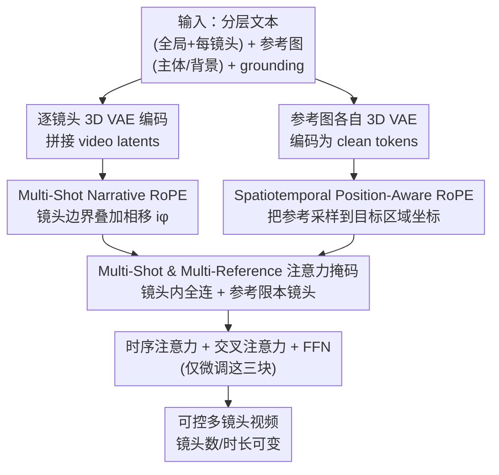

# MultiShotMaster: A Controllable Multi-Shot Video Generation Framework

**会议**: CVPR 2026  
**论文**: [CVF Open Access](https://openaccess.thecvf.com/content/CVPR2026/html/Wang_MultiShotMaster_A_Controllable_Multi-Shot_Video_Generation_Framework_CVPR_2026_paper.html)  
**代码**: 项目页 https://qinghew.github.io/MultiShotMaster （代码待确认）  
**领域**: 视频生成 / 可控生成 / 扩散模型  
**关键词**: 多镜头视频生成, RoPE, 参考注入, 叙事一致性, DiT

## 一句话总结
MultiShotMaster 在一个约 1B 参数的预训练单镜头 T2V 模型上，只靠改造两种 RoPE（叙事相移 + 时空定位）加一个注意力掩码，就实现了"镜头数/时长可变、每镜头独立文本、主体可指定位置与运动、背景可定制"的多镜头视频生成，且不引入额外 adapter，在文本对齐、跨镜头一致性、转场精度、叙事连贯性上全面超过 CineTrans / EchoShot / VACE / Phantom。

## 研究背景与动机

**领域现状**：当下视频生成在 DiT + 文本驱动的"单镜头高质量短片"上已经很强，可控性也扩展到了参考图、相机运动、物体轨迹等条件信号。但真实的影视作品是**多镜头叙事**：一段故事由若干镜头组成，靠运镜、角色互动、微表情来讲清剧情。

**现有痛点**：多镜头生成目前有两条主流路线，各有硬伤。一是"文本→关键帧→I2V"：先生成几张一致的关键帧，再用 I2V 把每个镜头补全，但稀疏关键帧覆盖不到只露脸几帧的配角和关键帧之外的场景，一致性漏风。二是"端到端整体生成"：沿时间维做 full attention 保持一致性，可镜头时长被钉死、镜头数受限。更要命的是——**两条路线都只能用文本驱动**，没法像导演那样指定"这个角色长这样、站在画面这个位置、做这个动作、背景是这个房间"。

**核心矛盾**：在 DiT 里所有图像 patch 被拍平成 token 拼在一起，靠 RoPE 这类位置编码维持时空顺序。原始 3D-RoPE 沿时间维分配**连续递增**的索引，于是模型**分不清"同一镜头内相邻帧"和"跨镜头边界的两帧"**——它会把镜头切换当成普通的画面渐变去插值，要么转不动、要么糊在一起。而要加可控性，传统做法是给每种控制信号挂一个独立 adapter，搬到多镜头场景会让网络更大、算力更贵。

**本文目标**：用一个不加 adapter、不破坏预训练注意力的轻量方案，同时拿下（1）镜头数与时长可变、（2）每镜头独立文本、（3）主体外观与场景定制、（4）主体运动控制。

**切入角度**：作者注意到 RoPE 本身就是"用旋转相位编码相对位置"的，那**镜头边界完全可以用一次额外的相位跳变来标记**，而**参考图要注入到哪个时空区域，也可以用 RoPE 把参考 token 的位置"对齐"到目标区域**——既然 3D-RoPE 让时空距离近的 token 互相 attend 得更强，那就人为给参考 token 安排上目标区域的坐标。

**核心 idea**：不动主干、不加 adapter，只在 RoPE 上做两处手脚——**用相移标记镜头边界（Narrative RoPE）、用区域坐标采样把参考注入到指定时空位置（Position-Aware RoPE）**，再配一个掩码约束信息流，就把单镜头模型"进化"成可控多镜头模型。

## 方法详解

### 整体框架
MultiShotMaster 的底座是一个约 1B 参数的单镜头 T2V 模型（3D VAE + T5 文本编码器 + 隐空间 DiT，用 Rectified Flow 训练，回归速度场）。它的改造思路是"在 in-context 序列里把多镜头视频、参考主体、背景全拼成一条 token 序列，再用 RoPE 和掩码把它们各归其位"。

具体的数据流是：每个镜头先**单独**过 3D VAE 编码（避免镜头边界的内容突变污染相邻镜头的隐变量），再把各镜头的 video latents 沿时间维拼接；参考图（主体、背景）也各自过 3D VAE 编码成 clean reference tokens，拼到 noised video latents 后面。在时序注意力里，**Multi-Shot Narrative RoPE** 给每个镜头叠加一个角度相移，让模型一眼认出哪里是镜头边界；**Spatiotemporal Position-Aware RoPE** 把参考 token 的 RoPE 坐标采样成目标区域（主体框、目标镜头），从而把参考内容"灌"到指定时空位置；最后用 **Multi-Shot & Multi-Reference Attention Mask** 把信息流卡住——镜头间视频 token 全连保全局一致，参考 token 只能被它所属镜头看到，杜绝串戏。训练只微调时序注意力、文本交叉注意力和 FFN。

### 关键设计

**1. Multi-Shot Narrative RoPE：用相位跳变给镜头边界打标记**

痛点直接而具体：原始 3D-RoPE 沿时间维给连续递增索引，模型把跨镜头边界的两帧当成同一镜头内的相邻帧，分不出"哪里该切镜头"。作者的做法是在不增加任何可训练参数的前提下，给第 $i$ 个镜头的所有 token 在时间维上叠加一个固定角度相移 $i\phi$。具体地，query 计算为

$$Q_i = \text{RoPE}\big((t + i\phi)\cdot f,\ h\cdot f,\ w\cdot f\big) \odot \tilde{Q}_i$$

key 同理；其中 $(t,h,w)$ 是时空位置索引，$\phi$ 是角度相移因子（默认 0.5），$f$ 是递减的基频向量，$\odot$ 表示对 $\tilde{Q}_i$ 做逐元素的复数旋转。妙处在于它**复用了 RoPE 本身的旋转性质**：同一镜头内仍是连续递增的相对位置（叙事时序保持不变），而每跨一个镜头就整体多转 $\phi$ 这么一个固定相位，相当于在相对位置空间里"插了一道缝"，模型立刻能感知到镜头切换。因为相移是直接加在位置索引上、不动注意力分数，所以**不干扰预训练注意力里的 token 交互**——这正是它和 CineTrans（直接改注意力分数、削弱跨镜头相关性，结果转场不明显、一致性差）的本质区别。镜头数和每镜头时长因此都能由用户自由配置。

配套地，文本侧采用**分层 prompt 结构**：一个全局 caption 描述主体外观与环境，加上每镜头 caption 描述该镜头的动作、背景、运镜。每个镜头把全局 caption 和自己的 per-shot caption 拼起来，再把该镜头的文本嵌入沿时间维复制到对应帧数，做 shot-level 交叉注意力。用户因此不用在每条镜头描述里重复角色长相，只需用 "Subject X" 这样的索引名引用。

**2. Spatiotemporal Position-Aware RoPE：用区域坐标采样把参考注入到指定时空位置**

这一招要解决的是"参考图怎么精准灌进画面的某个区域/某个镜头"。作者先把每张参考图单独 3D VAE 编码成 clean reference token，和 noised video token 拼接；时序注意力里干净的参考 token 会把视觉信息传给带噪的视频 token，完成注入。但光拼接不够——得让参考 token 和**目标区域**的视频 token 建立强关联。利用"3D-RoPE 让时空距离近的 token 互相 attend 更强"这个性质，作者**把参考 token 的 RoPE 坐标采样成主体框区域的坐标**：给定第 $t$ 帧主体框 $(x_1,y_1,x_2,y_2)$，由于框比参考 token 的空间分辨率 $(H,W)$ 小，就按

$$h^{ref} = y_1 + \frac{y_2 - y_1}{H}\cdot j,\quad w^{ref} = x_1 + \frac{x_2 - x_1}{W}\cdot k$$

（$j\in[0,H-1]$、$k\in[0,W-1]$）把参考的 RoPE 缩放映射到目标框内，再叠加同样的镜头相移 $i\phi$。这样主体就被"控制"出现在指定时空位置。**运动控制**则更巧：把主体 token 复制多份，给每份分配不同时空 RoPE（对应轨迹上不同时刻的位置），时序注意力把这些副本里编码的运动逐点传给对应时空的视频 token，最后各副本注意力后取平均。**多镜头场景定制**同理：把每个镜头首帧的 3D-RoPE 复制给该镜头的背景 token。这一设计的价值在于——参考注入、空间定位、运动控制三件事被统一在"采样 RoPE 坐标"这一个机制里，不需要为每种控制信号单独挂 adapter。

**3. Multi-Shot & Multi-Reference Attention Mask：卡住信息流，防止串戏与算力爆炸**

参考图和主体副本会让 in-context 序列变得很长，算力高，且存在大量不必要的交互：比如 Subject 0 只在第 2 镜头出现，但无约束的 token 拼接会让其它镜头也能访问到它。虽然 3D-RoPE 已经引导"区域指定的视频 token 优先 attend 对应参考"，但残余的小而非零的注意力权重仍会带来**内容泄漏**风险（不该出现的主体串到别的镜头）。作者据此设计了一个掩码：**所有多镜头视频 token 之间保持 full attention** 以维持全局一致；而**每个镜头只能访问属于自己镜头的参考 token**，反过来参考 token 也只能 attend 同镜头内的其它参考 token 与视频 token。这一掩码既保证了镜头内的参考注入聚焦、不串戏，又靠跨镜头视频全连维持了全局一致性，同时砍掉了无谓的注意力计算。

**4. 自动化多镜头多参考数据策展：从零造出带 grounding 的训练数据**

可控多镜头数据稀缺，作者搭了一条全自动流水线（图 3）来造数据。先从互联网爬长视频（电影、剧集、纪录片、烹饪、运动健身等多类型）；用 TransNet V2 检测转场、切成大量单镜头短片；再用一个能理解剧情的**场景分割模型**把同一场景的短片聚成一组（可能把横跨几十分钟的镜头归到同一场景），然后按"镜头数 1–5、帧数 77–308（15fps 下 5–20 秒）、优先取帧数多镜头多的样本"采样出多镜头视频，最终得到约 **235k 多镜头样本**。文本侧用 Gemini-2.5 两阶段生成分层 caption（先看整段视频出全局 caption、用 "Subject X" 命名各主体，再结合每镜头视频反推 per-shot caption），帮模型理解跨镜头主体一致性。参考图侧用 YOLOv11 + ByteTrack + SAM 逐镜头检测/跟踪/分割出主体（因为有转场，跟踪必须分镜头做），用 Gemini-2.5 按外观把各镜头的 track ID 合并成完整的跨镜头主体，并用 OmniEraser 擦掉前景得到干净背景。整条 pipeline 是这套可控能力能 train 起来的前提，而非可选附件。

### 损失函数 / 训练策略
底座沿用 Rectified Flow 的速度回归目标：

$$\mathcal{L}_{LCM} = \mathbb{E}_{\tau,\epsilon,z_0}\big[\,\|(z_1 - z_0) - v_\Theta(z_\tau,\tau,c_{text})\|_2^2\,\big]$$

训练分两阶段。**第一阶段**在 300k 单镜头数据上训练"时空指定参考注入"：采样带随机起点、1 秒间隔的稀疏 bounding box 序列（每个框 0.5 概率丢弃），让用户能用稀疏框轻松控主体。**第二阶段**在自建的多镜头多参考数据上训练，并随机以 0.5 概率分别丢弃主体/背景，从而支持文本、主体、背景、联合等多种驱动模式。作者还注意到上面这个全局目标偏向整体一致、会忽略细节，于是加了一个**跨镜头主体聚焦的后训练（post-training）**：给主体区域 2× loss 权重、背景 1×，既提升主体一致性，又让模型更好地理解主体在不同镜头间如何变化。推理时 CFG scale 取 7.5、DDIM 50 步，镜头数与时长均可灵活配置。

## 实验关键数据

### 实验设置
底座是约 1B 参数的单镜头 T2V，分辨率 384×672，叙事视频 77–308 帧 @15fps（5–20 秒）、每段 1–5 镜头。>77 帧的镜头用滑动窗口编解码以保持像素-隐空间对齐。32 张 GPU 训练，学习率 1e-5，batch size 1，相移因子 $\phi$ 默认 0.5。对比基线包括最新开源叙事多镜头方法 CineTrans、聚焦身份一致的多镜头肖像方法 EchoShot，以及把单镜头参考-to-视频方法 VACE / Phantom 当作"多次独立推理拼多镜头"的对照（基线均基于 Wan2.1-T2V-1.3B，480×832）。评测用 Gemini-2.5 设计 100 条多镜头 prompt，另构造 90 个参考注入案例（主体/背景/联合各 30）。

### 主实验（Table 1）
评测维度：文本对齐 TA（ViCLIP 文本-镜头相似度）、跨镜头一致性（ViCLIP 语义 + DINOv2 主体/场景一致性）、转场偏差（TransNet V2 检测转场与 GT 时间戳的帧数偏差，越低越好）、叙事连贯性（Gemini-2.5 打分）、参考一致性（生成主体/背景与参考的 DINO 相似度 + grounding mIoU）。

| 方法 | 文本对齐↑ | 语义一致↑ | 主体一致↑ | 场景一致↑ | 转场偏差↓ | 叙事连贯↑ |
|------|-----------|-----------|-----------|-----------|-----------|-----------|
| CineTrans | 0.174 | 0.683 | 0.437 | 0.389 | 5.27 | 0.496 |
| EchoShot | 0.183 | 0.617 | 0.425 | 0.346 | 3.54 | 0.213 |
| **Ours (w/o Ref)** | **0.196** | **0.697** | **0.491** | **0.447** | **1.72** | **0.695** |

可见在纯文本驱动的多镜头生成上，本文在全部 6 个指标上都领先；尤其转场偏差从 CineTrans 的 5.27 / EchoShot 的 3.54 降到 1.72，叙事连贯从 0.496 提到 0.695——印证了"用相移标记边界"比"改注意力分数压跨镜头相关"更能精准、显著地切镜头。

### 参考注入对比（Table 1 下半部）
| 方法 | 文本对齐↑ | 主体一致↑ | 场景一致↑ | 叙事连贯↑ | 参考-主体↑ | 参考-背景↑ | Grounding mIoU↑ |
|------|-----------|-----------|-----------|-----------|------------|------------|-----------------|
| VACE | 0.201 | 0.468 | 0.273 | 0.325 | 0.475 | 0.361 | ✗ |
| Phantom | 0.224 | 0.462 | 0.279 | 0.362 | 0.490 | 0.328 | ✗ |
| **Ours (w/ Ref)** | **0.227** | **0.495** | **0.472** | **0.825** | **0.493** | **0.456** | **0.594** |

VACE / Phantom 因为每个镜头独立推理，跨镜头主体/背景一致性差（场景一致仅 0.27 量级，本文 0.472），叙事连贯更是被拉开（0.825 vs 0.32–0.36）。同时只有本文支持 grounding（mIoU 0.594），能把主体注入到指定区域、背景注入到指定镜头——这是其它方法直接 ✗ 的能力。

### 关键发现
- **转场偏差是最能区分方法的指标**：CineTrans 改注意力分数导致转场不明显（5.27），本文用 RoPE 相移把转场偏差压到 1.41–1.72，说明"在位置编码上做手脚、不碰注意力"是更干净的转场控制方式。
- **叙事连贯性差距最大**：独立推理的 VACE/Phantom 只有 0.32–0.36，本文带参考时高达 0.825，量化了"端到端 in-context 一起生成"相对"逐镜头拼接"在讲故事上的压倒性优势。
- **加参考反而全面更好**：Ours(w/ Ref) 在文本对齐、跨镜头一致性、转场偏差上甚至略优于 Ours(w/o Ref)，说明参考注入与叙事控制不是互相拖累，而是协同的。
- **消融细节**：正文未给出独立的逐组件消融表（作者注明在附录），$\phi=0.5$ 为默认相移、主体 2× 的 post-training 权重等设计的单独贡献需查附录验证。

## 亮点与洞察
- **"改 RoPE 而非加 adapter"是全文最聪明的地方**：把镜头边界标记、参考空间定位、主体运动控制三件事都归约成"如何采样/平移 RoPE 坐标"，既零新增参数（相移）又复用预训练注意力，避免了传统多控制信号方案动辄堆 adapter、撑大网络的代价。
- **相位相移标记边界，物理直觉很漂亮**：RoPE 本来就是旋转编码，跨镜头多转一个固定相位 $i\phi$ 等于在相对位置空间"插缝"，模型自然学会"这里是新镜头"，且镜头内时序丝毫不受影响——一个改一行索引的改动撬动了"镜头数/时长可变"。
- **用 3D-RoPE 的"近则强 attend"性质做空间 grounding**：把参考 token 坐标缩放进主体框，让区域内视频 token 优先吸收对应参考，这个"借力打力"的注入方式可迁移到任何 DiT-based 的可控生成（如指定区域换装、局部重绘）。
- **运动控制用"多副本 + 不同 RoPE + 平均"实现**：不需要显式光流/轨迹网络，靠复制主体 token 并安排到轨迹各时刻位置，就把运动"种"进时空——思路可迁移到关键点/轨迹驱动的其它生成任务。

## 局限与展望
- **作者承认的运动-相机耦合**：方法只显式控制主体运动，相机位置仍由文本驱动。图 5 显示即便生成结果对齐了 grounding 信号，那也常是"相机和物体一起动"的副作用，主体运动与镜头运动解耦尚未解决，留作未来工作。
- **底座规模偏小、分辨率偏低**：仅约 1B 参数、384×672，对复杂场景、精细纹理、长时长（>20 秒）多镜头的可扩展性未验证；放大到主流 5B+/720p 模型后相移因子、掩码策略是否仍最优需要重调。
- **重度依赖外部模型造数据**：数据策展链路串了 TransNet V2、场景分割、YOLOv11、ByteTrack、SAM、OmniEraser、Gemini-2.5，任一环节的检测/跟踪/分割错误都会污染训练数据（如主体合并错、背景擦不干净），数据质量的稳健性缺乏定量分析。
- **缺正文消融**：相移因子取值、2× 主体 loss、注意力掩码各自的贡献都被放到附录，正文读者较难判断每个设计的边际收益；若想复现需补做组件级消融。

## 相关工作与启发
- **vs CineTrans**：CineTrans 通过给注意力分数加掩码矩阵来弱化跨镜头相关、在预设位置转场；本文改在 RoPE 上叠相移。区别在于 CineTrans 干扰了预训练注意力的 token 交互，导致转场不显著、跨镜头一致性差（转场偏差 5.27）；本文不碰注意力分数，转场更干净（1.72）且一致性更好。
- **vs EchoShot**：EchoShot 也用 RoPE 做镜头转场，但目标是多段肖像视频的身份一致，不追求叙事内容，因而服饰颜色等叙事细节会不一致、叙事连贯仅 0.213；本文同时管住主体/场景一致与叙事逻辑。
- **vs VACE / Phantom**：二者是单镜头参考-to-视频方法，套到多镜头只能逐镜头独立推理，跨镜头一致性只来自文本+参考、且保不住用户给的背景，无法 grounding；本文用统一的 in-context 序列 + 掩码一次生成多镜头，且支持时空 grounding。
- **vs ShotAdapter**：ShotAdapter 用可学习的 transition token 只与镜头边界帧交互来指示转场；本文用 RoPE 相移直接表达转场信号，无需额外可学习 token。

## 评分
- 新颖性: ⭐⭐⭐⭐⭐ "改两处 RoPE + 一个掩码"就统一了多镜头叙事控制与时空 grounding 参考注入，且零新增 adapter，切入点干净而有想象力。
- 实验充分度: ⭐⭐⭐⭐ 对比了 4 个有代表性的基线、设计了 6+ 个细致指标并全面领先，但正文缺独立组件消融（放在附录），稍减一星。
- 写作质量: ⭐⭐⭐⭐⭐ 动机推导（RoPE 分不清镜头边界）清晰，公式与图示配合到位，方法叙述自洽好读。
- 价值: ⭐⭐⭐⭐⭐ 导演级可控多镜头生成是内容创作的刚需，"改 RoPE 注入控制"的范式对 DiT-based 可控生成有很强的可迁移性。

<!-- RELATED:START -->

## 相关论文

- [\[CVPR 2026\] ShotDirector: Directorially Controllable Multi-Shot Video Generation with Cinematographic Transitions](shotdirector_directorially_controllable_multi-shot_video_generation_with_cinemat.md)
- [\[CVPR 2026\] Rethinking Position Embedding as a Context Controller for Multi-Reference and Multi-Shot Video Generation](rethinking_position_embedding_as_a_context_controller_for_multi-reference_and_mu.md)
- [\[CVPR 2026\] OneStory: Coherent Multi-Shot Video Generation with Adaptive Memory](onestory_coherent_multi-shot_video_generation_with_adaptive_memory.md)
- [\[CVPR 2026\] STAGE: Storyboard-Anchored Generation for Cinematic Multi-shot Narrative](stage_storyboard-anchored_generation_for_cinematic_multi-shot_narrative.md)
- [\[CVPR 2026\] HoloCine: Holistic Generation of Cinematic Multi-Shot Long Video Narratives](holocine_holistic_generation_of_cinematic_multi-shot_long_video_narratives.md)

<!-- RELATED:END -->
