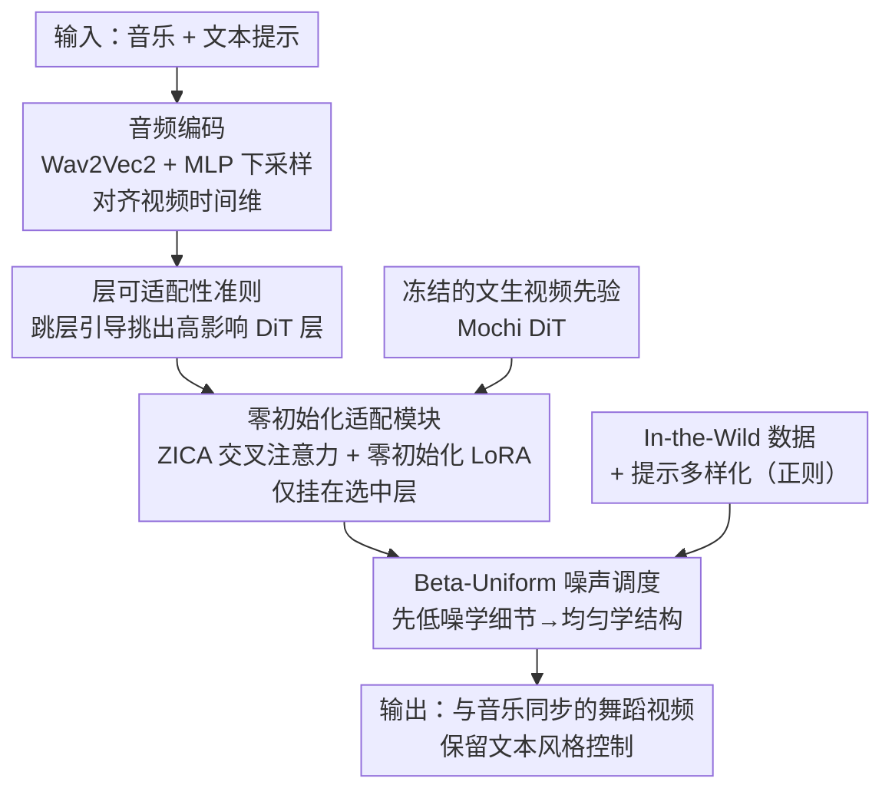

# MusicInfuser: Making Video Diffusion Listen and Dance

**会议**: CVPR 2026  
**arXiv**: [2503.14505](https://arxiv.org/abs/2503.14505)  
**代码**: 有（项目主页，University of Washington）  
**领域**: 视频生成 / 扩散模型 / 多模态  
**关键词**: 音乐驱动舞蹈生成、视频扩散适配、层可适配性、零初始化交叉注意力、先验保留

## 一句话总结
MusicInfuser 不从头训练音频-视频模型，而是给预训练文生视频扩散模型（Mochi）注入零初始化的音乐-视频模块，并用一个"层可适配性"准则只挑少数 DiT 层做交叉注意力适配，从而在单卡一天内让视频扩散模型"听音乐跳舞"，且保留原模型的文本控制与画质先验。

## 研究背景与动机
**领域现状**：音乐驱动舞蹈生成（music-to-dance）长期走"先生成骨架/SMPL 动作，再渲染"的路线，从早期的 HMM、图方法到近年的 Transformer、扩散模型（如 AIST++ 上的工作）。另一条邻近路线是音视频联合生成（如 MM-Diffusion），让音频和视频互相条件化。

**现有痛点**：① 骨架/动作捕捉路线要么依赖昂贵的 mocap，要么靠重建动作、容易出现漂浮/抖动伪影；更关键的是骨架表示**对舞蹈来说欠参数化**——它表达不了脊柱弯曲、轴向旋转、手部关节、头发与衣物的动态，这些恰恰是舞蹈的精髓。② 从头训练音视频生成模型时，"和音乐对齐的高质量舞蹈视频"远比一般无约束视频稀缺，数据不足导致质量差。

**核心矛盾**：想要直接生成舞蹈**视频**（而非中间骨架）来保留细腻动态，就得有海量音乐-舞蹈视频；但这类专用数据稀缺、且带偏置，直接训练既贵又会破坏生成质量。

**本文目标**：把"生成高质量舞蹈视频"这件事，拆成"复用预训练文生视频模型已有的人体运动/物理/编舞先验"+"高效地把音乐这一模态对齐进去而不破坏先验"两个子问题。

**切入角度**：作者的关键观察是——**文生视频模型其实已经会跳舞**。它在海量视频上训练，隐式学到了人体运动、风格变化、身体物理与编舞模式。那么与其从零学，不如把它"对齐"到音乐输入上。难点在于：专用舞蹈数据稀缺且有偏，全量微调会破坏先验。

**核心 idea**：用"零初始化的轻量适配模块 + 只挑对画质结构最有影响的少数层做适配"的方式，在保留先验的前提下，把音乐特征与舞蹈动作建立关联——无需任何动作数据，单 GPU 一天训完。

## 方法详解

### 整体框架
MusicInfuser 的输入是一段音乐 $\mathbf{a}$ 加一条文本提示 $\mathbf{c}$，输出是与音乐节拍/风格同步、且符合提示场景与风格的舞蹈视频。它在冻结的预训练文生视频去噪器 $D_\theta(\mathbf{x}\,|\,\mathbf{c};\sigma)$（Mochi）之上，加入一组可训练的适配参数 $\phi$，构成最终去噪器 $D_{\theta,\phi}(\mathbf{x}\,|\,\mathbf{c},\mathbf{a};\sigma)$，优化目标是在视频-字幕-音频联合分布 $p_{\text{mm}}$ 上的标准扩散重建损失，但只更新 $\phi$。

整条管线分四块协同：音频先经 Wav2Vec 2.0 + 浅层 MLP 下采样投影成与视频时间维对齐的音频 token；一个**层可适配性准则**离线挑出最该被适配的若干 DiT 层；只在这些层上挂**零初始化交叉注意力（ZICA）+ 零初始化 LoRA**，让音乐渐进地、稳定地融入；训练时用 **Beta-Uniform 噪声调度**先学细节后学结构，并掺入 in-the-wild 数据 + 提示多样化做正则。下面是数据/控制流：

### 关键设计

**1. 层可适配性准则：用"跳层引导"挑出最该被适配的 DiT 层**

直接给所有层都加交叉注意力有两个问题：计算开销大，而且在专业舞蹈这种低数据场景下会**破坏预训练去噪能力**（表 1 中 "All Layers" 反而掉点）。但穷举哪几层最该适配又不可行——48 层里挑 1/3 的组合数 $\binom{48}{16}>2\times10^{12}$。作者提出一个**建设性**而非破坏性的准则：不看"去掉某层后性能掉多少"，而是把某层**作为引导信号**来量化它的正向影响。具体地，用"完整模型"与"跳过第 $l$ 层的模型"之差构造跳层引导，对应隐式能量函数的导数：

$$\nabla_{\mathbf{x}}\mathcal{G}_l = \big(D_\theta^{L}(\mathbf{x}\,|\,\mathbf{c};\sigma) - D_\theta^{L\backslash\{l\}}(\mathbf{x}\,|\,\mathbf{c};\sigma)\big)/\sigma$$

其中 $L$ 是全层集，$D_\theta^{L\backslash\{l\}}$ 是跳过层 $l$ 的去噪器。然后用现成的视频评测指标度量"用该层做引导带来的视频改善量"，定义为该层的**层可适配性（layer adaptability）**。直觉是：越是和视频结构/感知质量内在相关的层，被排除并用作引导时改善越大；这些层正是适配音乐能有效影响运动与结构的位置。这样既无需为每种层组合单独训模型，又能避免适配时偏离学到的去噪流形（⚠️ 该可适配性的精确打分细节作者放在补充材料，以原文为准）。

**2. 零初始化适配模块（ZICA + LoRA）：让音乐渐进、稳定地融入而不扰动先验**

随机初始化的交叉注意力会一开始就偏移预测、破坏持续训练。**ZICA（Zero-Initialized Cross-Attention）**把输出投影矩阵 $\mathbf{W}_O$ 初始化为零，使交叉注意力起初等价于恒等映射，再随训练逐渐引入条件信息。设音频 token $\mathbf{A}$、视频 token $\mathbf{V}$，带输出投影的交叉注意力为：

$$\mathbf{Z} = \mathbf{V} + \mathbf{W}_O\,\text{softmax}\!\Big(\tfrac{\mathbf{V}\mathbf{W}_Q(\mathbf{A}\mathbf{W}_K)^\top}{\sqrt{d}}\Big)\mathbf{A}\mathbf{W}_V$$

因 $\mathbf{W}_O=\mathbf{0}$，初始 $\mathbf{Z}=\mathbf{V}$（恒等），$\mathbf{W}_O$ 离开零点的过程就是音频被逐步整合的过程。与之并行，注意力权重用**零初始化 LoRA** 适配——但作者强调图像模型常用的 rank 8–16 对视频 Transformer 不够（要捕捉时间依赖），所以用更高 rank（实现里 rank 64），因为建模复杂人体运动需要更高秩。ZICA 与 LoRA 都从"中性起点"渐进学习，共同把网络平滑地适配到新模态，而不在训练初期就冲掉先验。

**3. Beta-Uniform 噪声调度：先学高频细节、后学整体结构，保住运动物理先验**

常规扩散（含 LoRA 微调）训练时对噪声水平用均匀采样。但作者希望适配阶段**先专注低噪声水平**（对应高频细节），再逐步学更大尺度的结构成分，以保住预训练模型的去噪能力。于是把训练噪声分布 $\Sigma_{\text{train}}$ 从一个集中在低噪声的 Beta 分布，渐变到均匀分布。取 $\alpha=1$ 的 Beta 分布：

$$f(x;\alpha{=}1,\beta) = \frac{(1-x)^{\beta-1}}{B(1,\beta)},\quad 0\le x\le 1$$

当 $\beta>1$ 时概率质量集中在 0 附近（即多采小噪声尺度）；随 $\beta$ 衰减趋向 1，分布逐渐变平、趋近 $\text{Uniform}(0,1)$（$\lim_{\beta\to1}f=1$）。实现里初始 $\beta=3$、指数衰减到 $\beta=1$。这造成一个平滑过渡：先影响舞蹈的任务特定精细成分，再处理舞蹈动作的基础结构，从而保留人体运动一般物理的先验、产出更连贯的舞蹈序列。

**4. In-the-Wild 数据 + 提示多样化：抗过拟合、并迫使模型真正"听音乐"**

只在 AIST 这类高度受限的影棚数据上训练会降低泛化、导致模型退化。作者按 1:1 混入 15,799 段 YouTube in-the-wild 舞蹈片段（相机轨迹、光照、场景、风格更多样），作为正则防止过拟合到特定舞蹈模式或环境。配套的**提示多样化**：受限数据用带占位符的字幕模板，in-the-wild 视频用 VideoChat2 自动生成详细字幕；并**随机把一小部分详细字幕替换成极简字幕**，让适配网络学会"不依赖文本也能响应音乐"，从而强化音乐特征与动作的关联（代价是风格捕捉与提示解读之间的 trade-off，见表 4）。

### 损失函数 / 训练策略
目标函数是只对适配参数 $\phi$ 的扩散重建损失：

$$\mathcal{L}=\mathbb{E}_{(\mathbf{y},\mathbf{c},\mathbf{a})\sim p_{\text{mm}},\,\sigma\sim\Sigma_{\text{train}},\,\mathbf{n}\sim\mathcal{N}(\mathbf{0},\sigma^2\mathbf{I})}\big\|D_{\theta,\phi}(\mathbf{y}+\mathbf{n}\,|\,\mathbf{c},\mathbf{a};\sigma)-\mathbf{y}\big\|_2^2$$

关键超参与训练配置：base model 用 Mochi；单张 A100 训 4,000 步、约 20 小时；学习率 $1\text{e}{-4}$；LoRA rank 64；Beta-Uniform 初始 $\beta=3$ 指数衰减到 1；推理 CFG scale $\gamma_{\text{cfg}}=6.0$；音频编码器 Wav2Vec 2.0 + 浅 MLP 下采样对齐时间维。数据为 AIST 抽出的 2,378 段（按 AIST++ 划分不重叠音乐轨）+ 15,799 段 in-the-wild，1:1 混合，训练时随机采约 2.5 秒片段。

## 实验关键数据

评测用基于 Video-LLM 的自动指标（Qwen3-Omni 与 VideoLLaMA 2），联合评估视频+音频+语言对齐，分三组：**舞蹈质量**（风格对齐/节拍对齐/身体表征/动作真实感/编舞复杂度）、**视频质量**（成像质量/美学/整体一致性）、**提示对齐**（风格捕捉/创意解读/满意度），并与人评相关（Fig. 9）。

### 主实验

舞蹈质量对比（表 2，分越高越好；AIST GT 为上界参考）：

| 模型 | 模态 | 风格对齐 | 节拍对齐 | 动作真实感 | 编舞复杂度 | 舞蹈质量均值 |
|------|------|---------|---------|-----------|-----------|------------|
| AIST GT | A+V | 7.46 | 8.95 | 8.67 | 7.45 | 8.01 |
| MM-Diffusion | A+V | 7.16 | 8.56 | 7.05 | 7.53 | 7.16 |
| Mochi（base） | T+V | 7.20 | 8.34 | 7.68 | 7.82 | 7.70 |
| **MusicInfuser** | T+A+V | **7.56** | **8.89** | 8.24 | **7.90** | **7.95** |

视频质量对比（表 3）：

| 模型 | 模态 | 成像质量 | 美学 | 整体一致性 | 视频质量均值 |
|------|------|---------|------|-----------|------------|
| AIST GT | A+V | 9.76 | 8.17 | 9.77 | 9.23 |
| MM-Diffusion | A+V | 8.94 | 6.52 | 8.38 | 7.94 |
| Mochi（base） | T+V | 9.46 | 7.90 | 8.98 | 8.78 |
| **MusicInfuser** | T+A+V | 9.60 | 7.87 | 9.39 | **8.95** |

要点：在舞蹈质量上风格/节拍对齐与编舞复杂度均超过 MM-Diffusion 与 base Mochi，且舞蹈质量均值（7.95）逼近 GT（8.01）；视频质量均值（8.95）显著高于 MM-Diffusion（7.94），略高于 base（8.78）。

### 消融实验

层选择策略与组件消融（表 1，Overall 越高越好）：

| 配置 | 舞蹈质量均值 | 视频质量均值 | Overall |
|------|------------|------------|---------|
| **Ours（可适配性选层）** | **8.22** | **8.02** | **8.14** |
| All Layers（全层适配） | 7.86 | 7.71 | 7.80 |
| Evenly Distributed | 7.76 | 7.40 | 7.62 |
| First Layers | 8.16 | 7.71 | 7.99 |
| Middle Layers | 7.94 | 7.47 | 7.77 |
| Last Layers | 8.02 | 7.51 | 7.83 |
| Feature Addition（仿 ControlNet 直接加特征） | 8.04 | 7.71 | 7.92 |
| No Beta-Uniform 调度 | 8.01 | 7.71 | 7.89 |
| No In-the-Wild 数据 | 8.13 | 7.66 | 7.95 |
| No Cross-Attn 零初始化 | 8.03 | 7.82 | 7.95 |

提示对齐与基础提示比例的 trade-off（表 4）：

| 配置 | 风格捕捉 | 创意解读 | 满意度 | 提示对齐均值 |
|------|---------|---------|--------|------------|
| Mochi（base） | 7.98 | 9.04 | 9.55 | 8.86 |
| **MusicInfuser** | 7.80 | 9.27 | 9.80 | **8.96** |
| No In-the-Wild | 6.80 | 8.69 | 8.40 | 7.96 |
| Base Prompt 0% | 7.45 | 8.85 | 9.43 | 8.58 |
| Base Prompt 100% | 7.33 | 9.06 | 9.36 | 8.58 |

### 关键发现
- **选层准则是最大贡献点**：基于层可适配性挑层（Overall 8.14）不仅胜过均匀/首/中/末层等启发式，甚至**超过适配所有层**（7.80）——证明"全量适配反而在低数据下破坏先验"，而正向影响函数挑层是高性能适配的关键。
- **ZICA 的零初始化对画质至关重要**：去掉交叉注意力零初始化后视频质量明显下降（视频质量均值 7.82、Overall 仅 7.95），印证渐进恒等式融入比随机初始化更稳。
- **Feature Addition（仿 ControlNet 直接加音频特征）整体逊于 ZICA**（7.92 vs 8.14），说明交叉注意力式条件化优于简单空间相加。
- **去掉 in-the-wild 数据时提示对齐崩得最狠**：风格捕捉从 7.80 掉到 6.80、满意度从 9.80 掉到 8.40，说明野外数据对泛化与提示遵循是强正则。
- **Beta-Uniform 调度**主要改善身体表征与动作真实感；去掉后 Overall 从 8.14 降到 7.89。
- **音乐响应性可控**：把音频加速 1.25× / 减速 0.75×，生成动作的节奏随之变化、且音调变化带来动态性改变，说明模型真捕捉到了"音乐速度↔动作动态"的关系；换随机种子能在同一音乐+提示下产出不同编舞，证明不是死记硬背特定曲目。

## 亮点与洞察
- **"建设性"的层重要性度量**：不靠"删层看掉多少分"（破坏性、易 OOD），而用"把层当引导看带来多少改善"（建设性、可用现成视频指标离线预计算）。这种把单层当 guidance 信号、用隐式能量函数导数刻画影响的思路，可迁移到任何"在大模型上挑哪些层做适配/编辑"的问题。
- **"预训练视频模型已经会跳舞"这一视角**：把音乐驱动舞蹈从"生成动作再渲染"重构为"对齐已有视频先验"，绕开骨架欠参数化与 mocap 成本，直接拿到脊柱、手部、头发、衣物等细腻动态。
- **两个零初始化模块的统一哲学**：ZICA 与零初始化 LoRA 都从恒等/中性起点渐进学习，是"在不破坏先验的前提下加新模态"的可复用范式；视频场景下 LoRA 需要远高于图像的 rank（64）这一经验也很实用。
- **单卡一天、无需任何动作数据**就把一个文生视频模型改造成音乐同步舞蹈生成器，工程性价比极高。

## 局限性 / 可改进方向
- **依赖底座先验**：方法本质是"对齐"而非"学习"舞蹈，若底座视频模型（Mochi）本身不擅长某类人体运动或风格，适配也难凭空补出。
- **评测高度依赖 Video-LLM 指标**：舞蹈质量/视频质量/提示对齐都用 Qwen3-Omni、VideoLLaMA 2 打分，虽与人评相关，但 LLM 评测的绝对分值与细粒度区分力存疑；节拍对齐等是否真"逐拍同步"缺少更硬的客观度量。
- **层可适配性的精确定义在补充材料**：正文只给了跳层引导公式 $\nabla_{\mathbf{x}}\mathcal{G}_l$，"改善量→adaptability 分数"的具体算法未在正文展开（⚠️ 以原文/补充材料为准）。
- **片段较短、长时序与多人编舞受底座限制**：训练采约 2.5 秒片段、泛化到约 9 秒长视频，更长时序与多人复杂编舞的稳定性仍待验证。
- 改进方向：把"建设性选层"用于更多模态注入；引入显式节拍/音乐结构监督强化逐拍同步；探索更强底座或多底座融合。

## 相关工作与启发
- **vs MM-Diffusion（音视频联合生成）**：MM-Diffusion 从头训练双向音视频生成；本文不从头训，而是对齐预训练文生视频先验，故在视频质量（8.95 vs 7.94）与多数舞蹈指标上更优，且无需大规模音视频配对数据。
- **vs 骨架/SMPL 路线（AIST++ 等动作生成）**：传统路线先生成骨架再渲染，受限于欠参数化与 mocap 成本、易抖动；本文直接生成视频，保留脊柱弯曲、手部关节、头发与衣物动态等细腻信息，且无需任何动作数据。
- **vs base Mochi（纯文生视频）**：Mochi 有运动先验但不听音乐；MusicInfuser 在其上挂 ZICA+LoRA 注入音乐条件，既加上音乐同步又几乎不损画质（视频质量 8.95 vs 8.78），还略升提示对齐（8.96 vs 8.86）。
- **vs ControlNet 式特征相加**：Feature Addition 直接把音频特征空间扩展后加到对应帧，整体逊于 ZICA 的交叉注意力条件化（Overall 7.92 vs 8.14）。

## 评分
- 新颖性: ⭐⭐⭐⭐⭐ "建设性层可适配性 + 零初始化双模块 + Beta-Uniform 调度"的组合把音乐驱动舞蹈重构为"对齐视频先验"，视角新且自洽。
- 实验充分度: ⭐⭐⭐⭐ 三组指标 + 多种层选择/组件消融 + 人评相关 + 速度/泛化分析较完整；但客观节拍同步度量与更长时序验证偏弱。
- 写作质量: ⭐⭐⭐⭐ 动机—方法—消融逻辑清晰，公式到位；部分关键细节（adaptability 打分）下放补充材料略影响自洽阅读。
- 价值: ⭐⭐⭐⭐⭐ 单卡一天、无需动作数据即可把文生视频模型改造成音乐同步舞蹈生成器，工程与思路双重可复用。

<!-- RELATED:START -->

## 相关论文

- [\[ICCV 2025\] X-Dancer: Expressive Music to Human Dance Video Generation](../../ICCV2025/video_generation/x-dancer_expressive_music_to_human_dance_video_generation.md)
- [\[CVPR 2025\] MotiF: Making Text Count in Image Animation with Motion Focal Loss](../../CVPR2025/video_generation/motif_making_text_count_in_image_animation_with_motion_focal_loss.md)
- [\[CVPR 2026\] Generative Neural Video Compression via Video Diffusion Prior](generative_neural_video_compression_via_video_diffusion_prior.md)
- [\[CVPR 2026\] RFDM: Residual Flow Diffusion Models for Video Editing](rfdm_residual_flow_diffusion_models_for_video_editing.md)
- [\[CVPR 2026\] VMonarch: Efficient Video Diffusion Transformers with Structured Attention](vmonarch_efficient_video_diffusion_transformers_with_structured_attention.md)

<!-- RELATED:END -->
