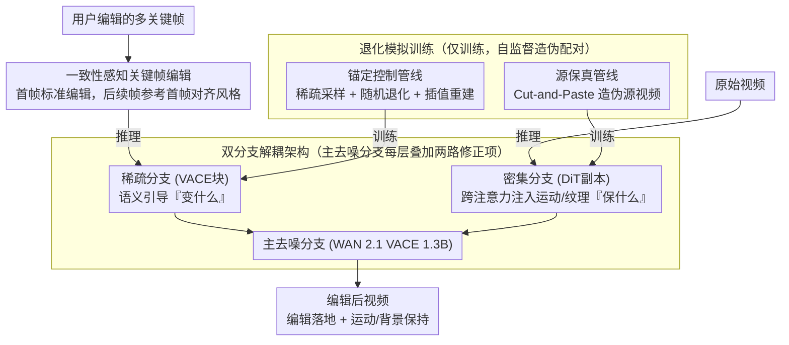

# NOVA: Sparse Control, Dense Synthesis for Pair-Free Video Editing

**会议**: CVPR 2026  
**arXiv**: [2603.02802](https://arxiv.org/abs/2603.02802)  
**代码**: [https://github.com/WeChatCV/NovaEdit](https://github.com/WeChatCV/NovaEdit)  
**领域**: 图像生成 / 视频编辑  
**关键词**: 无配对视频编辑, 双分支架构, 稀疏控制, 退化模拟训练, 多关键帧

## 一句话总结
提出 NOVA，首次形式化"稀疏控制、密集合成"范式用于视频编辑：稀疏分支从用户编辑的多关键帧提供语义引导，密集分支从原始视频注入运动和纹理信息；配合退化模拟训练策略实现无需配对数据的学习，在编辑保真度、运动保持和时序一致性上全面超越现有方法。

## 研究背景与动机

**领域现状**：扩散模型驱动的视频编辑方法发展迅速。数据驱动方法（Senorita-2M、VACE）需要大规模配对数据；首帧引导方法（AnyV2V、I2VEdit）将编辑从第一帧传播到整个视频，依赖运动补偿。

**现有痛点**：(a) 配对视频数据极难获取，合成数据含伪影影响泛化；(b) 仅依赖首帧的方法在相机/物体大运动下出现结构漂移；(c) 全局编辑效果尚可但**局部编辑**（特定区域修改）普遍失败——背景不一致、编辑区域伪影严重。

**核心矛盾**：控制信号（what to change）和合成信号（what to preserve）被耦合在同一路径中，模型难以区分"变什么"和"保什么"。

**本文目标**：解耦控制与合成，在无配对数据条件下实现高质量视频编辑。

**切入角度**：多关键帧提供更强的时空锚点，而原始视频本身就是最好的运动/纹理参考。

**核心 idea**：稀疏分支编码多编辑关键帧做语义引导，密集分支编码原始视频做运动/纹理注入，退化模拟实现自监督训练。

## 方法详解

### 整体框架
NOVA 要解决的是无配对视频编辑：用户只在少数几个关键帧上画出想要的改动，模型就得把这个改动平滑地铺满整段视频，同时保住原视频的运动轨迹和未编辑区域。它把这件事拆成两条互不打架的信息流——一条「稀疏控制」流告诉模型要变成什么样，一条「密集合成」流告诉模型要保住什么。整个网络建在 WAN 2.1 VACE 1.3B 之上：一个主去噪分支负责实际出图，旁边挂一个稀疏分支（VACE 块）注入用户编辑过的关键帧，再挂一个密集分支（DiT 副本）从原始视频里抽运动与纹理，两路在每一层加回主分支。训练时基座全部冻结，只放开新加的跨注意力模块，所以代价很小。两路分支的输入在训练和推理时来源不同：训练时由退化模拟管线自监督造出，推理时稀疏分支由一致性感知关键帧编辑提供、密集分支直接喂原始视频。

### 关键设计

**1. 双分支解耦架构：把「变什么」和「保什么」拆到两条独立路径**

以往方法（如 VACE）的痛点在于控制信号和合成信号挤在同一条路上，模型分不清哪些信息是该改的、哪些是该留的，局部编辑时经常背景跟着一起乱。NOVA 的做法是在主分支的每一层 $l$ 同时叠加两路修正项：

$$\boldsymbol{z}_m^{(l)} \leftarrow \boldsymbol{z}_m^{(l)} + \underbrace{\mathcal{S}^{(l)}(\boldsymbol{z}_m^{(l)}, \boldsymbol{r})}_{\text{稀疏控制}} + \underbrace{\mathcal{D}^{(l)}(\boldsymbol{z}_m^{(l)}, \boldsymbol{z}_d^{(l)})}_{\text{密集合成}}$$

稀疏分支 $\mathcal{S}$ 用 VACE 块把退化后的关键帧序列 $\boldsymbol{r}$ 编码进来，提供「目标长什么样」的语义引导；密集分支 $\mathcal{D}$ 则不是简单地把原视频特征加进去，而是用一个可训练的跨注意力——主分支当 Query，密集分支特征 $\boldsymbol{z}_d^{(l)}$ 当 Key/Value。这个 Query/KV 的安排是关键：直接相加会让密集特征硬生生盖住编辑结果，而跨注意力让主分支「按需查询」，只去取它当下需要的那部分运动和纹理，编辑区域不受干扰。

**2. 退化模拟训练：没有配对数据，就自己造出「编辑前后」的伪配对**

配对视频数据几乎拿不到，合成的又带伪影。NOVA 干脆只用单段干净视频，靠两条人为退化管线把监督信号造出来，让模型在「修复退化」的过程中学会真正的编辑能力。

锚定控制管线（Anchored Control Pipeline）负责喂稀疏分支：从目标视频里稀疏采几个关键帧，对它们随机施加退化（高斯模糊、仿射变换等）来模拟真实编辑会带来的伪影，

$$\hat{\boldsymbol{x}}_{k_i} = (\boldsymbol{1}-\boldsymbol{b}_{k_i})\odot\boldsymbol{x}_{k_i} + \boldsymbol{b}_{k_i}\odot\mathcal{D}_{aug}(\boldsymbol{x}_{k_i})$$

其中 $\boldsymbol{b}_{k_i}$ 是退化区域的掩码，退化后再对关键帧做线性插值重建出完整序列，作为稀疏分支的输入。这样模型被迫学会从带伪影的稀疏锚点里恢复出干净、时序连贯的结果。源保真管线（Source Fidelity Pipeline）则负责喂密集分支：对目标视频随机做 Cut-and-Paste，贴进无关内容 $\boldsymbol{y}_t$ 造出一个「伪源视频」，

$$\tilde{\boldsymbol{x}}_t = \boldsymbol{m}_t\odot\boldsymbol{y}_t + (1-\boldsymbol{m}_t)\odot\boldsymbol{x}_t$$

逼着模型学会从密集分支里把真正的运动和背景恢复出来，而不是无脑复制。两条管线共同支撑一个标准去噪目标 $\mathcal{L} = \mathbb{E}[\|\epsilon - \epsilon_\theta(\boldsymbol{z}_t, t, \tilde{\mathcal{X}}, \hat{\mathcal{X}})\|_2^2]$，整套训练完全自监督。

**3. 一致性感知关键帧编辑：让多关键帧之间不打架**

推理时用户要编辑的关键帧不止一张，如果每张独立去编辑，风格、色调、细节都会各走各的，铺回视频后就是闪烁。NOVA 用 FLUX Kontext 来编辑关键帧，但只让第一帧做标准编辑，之后每一张关键帧都把第一帧的编辑结果 $\boldsymbol{x}_{k_0}^{edit}$ 一并喂进去当参考：

$$\boldsymbol{x}_{k_i}^{edit} = \text{FLUX}(\boldsymbol{x}_{k_i}, \boldsymbol{x}_{k_0}^{edit}, \boldsymbol{m}_{k_i}, \mathcal{P})$$

这样所有关键帧都向同一个「样板」对齐，编辑风格在帧间保持一致，喂给稀疏分支的锚点本身就是协调的，最终视频自然不闪。

### 一个完整示例
拿一段「人物走过街道、要把红色外套换成蓝色」的视频走一遍：模型先按间隔 10 帧抽出若干关键帧，用 FLUX Kontext 编辑第一帧把外套改成蓝色，后续关键帧都参考这张第一帧结果来改，保证蓝色的色调一致——这些编辑后的关键帧线性插值成完整序列，进稀疏分支。与此同时，原始视频（人物的走路姿态、街道背景）进密集分支。去噪时主分支每层一边从稀疏分支「问」外套该是什么颜色、什么轮廓，一边从密集分支「问」人物当前帧的姿态和背景纹理——前者保证编辑落地、后者保证运动和背景不变。即便密集分支拿到的输入被模糊过，跨注意力仍能引导出比模糊输入更清晰的背景（消融里 BG-SSIM 仍达 0.910），说明它做的是带理解的合成而非贴图。

### 损失函数 / 训练策略
- 仅训练新增的跨注意力模块，基座冻结
- 5000 高质量视频（Pexels），分辨率 832×480，帧长 81
- AdamW, lr=1e-4, 8000 步
- 推理使用关键帧间隔 10 帧

## 实验关键数据

### 主实验

| 方法 | 参数 | 逐视频微调 | SR↑ | TC↑ | FC↑ | BG-SSIM↑ | MS↑ | BC↑ |
|------|------|-----------|-----|-----|-----|----------|-----|-----|
| AnyV2V | 1.3B | ✗ | 0.75 | 0.918 | 0.840 | 0.858 | 0.973 | 0.939 |
| I2VEdit | 1.3B | ✓ | 0.83 | 0.931 | 0.846 | 0.900 | 0.991 | 0.941 |
| VACE (多帧) | 1.3B | ✗ | 0.90 | 0.928 | 0.840 | 0.913 | 0.989 | 0.940 |
| Senorita-2M | 5B | ✗ | 0.86 | 0.919 | 0.853 | 0.921 | 0.989 | 0.953 |
| **NOVA** | **1.3B** | **✗** | **0.93** | **0.935** | **0.882** | 0.917 | **0.993** | 0.946 |

### 消融实验

| 配置 | TC↑ | FC↑ | BG-SSIM↑ | 说明 |
|------|-----|-----|----------|------|
| Full NOVA | 0.935 | 0.882 | 0.917 | 完整模型 |
| w/o Dense Branch | 0.920 | 0.841 | 0.807 | 背景出现幻觉 |
| w/o 一致性推理 | 0.92 | 0.85 | 0.88 | 独立编辑风格不一致 |
| 模糊输入密集分支 | 0.933 | 0.878 | 0.910 | 仍能恢复细节 |

### 关键发现
- NOVA 成功率 93%，比需要微调的 LoRA-Edit（80%）高 13%
- 密集分支是背景保持的关键：去掉后 BG-SSIM 从 0.917 → 0.807
- 即使密集分支输入被模糊退化，模型仍能恢复比模糊输入更清晰的背景——说明密集分支做的是引导式合成而非简单复制
- 关键帧间隔在 8-20 范围内鲁棒，不过拟合到训练间隔 10
- 更换编辑模型（FLUX→Qwen-Image-Edit）性能变化小，说明框架通用

## 亮点与洞察
- **稀疏/密集解耦**是关键范式创新：首次明确将视频编辑中的控制和合成分离到独立路径。这个架构思想可推广到图像编辑、3D 编辑等领域
- **退化模拟训练**巧妙利用未配对数据实现自监督：通过模拟编辑伪影和背景不匹配让模型学习修复它们
- **密集分支的引导式合成**：实验证明它不是简单复制而是带物理理解的生成——这对理解扩散模型的能力很有启发

## 局限与展望
- 性能受编辑关键帧质量影响，当前图像编辑模型在复杂编辑上仍有局限
- 仅用 5000 视频训练，规模受限
- 未支持文本驱动的全局风格迁移编辑

## 相关工作与启发
- **vs VACE**: 统一框架但控制和合成耦合；NOVA 解耦后效果更好
- **vs I2VEdit/LoRA-Edit**: 需逐视频微调 LoRA，不可扩展；NOVA 无需微调
- **vs Senorita-2M**: 5B 参数+大规模配对数据；NOVA 1.3B+无配对即超越

## 评分
- 新颖性: ⭐⭐⭐⭐⭐ 稀疏控制密集合成范式首次形式化，退化模拟训练策略精巧
- 实验充分度: ⭐⭐⭐⭐ 多基线+多指标+用户研究+消融
- 写作质量: ⭐⭐⭐⭐ 问题拆解清晰，架构设计动机充分
- 价值: ⭐⭐⭐⭐⭐ 为视频编辑提供了可扩展的无配对训练框架

<!-- RELATED:START -->

## 相关论文

- [\[CVPR 2026\] When to Lock Attention: Training-Free KV Control in Video Diffusion](when_to_lock_attention_training-free_kv_control_in_video_diffusion.md)
- [\[CVPR 2026\] FlowDirector: Training-Free Flow Steering for Precise Text-to-Video Editing](flowdirector_training-free_flow_steering_for_precise_text-to-video_editing.md)
- [\[ICML 2026\] Lightning Unified Video Editing via In-Context Sparse Attention](../../ICML2026/video_generation/lightning_unified_video_editing_via_in-context_sparse_attention.md)
- [\[CVPR 2026\] DreamShot: Personalized Storyboard Synthesis with Video Diffusion Prior](dreamshot_storyboard_synthesis.md)
- [\[CVPR 2025\] Unified Dense Prediction of Video Diffusion](../../CVPR2025/video_generation/unified_dense_prediction_of_video_diffusion.md)

<!-- RELATED:END -->
