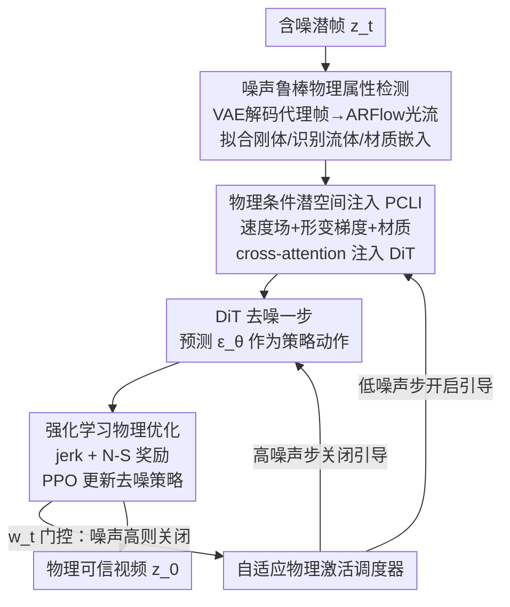

# NS-Diff: Fluid Navier-Stokes Guided Video Diffusion via Reinforcement Learning

**会议**: CVPR 2026  
**论文**: [CVF Open Access](https://openaccess.thecvf.com/content/CVPR2026/html/Deng_NS-Diff_Fluid_Navier-Stokes_Guided_Video_Diffusion_via_Reinforcement_Learning_CVPR_2026_paper.html)  
**领域**: 视频生成 / 扩散模型 / 强化学习  
**关键词**: 视频扩散, 物理可信性, Navier-Stokes, 强化学习, PPO

## 一句话总结
NS-Diff 把视频扩散的去噪轨迹重新表述成一个"物理约束的马尔可夫决策过程"，在 DiT 的潜空间里检测刚体/流体区域、注入速度场与形变梯度，再用 PPO 把"刚体最小 jerk + 流体简化 Navier-Stokes"当作奖励来微调去噪策略，从而在不依赖物理仿真和人工标注的前提下让生成视频的运动更符合物理规律（jerk 误差降 43%、流体散度降 33%、FVD 提升 22.7%）。

## 研究背景与动机
**领域现状**：以 SORA、OpenSora2、Wan2.1 为代表的扩散视频生成模型在视觉保真度和长程一致性上已经很强，画面逼真、纹理细腻。

**现有痛点**：但"看起来对"不等于"动起来对"。这些模型经常生成物理上不成立的运动——刚性物体（如塑料椅子）像软体一样形变、物体凭空出现/消失/分裂/合并、沙子和水流的运动违反连续性。视觉质量再高，这类违反力学常识的瑕疵依然会暴露生成内容的"假"。

**核心矛盾**：把物理塞进生成模型有两条老路，但都不好走。一条是像 VideoJam 那样从视频里"学"运动表征，但不强制任何物理定律，约束太软；另一条是像 Phy3DGen、PhysDiff、PhysGen 那样显式建模力学/做可微仿真，但需要昂贵的仿真数据或人工预定义约束（外力、边界条件），泛化性差、开销大。本质矛盾是：**要么约束太弱起不到作用，要么约束太重依赖仿真无法泛化**。

**本文目标**：在不跑昂贵流体仿真、不要物理标注的前提下，给扩散去噪过程注入"轻量但有效"的物理约束，同时覆盖刚体和流体两类动力学，并顺带抑制物体凭空出现/消失这类一般性物理违例。

**切入角度**：作者注意到强化学习擅长"在没有预定义仿真的情况下优化结构化行为、强制约束"。如果把去噪的每一步看成一次决策，把"物理是否可信"当成奖励，就能用策略梯度直接把物理偏好刻进去噪器，而不必显式求解流体方程。

**核心 idea**：把扩散去噪轨迹重写成物理约束 MDP，用 PPO 优化去噪策略，奖励由"刚体最小 jerk 惩罚 + 流体简化 N-S 散度/平滑惩罚"构成——**用可微的轻量物理代理项当奖励，替代昂贵的物理仿真**。

## 方法详解

### 整体框架
NS-Diff 建立在预训练的 DiT 视频扩散骨干（OpenSora2）之上，整条流水线围绕一个核心重述展开：**把 $T$ 步去噪过程看成一个物理约束的马尔可夫决策过程（MDP）**。每个去噪步的状态 $s_t$ 是带物理属性（速度、散度、形变线索）增广的噪声潜变量 $z_t$；动作 $a_t$ 是 DiT 预测的去噪方向 $\epsilon_\theta(z_t,t)$，决定 $z_t\to z_{t-1}$；奖励 $\mathcal{J}_t$ 是一个鼓励物理可信运动的标量，由刚体 jerk 惩罚和流体不可压缩惩罚组成。

围绕这个 MDP，方法分三个核心组件 + 一个调度器：先从含噪潜帧里**检测**刚体/流体区域并估计运动（物理属性检测），把检测到的速度场/形变梯度/材质嵌入通过 cross-attention **注入**回 DiT 的中间特征（物理条件潜空间注入 PCLI），再用 PPO 以物理奖励**微调**去噪策略（强化学习优化）。由于早期去噪步噪声太大、运动估计不可靠，作者额外加了一个自适应激活调度器，只在噪声较低、估计可信的时间步才打开物理引导。

### 关键设计

**1. 噪声鲁棒的物理属性检测：在含噪潜空间里也能估出刚体/流体区域**

第一个痛点是：物理引导要先知道"哪里是刚体、哪里是流体、各处怎么动"，但去噪过程发生在潜空间且中间帧噪声很大，直接把光流估计器 ARFlow 套到 RGB 帧上根本行不通。作者设计了一个**混合潜空间—解码运动估计方案**：在选定的去噪步把潜变量 $z_t$ 用骨干自带的 VAE 解码器解成低分辨率 RGB 代理帧 $\hat{x}_t=\text{Decoder}(z_t)$，这样既保留了足够做光流的空间结构、又省算力，再用 ARFlow 在相邻代理帧间算光流 $\mathbf{D}_t=\text{ARFlow}(\hat{x}_{t+1},\hat{x}_t)$。为适配"部分去噪、带噪"的帧，他们用扩散方差表加高斯噪声合成退化样本，微调 ARFlow 的最后一级 refinement。

拿到光流后还要做三件事把"运动"翻译成"物理区域"。先用全局单应 $\mathbf{H}_t$ 做相机运动补偿，去掉相机自身平移/旋转引入的假运动：$\mathbf{D}_t(\mathbf{p})=\mathbf{H}_t\mathbf{p}-\mathbf{p}$；再用 $(2K{+}1)$ 帧（$K{=}2$）时间滤波抑制抖动。**刚体检测**用仿射拟合：对每个 patch 解 $\mathbf{D}_t(u,v)\approx\mathbf{A}\mathbf{p}_{uv}+\mathbf{b}$，因为真正的平面刚体运动（含纯平移，$\mathbf{A}=\mathbf{I}$）残差应接近零，于是用残差 $\mathcal{L}_{\text{rigid}}(P)$ 定义刚度分数 $\gamma(P)=\exp(-\beta\mathcal{L}_{\text{rigid}}(P))$，$\gamma(P)>0.9$ 的块判为刚体。**流体识别**则看散度和旋度：满足 $(\nabla\cdot\tilde{\mathbf{D}}_t)^2+(\nabla\times\tilde{\mathbf{D}}_t)^2>\tau_{\text{fluid}}$ 的区域判为流体（捕捉局部发散或打旋的流动）。最后对每个块用小 MLP 预测材质类型分布 $\mathbf{q}_t^{(i)}=\text{Softmax}(\text{MLP}_{\text{type}}(\mathbf{f}_t^{\text{patch},(i)}))$ 并映射成可学习材质嵌入 $e_t^{\text{mat},(i)}$，供后续注入。这一套之所以有效，是因为它把"潜空间不可直接估流"这个死结，用"解码成低分代理帧"巧妙绕开，又用仿射残差/散度旋度这种几何判据把刚体和流体干净地分开。

**2. 物理条件潜空间注入 PCLI：让物理线索按空间对齐地回灌进 DiT**

光检测出物理属性还不够，得让 DiT 在去噪时"看得到"这些线索。PCLI 把上一步算出的运动和材质打包成逐 patch 描述子：速度场 $\mathbf{v}_t^{(k)}=(\tilde{\mathbf{D}}_t^{k+1}-\tilde{\mathbf{D}}_t^k)/\Delta\tau$（光流的时间导数）、形变梯度 $\mathbf{G}_t=\nabla\tilde{\mathbf{D}}_t$（运动的空间 Jacobian）、以及材质嵌入 $e_t^{\text{mat},(i)}$。三者按与 DiT tokenizer 一致的 $16\times16$ 网格拼成 $s_t^{(i)}=[\mathbf{v}_t^{(i)},\mathbf{G}_t^{(i)},e_t^{\text{mat},(i)}]$，再经两层 MLP 投到 $d_p{=}128$ 维物理潜表征 $\mathbf{p}_t$。

注入用的是 cross-attention：DiT 的视觉特征 $\mathbf{f}_t$ 出 query，物理潜表征 $\mathbf{p}_t$ 出 key/value，$\text{Attn}(\mathbf{f}_t,\mathbf{p}_t)=\text{Softmax}\!\big(\tfrac{(\mathbf{f}_t W_Q)(\mathbf{p}_t W_K)^\top}{\sqrt{d_p}}\big)(\mathbf{p}_t W_V)$，输出归一化后以缩放系数 $\mu{=}0.1$ 加性融合。关键是再套一个随去噪进度变化的自适应门 $g_t=\text{Sigmoid}(\text{MLP}_{\text{gate}}(t/T))$，得到 $\mathbf{f}_t'=\mathbf{f}_t+g_t\,\mu\,\text{Attn}(\mathbf{f}_t,\mathbf{p}_t)$。因为物理描述子和视觉 token 都按同一套 $16\times16$ 网格切分，二者天然一一空间对齐，注入是"哪块运动注哪块特征"，避免了全局拼接式条件那种空间错位；而 $\mu{=}0.1$ 的小缩放和门控保证物理只是温和地"修正"而非粗暴地覆盖去噪。

**3. 强化学习物理优化：把物理定律当奖励，用 PPO 微调去噪策略**

这是全文的灵魂。前面注入只是"让模型看到"物理，要真正"让运动服从"物理，作者把去噪器 $\epsilon_\theta$ 参数化成随机策略 $\pi_\theta(a_t|s_t)=\mathcal{N}(a_t;\epsilon_\theta(s_t,t),\sigma_p^2\mathbf{I})$：动作就是预测的噪声残差，从以去噪器输出为均值的高斯里采样，替代 DDPM 里确定性的噪声预测，使状态转移变成策略相关的随机过程。奖励则把两类物理约束写成可微代理项。

刚体用**最小 jerk 先验**——jerk 是加速度的变化率 $\mathbf{J}_t^k=(\mathbf{v}_t^{k+2}-2\mathbf{v}_t^{k+1}+\mathbf{v}_t^k)/(\Delta\tau)^2$，惩罚 $\mathcal{L}_{\text{rigid}}=\tfrac{1}{|\mathcal{R}_t|}\sum_{\mathcal{R}_t}\|\mathbf{J}_t\|_2^2$ 压制刚体运动里非物理的高频抖动和时间断裂。流体用**简化 Navier-Stokes 惩罚**：

$$\mathcal{L}_{\text{fluid}}=\frac{1}{|\mathcal{F}_t^k|}\sum_{\mathcal{F}_t^k}\Big(\lambda_p\|\nabla(\nabla\cdot\mathbf{v}_t^k)\|_2^2+\|\nabla\cdot\mathbf{v}_t^k\|_2^2+\nu\|\nabla^2\mathbf{v}_t^k\|_2^2+\eta\|\mathbf{v}_t^k\cdot\nabla\mathbf{v}_t^k\|_2^2\Big)$$

四项依次是：$\lambda_p$ 项作为压力修正的可微代理（最小化散度的空间梯度，等价于"温和地把流场推向无散度态"，模拟压力的空间矫正作用，却不用解昂贵的 Poisson 方程）、散度无散项、Laplacian 平滑（黏性，黏性系数 $\nu$ 由材质嵌入自适应预测）、以及流动输运的对流项。总奖励 $\mathcal{J}_t=-\lambda_1\mathcal{L}_{\text{rigid}}-\lambda_2\mathcal{L}_{\text{fluid}}$。优化用 PPO：用 GAE（$\lambda{=}0.95$）+ 一个 3 层 MLP 价值网络 $V_\phi(s_t)$ 估优势 $A_t$，目标 $\mathcal{L}_{\text{PPO}}=\mathbb{E}_t[\min(r_t(\theta)A_t,\text{CL}(r_t(\theta),1{-}\epsilon,1{+}\epsilon)A_t)]$，梯度通过预测噪声 $\epsilon_\theta$ 回传，每 $M{=}4$ 步更新一次以降方差，并保留标准扩散 loss 稳定训练。之所以用 RL 而非直接把物理项当 loss 反传，消融显示（见 Table 6）：直接梯度只能保证局部物理一致、缺乏时间稳定性，而 PPO 的轨迹级优化能带来更强的动态连贯性。

**4. 自适应物理激活调度器：只在估计可信时才打开物理引导**

最后一个痛点很现实：早期去噪步噪声极高，此时解码代理帧估出的光流不可靠（Table 1 显示噪声从 0.05 升到 0.35，刚体 IoU 从 98.7% 掉到 71.3%、散度误差涨一个数量级）。如果此时强行加物理引导，等于用错误的物理梯度污染优化、把训练带崩。调度器给每个时间步算一个权重 $w_t\in[0,1]$：当 $\alpha\cdot(e^{(t/T)^2}-1)\le\sigma$ 时 $w_t=0$（彻底关闭），超过阈值后 $w_t=\alpha\cdot(t/T)^2$ 平滑增大。这个 $w_t$ 同时乘到 PCLI 注入项 $\mathbf{f}_t'=\mathbf{f}_t+w_t\text{Attn}(\mathbf{f}_t,\mathbf{p}_t)$ 和 RL 奖励 $R_t=w_t(-\lambda_1\mathcal{L}_{\text{rigid}}-\lambda_2\mathcal{L}_{\text{fluid}})$ 上。效果是去噪早期（高噪）物理影响为零、避免不稳定梯度，随去噪推进、估计变可信，物理引导才平滑增强到 $\alpha$，且整个过程不改动底层扩散噪声表。这一步是整套方法能稳定训练的关键开关。

### 损失函数 / 训练策略
RL 部分：高斯策略 $\sigma_p{=}0.1$、PPO clip $\epsilon{=}0.2$、GAE $\lambda{=}0.95$、折扣 $\gamma{=}0.99$；每条轨迹收集 32 个去噪步的 on-policy rollout，每 PPO epoch 用 512 transition 的 mini-batch，每次更新做 4 个 PPO epoch，策略与价值网络每 4 步交替更新；标准扩散 loss 在 RL 微调期间保留。流体项系数 $\eta{=}0.05$（对流）、$\lambda_p{=}0.01$，刚体/流体权重 $\lambda_1{=}\lambda_2{=}1.0$。训练在不到 8× A40 上约 4 天，潜空间物理计算和轻量 MLP 策略带来的开销很小（约 8%）。注意：训练**不使用**任何物理标注（流体/刚体区域、速度场），物理约束完全来自对中间潜帧的实时可微估计。

## 实验关键数据

### 主实验
在 PhysVideoBench 上，NS-Diff 在物理与视觉指标上全面领先，1B 模型已超过所有 baseline，11B 进一步拉开（$\Delta J$ 越低越好、$\mathcal{L}_{\text{div}}$ 越低越好、Appear./Motion 越高越好）：

| 方法 | $\Delta J$ ↓ | $\mathcal{L}_{\text{div}}$ ↓ | Appear. ↑ | Motion ↑ |
|------|------|------|------|------|
| VideoJam | 0.74 | 4.7 | 71.6 | 90.1 |
| PhysGen | 0.63 | 3.5 | 72.8 | 91.0 |
| OpenSora2-1B | 0.72 | 4.6 | 70.4 | 89.2 |
| Wan2.1 | 0.67 | 3.7 | 72.6 | 90.6 |
| **NS-Diff-DiT 1B** | **0.33** | **2.9** | **73.1** | **92.4** |
| **NS-Diff-DiT 11B** | **0.25** | **2.4** | **74.4** | **93.7** |

在标准 benchmark 上同样有效：UCF-101 上 NS-Diff 11B 把 FVD 压到 85（OpenSora2-11B 为 110）、Frame Consistency 0.95；WebVid-10M 文生视频 FVD 275、CLIPSIM 0.34，优于 OpenSora2（297 / 0.32）。相对摘要口径，jerk 误差降 43%、流体散度降 33%、FVD 提升 22.7%。值得强调的是所有方法（含本文）训练时都不用物理标注，对比是公平的。

### 消融实验
组件消融（PhysVideoBench，1B DiT）清晰地拆出了每块的贡献：

| 配置 | Appear. ↑ | Motion ↑ | $\Delta J$ ↓ | $\mathcal{L}_{\text{div}}$ ↓ |
|------|------|------|------|------|
| Full Model (Physics + PPO) | 73.1 | 92.4 | 0.33 | 2.9 |
| 物理 loss 但去掉 RL | 71.5 | 90.1 | 0.58 | 4.7 |
| 去掉条件注入 PCLI | 70.0 | 88.1 | 0.82 | 6.9 |
| 去掉全部物理约束 | 71.0 | 89.0 | 1.21 | 8.4 |
| 去掉自适应调度器 | 72.2 | 91.0 | 0.67 | 4.1 |
| 去掉 $\mathcal{L}_{\text{fluid}}$ | 71.7 | 90.5 | 0.49 | 10.4 |
| 去掉 $\mathcal{L}_{\text{rigid}}$ | 70.8 | 89.6 | 1.33 | 3.5 |

另有光流骨干消融（Table 8）：ARFlow + Decoded 域估计取得最佳折中（$\Delta J$ 0.33、FVD 183、开销 8%），Decoded 域一致优于直接潜空间估计——印证了"解码成低分代理帧再估流"这一设计的必要性。

### 关键发现
- **RL > 直接梯度**：只把物理项当 loss 反传（去 RL）$\Delta J$ 从 0.33 恶化到 0.58、散度 2.9→4.7，说明 PPO 的轨迹级优化在时间稳定性上有不可替代的价值，物理一致性不能只靠逐步梯度。
- **条件注入贡献最大**：去掉 PCLI 后视觉（70.0/88.1）和物理（散度 6.9）双双崩塌，是掉点最狠的单一模块——物理约束必须先"被模型看到"才谈得上"被优化"。
- **去掉对应物理项就放大对应违例**：去 $\mathcal{L}_{\text{fluid}}$ 散度暴涨到 10.4（流体最不稳），去 $\mathcal{L}_{\text{rigid}}$ 则 $\Delta J$ 升到 1.33（刚体最抖），两项各司其职、解耦清晰。
- **噪声敏感性证成调度器**：Table 1 显示高噪声下估计崩坏，去掉调度器后 $\Delta J$ 0.33→0.67、散度 2.9→4.1，验证"只在低噪步引导"是稳定优化的前提；超参 $\sigma{=}0.27,\eta{=}0.5$ 在 FVD/散度上最优。
- **材质嵌入自组织出物理类别**：t-SNE（Fig.4）显示模型自发把流体细分成低/高黏度与颗粒物、刚体按哑光/光泽/透明聚类，说明潜空间真的学到了细粒度物理理解。

## 亮点与洞察
- **把去噪轨迹重述成物理约束 MDP** 是最漂亮的视角转换：一旦"每步去噪 = 一次决策、物理可信 = 奖励"，物理约束就不必显式求解微分方程，而是用策略梯度软性刻进去噪器，绕过了仿真数据和人工约束的依赖。
- **简化 N-S 的"软压力投影"很巧**：用 $\|\nabla(\nabla\cdot\mathbf{v})\|^2$ 当压力修正的可微代理，把"解 Poisson 方程保证无散度"换成"最小化散度的空间梯度"，以极小算力近似了流体不可压缩性——这是 latent 级别物理代理项的可复用范式。
- **自适应激活调度器**点破了一个容易被忽视的工程现实：扩散早期噪声让任何"基于估计的引导"都不可靠，与其全程加引导不如按噪声水平门控，这个"只在可信时引导"的思路可迁移到任何需要在去噪中途读取中间状态的条件生成方法。
- **"解码低分代理帧再估流"** 这个 hack 让现成的 RGB 光流估计器（ARFlow）能用在潜空间扩散里，且只 8% 开销，是把成熟 2D 视觉工具搬进潜扩散的实用桥梁。

## 局限与展望
- **物理模型是简化代理**：最小 jerk 不建模碰撞/摩擦，简化 N-S 也只是不可压缩流体的轻量近似，对复杂多体碰撞、可压缩流、相变等场景可能力不从心；作者自己也承认这是"realism 与算力的折中"。
- **依赖光流/检测质量**：整套物理约束的源头是解码代理帧上估的光流，一旦检测在极端噪声或快速运动下失准（Table 1 噪声 0.35 时刚体 IoU 仅 71.3%），注入和奖励都会带噪，调度器只是回避而非解决了这个上限。
- **评测一定程度自证**：PhysVideoBench 由作者构建，且训练数据筛选与测试指标都围绕 jerk/散度这类本方法直接优化的量，物理指标的大幅提升与评测设计高度同源——跨方法的物理优劣比较需保留 caveat。
- **可改进方向**：把刚体约束升级为含接触/碰撞的可微动力学，或引入可压缩/多相流体方程；让调度器的开启时机由估计置信度自适应决定而非固定 $\sigma$ 阈值；在更大规模文生视频上验证物理约束是否会与语义对齐产生冲突。

## 相关工作与启发
- **vs PhysGen**：PhysGen 要用户给定外力、做刚体仿真 + 扩散渲染；NS-Diff 不需预定义外力或仿真，物理完全来自潜帧实时可微估计，因而更易泛化到开放域，且保真度更高、散度误差更低。
- **vs VideoJam**：VideoJam 从视频里捕捉运动/物理表征但不强制任何物理定律（约束太软）；NS-Diff 用 jerk/N-S 奖励显式强制力学一致性，把"学到物理表征"升级为"服从物理约束"。
- **vs PhysMaster / 基于时间步 token 的 RL 物理推理**：同样用 RL 做物理 grounding，但前者多用 DPO 训物理编码器或只做物理推理，NS-Diff 直接在潜轨迹上用物理奖励优化去噪策略，把约束落到生成的运动本身。
- **vs 显式建模流派（Phy3DGen / PhysDiff）**：它们在 3D 形状或人体运动上嵌可微物理层/生物力学约束，需大量仿真或手工约束；NS-Diff 在 2D 视频潜空间用轻量代理项 + RL，开销小、不依赖标注。

## 评分
- 新颖性: ⭐⭐⭐⭐⭐ "去噪轨迹 = 物理约束 MDP + 简化 N-S 软压力投影当 RL 奖励"是真正新颖且自洽的框架。
- 实验充分度: ⭐⭐⭐⭐ 三 benchmark + 8 张消融表覆盖充分，但物理指标与自建评测/优化目标同源，跨方法比较略有自证嫌疑。
- 写作质量: ⭐⭐⭐⭐ 三组件 + 调度器结构清晰、公式完整，缓存中部分公式 OCR 破碎但原意可还原。
- 价值: ⭐⭐⭐⭐⭐ 给"无标注、轻量、可泛化地往生成模型注入领域物理知识"提供了可复用范式，对物理可信视频生成有实际推动。

<!-- RELATED:START -->

## 相关论文

- [\[CVPR 2026\] Goal-Driven Reward by Video Diffusion Models for Reinforcement Learning](goal-driven_reward_by_video_diffusion_models_for_reinforcement_learning.md)
- [\[CVPR 2026\] Identity-Preserving Image-to-Video Generation via Reward-Guided Optimization](identity-preserving_image-to-video_generation_via_reward-guided_optimization.md)
- [\[NeurIPS 2025\] RLGF: Reinforcement Learning with Geometric Feedback for Autonomous Driving Video Generation](../../NeurIPS2025/video_generation/rlgf_reinforcement_learning_with_geometric_feedback_for_autonomous_driving_video.md)
- [\[CVPR 2026\] Accelerating Autoregressive Video Diffusion via History-Guided Cache and Residual Correction](accelerating_autoregressive_video_diffusion_via_history-guided_cache_and_residua.md)
- [\[CVPR 2026\] PropFly: Learning to Propagate via On-the-Fly Supervision from Pre-trained Video Diffusion Models](propfly_learning_to_propagate_via_on-the-fly_supervision_from_pre-trained_video_.md)

<!-- RELATED:END -->
