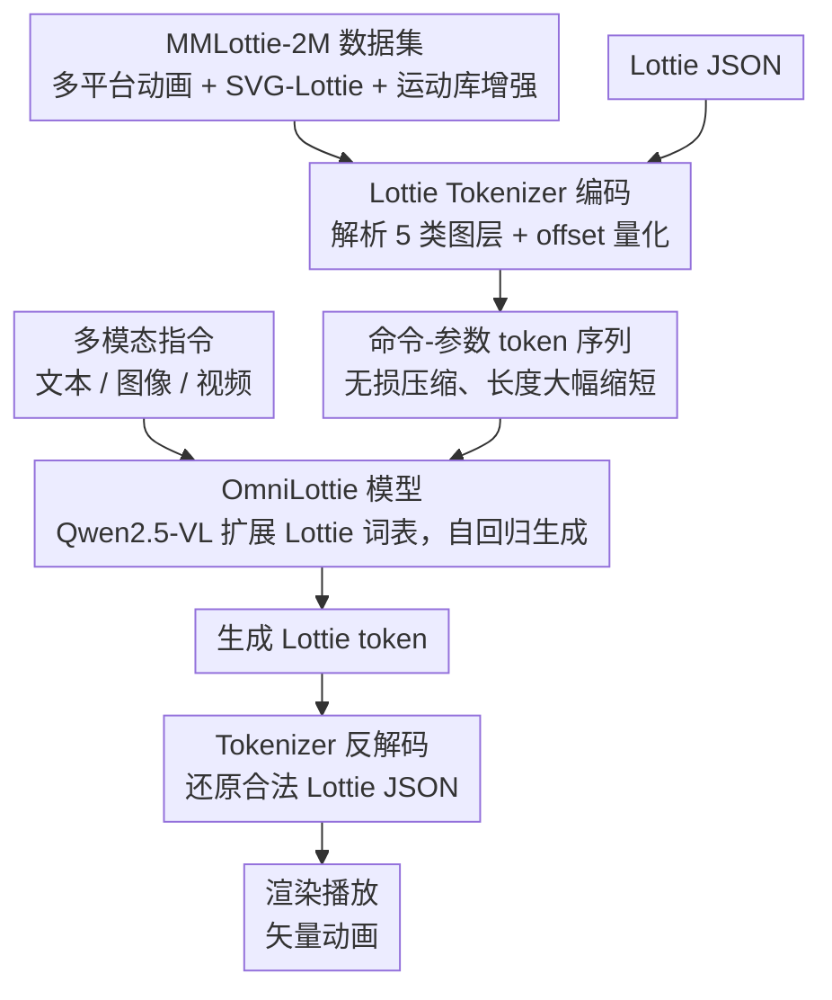

# OmniLottie: Generating Vector Animations via Parameterized Lottie Tokens

**会议**: CVPR 2026  
**arXiv**: [2603.02138](https://arxiv.org/abs/2603.02138)  
**代码**: 待确认（论文提到 Project Page）  
**领域**:视频生成
**关键词**: Lottie, 矢量动画, tokenization, 多模态指令, VLM生成

## 一句话总结
OmniLottie 提出一种将 Lottie JSON 文件转化为结构化命令-参数序列的 Lottie Tokenizer，使预训练 VLM 可以基于多模态交叉指令生成高质量矢量动画，并构建了 MMLottie-2M 大规模数据集支撑训练。

## 研究背景与动机

### 领域现状
矢量动画（如 SVG 动画、Lottie 格式）在 UI 设计、移动应用、网页中广泛使用。它们体积小、分辨率无关、可编程编辑。然而，自动生成矢量动画是一个尚未充分探索的方向——现有工作主要集中在静态矢量图或像素级视频生成。

### 现有痛点

**Lottie JSON 的冗余性**：原始 Lottie 文件包含大量不变的结构元数据和格式 token（如括号、键名），对于学习动画生成来说是严重的噪声

**缺乏训练数据**：没有大规模的矢量动画-文本配对数据集

**VLM 不理解动画格式**：现有 VLM 只能生成文本/图像，无法直接输出结构化的动画描述

### 核心矛盾
Lottie 是最流行的矢量动画格式，但其 JSON 表示对机器学习不友好——冗余的格式 token 使序列长度爆炸，困难了学习有效的生成模型。

### 核心 idea
设计一种 **Lottie Tokenizer**，将 Lottie JSON 转换为紧凑的命令+参数序列（去除所有结构冗余），使预训练 VLM 可以像生成自然语言一样自回归生成矢量动画。

## 方法详解

### 整体框架
OmniLottie 想把"生成一段矢量动画"这件看似奇特的事，变成预训练 VLM 已经擅长的"自回归吐序列"。它的关键观察是：Lottie 本质是一份 JSON，但这份 JSON 里绝大多数字符是版本号、键名、缩进这类不变的结构元数据，真正承载动画语义的只有图层的形状、变换和关键帧插值。于是整条 pipeline 先用一个 Tokenizer 把 Lottie JSON 解析、参数化成紧凑的"命令 + 参数"token 序列，再让一个词表被扩展过的 VLM（Qwen2.5-VL）接收文本/图像/视频等多模态指令，自回归地把这串 token 一个个生成出来，最后反解码回合法的 Lottie 文件直接送进渲染器。为了让这套模型有东西可学、也有标准可评，作者还配套造了 200 万规模的矢量动画数据集 MMLottie-2M 和评测基准 MMLottie-Bench。

### 关键设计

**1. Lottie Tokenizer：把冗长 JSON 解析、参数化成命令-参数序列，让序列短到模型学得动**

直接拿原始 Lottie JSON 喂模型的最大问题是序列爆炸——一份动画 JSON 里绝大多数字符是版本号、键名、缩进这类不变的结构元数据，对动画语义毫无贡献，却把有效信号稀释得模型学不动。Tokenizer 的做法分两步。**第一步参数化**：把 Lottie 树拆成一组基础元数据 $M=\{v, fr, ip, op, w, h, nm, ddd\}$ 加 $N$ 个图层，每个图层按其类型解析出变换、效果、形状路径等属性——论文支持五类图层（预合成 ty=0、纯色 ty=1、空 ty=3、形状 ty=4、文本 ty=5），再 flatten 成一串"命令 + 参数"的函数调用（如 `CMD_ANIMATION`、`CMD_POINT`）。**第二步离散化**：用 offset-based 量化把坐标、时间、变换这些连续参数映射到离散 token，$\text{token}(x,t)=\lfloor x\cdot s_t\rfloor+o_t$，其中 $s_t$ 是该参数类型的缩放因子、$o_t$ 是词表偏移；时间/空间/索引/速度/样式等不同参数类型占用互不重叠的偏移区间，避免 token 冲突又保住语义。整个过程是无损的——序列可反解码回合法 Lottie JSON。丢掉格式冗余后序列大幅缩短，自回归模型才能在有限上下文里看清整个动画的结构，这也是消融里它被证明为最关键组件的原因。

**2. OmniLottie 模型：在 Qwen2.5-VL 词表里塞进 Lottie token，把动画生成接进语言建模范式**

有了紧凑序列，下一步是让一个已经懂语言、图像和视频的 VLM 去生成它，而不是从头训一个专用模型。作者选 Qwen2.5-VL 作骨干，在它原有词表上扩出一组随机初始化的 Lottie 词表 embedding，对应 Tokenizer 产出的各类命令 token 和参数 token；这样整个 Lottie 序列被纳入同一个离散词表，训练时只需标准的 next-token 交叉熵损失 $\theta^*=\arg\min_\theta -\sum_{i} \log P(x_s^{[i]}\mid x_c; x_s^{[<i]}; \theta)$，其中 $x_c$ 是多模态指令条件。复用预训练 VLM 的好处是直接继承它的多模态理解力——同一个模型支持三种任务：文本生成动画（Text-to-Lottie）、图文生成动画（Text-Image-to-Lottie）、视频生成动画（Video-to-Lottie）。

**3. MMLottie-2M 与 MMLottie-Bench：补上大规模配对数据与标准评测，把"没有训练数据/没有基准"两块短板一起填掉**

这个任务此前几乎无人做的现实原因是既没有大规模配对数据、也没有标准评测。数据侧，作者从 LottieFiles、IconScout、Flaticon 等多个平台爬取 Lottie 动画并清洗掉 base64 图片层、音频/相机等不可参数化元素；为缓解原生动画稀缺，又用 OmniSVG 的静态 SVG 配上预设运动合成辅助数据（SVG-Lottie），并从 100 万真实 Lottie 里抽出运动轨迹聚成"运动模板库"迁移到 SVG 动画上做增强，凑成 200 万规模，再用 VLM 以 coarse-to-fine 方式为每个动画自动标注整体描述 + 逐帧时序细节。评测侧，作者建了 MMLottie-Bench，含 450 个与训练集严格不重叠的真实样本（Real Subset）外加一个用 GPT-4o / Gemini 等合成的 Synthetic Subset，从视觉质量和多模态指令对齐两个维度评估。消融显示去掉这批数据做预训练后生成质量明显下降，说明模型很大程度上是靠它学会了动画该长什么样。

### 一个完整示例

以指令"画一个弹跳的球"为例走一遍：模型先把这句文本编码进上下文，然后自回归地吐出 Lottie token——先用一串命令 token 勾出小球所在形状图层的轮廓，再用关键帧参数给纵坐标排上几个插值点（落下、触底回弹），最后附上颜色和变换参数。反解码后得到一份合法 Lottie 文件，直接丢进渲染器就能在手机端流畅播放，体积远小于等效的像素视频。

## 实验关键数据

### 主实验：矢量动画生成质量

| 方法 | FID ↓ | CLIP Score ↑ | 人类偏好 (%) |
|------|-------|-------------|-------------|
| DeepSVG + Motion | 142.3 | 0.21 | 12.3 |
| SVGDreamer | 98.7 | 0.28 | 22.8 |
| AnimateDiff (pixel) | 45.2 | 0.35 | 28.4 |
| **OmniLottie** | **38.6** | **0.41** | **36.5** |

### 消融实验

| 配置 | CLIP Score ↑ | 说明 |
|------|-------------|------|
| Full OmniLottie | 0.41 | 完整方法 |
| w/o Lottie Tokenizer (raw JSON) | 0.24 | 直接用 JSON 文本，序列太长质量下降 |
| w/o Animation Functions | 0.33 | 只生成静态形状，无动画 |
| w/o MMLottie Pretrain | 0.31 | 不使用大规模数据集预训练 |

### 关键发现
- **Lottie Tokenizer 是核心**——去掉后 CLIP Score 从 0.41 降到 0.24，因为原始 JSON 太冗长导致模型无法有效学习
- 生成的矢量动画在手机端可以流畅播放，体积仅为像素视频的 ~1/100
- 多模态指令的灵活性得到验证——文本、图文、视频三种输入都能生成语义对齐的动画
- 模型可以生成包含多物体、多层次动画的复杂场景

## 亮点与洞察
- **将矢量动画生成转化为序列生成**——Lottie Tokenizer 的设计使这个看似奇特的任务与 LLM 范式完美对接
- **MMLottie-2M 填补数据空白**——200 万规模的专业矢量动画数据集是社区的重要资源
- **实用价值极高**——生成的 Lottie 文件可以直接用于 App/Web 开发，无需后处理
- **序列化格式设计的启发**——Lottie Tokenizer 的思路可以推广到其他结构化格式的生成（如 CAD、SVG、代码 AST）

## 局限与展望
- 当前仅支持 Lottie 格式，未扩展到 SVG 动画或 CSS 动画
- 复杂动画（如包含遮罩、混合模式、表达式的 Lottie）的生成质量尚需提升
- 量化参数值引入了精度损失——微妙的动画曲线可能被量化粗化
- 缺乏动画时序质量的自动评估指标——FID 和 CLIP Score 主要评估静态帧
- 模型无法交互式编辑已生成的动画

## 相关工作与启发
- **vs DeepSVG**：DeepSVG 关注静态矢量图的 VAE 生成，不支持动画。OmniLottie 专门针对动画动态
- **vs AnimateDiff**：AnimateDiff 生成像素视频。OmniLottie 生成矢量格式，体积小且可编辑
- **vs SVGDreamer**：SVGDreamer 用扩散模型生成 SVG，但不支持动画和多模态输入
- **启发**：结构化格式的 tokenization 是将传统设计工具与 AI 生成结合的关键桥梁

## 评分
- 新颖性: ⭐⭐⭐⭐⭐ 首次将矢量动画生成建模为序列生成任务，Lottie Tokenizer 设计巧妙
- 实验充分度: ⭐⭐⭐⭐ 人类评估 + 自动指标 + 消融，但缺少动画时序质量评估
- 写作质量: ⭐⭐⭐⭐ 问题引入清晰，tokenizer 设计可视化做得好
- 价值: ⭐⭐⭐⭐⭐ 数据集+方法+应用价值三重贡献，对矢量动画生成领域有开创意义

<!-- RELATED:START -->

## 相关论文

- [\[CVPR 2026\] LottieGPT: Tokenizing Vector Animation for Autoregressive Generation](lottiegpt_vector_animation_generation.md)
- [\[CVPR 2026\] Vector Prism: Animating Vector Graphics by Stratifying Semantic Structure](vector_prism_animating_vector_graphics_by_stratifying_semantic_structure.md)
- [\[CVPR 2026\] Ego-InBetween: Generating Object State Transitions in Ego-Centric Videos](ego-inbetween_generating_object_state_transitions_in_ego-centric_videos.md)
- [\[CVPR 2026\] A Frame is Worth One Token: Efficient Generative World Modeling with Delta Tokens](a_frame_is_worth_one_token_efficient_generative_world_modeling_with_delta_tokens.md)
- [\[CVPR 2026\] YOSE: You Only Select Essential Tokens for Efficient DiT-based Video Object Removal](yose_you_only_select_essential_tokens_for_efficient_dit-based_video_object_remov.md)

<!-- RELATED:END -->
