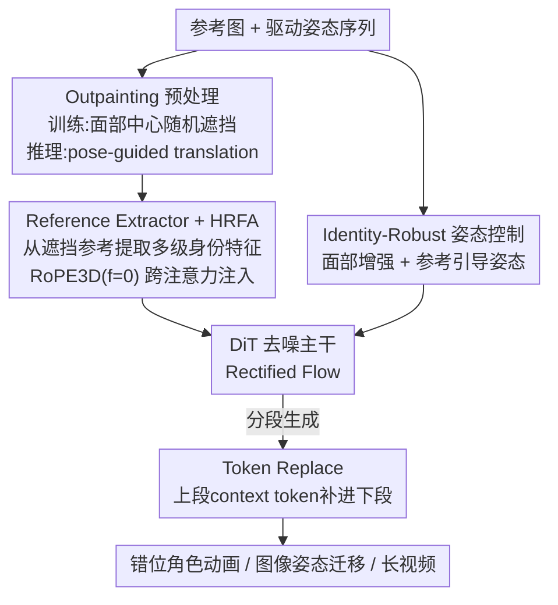

# One-to-All Animation: Alignment-Free Character Animation and Image Pose Transfer

**会议**: CVPR 2026  
**论文**: [CVF Open Access](https://openaccess.thecvf.com/content/CVPR2026/html/Shi_One-to-All_Animation_Alignment-Free_Character_Animation_and_Image_Pose_Transfer_CVPR_2026_paper.html)  
**代码**: https://github.com/ssj9596/One-to-All-Animation  
**领域**: 视频生成 / 扩散模型  
**关键词**: 角色动画, 姿态迁移, 错位参考, outpainting, 长视频生成

## 一句话总结
针对参考图与驱动视频"空间错位"这一长期未解的难题，本文把角色动画训练重构成一个自监督 outpainting 任务，配合专门的参考特征提取器、身份-骨架解耦的姿态控制和 token replace 长视频策略，使**任意布局**的单张参考图都能驱动跨尺度的视频动画与图像姿态迁移，质量超过同规模 SOTA。

## 研究背景与动机
**领域现状**：扩散模型（尤其是基于 DiT 的视频基座，如 Wan2.1）把"姿态驱动的角色动画"做得越来越逼真——给一张参考人物图 + 一段驱动视频，生成参考人物按驱动动作运动的视频。主流做法采用**自重建**训练：从同一段视频里采参考帧和驱动帧，天然保证两者布局、骨架一致。

**现有痛点**：这种训练范式埋下了一个致命假设——推理时也要求参考图和驱动视频"对齐"。一旦出现**错位**（misalignment），现有方法就崩。错位有两层：（1）**空间布局不匹配**——参考是半身特写、驱动视频是全身跳舞，尺度/覆盖范围差异巨大；（2）**面部不一致**——参考人和驱动人的五官骨架几何（眼鼻嘴间距比例）不同。前者导致身体变形，后者导致身份漂移。

**核心矛盾**：为维持对齐，现有方法在推理时强加两个约束——必须提供空间匹配的参考图、强依赖**姿态重定向**（pose retargeting）把驱动姿态对齐到参考。可现实中参考图布局千变万化，重定向一旦不准，身份直接漂移；而老方法（MimicMotion、StableAnimator）在错位输入下甚至完全丢失外观、生成错误身份。

**本文目标 + 切入角度**：与其在训练时假设"完美对齐"，作者反问——能不能**直接训练模型去处理错位**？核心洞察是：把训练重构成一个 **outpainting（外扩补全）问题**，用统一的"遮挡输入"格式，让模型从多样布局里学会生成。这样一个框架就能统一三类任务：错位图→图、对齐图→视频、错位图→视频。

**核心 idea**：用"遮挡-补全"替代"对齐-重建"，把布局错位变成模型该学的能力而非要规避的麻烦。

## 方法详解
给定一张参考图 $I_r$ 和一段驱动视频姿态序列 $P_{1:N}$，目标是生成保持参考身份、跟随驱动动作的视频。方法从**数据**和**模型**两侧同时下手：数据侧用自监督 outpainting 合成"空间错位"的参考-驱动对；模型侧设计参考特征提取器处理遮挡参考、身份鲁棒姿态控制缓解姿态过拟合、TokenReplace 支持长视频。整个框架建在 Wan2.1 文生视频基座上，训练 1.3B 和 14B 两个版本。

### 整体框架
推理时，由于参考图相对驱动序列可能尺度差异很大，先做一次 **pose-guided translation**：从驱动序列里找一帧姿态朝向与参考最接近的"锚帧"，用两者都可见的身体部位（肩宽、耳距）估计尺度比，把参考缩放并零填充到驱动分辨率，得到调整后输入 $\tilde{I}_r$ 和一个标记填充区的掩码 $M_r$。模型吃三元组 $(\tilde{I}_r, M_r, P_{1:N})$，一边跟随动作、一边把填充区域"脑补"出来补全外观。训练时则用 face-centered 随机遮挡参考图，制造和推理时同款的"遮挡输入"，用原始完整视频做监督，强迫网络学会补全被遮区域。

### 关键设计

**1. Outpainting 预处理：把"对齐重建"重构成"遮挡补全"**

这是全文的根基，直接针对"训练假设对齐、推理却错位"这个核心矛盾。作者保留自重建框架，但加一道关键改造：训练时不再把所有帧当作天然对齐，而是对参考图做 **face-centered 随机遮挡**模拟各种尺度条件，生成一张标记缺失区域的二值 outpainting 掩码；把"遮挡参考 + 掩码 + 姿态序列"当输入、原始完整视频当监督。这样训练得到的输入与推理时 pose-guided translation 产出的"缩放+零填充"输入**完全同构**——模型在训练里就被逼着去 hallucinate 被遮区域并生成连贯运动，推理时自然能处理任意布局的真实错位参考。一句话：把布局错位从"要在推理时对齐掉的麻烦"变成"训练里直接学会的补全能力"。

**2. Reference Extractor + 混合参考融合注意力（HRFA）：从残缺参考里榨出身份**

outpainting 训练带来新难题——参考图被严重遮挡，怎么还能抽出可靠的外观特征？已有方案都不行：CLIP 编码器只给全局语义、缺细粒度身份；I2V 主干受"首帧 copy-paste"限制，大面积遮挡时补不全。作者因此设计一个与去噪 DiT 主干**并行**、产出同一潜空间特征的专用提取器：参考 $\tilde{I}_r$ 和掩码 $M_r$ 经 3D VAE 编码、沿通道拼接后 patchify 成初始参考特征 $r^0$，再过 $M$ 个 text-free block（从 DiT 主干初始化、去掉文本交叉注意力）细化，连同 $r^0$ 得到 $M{+}1$ 个参考特征，通过零初始化线性投影注入 $N$ 个去噪 block（每个参考特征被 $n=N/(M{+}1)$ 个连续 block 共享）。

核心是 **HRFA**：在 DiT 自注意力之上加一层参考交叉注意力。视频自注意力用 3D RoPE：$Q=\mathrm{RoPE}_{3D}(hW_q)$、$K=\mathrm{RoPE}_{3D}(hW_k)$、$V=hW_v$；参考交叉注意力则用新投影 $W_k', W_v'$ 算 $K'=\mathrm{RoPE}_{3D,f=0}(rW_k')$、$V'=rW_v'$，关键在于对视频侧的 $Q'$ 也施加 $\mathrm{RoPE}_{3D,f=0}(hW_q)$——把帧维位置归零，阻止跨注意力学到参考与视频帧之间的**绝对帧位置依赖**。这样模型保留时间外推能力，同一套权重既能做图像也能做视频。两路融合是简单相加：

$$\mathbf{z}'_{\text{fusion}} = \mathrm{Attention}(Q,K,V) + \mathrm{Attention}(Q',K',V')$$

变长分辨率、动态序列长度都能稳定处理身份保持。

**3. 身份鲁棒姿态控制：把身份从驱动骨架里解耦出来**

outpainting 解决了身体层面的布局错位，但**面部层面**的训练-测试不一致还在：训练时参考帧和驱动姿态采自同一视频、面部天然对齐，推理时驱动人脸几何却可能和参考不同，于是模型会**过拟合到驱动面部骨架**——身份被驱动骨架"带跑"。作者两步解：

其一 **face region enhancement**——训练中只扰动驱动姿态的**面部关键点**、保持身体关键点不变，刻意制造面部错位，逼模型从参考图而非驱动骨架恢复身份；对 70% 样本施加该增强，并用"淡色信号"标记一条姿态是原始还是增强。推理时若重定向不可靠，模型可接受淡色姿态信号，无需严格骨架匹配就保住身份。其二 **reference-guided pose control**——光做面部增强会破坏原本逐位置相加的姿态注入、引入训练不稳定，于是引入参考引导：把参考图 VAE 潜征 $z^r$ 沿帧维拼到视频潜征前 $\tilde{\mathbf{z}}^{1:(n+1)}=[\mathbf{z}^r,\mathbf{z}^{1:n}]$，参考姿态 $\tilde{P}_r$（不做增强、与参考对齐）和驱动姿态一起经 Pose ResNet 编码、沿帧维拼接后过自注意力 $\tilde{\mathbf{p}}^{1:(n+1)}=\mathrm{SA}([\mathbf{p}^r,\mathbf{p}^{1:n}])$ 捕捉序列内依赖，细化后的姿态表征逐元素加到第一个 DiT block 输出上。靠"未增强参考姿态"做关系建模，把增强带来的不稳定重新拉回来。

**4. Token Replace：让超长视频跨段无缝衔接**

超长视频按段顺序生成，段边界容易跳变。作者把前一段最后 5 帧经 VAE 编码成 2 个潜帧作为 context token $z_{ctx}$，在**每个**去噪时间步 $t$ 把当前段噪声潜征的前两个潜帧替换掉：$\tilde{\mathbf{z}}^{1:n}_t=[\mathbf{z}_{ctx},\mathbf{z}^{3:n}_t]$。训练时 context token 不计入重建损失、只作时间引导；推理时把它们当 $t=0$ 的"干净信号"贯穿整个去噪过程喂进特征调制模块。去噪后前两个 token 留作下一段的 context，VAE 解码完整序列。简单替换换来段间平滑过渡。

### 损失函数 / 训练策略
采用 Rectified Flow：前向 $\mathbf{x}_t=(1-t)\mathbf{x}_0+t\boldsymbol{\varepsilon}$，网络预测目标速度 $u_t=\boldsymbol{\varepsilon}-\mathbf{x}_0$，回归损失 $\mathcal{L}_{RF}=\lVert v_t-u_t\rVert^2$，文本提示固定为空串。**三阶段训练**：① 只用外观条件训 Reference Extractor 和 HRFA 的 $W_k'/W_v'$；② 引入姿态条件，联合训参考引导姿态控制与 HRFA 全部组件；③ 加入 token replace。混合图-视频训练（512/768 多分辨率、视频:图像 = 6:1，每段视频限 29 帧）。推理用 Euler 采样 30 步，并采用累积无分类器引导分别加强参考外观和姿态：$x_{t-1}=x^{t-1}_{\varnothing}+\lambda_P(x^{t-1}_P-x^{t-1}_{\varnothing})+\lambda_I(x^{t-1}_{RP}-x^{t-1}_P)$，$\lambda_P=\lambda_I=1.5$。

## 实验关键数据

### 主实验
建在 Wan2.1 上，8× H20 训练；约 7000 段网络人像视频 + TikTok/Champ/UBC/DeepFashion + 200 张卡通形象（Seedance 合成动画）。视频任务在 TikTok 基准 + 12 对域外卡通对评测（a/b = TikTok/Cartoon）：

| 规模 | 模型 | PSNR↑ | SSIM↑ | LPIPS↓ | FVD↓ |
|------|------|-------|-------|--------|------|
| ~1.3B | MimicMotion | 15.43/15.09 | 0.721/0.647 | 0.315/0.368 | 412.5/943.4 |
| ~1.3B | StableAnimator | 14.92/15.16 | 0.737/0.638 | 0.315/0.333 | 477.3/720.5 |
| ~1.3B | Animate-X | 15.22/15.63 | 0.741/0.659 | 0.329/0.330 | 375.6/723.3 |
| ~1.3B | **One-to-All-1.3B** | **17.75/16.24** | **0.788/0.677** | **0.269/0.289** | **361.9/549.3** |
| ~14B | UniAnimate-DiT | 19.07/17.03 | 0.816/0.699 | 0.265/0.269 | 358.4/510.6 |
| ~14B | Wan-Animate | 17.57/16.43 | 0.763/0.659 | 0.306/0.318 | 282.9/485.9 |
| ~14B | **One-to-All-14B** | 18.07/17.10 | 0.812/0.701 | **0.254/0.259** | 297.9/403.5 |

1.3B 版在小模型里多数指标领先；14B 版在 LPIPS/FID-VID/卡通 FVD 等感知指标上稳超同规模对手，跨域卡通泛化尤其明显。图像姿态迁移在 DeepFashion 8570 对测试：

| 分辨率 | 方法 | FID↓ | LPIPS↓ | PSNR↑ | SSIM↑ |
|--------|------|------|--------|-------|-------|
| 512×352 | CFLD (CVPR24) | 7.11 | 0.279 | 17.13 | 0.753 |
| 512×352 | MCLD (CVPR25) | 7.07 | 0.275 | 16.51 | 0.736 |
| 512×352 | **One-to-All-1.3B** | **6.85** | **0.249** | 16.84 | 0.742 |
| 944×624 | CFLD | 8.38 | 0.314 | 17.38 | 0.758 |
| 944×624 | MCLD | 8.96 | 0.322 | 16.33 | 0.761 |
| 944×624 | **One-to-All-1.3B** | **6.92** | **0.285** | 16.24 | 0.754 |

FID/LPIPS 两分辨率都最低，PSNR/SSIM 略低但定性面部细节更清晰。**User study**（100 个错位测试、30 人评）对比当前 SOTA Wan-Animate：未见区域质量胜率 47.6% vs 28.1%，已见区域保真度 72.4% vs 16.1%，身份保持优势显著。

### 消融实验
组件消融（TikTok，14B）：

| 配置 | SSIM↑ | LPIPS↓ | FVD↓ | 说明 |
|------|-------|--------|------|------|
| Base Ref. Extractor | 0.773 | 0.280 | 355.2 | 仅参考提取器 |
| + 面部增强 | 0.748 | 0.335 | 412.8 | **单独加反而掉点** |
| + 参考引导姿态控制 | 0.795 | 0.275 | 325.7 | 把增强带来的不稳定救回 |
| Full + Token Replace | 0.812 | 0.254 | 297.9 | 完整模型 |

身份鲁棒姿态控制（100 错位对，CSIM↑/APD-body↓/AED↓）：

| 方法 | CSIM↑ | APD-body↓ | AED↓ |
|------|-------|-----------|------|
| w/o 身份鲁棒姿态控制 | 0.6761 | 0.0358 | 0.6898 |
| 仅面部增强 | 0.7569 | 0.0772 | 0.9274 |
| Full（面部增强+参考引导） | **0.8172** | 0.0367 | 0.7457 |

### 关键发现
- **面部增强不能单独用**：单加面部增强 SSIM 从 0.773 掉到 0.748、FVD 涨到 412.8，因为增强后的姿态仍被直接加到噪声潜征上，和 GT 错位造成训练不稳定；必须配参考引导姿态控制（靠未增强参考姿态做关系建模）才稳定并提升，是全文最反直觉的一处。
- **vs 整体骨架增强**：Animate-X 缩放整副骨架会破坏全身空间对应、导致动作偏移；本文只扰动面部关键点，既保身体动作精度又提身份鲁棒性。
- **Reference Extractor 关键性**：相比 IP-Adapter（CLIP，跨帧前后景不一致）和 I2V 主干（copy-paste，大遮挡补不全），专用提取器能在重建遮挡区的同时保留细粒度身份。

## 亮点与洞察
- **"换问题定义"式创新**：不去硬解错位，而是把训练范式从"对齐-重建"换成"遮挡-补全"，让推理输入与训练输入同构——这种重构问题而非堆模块的思路最值得借鉴。
- **RoPE 帧位置归零的小技巧很巧**：跨注意力对视频侧 $Q'$ 用 $f=0$ 的 RoPE3D，阻断参考-视频的绝对帧位置耦合，一套权重同时吃图像和视频，可迁移到任何需要"参考帧不占时间位"的图视频统一生成。
- **身份-骨架解耦**：面部关键点扰动 + 淡色信号标记，把"身份"从"驱动骨架"里拆开，治的是姿态过拟合这一具体病。

## 局限与展望
- 强依赖 2D 姿态关键点（DWPose）作结构控制，关键点检测失败或极端遮挡时姿态信号本身就不可靠。
- pose-guided translation 用肩宽/耳距估尺度，当参考与驱动**都缺**这些可见部位时锚定可能失效（⚠️ 论文未充分讨论该退化情形）。
- 视频样本训练限 29 帧、长视频靠分段 + token replace 拼接，超长序列的全局一致性仍受段边界策略约束。
- PSNR/SSIM 在图像姿态迁移上略逊于对手，作者归因于追求感知质量而非逐像素对齐——这类指标取舍在错位场景下是否合理，值得进一步看定性。

## 相关工作与启发
- **vs MimicMotion / StableAnimator（~1.3B 老方法）**：它们靠自重建保证训练对齐，错位输入下完全丢外观、生成错误身份；本文用 outpainting 训练直接处理错位，PSNR/SSIM/LPIPS 全面领先。
- **vs UniAnimate-DiT / Wan-Animate（~14B DiT 方法）**：大数据训练能保面部但仍受重定向准确度牵制，重定向失败即身份漂移；本文身份鲁棒姿态控制把身份从骨架解耦，错位 user study 大幅胜出。
- **vs CFLD / MCLD（图像姿态迁移）**：它们受限于低分辨率（512×352）、面部细节差；本文统一框架顺带支持高分辨率（944×624）图像姿态迁移，FID/LPIPS 更低。
- **统一性**：是首个把"错位图→图、对齐图→视频、错位图→视频"三类任务收进**单一框架**的工作，靠的就是 outpainting 这一统一输入格式。

## 评分
- 新颖性: ⭐⭐⭐⭐⭐ 用 outpainting 重构训练范式直击错位难题，是范式级而非堆模块的创新
- 实验充分度: ⭐⭐⭐⭐⭐ 视频+图像双任务、1.3B/14B 双规模、组件+身份控制双消融 + user study，覆盖全面
- 写作质量: ⭐⭐⭐⭐ 动机和方法叙述清晰，图较密集但逻辑链完整
- 价值: ⭐⭐⭐⭐⭐ 解决角色动画落地的关键卡点（任意布局参考），代码模型开源，实用性强

<!-- RELATED:START -->

## 相关论文

- [\[CVPR 2026\] MultiAnimate: Pose-Guided Image Animation Made Extensible](multianimate_pose-guided_image_animation_made_extensible.md)
- [\[CVPR 2026\] PersonaLive! Expressive Portrait Image Animation for Live Streaming](personalive_expressive_portrait_image_animation_for_live_streaming.md)
- [\[CVPR 2026\] InfinityHuman: Towards Long-Term Audio-Driven Human Animation](infinityhuman_towards_long-term_audio-driven_human_animation.md)
- [\[CVPR 2026\] Vanast: Virtual Try-On with Human Image Animation via Synthetic Triplet Supervision](vanast_virtual_try-on_with_human_image_animation_via_synthetic_triplet_supervisi.md)
- [\[CVPR 2026\] LottieGPT: Tokenizing Vector Animation for Autoregressive Generation](lottiegpt_vector_animation_generation.md)

<!-- RELATED:END -->
