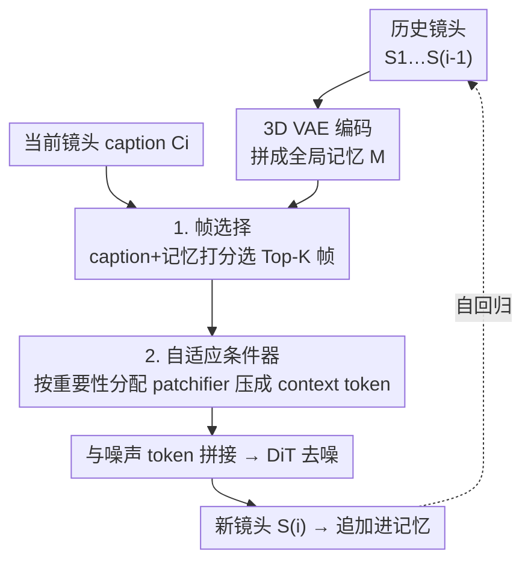

# OneStory: Coherent Multi-Shot Video Generation with Adaptive Memory

**会议**: CVPR 2026  
**论文**: [CVF Open Access](https://openaccess.thecvf.com/content/CVPR2026/html/An_OneStory_Coherent_Multi-Shot_Video_Generation_with_Adaptive_Memory_CVPR_2026_paper.html)  
**代码**: 无  
**领域**: 视频生成 / 扩散模型  
**关键词**: 多镜头视频生成, 自回归生成, 自适应记忆, 帧选择, I2V

## 一句话总结
OneStory 把多镜头视频生成（MSV）重新表述成"逐镜头自回归的下一镜头生成"任务，用一个**帧选择模块**从全部历史镜头里挑出语义相关帧、再用一个**自适应条件器**按重要性把这些非连续帧压成紧凑 context token 直接喂给 DiT，从而在分钟级、十镜头的叙事中同时保住角色/环境一致性和复杂剧情跟随，T2MSV 与 I2MSV 两种设定下都拿到 SOTA。

## 研究背景与动机
**领域现状**：真实世界的视频叙事往往由"多个镜头"（shot）构成——画面不连续但语义相连的片段拼成一个连贯故事。单镜头 T2V/I2V 模型（Wan、HunyuanVideo、CogVideoX 等）只能生成一段连续场景，没法跨镜头叙事，于是多镜头视频生成（MSV）成了独立研究方向。

**现有痛点**：MSV 的现有做法分两派，各有硬伤。① **固定窗口注意力**（Mask2DiT、LCT）在一个有限时间窗内对若干镜头做注意力，但窗口一滑动，更早的镜头就被丢掉——超出窗口必然丢记忆、角色/场景跨镜头不一致。② **关键帧条件**（StoryDiffusion、Captain Cinema 等）给每个镜头先生成一张关键帧、再用 I2V 扩成完整片段，但每个镜头的跨镜头上下文被压缩成"单张图"，复杂叙事线索传不过去，剧情贴合度弱。

**核心矛盾**：MSV 的根本难点是**如何有效利用并维持长程跨镜头上下文**——既要让角色/环境在间歇离场后仍保持一致，又要区分"哪些该不变（身份、布局）、哪些该演化（机位、动作）"。固定窗口管不了长程，单关键帧装不下复杂线索，两者都在"上下文容量"上栽了跟头。

**本文目标**：要一个**全局但紧凑**的跨镜头上下文表示——既能回看任意早的历史镜头（全局），又不会因为把所有历史帧都塞进去而爆算力（紧凑）。

**切入角度**：作者观察到跨镜头的相关性是"变化的"——生成 Shot 3 时，若主角在 Shot 1 出现、Shot 2 是配角，那 Shot 3 主要该参考 Shot 1 而非 Shot 2。既然相关性稀疏且可辨，就没必要平等地塞进所有历史帧，而应**先选相关帧、再按重要性分配算力**。

**核心 idea**：把 MSV 重写为"下一镜头生成"（next-shot generation），复用预训练 I2V 模型的强视觉条件能力做逐镜头自回归；再用"帧选择 + 自适应压缩"把全部历史浓缩成一组紧凑 context token 直接注入生成器。

## 方法详解

### 整体框架
把一段 $N$ 镜头视频记为 $V=\{S_1,\dots,S_N\}$，每个镜头 $S_i$ 含 $K$ 帧、配一句**引用式 caption** $C_i$（caption 会显式引用之前的镜头，如"the same man"）。OneStory 不再一次性生成整段，而是把任务表述为下一镜头生成：

$$S_i=\mathcal{G}\big(\mathcal{E},\,\{S_j\}_{j=1}^{i-1},\,\mathcal{T},\,C_i\big)$$

其中 $\mathcal{E}$ 是 3D VAE 编码器（把每个镜头编成 latent），$\mathcal{T}$ 是文本编码器。模型从预训练 I2V 模型（Wan2.1）初始化，在自建 60K 数据集上轻量微调即可。推理时维护一个"历史记忆库"，逐镜头顺序生成：每生成一个新镜头，就把它编码后追加进记忆，供后续镜头检索。

整条 pipeline 的核心是两个模块串联：**帧选择**先从全部历史镜头里挑出语义相关帧构成全局上下文，**自适应条件器**再把这组非连续帧动态压成紧凑 context token、与噪声 token 拼接后送进 DiT 去噪。数据侧还配了一条三步数据清洗管线和两条训练策略来撑起这个新范式。

### 关键设计

**1. 下一镜头自回归表述：把 MSV 拆成可复用 I2V 的逐镜头生成**

针对"固定窗口丢记忆、关键帧装不下上下文"这个根本矛盾，作者不在一次扩散里硬塞所有镜头，而是把整段生成拆成一串"下一镜头生成"子问题：第 $i$ 个镜头以前 $i-1$ 个镜头 + caption $C_i$（+ 可选首帧图）为条件生成。这样做的两个直接好处是：其一，可以直接拿预训练 I2V 模型当底座——I2V 本就擅长"给定视觉条件生成视频"，next-shot 正好把"历史镜头"当成视觉条件，于是只需轻量微调；其二，文本/图像两种条件被天然统一——第一镜头可由纯文本或文本+图像发起，后续镜头随新 caption 自回归推进，同一个模型既做 T2MSV 又做 I2MSV。训练时用"预测三镜头序列里的最后一镜"作为统一目标。

**2. 帧选择：用可学习 query 给历史帧打相关性分，只留 Top-K**

多镜头视频的独特性质是**跨镜头时空方差无界**——相邻镜头在时间和空间上未必连续，相关性随内容变化。如果把所有历史帧都当条件，既冗余又昂贵。帧选择模块先把前 $i-1$ 个镜头全部 VAE 编码、沿时间轴拼成全局记忆 $\mathbf{M}\in\mathbb{R}^{F\times N_s\times D_v}$（$F$ 是历史总帧数，$N_s$ 是每帧 token 数）。然后引入 $m$ 个可学习 query token $\mathbf{Q}$：先让 query 注意当前 caption 抓住"这一镜头想要什么"语义（$\mathbf{Q}'=\mathcal{F}_{\mathrm{attn}}(\mathbf{Q},\phi_T(\mathbf{t}_i),\phi_T(\mathbf{t}_i))$），再让更新后的 query 注意视觉记忆抓取对应视觉线索（$\mathbf{Q}''=\mathcal{F}_{\mathrm{attn}}(\mathbf{Q}',\mathbf{M}_1,\mathbf{M}_1)$，$\mathbf{M}_1$ 是卷积投影后降维的记忆）。最后算逐帧相关分 $\mathbf{s}=\phi_P(\mathbf{M}_1)\mathbf{Q}''^{\top}$、跨 query 取均值得 $\mathbf{S}\in\mathbb{R}^F$，按 $\mathbf{S}$ 取 Top-$K_{sel}$ 帧得到语义相关的历史上下文 $\widehat{\mathbf{M}}$。为帮助打分学习，作者用 DINOv2 和 CLIP 构造伪标签标注"历史帧与当前镜头的相关度"来监督 $\mathbf{S}$。这一步把"全局回看"做成了"稀疏检索"，从源头解决固定窗口的记忆丢失。

**3. 自适应条件器：按重要性给非连续帧分配 patchifier，压成紧凑 context token**

选出的相关帧 $\widehat{\mathbf{M}}$ 信息虽丰富，但 token 数仍大、直接全用作条件代价高。自适应条件器定义一组核大小不同的 patchifier $\{\mathcal{P}_\ell\}_{\ell=1}^{L_p}$，**按帧的相关分 $\mathbf{S}$** 把 $\widehat{\mathbf{M}}$ 的索引切成 $L_p$ 个不相交子集：越相关的帧分给越"细"的 patchifier（压缩率低、保留多），越不相关的帧用粗 patchifier 狠压。每个 patchifier 把分到的帧转成 context token $\mathbf{C}_\ell=\mathcal{P}_\ell(\widehat{\mathbf{M}}_{\mathcal{I}_\ell})$，再拼成 $\mathbf{C}$。这与以往**按时间顺序固定分配**（如最新帧永远给最细 patchifier）的方案根本不同——OneStory 是**按内容重要性**给非连续帧分配算力，做到 content-driven 而非 temporal-driven 的条件化。注入方式很直接：把 context token $\mathbf{C}$ 与当前镜头的噪声 token $\mathbf{N}$ 沿 token 维拼接成 DiT 输入 $\mathbf{X}=\mathcal{F}_{\mathrm{concat}}([\mathbf{N},\mathbf{C}])$，让噪声 token 与上下文 token 做联合注意力。通过调 patchifier 的压缩率，额外算力保持很小——这正是"全局但紧凑"的落点。

**4. 三步数据管线 + 两条训练策略：撑起 next-shot 新范式**

新范式需要"引用式 caption"的数据和稳定的训练流程，作者两端都补齐。**数据侧**用三步管线从原始视频造出约 60K 高质量多镜头视频（50K 两镜头 + 10K 三镜头）：① 用 TransNetV2 检测镜头边界、保留 ≥2 镜头的视频；② 两阶段打字幕——先独立给每个镜头打 caption，再基于前一镜头的帧和 caption **改写**后续 caption 引入引用表达（"the same man"）和场景/物体变化，从而不依赖全局剧本、只保留带递进叙事流的镜头级 caption；③ 关键词过滤 + CLIP/SigLIP2 滤掉完全无关转场 + DINOv2 去掉过于相似镜头。**训练侧**两条策略保稳定：**镜头膨胀（Shot Inflation）**把两镜头序列膨胀成三镜头（插入别的视频里采样的镜头，或对首镜头做空间/颜色增强），得到真+合成的三元组，实现统一的三镜头训练；**解耦条件（Decoupled Conditioning）**用两阶段课程——热身阶段在合成三镜头上从真实镜头里**均匀采样**条件帧，把条件化与尚未训好的选择器输出解耦，之后再切到选择器驱动的条件化，渐进耦合稳住收敛、增强叙事连贯。

### 损失函数 / 训练策略
模型端到端联合训练，目标是"预测每个序列的最后一镜头、以其前序镜头为条件"。底座为预训练 I2V 模型 Wan2.1，用 AdamW 优化，学习率 0.0005、weight decay 0.01，在 128 张 A100 上整模型微调一个 epoch；视频统一中心裁剪到 480×832（保持长宽比）。配合上面的 Shot Inflation 与 Decoupled Conditioning 两条策略。

## 实验关键数据

### 主实验
评测分两个维度：**镜头级质量**（主体一致性、背景一致性、美学质量、动态程度）和**叙事一致性**（角色一致性 C-Cons、环境一致性 E-Cons、语义对齐 S-Align）。下表节选 T2MSV 设定下的关键指标（↑ 越高越好）：

| 方法 | 角色一致↑ | 环境一致↑ | 跨镜头平均↑ | 语义对齐↑ | 美学质量↑ |
|------|----------|----------|------------|----------|----------|
| Flux + Wan2.1 | 0.5454 | 0.5598 | 0.5526 | 0.1915 | 0.5572 |
| Mask2DiT（固定窗口） | 0.5472 | 0.5419 | 0.5446 | 0.2253 | 0.5235 |
| StoryDiff. + Wan2.1（关键帧） | 0.5633 | 0.5681 | 0.5657 | 0.2217 | 0.5703 |
| **OneStory（本文）** | **0.5874** | **0.5752** | **0.5813** | **0.2389** | **0.5731** |

I2MSV 设定下（省略无法直接吃图像的关键帧 baseline），OneStory 同样在镜头级与叙事级指标上全面领先（角色一致 0.5851、环境一致 0.5716、语义对齐 0.2354）。定性上，baseline 在新角色引入后主角重现、以及需要两角色同框的合成镜头里普遍崩掉身份，OneStory 则在重现与合成场景下都保住主体/环境一致并贴合演化剧情。

### 消融实验
| 配置 | 角色一致↑ | 环境一致↑ | 语义对齐↑ | 说明 |
|------|----------|----------|----------|------|
| 仅末帧条件（baseline） | 0.5153 | 0.5112 | 0.1814 | 缺历史上下文，最弱 |
| + 自适应条件器 AC | 0.5465 | 0.5597 | 0.2172 | 扩展上下文范围 |
| + 帧选择 FS | 0.5526 | 0.5710 | 0.2238 | 选最相关帧增强适配 |
| **AC + FS（完整）** | **0.5874** | **0.5752** | **0.2389** | 两者互补，最佳 |

训练策略消融（同一预算下）：去掉镜头膨胀 SI 与解耦条件 DC 的 baseline 只有 C-Cons 0.5514 / S-Align 0.2207；加 SI 升到 0.5649 / 0.2263；再加 DC 达 0.5874 / 0.2389。context token 长度消融显示：1 帧等价预算已很强（C-Cons 0.5874），加到 3 帧进一步提升（0.5926）。

### 关键发现
- **AC 与 FS 互补、缺一不可**：单独加任一模块都比末帧 baseline 好，但只有两者结合才能从 0.5153 跨到 0.5874——AC 负责"装得下更多上下文"，FS 负责"装的是最相关的上下文"，分工清晰。
- **帧选择 vs 均匀/最近采样**：在含大幅相机运动的细粒度难例里，均匀采样和最近采样都失去连续性，而本文按内容相关性选帧能保住跨镜头一致，验证了"相关性驱动"优于"时间驱动"。
- **上下文 token 越多越好但收益递减**：1→3 帧预算 C-Cons 从 0.5874 升到 0.5926，说明紧凑表示已抓住主要信息，加预算是锦上添花而非必需。
- **泛化**：仅在以人为中心的数据上训练，却能泛化到域外场景（如猫的故事），说明 next-shot + 自适应记忆学到的是通用的跨镜头建模能力。

## 亮点与洞察
- **"全局但紧凑"用检索+按需压缩两步落地**：先稀疏选相关帧（全局可回看任意早历史）、再按重要性分配 patchifier 压缩（紧凑省算力），把固定窗口和单关键帧两派的优点合并、缺点规避——这套"先选后压"的思路可迁移到任何长上下文条件生成。
- **按内容重要性分配压缩率**而非按时间顺序，是很巧的算力分配：越重要的帧留得越细、越不重要的压得越狠，相当于给条件信号做了"自适应码率"。
- **引用式 caption 数据设计**避免了全局剧本的僵化：不写一个固定全局脚本，而让每个镜头的 caption 从前文自然演化，既贴近真实创作流程，又给后续镜头留出"自由生长"的空间。
- **解耦条件的两阶段课程**点出一个一般性训练陷阱：当一个可学习选择器和下游生成器联合优化时，早期选择器乱选会污染生成器训练——先用均匀采样解耦、待选择器靠谱后再耦合，是稳定这类"选择+生成"耦合系统的通用招。

## 局限与展望
- **数据偏以人为中心**：60K 数据集聚焦人类活动，虽展示了域外泛化，但对非人类主体、复杂物理交互场景的稳健性仍待更系统验证。
- **依赖 I2V 底座能力**：方法建立在 Wan2.1 之上，单镜头生成质量/分辨率（480×832）受底座上限约束，底座的失败模式可能被继承。
- **伪标签监督的可靠性 ⚠️**：帧选择的相关性打分用 DINOv2/CLIP 构造伪标签监督，这套伪标签本身的噪声会传导到选择质量，论文未深入分析其敏感性（细节在附录，以原文为准）。
- **改进思路**：可探索把 context token 预算做成自适应（按叙事复杂度动态调），或把帧选择从"帧级"细化到"区域级"以在压缩时保留更细的局部一致性。

## 相关工作与启发
- **vs Mask2DiT（固定窗口注意力）**：Mask2DiT 改注意力掩码在有限窗内对齐 caption 与镜头，窗口外的历史必然丢失；OneStory 用稀疏帧选择实现无界回看，叙事一致性指标全面更高（跨镜头平均 0.5813 vs 0.5446）。
- **vs StoryDiffusion + I2V（关键帧条件）**：关键帧派把每镜头上下文压成单张图，复杂线索传不过去；OneStory 直接把多帧紧凑上下文注入 DiT，保留了远比单图丰富的叙事信息（语义对齐 0.2389 vs 0.2217）。
- **vs 固定时序 patchification（如以往按时间分配 patchifier 的方案）**：它们默认"最新帧最重要"按时序分配压缩率；OneStory 按内容重要性给非连续帧分配，是从 temporal-driven 转向 content-driven 的条件化，更贴合多镜头时空方差无界的本质。

## 评分
- 新颖性: ⭐⭐⭐⭐⭐ 把 MSV 重表述为 next-shot + "稀疏选帧/按重要性压缩"的全局紧凑记忆，是对固定窗口/关键帧两派的实质性超越。
- 实验充分度: ⭐⭐⭐⭐ T2MSV/I2MSV 双设定 + 模型/训练/上下文长度三组消融 + 帧选择策略对比，较充分；自建 benchmark 的可比性需 caveat。
- 写作质量: ⭐⭐⭐⭐ 动机递进清晰、图示完整，公式表述偶有 OCR 噪声但不影响理解。
- 价值: ⭐⭐⭐⭐⭐ 分钟级十镜头连贯叙事直指真实创作应用，方法范式与"按需压缩长上下文"思路可复用。

<!-- RELATED:START -->

## 相关论文

- [\[CVPR 2026\] MultiShotMaster: A Controllable Multi-Shot Video Generation Framework](multishotmaster_a_controllable_multi-shot_video_generation_framework.md)
- [\[CVPR 2026\] STAGE: Storyboard-Anchored Generation for Cinematic Multi-shot Narrative](stage_storyboard-anchored_generation_for_cinematic_multi-shot_narrative.md)
- [\[CVPR 2026\] ShotDirector: Directorially Controllable Multi-Shot Video Generation with Cinematographic Transitions](shotdirector_directorially_controllable_multi-shot_video_generation_with_cinemat.md)
- [\[CVPR 2026\] HoloCine: Holistic Generation of Cinematic Multi-Shot Long Video Narratives](holocine_holistic_generation_of_cinematic_multi-shot_long_video_narratives.md)
- [\[CVPR 2026\] Rethinking Position Embedding as a Context Controller for Multi-Reference and Multi-Shot Video Generation](rethinking_position_embedding_as_a_context_controller_for_multi-reference_and_mu.md)

<!-- RELATED:END -->
