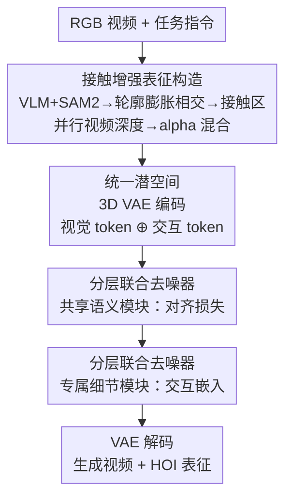

# Open-world Hand-Object Interaction Video Generation Based on Structure and Contact-aware Representation

**会议**: CVPR 2026  
**论文**: [CVF Open Access](https://openaccess.thecvf.com/content/CVPR2026/html/Yan_Open-world_Hand-Object_Interaction_Video_Generation_Based_on_Structure_and_Contact-aware_CVPR_2026_paper.html)  
**代码**: 无（项目页 https://hgzn258.github.io/SCAR/）  
**领域**: 视频生成 / 手物交互  
**关键词**: 手物交互, 视频生成, 接触感知表征, 联合生成, 扩散 Transformer

## 一句话总结
SCAR 提出一种「结构+接触感知」的 2D HOI 表征（接触增强的手物轮廓 + 深度图），并用一个「联合生成」范式让扩散 Transformer 同时去噪 RGB 视频和该表征，从而在不依赖 3D 标注的情况下学到符合物理约束的手物交互，并能泛化到开放世界场景。

## 研究背景与动机
**领域现状**：手物交互（Hand-Object Interaction, HOI）视频生成的任务是：给定一张观测图和一句任务指令（如「用橡皮擦擦碗」），合成一段手操纵物体的视频，要求接触、遮挡等物理关系真实，时序连贯。主流做法是把某种「HOI 表征」当作辅助生成目标，引导视频合成捕捉交互的物理线索。

**现有痛点**：HOI 表征卡在一个「可扩展性 vs 交互保真度」的两难里。可扩展的 2D 表征——光流、手物分割掩码、2D 手部关键点——便宜好拿，但缺两样关键信息：整体的结构上下文（深度/遮挡关系）和手物接触区域。反过来，3D mesh / MANO 参数序列结构完整、保真度高，却依赖昂贵的 3D 标注（动捕等），无法 scale up。更糟的是，这些方法大多走「多阶段」范式（先预测表征、再据此生成视频），训练时用真值输入、推理时却喂上一阶段的预测，导致误差逐级累积，物理真实性和画质都受损。

**核心矛盾**：既要表征可大规模获取（避开 3D 标注），又要它同时编码接触区域 + 手物空间定位 + 整体结构上下文，单一的 2D 或 3D 表征都做不到；同时多阶段串行又会累积误差。

**本文目标**：(1) 设计一种无需 3D 标注、却能同时表达接触/定位/结构的可扩展 2D 表征；(2) 用一种避免误差累积的范式来利用这种表征。

**切入角度**：作者观察到，接触区域可以用「手轮廓与物体轮廓在膨胀后相交」这个朴素几何代理来近似，而整体结构可以用视频一致的相对深度估计补上——两者都不需要 3D 真值，且都能做成「类视频」的稠密图，从而能和 RGB 视频塞进同一个潜空间一起生成。

**核心 idea**：用「接触增强轮廓 + 深度图」这种可扩展 2D 表征替代昂贵 3D 表征，并让视频和该表征在统一潜空间里被同一个去噪器「联合生成」，把误差累积从根上去掉。

## 方法详解

### 整体框架
SCAR 分两大块。第一块是**表征构造管线**（离线为训练数据自动标注）：从 RGB 视频出发，先用 CoT 引导的 VLM 定位手和物体、再用 SAM2 传播出逐帧手物掩码；由掩码估计出「接触增强的手物轮廓」，并行用视频深度估计器得到深度图，二者 alpha 混合成最终 HOI 表征。第二块是**联合生成范式**：用 3D VAE 把 RGB 视频和 HOI 表征编码进同一个潜空间，拼成单条 token 序列，由一个「分层联合去噪器」同时去噪视觉 token 和交互 token——其中前若干层做「共享语义」对齐、后若干层做「专属细节」分化，最后两路分别经 VAE 解码出视频和表征。

### 关键设计

**1. 结构+接触感知表征：用两个可扩展 2D 分量同时补上接触与结构**

这是针对「2D 缺接触/结构、3D 缺扩展性」两难的正面回应。表征由两个互补分量 alpha 混合而成：① **接触增强的手物轮廓**，编码手物接触区域和空间定位；② **深度图**，提供整体结构上下文。作者特意选稀疏轮廓而非稠密掩码，因为 alpha 混合时稀疏轮廓能保留底下的深度信息，稠密掩码会把深度盖住。接触区域的估计是整套表征里最巧的一步：先把手、物掩码各自细化成薄轮廓 $E_h, E_o$，再分别膨胀——手用固定半径 $r_h$，物体用一个尺度自适应半径 $r_o = \min(r_{\max}, \max(r_{\min}, \beta \cdot L))$（$L$ 是物体包围盒对角线长，$\beta$ 是比例系数，整体夹在 $[r_{\min}, r_{\max}]$ 里以稳健应对物体尺度的剧烈变化）；接触区 $C$ 就定义为两个膨胀轮廓的交集 $C = \mathrm{dilate}(E_{\text{hand}}, r_h) \cap \mathrm{dilate}(E_{\text{object}}, r_o)$。这个「膨胀求交」的几何代理简单到几乎零成本，却能可靠地圈出接触区，从而把昂贵的 3D 接触标注换成可大规模生成的 2D 信号——作者据此为 10 万+ HOI 视频构造了表征。

**2. 表征构造管线：VLM-CoT 接地 + SAM2 传播，自动化但留人工校验**

接触表征要可扩展，前提是能自动从原始视频里把手和物体抠出来。管线先用一个大 VLM 配合精心设计的链式思维（CoT）提示来定位手和物体——CoT 引导模型依次核对「文本意图→视觉交互线索→时序运动」，比专用检测器在开放词表物体、含干扰项的复杂场景下更可靠；接着用接地得到的框去提示 SAM2，抽取并逐帧传播出手、物掩码。深度分量则用一个视频一致的深度估计器逐帧给出——这类模型虽是尺度模糊（scale-ambiguous）的，但相对深度序非常可靠，正好满足「提供与绝对尺度无关的结构上下文」的需求。整条流水线自动跑完后还接一道人工核验环节修正掩码，保证训练标注质量。

**3. 联合生成范式 + 分层联合去噪器：在统一潜空间里同时生视频和表征，干掉误差累积**

这一条直击多阶段范式的误差累积。做法是用 3D VAE 把 RGB 视频 $V_{\text{RGB}}$ 和 HOI 表征 $V_{\text{HOI}}$ 编码成视觉 token $X_{\text{RGB}}$ 与交互 token $X_{\text{HOI}}$，拼成一条序列 $Z = (X_{\text{RGB}} \oplus X_{\text{HOI}})$，由一个建在 DiT 上的去噪器同时去噪——训练时 $Z$ 被加噪成 $Z_t = \sqrt{\bar\alpha_t} Z + \sqrt{1-\bar\alpha_t}\,\varepsilon$，去噪器学着预测噪声 $\hat\varepsilon$；推理时从纯噪声反推出干净 token 再解码，一次性产出视频和表征。去噪器内部是「共享+专属」两段式：**共享语义模块**（第 1 到 $k^*$ 层）用对齐损失逼两路隐状态在第 $k^*$ 层对齐——最大化对应视觉/交互 token 隐状态的余弦相似度 $L_{\text{align}} = \sum_{m=1}^{S}\left(1 - \frac{H_{k^*}^m \cdot H_{k^*}^{S+m}}{\|H_{k^*}^m\|\,\|H_{k^*}^{S+m}\|}\right)$（$S$ 为视觉 token 总数），迫使该段学到视频与表征共享的、与模态无关的语义（空间布局、时序动态）；**专属细节模块**（$k^*+1$ 层起）解除该约束，只给交互 token 隐状态加一个可学习的交互嵌入 $d_{\text{HOI}}$，注入模态特有的偏置，让网络各自捕捉两路独有的特性。此外每个 DiT 层还有两处适配：给同一时空位置的视觉/交互 token 赋相同的位置编码以显式编码对应关系；并在自注意力的 $W_Q,W_K,W_V$ 上挂轻量 LoRA，但用二值掩码 $M$ 只对交互 token 激活 LoRA 更新 $X_z^\star = P_k W_z + \gamma \cdot \mathrm{diag}(M)\,\mathrm{LoRA}_z(P_k)$，从而在适配 HOI 生成的同时保住预训练的视觉知识。

### 损失函数 / 训练策略
总损失把对齐损失和两路扩散损失合在一起：$L = L_{\text{RGB}} + \lambda_{\text{HOI}} L_{\text{HOI}} + \lambda_{\text{align}} L_{\text{align}}$。其中 $L_{\text{RGB}}$、$L_{\text{HOI}}$ 可基于不同预测目标（原始噪声或 velocity）构造；实验中 $\lambda_{\text{HOI}}=1.0$、$\lambda_{\text{align}}=0.1$。SCAR 适配到两个预训练视频扩散模型上：CogVideoX-I2V-5B（记 SCAR$_C$，LoRA 维度 128）和 Wan2.1-I2V-14B（记 SCAR$_W$，LoRA 维度 256），对齐损失都施加在第 12 层 DiT 的隐状态上，保留底座 VDM 的原始 VAE、层数和隐藏维度。

## 实验关键数据

### 主实验
在 Taste-Rob（10 万+ 固定视角 HOI 视频）和 Taco（自我视角双手交互）两个真实数据集上，用 VBench 指标评测（均越高越好）。SCAR 的两个实例在几乎所有指标上都超过通用底座和两阶段方法 FLOVD。

| 数据集 | 方法 | SC↑ | IQ↑ | ISC↑ | IBC↑ | VCS↑ | TS↑ |
|--------|------|-----|-----|------|------|------|-----|
| Taste-Rob | CogVideoX | 0.959 | 0.688 | 0.955 | 0.954 | 0.187 | 8.959 |
| Taste-Rob | Wan2.1 | 0.943 | 0.700 | 0.947 | 0.939 | 0.185 | 8.897 |
| Taste-Rob | FLOVD（两阶段） | 0.941 | 0.691 | 0.949 | 0.956 | 0.189 | 8.888 |
| Taste-Rob | **SCAR$_C$** | 0.964 | 0.696 | 0.960 | 0.959 | 0.193 | 9.043 |
| Taste-Rob | **SCAR$_W$** | 0.961 | **0.709** | **0.961** | 0.958 | **0.194** | **9.084** |
| Taco | Wan2.1 | 0.905 | 0.717 | 0.933 | 0.947 | 0.189 | 8.792 |
| Taco | FLOVD | 0.903 | 0.686 | 0.927 | 0.947 | 0.177 | 8.619 |
| Taco | **SCAR$_W$** | 0.912 | **0.728** | 0.948 | 0.952 | **0.191** | **8.899** |

SCAR$_C$/SCAR$_W$ 在两个底座上都稳定优于各自底座，说明方法对底座不挑食。FLOVD 因为初始光流不准、两阶段误差传播，会出现物体身份漂移（如凭空冒出红色物体），ISC（图到视频一致性）尤其差。

### 消融实验
在 Taco 上以 SCAR$_C$ 为完整模型，对比「换成已有表征」和「拆掉本文表征分量」两类变体（VBench 指标，越高越好）。

| 配置 | SC↑ | IQ↑ | ISC↑ | IBC↑ | VCS↑ | 说明 |
|------|-----|-----|------|------|------|------|
| OF（光流） | 0.889 | 0.660 | 0.935 | 0.942 | 0.177 | 缺结构/接触，物体会消失 |
| HOM（手物掩码） | 0.903 | 0.689 | 0.939 | 0.945 | 0.181 | 缺显式接触线索，抓取易失败 |
| DM（仅深度） | 0.889 | 0.682 | 0.940 | 0.944 | 0.180 | 缺接触，时空一致性差 |
| w/o HOC（去手物轮廓） | 0.899 | 0.689 | 0.937 | 0.945 | 0.181 | 缺空间定位，物体一致性差 |
| w/o CG（去接触区） | 0.906 | 0.687 | 0.945 | 0.948 | 0.179 | 精细任务（量杯）失败 |
| w/o DM（去深度） | 0.901 | 0.690 | 0.939 | 0.941 | 0.180 | 缺整体结构，物体一致性差 |
| + KP（加 2D 关键点） | 0.891 | 0.691 | 0.940 | 0.943 | 0.183 | 辅助目标过复杂，反而拖累优化 |
| **SCAR（完整）** | **0.916** | **0.698** | **0.951** | **0.954** | **0.187** | 三分量互补 |

### 关键发现
- 任意单一已有表征（OF/HOM/DM）都只覆盖交互的一个侧面，全面落后于本文三分量组合；去掉本文任一核心分量（HOC/CG/DM）都掉点，证明三者互补而非冗余。
- 「越多越好」不成立：额外加 2D 手部关键点（+KP）反而降点，因为过于复杂的辅助生成目标会妨碍优化——表征要的是「全面且面向交互」，不是堆信息。
- 开放世界泛化：作者另收 200 个含未见物体的开放世界样本，用 Taste-Rob 训的 SCAR$_W$ 评测；基线在未见物体+干扰项下普遍出现手物畸变、抓错物体、不按指令（如把胡萝卜移「向」杯子而非「移入」），SCAR 仍能生成物理真实且时序连贯、正确执行指令的视频。

## 亮点与洞察
- **「膨胀求交」当接触区代理**是全文最「啊哈」的一笔：把需要 3D 动捕才能拿到的接触信息，换成两条 2D 轮廓膨胀后相交这个几乎零成本的几何操作，且物体半径按包围盒对角线自适应，稳健应对尺度变化——这是把昂贵监督换成可扩展监督的关键。
- **稀疏轮廓而非稠密掩码**的选择很细：alpha 混合时稀疏轮廓不会盖住深度图，保住了结构信息——一个容易被忽略但直接影响表征质量的工程决定。
- **「共享+专属」两段式去噪**把「视频和表征语义耦合、但又各有模态特性」这件事拆得很干净：前段强制对齐学共性、后段解除约束加交互嵌入学个性，比简单地把两路 token 一锅炖更有针对性，这个思路可迁移到任何「主信号 + 辅助结构信号」的联合生成任务。
- **联合生成替代多阶段**：在统一潜空间一次性生成视频与表征，从机制上消除了两阶段方法「真值训练、预测推理」的误差累积，是对一类范式问题的结构性修复。

## 局限性 / 可改进方向
- 接触区用「膨胀轮廓相交」近似，本质是 2D 启发式代理，对重叠/遮挡严重或薄长物体的真实接触可能估不准；半径 $r_h$、$\beta$、$[r_{\min}, r_{\max}]$ 均为超参，跨数据集是否稳健未充分讨论。⚠️ 论文未在正文给这些半径的具体取值，以原文/补充材料为准。
- 深度来自尺度模糊的相对深度估计，只能提供相对结构序，对需要绝对几何的下游（如精确抓取规划）信息可能不够。
- 表征构造管线依赖 VLM+SAM2 且仍需人工核验掩码，「可扩展」是相对 3D 动捕而言，并非完全免人工。
- 评测主要用 VBench 的一致性/质量类指标，缺少对「接触/物理是否真实」的直接物理度量，物理真实性更多靠定性图和下游一致性间接体现。

## 相关工作与启发
- **vs 3D mesh / MANO 表征**：它们结构完整、保真度高，但依赖昂贵 3D 标注难以 scale；本文用 2D 轮廓+深度无需 3D 标注就编码了接触/定位/结构，牺牲一点几何精度换来可大规模训练（10 万+ 视频）。
- **vs 可扩展 2D 表征（光流/分割/2D 关键点）**：它们便宜但缺接触和整体结构，消融里单独用都明显落后；本文补齐了这两块短板。
- **vs 两阶段方法（FLOVD、MaskI2V、Taste-Rob）**：它们先预测表征/轨迹再生成视频，推理时误差逐级累积（FLOVD 的光流噪声导致物体幻觉）；本文用联合生成在同一潜空间一次成型，从机制上回避误差传播。

## 评分
- 新颖性: ⭐⭐⭐⭐⭐ 「膨胀求交接触代理」+「视频与表征联合生成」两点组合，正面化解了 HOI 表征长期的扩展性-保真度两难。
- 实验充分度: ⭐⭐⭐⭐ 两数据集×两底座主实验 + 细致的表征消融 + 200 样本开放世界评测；但缺直接的物理真实性度量，部分定性结论靠补充材料。
- 写作质量: ⭐⭐⭐⭐⭐ 动机—两难—两个设计的逻辑链清晰，图 1/2/3 把表征构造和联合生成讲得很直观。
- 价值: ⭐⭐⭐⭐ 为可扩展 HOI 视频生成提供了一条免 3D 标注且能开放世界泛化的实用路线，表征构造与联合生成范式都可复用。

<!-- RELATED:START -->

## 相关论文

- [\[CVPR 2026\] HVG-3D: Bridging Real and Simulation Domains for 3D-Conditional Hand-Object Interaction Video Synthesis](hvg-3d_bridging_real_and_simulation_domains_for_3d-conditional_hand-object_inter.md)
- [\[CVPR 2026\] HandWorld: Hand-Centric Unified Video Action Generation](handworld_hand-centric_unified_video_action_generation.md)
- [\[CVPR 2026\] UnityVideo: Unified Multi-Modal Multi-Task Learning for Enhancing World-Aware Video Generation](unityvideo_unified_multi-modal_multi-task_learning_for_enhancing_world-aware_vid.md)
- [\[CVPR 2026\] Physical Object Understanding with a Physically Controllable World Model](physical_object_understanding_with_a_physically_controllable_world_model.md)
- [\[CVPR 2026\] SeeU: Seeing the Unseen World via 4D Dynamics-aware Generation](seeu_seeing_the_unseen_world_via_4d_dynamics-aware_generation.md)

<!-- RELATED:END -->
