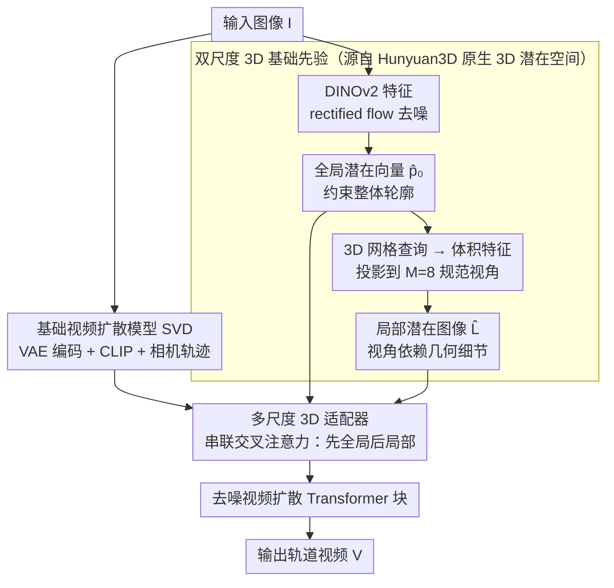

# Towards Realistic and Consistent Orbital Video Generation via 3D Foundation Priors

**会议**: CVPR 2026  
**arXiv**: [2604.12309](https://arxiv.org/abs/2604.12309)  
**代码**: 无  
**领域**: 3D视觉 / 视频生成  
**关键词**: 轨道视频生成, 3D先验, 视频扩散, 多视图一致性, 形状真实性

## 一句话总结

提出利用 3D 基础生成模型（Hunyuan3D）的潜在特征作为形状先验，通过多尺度 3D 适配器注入基础视频扩散模型，实现从单张图像生成几何真实且视图一致的轨道视频。

## 研究背景与动机

**领域现状**：轨道视频生成（从物体图像和相机轨迹生成视频）受到广泛关注，现有方法主要依赖像素级注意力来保证视图一致性。

**现有痛点**：像素级注意力在大视角变化下（如前视到后视）无法建立有效的像素对应关系，导致生成结果出现扭曲变形和不自然的结构。一些方法尝试用 2D 基础模型（如单视图深度图）作为几何条件，但 2.5D 先验无法建模完整物体形状，对未观察或遮挡部分仍然约束不足。

**核心矛盾**：视频扩散模型缺乏 3D 世界知识，仅靠 2D 注意力或 2.5D 先验无法保证大视角变化下的形状真实性。

**本文目标**：利用 3D 基础模型编码完整物体形状的能力，为视频生成提供有效的 3D 形状约束。

**切入角度**：3D 基础模型的潜在特征可以作为有效的 3D 形状先验，既提供辅助约束又增强视图一致性。

**核心 idea**：提取 3D 基础模型的两个尺度潜在特征（全局形状向量 + 视角依赖潜在图像），通过多尺度适配器注入视频扩散模型。

## 方法详解

### 整体框架

基于 SVD 的视频扩散模型为基础，输入图像同时送入 3D 基础模型（Hunyuan3D）获取形状先验。两个尺度的特征通过多尺度 3D 适配器以交叉注意力方式注入各 Transformer 块，引导视频生成。推理时 3D 特征提取仅需约 2 秒额外开销。

### 关键设计

**1. 双尺度 3D 基础先验：一个管整体轮廓，一个管视角细节**

像素级注意力之所以在大视角变化下失效，是因为它压根没有完整形状的概念；本文的对策是从 3D 基础模型里同时取出两个粒度的特征来补上这块缺失的"3D 世界知识"。其一是全局潜在向量 $\hat{\bm{p}}_0 \in \mathbb{R}^{L \times D}$，由一个 rectified flow 模型以输入图像的 DINOv2 特征为条件去噪得到，它把整个物体的结构压缩成一组紧凑 token，负责约束"这东西大体长什么样"。其二是局部潜在图像 $\hat{\mathbf{L}} \in \mathbb{R}^{M \times H_l \times W_l \times D'}$，做法是在一个规则 3D 网格上查询全局向量得到体积特征，再投影到 $M=8$ 个规范视角上，提供随视角变化的细粒度几何。两者互补：全局向量盯整体轮廓，局部潜在图像补每个视角的局部细节。关键是全程都停留在潜在空间里——不去解码出显式网格，因而省掉了网格提取这一步最耗时的开销，又不丢失完整形状信息。

**2. 多尺度 3D 适配器：用即插即用的交叉注意力把先验喂进去，而不动主干**

有了两个尺度的先验，还要找一种不破坏原视频模型能力的方式注入。适配器对每个 Transformer 块的输入特征 $\mathbf{f}_i^{(0)}$ 做两段串联的交叉注意力：先与全局向量融合得到 $\mathbf{f}_i^{(1)}$，再与局部潜在图像融合得到 $\mathbf{f}_i^{(2)}$，相当于"先定整体形状、再补视角细节"的顺序。全局向量会复制 $N$ 份让所有帧共享同一个形状参考，从而把多视图一致性钉在同一个 3D 物体上。因为这些都是挂在主干旁边的旁路模块、且 3D 基础模型本身冻结，基础视频模型从通用预训练继承的生成能力被原样保留，换一个更强的视频骨干也不必重训先验提取部分。

**3. 选 Hunyuan3D 当先验源：原生 3D 生成的潜在空间比 NVS 路线更适合做形状条件**

不是随便哪个 3D 模型的特征都好用。本文挑 Hunyuan3D 有两个具体理由：一是它不走"先生成多视角图再融合"的中间 NVS 步骤，而是直接在 3D 潜在空间里建模完整物体形状，因此潜在特征天然带着 3D 结构而非二维投影的残影；二是它用显式几何监督把形状和外观解耦，潜在空间语义更干净、更接近"纯形状"信息。相比之下，Hi3D 这类依赖 NVS 再精炼的方案，其中间表示既耗时又把形状质量耦合在初始重建上，作为条件并不理想——这也解释了为什么同样想引入 3D，本文的训练无关一次推理就能拿到更稳的形状约束。

### 损失函数 / 训练策略

标准去噪目标：$\mathcal{L} = \mathbb{E}[w(t) \| \mathcal{V}_\sigma(\bm{z}_t) - \bm{\epsilon} \|_2^2]$。3D 基础模型冻结，仅训练适配器（0.3B 参数）。在 Objaverse-XL 合成渲染数据上训练 80K 迭代。

## 实验关键数据

### 主实验

| 方法 | PSNR↑ | SSIM↑ | LPIPS↓ | CLIP-S↑ | MEt3R↓ |
|------|-------|-------|--------|---------|--------|
| SV3D | 20.48 | 0.91 | 0.12 | 92.84 | 0.07 |
| Hi3D | 19.32 | 0.90 | 0.14 | 90.61 | 0.09 |
| Hunyuan3D (渲染) | 20.25 | 0.91 | 0.11 | 93.44 | - |
| Wonder3D | 19.53 | 0.89 | 0.15 | 89.03 | - |
| **本文 (21帧)** | **22.78** | **0.92** | **0.09** | **94.19** | **0.05** |

### 消融实验

| 配置 | PSNR↑ | CLIP-S↑ | MEt3R↓ |
|------|-------|---------|--------|
| 无先验 (基线) | 20.06 | 91.26 | 0.08 |
| + 全局向量 | 21.86 | 93.12 | 0.06 |
| + 全局 + 局部 (完整) | **22.78** | **94.19** | **0.05** |

### 关键发现

- 全局向量显著提升多视图一致性（MEt3R 从 0.08 降到 0.06）和形状真实性（CLIP-S 提升近 2 个点）
- 局部体积特征进一步提升整体性能，尤其是视觉保真度（PSNR 提升约 1 点）
- 3D 特征提取开销极小（全局向量 1.8s + 体积特征 0.34s + 投影 0.11s）

## 亮点与洞察

- 用 3D 基础模型的潜在特征而非显式网格作为条件是一个关键创新：避免了耗时的网格提取，同时保留了完整的形状信息
- 适配器作为软约束：视频模型保留其随机性和平衡图像/形状条件的能力，不会过度约束生成

## 局限与展望

- 仅在合成数据上训练，真实场景的域差距可能存在
- 3D 基础模型推断的物体朝向可能与目标不完全对齐
- 仅评估了物体级视频，未扩展到场景级
- 可扩展到更长视频和更复杂的相机轨迹

## 相关工作与启发

- **vs SV3D/Hi3D**: 这些方法缺乏 3D 先验，大视角变化下产生不真实结构，本文通过 3D 基础模型解决
- **vs 迭代精炼方法**: Hi3D 等需要先重建粗糙 3D 再精炼，耗时且质量耦合于初始结果；本文的先验是训练无关的一次推理

## 评分

- 新颖性: ⭐⭐⭐⭐ 3D 基础模型潜在特征作为视频生成先验的思路新颖
- 实验充分度: ⭐⭐⭐⭐ 多基准多基线对比 + 充分消融
- 写作质量: ⭐⭐⭐⭐ 方法描述清晰
- 价值: ⭐⭐⭐⭐ 对轨道视频生成和新视角合成有重要推动

<!-- RELATED:START -->

## 相关论文

- [\[CVPR 2026\] Geometry-as-context: Modulating Explicit 3D in Scene-consistent Video Generation to Geometry Context](geometry-as-context_modulating_explicit_3d_in_scene-consistent_video_generation_.md)
- [\[CVPR 2025\] Learning Temporally Consistent Video Depth from Video Diffusion Priors](../../CVPR2025/video_generation/learning_temporally_consistent_video_depth_from_video_diffusion_priors.md)
- [\[ICCV 2025\] NormalCrafter: Learning Temporally Consistent Normals from Video Diffusion Priors](../../ICCV2025/video_generation/normalcrafter_learning_temporally_consistent_normals_from_video_diffusion_priors.md)
- [\[CVPR 2026\] VerseCrafter: Dynamic Realistic Video World Model with 4D Geometric Control](versecrafter_dynamic_realistic_video_world_model_with_4d_geometric_control.md)
- [\[CVPR 2026\] Gloria: Consistent Character Video Generation via Content Anchors](gloria_consistent_character_video_generation_via_content_anchors.md)

<!-- RELATED:END -->
