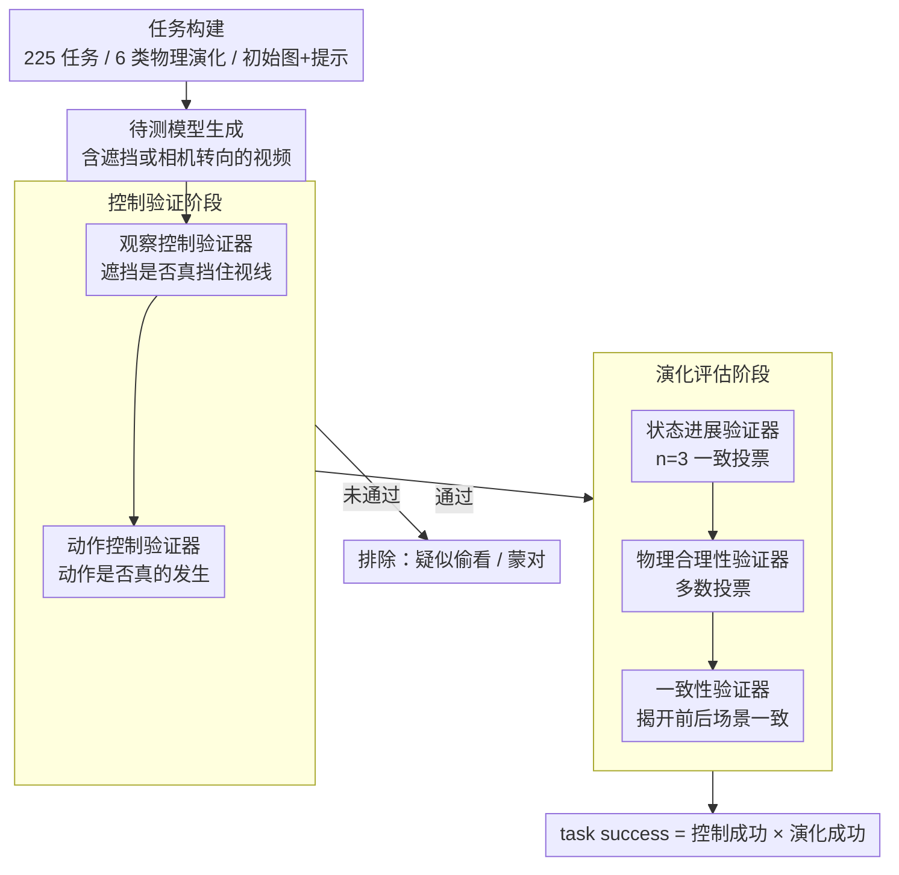

# Out of Sight, Out of Mind? Evaluating State Evolution in Video World Models

**会议**: CVPR 2026  
**arXiv**: [2603.13215](https://arxiv.org/abs/2603.13215)  
**代码**: [项目主页](https://glab-caltech.github.io/STEVOBench/)  
**领域**: 视频生成  
**关键词**: 视频世界模型, 状态演化, 遮挡测试, benchmark, 物理一致性

## 一句话总结
本文提出StEvo-Bench，一个包含225个任务的benchmark，通过在视频生成过程中插入遮挡或相机转向来测试视频世界模型能否在不可观测期间继续正确演化场景状态，发现当前最先进模型（包括Veo 3、Sora 2 Pro等）的成功率不到10%，揭示了视频模型将状态演化与观察高度耦合的根本问题。

## 研究背景与动机
1. **领域现状**：随着视频生成技术的飞速发展，人们开始将视频模型称为"世界模型"，期望它们能够模拟真实世界的物理过程。当前的视频世界模型包括通用视频生成模型（Veo 3, Sora 2 Pro, WAN 2.2等）和相机控制视频模型（Genie 3, HunyuanWorld等）。
2. **现有痛点**：现有benchmark只评估了世界模型的子集能力——物理直觉benchmark（VideoPhy）只测物理正确性，一致性benchmark（MIND）只测记忆/一致性，没有任何benchmark同时评估"当观察被中断时，状态是否继续正确演化"。
3. **核心矛盾**：真实世界中，物理过程不依赖于观察者——水在被遮挡时仍在流动，冰在不被看见时仍在融化。但视频模型通过生成像素帧来"模拟世界"，其内部状态可能与像素观察高度耦合。
4. **本文目标** 设计一套系统性的测试框架来回答：视频世界模型能否将状态演化与观察解耦？
5. **切入角度**：通过两种方式中断观察——在场景中插入遮挡物（纸板/窗帘/关灯）或控制相机转向——然后检查恢复观察时状态是否正确演化。
6. **核心 idea**：用"遮住-揭开"的实验范式系统性地证明当前视频世界模型无法实现状态演化与像素观察的解耦。

## 方法详解

### 整体框架
这篇工作要回答一个看似简单的问题：当观察被中断时，视频世界模型还能不能让场景状态按物理规律继续演化？为此它把测试做成一条可自动跑的流水线。给定一张初始图像和一段文本提示，先驱动待测模型生成一段中途含遮挡（或相机转向）的视频；生成后并不直接打分，而是先做一道控制验证，确认遮挡确实挡住了视线、该发生的动作也确实发生了——只有通过这道关的视频才有资格进入第三步演化评估，在那里检查遮挡期间状态是否仍在推进、推进得是否物理合理、揭开遮挡前后场景是否一致。整条链路的关键是把"模型有没有作弊地偷看"和"模型有没有真的理解演化"这两件事拆开，避免用一个笼统的成功率掩盖真正的失败原因。

### 关键设计

**1. 任务构建体系：把"看不见时世界还在变"做成 225 个可生成的物理演化任务**

现有 benchmark 要么只查物理是否正确（VideoPhy），要么只查静态场景的记忆一致性（MIND），没有一个专门盯着"观察被打断后状态有没有继续演化"。StEvo-Bench 用初始图像加文本提示来指定每个任务，覆盖六类常见的物理演化：连续过程（水流、融化）、运动学（抛物线、自由落体）、关系变化（多米诺骨牌）、因果变化（开关灯）、状态转换（燃烧、膨胀）和预期行为（人或动物的常识动作）。中断观察的手段按模型类型分两种——对通用视频生成模型，在场景里插入纸板、窗帘或直接关灯把目标遮住；对相机控制模型，则用一条转向轨迹把镜头从目标移开。这六类任务对应的正是真实世界里 agent 日常要面对的物理事件，覆盖面足够广才能让"成功率低"这个结论站得住脚，而不是只在某一种过程上的偶然失败。

**2. 自动验证器流水线：用 5 个只问一个 yes/no 的专家判官解耦失败模式**

225 个任务跨 11 个模型，靠人逐条打分既慢又不稳，而且笼统打分还说不清模型到底错在哪。这里用 Gemini 3.1 Pro 作 VLM 判官，但不让它一次性评估全部维度，而是拆成五个各管一件事的验证器：(a) 观察控制验证器查遮挡是否真的挡住了视线；(b) 动作控制验证器查该发生的动作是否正确发生；(c) 状态进展验证器查遮挡期间状态是否仍在推进，并用 $n=3$ 的一致投票（unanimous-vote）集成以压低误判；(d) 物理合理性验证器查演化是否符合物理，用多数投票；(e) 一致性验证器查遮挡前后场景是否时间一致。拆开的好处有两层：每个验证器只回答一个简单的 yes/no，比让模型同时权衡多个方面更可靠；而五路独立结论又能把一次失败精确归因到"没演化""演化但违反物理""外观突变"中的哪一类。为确认这套判官本身可信，作者还招募 3 名标注员在 180 个视频上人工标注，用 Accuracy、ROC-AUC 和模型排名一致性（MRA）三项指标对照，结果验证器与人类的一致性达到甚至超过标注员彼此之间的一致性，说明自动评估并没有引入额外偏置。

**3. 两阶段评估协议：先验控制、再评演化，最终成功率是两者相乘**

如果连遮挡都没生效，再去争论"状态有没有正确演化"就没有意义——模型完全可能是因为没遮住而"蒙对"。所以评估必须分阶段：第一阶段先过控制验证（观察控制加动作控制），不通过的直接排除；只有通过的视频才进入第二阶段评演化，而且要求三条标准同时成立——状态有进展、演化物理合理、揭开后一致性保持，缺一不可。两阶段相乘给出最终指标：

$$\text{task success} = \text{control success} \times \text{evolution success}$$

这样的乘法结构保证了任何一个"作弊式"通过都会被前一阶段拦下，最终报告的成功率反映的才是模型真正把状态演化与像素观察解耦的能力。

## 实验关键数据

### 主实验（各模型在StEvo-Bench上的表现 %）

| 模型类型 | 模型 | Success | Progress | Physics | Coherence |
|---------|------|---------|----------|---------|-----------|
| 视频模型 | Veo 3 | 8.7 | 17.4 | 82.6 | 66.5 |
| 视频模型 | Sora 2 Pro | 8.1 | 13.1 | 85.5 | 69.7 |
| 视频模型 | WAN 2.2 | 0.9 | 7.7 | 52.0 | 58.4 |
| 相机控制 | Genie 3 | 0.0 | 2.9 | 15.2 | 27.3 |
| 相机控制 | HY-WorldPlay | 0.0 | 0.0 | 72.2 | 88.2 |
| 相机控制 | GEN3C | 0.0 | 0.0 | 30.6 | 82.4 |

### 消融实验（全观察 vs 遮挡控制对比，Veo3 + Sora2 Pro平均）

| 条件 | State Progress | Task Success |
|------|---------------|-------------|
| 全程观察 | 84.6% | 46.2% |
| 加入观察控制 | 17.4% | 12.4% |

### 关键发现
- **所有模型成功率 < 10%**：最好的Veo 3也只有8.7%的综合成功率，揭示了当前视频世界模型的根本局限
- **进展停止是最普遍的失败模式**：加入遮挡后，状态进展率从84.6%暴跌到17.4%，说明模型确实"看不到就不演化"
- **一致性是第二大失败模式**：即使闭源顶级模型，一致性也只有~67%，遮挡移除后物体外观经常发生突变
- **相机控制模型更严重**：几乎所有相机控制模型的状态进展率接近0%，存在强烈的静态场景偏置
- **演化与相机控制互斥**：当相机控制模型能生成动态时，反而无法执行相机转向，反之亦然
- **记忆模块无助于状态演化**：VMem虽然能完美回忆初始帧，但无法推进状态演化，记忆架构鼓励的是外观记忆而非状态演化
- **训练数据偏置是根本原因之一**：相机控制模型训练数据以静态场景渲染为主（3DGS重建/UE场景），缺乏含丰富物理动态的视频

## 亮点与洞察
- **评估范式设计极具创意**：用"遮住-揭开"的实验方法论测试世界模型的"理解"能力，类似认知科学中对婴儿的object permanence测试。这个范式可以迁移到评估任何声称"理解世界"的AI系统
- **失败模式的解耦分析很有价值**：不是简单地报告"失败率"，而是将失败分解为进展停止、物理错误、一致性丧失三类，每一类都指向不同的改进方向
- **对视频世界模型架构的深刻洞察**：全对全双向注意力可能不适合处理遮挡帧，因为遮挡帧不提供状态演化信息。这暗示需要新的注意力机制来区分"信息帧"和"非信息帧"

## 局限与展望
- StEvo-Bench仅有225个任务，可能不足以覆盖所有物理过程类型
- 自动验证器依赖Gemini 3.1 Pro，本身可能存在偏置
- 仅测试了遮挡/关灯/转向三种观察中断方式，其他方式（如模糊、雾化）未探索
- 未提出解决方案，仅是诊断性工作
- 对于how to fix的讨论较为表面，指出了训练数据偏置但没有具体的解决方案

## 相关工作与启发
- **vs VideoPhy/VideoPhy2**: 只测物理正确性，不测遮挡下的状态演化，StEvo-Bench是更全面的测试
- **vs MIND**: 只测静态场景的记忆一致性，StEvo-Bench测动态过程的持续演化
- **vs WorldScore**: 综合但简单设置，StEvo-Bench专注于"未观察期间的演化"这一关键维度
- 这篇论文对做视频世界模型的研究者是重要的参考，指明了改进方向

## 评分
- 新颖性: ⭐⭐⭐⭐⭐ 首次系统性地测试视频世界模型的状态演化-观察解耦能力，实验设计极具创意
- 实验充分度: ⭐⭐⭐⭐⭐ 覆盖11个SOTA模型（开源+闭源），有验证器可靠性分析和人类标注对比
- 写作质量: ⭐⭐⭐⭐⭐ 论文讲故事清晰流畅，失败模式分析深入，insight丰富
- 价值: ⭐⭐⭐⭐⭐ 指出了视频世界模型的根本性局限，对该领域有重要指导意义

<!-- RELATED:START -->

## 相关论文

- [\[CVPR 2026\] VerseCrafter: Dynamic Realistic Video World Model with 4D Geometric Control](versecrafter_dynamic_realistic_video_world_model_with_4d_geometric_control.md)
- [\[CVPR 2026\] SeeU: Seeing the Unseen World via 4D Dynamics-aware Generation](seeu_seeing_the_unseen_world_via_4d_dynamics-aware_generation.md)
- [\[CVPR 2026\] PhysVid: Physics Aware Local Conditioning for Generative Video](physvid_physics_aware_local_conditioning_for_generative_video_models.md)
- [\[ICLR 2026\] DrivingGen: A Comprehensive Benchmark for Generative Video World Models in Autonomous Driving](../../ICLR2026/video_generation/drivinggen_a_comprehensive_benchmark_for_generative_video_world_models_in_autono.md)
- [\[CVPR 2026\] U-Mind: A Unified Framework for Real-Time Multimodal Interaction with Audiovisual Generation](u-mind_a_unified_framework_for_real-time_multimodal_interaction_with_audiovisual.md)

<!-- RELATED:END -->
