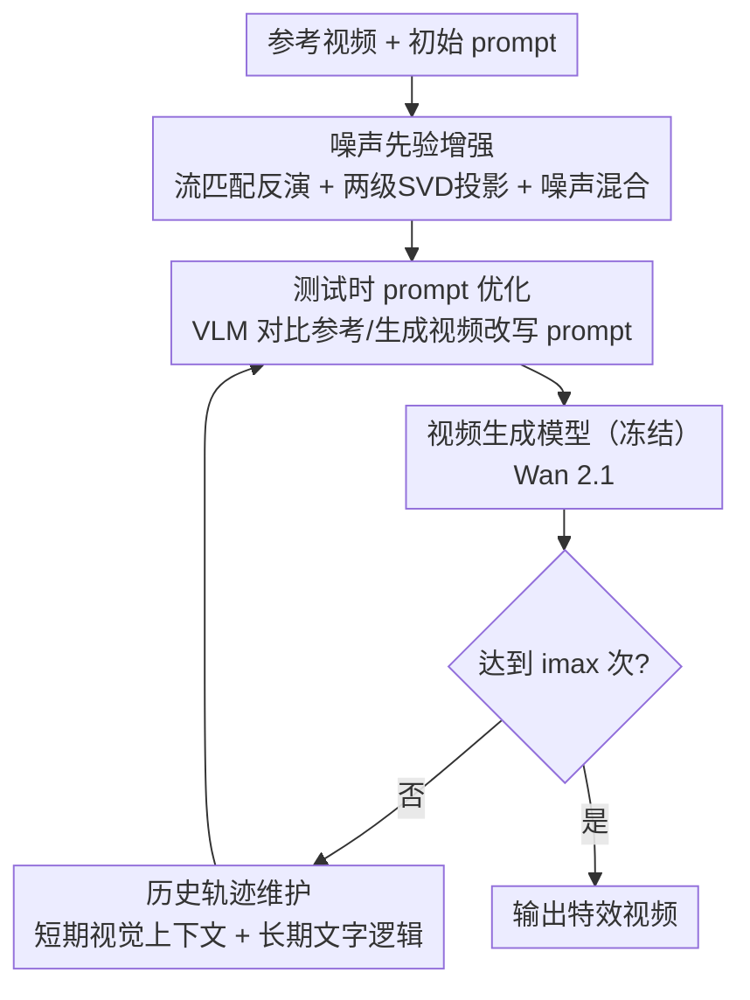

# P-Flow: Prompting Visual Effects Generation

**会议**: CVPR 2026  
**论文**: [CVF Open Access](https://openaccess.thecvf.com/content/CVPR2026/html/Zhao_P-Flow_Prompting_Visual_Effects_Generation_CVPR_2026_paper.html)  
**代码**: https://github.com/showlab/P-Flow  
**领域**: 视频生成（动态视觉特效定制）  
**关键词**: 视频特效生成、测试时 prompt 优化、免训练、流匹配反演、VLM 引导

## 一句话总结
针对「爆炸、挤压、坍塌等动态视觉特效难以靠一句文本 prompt 精确描述」的痛点，P-Flow 提出一个免训练框架：把文本 prompt 当作优化变量，用视觉语言模型（VLM）对比参考视频与生成视频的差异、迭代改写 prompt，配合噪声先验增强和历史轨迹维护，让冻结的视频生成模型在零微调下复现目标特效，在 T2V/I2V 上的 FID-VID、FVD、Dynamic Degree 及人评均超越基线。

## 研究背景与动机
**领域现状**：视频生成模型（Wan 2.1、HunyuanVideo 等）已能很好地跟随高层语义文本指令生成内容。但「动态视觉特效」——随时间演化、外观驱动的现象，如物体爆炸、被压扁、坍塌——的定制仍然欠探索。

**现有痛点**：以往的运动定制/控制工作主要盯**低层运动**（主体或相机的轨迹、位姿、光流），这些可以用显式控制信号引导；但动态视觉特效是**高层语义 + 时间演化**的东西，没有清晰的运动轨迹，显式条件难以刻画。而它天然适合用文本 prompt 表达——可人类要手写一条精确描述特效语义和时序的 prompt 极其困难、耗时，往往需要反复试错和复杂的时间推理。少数微调专用模型（如 VFX Creator）的路线又算力昂贵、且每种特效要单独训练、泛化差。

**核心矛盾**：特效控制最自然的媒介是文本，但「人手写一条好 prompt」既难又不可扩展；而「为每种特效微调模型」又贵又不通用——在「控制的灵活性」与「无需训练/无需人工调 prompt」之间存在矛盾。

**本文目标**：在不修改底层生成模型、不做任何训练的前提下，自动把一个参考视频里的动态特效迁移到新场景/新主体。

**切入角度**：作者把文本 prompt 本身当作**优化变量**，利用 VLM 的语义与时间推理能力，在测试时根据「生成视频 vs 参考视频」的特效差异自动改写 prompt，迭代逼近目标特效。

**核心 idea**：用 VLM 驱动的**测试时 prompt 优化**取代「人工写 prompt」或「微调模型」，把生成器当黑盒，只优化输入文本即可实现高保真特效定制。

## 方法详解

### 整体框架
P-Flow 全程免训练，只在测试时优化文本 prompt。给定一个含目标特效的参考视频 $V_{ref}$ 和描述新场景的初始 prompt $P_0$，目标是生成 $V_{gen}=G(P^*,\eta)$，使其在特效的语义与时序上最小化与 $V_{ref}$ 的差异 $D(V_{gen},V_{ref})$，同时遵守 $P_0$ 的内容约束。框架由三块协同：先用**噪声先验增强**为生成初始化既稳定又多样的隐噪声；再用 VLM 做**测试时 prompt 优化**，对比参考视频与当前生成视频改写 prompt；并用**历史轨迹维护**给 VLM 提供过往优化上下文。整个过程迭代「生成 → 评估 → 改写」，直到达到最大迭代次数 $i_{max}$。

### 关键设计

**1. 噪声先验增强：让迭代优化既稳定又保留探索**

作者发现初始隐噪声 $\eta$ 对优化稳定性和多样性影响很大——完全随机噪声会让各轮特效不一致、阻碍收敛，而固定噪声又限制探索陷入次优。于是设计了「反演 → 隔离 → 混合」三步。首先用**流匹配反演**从参考视频 $V_{ref}$ 反推出隐噪声：流匹配定义 ODE $\frac{dx_t}{dt}=v_\theta(x_t,t;P)$，从 $x_T=V_{ref}$ 沿参考 prompt $P_{ref}$ 反向积分得到 $\eta_{inv}=x_T-\int_0^T v_\theta(x_t,t;P_{ref})\,dt$，该噪声同时携带特效动态和与特效无关的外观属性（纹理、背景）。接着用**两级 SVD 投影**剥离外观、保留运动：先把 $\eta_{inv}$ 重排成 $N_s\in\mathbb{R}^{(C\cdot F)\times(H\cdot W)}$ 做 SVD，按能量阈值 $\rho_s$ 去掉前 $k_s$ 个主成分以抑制外观相关的空间变化；再沿时间轴重排成 $N_m\in\mathbb{R}^{(C\cdot H\cdot W)\times F}$ 二次 SVD，按阈值 $\rho_m$ 保留主导运动成分，得到 $\eta_{temporal}$。最后做**噪声混合**注入探索性：$\eta=\sqrt{\alpha}\cdot\eta_{temporal}+\sqrt{1-\alpha}\cdot\eta_{new}$，$\eta_{new}\sim\mathcal{N}(0,I)$，$\alpha$ 控制运动先验的影响。这样初始噪声既锚住了参考特效的运动、又留出随机性供 prompt 优化探索。

**2. 测试时 prompt 优化：把 prompt 当变量、用 VLM 做"梯度"**

这是框架的核心。第 $i$ 轮用当前 prompt $P_i$ 和增强噪声生成 $V^i_{gen}=G(P_i,\eta)$，然后把 $V_{ref}$、上一轮生成视频、$V^i_{gen}$ 竖直堆叠成一个复合视频 $V_{comb}$（统一分辨率帧率以便直接视觉对比）。VLM 被指示**只关注运动动态和视觉特效、显式忽略外观/身份差异**，分析两者差距后改写 prompt：$P_{i+1}=M(V_{comb},P_i,H;P_0)$，其中 $M(\cdot)$ 是 VLM 的结构化改写函数，输入复合视频、当前 prompt、历史轨迹 $H$ 和来自 $P_0$ 的原始内容约束，输出**只修改特效相关描述、保留原主体与环境**的新 prompt，并以结构化 JSON 返回分析与修订结果。相比人工写 prompt 或微调模型，这一步用 VLM 的语义/时序推理充当「优化器」，在不碰生成器权重的前提下逐步逼近目标特效。

**3. 历史轨迹维护：用「视觉短记忆 + 文字长记忆」兼顾连贯与效率**

为了让 VLM 的改写有方向感、避免在各轮间反复横跳或重复改动，作者维护一条历史轨迹 $H=\{(V_i,P_i,A_i)\}_{i=0}^{i_{max}-1}$，记录每轮的生成视频、prompt 和 VLM 分析。比如若前几轮一直在加强某个特效强度，VLM 倾向继续沿这个方向。但把所有历史视频都喂给 VLM 开销巨大（视频占大量视觉 token），于是作者**解耦两种记忆**：视觉输入只保留参考视频 + 上一轮生成 + 当前生成（短期视觉上下文，保留最相关时序信息又压缩 token），而所有 prompt $\{P_i\}$ 和 VLM 分析 $\{A_i\}$ 因语言 token 紧凑则全部保留（长期逻辑上下文）。这样既能让 VLM 跨轮推理过往改写、维持高层连贯与特效演进，又避免了处理长视觉序列的算力爆炸。

### 损失函数 / 训练策略
本方法**无训练**，没有损失函数。生成器用预训练 Wan 2.1 14B（T2V/I2V 通用），输出 480×832、81 帧；prompt 优化用 Gemini 1.5 Pro VLM；混合系数固定 $\alpha=0.001$，迭代 $i_{max}=10$ 轮。单视频 8 卡分布式推理约 69 秒、每卡约 40GB 显存；每轮额外 1.2 秒构造 VLM 输入、16.3 秒做 prompt 改写。

## 实验关键数据

### 主实验
在 Open-VFX 数据集（675 段视频、15 类特效、245 张参考图）上评测，指标为 **FID-VID**（视频版 FID，分布相似度，越低越好）、**FVD**（Fréchet Video Distance，时序连贯/真实感，越低越好）、**Dynamic Degree（Dyn. Degree，跨帧运动/变换程度，反映特效强度，越高越好）**。下表为 Overall（I2V+T2V 综合）结果：

| 方法 | 是否训练 | FID-VID↓ | FVD↓ | Dyn. Degree↑ |
|------|----------|----------|------|--------------|
| Wan 2.1 | 免训练基座 | 38.47 | 1265.07 | 0.31 |
| HunyuanVideo | 免训练基座 | 37.44 | 1266.13 | 0.43 |
| HunyuanVideo + HF（人工改 prompt 一次） | 免训练 | 35.20 | 1151.14 | 0.66 |
| **P-Flow (Ours)** | **免训练** | **31.13** | **882.63** | **0.91** |

VFX Creator 是训练型专用模型（每种特效单独训一个 LoRA、仅支持 I2V）：在 I2V 上 P-Flow 的 FID-VID（29.32 vs 29.92）、FVD（784.51 vs 752.95）与之相当，但 Dynamic Degree（0.94 vs 0.63）大幅领先，且 P-Flow 还能做 T2V、模型无关、零训练。人评（成对偏好）同样压倒性：

| 对比 | P-Flow 胜率 |
|------|-------------|
| P-Flow-I2V vs Wan 2.1-I2V | 80% |
| P-Flow-I2V vs HunyuanVideo-I2V | 84% |
| P-Flow-I2V vs VFX Creator | 58% |
| P-Flow-T2V vs Wan 2.1-T2V | 75% |
| P-Flow-T2V vs HunyuanVideo-T2V | 81% |

### 消融实验
三模块逐步叠加（Overall）：

| Noise-Enhance | Logic-Context | Visual-Context(i-1) | FID-VID↓ | FVD↓ | Dyn. Degree↑ |
|:---:|:---:|:---:|------|------|------|
| ✗ | ✗ | ✗ | 36.64 | 1205.47 | 0.63 |
| ✓ | ✗ | ✗ | 34.77 | 1072.10 | 0.68 |
| ✓ | ✗ | ✓ | 32.25 | 953.10 | 0.81 |
| ✓ | ✓ | ✓ | **31.13** | **882.63** | **0.91** |

噪声先验组件分析（Open-VFX，I2V）：

| 设置 | FID-VID↓ | FVD↓ | Dyn. Degree↑ |
|------|----------|------|--------------|
| 无 SVD 投影（$\rho_s=0,\rho_m=1$） | 33.25 | 1052.80 | 0.58 |
| 仅随机噪声（$\alpha=0$） | 32.74 | 923.67 | 0.73 |
| 增强噪声（$\alpha=0.001,\rho_s=0.1,\rho_m=0.9$） | **29.32** | **784.51** | 0.94 |

### 关键发现
- **仅靠 prompt 优化就已超基座**：即便三个消融模块全关，P-Flow 的 Dynamic Degree 也已超过 Wan 2.1，说明「文本 prompt 优化」本身就能显著提升时序动态。
- **三模块各有分工且互补**：Noise-Enhance 稳定优化、Visual-Context(i-1) 给 VLM 短期视觉洞察、Logic-Context 提供全轨迹长程语义，逐项叠加各指标单调改善。
- **超参权衡**：$\rho_s=0$（不抑外观）会残留参考视频外观先验、画质变差；$\rho_s$ 过高（>0.5）又过度抑制有用先验；$\rho_s=0.1$ 最佳。$\alpha=0$ 仅随机噪声因优化不稳效果有限；$\alpha=0.001$ 全面提升，升到 $0.01$ 时 FID-VID 略好但 Dynamic Degree 下降，体现保真度与运动动态的 trade-off。
- **相比训练型方法更不受约束**：VFX Creator 因训练样本被截成定长，会在特效完成前截断（如 Deflate 序列提前结束），还会编码数据集偏置（如 Venom 帧出现人形结构）；P-Flow 对参考视频时长/分辨率无约束、测试时按输入图与参考视频优化，自然避开这些失败。

## 亮点与洞察
- **"prompt 即优化变量"是最核心的转念**：把生成器当黑盒、只优化文本输入，既绕开微调的算力与泛化代价，又比人工 prompt 工程系统得多——这套思路可推广到任意「难以用一句话精确描述、但可由参考样例界定」的可控生成任务。
- **解耦视觉短记忆与文字长记忆**很巧妙：直接保留所有历史视频会让 VLM token 爆炸，作者只留最近两段视频做视觉上下文、却保留全部 prompt/分析做逻辑上下文，用语言 token 的紧凑性换来了长程连贯，是个可复用的「VLM 上下文预算」设计。
- **流匹配反演 + 两级 SVD 分离运动与外观**：从参考视频反演噪声再用 SVD 把「运动」和「外观」拆开，让初始噪声只锚住特效动态而不绑死外观，是噪声层面注入特效先验的优雅做法。
- 模型无关、训练免费、同时支持 T2V/I2V，工程上是真正的即插即用。

## 局限与展望
- **迭代成本不低**：默认 10 轮，每轮要完整生成一段视频（约 69 秒）+ 约 17.5 秒 VLM 推理，单样本端到端耗时与 API 成本可观。
- **依赖 VLM 与生成器的能力上限**：prompt 优化的天花板受 Gemini 的时序推理力和 Wan 2.1 的可生成范围限制；若生成器根本画不出某种特效，再优化 prompt 也无济于事。⚠️ 反演与 SVD 阈值 $\rho_s,\rho_m,k_s,k_m$ 的具体设定细节以原文/附录为准。
- 评测限于 Open-VFX 的 15 类特效，对该集合外的新型/组合特效泛化性未充分验证；FID-VID/FVD 这类分布指标对「特效是否语义正确」的刻画也有限。可改进方向包括减少迭代轮数（早停/置信度判定）、用更轻的开源 VLM 降本。

## 相关工作与启发
- **vs VFX Creator（训练型专用特效模型）**：它为每种特效单独训 LoRA、仅 I2V、受定长训练与数据偏置之苦；P-Flow 免训练、模型无关、T2V/I2V 通用，Dynamic Degree 大幅领先，FID-VID/FVD 相当。
- **vs 低层运动控制（轨迹/位姿/光流引导）**：那类方法擅长有明确轨迹的显式运动，但对「无清晰轨迹的高层语义特效」无能为力；P-Flow 用文本+VLM 推理补上了高层语义这一维。
- **vs EvolveDirector / VideoAlign（用 VLM 训练/对齐生成模型）**：它们用 VLM 去**训练**或对齐生成器；P-Flow 则把 VLM 用作**测试时优化器**，不动模型权重，这是 VLM 在视频生成里一个尚未被充分探索的用法。

## 评分
- 新颖性: ⭐⭐⭐⭐ 「prompt 当优化变量 + VLM 当优化器」的免训练特效定制思路新颖，但 test-time prompt 优化的大框架在图像域已有先例。
- 实验充分度: ⭐⭐⭐⭐ T2V/I2V 双设定、客观指标+人评+轨迹可视化+超参分析齐全，唯特效类别与基座数量可再扩。
- 写作质量: ⭐⭐⭐⭐ 动机清晰、三模块分工讲得明白；SVD 投影部分公式略密，需细读。
- 价值: ⭐⭐⭐⭐ 即插即用、模型无关的特效定制方案，对内容创作实用性强，思路也可迁移到其他可控生成。

<!-- RELATED:START -->

## 相关论文

- [\[CVPR 2026\] SynMotion: Semantic-Visual Adaptation for Motion Customized Video Generation](synmotion_semantic-visual_adaptation_for_motion_customized_video_generation.md)
- [\[CVPR 2025\] Visual Prompting for One-Shot Controllable Video Editing Without Inversion](../../CVPR2025/video_generation/visual_prompting_for_one-shot_controllable_video_editing_without_inversion.md)
- [\[CVPR 2026\] RFDM: Residual Flow Diffusion Models for Video Editing](rfdm_residual_flow_diffusion_models_for_video_editing.md)
- [\[CVPR 2026\] FlowDirector: Training-Free Flow Steering for Precise Text-to-Video Editing](flowdirector_training-free_flow_steering_for_precise_text-to-video_editing.md)
- [\[CVPR 2026\] Phantom: Physics-Infused Video Generation via Joint Modeling of Visual and Latent Physical Dynamics](phantom_physics-infused_video_generation_via_joint_modeling_of_visual_and_latent.md)

<!-- RELATED:END -->
