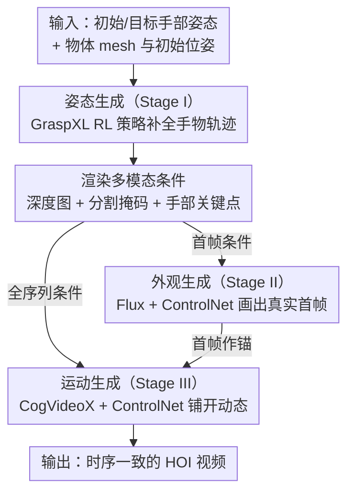

# PAM: A Pose-Appearance-Motion Engine for Sim-to-Real HOI Video Generation

**会议**: CVPR 2026  
**arXiv**: [2603.22193](https://arxiv.org/abs/2603.22193)  
**代码**: [https://gasaiyu.github.io/PAM.github.io/](https://gasaiyu.github.io/PAM.github.io/)  
**领域**: 3D视觉 / 扩散模型 / 视频生成  
**关键词**: 手物交互, sim-to-real, 可控视频生成, 扩散模型, 数据增强

## 一句话总结
提出PAM——首个仅需初始/目标手部姿态和物体几何即可生成逼真手物交互视频的引擎，通过解耦姿态生成、外观生成和运动生成三阶段，在DexYCB上FVD 29.13（vs InterDyn 38.83）、MPJPE 19.37mm（vs CosHand 30.05mm），生成的合成数据还能有效增强下游手部姿态估计任务。

## 研究背景与动机

1. **领域现状**：手物交互（HOI）的重建与合成在具身AI和AR/VR中越来越重要。数据驱动方法需要大规模标注HOI数据集，但人工标注成本极高限制了可扩展性。

2. **现有痛点**：当前HOI生成方法分为三个割裂的方向——(1) 姿态合成（如GraspXL）只预测MANO轨迹不生成像素；(2) 单图生成（如Affordance方法）从mask或2D线索生成外观但缺乏动态；(3) 视频生成方法（如InterDyn、ManiVideo）需要**完整的姿态序列和真实首帧**作为输入，无法实现真正的sim-to-real部署（因为模拟器没有真实首帧）。

3. **核心矛盾**：没有一个统一框架能同时处理姿态、外观和运动。特别是视频生成方法依赖真实首帧，这是sim-to-real链路的关键断点——模拟器只能产出几何和姿态数据，无法提供逼真的首帧图像。

4. **本文目标**：设计一个最小条件的HOI视频生成引擎——仅需初始和目标手部姿态+物体几何，即可生成逼真的时序一致的HOI视频，打通sim-to-real链路。

5. **切入角度**：将问题解耦为三个可分别优化的阶段：先用RL策略生成姿态序列，再用可控图像扩散模型生成首帧外观，最后用可控视频扩散模型生成完整视频。多模态条件（深度图、分割掩码、手部关键点）作为几何-语义-细节的三重约束。

6. **核心 idea**：通过三阶段解耦架构（姿态→外观→运动）和多模态条件控制，构建无需真实首帧的sim-to-real HOI视频生成引擎。

## 方法详解

### 整体框架
PAM 想解决的是 sim-to-real 链路上的一个具体断点：模拟器能给出物体几何和手部姿态，却给不出逼真的真实首帧，而过去的 HOI 视频生成方法偏偏都得拿真实首帧当输入。于是 PAM 把"从姿态到视频"这条路拆成三段、各用一个擅长的模型接力跑。输入是初始 MANO 手部姿态 $\mathbf{h}_0$、物体 mesh $\mathbf{m}$、初始物体位姿 $\mathbf{o}_0$ 和目标手部姿态 $\mathbf{h}_T$，最终由 $f_\theta: (\mathbf{h}_0, \mathbf{m}, \mathbf{o}_0, \mathbf{h}_T) \rightarrow \{I_t\}_{t=0}^T$ 输出整段逼真视频。第一段先把稀疏的"起点+终点姿态"补成完整手物轨迹 $\{\mathbf{h}_t, \mathbf{o}_t\}$，第二段凭轨迹首帧的几何条件"画"出真实首帧 $I_0$，第三段再以这张首帧为锚把整段动态铺开。三段都不碰真实首帧，链路才真正从模拟器一端贯通到真实视频。

### 关键设计

**1. 姿态生成（Stage I）：把"两端姿态"补成物理合理的中间轨迹**

模拟器只给得出起点和目标手部姿态，中间怎么过渡是空的。PAM 在这一段直接复用 GraspXL 的预训练 RL 策略，喂进 $\mathbf{h}_0$、$\mathbf{o}_0$ 和物体 mesh $\mathbf{m}$，让策略在仿真里滚出一条时序连贯的手物交互轨迹 $\{\mathbf{h}_t, \mathbf{o}_t\}$。选 RL 而不是监督回归，是因为前者在模拟器里能凭物理约束自己生成大量合理交互，不必依赖昂贵的人工标注；GraspXL 本身泛化性强、无需预定义参考抓取，所以这一段几乎是即插即用，不需要为新物体重新训练。这条轨迹是后两段所有条件图（深度、掩码、关键点）的来源。

**2. 外观生成（Stage II）：用几何条件"画"出本来不存在的真实首帧**

整条链路最关键的一步，就是把模拟器给不出的真实首帧补出来。PAM 微调 Flux 图像扩散模型，并用 ControlNet 接入三路条件——深度图 $D_0$、分割掩码 $S_0$、手部关键点图 $K_0$（各 $H \times W \times 3$）。三者经 VAE 编码成 $\frac{H}{8} \times \frac{W}{8} \times 16$ 的 latent 后沿通道拼接，再通过 zero-convolution 注入 DiT 的前两层，训练时只更新 ControlNet、冻结 Flux 主干。为什么非要三路一起上？深度图管全局几何、分割掩码管语义归属，但这两者都说不清手指有几根、每根指头什么姿态；手部关键点正好显式锁住手的结构。三路互补，生成的首帧才能既几何对齐又把手画对——这是单图生成类方法只靠 mask 做不到的。

**3. 运动生成（Stage III）：以首帧为锚把整段动态铺开且帧间不抖**

有了首帧和完整轨迹，最后一段要把单帧扩成视频且不能逐帧打架。PAM 以 CogVideoX 为视频扩散主干，同样挂 ControlNet：把每帧的深度、掩码、关键点渲成条件序列，经视频 VAE 编成 $\frac{T+1}{4} \times \frac{H}{8} \times \frac{W}{8} \times 16$ 的 latent，沿通道拼接后用 zero-convolution 注入 CogVideoX 的 12 个 duplicate DiT block。条件种类和 Stage II 保持一致，保证视频风格跟首帧对得上。和 CosHand 那种逐帧生成相比，CogVideoX 自带的时序 attention 天然约束帧间一致性，所以画面不会一帧一个样。训练时每路条件以 0.2 的概率被随机掩码，逼模型别死磕单一模态，掉一路条件也能撑住，泛化和鲁棒性都更好。

### 一个完整示例
以"抓一瓶芥末酱"为例走一遍：输入只有手张开悬在桌面上方的初始姿态 $\mathbf{h}_0$、瓶子的 mesh 和初始位姿，以及手已经握住瓶身的目标姿态 $\mathbf{h}_T$——中间怎么伸手、怎么合指全是空的。Stage I 让 GraspXL 策略在仿真里把这段补全，滚出每一帧的手姿和物体位姿 $\{\mathbf{h}_t, \mathbf{o}_t\}$。拿首帧那一组姿态渲出深度图、分割掩码和手部关键点，喂给 Stage II 的 Flux+ControlNet，"画"出一张带真实纹理和光照、手指数目正确的 RGB 首帧 $I_0$——这一步替代了模拟器给不出的真实图像。最后把全序列每帧的三路条件图渲出来连同 $I_0$ 一起交给 Stage III 的 CogVideoX，输出整段"伸手→接触→握紧芥末瓶"的逼真视频，帧间连贯、和首帧风格一致。全程没有用到任何真实拍摄的首帧。

### 损失函数 / 训练策略
外观和运动两段都用标准扩散去噪目标训练，数据均取 DexYCB 的 s0-split（6400 训练 / 1600 验证）。两段都只更新各自的 ControlNet、冻结基础扩散模型权重，因此训练量集中在条件注入分支上。

## 实验关键数据

### 主实验
DexYCB数据集对比：

| 方法 | FVD↓ | MF↑ | LPIPS↓ | SSIM↑ | PSNR↑ | MPJPE↓(mm) | 分辨率 |
|------|------|-----|--------|-------|-------|------------|--------|
| CosHand | 58.51 | 0.591 | 0.139 | 0.767 | 23.20 | 30.05 | 256×256 |
| InterDyn | 38.83 | 0.680 | 0.119 | 0.848 | 24.86 | - | 256×384 |
| **PAM(all)** | **29.13** | **0.712** | **0.069** | **0.914** | **30.17** | **19.37** | **480×720** |

OAKINK2数据集：FVD从CosHand的68.76降至46.31，MPJPE从14.49降至7.01。

### 消融实验（条件组合，DexYCB）

| 条件配置 | FVD↓ | MF↑ | MPJPE↓(mm) | 说明 |
|----------|------|-----|------------|------|
| Seg only | 33.23 | 0.695 | 21.14 | 仅分割掩码 |
| Depth only | 30.00 | 0.703 | 23.16 | 仅深度图 |
| Hand only | 33.41 | 0.713 | 20.70 | 仅关键点，MPJPE最低但其他差 |
| Depth+Seg | 29.32 | 0.712 | 22.51 | 几何+语义 |
| All three | **29.13** | **0.712** | **19.37** | 三条件最优 |

### 关键发现
- 三条件组合全面最优——关键点单独使MPJPE最低（显式姿态约束）但外观质量差，深度图和分割提供全局上下文，三者互补
- 下游任务验证：用生成的3400条视频（207k帧）增强训练，50%真实数据+全部生成数据即可匹配100%真实数据基线（PA-MPJPE: 5.5 vs 5.5），证明合成数据实用价值
- 零样本跨数据集：DexYCB训练的模型直接在OAKINK2（双手交互）上仍能生成合理结果，得益于预训练视频扩散模型的泛化能力
- 相比CosHand（仅靠手部mask条件），多条件+视频扩散base model带来全方位提升

## 亮点与洞察
- **解耦三阶段设计**：姿态/外观/运动分别优化，各取所长（RL生成物理合理姿态，扩散模型生成逼真外观和动态），避免了端到端训练的困难。这种解耦思路可迁移到其他sim-to-real生成任务
- **无需真实首帧**：之前的方法都需要ground-truth首帧，本文通过外观生成阶段替代，首次实现了真正的simulator→real video的完整链路
- **合成数据的下游价值**：不只评生成质量，还验证了生成视频作为训练数据增强下游任务的实际效果，50%真实数据+合成即达100%真实基线

## 局限与展望
- 依赖GraspXL的姿态生成质量，如果姿态不合理则下游视频也不合理
- 三阶段串联的误差可能累积（姿态不准→条件渲染不准→视频质量下降）
- 目前仅处理单手-单物体场景，双手或多物体交互需要扩展框架
- 外观生成的多样性受限于Flux和ControlNet的能力，复杂背景和光照变化可能不足
- 未来可探索将三阶段统一为端到端模型，减少中间步骤的信息损失

## 相关工作与启发
- **vs InterDyn**: InterDyn用ControlNet接手部mask序列做视频生成，但条件利用不充分且需要真实首帧。本文多条件+无需首帧，FVD从38.83降至29.13
- **vs CosHand**: CosHand仅用手部mask做conditioning，缺乏显式时序建模，逐帧生成导致帧间不一致。本文用视频扩散基础模型+时序attention保证连贯性
- **vs ManiVideo**: ManiVideo引入遮挡感知表示但需要人体外观数据（模拟器无法提供），不适用于sim-to-real

## 评分
- 新颖性: ⭐⭐⭐⭐ 三阶段解耦框架+多模态条件控制的设计虽然各组件不新，但组合方式和"无需首帧"的目标定位有创新
- 实验充分度: ⭐⭐⭐⭐⭐ DexYCB+OAKINK2两个数据集，条件消融、下游验证、零样本迁移，实验非常扎实
- 写作质量: ⭐⭐⭐⭐ 图示清晰，问题定义明确
- 价值: ⭐⭐⭐⭐⭐ 对具身AI的合成数据生成有很高实用价值，证明了sim-to-real HOI视频生成的可行性

<!-- RELATED:START -->

## 相关论文

- [\[CVPR 2026\] Captain Safari: A World Engine with Pose-Aligned 3D Memory](captain_safari_a_world_engine_with_pose-aligned_3d_memory.md)
- [\[ICLR 2026\] MoSA: Motion-Coherent Human Video Generation via Structure-Appearance Decoupling](../../ICLR2026/video_generation/mosa_motion-coherent_human_video_generation_via_structure-appearance_decoupling.md)
- [\[CVPR 2026\] SynMotion: Semantic-Visual Adaptation for Motion Customized Video Generation](synmotion_semantic-visual_adaptation_for_motion_customized_video_generation.md)
- [\[CVPR 2026\] ExPose: Reinforcing Video Generation Models for Extreme Pose Estimation](expose_reinforcing_video_generation_models_for_extreme_pose_estimation.md)
- [\[CVPR 2026\] StreamDiT: Real-Time Streaming Text-to-Video Generation](streamdit_real-time_streaming_text-to-video_generation.md)

<!-- RELATED:END -->
