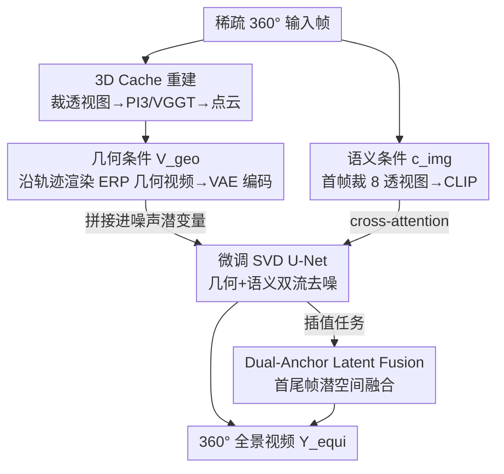

# Pantheon360: Taming Digital Twin Generation via 3D-Aware 360° Video Diffusion

**会议**: CVPR 2026  
**arXiv**: [2605.25449](https://arxiv.org/abs/2605.25449)  
**代码**: https://koi953215.github.io/pantheon360_page/ (项目主页)  
**领域**: 视频生成 / 3D视觉 / 扩散模型  
**关键词**: 360°全景视频, 数字孪生, 相机轨迹控制, 3D Cache, 视频扩散

## 一句话总结
Pantheon360 用从稀疏 360° 输入重建出的显式 3D 点云（"3D Cache"）沿任意用户指定相机轨迹渲染出"只有几何、没有纹理"的全景视频，再让微调后的 SVD 扩散模型在这个几何骨架上"贴皮"补真实纹理，从而在 in-the-wild 全景场景上实现精确轨迹控制 + 全局几何一致的数字孪生视频生成，PSNR / MET3R 等指标全面超过 GEN3C 等透视基线。

## 研究背景与动机
**领域现状**：要为机器人 / 自动驾驶仿真生成"动态、完整的数字孪生"，主流路线是相机可控的**透视视频生成**（camera-controlled perspective video generation）——给一段轨迹，让视频扩散模型逐帧生成沿轨迹看到的画面。代表工作有 ViewCrafter、TrajectoryCrafter、GEN3C，它们大多走"3D cache"范式：先重建场景几何，再沿目标路径渲染，用显式几何把生成 ground 住。

**现有痛点**：透视生成器的视场角（FoV）太窄，从第一帧起就对场景的大部分是"瞎的"。一旦要模拟长轨迹或多轨迹探索，模型必须反复"猜"和"幻觉"没看到的区域，导致两个老毛病：① **冗余条件**——同一块几何从不同视角被反复处理；② **空间/时间不一致**——生成的世界自相矛盾（同一扇门从不同角度看结构都对不上）。

**核心矛盾**：问题根源在于"窄 FoV ↔ 全局一致性"的根本冲突：要保证全局一致，就得让模型从一开始就掌握整个场景；但透视画面天生只能看到一小块。靠拉长轨迹、多视角拼接来补全局信息，反而放大了跨视角不一致与时序漂移。

**本文目标**：在**真实世界（in-the-wild）**的 360° 场景上，做到 ① 精确跟随任意用户定义的相机轨迹（而非只支持"前进/旋转"这类高层动作）；② 全局几何一致、跨视角不打架。

**切入角度**：作者主张 **360° 全景格式本身就是答案**。全景在 $t=0$ 就捕获了整个场景的上下文，天然提供透视模型缺失的"全局理解"，既简化了轨迹表示，又大幅改善一致性。但全景也带来新难题：等距柱状投影（ERP）的极端畸变，以及最关键的——精确几何控制困难（已有可控全景模型 GenEX 只能做高层动作控制，CamPVG 只在合成数据上验证）。

**核心 idea**：把"复杂 3D 几何推理"外包给一个**显式 3D Cache**，让扩散模型只负责"照片级纹理合成"这一件事——用几何骨架强约束一致性，用扩散模型补真实感纹理，二者解耦。

## 方法详解

### 整体框架
Pantheon360 建立在预训练潜空间视频扩散模型 SVD 之上，要解决的是"给稀疏 360° 输入 + 一条目标轨迹 $C_{target}=\{c_1,\dots,c_T\}$，生成等距柱状格式的时序一致全景视频 $Y_{equi}$"。整条管线的核心是一次**几何与纹理的解耦**：先把场景几何固化成一个点云 Cache，沿轨迹渲染出"只有几何"的全景视频 $V_{geo}$ 当骨架，再让扩散模型在骨架上贴真实纹理。

具体分四步走。**第一步**，把每张 360° 输入帧裁成多张透视子视图，喂给 3D 基础模型（PI3 或 VGGT）重建出显式 3D 点云，即 **3D Cache**。**第二步**，沿用户给定轨迹 $C_{target}$ 把点云渲染成 ERP 格式的几何视频 $V_{geo}\in\mathbb{R}^{T\times 3\times H'\times W'}$，再经 VAE 编码成潜空间骨架 $v_{equi}=\mathcal{E}(V_{geo})$。**第三步**，把首帧 $I_0$ 裁成 8 张透视图（每 45° yaw 一张）过 CLIP 抽语义特征 $c_{img}$。**第四步**，微调后的 SVD U-Net 同时吃几何条件（拼接进噪声潜变量）和语义条件（cross-attention），去噪生成最终全景视频。对插值任务额外用 dual-anchor latent fusion 把首尾两帧信息在潜空间融合，保证远视角间的平滑过渡。

### 关键设计

**1. 3D Cache：把几何推理从扩散模型里剥离出来的显式点云骨架**

这是全文的题眼，针对的正是"透视生成靠模型幻觉补几何 → 跨视角不一致"这个痛点。作者不让扩散模型去隐式地"理解 3D"，而是在推理时先从稀疏输入 $\{I_k\}$ 显式重建一份场景点云：把每张全景帧裁成多张透视图（绕开 CLIP/重建模型对 ERP 畸变不友好的问题），过 PI3 或 VGGT 这类 3D 基础模型得到点云。这份点云显式建模了场景的球面几何，并且框架对任何能产出点云的方法都兼容。关键在于——几何一致性此后由这份 Cache **硬性强制**，扩散模型再也不用"猜"看不见的区域几何，只需专注贴纹理。这与旧的透视 3D-cache 范式的区别在于：它把 cache 扩展到了 360° 域，靠全景输入天然覆盖全场景，从根上消除了 FoV 盲区。

**2. 几何条件 $V_{geo}$：沿轨迹渲染的"只有几何"全景视频当扩散骨架**

光有点云还不够，得把它变成扩散模型能吃的条件。作者沿用户轨迹 $C_{target}$ 把 3D Cache 渲染进 ERP 格式，得到几何视频 $V_{geo}\in\mathbb{R}^{T\times 3\times H'\times W'}$——这是一段"结构对、但纹理粗糙/有空洞"的视频。它过 VAE 编码成潜骨架 $v_{equi}=\mathcal{E}(V_{geo})$ 后，在每一个扩散去噪步都与噪声潜变量**拼接（concatenation）**输入 U-Net。这样轨迹信息以像素对齐的方式注入：用户想要什么相机路径，渲染出的 $V_{geo}$ 就长什么样，扩散模型只能顺着这个骨架去精修，因此能做到"精确跟随任意轨迹"，而不是 GenEX 那种只能"前进/旋转"的高层动作。

**3. 语义条件 $c_{img}$：8 透视裁切 + CLIP 绕开 ERP 畸变**

几何骨架管"结构在哪"，但不管"长什么样的纹理风格、首帧里有什么物体"。作者从首帧 $I_0$ 抽语义特征经 cross-attention 注入。这里有个全景特有的小坑：CLIP 在透视图上抽的特征比在畸变严重的 ERP 图上鲁棒得多。所以作者不直接喂整张全景，而是把 $I_0$ 按每 45° yaw 裁成 8 张透视帧，分别过 CLIP 提取器 $\mathcal{F}$，把结果特征拼成 $c_{img}$。这是个针对全景畸变的实用化处理，让语义条件在 ERP 场景下依然可靠。

**4. Dual-Anchor Latent Fusion：插值时缓冲 Cache 质量不佳导致的跳变**

主模型只条件于起始帧，但插值任务（在两个稀疏 360° 观测之间补中间视角，如拼接 Google 街景全景）需要同时锚定首尾。作者训了一个 dual-anchor 变体，同时条件于起始和结束帧。但即便如此，当稀疏输入视角太少、重建出的 3D Cache 质量欠佳时，点云几何会与目标终帧不一致，导致生成视频出现**突变/不连续**。为此作者引入 Time Reversal Fusion 的 latent fusion 技术：在潜空间层面平滑混合首尾两个锚点的信息，有效缓解几何不一致带来的跳变，同时保持时序平滑。这一招在街景合成这类"重建条件很差"的真实场景里尤其值钱（消融见 4.5 节）。

### 损失函数 / 训练策略
训练用标准扩散去噪目标，让 U-Net $f_\theta$ 把噪声潜变量 $y_{equi,t}$ 还原回 ground-truth 视频潜变量：

$$L=\mathbb{E}_{y_{equi},v_{equi},c_{img},t,\epsilon}\left[\lambda(t)\,\|\epsilon-f_\theta(y_{equi,t},t,v_{equi},c_{img})\|_2^2\right]$$

其中 $y_{equi}=\mathcal{E}(Y_{equi})$ 是真值视频潜变量，$v_{equi}=\mathcal{E}(V_{geo})$ 是几何骨架潜变量，$c_{img}$ 是语义特征。该式把 3D 几何信息 $v_{equi}$ 和语义上下文 $c_{img}$ 显式注入去噪过程。

**训练数据自动标注**是工程上的难点：训练集用 360-1M（大规模真实世界全景视频），但它无标签、缺相机位姿和 3D 几何。作者用 **on-the-fly** 标注：对每段真值视频 $Y_{GT}$，设 $Y_{equi}=Y_{GT}$，再用 ViPE 处理整段视频得到相机位姿轨迹 $C_{GT\_poses}$，并把 ViPE 优化出的 SLAM 点云当作 3D Cache（这些 SLAM 点是场景里几何最鲁棒的特征——用高质量非噪声点云能让模型学会"信任"几何条件而不是因几何太差而忽略它）；最后令 $C_{target}=C_{GT\_poses}$，沿这条真值轨迹渲染高保真 Cache 得到 $V_{geo}$，凑成训练对 $(Y_{equi}, V_{geo})$。single-anchor 与 dual-anchor 两个模型均在 $1024\times512$ 分辨率、4 张 A100 上各训 5 天；3D 重建用 PI3，置信阈值 0.25 + 天空遮罩。

## 实验关键数据

### 主实验
评测指标里 **MET3R** 衡量生成结果的多视角 3D 几何一致性（越低越好），其余 PSNR/SSIM/LPIPS/FVD 衡量像素级质量。所有指标都在从 ERP 输出每 45° yaw 裁出的 8 张透视图上计算以求公平。

**单 360° 视图 → 视频**（Web360 数据集，100 条测试序列）：

| 方法 | FVD ↓ | SSIM ↑ | PSNR ↑ | LPIPS ↓ | MET3R ↓ |
|------|-------|--------|--------|---------|---------|
| ViewCrafter | 525.7 | 0.371 | 15.65 | 0.284 | 0.4914 |
| TrajectoryCrafter | 517.5 | 0.454 | 15.15 | 0.219 | 0.4578 |
| GEN3C | 380.1 | 0.583 | 20.73 | 0.145 | 0.3496 |
| **Pantheon360 (Ours)** | **356.2** | **0.746** | **22.84** | **0.065** | **0.2840** |

**稀疏 360° 视图 → 视频**（Habitat 室内合成数据集，50 条测试序列，非闭合复杂轨迹）：

| 方法 | FVD ↓ | SSIM ↑ | PSNR ↑ | LPIPS ↓ | MET3R ↓ |
|------|-------|--------|--------|---------|---------|
| ViewCrafter | 778.2 | 0.193 | 11.83 | 0.398 | 0.5061 |
| TrajectoryCrafter | 690.3 | 0.216 | 12.22 | 0.461 | 0.6741 |
| GEN3C | 511.0 | 0.481 | 17.31 | 0.195 | 0.4522 |
| **Pantheon360 (Ours)** | **450.7** | **0.756** | **20.39** | **0.091** | **0.3026** |

两个设置下 Pantheon360 全指标第一，几何一致性提升尤其明显（Habitat 上 MET3R 0.3026 vs GEN3C 0.4522）。这印证了扩散模型确实有效地跟随了 Cache 的几何引导，在精确轨迹控制的同时保住了照片级合成质量。三个透视基线被适配到 360° 域的方式是：把 $V_{geo}$ 裁成 8 张透视图当它们的 3D 条件。

### 消融实验
在 30 个 Google 街景场景上验证 dual-anchor latent fusion。STWE 是 Short-Term Warping Error（短时形变误差，衡量时序一致性），IE 是 Interpolation Error（插值误差），PSNR/SSIM/LPIPS 衡量与终帧的对齐度。

| 配置 | STWE ↓ | IE ↓ | PSNR ↑ | SSIM ↑ | LPIPS ↓ | 说明 |
|------|--------|------|--------|--------|---------|------|
| Single | 0.124 | 4.784 | 20.92 | 0.661 | 0.271 | 仅条件起始帧；时序最一致但终帧对齐差 |
| Single + Latent Fusion | 0.420 | 12.083 | 28.01 | 0.817 | 0.112 | 加 fusion，终帧对齐大涨但 IE 反而恶化 |
| Dual | 0.419 | 8.120 | 27.86 | 0.817 | 0.093 | 双锚条件，收敛改善 |
| **Dual + Latent Fusion (Ours)** | 0.395 | **7.437** | **28.95** | **0.830** | **0.088** | 完整方法，综合最优 |

### 关键发现
- **Single 模型时序最稳但终帧对齐差**（PSNR 仅 20.92）：只锚定起始帧，自然往哪生成都"顺"，但飘到终点时与目标终帧对不上。
- **双锚 + latent fusion 才是最优组合**：单加双锚（Dual）能把 PSNR 拉到 27.86 改善收敛；再叠 latent fusion 进一步到 28.95、IE 降到 7.44，证明 fusion 确实在缓解几何不一致的同时保住了平滑插值。
- **几何一致性（MET3R）是本文相对基线优势最大的维度**，说明显式 3D Cache 的价值主要体现在"跨视角不打架"上，这正是透视基线的死穴。
- **下游验证**：从生成视频用 PI3 反向重建点云时，本文得到稠密、结构连贯的重建，而 GEN3C 只能产出稀疏、碎裂的结果——侧面佐证几何一致性更好。

## 亮点与洞察
- **"几何外包、扩散贴皮"的解耦思路干净有力**：把最难的 3D 一致性交给一个确定性的显式点云 Cache，扩散模型只干自己最擅长的纹理合成。这种分工让"精确轨迹控制"几乎免费——想要什么路径，渲染的几何骨架就长什么样，扩散没法乱跑。
- **用 360° 全景从根上解 FoV 盲区**很有说服力：透视生成的所有不一致几乎都源于"看不全"，全景在 $t=0$ 就锁定全局上下文，把"补几何"这个最易出错的环节直接删掉。
- **针对 ERP 畸变的两处实用工程值得复用**：① 重建/CLIP 都先把全景裁成透视图再处理，绕开畸变；② 训练标注用 ViPE 的 SLAM 点当 Cache，强调"用高质量点云让模型学会信任几何条件"——这个"别给模型烂条件、否则它会学着忽略条件"的观察对所有条件生成都通用。
- **自监督式的训练对构造很巧**：无标签全景视频靠 ViPE 自动标位姿+几何，令 $C_{target}=C_{GT\_poses}$ 让真值视频本身就是渲染目标，零人工标注地凑出 $(Y_{equi},V_{geo})$ 训练对。

## 局限性 / 可改进方向
- **作者承认**：3D Cache 主要编码静态场景几何，动态物体的运动只能靠扩散模型的学习先验，缺乏对物体级动态的显式控制——能"有"动态但不能"精确控"动态。未来可引入显式运动表示来细粒度控制物体动态。
- **强依赖 3D Cache 质量**：稀疏视角下点云若与目标终帧不一致会产生跳变，dual-anchor latent fusion 只是缓解而非根治；在重建条件极差时仍可能失效。
- **管线偏重、推理偏慢**：每次都要先跑 3D 基础模型重建点云、渲染几何视频，再做扩散，链路长；评测序列规模也不大（单视图 100 条、稀疏 50 条、街景 30 条），更大规模/更复杂场景的鲁棒性待验证。
- **几何与纹理解耦的代价**：纹理质量受限于扩散先验，对 Cache 未覆盖的大面积遮挡区域，最终效果仍取决于扩散模型"幻觉"得好不好。

## 相关工作与启发
- **vs GEN3C / ViewCrafter / TrajectoryCrafter（透视 3D-cache 生成）**：它们也用"重建几何 + 沿路径渲染"的 3D cache 范式，但局限于窄 FoV 的平面透视视频，看不全场景。本文把 3D-cache 扩展到 360° 域，用全景输入天然覆盖全场景，几何一致性（MET3R）显著更好。
- **vs GenEX（360° 世界模型）**：GenEX 只支持"前进/旋转"等高层动作控制，无法跟随精确预定义轨迹，且随帧数增加质量快速退化、几何越来越不一致；本文靠显式 3D Cache 实现精确轨迹跟随且全程质量稳定。
- **vs CamPVG（精确轨迹全景生成）**：CamPVG 主要在合成数据上验证，对真实复杂轨迹的适用性未知；本文在 360-1M 真实数据上训练，专攻 in-the-wild 场景。
- **vs PanoSplatt3R 等 360° 重建模型**：这类是重建模型，只能忠实复现已见视角、在它们之间插值，无法对大面积遮挡/全新区域做创造性补全；本文只把重建当 3D Cache，真正的纹理合成与未见区域补全交给在真实全景数据上训练的扩散模型。

## 评分
- 新颖性: ⭐⭐⭐⭐ 首个在 in-the-wild 360° 视频上做精确轨迹控制的框架，但"3D-cache 解耦几何与纹理"在透视域已有先例，主要是漂亮地迁移到全景域。
- 实验充分度: ⭐⭐⭐⭐ 单视图/稀疏视图/双视图 NVS/世界模型对比 + 消融 + 街景/稳像应用都覆盖到，但每项测试序列规模偏小。
- 写作质量: ⭐⭐⭐⭐ 动机（FoV 盲区）讲得清晰，pipeline 逻辑顺；部分实现细节推到补充材料。
- 价值: ⭐⭐⭐⭐ 数字孪生/仿真是刚需，全局一致的可控全景视频生成实用性强，且街景拼接、视频稳像等下游应用直接可落地。

<!-- RELATED:START -->

## 相关论文

- [\[CVPR 2026\] 3D-Aware Implicit Motion Control for View-Adaptive Human Video Generation](3d-aware_implicit_motion_control_for_view-adaptive_human_video_generation.md)
- [\[CVPR 2026\] Content-Aware Dynamic Patchification for Efficient Video Diffusion](content-aware_dynamic_patchification_for_efficient_video_diffusion.md)
- [\[CVPR 2026\] StereoWorld: Geometry-Aware Monocular-to-Stereo Video Generation](stereoworld_geometry-aware_monocular-to-stereo_video_generation.md)
- [\[CVPR 2026\] Towards Realistic and Consistent Orbital Video Generation via 3D Foundation Priors](orbital_video_3d_foundation_priors.md)
- [\[CVPR 2026\] EgoControl: Controllable Egocentric Video Generation via 3D Full-Body Poses](egocontrol_controllable_egocentric_video_generation_via_3d_full-body_poses.md)

<!-- RELATED:END -->
