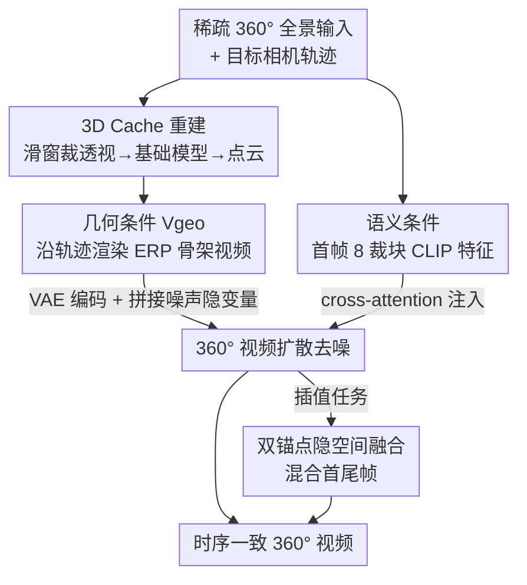

# Pantheon360: Taming Digital Twin Generation via 3D-Aware 360° Video Diffusion

**会议**: CVPR 2026  
**论文**: [CVF Open Access](https://openaccess.thecvf.com/content/CVPR2026/html/Chen_Pantheon360_Taming_Digital_Twin_Generation_via_3D-Aware_360deg_Video_Diffusion_CVPR_2026_paper.html)  
**代码**: 无（项目页 https://koi953215.github.io/pantheon360_page/ ）  
**领域**: 视频生成 / 扩散模型 / 3D视觉  
**关键词**: 360°视频生成, 相机轨迹控制, 3D Cache, 视频扩散, 数字孪生

## 一句话总结
Pantheon360 从稀疏（甚至单张）360° 全景图出发，先用 3D 基础模型重建一个显式点云「3D Cache」，沿用户指定相机轨迹渲染出几何骨架视频，再让微调后的 360° 视频扩散模型只负责往骨架上「贴」逼真纹理，从而在 in-the-wild 场景下实现精确轨迹控制 + 强几何一致性的 360° 视频合成。

## 研究背景与动机

**领域现状**：用生成式视频模型批量造「数字孪生」（dynamic digital twin，供机器人/自动驾驶做闭环仿真）正在取代传统 3D 重建。主流路线是「相机可控的透视（perspective）视频生成」——给定一段相机轨迹，让视频扩散模型生成沿途画面。

**现有痛点**：透视视频生成的视场（FoV）很窄，从第一帧起就「看不到」场景的大部分。当要模拟长轨迹或多轨迹探索时，模型必须反复猜测、幻想没见过的区域，导致两类问题：(1) 同一块几何被不同视角反复处理（冗余条件），(2) 生成的世界自相矛盾，出现严重的跨视角不一致与时序漂移。已有的可控 360° 方法又各有短板：GenEx 只能做「前进/旋转」这类高层动作控制，无法跟随精确轨迹；CamPVG 虽能精确控轨迹但只在合成数据上验证，没解决真实场景。

**核心矛盾**：让扩散模型同时承担「几何推理（保证全局一致）」和「纹理合成（保证逼真）」太重了——窄 FoV 下它根本拿不到足够的全局上下文去维持几何一致，于是只能边猜边画，越画越歪。

**本文目标**：在真实世界（in-the-wild）360° 视频上实现**精确相机轨迹控制**，同时保证跨视角几何一致和逼真度。

**切入角度**：作者主张 360° 全景天然适合这件事——从 $t=0$ 起就捕获整个场景的上下文，给生成提供强全局先验，轨迹表示也更简单。再借助近期强大的 3D 基础模型（PI3、VGGT）可以从稀疏全景快速重建可靠几何。

**核心 idea**：把复杂的 3D 几何推理「外包」给一个显式的 3D Cache（点云），扩散模型只专注于逼真纹理合成——几何一致性由 Cache 强制，逼真度由扩散负责，二者解耦。

## 方法详解

### 整体框架
输入是稀疏（或单张）360° 全景帧 $\{I_k\}$ 加一条用户定义的相机轨迹 $C_\text{target}=\{c_1,\dots,c_T\}$，输出是 equirectangular（ERP）格式的时序一致 360° 视频 $Y_\text{equi}\in\mathbb{R}^{T\times3\times H'\times W'}$。整条管线建立在预训练的隐空间视频扩散模型 SVD 之上，核心是把「几何」和「纹理」拆成两条独立链路。

推理时分四步：(1) 把每张 360° 帧滑窗裁成多张透视视图，喂给 3D 基础模型（PI3/VGGT）重建出显式点云 **3D Cache**；(2) 沿目标轨迹把点云渲染成「只有几何、没有纹理」的 ERP 视频 $V_\text{geo}$，经 VAE 编码成隐空间骨架 $v_\text{equi}=E(V_\text{geo})$，与噪声隐变量逐扩散步拼接，作为几何条件；(3) 从首帧裁 8 张透视图抽 CLIP 特征，作为语义条件经 cross-attention 注入；(4) 微调后的 360° 视频扩散 U-Net 同时吃几何+语义条件，去噪生成逼真视频。插值任务额外用「双锚点隐空间融合」混合首尾帧信息。

### 关键设计

**1. 3D Cache：把几何推理外包给显式点云，给扩散一个「免猜」的几何骨架**

这是全文的地基，直接针对「窄 FoV 下扩散要边猜边画导致几何不一致」这个痛点。作者不让扩散模型自己推理 3D，而是在推理时先从稀疏输入重建一个显式点云缓存。具体做法：把每张 360° 帧用滑窗裁成多张透视视图（CLIP/重建模型对透视图比对畸变的 ERP 图更鲁棒），喂给 PI3 或 VGGT 这类 3D 基础模型，得到显式刻画场景球面几何的点云。框架对任何能产出点云的方法都兼容。点云一旦建好，全局几何就被「钉死」了——后续无论相机怎么动，几何都来自同一个一致的 3D 表示，而不是逐帧幻想，这正是它能消除跨视角漂移的根本原因。

**2. 几何条件 $V_\text{geo}$：把点云沿轨迹渲成「只有几何」的骨架视频，逐步拼进扩散隐空间**

3D Cache 是静态点云，要让扩散「跟随轨迹」还需把它变成视频条件。给定目标轨迹 $C_\text{target}$，作者把点云按 ERP 格式沿轨迹渲染成 geometry-only 视频 $V_\text{geo}\in\mathbb{R}^{T\times3\times H'\times W'}$——画面里只有点云投影出的几何结构，没有逼真纹理。再经 VAE 编码 $v_\text{equi}=E(V_\text{geo})$，**在每个扩散步与噪声 ground-truth 隐变量 $y_{\text{equi},t}$ 拼接（concatenation）**作为 3D-aware 几何条件。这种「拼接式」注入比把相机参数当数值嵌入（Plücker 坐标等参数化方法）更强：扩散模型看到的是逐像素对齐的几何骨架，只需把纹理「填」上去，几何一致性天然由 $V_\text{geo}$ 强制。

**3. 双流条件 + 标准扩散目标：几何走拼接、语义走 cross-attention**

生成器 $G$ 是微调的 SVD U-Net $f_\theta$，被两条流同时调制。几何流即上面的 $v_\text{equi}$（拼接注入）；语义流则从首帧 $I_0$ 提特征——由于 CLIP 在透视图上比在畸变的 ERP 图上更鲁棒，作者把 $I_0$ 每隔 45° yaw 裁成 8 张透视帧，过 CLIP 抽取器拼成 $c_\text{img}$，经 cross-attention 注入。训练用标准扩散去噪目标：

$$L = \mathbb{E}_{y_\text{equi},v_\text{equi},c_\text{img},t,\epsilon}\big[\lambda(t)\,\|\epsilon - f_\theta(y_{\text{equi},t},\,t,\,v_\text{equi},\,c_\text{img})\|_2^2\big]$$

即让模型在几何条件 $v_\text{equi}$ 和语义条件 $c_\text{img}$ 引导下，把噪声隐变量去噪回真实视频隐变量。两路分工明确：几何决定「在哪、什么结构」，语义决定「长什么样」。

**4. 双锚点隐空间融合：补救稀疏视图下 3D Cache 不准导致的插值跳变**

单锚点模型只看首帧，做「首尾帧之间插值」时会失灵：稀疏输入重建的点云可能与目标末帧几何不一致，生成视频会突然跳变或不连续。作者训练了一个双锚点变体（同时条件于首、尾帧），但发现 Cache 质量差时它仍会跳。于是引入 Time Reversal Fusion 的隐空间融合：把从首帧前向生成（frame 1:N）和从尾帧反向生成（frame N:1）的隐变量在隐空间平滑混合，缓解几何不一致带来的突变，同时保持时序平滑。这一招对 Google Street View 这类重建条件差的真实场景尤其关键。

### 损失函数 / 训练策略
训练目标即上式标准扩散去噪损失。关键的训练数据生成是「on-the-fly 自标注」：源数据用大规模真实 360° 视频集 360-1M（先过滤掉误标 180°、静态海报、低运动片段）。由于 360-1M 无标注，作者对每段真实视频 $Y_\text{GT}$ 设 $Y_\text{equi}=Y_\text{GT}$，用 ViPE 做鲁棒 3D 估计得到相机轨迹 $C_\text{GT poses}$ 与 SLAM 点云（作为 3D Cache），再令 $C_\text{target}=C_\text{GT poses}$ 渲染出配对的 $V_\text{geo}$。作者强调用高质量非噪声点云很重要——否则模型会因几何太烂而学会「无视」几何条件。单锚/双锚模型均在 $1024\times512$ 分辨率、4×A100 上各训 5 天；3D 重建用 PI3，置信阈 0.25 + 天空掩膜。

## 实验关键数据

### 主实验

单张 360° 视图→视频（Web360 数据集，100 条测试序列，所有指标在 45° 间隔的 8 张透视裁块上计算）：

| 方法 | FVD ↓ | SSIM ↑ | PSNR ↑ | LPIPS ↓ | MET3R ↓ |
|------|-------|--------|--------|---------|---------|
| ViewCrafter | 525.7 | 0.371 | 15.65 | 0.284 | 0.4914 |
| TrajectoryCrafter | 517.5 | 0.454 | 15.15 | 0.219 | 0.4578 |
| GEN3C | 380.1 | 0.583 | 20.73 | 0.145 | 0.3496 |
| **Pantheon360（本文）** | **356.2** | **0.746** | **22.84** | **0.065** | **0.2840** |

稀疏 360° 多视图→视频（Habitat 数据集，非闭合折线轨迹，50 条测试序列）：

| 方法 | FVD ↓ | SSIM ↑ | PSNR ↑ | LPIPS ↓ | MET3R ↓ |
|------|-------|--------|--------|---------|---------|
| ViewCrafter | 778.2 | 0.193 | 11.83 | 0.398 | 0.5061 |
| TrajectoryCrafter | 690.3 | 0.216 | 12.22 | 0.461 | 0.6741 |
| GEN3C | 511.0 | 0.481 | 17.31 | 0.195 | 0.4522 |
| **Pantheon360（本文）** | **450.7** | **0.756** | **20.39** | **0.091** | **0.3026** |

两个设置下本文在全部指标上都领先，几何一致性指标 MET3R 提升尤为明显（稀疏视图 0.3026 vs. GEN3C 0.4522）。注意基线 ViewCrafter/TrajectoryCrafter/GEN3C 本为透视设计，作者把 $V_\text{geo}$ 裁成 8 张透视图喂给它们做公平适配。

### 消融实验

双锚点隐空间融合消融（30 个 Google Street View 场景；STWE=短期 warping 误差，IE=插值误差）：

| 配置 | STWE ↓ | IE ↓ | PSNR ↑ | SSIM ↑ | LPIPS ↓ |
|------|--------|------|--------|--------|---------|
| Single（仅首帧） | **0.124** | 4.784 | 20.92 | 0.661 | 0.271 |
| Single + Latent Fusion | 0.420 | 12.08 | 28.01 | 0.817 | 0.112 |
| Dual（首+尾帧） | 0.419 | 8.120 | 27.86 | 0.817 | 0.093 |
| **Dual + Latent Fusion（完整）** | 0.395 | **7.437** | **28.95** | **0.830** | **0.088** |

### 关键发现
- **末帧对齐 vs 时序一致是 trade-off**：Single 时序最稳（STWE 0.124）但末帧对齐最差（PSNR 仅 20.92，因为它根本不看末帧）；加入双锚点把 PSNR 拉到 27.86，再叠隐空间融合达到 28.95 + 最低 IE 7.44，说明融合确实在「插值平滑」和「末帧收敛」之间取得了最佳综合点。
- **几何一致性是最大卖点**：MET3R 在两个主实验里都大幅领先，且从生成视频反向用 PI3 重建点云时，本文得到稠密、结构连贯的点云，GEN3C 则稀疏破碎——直接验证了 3D Cache 强制几何一致的有效性。
- **应用层可无限延伸轨迹**：模型对锚帧收敛性强，可把上一段末帧当下一段锚帧串联，实现 Google Street View 上的无限轨迹延伸与 360° 视频稳像。

## 亮点与洞察
- **「3D Cache 解耦」是这篇最干净的设计哲学**：与其让一个网络又管几何又管纹理，不如把几何外包给确定性的点云渲染、让扩散只干它最擅长的纹理活——这种「确定性骨架 + 生成式贴图」的分工思路可迁移到任意需要强几何控制的视频/3D 生成任务。
- **360° 全景作为「天然全局上下文」的论证很有说服力**：作者用 Fig.2 直观说明窄 FoV 必须幻想遮挡区，而全景从第一帧就看全场景——这把「为什么要做 360°」从工程选择上升为方法论必要性。
- **on-the-fly 自标注绕开了 360° 真实数据无位姿的死结**：用 ViPE 的 SLAM 点云当 Cache、用其位姿当轨迹，让无标注的 360-1M 直接可训，且特意强调「高质量点云防止模型学会忽略几何条件」这一训练细节很实用。
- **把透视基线适配进 360° 评测**（裁 8 张透视图喂 $V_\text{geo}$）保证了对比公平，这种 adaptation trick 值得做 360° 工作时借鉴。

## 局限与展望
- 作者承认对**物体级动态的显式控制仍困难**：模型能靠学到的运动先验处理动态物体，但无法精确控制物体级运动。3D Cache 主要刻画静态几何（原文限制段在此处被截断 ⚠️ 以原文为准）。
- 强依赖 3D 重建质量：稀疏输入下点云若与目标末帧不一致就会跳变，虽有隐空间融合补救，但本质上把误差转嫁到了重建模块——重建模型失效的场景（极稀疏、强反光、纯天空）可能仍会崩。
- 评测中合成数据（Habitat）与真实数据（Web360）混用，但真实场景的定量评测序列数偏少（100/50 条），大规模真实 in-the-wild 的统计稳健性有待更多验证。
- 计算成本不低：单锚/双锚各训 5 天 ×4 A100，且推理需先跑一遍 3D 基础模型重建，端到端延迟未充分讨论。

## 相关工作与启发
- **vs GEN3C / ViewCrafter / TrajectoryCrafter（透视 3D-cache 路线）**：它们同样用「3D cache 渲染骨架 + 扩散」范式，但都为窄 FoV 透视视频设计，无法完整观察场景；本文把 3D-cache 范式扩展到 360° 域，用全景输入天然消除 FoV 限制，几何一致性指标大幅领先。
- **vs GenEx（360° 世界模型）**：GenEx 只支持「前进/旋转」等高层动作控制，质量随帧数快速退化；本文支持精确轨迹跟随且质量稳定。
- **vs CamPVG（精确轨迹 360°）**：CamPVG 能控轨迹但只在合成数据验证；本文用 360-1M 真实数据训练，首次在 in-the-wild 360° 视频上实现精确轨迹控制。
- **vs PanoSplatt3R（360° 重建模型）**：重建模型只能忠实复现已见视图、无法创造性补全大面积遮挡/未见区域；本文只把重建当 3D Cache，逼真合成与未见区域补全交给生成式扩散，几何更准、伪影更少。

## 评分
- 新颖性: ⭐⭐⭐⭐⭐ 首次把 3D-cache 范式扩展到 in-the-wild 360° 并实现精确轨迹控制，几何/纹理解耦思路清晰
- 实验充分度: ⭐⭐⭐⭐ 覆盖单视图/稀疏视图/双视图 NVS/世界模型对比+消融+多应用，但真实定量序列偏少、缺端到端效率分析
- 写作质量: ⭐⭐⭐⭐⭐ 动机递进有力（Fig.2 论证 360° 必要性），方法分流清晰，pipeline 易懂
- 价值: ⭐⭐⭐⭐⭐ 直指数字孪生/仿真刚需，几何一致的可控 360° 生成有强下游价值（Street View 合成、稳像）

<!-- RELATED:START -->

## 相关论文

- [\[CVPR 2026\] 3D-Aware Implicit Motion Control for View-Adaptive Human Video Generation](3d-aware_implicit_motion_control_for_view-adaptive_human_video_generation.md)
- [\[CVPR 2026\] CubeComposer: Spatio-Temporal Autoregressive 4K 360° Video Generation from Perspective Video](cubecomposer_spatio-temporal_autoregressive_4k_360_video_generation_from_perspec.md)
- [\[CVPR 2026\] Content-Aware Dynamic Patchification for Efficient Video Diffusion](content-aware_dynamic_patchification_for_efficient_video_diffusion.md)
- [\[CVPR 2026\] StereoWorld: Geometry-Aware Monocular-to-Stereo Video Generation](stereoworld_geometry-aware_monocular-to-stereo_video_generation.md)
- [\[CVPR 2026\] Towards Realistic and Consistent Orbital Video Generation via 3D Foundation Priors](orbital_video_3d_foundation_priors.md)

<!-- RELATED:END -->
