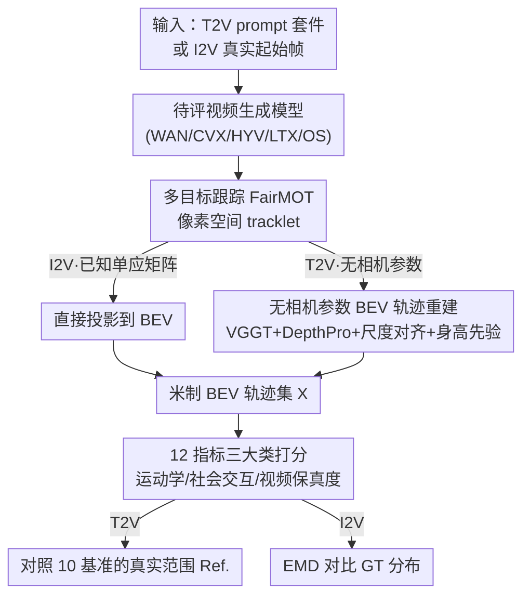

# PEDRA: Evaluating the Realism of Pedestrian Dynamics in Video Generation

**会议**: CVPR 2026  
**arXiv**: [2510.20182](https://arxiv.org/abs/2510.20182)  
**代码**: https://github.com/aaronappelle/PEDRA (有)  
**领域**: 视频生成 / 评测基准 / 行人动力学  
**关键词**: 视频生成评测, 世界模型, 行人仿真, BEV 轨迹重建, 多智能体动力学

## 一句话总结
PEDRA 提出一套严谨的评测协议，把文生视频（T2V）和图生视频（I2V）模型当作"隐式行人仿真器"来考核：它从生成视频里**无相机参数地重建出鸟瞰图（BEV）行人轨迹**，再用 12 个跨运动学/社会交互/视频保真度的指标衡量多智能体动力学的真实性，发现主流模型确实学到了"合理人群行为"的先验，但普遍存在行人**合并、凭空消失**等破坏物理一致性的失败模式。

## 研究背景与动机

**领域现状**：传统行人/人群仿真依赖专家手工调参的物理模型（社会力、global path planning 等），可扩展性和泛化性都差；与此同时，大规模视频生成模型在视觉真实度上突飞猛进，社区开始把它们当作"通用世界模拟器"来探索，初步在刚体动力学等物理任务上展现潜力。

**现有痛点**：现有视频质量基准（VBench 一类）几乎都在评 **单主体** 的真实性——单个人物动作好不好看、时序一不一致；而行人仿真的核心恰恰是 **多个相互作用的智能体**（避碰、个人空间、密度-速度关系等涌现社会现象）。生成视频里这种 multi-agent 动力学到底合不合理，从来没有被系统地量化评测过。

**核心矛盾**：要量化"行人动力学是否真实"，必须拿到 **米制尺度的 BEV 轨迹**（速度、加速度、避碰都得在世界坐标里算）。但 T2V 生成的是完全合成的场景，**没有任何已知相机内外参、没有 3D 几何、甚至不保证静止视角**，无法直接把像素轨迹投到地面坐标系——这是把视频模型当仿真器评测的根本障碍。

**本文目标**：(1) 设计一套覆盖不同人群密度与交互类型的评测协议，能同时考核 I2V 和 T2V 模型；(2) 解决"无相机参数下从像素重建 BEV 轨迹"这个关键技术难题；(3) 提出能反映物理与社会合理性的指标体系，给出主流模型的性能基线与失败模式画像。

**切入角度**：I2V 可以用 ETH/UCY 等真实行人数据集的起始帧作为条件，从而拿到 **ground truth 视频** 做直接分布对比；T2V 没有 GT，就构造结构化 prompt 套件，并把指标与 10 个公开行人基准统计出的"真实范围（Ref.）"对照。

**核心 idea**：用"3D 重建（VGGT）+ 度量深度（Depth Pro）+ 尺度对齐 + 人体身高先验"把合成视频反演成米制 BEV 轨迹，再用一套行人动力学指标去打分，从而首次把视频生成模型当作 **隐式多智能体仿真器** 来系统评测。

## 方法详解

### 整体框架

PEDRA 是一个评测协议而非新生成模型，整条管线分三段：**生成 → 轨迹提取 → 指标计算**。生成分两条轨：**I2V** 用 ETH/UCY 真实数据集的起始帧做条件（530 张非重叠起始帧，每帧生成视频，反复推理直到每个场景累计 ≥150 条轨迹或 1500 个检测），可与真实视频逐分布对比；**T2V** 用结构化 prompt 套件（密度×交互两轴共 9 类、每类 20 条 LLM 生成的场景描述、每条采样 5 次，每个模型共 900 段视频约 1.25 小时）。

轨迹提取是全流程的技术核心。无论哪条轨，先用现成多目标跟踪器 FairMOT 在像素空间得到 tracklet，以包围框底边中点作为地面接触点。**I2V** 因为数据集自带标定单应矩阵（homography），直接把像素轨迹投到 BEV 即可（同时为了公平，真实视频也用同一套 MOT 重新跑一遍，避免人工标注偏置）；**T2V** 是完全合成场景、无任何相机参数，于是引入"VGGT 估计相机内外参 + Depth Pro 估计度量深度 + RANSAC 尺度对齐 + 人体身高校验"的重建子管线，最终把像素轨迹反投影到统一的米制 BEV 坐标系。

拿到 BEV 轨迹集 $X=\{T^1,\dots,T^{|X|}\}$ 后，用 12 个指标分三大类打分：轨迹运动学、社会交互、视频保真度。T2V 与 10 个公开行人基准的"真实范围"对照；I2V 则用 Earth Mover's Distance（EMD）衡量生成分布与 GT 分布的差异。

### 关键设计

> 这是一篇评测/基准论文，"关键设计" = 评测协议 + 核心技术组件 + 指标体系 + 关键发现。

**1. 双轨评测协议与结构化 T2V prompt 套件：让"有无 GT"两种情形都可量化**

视频模型当仿真器评测最棘手的是 T2V 没有真值。PEDRA 把问题拆成两轨：**I2V** 借真实行人数据集（ETH、HOTEL、UNIV、ZARA1、ZARA2 五个场景）的起始帧作条件，生成视频可与对应真实视频 **逐分布** 比对；**T2V** 则把人群场景沿两个正交轴系统化——密度（稀疏 Sp./中等 Mo./拥挤 Cr.）和交互类型（定向 Di./多向 Mu./汇聚 Co.），共 9 个组合，每个组合让 Gemini 2.5 Pro 生成 20 条 "静止机位" 的场景描述，每条采样 5 次，得到每个模型 900 段视频。这种结构化设计让评测能精确回答"模型是否真的理解了密度/交互语义"，而不是只给一个笼统的真实度分数。

**2. 无相机参数的 BEV 轨迹重建：把"合成视频反演成米制地面轨迹"做成可行管线**

这是论文自称的"key component"，也是把 T2V 纳入评测的前提。合成场景没有相机参数、没有 3D 几何、连静止视角都不保证。PEDRA 的解法是：先用 **VGGT** 估计逐帧相机内参 $K_k$、外参 $(R_k,t_k)$ 和几何一致但 **无尺度** 的深度图 $D_{\text{norm},k}$；再用 **Depth Pro** 在关键帧上估计 **度量尺度** 深度 $D_{\text{metric},k}$，通过 RANSAC 把两套深度对齐求出逐帧尺度因子——每次迭代最小化缩放后 VGGT 深度与度量深度之间的 Huber 损失：

$$\lambda_k = \arg\min_{\lambda'} \sum_{p\in\mathcal{P}} \rho\big(|\lambda' \cdot D_{\text{norm},k}(p) - D_{\text{metric},k}(p)|\big)$$

其中 $\rho(\cdot)$ 是 Huber 损失、$\mathcal{P}$ 为有效像素集。最后再加一道 **人体身高先验** 做尺度校验：用针孔投影 $H_{\text{world}} = h_{\text{pixels}}\cdot Z_{\text{cam}}/f_y$ 估计每个人的真实身高，若全体均值落在 $(1.4, 2.0)$ 米合理区间之外，就把尺度因子校正到使均值等于 1.7 米；若两套深度除尺度外都对不上，则直接丢弃该视频样本。这一串"几何重建 + 度量深度 + 鲁棒对齐 + 生理先验"使得从纯合成像素也能拿到可信的米制轨迹。

**3. 12 指标三大类体系：把"物理合理 + 社会合理 + 视频质量"拆成可计算量**

PEDRA 用 12 个指标覆盖三类。**轨迹运动学**（个体运动是否符合生物力学）：速度 $M_{\text{vel}}$、加速度 $M_{\text{acc}}$、行进距离 $M_{\text{dist}}$，均为全体智能体均值。**社会交互**（多智能体涌现行为）：避碰率 $M_{\text{coll}}$（两人间距 < $\delta=0.1$ 米记为碰撞）、静止比例 $M_{\text{stat}}$（首尾位移 < 0.2 米记为静止，专门考核"有人停下来交谈/站立"这类常被忽略的行为）、人口数 $M_{\text{pop}}$（每帧活跃智能体均值，验证模型是否响应密度 prompt）、流量 $M_{\text{flow}}$（局部密度 $\rho^i_k$ × 速度，检验"密度越高人越慢"的基本图 fundamental diagram 是否成立）、最近邻距离 $M_{\text{nn}}$（个人空间，真实人群约呈 0.5–0.75 米双峰分布）。**视频保真度**：消失率 $M_{\text{disp}}$（轨迹在画面中央 80% 区域内中断的比例，反映行人凭空消失/跟踪失败）、MOT 置信度 $M_{\text{mot}}$（跟踪器置信度作可跟踪性代理，越高越好）、3D 几何置信度 $M_{\text{geo}}$（取自 VGGT 的深度不确定性，反映几何内部一致性）。

I2V 因有 GT，用 **归一化 EMD** 比较分布：$\widehat{\text{EMD}}(\mathcal{A},\mathcal{B}) = \text{EMD}\big(\frac{\mathcal{A}-\mu^{\text{GT}}}{s^{\text{GT}}}, \frac{\mathcal{B}-\mu^{\text{GT}}}{s^{\text{GT}}}\big)$，越低表示生成分布与真实分布越接近（指标加上标 $E$ 标注，如 $M^E_{\text{vel}}$）；T2V 无 GT，则直接报米制实数值并对照 10 个公开基准（ETH、UCY、PETS-2009、SDD、Grand Central、HERMES、KITTI、Edinburgh、Town Center、WildTrack）统计出的真实范围 Ref.。

**4. 失败模式画像：用指标定位"行人合并/消失"等物理一致性缺陷**

评测不只给分，更把主流模型的系统性失败模式量化出来。最突出的是 **智能体完整性缺失**：行人会相互合并成"流体状像素团"，或在轨迹中途凭空消失；合并在 T2V 的"拥挤（Cr.）"和"多向（Mu.）"prompt 下尤为常见。论文还观察到这些缺陷在 **占像素少的背景智能体** 上最严重，暗示"表征尺度"与"动力学一致性"之间存在关联；以及部分模型无视负向 prompt 让相机乱动、把行人区的停车误判为运动物体等场景理解错误。这些被指标（尤其 $M_{\text{disp}}$、$M_{\text{coll}}$、$M_{\text{geo}}$）捕捉的失败，正是下一代世界模型需要改进的具体靶点。

### 损失函数 / 训练策略
本文不训练任何模型，唯一的优化是 BEV 重建中 RANSAC 求尺度因子时对 Huber 损失（式 1）的最小化；其余均为评测计算。被测的 5 个模型（Wan2.1、CogVideoX1.5、HunyuanVideo、LTX-Video、Open-Sora 2.0）一律用各自默认超参、生成 5 秒视频，在 4×NVIDIA H200 上运行。

## 实验关键数据

被测 5 个 SOTA 模型（均含 I2V 与 T2V 变体）：Wan2.1 (WAN)、CogVideoX1.5 (CVX)、HunyuanVideo (HYV)、LTX-Video (LTX)、Open-Sora 2.0 (OS)。

### 主实验

**I2V 评测（ETH/UCY 五场景平均，EMD 越低越好；$M_{\text{mot}}$ 越高越好）**

| 模型 | $M^E_{\text{vel}}$ | $M^E_{\text{acc}}$ | $M^E_{\text{dist}}$ | $M^E_{\text{coll}}$ | $M^E_{\text{pop}}$ | $M^E_{\text{flow}}$ | $M^E_{\text{disp}}$ | $M_{\text{mot}}\uparrow$ |
|------|------|------|------|------|------|------|------|------|
| WAN | 0.457 | 0.782 | 0.370 | 0.029 | 0.701 | 0.384 | 0.331 | 0.497 |
| HYV | **0.419** | **0.639** | **0.288** | 0.033 | 0.467 | 0.228 | 0.158 | 0.500 |
| OS | 0.549 | 0.703 | 0.462 | 0.047 | 0.916 | 0.180 | 0.514 | 0.486 |
| LTX | 0.510 | 0.747 | 0.391 | 0.041 | 0.568 | 0.745 | **0.130** | **0.503** |
| CVX | 0.808 | 0.706 | 0.621 | 0.054 | 0.892 | 0.228 | 0.169 | 0.491 |

（注：表中省略了 $M^E_{\text{stat}}$、$M^E_{\text{nn}}$ 两列以保持可读；完整 10 列见原文表 2。⚠️ 个别数值因 PDF 取文存在串列风险，以原文为准。）

结论：**没有任何模型在所有指标上全面领先**。HYV 在运动学（速度/加速度/距离）三项最佳；LTX 在可跟踪性（$M_{\text{mot}}$ 最高、$M^E_{\text{disp}}$ 最低）上最佳，即生成的行人最连贯易跟踪；OS 最擅长还原真实的人流流量；WAN 最接近真实的低碰撞率。

**T2V 评测（5 模型全类别平均 vs 真实范围 Ref.，单位见列名）**

| 模型 | $M_{\text{vel}}$ (m/s) | $M_{\text{acc}}$ (m/s²) | $M_{\text{coll}}$ (%) | $M_{\text{pop}}$ | $M_{\text{flow}}$ | $M_{\text{nn}}$ (m) | $M_{\text{disp}}$ (%) | $M_{\text{mot}}\uparrow$ |
|------|------|------|------|------|------|------|------|------|
| **Ref.（真实）** | 0.91 | 0.65 | 1.19 | 13.77 | 0.54 | 1.18 | – | – |
| WAN | 0.56 | 0.83 | 5.33 | 56.83 | 1.30 | 0.72 | 29.19 | 0.54 |
| HYV | 0.66 | 0.91 | 9.88 | 35.36 | 1.73 | 0.69 | 29.11 | 0.54 |
| OS | 0.38 | 0.50 | **2.68** | 22.79 | **0.21** | **1.06** | 31.89 | **0.56** |
| LTX | 0.80 | 1.19 | 7.62 | 33.76 | 1.14 | 0.74 | 32.19 | 0.56 |
| CVX | 0.40 | 0.65 | 5.77 | 28.51 | 0.50 | 0.80 | 33.56 | 0.51 |

结论：**多数模型低估行人速度**（LTX 最接近真实，但加速度偏高失真）；**所有模型都高估人口数**；OS 碰撞率最低却仍超真实值 2 倍以上；HYV 流量超真实值 3 倍多，越过物理合理上限；消失率 $M_{\text{disp}}$ 普遍高达 29–34%，说明"行人凭空消失"是共性问题。

### 消融实验

本文是评测论文，没有传统模块消融，取而代之的是 **按 prompt 类别拆解的语义响应分析**（5 模型平均）：

| 实验类别 | $M_{\text{vel}}$ | $M_{\text{coll}}$(%) | $M_{\text{pop}}$ | $M_{\text{flow}}$ | $M_{\text{nn}}$(m) | 说明 |
|------|------|------|------|------|------|------|
| Ref. | 0.91 | 1.19 | 13.77 | 0.54 | 1.18 | 真实参考 |
| 密度 Sp. | 0.66 | 1.71 | 4.79 | 0.45 | 1.62 | 稀疏 |
| 密度 Mo. | 0.67 | 3.29 | 24.33 | 0.44 | 0.97 | 中等 |
| 密度 Cr. | 0.51 | 7.57 | **74.75** | 1.18 | **0.69** | 拥挤：人口暴涨、间距骤减、碰撞率飙升 |
| 交互 Di. | 0.66 | 7.14 | 32.56 | **1.64** | 0.73 | 定向：速度/流量最高 |
| 交互 Mu. | 0.55 | 4.00 | 41.06 | 0.52 | 0.93 | 多向 |
| 交互 Co. | 0.47 | 8.19 | 32.59 | 0.90 | 0.73 | 汇聚：速度最低 |

### 关键发现
- **模型确实理解了密度/交互语义**：人口数随"稀疏→拥挤"单调上升（4.79→24.33→74.75），定向场景速度/流量高于多向/汇聚，说明模型学到了文本到视觉的潜在映射，甚至能复现"funnel 汇聚""人在码头上避开水面"等涌现社会行为。
- **碰撞率随密度上升**：拥挤场景超 7% 行人处于接触状态，部分反映真实拥挤，但也暴露避碰建模的失败。
- **失败与表征尺度相关**：合并/消失在 **占像素少的背景智能体** 上最严重，且在"拥挤+多向" prompt 下最常见——VAE 高压缩（LTX、OS）虽提速但易把密集人群糊成一团。
- **训练数据过滤是元凶之一**：WAN 显式移除"拥挤街景"、HYV 微调时过滤掉 >5 人的视频，这些偏向"单主体真实性"的选择可能正是密集场景表现差的原因。

## 亮点与洞察
- **把"视频模型当仿真器"从定性吹捧变成可量化考核**：以往说"Sora 像世界模拟器"多停留在观感，PEDRA 给出米制轨迹 + 12 指标 + 真实范围对照，第一次让"多智能体动力学到底真不真实"有了可比的数字。
- **无相机参数 BEV 重建是可迁移的工程组件**：VGGT（几何一致无尺度）+ Depth Pro（度量尺度）+ RANSAC 对齐 + 身高先验校验这套组合拳，可直接用于任何"从野生/合成视频反演米制场景几何"的任务，不止行人评测。
- **用生理先验兜底尺度**："均值身高落在 (1.4, 2.0) 米外就校正到 1.7 米、否则丢样本"是个朴素却有效的鲁棒性 trick，把不可控的单目尺度歧义约束在人类常识里。
- **失败模式定位精准**："背景小目标更易合并/消失"把问题归到表征分辨率，这对改进生成模型（提高密集人群下的 token 分配）是具体可操作的方向。

## 局限与展望
- **作者承认**：(1) 多阶段轨迹提取管线会引入标签噪声，尤其 T2V 的尺度估计（已用身高校验 + 低置信过滤缓解）；(2) 只覆盖一批当前代表性模型，且生成时长仅 5 秒，**无法分析长程导航或保真度随时间衰减**——而这恰是传统人群仿真擅长的。
- **自己发现**：(1) 评测严重依赖 FairMOT 的跟踪质量，"消失率""MOT 置信度"等指标会与跟踪器能力耦合，换跟踪器结论可能漂移；(2) T2V 的"真实范围 Ref."来自 10 个真实基准，但其平均密度可能低于 PEDRA 的"拥挤广角"场景，"高估人口"的结论需带 caveat；(3) 用 VGGT 的不确定性当"3D 几何置信度"是间接代理，与"视觉真实度"的相关性是观察而非严格因果。
- **改进思路**：引入更长时长生成 + 时间维度的保真度衰减曲线；用多跟踪器集成或检测-跟踪联合校准降低 MOT 依赖；把指标体系反向用作生成模型的训练/对齐信号（如以低碰撞率、合理基本图作奖励）。

## 相关工作与启发
- **vs 行人轨迹预测（Social-LSTM / GAN / GNN / 扩散）**：传统方法聚焦"从历史观测条件预测单个体的短期轨迹"，难以泛化到未见环境或重建多智能体动力学；PEDRA 评的是"从零生成整个人群场景 + 长程多智能体导航"，是 holistic crowd simulation 的视角。
- **vs 世界模型（Genie / 扩散世界模型 / V-JEPA 2 等）**：这些多采用 ego-centric 单智能体视角、动作条件生成；PEDRA 关注 **多智能体俯视人群** 这一不同范式。
- **vs 视频生成基准（VBench 等）**：现有基准把质量拆成时序一致性、动作真实性、美学等层次，但面向单主体/静态交互，且多依赖 VLM 打分；PEDRA 把评测 **锚定在真实行人数据集的强先验上**，填补了"多人交互动力学是否物理/社会合理"的空白。
- **启发**：把"先重建可解释的物理量（BEV 轨迹）、再用领域指标打分"的思路，可推广到自动驾驶、机器人等其他需要评测生成视频物理合理性的场景。

## 评分
- 新颖性: ⭐⭐⭐⭐⭐ 首个系统评测视频模型多智能体行人动力学的协议，"无相机参数 BEV 重建"组件解决了 T2V 评测的根本障碍。
- 实验充分度: ⭐⭐⭐⭐ 覆盖 5 个 SOTA 模型 × I2V/T2V × 9 类场景 × 12 指标，并对照 10 个真实基准；但生成仅 5 秒、缺长程与跟踪器鲁棒性分析。
- 写作质量: ⭐⭐⭐⭐⭐ 动机清晰、指标定义严谨给公式、失败模式画像具体可操作。
- 价值: ⭐⭐⭐⭐⭐ 给"视频生成模型作世界模拟器"立了可量化的基线与靶点，代码开源，对世界模型/人群仿真社区有实用价值。

<!-- RELATED:START -->

## 相关论文

- [\[CVPR 2026\] SeeU: Seeing the Unseen World via 4D Dynamics-aware Generation](seeu_seeing_the_unseen_world_via_4d_dynamics-aware_generation.md)
- [\[CVPR 2026\] VideoRealBench: A Chain-of-Thought Realism Evaluation Benchmark for Generated Human-Centric Videos](videorealbench_a_chain-of-thought_realism_evaluation_benchmark_for_generated_hum.md)
- [\[CVPR 2026\] SymphoMotion: Joint Control of Camera Motion and Object Dynamics for Coherent Video Generation](symphomotion_joint_control_of_camera_motion_and_object_dynamics_for_coherent_vid.md)
- [\[CVPR 2026\] Phantom: Physics-Infused Video Generation via Joint Modeling of Visual and Latent Physical Dynamics](phantom_physics-infused_video_generation_via_joint_modeling_of_visual_and_latent.md)
- [\[ECCV 2024\] Evaluating Text-to-Visual Generation with Image-to-Text Generation](../../ECCV2024/video_generation/evaluating_text-to-visual_generation_with_image-to-text_generation.md)

<!-- RELATED:END -->
