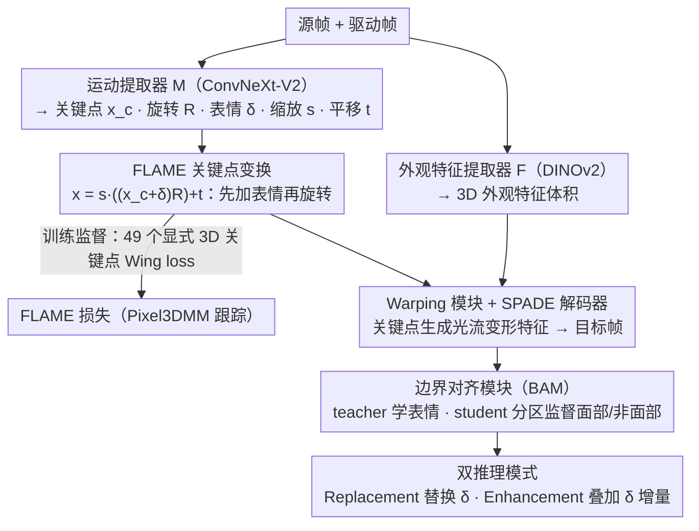

# PerformRecast: Expression and Head Pose Disentanglement for Portrait Video Editing

**会议**: CVPR 2026  
**arXiv**: [2603.19731](https://arxiv.org/abs/2603.19731)  
**代码**: [https://youku-aigc.github.io/PerformRecast](https://youku-aigc.github.io/PerformRecast)  
**领域**: 视频生成  
**关键词**: 人像视频编辑, 表情解耦, 3DMM, 关键点变换, GAN

## 一句话总结

PerformRecast 提出了一种基于改进 3DMM 关键点变换公式的 GAN 人像视频编辑方法，通过将表情形变加在头部旋转之前（与 FLAME 模型一致）实现表情与头部姿态的精确解耦，并引入边界对齐模块解决面部/非面部区域的拼接错位问题，在表情替换和表情增强两种模式下均显著优于现有方法。

## 研究背景与动机

**领域现状**：人像动画（portrait animation）领域已有大量工作，包括基于 GAN 的 warping 方法（LivePortrait、Face Vid2Vid 等）和基于 Diffusion 的方法（SkyReels、Hunyuan-Portrait、Wan-Animate 等）。这些方法通常从静态肖像图生成由驱动视频控制的动画。

**现有痛点**：现有方法的核心难题在于**表情与头部姿态的解耦**。人像视频的"表情编辑"任务要求只改变面部表情而严格保持原始的面部 ID、头部姿态、相机运动和背景不变——任何表情之外的变化都被视为失败。但现有方法：（1）Diffusion 方法天然难以解耦表情和头部旋转，推理速度慢且时序一致性差；（2）GAN-based warping 方法（如 LivePortrait）虽然更可控，但其隐式关键点缺乏明确物理意义和直接监督，解耦不彻底。

**核心矛盾**：LivePortrait 的关键点变换公式为 $x = s \cdot (x_c R + \delta) + t$，即先将 canonical 关键点乘以头部旋转 $R$，再加上表情形变 $\delta$。这个顺序与 3DMM 的前向过程不一致——3DMM（如 FLAME）是先加表情形变再做头部旋转。LivePortrait 的顺序导致学到的 $\delta$ 中会泄漏残余的头部姿态信息，无法实现真正的解耦。

**本文目标**（1）修正关键点变换公式使其与 FLAME 前向过程一致；（2）用显式 3D 关键点直接监督运动提取器；（3）解决表情编辑时面部与非面部区域的边界错位问题。

**切入角度**：3DMM 天然用独立参数表示身份、表情和头部姿态。作者抓住 FLAME 的前向过程——先加表情再旋转——这一物理正确的顺序来改进 LivePortrait。

**核心 idea**：修改关键点变换顺序为"先加表情再旋转"以匹配 FLAME，并用 3D 面部跟踪的显式关键点直接监督 motion extractor。

## 方法详解

### 整体框架

PerformRecast 基于 LivePortrait 的 warping 架构构建：输入源帧和驱动帧，由外观特征提取器 $\mathcal{F}$（基于 DINOv2）提取 3D 特征体积，由运动提取器 $\mathcal{M}$（ConvNext-V2-Tiny）预测 canonical 关键点 $x_c$、头部旋转 $R$、表情形变 $\delta$、缩放 $s$ 和平移 $t$。通过改进的 FLAME 关键点变换公式生成源/驱动关键点，warping 模块生成光流对特征体积进行变形，最后由 SPADE 解码器生成目标图像。训练采用与 Pixel3DMM 3D 面部跟踪配合的 FLAME 损失进行显式监督；边界对齐模块用 teacher-student 分区监督压住边界错位；推理阶段提供替换与增强两种编辑模式。

### 关键设计

**1. FLAME 关键点变换：让形变顺序回归物理正确**

这是全文的命门。LivePortrait 的关键点变换写成 $x = s \cdot (x_c R + \delta) + t$——canonical 关键点先乘头部旋转 $R$，再加表情形变 $\delta$。问题在于此时 $\delta$ 是在"已经旋转过的坐标系"里补偿差值，它被迫去拟合一部分头部姿态的残差，表情里就混进了姿态信息，解耦自然不彻底。PerformRecast 只把括号挪了个位置，改成

$$x = s \cdot \big((x_c + \delta)\, R\big) + t$$

也就是**先在 canonical 坐标系里加表情、再整体旋转**。这一步和 FLAME 的前向过程对齐了——模板网格先叠加表情 blendshapes，再做关节旋转——于是 $\delta$ 只负责"表情该怎么变形"，旋转完全交给 $R$，两者各司其职。

光改公式还不够，还得给 $\delta$ 一个明确的物理参照。作者借 Pixel3DMM 做 3D 面部跟踪，从 FLAME 网格顶点里取 49 个显式 3D 关键点，分三组直接监督运动提取器：canonical 关键点 $V_c$（只含身份）、表情关键点 $V_{exp}$（含表情和眼球/下巴旋转、但不含头部旋转）、完整关键点 $V_{kp}$（含所有参数），三组都用 Wing loss 算 FLAME 损失。有了这种显式 3D 监督，原本 LivePortrait 里那些靠隐式约束兜底的损失（关键点等变性损失、关键点先验损失）反而成了多余，可以直接砍掉——监督信号本身就把关键点钉在了物理正确的位置上。

**2. 边界对齐模块（BAM）：把"改表情"和"别动其他地方"拆开学**

warping 场是全局的，3D 关键点一动，光流不可避免地波及面部以外的区域，发际线、耳朵、脖子这些地方就会跟着错位。BAM 用 teacher-student 两阶段把这个矛盾拆开：第一阶段先训一个 teacher $M_t$，只用全局动画损失，它能生成很准的面部表情，但边界依然糊。第二阶段的 student $M_s$ 同时学两件事——面部区域用 teacher 产出的中间结果 $\hat{I}_s^t$（只替换了 $\delta$）做监督，非面部区域则直接拿原始源帧 $I_s$ 做监督。一边照着 teacher 学精准表情，一边照着原图学"原样不动"，错位区域自然被压住。这样还有个附带好处：不用再训 LivePortrait 那套 stitching 和 retargeting 模块，训练流程更干净。

**3. 双推理模式：Replacement 换表情，Enhancement 加表情**

同一套模型给了两种实用编辑方式。Replacement 模式直接拿驱动帧的 $\delta_d$ 替换源帧的 $\delta_s$、其余参数全留着，适合演员整体表演到位、只想换掉那段表情的场景。Enhancement 模式不做整体替换，而是在源帧表情上叠加驱动帧的表情增量 $\delta_{d,i} - \delta_{d,0}$，相当于把原有表情的幅度往上推一档，适合只想局部放大表情的需求。两种模式都只在 $\delta$ 这一项上做文章，正好印证了前面解耦的价值——表情被干净地隔离出来，才能这样自由地替换或叠加。

### 损失函数 / 训练策略

整体训练损失为 $\mathcal{L}_{animate} = \mathcal{L}_{FLAME} + \mathcal{L}_{P,cascade} + \mathcal{L}_{1,cascade} + \mathcal{L}_{G,cascade} + \mathcal{L}_{faceid}$，其中 FLAME 损失对三组关键点做 Wing loss 监督，cascade 损失是感知/L1/GAN 损失的级联版本，faceid 损失保持身份一致性。BAM 阶段额外引入面部和非面部区域的分离监督损失。训练数据包括 VFHQ、MEAD、Nersemble 等公开数据集加上互联网高清动画/电影视频，共约 60 万视频片段。

## 实验关键数据

### 主实验

使用 MetaHuman 数字人构建的表情编辑测试基准（20 个数字人，18 种表情），Replacement 模式：

| 方法 | PSNR↑ | SSIM↑ | LPIPS↓ | AED↓ | APD↓ | FVD↓ |
|------|-------|-------|--------|------|------|------|
| LivePortrait | 27.73 | 0.899 | 0.059 | 0.610 | 0.016 | 165.1 |
| SkyReels-A1 | 24.91 | 0.859 | 0.162 | 0.716 | 0.016 | 1249.7 |
| Hunyuan-Portrait | 22.43 | 0.792 | 0.169 | 0.661 | 0.035 | 1925.1 |
| Wan-Animate | 22.82 | 0.802 | 0.132 | 0.700 | 0.024 | 849.2 |
| **PerformRecast** | **29.27** | **0.914** | **0.047** | **0.499** | **0.012** | **103.0** |

Enhancement 模式下 PerformRecast 同样全面领先（PSNR 30.27, FVD 90.2）。

### 消融实验

| 配置 | PSNR↑ | AED↓ | FVD↓ | 说明 |
|------|-------|------|------|------|
| Ours (Full) | 29.27 | 0.499 | 103.0 | 完整模型 |
| Ours (KT of LP) | 27.06 | 0.573 | 288.8 | 使用 LivePortrait 原始关键点变换 |
| Ours (w/o FLAME loss) | 24.99 | 0.663 | 188.1 | 去掉 FLAME 损失 |
| Ours (w/o T-S) | 27.73 | 0.575 | 136.4 | 去掉 teacher-student (BAM) |

### 关键发现

- **关键点变换公式改进**是最关键的设计：使用 LP 原始公式时 PSNR 从 29.27 降到 27.06，FVD 从 103.0 升到 288.8，说明顺序对解耦至关重要
- FLAME 损失提供的显式监督使 AED 从 0.663 降到 0.499，说明明确的 3D 关键点约束比隐式学习更有效
- BAM 主要改善了边界区域质量（FVD 从 136.4 降到 103.0），非面部区域的保真度提升明显
- 在传统 portrait animation 任务上，PerformRecast 也均优于 LivePortrait（自驱动 PSNR 22.88 → 更高，跨ID CSIM 更高）

## 亮点与洞察

- **关键点变换顺序的改进看似微小但影响巨大**——只是把 $x_c R + \delta$ 改成 $(x_c + \delta) R$，就带来了 PSNR 2.2+ 的提升和 FVD 接近 3x 的降低。这说明在 warping-based 动画中，让模型架构与底层物理模型对齐是非常重要的 inductive bias。
- **Teacher-Student 的分区域监督**巧妙地解决了全局优化和局部保真度的冲突：teacher 专注于面部表情的准确性，student 从 teacher 学面部同时从 GT 学非面部。这种分区监督思路可以迁移到任何需要局部编辑但保持全局一致的生成任务。
- 相比 diffusion-based 方法的巨大优势（FVD 减少 10x+）表明，在需要精细可控性的编辑任务中，GAN-based warping 方法仍然是更好的选择。

## 局限与展望

- 输入分辨率固定为 512×512，对高清电影级应用可能不足
- 仍然基于 2D 面部分割来定义面部/非面部区域，对遮挡严重或极端角度可能不够鲁棒
- Enhancement 模式通过简单的表情形变叠加实现，缺乏对表情幅度的精细控制
- 3D 面部跟踪（Pixel3DMM）的精度仍然是上限约束——如果跟踪失败，FLAME 损失也会引入错误监督
- 未评估大角度侧脸或极端光照下的表现

## 相关工作与启发

- **vs LivePortrait**: 本文直接基于 LivePortrait 构建并改进。关键差异是关键点变换顺序和 FLAME 显式监督。LivePortrait 需要额外的 stitching/retargeting 模块，PerformRecast 因解耦更好不需要这些。
- **vs Diffusion-based 方法（SkyReels-A1、Hunyuan-Portrait、Wan-Animate）**: Diffusion 方法在表情编辑任务上表现很差（PSNR 低 4-7 分，FVD 高 8-19 倍），因为它们的运动表示无法精确解耦表情和姿态。
- **vs Act-Two（Runway 商业产品）**: Act-Two 无法准确保持源视频的头部姿态，且细粒度表情细节丢失（PSNR 20.83 vs 29.27）

## 评分

- 新颖性: ⭐⭐⭐⭐ 关键点变换顺序改进虽然看似简单但 insight 深刻，BAM 的分区域监督也有创新性
- 实验充分度: ⭐⭐⭐⭐⭐ 自建 MetaHuman benchmark、与多种方法对比、完整消融、多任务评估
- 写作质量: ⭐⭐⭐⭐ 结构清晰，动机阐述到位，但部分公式符号可以更精简
- 价值: ⭐⭐⭐⭐ 对影视后期制作有直接实用价值，解耦表情编辑是刚需

<!-- RELATED:START -->

## 相关论文

- [\[CVPR 2026\] THEval: Evaluation Framework for Talking Head Video Generation](theval_evaluation_framework_for_talking_head_video_generation.md)
- [\[CVPR 2026\] HarmoVid: Relightful Video Portrait Harmonization](harmovid_relightful_video_portrait_harmonization.md)
- [\[CVPR 2026\] EmoDiffTalk: Emotion-aware Diffusion for Editable 3D Gaussian Talking Head](emodifftalk_emotion-aware_diffusion_for_editable_3d_gaussian_talking_head.md)
- [\[CVPR 2026\] PersonaLive! Expressive Portrait Image Animation for Live Streaming](personalive_expressive_portrait_image_animation_for_live_streaming.md)
- [\[CVPR 2026\] FaceCam: Portrait Video Camera Control via Scale-Aware Conditioning](facecam_portrait_video_camera_control_via_scale-aware_conditioning.md)

<!-- RELATED:END -->
