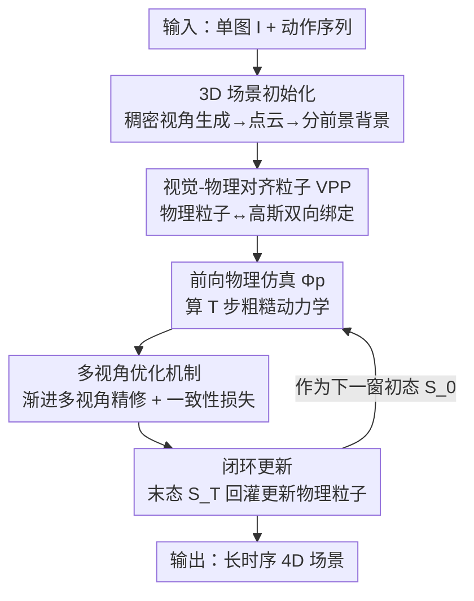

# PerpetualWonder: Long-horizon Action-conditioned 4D Scene Generation

**会议**: CVPR 2026  
**论文**: [CVF Open Access](https://openaccess.thecvf.com/content/CVPR2026/html/Zhan_PerpetualWonder_Long-horizon_Action-conditioned_4D_Scene_Generation_CVPR_2026_paper.html)  
**代码**: 无（项目页 https://johnzhan2023.github.io/PerpetualWonder/ ）  
**领域**: 4D生成 / 视频生成 / 世界模型  
**关键词**: 4D场景生成、动作条件、混合生成式仿真、闭环系统、多视角优化

## 一句话总结
PerpetualWonder 从单张图片出发，用一个「物理仿真前向 + 视频模型反向优化」的**闭环**混合生成式仿真器，配合把物理粒子和高斯基元绑死在一起的统一表示（VPP），让 4D 场景能够连续响应多步动作（推、戳、风、重力），在长时序交互下保持物理合理和视觉一致，相比前作 WonderPlay 在可控性和 3D 一致性上大幅领先。

## 研究背景与动机
**领域现状**：从单图生成可交互的 4D 场景（随时间演化的 3D 场景）是世界模型的核心能力，对 VR/AR、游戏、具身智能都有用。早期靠传统物理仿真，控制精确但「真实感鸿沟」大——简化物理 + 解析渲染拍不出真实世界的材质形变、光影、溅射这类复杂视觉现象。近来兴起的**混合生成式仿真器**（hybrid generative simulator）思路是：先用物理仿真出粗糙的、动作驱动的动力学，再用视频生成模型当「神经精修器」补上高保真视觉。

**现有痛点**：最相关的前作 WonderPlay 实现了这个混合思路，但它**只能做单时间窗内的短时交互**。根本问题在于信息流是单向、不完整的：物理状态能驱动视频模型，但视频模型精修的结果只回流到**外观表示**，回流不到底层**物理状态**。

**核心矛盾**：物理表示（粒子的位置/速度）和视觉表示（高斯基元）是**解耦**的。于是每开始新一轮动作时，物理仿真器对上一轮的生成式修正完全「失明」，高斯基元被重置回原始位置而非精修后的位置，误差不断累积——castle 被铲子戳完会碎裂、形变失真，时序断裂。

**本文目标**：让系统能在「用户动作 → 物理仿真 → 生成式精修」之间**永续循环**，支持长时序、顺序的多步动作。这要解决两个具体子问题：(1) 当前物理状态无法被视频模型的精修更新——需要一个统一物理与视觉的新表示；(2) 要更新这个统一表示，视频精修必须是多视角的以消除优化歧义，但视频模型天然不会生成多视角完全一致的视频——需要一个鲁棒的更新机制。

**核心 idea**：用一个把物理粒子和视觉基元双向绑定的统一表示（VPP）打通信息回流，再用多视角渐进优化消歧，组装成**第一个真正闭环**的混合生成式仿真器。

## 方法详解
### 整体框架
PerpetualWonder 的目标是：给定单图 $I$ 和一串动作 $\{A_t\}_{t=0}^{T-1}$（含全局力如重力/风场 $f(x,y,z,t)$、局部力如推戳 $f(t)$），输出动态 4D 场景序列 $\{S_t\}_{t=0}^{T}$。任意时刻场景 $S_t=(B_t, F_t)$ 拆成静态背景 $B_t$ 和可交互的动态前景 $F_t$。

整个系统是一个在**前向物理仿真 $\Phi_p$** 和**反向神经优化 $\Psi_n$** 之间永续迭代的闭环。先从单图重建出一个能任意视角渲染的完整 3D 场景，并用 VPP 把每个物理粒子绑上一小簇高斯。然后对一个 $T$ 步的时间窗：前向用物理仿真器算出粗糙动力学；反向用视频模型从多个视角精修，把外观和动力学都修正过来；最后「闭环」——把本窗末态 $S_T$ 的视觉精修结果回灌去更新物理粒子，作为下一窗的初态 $S_0$，从而把多个时间窗串成长时序交互。

### 关键设计

**1. VPP 视觉-物理对齐粒子：把物理粒子和高斯绑死，打通信息双向回流**

这是闭环能成立的地基，直接针对「物理状态被精修不到」的痛点。以前的混合仿真器用解耦的视觉基元（高斯）管外观、物理粒子管动力学，绑定是单向的（粒子驱动高斯），所以视频模型修了高斯也回不到粒子。VPP（Visual-Physical aligned Particle）反过来把每个物理粒子 $p_j$ 当作**锚点**，挂上一小簇 $K$ 个高斯 $\{g_{j,k}\}_{k=1}^{K}$，让所有动力学和外观都由**可优化的高斯属性**来表达。每个高斯的位置由相对锚点粒子的可学习偏移决定：

$$\mu_{j,k}=p_j+\tanh(\tilde{p}_{j,k})\cdot\delta$$

其中 $\delta$ 是仿真器采样时的物理粒子尺寸，$\tanh$ 把偏移限制在粒子邻域内。每个高斯还带空间不透明度 $o_s$ 和受 [42] 启发的**时间不透明度** $o_t(t)=\exp\!\big(-\tfrac{1}{2}(\tfrac{t-\mu_t}{s_d})^2\big)$（中心时刻 $\mu_t$、持续时长 $s_d$），最终不透明度 $o(t)=o_s\times o_t(t)$，让基元能随时间出现/消失以捕捉溅射等瞬态效果。这样一来就形成**双向桥**：前向时仿真更新 $p_j$ 带动所有锚定的高斯（驱动动力学）；反向时优化 $\{g_{j,k}\}$ 的属性来精修 4D 场景，且被约束不能脱离锚点粒子——于是视觉精修能反过来校正物理。

**2. 多视角渐进优化：用多视角监督 + 一致性约束消除单视角歧义**

VPP 解决了「能不能更新」，这一设计解决「怎么一致地更新」，针对 WonderPlay 单视角优化在新视角下严重失真的痛点。它分两部分。其一是**单图稠密 3D 初始化**：用相机可控视频模型 GEN3C 从单图合成稠密环视视频，经 COLMAP 拿到点云初始化 3DGS；再借 Gaussian Grouping 给每个基元加可学习特征、用 SAM2 在环视图上拿物体 mask 监督，把场景拆成背景集 $B_0$ 和各前景物体，前景高斯经 TSDFusion 转成闭合网格、采样出 VPP 的初始物理粒子 $P_0$。这套「背景和所有物体在统一坐标系里一起建」的做法，才支持从任意稠密视角渲染（WonderPlay 靠单视深度反投影+物体摆放，做不到）。

其二是**渐进多视角优化**：粗糙 4D 场景被渲成 RGB+光流，喂给视频模型双模态精修出 $V_t$。但不同视角精修出的视频天然不一致，直接一起优化会冲突。于是 (a) 设计一个带强一致性先验的损失：

$$\mathcal{L}=\mathcal{L}_p(\text{Render}(B_t)\odot(1-M),\,V_t\odot(1-M))+\mathcal{L}_p(\text{Render}(G_t),\,V_t\odot M)+\lambda_{\text{sim}}\mathcal{L}_{\text{sim}}$$

其中 $M$ 是前景 VPP 的二值 mask，$\mathcal{L}_p$ 是光度损失（L1+SSIM），而**仿真一致性损失** $\mathcal{L}_{\text{sim}}=\frac{1}{T\cdot J}\sum_t\sum_j\big\|p_{j,t}-\frac{1}{K}\sum_k\mu_{j,k,t}\big\|_2^2$ 惩罚高斯偏离其物理锚点，充当强正则、防止视觉基元和物理粒子散架。(b) **渐进策略**：先只用输入视角的视频优化，再用更小的控制权重渲染并精修其他视角，最后用所有视角的精修视频再优化一次，逐步消歧得到一致的 4D 场景。

**3. 仿真闭环与长时序动作：把视觉精修结果回灌物理粒子，跨窗续接**

这是把前两个组件串成「永续」的关键，针对误差累积。一个 $T$ 步时间窗分三阶段：**前向**用物理算子逐步算粗糙序列 $\hat{S}_{t+1}=\Phi_p(\hat{S}_t,A_t)$（支持布、沙、雪、液体、烟、弹性、刚体等多种材料求解器）；**反向**用渐进多视角优化把粗糙序列 $\{\hat{S}_t\}$ 精修成最终 $\{S_t\}$；**闭环**则把当前窗末态 $S_T$ 变成下一窗初态 $S_0$——具体地，取时刻 $T$ 优化后高斯 $\{g_{j,k}\}$ 的**位置平均**去更新对应物理粒子 $p_j$ 的位置，速度直接继承原时刻 $T$ 的速度（因为 $\mathcal{L}_{\text{sim}}$ 把粒子位置更新限制在小范围内，所以这样近似可行）。这个被校正的物理状态 $\{P_T,V_T\}$ 成为下一前向的输入，从而把单窗短交互拼成长时序顺序交互。WonderPlay 缺的正是这一步回灌，所以新窗高斯被重置、产生碎裂。

### 损失函数 / 训练策略
核心损失即上面的 $\mathcal{L}$：背景区与前景区分别做光度对齐，加仿真一致性正则 $\lambda_{\text{sim}}\mathcal{L}_{\text{sim}}$。背景高斯也带可学习空间/时间不透明度（位置除外）以捕捉阴影等次级视觉效果。实现上：从 GEN3C 生成的 242 个视角重建初始场景 $S_0$，物理仿真用 Genesis；典型实验跨 3 个时间窗、每窗 392 个物理仿真步、各接不同动作；精修视频在 H=704/W=1280 分辨率下条件于 RGB+光流，输出 49 帧（每 8 个仿真步采 1 帧）；渐进多视角优化用正面、左侧、右侧 3 个关键视角监督。

## 实验关键数据

### 主实验
在 10 个涵盖布料、刚体、弹性体、液体、气体、颗粒物的场景上，用 WorldScore 指标评估。PerpetualWonder 在相机可控性和 3D 一致性上大幅领先，同时保持高成像质量：

| 方法 | 相机可控性 | 3D 一致性 | 成像质量 |
|------|-----------|----------|----------|
| Wan2.2 | 59.73 | 65.35 | 67.03 |
| GEN3C | 80.29 | 61.69 | 66.25 |
| WonderPlay | 75.95 | 63.93 | 36.80 |
| Tora | 51.80 | 60.77 | 54.37 |
| Wan2.6 | 64.75 | 70.49 | 66.09 |
| DaS | 78.96 | 62.18 | 60.23 |
| Veo3.1 | 60.61 | 73.93 | 67.82 |
| **PerpetualWonder** | **93.26** | **80.41** | 66.98 |

人类偏好的 2AFC 研究中，约 70%~90% 受试者在物理合理性和运动保真度上更偏好本文：

| 对比对象 | 物理合理性 favor | 运动保真度 favor |
|----------|----------------|----------------|
| over Wan2.2 | 74.1% | 71.8% |
| over GEN3C | 93.5% | 83.5% |
| over WonderPlay | 80.8% | 86.3% |
| over Veo3.1 | 62.0% | 70.8% |
| over Wan2.6 | 68.5% | 77.3% |
| over Tora | 83.5% | 85.3% |
| over DaS | 80.9% | 81.9% |

### 消融实验
| 配置 | 现象 | 说明 |
|------|------|------|
| Full (VPP + 渐进多视角) | 动力学合理、多视角一致 | 完整模型 |
| w/o VPP（改用标准 3DGS） | 动力学混乱、视觉失真 | 无约束高斯只顾压光度损失，脱离物理 → 退化 |
| w/o 渐进优化（直接多视角优化） | 纹理模糊、外观闪烁 | 多视角视频不一致信号直接混合 → 表示被污染 |

### 关键发现
- **VPP 的绑定是动力学合理性的根本**：去掉 VPP、换回标准高斯后，基元只为最小化光度损失而动，结果动力学混乱、出现严重视觉伪影；VPP 的锚点约束确保高斯跟着物理求解器的动力学走。
- **渐进优化解决多视角冲突**：直接把各视角（可能各自幻觉出不同颜色/形状）的精修视频一次性拿来优化，会让苹果等物体随时间出现纹理模糊和外观闪烁；渐进式（先输入视角、再低权重其他视角、最后合并）能消歧。
- **长时序是与 WonderPlay 的分水岭**：WonderPlay 在多轮交互（如铲城堡）后因物理粒子每轮被重置而累积误差、形状碎裂；本文靠 $S_T\to S_0$ 的回灌保持跨窗连续，可稳定支持弹性体/气体/刚体的多轮顺序交互。

## 亮点与洞察
- **「闭环」是这篇最核心的 aha**：以往混合仿真器卡在信息单向流，本文用一个表示层面的小改动（粒子当锚点反挂高斯 + 一致性损失）就把回路闭上，让视觉精修能改物理——这是从「短时一次性」到「长时序永续」的关键跃迁。
- **统一表示替代两套解耦表示**，思路可迁移：凡是「仿真给粗结果、神经网络精修」的混合系统（流体、软体、机器人 sim2real），都能借「锚点 + 偏移 + 一致性正则」把可微优化的修正回灌到底层状态。
- **时间不透明度** $o_t(t)$ 让静态高斯具备「按时间出现/消失」的能力，是捕捉溅射、烟雾等瞬态效果的轻量手段。
- **WonderPlay++ 这个更强 baseline 的设置很诚实**：给前作换上本文的多视角重建初始化、但保留其解耦表示和单视优化，从而把「初始化优势」和「表示/闭环优势」剥离开比较。

## 局限与展望
- **依赖一长串外部模型**（GEN3C 稠密视角、COLMAP、SAM2、TSDFusion、Genesis 物理、视频精修模型），任一环节失败都会传导到最终结果；流水线重、初始化（242 视角重建）成本高。⚠️ 论文未给出端到端运行时间/显存，效率代价待确认。
- **速度继承的近似**只在 $\mathcal{L}_{\text{sim}}$ 把粒子位移限制得很小时成立；若某轮动作引起大位移，直接继承原速度可能不准。
- **物理求解仍是传统仿真器**，材料参数/接触建模的准确性受 Genesis 等求解器能力上限约束，复杂接触或新材料可能超出可处理范围。
- 评测规模为 10 个场景、3 个时间窗，更长 horizon（十几轮以上）下误差是否仍可控、是否会缓慢漂移，论文未充分展开。

## 相关工作与启发
- **vs WonderPlay**：同属混合生成式仿真器，且都先物理仿真再视频精修。区别在 WonderPlay 用解耦表示 + 单视角优化、精修只回流外观，所以只能短时交互；本文用 VPP 统一表示 + 多视角渐进优化 + 末态回灌物理，做成闭环、支持长时序。本文优势是长时序一致性，代价是流水线更重。
- **vs 条件视频生成（Wan2.2 / Veo3.1 / GEN3C / Tora / DaS）**：这些模型只在 2D 视频空间工作，缺乏显式 3D 表示——Wan2.2 能生成合理运动但无视相机指令、GEN3C 遵循相机轨迹但物体对动作无响应。本文在完整 3D 表示上操作，能同时保证物理精确的动作条件和任意视角的 3D 一致渲染。
- **vs 早期纯传统物理仿真（[6,14,48,58]）**：那类方法控制精确可解释但有显著真实感鸿沟（简化物理 + 固定外观渲染）；本文用视频模型先验补真实感。
- **vs 被动 4D 生成（蒸馏视频先验做文/图到 4D 动画）**：那类生成的是预定动画、对用户动作无机制响应；本文核心正是动作条件的可交互响应。

## 评分
- 新颖性: ⭐⭐⭐⭐⭐ 首个真正闭环的混合生成式仿真器，VPP 统一表示打通物理↔视觉回流，解决长时序动作条件 4D 生成。
- 实验充分度: ⭐⭐⭐⭐ 多种材料场景 + WorldScore + 人类偏好 + 两项关键消融齐全，但场景数(10)和 horizon 长度有限、缺效率报告。
- 写作质量: ⭐⭐⭐⭐⭐ 痛点（信息流单向）→ 两个挑战 → 两个组件 → 闭环组装的逻辑链非常清晰。
- 价值: ⭐⭐⭐⭐⭐ 为世界模型/具身仿真提供了可长时序交互的 4D 生成范式，闭环回灌思路可迁移到广义混合仿真系统。

<!-- RELATED:START -->

## 相关论文

- [\[CVPR 2026\] HandWorld: Hand-Centric Unified Video Action Generation](handworld_hand-centric_unified_video_action_generation.md)
- [\[CVPR 2026\] Diff4Splat: Repurposing Video Diffusion Models for Dynamic Scene Generation](diff4splat_controllable_4d_scene_generation_with_latent_dynamic_reconstruction_m.md)
- [\[CVPR 2026\] CineScene: Implicit 3D as Effective Scene Representation for Cinematic Video Generation](cinescene_implicit_3d_as_effective_scene_representation_for_cinematic_video_gene.md)
- [\[CVPR 2026\] SeeU: Seeing the Unseen World via 4D Dynamics-aware Generation](seeu_seeing_the_unseen_world_via_4d_dynamics-aware_generation.md)
- [\[CVPR 2026\] Geometry-as-context: Modulating Explicit 3D in Scene-consistent Video Generation to Geometry Context](geometry-as-context_modulating_explicit_3d_in_scene-consistent_video_generation_.md)

<!-- RELATED:END -->
