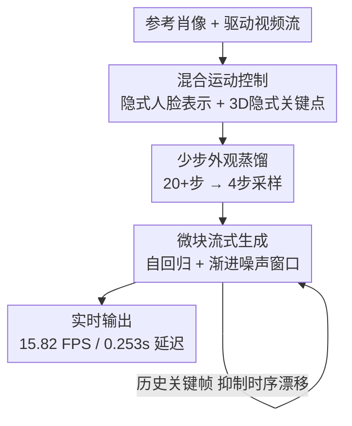

# PersonaLive! Expressive Portrait Image Animation for Live Streaming

**会议**: CVPR 2026  
**论文**: [CVF Open Access](https://openaccess.thecvf.com/content/CVPR2026/html/Li_PersonaLive_Expressive_Portrait_Image_Animation_for_Live_Streaming_CVPR_2026_paper.html)  
**代码**: https://github.com/GVCLab/PersonaLive  
**领域**: 视频生成 / 肖像动画  
**关键词**: 肖像动画, 扩散蒸馏, 流式生成, 实时推理, 直播

## 一句话总结
PersonaLive 用「混合运动控制 + 少步外观蒸馏 + 微块自回归流式生成」三阶段方案，把扩散式肖像动画从需要 20+ 步去噪、每块秒级延迟的离线模型，压到 4 步去噪、15.82 FPS、0.253 秒延迟的实时直播可用状态，相比此前扩散方法加速 7–22×，且长序列时序稳定性还更好。

## 研究背景与动机
**领域现状**：把一张静态肖像照按驱动视频里的表情、头姿「演」起来（portrait animation / 人脸重演），近年被扩散模型主导。基于 ReferenceNet 的扩散方案靠强大的生成能力，在表情细节和身份保持上做得很好，是当前主流范式。

**现有痛点**：这些方法几乎只盯着画质和表情真实度，完全忽略了推理效率，导致没法用在直播这种实时场景。具体两个拦路虎：(i) **算力太贵**——多数方法需要 20+ 步去噪，还依赖 CFG（classifier-free guidance）来增强保真，等于每帧要跑两遍网络；(ii) **分块处理的硬伤**——受显存限制，长视频被切成固定长度的 chunk 独立生成。为了跨块时序一致，要么在相邻块之间插入重叠帧（overlapping frames），带来冗余计算和额外延迟；要么复用上一块末尾几帧当条件，又会在长视频里不断累积误差（error accumulation）。

**核心矛盾**：肖像动画本质上是在**高度相似的连续帧之间建模运动变化**，这件事其实没那么难，未必需要那么多去噪步；而独立分块生成与「实时连续流」的需求天然冲突——重叠帧换一致性就牺牲延迟，复用帧省延迟就牺牲稳定性。

**本文目标**：在不掉画质的前提下，把扩散肖像动画做成「真·实时、可流式、低延迟、长序列稳定」的系统，能直接喂给直播这类场景。

**切入角度 / 核心 idea**：作者把三件事拼成一条流水线——① 用**隐式人脸表示 + 3D 隐式关键点**的混合信号做更可控的运动迁移；② 观察到去噪过程中「结构布局早就定了、后面几十步都在磨外观细节」存在大量冗余，于是把外观细化**蒸馏**进 4 步紧凑采样；③ 抛弃分块独立生成，改用**微块（micro-chunk）自回归流式范式**，配合滑动训练和历史关键帧机制，做到边生成边吐帧且长程稳定。

## 方法详解

### 整体框架
给定一张参考肖像 $I_R$ 和连续驱动帧流 $\{I_D^1, I_D^2, \dots, I_D^S\}$，目标是以低延迟、实时的方式逐帧合成动画序列 $\mathcal{A}_{\{1,\dots,S\}}$，每帧把 $I_R$ 的外观和驱动帧的运动线索结合起来：

$$\mathcal{A}_i = \mathcal{D}(\mathcal{M}(I_D^i), \mathcal{R}(I_R)),\quad i=1,2,\dots,S$$

其中 $\mathcal{D}$ 是去噪主干，$\mathcal{M}$ 是运动提取器，$\mathcal{R}$ 是外观（参考网络）提取器。整套系统通过**三阶段训练流水线**搭起来：阶段一在图像级用混合运动信号学会表情 + 头姿的运动迁移；阶段二把冗余的外观细化蒸馏成 4 步采样，把推理大幅提速；阶段三接上时序模块，用微块自回归方式把图像模型扩成可流式的视频生成，并用滑动训练 + 历史关键帧压住长程漂移。三个阶段层层递进——先解决「控得准」，再解决「跑得快」，最后解决「连得稳」。

### 关键设计

**1. 混合隐式运动控制：用隐式人脸 + 3D 隐式关键点把「表情」和「头姿」分开管**

针对的痛点是单一信号控不好运动：2D landmark 或 motion frame 之类的显式条件，对头部全局运动（位置、缩放、旋转）表达不灵活，容易让头姿和表情互相干扰。PersonaLive 把运动拆成两路混合信号。**局部表情**用人脸运动提取器 $E_f$ 把驱动图裁剪出的人脸区域编码成 1D 人脸运动嵌入 $m_f = E_f(I_D)$，通过 cross-attention 注入去噪主干，专管细粒度面部动态。**全局头姿**则用现成方法 $E_k$ 从驱动图和参考图各抽一套 3D 隐式关键点参数：

$$k_{c,d}, R_d, t_d, s_d = \mathcal{E}_k(I_D),\quad k_{c,s}, R_s, t_s, s_s = \mathcal{E}_k(I_R)$$

其中 $k_c$ 是规范关键点，$R, t, s$ 分别是旋转、平移、缩放。把驱动方的运动参数迁移到参考身份的规范关键点上，得到驱动 3D 关键点：

$$k_d = s_d \cdot k_{c,s} R_d + t_d$$

再把 $k_d$ 投影回像素空间，经 PoseGuider 注入主干。这样表情走 cross-attention、头姿走 PoseGuider，两路各司其职，相比 2D landmark 对头部运动的表达更灵活可控，也是后面阶段三里历史关键帧判定能用 $m_f$ 当「运动指纹」的基础。

**2. 少步外观蒸馏：把「前几步定结构、后面几十步磨外观」的冗余压成 4 步**

作者画出无 CFG 的去噪轨迹（图 3）后发现一个关键现象：**每帧的运动和结构布局在最早的去噪步就基本定了，后续大量迭代只是在反复细化纹理、光照这些外观细节**——这正是 20+ 步推理慢的根源。于是把外观细化蒸馏进一个紧凑采样表 $\{t_i\}_{i=1}^N$（$N=4$）。训练时从高斯噪声 $z_{\text{noise}}\sim\mathcal{N}(0,I)$ 出发，随机采一个步数 $n\in[1,N]$ 跑 $n$ 步得到近似无噪状态 $\hat z_0$，解码成像素 $\hat x = V_d(\hat z_0)$，用混合目标对齐真值帧 $x^{gt}$：

$$\mathcal{L}_{distill} = \mathcal{L}_2(\hat x, x^{gt}) + \lambda_{lpips}\mathcal{L}_{lpips}(\hat x, x^{gt}) + \lambda_{adv}\mathcal{L}_{adv}(\hat x)$$

为什么有效：随机步采样保证所有中间时间步都能在训练中拿到监督，而梯度**只回传最后一步去噪**（否则整条扩散链反传会爆显存）。这里加对抗损失是点睛——消融显示只用 MSE+LPIPS 蒸馏会让输出过度平滑、丢高频细节，靠 CFG 补保真又会把速度砸到 9.5 FPS；而对抗损失让模型不靠 CFG 就能生成逼真高频细节，画质和速度兼得。

**3. 微块自回归流式生成：渐进噪声窗口 + 滑动训练 + 历史关键帧，做到边生成边稳吐帧**

针对的是分块独立生成的根本矛盾。先接入时序模块把图像模型扩成视频模型，但**不给一个去噪窗口里的所有帧同一噪声等级**，而是把窗口切成多个微块、赋予逐级升高的噪声：

$$W_s = \{C_s^1, C_s^2, \dots, C_s^N\},\quad C_s^n = \{z_i^{t_n}\mid i=1,\dots,M\},\ t_1 < t_2 < \dots < t_N$$

每做一步去噪，所有块整体向更低噪声「滑动」，最前面的块产出 $M$ 帧干净帧可立即吐出；窗口前移一格，尾部追加一个新的高斯噪声块 $C_{\text{noise}}$。这种流式范式**不需要重叠区域**就能连续产帧，同时保证时序连贯和低延迟。但纯自回归流式会有曝光偏差和误差累积，于是配两个机制：

- **滑动训练策略（Sliding Training）**：曝光偏差源于训练用真值帧、推理却得吃自己的预测。训练时直接模拟流式过程——第一个窗口用加噪的真值帧 $C_0^n = \{\sqrt{\bar\alpha_{t_n}}z_i^{gt} + \sqrt{1-\bar\alpha_{t_n}}\epsilon_i\}$ 构造，之后窗口滑动、尾部追加噪声块，**与推理流程完全一致**，逼模型在训练里就见到并学会纠正自己的预测误差。再配一个 Motion-Interpolated Initialization（MII），用参考图 + 插值后的运动信号构造首个去噪窗口，让推理起点和训练对齐，避免开头从参考运动到驱动运动的突变。
- **历史关键帧机制（HKM）**：参考图约束不到的区域（如被遮挡处、衣服）在采样随机性下会逐帧微变、长程累积成时序漂移。维护历史库 $B_{his}$ 和运动库 $B_{mot}$，每步用当前首帧运动嵌入 $m_f$ 算它与运动库的最小距离 $d = \min_i \lVert m_f - m_i\rVert_2$，若 $d > \tau$（$\tau=17$）则判定为新关键帧，把其参考特征 $h_f$ 和运动嵌入 $m_f$ 入库。后续推理把这些历史特征和源图特征 $h_0$ 拼接、经空间模块注入主干，给模型稳定的历史线索来锁住外观一致性。

### 损失函数 / 训练策略
阶段二、三共用同一外观蒸馏目标 $\mathcal{L}_{distill}$（MSE + LPIPS + 对抗），梯度只过最后一步去噪以省显存；阶段三训练时仅对部分去噪窗口计算并回传梯度。判别器用 StyleGAN2 架构、FFHQ 预训练初始化。关键超参：蒸馏/流式阶段去噪步 $N=4$，微块大小 $M=4$，HKM 运动阈值 $\tau=17$。数据用 VFHQ、NerSemble、DH-FaceVid-1K，统一 25 fps、512×512，8 张 H100，AdamW，学习率 $1\times10^{-5}$，weight decay 0.01。

## 实验关键数据

### 主实验
自重演（self-reenactment）在 TalkingHead-1KH 上评 L1/SSIM/LPIPS/tLP；跨重演（cross-reenactment）在作者自建的 LV100（100 个野生肖像 + 长视频）上评 ID-SIM/AED/APD/FVD/tLP；效率在单张 H100 上测 FPS 和块间延迟。

| 方法 | LPIPS↓ | tLP(自)↓ | ID-SIM↑ | FVD↓ | tLP(跨)↓ | FPS↑ | 延迟(s)↓ |
|------|--------|---------|---------|------|---------|------|---------|
| LivePortrait*（GAN） | 0.137 | 20.40 | 0.723 | 557.2 | 13.51 | – | – |
| X-Portrait | 0.173 | 25.87 | 0.678 | 587.8 | 24.52 | 0.851 | 14.10 |
| Follow-your-Emoji | 0.144 | 26.92 | **0.773** | 696.5 | 35.13 | 1.558 | 7.793 |
| Megactor-Σ | 0.183 | 23.55 | 0.606 | 585.3 | 28.86 | 2.216 | 6.918 |
| X-NeMo | 0.267 | 25.11 | 0.691 | 639.1 | 18.10 | 1.281 | 15.32 |
| HunyuanPortrait | 0.137 | 22.33 | 0.644 | 620.4 | 16.84 | 1.443 | 14.91 |
| **PersonaLive（本文）** | **0.129** | 21.31 | 0.698 | **520.6** | **12.83** | **15.82** | **0.253** |

关键发现：在身份保持（ID-SIM）和运动精度（AED/APD）上与最好方法持平，同时拿下最优的 FVD 和 tLP（长程时序最稳），且 LPIPS 也最低。效率维度才是碾压点——15.82 FPS / 0.253s 延迟，相比扩散基线（FPS 仅 0.85–2.2、延迟 7–15s）实现约 7–22× 加速；若把标准 VAE 解码器换成 TinyVAE 还能进一步冲到 20 FPS。注意所有扩散竞品的延迟是在**不用重叠帧**下测的，这让它们虽能分块流式但跨块一致性更差。

### 消融实验（微块流式生成，LV100）
| 配置 | ID-SIM↑ | AED↓ | FVD↓ | tLP↓ | 说明 |
|------|---------|------|------|------|------|
| Full（Ours） | 0.698 | 0.703 | 520.6 | 12.83 | 完整模型 |
| w/o ST | 0.549 | 0.785 | 678.8 | 10.05 | 去掉滑动训练，时序崩塌 |
| w/o HKM | 0.728 | 0.710 | 535.6 | 13.27 | 去掉历史关键帧，长程漂移 |
| w/o MII | 0.680 | 0.703 | 511.5 | 13.06 | 去掉运动插值初始化，开头失真 |
| ChunkSize=2 | 0.660 | 0.713 | 520.2 | 12.14 | 块变小，身份相似度掉 |
| w/ ChunkAttn | 0.689 | 0.709 | 537.0 | 12.83 | 换因果注意力，身份略降 |

### 关键发现
- **滑动训练（ST）贡献最大**：去掉后 ID-SIM 从 0.698 暴跌到 0.549、FVD 从 520.6 恶化到 678.8，因为模型只在真值构造的输入上训练，从没学过纠正自己的漂移，推理时误差快速累积、出现严重时序崩塌。
- **HKM 是一个有意识的取舍**：去掉它 ID-SIM 反而升到 0.728，但 tLP/FVD 变差、衣服等无约束区域出现漂移；历史线索会部分削弱对参考图的依赖（ID-SIM 略降），换来的是长程时序稳定，作者认为这个 trade-off 值得。
- **外观蒸馏里对抗损失不可省**：纯蒸馏（w/o GAN）输出过度平滑缺高频，靠 CFG 补会掉到 9.5 FPS，对抗损失是「既保真又快」的关键。
- **块大小的双刃剑**：ChunkSize 从 4 降到 2，短期时序一致性微升但身份相似度明显掉——小块降低窗口内变化有助稳短期动态，却缩窄了有效时序感受野，长序列里更难维持身份。
- **失败案例**：当参考图超出训练域（out-of-domain）时，部分细节会失真。

## 亮点与洞察
- **「去噪冗余」的观察很值钱**：把「结构早定、后续只磨外观」这一现象量化成可蒸馏的冗余，是少步加速能成立的根。这个洞察可迁移到任何「相邻帧高度相似」的条件生成任务（如说话头、虚拟试衣视频），都可能存在类似的外观冗余可压。
- **渐进噪声微块 + 滑动训练是「训练即推理」的优雅实现**：把推理时的自回归滑窗 1:1 搬进训练，从源头消除曝光偏差，比事后用「motion frame」复用帧硬补一致性更彻底，也不引入额外误差累积。
- **历史关键帧用运动距离当门控**：用运动嵌入 $m_f$ 的 L2 距离 $>\tau$ 来挑代表性历史帧，等于给长程生成装了个「外观锚点库」，思路可借鉴到任何长视频自回归生成里抑制漂移。
- **表情/头姿双路解耦**：cross-attention 管表情、PoseGuider 管 3D 头姿，让两类运动互不打架，是控制可解释、可插值（MII）的前提。

## 局限与展望
- **作者承认**：参考图超出训练域时细节会失真，泛化受训练数据分布限制。
- **自建评测基准**：跨重演用的是自己收集的 LV100，虽然针对长视频设计合理，但非公开标准 benchmark，横向可比性打折；不同方法在自重演/跨重演两套指标上的难度也不完全可直接比大小。
- **效率数字的口径**：竞品延迟是在「不用重叠帧」下测的，对它们的时序一致性不利，比较时需带这个 caveat；本文 20 FPS 需换 TinyVAE 解码器，是否影响画质未详细量化。
- **HKM 的 ID-SIM 取舍**：历史关键帧提稳定性但略降身份相似度，参考图约束本就弱的场景下可能放大这一损失，阈值 $\tau$ 的鲁棒性值得进一步分析。

## 相关工作与启发
- **vs X-Portrait / X-NeMo（prompt traveling 类长视频）**：它们靠 prompt traveling 平滑块边界、仍是分块离线扩展，延迟高（14–15s）；本文用微块自回归直接做实时流式，延迟降到 0.253s，且 FVD/tLP 更优。
- **vs 用「motion frame」复用帧的流式方法（如 RAIN 等）**：复用上一块末帧会引入额外训练开销和不可避免的误差累积；本文用滑动训练把推理过程搬进训练、用 HKM 锚住外观，从机制上抑制累积。RAIN 用 diffusion forcing 但未处理曝光偏差且只在动漫域，本文未与其直接比。
- **vs 扩散加速（ADD / LCM / DMD2）**：这些通用蒸馏少有人用在肖像动画上；本文把蒸馏专门针对肖像动画的「外观冗余」设计，并补对抗损失替代 CFG，是把加速技术落到具体任务的范例。
- **vs LivePortrait（GAN，帧级）**：GAN 帧级方法速度快但细节差、无时序建模；本文在保住实时的同时拿到扩散级画质和更稳的长程时序。

## 评分
- 新颖性: ⭐⭐⭐⭐ 三个组件本身多有前作影子（隐式运动、扩散蒸馏、diffusion forcing），但「去噪冗余观察 + 微块滑动训练 + 历史关键帧」组合出实时直播可用的肖像动画系统，工程与洞察都扎实。
- 实验充分度: ⭐⭐⭐⭐ 7 个 baseline、自/跨重演双设定、效率指标齐全，消融细致到逐组件 + 失败案例；扣分在跨重演用自建 benchmark、部分口径需 caveat。
- 写作质量: ⭐⭐⭐⭐ 动机—观察—方法逻辑清晰，图 3 去噪轨迹直观支撑核心 idea，公式与流程交代到位。
- 价值: ⭐⭐⭐⭐⭐ 把扩散肖像动画从离线推到实时（7–22× 加速、0.253s 延迟），直接打开直播/虚拟主播等实时落地场景，实用价值高。

<!-- RELATED:START -->

## 相关论文

- [\[CVPR 2026\] FlashPortrait: 6× Faster Infinite Portrait Animation with Adaptive Latent Prediction](flashportrait_6x_faster_infinite_portrait_animation_with_adaptive_latent_predict.md)
- [\[CVPR 2026\] One-to-All Animation: Alignment-Free Character Animation and Image Pose Transfer](one-to-all_animation_alignment-free_character_animation_and_image_pose_transfer.md)
- [\[CVPR 2026\] MultiAnimate: Pose-Guided Image Animation Made Extensible](multianimate_pose-guided_image_animation_made_extensible.md)
- [\[CVPR 2026\] StreamDiT: Real-Time Streaming Text-to-Video Generation](streamdit_real-time_streaming_text-to-video_generation.md)
- [\[CVPR 2025\] Teller: Real-Time Streaming Audio-Driven Portrait Animation with Autoregressive Motion Generation](../../CVPR2025/video_generation/teller_real-time_streaming_audio-driven_portrait_animation_with_autoregressive_m.md)

<!-- RELATED:END -->
