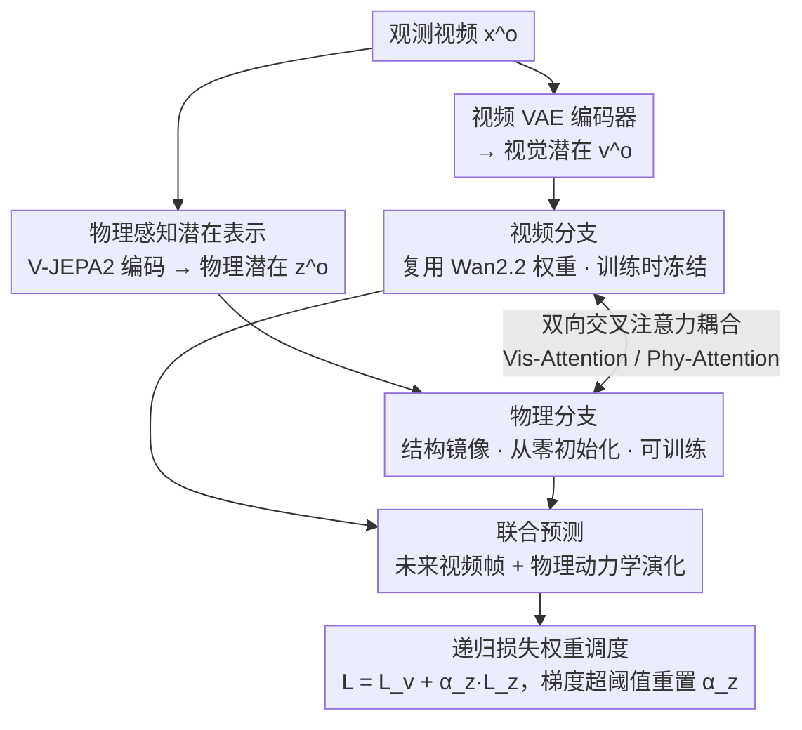

# Phantom: Physics-Infused Video Generation via Joint Modeling of Visual and Latent Physical Dynamics

**会议**: CVPR 2026  
**arXiv**: [2604.08503](https://arxiv.org/abs/2604.08503)  
**代码**: [https://plan-lab.github.io/phantom](https://plan-lab.github.io/phantom)  
**领域**: 视频生成 / 物理一致性  
**关键词**: 物理一致视频生成, 流匹配, 双分支架构, V-JEPA2, 潜在物理动力学

## 一句话总结
提出Phantom框架，在预训练视频扩散模型（Wan2.2-TI2V）之上增加一个物理动力学分支，利用V-JEPA2提取的物理感知嵌入作为潜在物理状态，通过双向交叉注意力联合建模视觉内容和物理动力学演化，在物理一致性基准上大幅超越基线（VideoPhy PC提升50.4%），同时保持视觉质量。

## 研究背景与动机

**领域现状**：以Sora、HunyuanVideo、Wan2.2为代表的视频生成模型已经能产生视觉逼真的视频，但在物理一致性方面仍存在明显缺陷——生成的物体经常违背重力、惯性、碰撞等基本物理定律。

**现有痛点**：(1) 单纯扩大模型规模和数据量不足以学习可泛化的物理定律，模型倾向于案例式记忆而非抽象物理规则；(2) 现有Physics-aware方法要么依赖外部物理模拟器（受限于模拟器的覆盖范围），要么依赖LLM提示工程在推理时引导（不增加模型内在的物理理解，且带来推理开销），要么通过表示对齐间接注入物理先验（不能显式建模物理状态演化）。

**核心矛盾**：当前视频生成模型主要依赖next-frame prediction目标，该目标优化视觉保真度但不显式强制物理推理，使模型难以内化和遵守真实世界的物理定律。

**本文目标** 如何在视频生成过程中直接整合对潜在物理属性的推理，使模型不仅生成视觉逼真、而且物理一致的视频？

**切入角度**：作者假设——模型无法学习物理动力学源于其仅依赖下一帧预测目标。解决方案是让模型同时预测视频内容和潜在物理参数。

**核心 idea**：在视频生成流程中增加一个专用的物理分支，利用V-JEPA2的自监督表示作为"潜在物理状态"，与视觉分支联合训练，使模型在生成视频的同时推理物理动力学。

## 方法详解

### 整体框架
Phantom 想解决的问题很具体：视频扩散模型只学会了"画得像"，却没学会"动得对"——物体会穿模、悬浮、碰撞后乱弹。作者的判断是，根因在于模型只优化下一帧预测，从没被要求显式地推理物理。于是 Phantom 在预训练的 Wan2.2-TI2V-5B 之上并联出第二条"物理分支"，让生成视频和推理物理这两件事同时发生。

整条流程是这样转的：一段观测视频 $\mathbf{x}^o$ 先被编码进两个互补的潜在空间——视频 VAE 编码器给出视觉潜在序列 $\mathbf{v}^o$，V-JEPA2 给出物理潜在序列 $\mathbf{z}^o$。视觉序列喂进复用 Wan2.2 权重的视频分支，物理序列喂进一个结构镜像、但从零初始化的物理分支。两条分支各自跑一套 flow-matching 的 latent ODE，并在对应深度通过双向交叉注意力互相"看一眼"对方的隐藏状态。最终模型在条件帧和物理状态的约束下，联合预测未来的视频帧和对应的物理动力学演化。

### 关键设计

**1. 物理感知潜在表示：用 V-JEPA2 嵌入当作"潜在物理状态"**

模型学不会物理，是因为它从没有一个地方专门表示"现在的物理状态是什么"。Phantom 没有去构造物理模拟器、也不手工标注重力/质量这类参数，而是直接借用 V-JEPA2 这个自监督视频编码器的表示——它在大规模视频上自监督预训练，已被证明能编码物体恒存、碰撞、重力等直觉物理概念。Phantom 把这套表示当成一个"学到的抽象物理空间"，模型在这个空间里推理动力学，而不需要任何外部物理输入。相比依赖显式模拟器，这种潜在表示不受模拟器假设的束缚，能覆盖更杂的物理现象；相比只做静态表示对齐的方法，Phantom 后面会在这个空间里显式地预测物理状态怎么随时间演化，而不只是对齐一帧。

**2. 双向交叉注意力耦合：让视觉和物理互相纠正，又不互相污染**

两条分支如果各跑各的就成了两个无关模型，物理推理传不到画面上。Phantom 在两分支的对应深度插入两路交叉注意力。Vis-Attention 以视频隐藏状态为 query、物理隐藏状态为 key/value，把物理线索注入视觉生成：

$$\mathbf{h}'_v = \text{Softmax}\!\left(\frac{\mathbf{W}^Q_v\mathbf{h}_v \cdot (\mathbf{W}^K_v\mathbf{h}_z)^T}{\sqrt{d}}\right) \mathbf{W}^V_v\mathbf{h}_z$$

Phy-Attention 则对称地反过来，用视觉证据精炼物理推理。一来一回，物理状态引导画面怎么动、画面又反过来校准物理估计。之所以用两路交叉注意力而非把两种模态拼进一个 joint-attention，是因为后者会让视觉和物理特征过度纠缠、训练容易失稳；分开的交叉注意力给了更细粒度的控制，两种模态各自的特性得以保留。

**3. 选择性冻结训练：只动新加的部件，护住 Wan2.2 的生成先验**

物理分支从零初始化，早期梯度又大又乱，直接全量训练会把 Wan2.2 辛苦学到的强生成能力冲垮。Phantom 的做法是训练时冻结视频分支的全部预训练参数，只更新物理分支和那两路交叉注意力。条件设置上，50% 的训练实例不给条件帧（对应纯 text-to-video），另外 50% 随机采样 1–45 帧作为条件（对应 video-to-video），让同一个模型同时覆盖两种生成模式。

**4. 递归损失权重调度：给爱抢戏的物理损失设一个"重置闸门"**

联合损失是 $\mathcal{L} = \mathcal{L}_v + \alpha_z \mathcal{L}_z$，但实际训练里物理损失 $\mathcal{L}_z$ 的梯度范数远大于视觉损失，固定权重会让物理分支直接压垮共享架构。Phantom 让 $\alpha_z$ 从 0 起步、随训练逐渐升高；一旦物理分支的梯度范数冲过阈值 $\eta_z$，就把 $\alpha_z$ 重新清零、重启整个调度周期。这种循环式加权相当于反复"试探—回退"，让物理分支在不掀翻视觉分支的前提下，一点点贡献出有意义的梯度。

### 损失函数 / 训练策略
整体在标准 flow-matching 目标上扩展为联合预测视觉速度场和物理速度场，配合上面的递归权重调度平衡两条分支。训练数据是 OpenVidHD-0.4M（约 40 万条高质量视频-文本对，注意并非物理特化数据），支持最多 121 帧、分辨率 480×832。

## 实验关键数据

### 主实验

| 基准 | 指标 | Phantom | Wan2.2-TI2V | 提升 |
|--------|------|------|----------|------|
| VideoPhy | SA | 47.5 | 41.5 | +14.5% |
| VideoPhy | PC | **37.9** | 25.2 | **+50.4%** |
| VideoPhy-2 | SA | 27.75 | 24.53 | +13.1% |
| VideoPhy-2 | PC | 71.74 | 69.20 | +2.6% |
| Physics-IQ (单帧) | Score | **29.59** | 22.10 | **+33.9%** |
| Physics-IQ (多帧) | Score | 27.53 | - | - |

注：在VideoPhy PC上达到所有方法中最高（37.9），超过PhyT2V(37)和WISA(33)等专用物理方法。

### VBench-2综合评估

| 维度 | Phantom | Wan2.2-TI2V | 变化 |
|------|---------|-------------|------|
| Total | 51.84 | 51.57 | +0.5% |
| Physics | 43.61 | 40.19 | +6.0% |
| Human Fidelity | 88.39 | 86.10 | +2.7% |
| Controllability | 20.23 | 18.50 | +9.4% |
| Commonsense | 61.43 | 60.57 | +1.4% |

### Physics-IQ细分指标（单帧）

| 指标 | Phantom | Wan2.2-TI2V | 提升 |
|------|---------|-------------|------|
| Spatial IoU | 0.245 | 0.164 | +49.4% |
| Spatiotemporal IoU | 0.146 | 0.132 | +10.6% |
| Weighted Spatial IoU | 0.140 | 0.102 | +37.3% |
| MSE↓ | 0.009 | 0.010 | +11.1% |

### 关键发现
- **物理一致性大幅提升的同时未牺牲视觉质量**——VBench-2总分持平甚至略高，说明物理推理和视觉生成可以兼得
- Creativity中Diversity有所下降（64.67→45.95），但Composition从40.35提升到45.07，作者认为物理不合理的视频反而可能"膨胀"多样性指标
- 在Physics-IQ单帧设置下Phantom达到29.59，超过所有方法包括CogVideoX-I2V(27.90)和RDPO(25.21)
- Phantom仅用了40万视频训练（非物理特化数据），却显著提升了物理一致性，说明V-JEPA2物理表示加联合建模是有效的

## 亮点与洞察
- **V-JEPA2作为物理先验的巧妙选择**：不需要构建物理模拟器或标注物理参数，直接利用自监督视觉表示中已编码的直觉物理知识。这是一种"免费午餐"——利用现有大模型的物理感知能力来增强另一个模型
- **双分支flow-matching设计**：视觉和物理两个并行ODE过程通过交叉注意力耦合，在保持各自模态特性的同时实现信息交换。这种设计比把物理信息直接拼接到输入中更优雅，且可扩展性好
- **递归损失权重调度**是一个实用trick——当两个学习目标梯度尺度差异很大时，周期性重置权重比固定比例更稳定。可迁移到其他多任务学习场景
- **推理时零额外物理输入**：text-to-video模式下完全从纯噪声联合去噪，说明模型已内化了物理理解

## 局限与展望
- 物理分支从零初始化，训练效率可能不如用现有物理模型初始化
- V-JEPA2的物理感知能力仍然有限，对复杂流体动力学、可变形物体等可能编码不足
- 仅在40万数据上训练，而基线Wan2.2在更大数据上预训练——更大规模训练可能进一步提升
- 递归权重调度需要手动设置阈值 $\eta_z$，对超参数可能敏感
- VBench-2的Diversity下降值得关注，可能限制创意性应用场景

## 相关工作与启发
- **vs PhyT2V/DiffPhy**: 这些方法在推理时用LLM推理来精化提示引导扩散，是外部的、不增加模型内在物理理解、且有推理overhead。Phantom将物理推理内化到生成过程中
- **vs VideoREPA**: VideoREPA通过表示对齐间接注入物理先验，是静态对齐不建模物理状态演化。Phantom显式预测物理动力学的时序演化
- **vs PhysAnimator/PhysGen**: 依赖外部物理模拟器，受限于模拟器的覆盖范围和保真度。Phantom无需模拟器

## 评分
- 新颖性: ⭐⭐⭐⭐⭐ 双分支联合建模视觉和物理动力学是全新范式，V-JEPA2作为潜在物理表示的选择巧妙
- 实验充分度: ⭐⭐⭐⭐ 覆盖VideoPhy/VideoPhy-2/Physics-IQ/VBench-2四个基准，但缺少消融实验分析各组件贡献
- 写作质量: ⭐⭐⭐⭐ 动机清晰，方法阐述系统
- 价值: ⭐⭐⭐⭐⭐ 为物理一致视频生成开辟了新方向，双分支联合建模+自监督物理表示的范式具有广泛影响力

<!-- RELATED:START -->

## 相关论文

- [\[CVPR 2026\] SymphoMotion: Joint Control of Camera Motion and Object Dynamics for Coherent Video Generation](symphomotion_joint_control_of_camera_motion_and_object_dynamics_for_coherent_vid.md)
- [\[CVPR 2026\] Inference-time Physics Alignment of Video Generative Models with Latent World Models](inference-time_physics_alignment_of_video_generative_models_with_latent_world_mo.md)
- [\[CVPR 2026\] Physical Simulator In-the-Loop Video Generation](physical_simulator_in-the-loop_video_generation.md)
- [\[ICLR 2026\] JavisDiT++: Unified Modeling and Optimization for Joint Audio-Video Generation](../../ICLR2026/video_generation/javisdit_unified_modeling_and_optimization_for_joint_audio-video_generation.md)
- [\[CVPR 2026\] P-Flow: Prompting Visual Effects Generation](p-flow_prompting_visual_effects_generation.md)

<!-- RELATED:END -->
