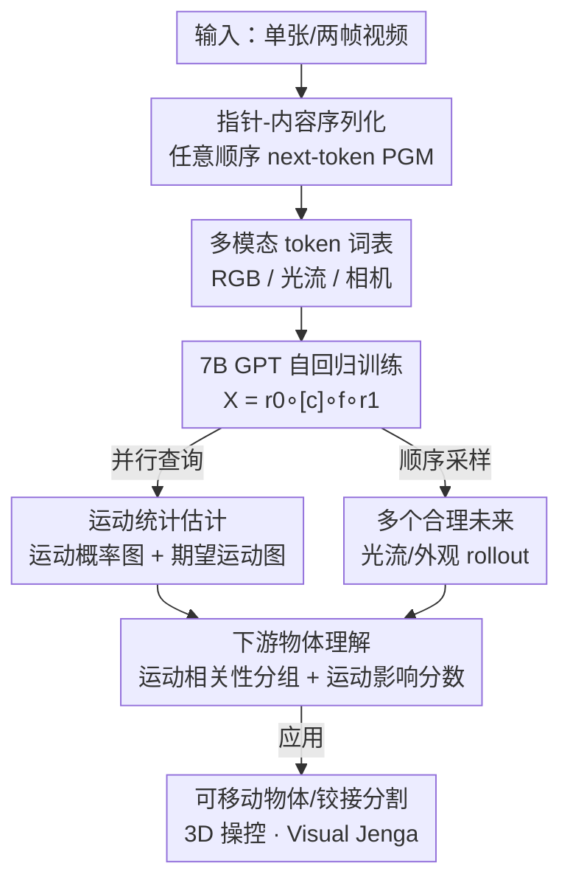

# Physical Object Understanding with a Physically Controllable World Model

**会议**: CVPR 2026  
**arXiv**: [2606.00439](https://arxiv.org/abs/2606.00439)  
**代码**: https://neuroailab.github.io/psi-website/blog.html (有)  
**领域**: 视频生成 / 世界模型 / 物理场景理解  
**关键词**: 概率世界模型, 自回归序列建模, 光流 token, 可移动物体发现, Visual Jenga

## 一句话总结
本文把"世界模型"重新表述成一个能查询任意视觉变量条件分布的概率图模型（PGM），并用 GPT 式 next-token 预测高效训练出一个 70 亿参数、以 RGB / 光流 / 相机 token 描述场景的可物理操控世界模型 PSI；训练完成后无需任何专门头部，仅靠"虚拟戳一下看哪些像素一起动"就能零样本做出可移动物体分割（SpelkeBench SOTA）、铰接部件发现、3D 物体操控与 Visual Jenga 等一系列物理理解任务。

## 研究背景与动机
**领域现状**：当前主流世界模型（文本/动作条件的视频生成、JEPA 类全局嵌入预测）擅长生成长视频、做指令条件生成和多模态推理，但它们都以全局信号（文本、动作、场景嵌入）为条件。

**现有痛点**：这类模型没有提供一种机制去"隔离并查询"局部场景变量之间的相互影响——比如某处的运动如何影响别处的运动、对某物体施力如何沿其结构传播。而恰恰是这种局部变量间的条件关系，才是推理物体边界、铰接、支撑等物理结构的关键。专门的物体理解模型（SAM2 靠标注、CutLER/ProMerge 靠 DINO 注意力、各种 drag 编辑器）又各自只解决一个子任务，且在复杂自然场景中很脆弱。

**核心矛盾**：要做物理推理，需要的是"给定任意子集变量，估计任意其它变量分布"的概率图模型（PGM）；但 PGM 历史上极难训练，几乎被现代深度学习抛弃。于是"灵活的条件推理能力"与"可规模化训练"之间存在矛盾。

**本文目标**：构造一个统一架构，既能像 PGM 一样支持任意方向的条件查询，又能像 LLM 一样高效、可规模化地训练，并从中零样本地涌现出丰富的物体理解。

**切入角度**：作者的关键观察是——学习"任意变量间的条件关系"这件事，可以被改写成 GPT 式 next-token 预测。只要把场景拆成局部变量、把每个变量序列化成 token，再配一个能指定"我要预测哪个位置"的指针机制，PGM 就退化成标准自回归序列模型。

**核心 idea**：用"指针 token + 内容 token 的任意顺序自回归序列"来实现一个概率世界模型（称为 PSI / Probabilistic Structure Integrator），用便宜的视觉 patch（光流、相机运动）代替昂贵的真实动作数据当作"穷人版世界模型"的控制信号。

## 方法详解

### 整体框架
PSI 把世界状态切成一组局部变量，目标是学习"给定已观测变量子集 $\mathbf{X}$ 与一个未观测查询位置 $p$，返回该位置内容的条件分布 $\text{Pr}[v\mid\mathbf{X},p]$"。形式上模型 $\Psi:(\mathbf{X},\,p\notin\mathrm{dom}(\mathbf{X}))\mapsto\{\text{Pr}[v\mid\mathbf{X},p]:v\in\mathcal{V}\}$，这正是一个 PGM。作者的核心转换是：把数据序列化成"指针-内容"交替的 token 流 $[p_0,v_0,\dots,p_k,v_k]$，于是查询任意位置就等价于在序列末尾追加一个指针、读出下一个内容 token 的分布——PGM 推理被收编进标准自回归框架。

在这个通用骨架上，作者实例化出一个可物理操控的视觉世界模型：内容词表含三类 token——**RGB token**（编码外观）、**光流 token**（编码动态）、**相机 token**（编码两帧间的 6DOF 视角变化）；指针词表则按 RGB / 光流两种模态划分。训练序列形如 $\mathbf{X}=\mathbf{r}^0\circ[c]\circ\mathbf{f}\circ\mathbf{r}^1$（首帧 RGB → 相机 token → 光流 → 次帧 RGB），且三段都以任意空间顺序排列、光流按 0–1 随机比例掩码。训练完成后，通过选择"追加哪种指针、按什么顺序解码"就能走出多条推理路径：并行估计运动统计、顺序生成多个合理未来、对稀疏戳点做光流补全、由动态渲染外观等。这些推理路径再被下游算法（运动相关性分组、运动影响分数）转成具体的物体理解任务。

### 关键设计

**1. PGM ≡ 自回归序列：用 next-token 预测学到全联合分布**

痛点是 PGM 难训练、现代深度学习几乎不用它，但物理推理又恰恰需要"任意条件任意"的能力。作者证明这两者等价：把 datum 序列化成指针-内容交替序列后，公式 (1) 的 $\Psi(\mathbf{X},p)$ 退化为 $\Psi(\mathbf{X}\circ p)\equiv\text{Pr}[v\mid\mathbf{X}\circ p]$，也就是把查询位置的指针拼到序列末尾、读 next-token 分布。训练时在各种 token 排列顺序上做交叉熵（仅监督内容 token、不监督指针 token），相当于对"给定部分状态估计某变量"这一过程做摊销，从而学到所有变量上的完整联合分布。这一步是全文的杠杆点：它让一个原本难学的概率世界模型，能直接复用 LLM 那套成熟、可规模化的训练栈。

**2. 指针 token：打破光栅顺序，支持任意子集条件与多向推理**

传统 GPT 式图像自回归被迫按固定光栅顺序生成，这对高维数据是有害的归纳偏置。作者引入"指针 token"这一新 token 类型——它显式指明"接下来要预测哪个时空位置"，于是序列可以按任意空间顺序构造。这带来三件关键能力：可以条件于图像的任意子集（学到真正多向的条件关系，而非单向 raster 依赖）、可以做部分 patch 条件、可以在推理时局部重生成 patch。本质上，正是指针 token 让"在高维结构上的随机访问遍历"被打包进一维 token 序列，使 PGM 既可表达又可像普通 LLM 一样优化。

**3. RGB / 光流 / 相机三类 token 与交错训练序列：把物理控制塞进词表**

为了让世界模型"可物理操控"，作者用浅层卷积量化器把空间 patch 编码成 RGB token 与光流 token，把 6DOF 变换分箱成相机 token。训练序列 $\mathbf{X}=\mathbf{r}^0\circ[c]\circ\mathbf{f}\circ\mathbf{r}^1$ 把光流夹在两帧 RGB 之间，使光流既能当**预测目标**（生成合理场景动态），又能当**条件信号**（由给定动态渲染未来外观）；相机 token 则允许指定视角变化。训练中随机掩码光流（比例 0–1），让模型学会"仅凭首帧、或在任意数量光流条件下"预测次帧。光流在这里是关键的"控制面"——它是比真实动作便宜得多的代理，让用户能用一个"虚拟戳"去施加局部物理干预。

**4. 运动统计与运动相关性分组：从生成分布里零样本抠出物体**

有了能查询分布的世界模型，物体理解就变成对分布做统计。**并行**地，模型在每个位置求"会动的概率" $\mathbb{P}_{\text{motion}}[p]=\sum_{f_j\in\mathcal{F}_{\text{motion}}}\text{Pr}(f_j\mid\mathbf{X}\circ p)$（对幅度超阈值的光流 token 求和）得到运动概率热图，并求概率加权的期望运动 $\mathbb{E}_{\text{motion}}[p]=\sum_{f_j\in\mathcal{V}^{(flow)}}\text{Pr}(f_j\mid\mathbf{X}\circ p)\cdot\mathbf{v}_j$；附加零相机 token 以剔除相机运动、只保留物理交互效果。**顺序**地，模型对一个戳点采样 $N$ 个虚拟戳，算"戳向量 $\mathbf{v}_j$ 与戳出来的光流 $\hat{\mathbf{f}}_j$ 的点积"并取均值 $\bar{\text{dot}}=\frac{1}{N}\sum_{j=1}^N\mathbf{v}_j\cdot\hat{\mathbf{f}}_j$，阈值化即得"一起动"的可移动物体。它和 SAM2 等基于外观/纹理的分组本质不同——这里的物体被定义为"在物理上协同运动的单元"，因此能把铰接子部件（如笔记本盖子）也正确切出来。

**5. 运动影响分数：把支撑关系变成有向图，驱动 Visual Jenga**

更进一步，作者用世界模型推理物体间成对物理关系。对一个堆叠结构底部施加虚拟戳，期望运动图会显示出它所支撑的所有物体都在动，从而直接读出支撑图。形式化地，对检测出的物体 $O_1,\dots,O_N$ 构有向图，边权 $w_{ij}=\mathbb{P}_{\text{motion}}(O_j\mid O_i\text{ moves})$ 表示"戳 $O_i$ 时 $O_j$ 会动的概率"，每个物体的运动影响分数 $\mathbb{I}[O_i]=\frac{1}{N-1}\sum_{j\neq i}w_{ij}$ 由出边平均得到。Visual Jenga 就是迭代地选影响分数最小（即移走它最不扰动他物）的物体，用 4.6 节的 3D 操控流程把它从场景移除，再剪掉对应节点更新图——从而在保持结构稳定的前提下逐件拆塔。

### 损失函数 / 训练策略
$\Psi$ 实例化为 70 亿参数 GPT transformer，用 next-token 预测交叉熵损失训练，**仅监督内容 token、不监督指针 token**。训练数据为 300 万条真实世界 RGB 视频片段，约 1.4 万亿 token；batch size 512，训练 150 万步，采用 Warmup-Stable-Decay 学习率调度。推理时既可顺序采样（质量最高，每步条件于此前所有已生成 patch，能捕捉复杂场景如铰接物体的因果依赖），也可并行采样（假设未解码位置条件独立，牺牲质量换效率）。

## 实验关键数据

### 主实验
PSI 在多个物体理解任务上零样本达到 SOTA。点提示可移动物体分割（SpelkeBench，N=8 戳）：

| 任务/数据集 | 指标 | PSI | 最强基线 | 说明 |
|--------|------|------|----------|------|
| SpelkeBench 点提示分割 | AR | **0.541** | FPT 0.368 / SAM2 0.482 | 自监督世界模型类最强 |
| SpelkeBench 点提示分割 | mIoU | **0.681** | FPT 0.566 / SAM2 0.623 | 超过有监督 SAM2 |
| DragAMove 铰接部件 | mIoU | **0.410** | FPT 0.287 / MotionI2V 0.073 | 铰接子部件发现 SOTA |

无提示分割（SpelkeBench，自动采样会动的位置 + NMS 去重）：

| 方法 | AP | AR | mIoU | F1 |
|------|----|----|------|----|
| SAM2（有监督） | 0.11 | 0.62 | 0.68 | 0.17 |
| CutLER | 0.41 | 0.32 | 0.42 | 0.34 |
| ProMerge | 0.42 | 0.34 | 0.43 | 0.36 |
| **PSI** | 0.35 | 0.46 | 0.57 | **0.38** |

SAM2 因按纹理过分割导致大量非物理 segment、精度低；PSI 的 F1（平衡 AP/AR 的调和均值）最高，segment 更符合物理物体。3D 物体操控（3DEditBench）中，无论换哪种编辑器（PasC / DiffusionHandles / Diffusion-as-Shader / PSI 自带），用 PSI segment 都比用 SAM2 segment 的 LPIPS↓、SSIM↑、Edit Adherence↑ 更好；PSI 全流程取得 LPIPS 0.161 / SSIM 0.736 / EA 0.776。

### 消融实验
全部在 SpelkeBench 点提示分割上进行：

| 配置 | AR | mIoU | 说明 |
|------|----|------|------|
| #pokes 1 → 8 | 0.379 → 0.525 | 0.587 → 0.679 | 多戳平均显著稳住性能 |
| #seeds 1 → 8 | 0.379 → 0.482 | 0.587 → 0.645 | 多 seed 也有帮助但弱于多戳 |
| 顺序步 0 → 64 → 256 | 0.462 → 0.525 → 0.534 | 0.641 → 0.672 → 0.677 | 64 步后收益递减 |
| 模型 100M → 1B → 7B | 0.431 → 0.525 → 0.547 | 0.617 → 0.672 → 0.680 | 规模化有效，至 7B |
| CWM / PSI-RGB / **PSI** | 0.158 / 0.412 / **0.541** | 0.334 / 0.576 / **0.681** | 光流 token 至关重要 |

### 关键发现
- **光流 token 是核心增益来源**：去掉光流、改在 RGB 空间做 patch 运动反事实（PSI-RGB）后 mIoU 从 0.681 掉到 0.576，再退回 CWM 仅 0.334——光流提供了更直观的"虚拟物理干预"控制面。
- **顺序 vs 并行解码**：并行（0 步）即 mIoU 0.641，顺序到 64 步升到 0.672，之后边际递减，说明大部分关键因果依赖用较少自回归步即可捕捉；只有铰接等复杂物体才真正需要顺序采样。
- **多戳比多 seed 更划算**：把戳数从 1 加到 8（mIoU +0.092）的收益明显大于把 seed 从 1 加到 8（+0.061）。
- **对有监督 SAM2 的公平性校验**：即便给 SAM2 在 multimask 模式下挑"最自信"掩码（0.622 mIoU，优于 random/least-confident），仍低于 PSI 的 0.681。

## 亮点与洞察
- **把"难训练的 PGM"翻译成"好训练的 LLM"**：核心洞见是用指针 token 序列化后，任意条件推理 = next-token 预测，一举把概率世界模型接进 LLM 的成熟训练基础设施——这是一个干净且可规模化的等价转换，比硬造专门架构优雅得多。
- **"穷人版世界模型"的务实哲学**：用便宜的光流/相机 patch 代替昂贵的真实动作数据当控制信号，既绕开数据瓶颈，又恰好让"虚拟戳一下"成为统一的物理探针。
- **一个模型、零样本、多任务**：分割、铰接发现、3D 操控、支撑关系推理全部是同一个分布查询的不同读出方式，不需要任务专属头部或微调——"物体 = 一起动的像素"这一物理定义直接从生成分布里涌现。
- **可迁移的 trick**："采样多个未来 → 算运动相关性 → 分组"这套把生成模型当因果探针的范式，可迁移到任何"靠扰动揭示结构"的领域（论文点名医学影像、天体物理、材料科学）。

## 局限与展望
- 作者承认本文聚焦"以人为中心的宏观物理场景"，对人类缺乏直觉的领域（如显微/天体尺度的 objecthood）尚未验证。
- 顺序采样质量最高但计算成本高，复杂铰接物体需要更多自回归步；并行模式假设条件独立、在多部件物体上会损失质量——质量与效率之间仍需手动权衡。
- 物体发现依赖"会不会动"作为定义，对天然不动或外观相同但物理独立的实例可能失效；下游 3D 操控仍依赖把 6DOF 变换转成稠密光流场的近似流程。
- 7B 模型 + 1.4T token 的训练成本高，复现门槛不低；消融显示规模化仍在带来收益，但更大规模的边际效果未知。

## 相关工作与启发
- **vs 文本/动作条件世界模型（如视频生成、动作条件预测器）**：它们以全局 prompt 为条件，无法查询局部变量间影响；PSI 把世界建模成局部变量上的概率模型，支持细粒度因果查询，是"穷人版世界模型"——用视觉 patch 代理动作。
- **vs CWM（patch 运动反事实）**：CWM 也用世界模型做物理交互，但在 RGB 空间做反事实，SpelkeBench mIoU 仅 0.334；PSI 引入光流 token 后升到 0.681，证明光流是更好的干预控制面。
- **vs SAM2 / CutLER / ProMerge**：前者靠标注、后者靠 DINO 注意力，都按外观/纹理分组、易过分割且把同类多实例合并；PSI 按"协同运动"分组，segment 更符合物理物体，无提示分割 F1 反超有监督 SAM2。
- **vs Flow Poke Transformer (FPT) / Perception-as-Control / Force Prompting**：这些用 2D drag 向量做拖拽操控，在复杂/杂乱场景中性能退化（PasC 在 SpelkeBench 上泛化很差）；PSI 在点提示分割、铰接发现、3D 操控上均超过它们。

## 评分
- 新颖性: ⭐⭐⭐⭐⭐ "PGM ≡ 自回归序列 + 指针 token"是干净有力的概念性突破，把世界模型与 LLM 训练栈统一。
- 实验充分度: ⭐⭐⭐⭐⭐ 覆盖分割/铰接/3D 操控/Visual Jenga 四类任务，含规模化、解码模式、光流消融与对 SAM2 的公平性校验。
- 写作质量: ⭐⭐⭐⭐ 框架与应用层次清晰，公式完整；但部分推理路径与实现细节压在附录，主文略密。
- 价值: ⭐⭐⭐⭐⭐ 提供了"自监督、可物理操控、零样本多任务"世界模型的通用配方，对机器人与物理场景理解有较强基础设施意义。

<!-- RELATED:START -->

## 相关论文

- [\[CVPR 2026\] ProPhy: Progressive Physical Alignment for Dynamic World Simulation](prophy_progressive_physical_alignment_for_dynamic_world_simulation.md)
- [\[CVPR 2026\] Yume1.5: A Text-Controlled Interactive World Generation Model](yume15_a_text-controlled_interactive_world_generation_model.md)
- [\[CVPR 2026\] Open-world Hand-Object Interaction Video Generation Based on Structure and Contact-aware Representation](open-world_hand-object_interaction_video_generation_based_on_structure_and_conta.md)
- [\[ICML 2025\] How Far is Video Generation from World Model: A Physical Law Perspective](../../ICML2025/video_generation/how_far_is_video_generation_from_world_model_a_physical_law_perspective.md)
- [\[CVPR 2026\] VerseCrafter: Dynamic Realistic Video World Model with 4D Geometric Control](versecrafter_dynamic_realistic_video_world_model_with_4d_geometric_control.md)

<!-- RELATED:END -->
