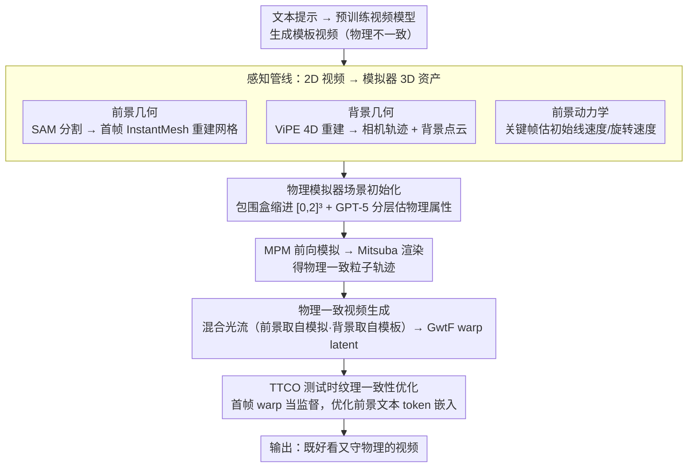

# Physical Simulator In-the-Loop Video Generation

**会议**: CVPR 2026  
**arXiv**: [2603.06408](https://arxiv.org/abs/2603.06408)  
**代码**: [https://vcai.mpi-inf.mpg.de/projects/PSIVG](https://vcai.mpi-inf.mpg.de/projects/PSIVG)  
**领域**: 视频生成 / 物理一致性  
**关键词**: 物理模拟器在环, 视频扩散模型, MPM模拟, 测试时优化, 物理一致生成

## 一句话总结
提出PSIVG——首个将物理模拟器嵌入视频扩散生成循环的训练-free推理时框架：从模板视频中重建4D场景和物体网格，在MPM模拟器中生成物理一致轨迹，用光流引导视频生成，并通过TTCO测试时优化保证运动物体纹理一致性，用户偏好率达82.3%。

## 研究背景与动机

**领域现状**：扩散视频生成模型（CogVideoX、HunyuanVideo等）已达到出色的视觉真实感，但生成的视频经常违反重力、惯性、碰撞等基本物理定律——物体凭空消失、运动轨迹不合理、物理交互不真实。

**现有痛点**：(1) 现代视频生成模型基于去噪/重建目标训练，本质上优化逐像素/逐patch的重建，缺乏显式物理约束机制；(2) 早期物理感知方法耦合2D刚体模拟器与图像生成器，但受限于简化的2D假设；(3) PhysAnimator等方法专注2D网格模拟卡通动画，PhysGen3D需要输入图像做3D重建；(4) LLM-based提示方法是正交的探索但不直接在生成器中施加物理约束。

**核心矛盾**：视频扩散模型的训练目标（去噪/重建）不包含任何物理约束，没有机制强制学习物理定律。要在保持视觉质量的同时实现物理一致性，需要在生成过程中引入物理引导。

**本文目标** 如何有效地将物理模拟器的信息整合到视频扩散过程中，实现物理一致的视频生成？

**切入角度**：提出"simulation-in-the-loop"范式——物理模拟器作为物理感知约束，在扩散生成循环中引导模型维持时空一致性。

**核心 idea**：先用预训练视频模型生成模板视频，从中重建4D场景和物体网格放入物理模拟器，用模拟器输出的物理一致轨迹引导视频重生成，并通过测试时优化提升纹理一致性。

## 方法详解

### 整体框架
PSIVG 要解决的是「视频扩散模型生成的画面好看但不守物理」这个矛盾，思路是把一个真正的物理模拟器塞进生成循环里当裁判，全程不训练任何参数。整条链路从一段「物理不靠谱但构图齐全」的模板视频出发：先用预训练视频模型从文本生成这段模板，再用一套感知管线把它拆解成 3D 前景网格、4D 背景场景和相机轨迹这些模拟器能吃的资产；把这些资产丢进 MPM 物理模拟器跑一遍前向模拟，就得到了一条符合重力、惯性、碰撞的运动轨迹；最后把模拟器渲染出的运动信息转成光流，回头条件化视频扩散模型重新生成一遍，必要时再用 TTCO 在测试时微调，把运动物体的纹理在帧间对齐。模板视频负责「长什么样」，模拟器负责「怎么动」，两者通过光流缝合。

### 关键设计

**1. 感知管线：把 2D 生成视频翻译成模拟器能用的 3D 资产**

模板视频是 2D 的、还物理不一致，可模拟器要的是 3D 几何和初始速度，中间隔着一道鸿沟，这道桥就是感知管线。它分三路抽信息。前景物体几何这一路，先用 SAM / GroundedSAM 把动态物体分割出来，从**首帧**裁出物体局部图，送进 InstantMesh 做单图像 3D 网格重建——之所以只用一帧而不用多帧，是因为生成视频本身帧间几何就对不齐，硬凑多帧反而更糟。背景场景几何这一路，把前景 mask 掉之后交给 ViPE 做 4D 重建，用 bundle adjustment 解出相机轨迹，再把逐帧的度量深度点图聚合成一张全局 3D 背景点云。前景动力学这一路，挑两个关键帧，线速度直接取 3D 位移除以 $\Delta t$，旋转速度则用 SuperGlue 做特征匹配、估出相对质心的 2D 流场再反推。三路合起来，模板视频虽然物理不靠谱，但它的场景构成被完整搬进了模拟器，这正是「simulation-in-the-loop」能转起来的前提。

**2. 物理模拟器场景初始化：在 MPM 里把模板场景原样复刻一遍**

拿到资产之后还得告诉模拟器「这个场景多大、物体是什么材料」。模拟域的确定方式是用一个包围盒把前景的运动范围和背景几何都框住，再用空间偏移系数缩进一个标准的 $[0,2]^3$ 立方体里，同时定下从真实尺度到模拟尺度的缩放比例。物理属性这一步比较巧：直接让 LLM 报「杨氏模量是多少」往往不准，所以改用 GPT-5 做分层提示——先问物体的材质组成、弹性特征、表面粗糙度这些语义描述，再把描述映射成密度、杨氏模量等数值参数，这种先定性再定量的方式比一步到位可靠得多。

> ⚠️ 文中使用 GPT-5 估计物理属性，模型版本以原文为准。

场景搭好后，MPM 前向模拟吐出高分辨率的粒子轨迹，再用 Mitsuba 渲染成 RGB 帧、分割 mask 和像素对应关系。模拟器渲染出来的画面风格生硬、缺光影、网格偶有破洞，但它携带的运动物理是忠实的，对后面只当「引导信号」用，足够了。

**3. 物理一致视频生成：用光流而不是像素去条件化扩散模型**

如果把模拟器渲染的 RGB 直接当条件喂给生成器，视觉质量会被它的人工风格拖垮。所以这里不传画面、只传**运动**——用 Go-with-the-Flow（GwtF）做光流条件化。关键是一张混合光流：前景区域的光流取自模拟器渲染的 RGB，保证物体按物理轨迹动；背景区域的光流取自原始模板视频，把场景运动和相机动态原样留住；两者用前景分割 mask 缝在一起。这张光流再去 warp 噪声 latent 输进模型。光流的好处是它同时编码了平移轨迹和旋转，又天然能表达相机运动，比直接传像素既干净又信息全。

**4. TTCO 测试时纹理一致性优化：让旋转、遮挡时物体表面不再闪**

光流只管住了「往哪动」，管不住「表面纹理在帧间是否一致」——物体一旦旋转或被遮挡，纹理就容易闪烁。TTCO 的做法是把模板视频首帧 $\hat{I}_1$ 通过模拟器给出的像素—像素对应关系 warp 到每一帧，当作纹理一致的监督目标，然后在测试时优化一组零初始化的可学习嵌入（加在前景物体对应的文本 token 上，并参与 DiT 层的特征调制），逼着生成视频的像素跟着模拟器算出的前景运动走：

$$\mathcal{L}_{\text{TTCO}} = \sum_t \sum_j \big\|\,[De(h_0(\hat{L}_\tau))]_{q_{t,j}} - [W_t(\hat{I}_1)]_{q_{t,j}}\,\big\|_2^2$$

优化只盯着较早、更 noisy 的扩散步骤（700–1000），因为纹理的大方向是在这些步里定下的，50 次迭代就能收敛。之所以选「改前景文本 token」而不是改全局参数，是图它的局部性——这组嵌入主要影响前景物体的外观，背景几乎不受牵连。

### 一个完整示例
拿一段「苹果从桌面滚落」的模板视频走一遍：CogVideoX 先生成这段视频，画面里苹果滚得不太对劲（轨迹飘、偶尔卡顿）。感知管线先用 SAM 把苹果抠出来，拿首帧送 InstantMesh 重建出苹果网格；把苹果 mask 掉后用 ViPE 重建桌面背景并解出相机轨迹；再取两个关键帧估出苹果的初始平移与旋转速度。接着把苹果和桌面缩进 $[0,2]^3$ 模拟域，GPT-5 先认出「这是个表面光滑的水果」再映射出密度、杨氏模量等数值，MPM 据此前向模拟，苹果这次老老实实按重力加速下落、撞桌面后符合物理地弹跳。Mitsuba 把这条轨迹渲染出来，前景（苹果）光流取自模拟、背景（桌面）光流取自模板，缝好后 warp 噪声 latent，GwtF 重生成一段画面自然、运动合规的视频。最后 TTCO 跑 50 次迭代，让苹果旋转时表面的高光和纹理跟着对齐、不再闪烁——最终输出一段「既好看又守物理」的滚落视频。

### 损失函数 / 训练策略
PSIVG 不需要任何额外训练数据。TTCO 在测试时用 AdamW，学习率 2e-4，迭代 50 次。模板视频由 SD3 生成图像后接 CogVideoX-I2V-5B 或 HunyuanVideo-I2V 生成。

## 实验关键数据

### 主实验

| 方法类型 | 方法 | SAM mIoU↑ | Corr.Pixel MSE↓ | CLIP Text↑ | Subj. Consis.↑ |
|----------|------|-----------|----------------|------------|----------------|
| Text-based | CogVideoX | 0.47 | 0.032 | 0.34 | 0.93 |
| Text-based | HunyuanVideo | 0.46 | 0.017 | 0.35 | 0.95 |
| Physics | PISA-Seg | 0.50 | 0.012 | 0.35 | 0.95 |
| Controllable | SG-I2V | 0.75 | 0.021 | 0.34 | 0.95 |
| Controllable | MotionClone | 0.68 | 0.019 | 0.35 | 0.87 |
| **Ours** | **PSIVG** | **0.84** | **0.007** | **0.35** | **0.95** |

### 用户研究

| 方法 | 偏好率(%) |
|------|-----------|
| CogVideoX | 7.2 |
| HunyuanVideo | 4.5 |
| PISA-Seg | 2.6 |
| SG-I2V | 2.5 |
| MotionClone | 0.9 |
| **PSIVG (Ours)** | **82.3** |

32名参与者一致认为PSIVG生成的视频物理上最合理。

### 消融实验

| 配置 | SAM mIoU↑ | Corr. Pixel MSE↓ | Subj. Consis.↑ |
|------|-----------|----------------|----------------|
| w/o TTCO | 0.82 | 0.009 | 0.93 |
| **w/ TTCO** | **0.84** | **0.007** | **0.95** |

### 关键发现
- **PSIVG在运动可控性指标上全面最优**——SAM mIoU 0.84（比第二SG-I2V高0.09），Corr. Pixel MSE仅0.007（最低）
- PISA-Seg等方法虽时间稳定性指标高，但实际生成几乎静态的视频（帧间变化极小），缺乏真实运动
- **TTCO的效果主要体现在纹理一致性**——Corr. Pixel MSE从0.009降到0.007，Subject Consistency从0.93提升到0.95
- 基于Prompt的优化比LoRA-based设计更好——LoRA经常降低背景质量产生伪影，prompt优化更轻量且局部性更好
- 直接优化spatio-temporal token（而非text token）会产生网格状伪影

## 亮点与洞察
- **"Simulation-in-the-loop"范式**是最大贡献——不修改生成模型、不需要额外训练，纯推理时引入物理约束。这种与生成模型解耦的设计使其可以即插即用到各种视频生成模型上
- **感知管线的巧妙设计**：用InstantMesh对单帧做3D重建（而非多帧），因为生成的视频帧间几何不一致——这是对生成视频特性的深刻理解
- **GPT-5分层物理属性估计**：先推断材质描述（组成、弹性、粗糙度），再映射到数值物理参数——比直接让LLM输出数值更可靠。这种coarse-to-fine的LLM使用范式可推广到其他需要从视觉估计物理量的场景
- **TTCO的"文本token=物体控制"发现**：修改前景物体对应的text embedding主要影响该物体的外观而不破坏背景，与其他扩散研究的发现一致，进一步确认了text token的空间对应性

## 局限与展望
- 依赖MPM模拟器，无法处理复杂代理（人、车辆）和铰接结构
- 感知管线中初始物体重建的质量直接影响下游——重建误差会传播到模拟和生成
- 继承GwtF视频模型的限制——难以生成非常小或非常细的物体
- 整个pipeline比端到端方法复杂得多（模板视频→感知→模拟→重生成→TTCO），延时较高
- 仅支持刚体/材料点模型描述的物体交互，不支持流体、布料等复杂材料

## 相关工作与启发
- **vs PhysAnimator**: 专注2D卡通动画的2D网格+2D模拟器，PSIVG是3D+训练-free的开放词表视频生成
- **vs PhysGen3D**: 从输入图像获取3D表示做MPM模拟然后直接渲染，PSIVG额外使用视频扩散模型弥补模拟器渲染的不足（低分辨率、缺少光影、风格不自然）
- **vs WonderPlay**: 先生成3DGS surfel场景再用视频监督更新，PSIVG直接用TTCO做视频精炼更简洁高效
- **vs PISA**: 通过微调扩散模型学习物理交互，需要大量训练数据。PSIVG完全training-free
- **vs Phantom**: Phantom将物理推理内化到模型中（需要训练），PSIVG在推理时外部注入物理约束（不需要训练），两者互补

## 评分
- 新颖性: ⭐⭐⭐⭐⭐ 首个将3D物理模拟器嵌入文本到视频扩散管线的训练-free框架，TTCO的设计也有创意
- 实验充分度: ⭐⭐⭐⭐ 定量比较全面，用户研究(82.3%偏好率)说服力强，消融覆盖了关键组件
- 写作质量: ⭐⭐⭐⭐ 方法流程清晰易懂，图示直观
- 价值: ⭐⭐⭐⭐ 提出了一种通用范式可即插即用到任何视频生成模型，但pipeline复杂度和MPM限制制约了实用性

<!-- RELATED:START -->

## 相关论文

- [\[CVPR 2026\] Phantom: Physics-Infused Video Generation via Joint Modeling of Visual and Latent Physical Dynamics](phantom_physics-infused_video_generation_via_joint_modeling_of_visual_and_latent.md)
- [\[ICML 2025\] How Far is Video Generation from World Model: A Physical Law Perspective](../../ICML2025/video_generation/how_far_is_video_generation_from_world_model_a_physical_law_perspective.md)
- [\[CVPR 2026\] Diff4Splat: Repurposing Video Diffusion Models for Dynamic Scene Generation](diff4splat_controllable_4d_scene_generation_with_latent_dynamic_reconstruction_m.md)
- [\[CVPR 2026\] Anti-I2V: Safeguarding your photos from malicious image-to-video generation](anti-i2v_safeguarding_your_photos_from_malicious_image-to-video_generation.md)
- [\[CVPR 2026\] SymphoMotion: Joint Control of Camera Motion and Object Dynamics for Coherent Video Generation](symphomotion_joint_control_of_camera_motion_and_object_dynamics_for_coherent_vid.md)

<!-- RELATED:END -->
