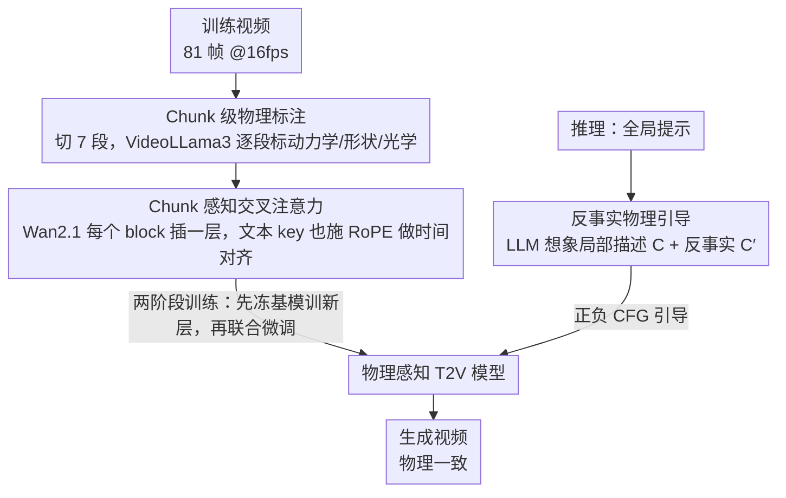

# PhysVid: Physics Aware Local Conditioning for Generative Video

**会议**: CVPR 2026  
**arXiv**: [2603.26285](https://arxiv.org/abs/2603.26285)  
**代码**: [项目页](https://5aurabhpathak.github.io/PhysVid)  
**领域**: 视频生成  
**关键词**: 视频生成, 物理一致性, 局部条件化, 交叉注意力, 反事实引导

## 一句话总结

提出 PhysVid，一种物理感知的局部条件化方案——将视频分为时间片段（chunk），由 VLM 为每个 chunk 标注物理现象描述，通过 chunk 级交叉注意力注入生成模型；推理时引入"负物理提示"（反事实引导）引导生成远离物理违规，在 VideoPhy 上将物理常识分数提升约 33%。

## 研究背景与动机

生成式视频模型（如 Sora、Wan2.1）在视觉逼真度上取得了显著进步，但在物理一致性上仍有根本性缺陷——生成的视频经常违反基本物理定律（如物体穿模、重力异常、形变不合理等）。现有改进方案的局限：

**全局文本提示太粗糙**：标准 T2V 模型用同一文本条件化所有帧，无法捕捉局部时间段内的物理细节变化

**帧级条件化太短视**：逐帧控制的方法领域特定且缺乏跨帧物理连续性

**全局增强提示仍不够**：DiffPhy、PhyT2V 等方法用 LLM 增强全局提示中的物理信息，但无法保证模型在正确的时间段关注正确的物理线索

**全局交叉注意力的根本缺陷**：研究表明全局交叉注意力会产生几乎静态的注意力图，导致动作相关词汇的时间对齐失败

PhysVid 的核心洞察：**物理现象是局部时间性的**——运动、碰撞、光影变化发生在短时间段内，需要与之对齐的局部条件化。

## 方法详解

### 整体框架

PhysVid 要解决的痛点很具体：T2V 模型用同一句全局文本去条件化所有帧，可物理现象（碰撞、形变、反射）只发生在某几个零点几秒的瞬间，全局提示根本对不上这些局部时间段。它的思路是给每段时间配一份"专属"的物理描述。整体分三步走：先把训练视频切成时间片段（chunk），让 VLM 逐段写出该段发生了什么物理现象，得到带时间戳的物理标注；再在预训练的 Wan2.1 里插入一层 chunk 级交叉注意力，让每个视频时间片只去读与它时间对齐的那份物理描述；推理时没有真实视频可参考，就用 LLM 从全局提示"想象"出每段的局部物理描述，并额外生成一份"如果违反物理会怎样"的反事实描述，正负两路一起做 CFG 引导。

### 关键设计

**1. Chunk 级物理标注：给每段时间配一份对齐的物理描述**

全局提示太粗、WISA 自带的全局物理标注又与切出来的片段对不齐，所以作者干脆抛开现成标注，让 VLM 重新逐段读视频。具体做法是把每个 5 秒训练视频（81 帧 @16fps）切成 7 个约 0.7 秒的 chunk，用 VideoLLama3-7B 逐段分析该段可见的物理现象，并被明确要求只聚焦三类信息：动力学（运动、碰撞、加速度）、形状（形变、弯曲）、光学（反射、阴影、折射）。标注时同时把全局提示喂给 VLM，保证局部描述不跑题；输出则用约束生成（constrained generation）锁死结构化格式，方便后续逐 chunk 取用。举例来说，一段投篮视频会被拆成"球离手上升 → 触框 → 反弹下落"等片段，每段各自得到一句物理描述，而不是共用一句"一个人在投篮"。

**2. Chunk 感知交叉注意力：让视频 token 只关注与自己时间对齐的那份文本**

有了逐段标注，还得让模型在正确的时间段读到正确的描述。PhysVid 在 Wan2.1 每个 Transformer block 里新插一层 chunk 级交叉注意力：视频 query token 照例用 3D 时空 RoPE（帧、高、宽）编码位置，**关键的一步是对文本 key 也施加 RoPE，并为文本定义一个带 chunk 轴的网格**。视频和文本用同一套 RoPE 频率基，注意力 logit 因此带上了跨模态的位置感知——某个时刻的视频 token 在算注意力时能天然"偏向"同一 chunk 的文本，区分开来自不同时间段的物理描述。这正是标准 T2V 交叉注意力做不到的：那里文本 key 只有 1D 位置编码，与视频帧没有对齐耦合，研究也观察到它会退化成几乎静态的注意力图、让动作词的时间对齐失败。

**3. 反事实物理引导：正向强化正确物理、负向推离违规物理**

前两点解决了训练，但推理时没有真实视频可标注。PhysVid 让 LLM 先从全局提示"想象"出每个 chunk 的局部物理描述 $C$；再让 LLM 找出每段描述里的关键视觉/物理元素，生成一份刻意违反这些现象的反事实描述 $C'$（比如把"球落地反弹"改写成"球穿过地面"）。生成时把两路都接进 classifier-free guidance：

$$x_{T-1} = (1+w) \cdot \mathcal{G}(x_T, c_g, C, T) - w \cdot \mathcal{G}(x_T, c_n, C', T)$$

其中 $c_g$、$C$ 是全局正向提示与局部物理提示，$c_n$、$C'$ 是全局负向提示与反事实物理提示。正向项把生成拉向正确物理，负向项把它推离违规物理，两者相减形成双重约束——这一步在消融里把 VideoPhy 的物理常识分从 0.2924 抬到 0.3169。

### 损失函数 / 训练策略

训练分两阶段，先稳新模块再放开基模：阶段 1（1000 步）冻结 Wan2.1 基模、只训练新插入的 chunk 交叉注意力层，让新模块先收敛；阶段 2（2000 步）解冻基模、所有参数联合训练。优化目标沿用 Wan2.1 的 flow matching 损失，4 GPU、有效 batch size 64。训练数据来自 WISA-80K 处理后约 53K 个视频样本（832×480，81 帧 @16fps），且完全弃用 WISA 自带的物理标注，改由 VLM 逐 chunk 重新提取。

## 实验关键数据

### 主实验

**表1 VideoPhy 基准**

| 方法 | 参数量 | SA (语义对齐) | PC (物理常识) ↑ |
|------|--------|-------------|----------------|
| Wan-1.3B | 1.3B | 0.46 | 0.24 |
| Wan-14B | **14B** | **0.52** | 0.24 |
| **PhysVid** | **1.7B** | 0.43 | **0.32** |

PhysVid 以仅 1.7B 参数在物理常识上超越 14B 模型，**相对提升约 33%**。

**表2 VideoPhy2 基准**

| 方法 | 参数量 | SA | PC ↑ |
|------|--------|-----|------|
| Wan-1.3B | 1.3B | 0.28 | 0.61 |
| Wan-14B | 14B | **0.29** | 0.59 |
| **PhysVid** | 1.7B | 0.28 | **0.64** |

在 VideoPhy2 上相对 Wan-14B 提升约 8%。

**表3 与已有物理感知方法对比（VideoPhy）**

| 方法 | 基模 | PC ↑ | 相对提升 |
|------|------|------|---------|
| WISA | CogVideoX-5B | 0.38 | +15% |
| VideoREPA-5B | CogVideoX-5B | 0.40 | +29% |
| Hao et al. | Wan-14B | 0.40 | +14% |
| PhyT2V | CogVideoX-5B | **0.42** | +62% |
| **PhysVid-1.7B** | Wan-1.3B | 0.32 | +33% |

### 消融实验

| 方法 | VideoPhy PC ↑ | VideoPhy2 PC ↑ | 说明 |
|------|--------------|---------------|------|
| Wan-1.3B 基线 | 0.2401 | 0.6144 | 无任何改进 |
| 直接微调 | 0.2866 | 0.6261 | 使用 WISA 数据微调但无 chunk 架构 |
| PhysVid（无反事实引导） | 0.2924 | 0.6334 | 仅正向局部条件化 |
| **PhysVid（完整）** | **0.3169** | **0.6411** | 正向+反事实引导 |

### 关键发现

1. **局部条件化 > 全局条件化**：PhysVid 显著优于直接微调（使用同一数据但无 chunk 架构），证明物理信息的时间对齐至关重要
2. **反事实引导有效**：加入反事实负向提示使 PC 从 0.2924 提升到 0.3169
3. **模型规模不等于物理能力**：Wan-14B 尽管参数是 PhysVid 的 8 倍，物理常识分数却相同（0.24 vs 0.32）
4. **语义对齐的代价**：PhysVid 的 SA 分数略低于基线（0.43 vs 0.46），说明物理导向可能略微牺牲视觉美学
5. **跨类别一致提升**：在 solid-solid、solid-fluid、fluid-fluid 以及 object interaction、sports 等所有子类别上均有提升

## 亮点与洞察

1. **局部时间粒度的物理条件化是正确方向**：全局物理提示无法对齐到具体时间段，chunk 级设计优雅地解决了这一问题
2. **VLM 作为自动物理标注器**：不依赖人工物理标注，完全由 VLM 从视频中提取物理信息，使方法可推广到任意数据集
3. **反事实引导的巧妙设计**：借鉴 CFG 的正负引导思路，但将其扩展到物理维度——生成"如果违反物理会怎样"的描述作为负向条件
4. **RoPE 跨模态对齐**：在文本 key 上也施加视频对齐的 RoPE，使 chunk 边界在注意力计算中有明确的位置信号
5. **以小博大**：1.7B 参数模型在物理维度超越 14B 模型，说明架构设计比纯粹堆参数更重要

## 局限与展望

1. **语义对齐下降**：SA 分数从 0.46 降到 0.43，说明局部物理条件化可能干扰了全局语义生成
2. **依赖 VLM 标注质量**：chunk 级物理描述的准确性取决于 VideoLLama3-7B 的能力，更强的 VLM 可能带来更多提升
3. **推理时 LLM 开销**：推理需要 LLM 生成局部和反事实提示，增加了额外延迟和复杂性
4. **训练数据 WISA 较窄**：专注于物理现象数据，泛化到一般 T2V 场景的能力未验证
5. **评估指标局限**：VideoPhy 分数基于模仿人类判断的自动评估器，主观性强且可能有噪声
6. **固定 chunk 大小**：7 个等长 chunk 的划分可能不匹配所有物理事件的实际时间尺度

## 相关工作与启发

- **与 Hao et al. 的区别**：Hao et al. 也用反事实引导但仅在全局级别；PhysVid 将其推进到 chunk 级别
- **与 WISA 的区别**：WISA 用物理专家混合模块和物理分类器注入全局物理信息；PhysVid 用 VLM 自动提取并在局部注入
- **与 DiffPhy 的区别**：DiffPhy 用 LLM 增强全局提示+MLLM 做物理监督；PhysVid 直接从视频中学习局部物理
- **世界模型启发**：PhysVid 可视为迈向物理感知世界模拟器的一步——通过局部条件化让模型理解物理在时间上的展开

## 评分

- **新颖性**: ⭐⭐⭐⭐ — Chunk 级物理条件化+反事实引导的组合方案新颖
- **实验充分度**: ⭐⭐⭐⭐ — 两个基准、多子类别分析、完整消融
- **写作质量**: ⭐⭐⭐⭐ — 结构清晰，相关工作梳理全面
- **实用价值**: ⭐⭐⭐⭐ — 架构兼容现有 T2V 模型，可扩展性好

<!-- RELATED:START -->

## 相关论文

- [\[CVPR 2026\] FaceCam: Portrait Video Camera Control via Scale-Aware Conditioning](facecam_portrait_video_camera_control_via_scale-aware_conditioning.md)
- [\[CVPR 2026\] Inference-time Physics Alignment of Video Generative Models with Latent World Models](inference-time_physics_alignment_of_video_generative_models_with_latent_world_mo.md)
- [\[NeurIPS 2025\] PhysCtrl: Generative Physics for Controllable and Physics-Grounded Video Generation](../../NeurIPS2025/video_generation/physctrl_generative_physics_for_controllable_and_physicsgrou.md)
- [\[CVPR 2026\] SeeU: Seeing the Unseen World via 4D Dynamics-aware Generation](seeu_seeing_the_unseen_world_via_4d_dynamics-aware_generation.md)
- [\[CVPR 2026\] Generative Neural Video Compression via Video Diffusion Prior](generative_neural_video_compression_via_video_diffusion_prior.md)

<!-- RELATED:END -->
