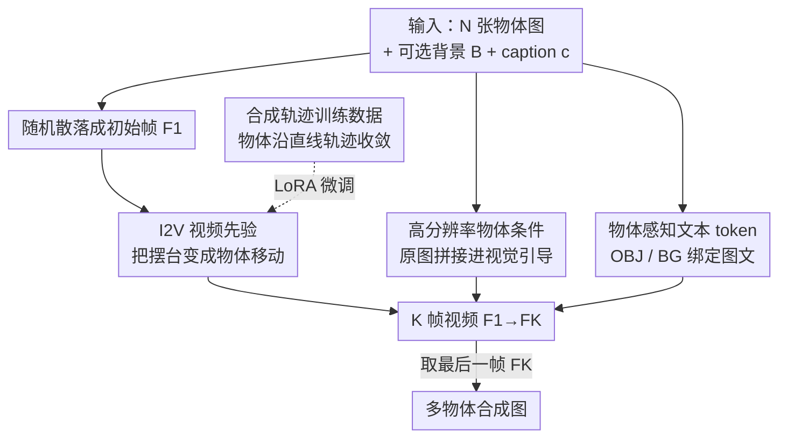

# PLACID: Identity-Preserving Multi-Object Compositing via Video Diffusion with Synthetic Trajectories

**会议**: CVPR 2026  
**论文**: [CVF Open Access](https://openaccess.thecvf.com/content/CVPR2026/html/Tarres_PLACID_Identity-Preserving_Multi-Object_Compositing_via_Video_Diffusion_with_Synthetic_Trajectories_CVPR_2026_paper.html)  
**代码**: 无（项目页 https://gemmact.github.io/placid/ ）  
**领域**: 视频生成 / 扩散模型 / 图像合成  
**关键词**: 多物体合成、图生视频、身份保持、合成轨迹、商品图

## 一句话总结
PLACID 把多物体"摆台"合成（multi-object compositing）重新表述成一个图生视频（I2V）任务：让随机散落的多个物体沿合成轨迹"走"到最终布局，用视频扩散模型最后一帧作为合成图，从而借视频时序先验同时守住每个物体的身份、背景与颜色，并显著减少漏物 / 重复。

## 研究背景与动机
**领域现状**：电商 / 营销里把多个商品图"P"进一张干净背景、排出好看版式的工作，目前主流是把文生图（T2I）扩散模型改造来做物体合成（AnyDoor、IMPRINT 等），或者用 subject-driven 生成（DreamBooth、IP-Adapter、UNO、OmniGen 等）把参考物体塞进新图。

**现有痛点**：这些 I2I/T2I 方法在"工作室级"多物体合成上同时栽在四个要求上——身份保持（颜色渐变、纹理、形状容易被改）、背景与颜色保真（细微色偏就破坏品牌识别）、版式可控、以及"一个不漏一个不重"的完整展示。实测里现有 SOTA 经常改色、漏物、复制物体，或者把物体摆得相对大小错乱。而且很多方法只能塞**单个**物体、还要额外给 bounding box / mask。

**核心矛盾**：T2I/I2I 模型的先验是"单帧静态图"，它没有"同一个物体可以移动、被重新摆放、与背景交互而身份不变"这种知识，于是多物体一进来就互相纠缠、漏掉或复制。

**本文目标**：在只给「多张物体图 + 一张背景图 + 一句描述」的输入下，生成一张身份/背景/颜色都保真、且所有物体都在的合成图。

**切入角度**：作者观察到图生视频（I2V）模型天生带有"物体在时间上保持一致、可以被重新摆位、能与背景交互"的时序先验——这正是合成任务缺的那块知识。如果能把"把物体摆到位"变成"物体在视频里平滑移动到目标位置"，就能直接吃到视频先验。

**核心 idea**：用一个预训练 I2V 扩散模型，让随机散落的物体沿**合成轨迹**平滑收敛到文本描述的最终布局，取**最后一帧**当合成结果；而为了让视频模型真能学到这种"无生命物体自己移动"的过程（真实视频里几乎没有这种数据），专门合成一批带轨迹的训练视频。

## 方法详解

### 整体框架
PLACID 接收三类输入：N 张未分割的物体图 $I_1..I_N$、一张可选背景图 $B$、一句自由文本 caption $c$。系统先把 N 个物体**随机摆**在背景（或白画布）上，得到一个粗糙的初始帧 $F_1$；然后用一个图生视频 DiT 合成一段 K 帧视频 $V=\{F_1,...,F_K\}$，让画面从乱摆的 $F_1$ 平滑过渡到 caption 描述的精致场景 $F_K$，最后一帧 $F_K$ 就是要的合成图。没有背景时，$F_1$ 的白画布会逐渐"长"成最终场景。

底座是带文本引导的 I2V diffusion transformer（Wan2.1 I2V-14B），原本只靠"首帧 + caption"两路 cross-attention 来生成。PLACID 在这个 backbone 上做了两处条件改造（高分辨率物体条件、物体感知文本 token），再配一套**合成轨迹训练数据**让模型真正学会这种"摆台"运动——三者缺一不可：没有数据，I2V 先验对着乱摆物体也无从下手；没有条件改造，物体细节会在下采样里丢失、文本也对不上具体物体。

### 关键设计

**1. 用 I2V 视频先验把"摆台"重述为"物体移动"**

这是全文的范式转换，直击"单帧模型没有物体可移动/重摆的先验"这个核心矛盾。作者不再用 I2I 一步到位地把物体贴进背景，而是让预训练 I2V 模型生成一段从 $F_1$（乱摆）到 $F_K$（成品）的 K 帧视频，把"如何摆放"交给视频模型自带的物体交互与重摆先验去解决。这样做的好处是：物体在帧间被视频先验约束着"保持是同一个东西"，从而天然抑制了身份漂移、漏物和复制；同时 $F_K$ 这一帧可以自然地带上阴影、光照渐变，让合成看起来真实而非生硬贴图。相比 I2I，I2V 对"物体被重新摆位还是同一身份"理解更强，所以排出的版式更合理。

**2. 高分辨率物体条件：把原图细节直接喂回去**

针对"下采样丢细节、多物体身份互相纠缠"的痛点。原始 DiT 只把 $F_1$ 里被缩小过的物体送进模型，精细纹理和颜色容易丢、不同物体也容易混。PLACID 改写视觉引导：把**原始全分辨率**的物体图 $I_1..I_N$（以及完整背景 $B$，若有）单独拼接到粗合成 $F_1$ 上，各自经 CLIP 编码后通过 cross-attention 注入视频生成。视觉条件因此写成 $I_c=[F_1, I_1,...,I_N]$。这等于在整个扩散过程里始终提供一份"高清原件"做参照，既保住背景里可能被物体遮住的细节，也避免只用 $F_1$ 当引导时出现的物体模糊/串味。

**3. 物体感知文本 token：让 caption 里的描述各归各物**

要让 caption 里"红色的杯子""木质背景"这些片段精准绑到对应的那张图，而不是糊成一团。PLACID 引入四个特殊 token `<OBJ> </OBJ>` 和 `<BG> </BG>`，把 caption 里描述具体物体和整体背景的片段框起来，**框选顺序与提供图像的顺序一致**。在文本 cross-attention 时，这些 token 引导每段被框文字与其对应视觉信息建立关联，其余描述则负责补全整张图。消融显示加上 token（`+{FT, Ic, TOK}`）后多数指标一起改善，说明这种显式图文对齐对消除"描述串物"很关键。

**4. 合成轨迹训练数据：给视频模型造出它没见过的"物体自己移动"**

这是另一半核心贡献，解决"真实视频几乎没有无生命物体独立移动的镜头、I2V 先验无从对齐"的问题。最朴素的做法是在初始帧和最终帧之间直接插值，但那会得到"两个位置各有半透明物体"的中间帧，既没有运动一致性、又破坏物体对应关系，等于把视频先验的好处全抵消。PLACID 改为让物体沿**线性合成轨迹**从随机初始位置平滑移动到目标位置，保持时空一致，从而抑制身份改变、混合、漏物与复制。数据来自三个来源：① 专业多物体图（Unsplash 产品图/平铺图用 GroundingDINO+SAM 抠图重组，外加约 400 组设计师手工合成）；② 从 Subject-200k 过滤出的 subject-driven 配对（同一物体的白底图与场景图，因无法保证中间帧有意义，**训练目标只对最后一帧算 loss**）；③ 14k 个已知尺寸的 3D 渲染物体按真实尺寸做"并排"合成，带渐进重光照。三类合计约 50K 条 (背景, 物体图, 目标图, 过渡视频, caption) 元组，再叠加物体/背景/caption 三类增广（随机缩放旋转扭曲、换背景类型、物体替换等）防止模型直接"复制粘贴"。

### 损失函数 / 训练策略
基于 Flow Matching 微调，只训一个轻量 LoRA adapter，不覆写底座权重。目标为
$$\mathcal{L}=\mathbb{E}_{V_0,V,I_c,c,t}\big\|\,u(x_t,I_c,c,t;\theta)-w_t\,\big\|^2,$$
其中 $V_0\sim\mathcal{N}(0,1)$ 为噪声、$t\in[0,1]$ 为采样时间步、$V_t=tV+(1-t)V_0$ 是噪声与真值视频 $V$ 的线性插值，模型预测速度 $u(\cdot)$ 去拟合 $w_t=\frac{dV_t}{dt}=V_t-V_0$。由于合成轨迹数据让所有帧（初始/中间/最终）都有意义，loss 默认覆盖**整段视频**；只有对无法保证中间帧合理的 Subject-200k 子集，才**只用最后一帧**算 loss。训练在 8×H100 上跑 119k 步（约 5 天），K=9 帧序列，推理时可用更长（33 帧），单卡约 26–80s 出图。

## 实验关键数据

评测集把 ABO 商品图与 DreamBench++ 物体混合成 122 组（每组 1–7 个物体），配纯色画布或 Unsplash 背景，caption 风格长度各异。指标覆盖身份保持（CLIP-I、DINO）、文本对齐（CLIP-T、VQAScore）、背景保真（MSE-BG）、颜色保真（Chamfer）、漏物率（Missing），并辅以两项用户研究。

### 主实验
| 方法 | CLIP-I↑ | DINO↑ | VQAScore↑ | MSE-BG↓ | Chamfer↓ | Missing↓ |
|------|---------|-------|-----------|---------|----------|----------|
| UNO | 0.696 | 0.450 | 0.886 | 0.062 | 14.733 | 0.099 |
| OmniGen | 0.724 | 0.478 | 0.793 | 0.119 | 15.120 | 0.128 |
| VACE | 0.689 | 0.439 | 0.891 | 0.096 | 9.948 | 0.096 |
| NanoBanana（闭源） | 0.662 | 0.390 | **0.929** | 0.029 | 13.146 | 0.138 |
| Wan 2.1（底座） | 0.711 | 0.446 | 0.809 | 0.047 | 7.746 | 0.048 |
| **PLACID（本文）** | 0.705 | 0.440 | 0.912 | **0.019** | **4.641** | **0.044** |

PLACID 在背景保真（MSE-BG 0.019）、颜色保真（Chamfer 4.641）、漏物率（Missing 0.044）上全面领先，VQAScore 也接近闭源 NanoBanana。CLIP-I/DINO 略低于个别模型，作者解释这是因为它优先做"自然连贯的合成"（允许轻微遮挡/重摆/新视角），而 copy-paste 式贴图反而能刷高这两个分数却得到不连贯的画面——所以补了用户研究。

### 消融实验
| 配置 | CLIP-I↑ | DINO↑ | CLIP-T↑ | MSE-BG↓ | Chamfer↓ | Missing↓ |
|------|---------|-------|---------|---------|----------|----------|
| Wan 2.1（base） | 0.711 | 0.446 | 0.333 | 0.047 | 7.746 | 0.048 |
| + FT（在本文数据微调） | 0.691 | 0.415 | 0.331 | 0.042 | 5.754 | 0.045 |
| + FT, $I_c$（高分辨率物体条件） | 0.698 | 0.440 | 0.329 | 0.040 | 4.138 | 0.042 |
| + FT, $I_c$, TOK（物体 token） | 0.703 | 0.447 | 0.331 | 0.033 | 4.555 | 0.051 |
| Ours（再加最后帧 loss 策略） | 0.705 | 0.440 | **0.336** | **0.019** | 4.641 | 0.044 |

数据来源消融显示：In-the-Wild 数据把身份/背景做得最好（CLIP-I 0.721）但带来 copy-paste 倾向、文本对齐弱（Missing 反而升到 0.058）；Subject-200k 文本对齐最好（CLIP-T 0.343）但身份偏弱；Side-by-side 颜色保真最佳（Chamfer 3.609）。**只有三类数据全用**才在各维度取得平衡。

### 关键发现
- 漏物率从底座到本文几乎没退化且为全表最低（0.048→0.044），印证"视频时序先验 + 轨迹一致的训练数据"确实能压住漏物/复制。
- 高分辨率物体条件 $I_c$ 对 Chamfer 提升最明显（7.746→4.138），说明把原图细节喂回去主要救的是颜色/背景保真。
- 量化指标会奖励 copy-paste（CLIP-I/DINO 虚高却不连贯），所以作者靠 1265 次 side-by-side 用户研究兜底：PLACID 在身份保持与整体质量两项上显著胜过所有开源方法，对闭源 NanoBanana 也有微弱优势。

## 亮点与洞察
- **把静态合成问题"时间化"**：最巧的一步是把"摆放"重述成"移动"，从而把一个 I2V 模型的运动先验当成免费的物体一致性/重摆先验来用——这个"换任务表述以借到现成先验"的思路可迁移到很多缺数据的编辑任务。
- **为先验定制数据，而非硬训**：作者没有去蛮力让视频模型学新东西，而是反过来造一批"符合视频时序先验"的合成轨迹数据，让朴素插值的"半透明双影"问题被物体直线运动替代——数据形态与模型先验对齐，是这套方法能 work 的隐藏关键。
- **指标会骗人时就上用户研究**：明确指出 CLIP-I/DINO 可被 copy-paste 刷高，并据此设计用户研究，是很诚实也值得借鉴的评测姿态。

## 局限与展望
- 为了视觉连贯优先于严格文本对齐，遇到歧义时（如"green figurine"）会偏向画面好看而非死扣文字，CLIP-T 上不占优。
- 优先身份保持会带来轻微物体重叠 / 重摆，可能需要新视角合成，反而压低 CLIP-I/DINO——这是它"做得太自然"的副作用。
- 合成轨迹用的是**线性**位移，复杂的非刚性重摆 / 大幅度重光照仍依赖 Subject-200k 那条只算最后一帧 loss 的支路，中间帧的物理合理性是被牺牲的。
- ⚠️ 训练/推理帧数不一致（K=9 训练、33 帧推理）下长序列的稳定性、以及无代码开源带来的复现难度，是实际落地的隐忧。

## 相关工作与启发
- **vs AnyDoor / IMPRINT**: 它们身份保持不错但通常**单物体**、还要 bounding box/mask；PLACID 直接吃多物体 + 背景 + caption，无需位置框。
- **vs UNO / OmniGen / MS-Diffusion（subject-driven）**: 这类把背景当参考物处理，语义一致但细节会被改，难直接用于"保背景"的合成；PLACID 用视频先验专门守住背景与颜色（MSE-BG/Chamfer 大幅领先）。
- **vs VACE / 其他用 I2V 做编辑的工作**: 它们多聚焦单物体或风格编辑；PLACID 是把 I2V 先验用在**多物体合成 + 一致背景/颜色**这一具体场景。
- **vs NanoBanana（闭源指令编辑）**: VQAScore 接近，但 PLACID 在背景/颜色保真与漏物率上更好，且开放了方法细节。

## 评分
- 新颖性: ⭐⭐⭐⭐⭐ 把多物体合成重述为 I2V 轨迹收敛，并配套造数据吃视频先验，角度新颖且自洽。
- 实验充分度: ⭐⭐⭐⭐ 主表 + 双消融 + 两项用户研究，维度全面；但无代码、部分细节在 SupMat。
- 写作质量: ⭐⭐⭐⭐ 动机到方法链条清晰，四要求与四设计对应工整。
- 价值: ⭐⭐⭐⭐ 直击电商/设计的真实痛点，背景颜色保真与少漏物的实用性强。

<!-- RELATED:START -->

## 相关论文

- [\[CVPR 2026\] Identity-Preserving Image-to-Video Generation via Reward-Guided Optimization](identity-preserving_image-to-video_generation_via_reward-guided_optimization.md)
- [\[CVPR 2026\] ConsID-Gen: View-Consistent and Identity-Preserving Image-to-Video Generation](consid-gen_view-consistent_and_identity-preserving_image-to-video_generation.md)
- [\[CVPR 2026\] EvoID: Reinforced Evolution for Identity-Preserving Video Generation](evoid_reinforced_evolution_for_identity-preserving_video_generation.md)
- [\[CVPR 2026\] Let Your Image Move with Your Motion! – Implicit Multi-Object Multi-Motion Transfer](let_your_image_move_with_your_motion_--_implicit_multi-object_multi-motion_trans.md)
- [\[CVPR 2026\] Stand-In: A Lightweight and Plug-and-Play Identity Control for Video Generation](stand-in_a_lightweight_and_plug-and-play_identity_control_for_video_generation.md)

<!-- RELATED:END -->
