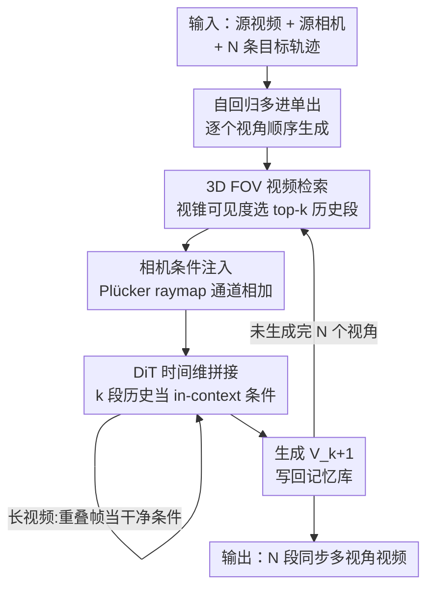

# Plenoptic Video Generation

**会议**: CVPR 2026  
**论文**: [CVF Open Access](https://openaccess.thecvf.com/content/CVPR2026/html/Fu_Plenoptic_Video_Generation_CVPR_2026_paper.html)  
**代码**: 无（项目页 research.nvidia.com/labs/dir/plenopticdreamer）  
**领域**: 视频生成  
**关键词**: 相机可控视频生成、视频重渲染、自回归、时空记忆、Plücker raymap

## 一句话总结
PlenopticDreamer 把"沿任意相机轨迹重渲染输入视频"做成一个**自回归、多进单出**的扩散模型：每生成一个新视角时，从已生成视频构成的记忆库里按 3D 视锥可见度检索出最相关的若干段历史视频作为条件，再配合渐进式上下文扩张与自条件训练，从而让不同相机轨迹下被"脑补"出来的遮挡区域保持时空一致，在 Basic / Agibot 两个基准上的视角同步指标大幅超过 ReCamMaster 等单视图方法。

## 研究背景与动机

**领域现状**：相机可控的生成式视频重渲染（给一段视频 + 一条目标相机轨迹，生成沿该轨迹重新拍摄、但内容不变的新视频）最近进展很快，ReCamMaster、TrajectoryCrafter 等方法在各自整理的真实/合成数据集上已能产出不错的单视角结果。视频帧本质上是场景辐射场（plenoptic function）的离散采样，控制相机运动就是在对这个光场做不同切片。

**现有痛点**：这些方法基本只在**单视图**设定下成功——给定一个目标轨迹生成一段，彼此独立。一旦要为同一场景生成**多条**轨迹（多视角），它们就会在源视图看不到、需要靠模型"脑补"的区域出现严重不一致：不同轨迹生成的同一块遮挡区域几何对不齐、视角之间"各画各的"（view desynchronization）。

**核心矛盾**：根因有二。其一，扩散模型本身具有**随机性**，每次单独 inference 脑补出的内容都不一样；其二，模型缺乏**长程空间记忆**，第 N 次生成时完全不知道前面 N−1 次把这块遮挡区域画成了什么样。两者叠加，导致多视角间几何错位。TrajectoryCrafter 这类用 3D 点跟踪注入条件的方法，也因为**不会用新渲染出的内容去更新 3D 记忆**而失败。

**本文目标**：在生成多条相机轨迹的视频时，显式地维护**时空记忆**，让所有视角对遮挡区域的脑补彼此同步，等价于真正地生成场景的"时空相关 plenoptic function"。

**切入角度**：既然单次生成无法感知历史，那就把多视角生成从"一次性各自独立"改成"**自回归、逐个生成**"——每生成一个新视角时，把之前已经生成好的视频-相机对作为条件喂进去。这样新视角天然继承历史脑补，问题从"如何让独立采样一致"转化为"如何把历史塞进上下文"。

**核心 idea**：用**多进单出（multi-in–single-out）的自回归扩散**替代单次生成，并用 **3D 视锥可见度检索**从历史视频记忆库里挑出最相关的几段当条件，强行让脑补"有据可依"。

## 方法详解

### 整体框架

任务形式化：给定源视频 $V_s \in \mathbb{R}^{F\times C\times H\times W}$、源相机轨迹 $P_s$ 以及 $N$ 条目标相机轨迹 $\{P_t^n\}_{n=1}^{N}$，要生成 $N$ 段目标视频 $\{V_t^n\}$，每段沿一条目标轨迹、内容与源视频一致，且各视角间（尤其遮挡区）时空同步。骨干是一个 **flow-matching 范式的视频 DiT**：前向过程在数据与噪声间线性插值 $x_t=(1-t)x_0+t\epsilon$、$v_t=\epsilon-x_0$，训练目标是预测速度场 $\mathcal{L}(\Theta)=\mathbb{E}\|v_\Theta(x_t,t,c)-v_t\|^2$（公式 3）。

最朴素的做法（Native，照搬 ReCamMaster）是把上下文窗口从 1 段视频扩到 $N$ 段，全部 patchify 后在帧维拼接成 $x=[x_s,x_1,...,x_N]$ 一次性生成。但当 $N$ 或分辨率一大，计算量爆炸、极易 OOM，只在 $N\le 3$、$\le$480p 时可行。

PlenopticDreamer 的整体 pipeline 因此重构为三块协同：**(a) 视频&相机记忆库**存放已生成的所有 $(P_n,V_n)$ 对；**(b) 自回归多相机生成器**每步用 **3D FOV 检索**从记忆库取 top-$k$ 段历史视频，连同目标相机 $P_{k+1}$ 一起，通过加噪调度 + 可学习重建生成下一段 $V_{k+1}$，新生成的视频再写回记忆库；**(c) DiT block 内部**把检索到的 $k$ 段视频 token 在**时间维拼接**成 in-context 条件，相机以 Plücker raymap 编码后逐通道加到视频 token 上。生成长视频时，还会把前一 chunk 末尾的若干重叠帧当作干净条件帧保留。

### 关键设计

**1. 自回归多进单出生成：把"独立采样"改成"逐个续写"**

这一条直击"多视角各画各的"的根因。原本的生成函数 $f:c,V_s,P_s,\{P_t^n\}\to\{V_t^n\}$ 是一锤子买卖，本文改写为序列化的递推式（公式 6）：

$$f(\cdot):c,\{(P_n,V_n)\}_{n=1}^{k},P_{k+1}\to V_{k+1},\quad k=1,...,N-1$$

即每步只生成一段视频 $V_{k+1}$，但把**之前已经生成好的 $k$ 段视频-相机对当条件**，其中源对 $(P_s,V_s)$ 视为 $(P_1,V_1)$，$k$ 是模型的上下文容量。条件构造用**时间维拼接**：$x=[x_1,...,x_{k+1}]$，沿帧维把 $k+1$ 段（含待生成的目标）拼成一条长 token 序列喂进 DiT。相机信息用 **Plücker raymap** 编码——把每个像素映射成 6D 射线表示 $\ddot P_n\in\mathbb{R}^{f\times H\times W\times 6}$，经投影层 $E_{cam}$ 对齐维度后，在自注意力前**逐通道加**到视频 token 上。这样新视角的脑补不再是凭空采样，而是在"已经画成这样"的历史约束下续写，几何自然对齐；相比 Native 方案，它把一次性的大上下文摊销到多步，避免了 OOM。

**2. 3D FOV 视频检索：从记忆库里挑出真正"看得见同一块"的历史段**

自回归的关键卡点是：记忆库里历史视频越积越多，到底拿哪 $k$ 段当条件？随便选会引入无关视角、稀释空间线索。本文不按相机位姿的简单距离，而是按**空间共视度（spatial co-visibility）**检索（Algorithm 1）：对每段历史视频，逐帧构造它与目标相机的视锥（frustum），在近/远平面间做 Monte Carlo 采样，统计"对方视锥里能看到的采样点数"，按 $S_n \leftarrow S_n + \frac{P_n+P_{K+1}}{2P\times F}$ 累加成视频级相似度，取 top-$k$。直觉上，跟目标视角"看的是同一片区域"的历史段，才对脑补遮挡区最有帮助。两个边界情况：历史段不足 $k$ 时，复制输入对 $(P_1,V_1)$ 补齐；检索到的数量 $l$ 超过容量 $k$ 时，用**分治推理**（Algorithm 2）——先把相机相似度最低（视角最分散）的几段融合成一条"大致覆盖所有输入 FOV"的合并轨迹 $P_{merge}$，生成一段融合视频再替换回去，循环直到 $l\le k$，从而在固定上下文里尽量覆盖多样视角、减小视角重叠。

**3. 渐进式上下文扩张 + 自条件训练：稳住收敛、压住误差累积**

这是两条互补的训练策略，对应自回归的两个老问题。其一，**直接用大上下文 $k$ 训练会收敛不稳**；本文采用**渐进式训练**：先用小上下文（如 $k{=}1$）训，待稳定后逐步加到目标 $k$（Basic 上按 context 1→4 分别训 10K/4K/1K/1K 步），显著改善收敛稳定性并加速后期大上下文阶段。其二，自回归推理里，前面生成的不完美视频会被反复当条件，**误差逐步累积**；本文用**自条件训练**：第一阶段所有条件视频都用 ground-truth；收敛后让模型对训练集输入**生成合成输出**，第二阶段用这些"带瑕疵的自产输出"替换 GT 条件再训。等于让模型提前见识"输入本来就不完美"的情形，从而在长程推理时更鲁棒，缓解过曝、artifact 等长镜头退化。

> 补充：针对超出时间窗口的长视频，作者还把输入切成**重叠 sub-chunk**，把前一 chunk 末尾的 $\tilde F$ 帧作为干净条件帧并入生成（公式 8），顺序生成各 chunk 再拼接，保证 chunk 边界的时空连续——这是上面框架的长视频扩展，并非独立的新模块。

### 损失函数 / 训练策略

训练目标即 flow-matching 速度回归（公式 9）：$\mathcal{L}(\Theta)=\mathbb{E}\big\|v_\Theta(\{(P_n,V_n)\}_{n=1}^{k+1},t,c)-v_t\big\|^2$，并按一定比例把长视频的重叠帧扩展预测 $\tilde V_{k+1}$ 也并入 loss。骨干用 **Cosmos-Predict2.5-2B**，生成 432×768、93 帧视频，context parallelism 设为 8，在 32 张 H100 上微调，batch size 1、lr 2e-5；**只更新自注意力层和相机编码器**，其余冻结。训练时 timestep $t$ 可偏向高噪声，鼓励在时空相关性退化下仍能鲁棒重建。

## 实验关键数据

评测三个维度：视觉质量（PSNR、FVD）、相机精度（TransErr、RotErr，动态位姿用 ViPE、静态新视角用 VGGT 估计）、视角同步（RoMa 统计高置信匹配像素数 Mat. Pix.）。

### 主实验

Basic 基准（100 段野外视频 × 12 条轨迹）上的对比，Mat. Pix. 单位为千（K）：

| 模型 | FVD ↓ | TransErr ↓ | RotErr ↓ | 3 Shots ↑ | 6 Shots ↑ | 9 Shots ↑ | 12 Shots ↑ |
|------|-------|-----------|----------|-----------|-----------|-----------|------------|
| Trajectory-Attention | 734.1 | 0.77 | 0.26 | 22.7 | 26.9 | 28.8 | 29.1 |
| TrajectoryCrafter | 665.9 | 0.65 | 0.27 | 31.2 | 29.3 | 35.3 | 36.2 |
| ReCamMaster | 731.6 | 0.72 | 0.23 | 32.1 | 29.0 | 30.9 | 27.6 |
| ReCamMaster*（同数据重训） | 675.4 | 0.52 | 0.22 | 24.6 | 20.2 | 29.7 | 31.2 |
| **PlenopticDreamer** | **425.8** | 0.54 | **0.21** | **41.4** | **40.8** | **45.4** | **41.2** |

视角同步（Mat. Pix.）在所有 shot 数下全面领先，FVD 也从 ~665 压到 425.8；相机精度与重训后的 ReCamMaster* 相当。值得注意的是同步指标几乎不随 shot 数增加而衰减（baseline 普遍掉得明显），说明记忆机制确实在维持长程一致。

Agibot 机器人操作基准（200 段测试视频，head-view→gripper-view，评 2 个 gripper 视角）：

| 模型 | PSNR ↑ | View Sync. (Mat. Pix. K) ↑ |
|------|--------|----------------------------|
| ReCamMaster* | 13.84 | 13.2 |
| **Ours** | **14.54** | **15.3** |

### 消融实验

Basic 全集（1,200 段生成视频）上的训练策略 / 检索消融：

| 配置 | FVD ↓ | IQ ↑ | TransErr ↓ | 3 Shots ↑ | 12 Shots ↑ | 说明 |
|------|-------|------|-----------|-----------|-----------|------|
| Full Model | 425.8 | 58.5 | 0.54 | 41.4 | 41.2 | 完整模型 |
| w/o Self-Cond. | 464.3 | 56.7 | 0.54 | 40.9 | 40.7 | 去自条件：FVD/IQ 变差，长镜头过曝、artifact |
| w/o Progressive | 453.8 | 57.2 | 0.63 | 39.6 | 39.4 | 去渐进训练：TransErr 0.54→0.63，遮挡的人错误显形 |
| w/ Random Context | 520.5 | 58.3 | 0.56 | 33.6 | 32.4 | 随机选历史段：同步全面崩，脑补不一致 |

检索上下文数量消融（Mat. Pix. K，⚠️ 表中 6/8/10 行存在缺列，以原文为准）：

| 上下文数 | 3 Shots | 6 Shots | 9 Shots | 12 Shots |
|---------|---------|---------|---------|----------|
| 4 | 58.1 | 51.2 | 52.1 | 42.7 |
| 6 | — | 52.1 | 53.1 | 43.6 |
| 8 | — | — | 50.2 | 41.0 |
| 10 | — | — | — | 40.8 |

### 关键发现
- **3D FOV 检索是同步的命脉**：换成随机选历史段，3-shot 同步从 41.4 暴跌到 33.6、12-shot 从 41.2 到 32.4，掉幅远超去掉任一训练策略——说明"挑对历史段"比"训得好"更决定多视角一致。
- **渐进训练主要救相机精度**：去掉后 TransErr 从 0.54 恶化到 0.63，且会出现遮挡物体错误显形，印证大上下文需要循序渐进才能稳。
- **上下文不是越多越好**：从 4 增到 6 因空间线索更丰富而提升多视角一致，但再往上（8、10）收益递减——轨迹融合误差与生成噪声会随上下文复合放大。

## 亮点与洞察
- **把"采样随机性导致的不一致"转化为"上下文检索问题"**：与其想办法约束扩散采样，不如让后生成的视角直接读到先生成的内容，自回归 + 记忆库是个干净利落的换框思路，可迁移到任何"多次独立生成需要互相一致"的场景。
- **检索按 3D 视锥共视度而非位姿距离**：Monte Carlo 在视锥近/远平面采样、数对方能看见多少点，比单纯比相机位姿更贴合"谁对脑补这块遮挡有用"的真实需求，是个可复用的 3D 相关性度量。
- **分治推理把"检索数 > 上下文容量"优雅化解**：把最分散的视角先融合成一条覆盖性轨迹再压缩，避免了固定窗口装不下时只能粗暴截断。
- **自条件训练用"自产瑕疵输出"当训练数据**：直接对症自回归的误差累积，思路朴素但有效，对其他自回归生成（长视频、长序列）都有借鉴价值。

## 局限与展望
- **依赖大规模合成多视角数据**：Basic 训练用 MultiCamVideo + SynCamVideo（约 136K+34K episodes）、Agibot 用约 14.6 万段三视角同步数据，这类带精确多相机标注的数据获取成本高，限制了向更开放真实场景的扩展。
- **算力门槛极高**：32×H100、context parallelism=8，Agibot 单阶段就要约 5 天，复现与落地成本大。
- **上下文容量受限于收益递减**：上下文超过 6 段后轨迹融合误差累积，多视角进一步变多时的可扩展性仍有天花板（⚠️ 论文未给出 $N$ 很大时的极限分析）。
- **指标偏几何/像素层面**：Agibot 上 PSNR 仅 14.5 左右，绝对视觉保真度仍有限；同步主要由 Mat. Pix. 衡量，对语义层面一致性的评估较弱。

## 相关工作与启发
- **vs ReCamMaster / TrajectoryCrafter（单视图重渲染）**：它们各视角独立生成、无跨步记忆，TrajectoryCrafter 虽用 3D 点跟踪注入条件但**不更新 3D 记忆**；本文用自回归把历史脑补显式带进上下文，因而在多视角同步上大幅领先（Mat. Pix. 几乎翻倍）。
- **vs 各类视频记忆机制（frame-level / latent-level / 3D-level / network-level）**：帧级（top-k 历史帧）、latent 级（分层 token）、3D 级（VMem、SPMem 重建 surfel/点云）、网络级（TTT-Video 用测试时训练更新权重）各有路线；本文是**首个用显式"视频段检索"做条件**的记忆框架，记忆单元是完整视频-相机对而非帧/token/3D 结构，靠 FOV 共视度检索而非位姿相似度。
- **启发**："自回归 + 检索式记忆"这套组合，对需要长程一致的生成任务（长视频、3D 场景、具身策略 rollout）是通用模板；3D FOV 共视检索也可单独用作多视角数据的相关性度量。

## 评分
- 新颖性: ⭐⭐⭐⭐⭐ 首个为生成式视频重渲染引入显式时空记忆 + 视频级检索的框架，换框思路干净。
- 实验充分度: ⭐⭐⭐⭐ Basic/Agibot 双基准 + 多组消融较扎实，但上下文数量消融表有缺列、绝对保真度偏弱。
- 写作质量: ⭐⭐⭐⭐ 任务形式化与算法清晰，框架图信息量大；部分符号（合并轨迹、分治）需对照算法才好懂。
- 价值: ⭐⭐⭐⭐ 对沉浸式内容创作与具身 AI 的多视角一致生成有实用价值，但算力/数据门槛高。

<!-- RELATED:START -->

## 相关论文

- [\[CVPR 2026\] Physical Simulator In-the-Loop Video Generation](physical_simulator_in-the-loop_video_generation.md)
- [\[CVPR 2026\] EgoX: Egocentric Video Generation from a Single Exocentric Video](egox_egocentric_video_generation_from_a_single_exocentric_video.md)
- [\[CVPR 2026\] SURF: Signature-Retained Fast Video Generation](surf_signature-retained_fast_video_generation.md)
- [\[CVPR 2026\] Dual-Granularity Memory for Efficient Video Generation](dual-granularity_memory_for_efficient_video_generation.md)
- [\[CVPR 2026\] Spatia: Video Generation with Updatable Spatial Memory](spatia_video_generation_with_updatable_spatial_memory.md)

<!-- RELATED:END -->
