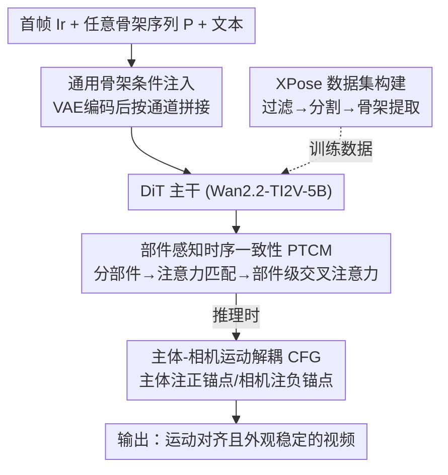

# PoseAnything: General Pose-guided Video Generation with Part-aware Temporal Coherence

**会议**: CVPR 2026  
**论文**: [CVF Open Access](https://openaccess.thecvf.com/content/CVPR2026/html/Wang_PoseAnything_General_Pose-guided_Video_Generation_with_Part-aware_Temporal_Coherence_CVPR_2026_paper.html)  
**代码**: 无（仅有项目页 https://ryan-w2024.github.io/project/PoseAnything/）  
**领域**: 视频生成 / 可控生成  
**关键词**: 姿态引导视频生成、通用骨架、部件级一致性、解耦 CFG、相机运动控制

## 一句话总结
PoseAnything 让姿态引导的视频生成第一次摆脱"只能驱动人体"的限制，给定首帧 + 任意主体的骨架序列就能生成对应运动的视频；它靠"部件感知时序一致性模块"把外观一致性细化到身体局部，靠"主体-相机运动解耦 CFG"首次实现相机运动的独立可控，并放出 5 万对非人姿态-视频数据集 XPose，在 TikTok（人体）和自建非人 benchmark 上全面超过 SOTA。

## 研究背景与动机
**领域现状**：姿态引导视频生成（pose-guided video generation）通过一串姿态序列控制视频中主体的运动，是动画、虚拟形象驱动的关键能力。扩散模型时代主流做法是给视频生成 backbone（早期 Stable Diffusion / U-Net，近期 DiT）外挂姿态条件——如 Disco 用 ControlNet 注背景特征、AnimateAnyone 用 ReferenceNet 保外观，配合时序层做帧间建模。

**现有痛点**：① 这些方法几乎全部**只吃人体骨架**。人体骨架结构固定（DWPose/DensePose 那套关节定义），它们的网络和数据都绑死在人体上，换成猫、鱼、机械臂这类非人主体就泛化崩溃。Animate-X 试着把人体骨架硬套到非人身上，但只能处理"长得像人"的少数情形，无法容纳千差万别的骨架拓扑。② 运动过程中**外观一致性差**：大幅姿态变化时局部细节（花纹、四肢）容易畸变、抖动，因为 ControlNet/cross-attention 只抓了参考图的"整体外观"，没有部件级的对应约束。③ **相机运动不可控**：现有姿态驱动方法只管主体动，背景/相机是死的；想加相机控制就得和主体控制信号一起塞进网络，结果两路信号互相干扰。

**核心矛盾**：一是"骨架的通用性"与"现有人体专用条件注入/数据"之间的矛盾；二是"整体外观对齐"粒度太粗，与"运动中局部细节必须稳"之间的矛盾；三是主体运动信号与相机运动信号耦合注入时的相互干扰。

**本文目标**：做一个支持任意骨架、对任意主体都能用的通用姿态引导视频生成框架，同时把外观一致性做到部件级，并让相机运动独立可控。

**切入角度**：作者基于一个关键观察——**同一部件在不同帧之间的注意力权重，天然高于不同部件之间**，于是可以用注意力自己来建立帧间的部件对应；另外发现 CFG 的正负锚点本就是两条独立的引导通道，正好可以分别承载主体和相机两种运动信号。

**核心 idea**：把"整段外观一致性"拆成"部件级一致性 + 注意力匹配部件对"，再把主体与相机控制分别注入 CFG 正/负锚点实现解耦，外加构建首个大规模非人姿态数据集 XPose 来支撑通用骨架训练。

## 方法详解

### 整体框架
PoseAnything 以图生视频模型 **Wan2.2-TI2V-5B** 为底座。输入是参考图 $I_r$、姿态序列 $P$ 和文本 prompt：参考图经 Wan2.2-VAE 编码为 latent $Z_i$，与噪声 $\epsilon$ 拼成 $Z_0=[Z_i,\epsilon]$；姿态序列 $P$ 也用同一个预训练 VAE 编码成姿态 latent $Z_p$。两者沿**通道维**拼接后过卷积 patchify，得到 DiT 的输入 $Z$。在每个 DiTBlock 原有 cross-attention 层之后插入 **部件感知时序一致性模块（PTCM）**，做细粒度外观约束；推理阶段再用 **主体-相机运动解耦 CFG** 把相机运动独立注进来。训练数据则来自专门构建的 **XPose** 非人数据集（5 万对）加 1.5 万段内部人体视频。

整体可以看成"通用骨架条件注入 → 部件级一致性细化 → 解耦式相机控制"三段，外加底层撑着它的非人数据管线：

### 关键设计

**1. 通用骨架条件注入：把任意骨架塞进 DiT 而不破坏底座**

姿态引导要泛化到任意主体，第一步是怎么把骨架信息喂给 DiT 而不破坏 Wan2.2 的预训练能力。作者对比了三种注入策略：(a) 按通道拼接——把 $Z_0$ 和 $Z_p$ 沿通道维并起来 $Z_{agr}=[Z_0,Z_p]\in F\times H\times W\times 2C$，再用一个把输入通道数扩大的卷积 patchify 压回原通道数 $Z=\mathrm{Conv}(Z_{agr})\in f\times h\times w\times c$，保证进 DiTBlock 的通道数和原始 Wan 一致；(b) MLP 相加——$Z=Z_0+\mathrm{MLP}(X_p)$；(c) 按宽度拼接——$Z=\mathrm{Concat}_{width}(Z_0,Z_p)$。实验（见补充材料）表明**按通道拼接**在姿态引导任务上显著占优，因为它在保持底座通道结构、不引入额外序列长度的前提下让骨架与图像 latent 在同一空间位置对齐，于是被采用。关键点在于骨架不绑定人体关节定义、直接走 VAE 编码，因此任何拓扑的骨架都能进来——这正是"通用"的来源。

**2. 部件感知时序一致性模块（PTCM）：把外观一致性细化到身体局部**

ControlNet / 全局 cross-attention 只对齐参考图的整体外观，大幅运动时局部细节会畸变。PTCM 把"整段一致性"拆成"部件级一致性"，分三步走。**第一步部件掩码生成**：把每帧姿态切成若干段 $s_{ij}$（$i$ 帧、$j$ 段），对每段做膨胀得到覆盖主体部件的像素掩码 $m_{ij}=\mathrm{Dilate}(s_{ij},\alpha)$；膨胀系数 $\alpha$ 不是拍脑袋定的，而是不断膨胀直到该段能盖住参考图对应身体区域为止，即 $\alpha_{ij}=\min\{\alpha,\ 100\mid \mathrm{IoU}(\mathrm{Dilate}(s_{ij},\alpha),\ \mathrm{Body}^{ref}_{ij})\ge 1\}$（⚠️ 该约束式以原文为准）。**第二步基于注意力的部件匹配**：利用"同部件跨帧注意力高于异部件"这一观察，先跑几步推理算出首帧与后续帧的注意力权重，再把首帧第 $j$ 段匹配到后续帧注意力最高的段：$s_{ij'}\sim s_{0j}\iff j'=\arg\max_t \mathrm{attn\_weight}[m_{0j}][m_{it}]$。**第三步部件级交叉注意力**：对每个匹配对 $\langle s_{0j},s_{ij}\rangle$，用后续帧该部件的 token 算 $Q$、用首帧对应部件的 token 算 $K,V$，做一次受掩码约束的交叉注意力 $x'=x+\mathrm{Cross\text{-}Atten}(Q_j,K_j,V_j)$，其中 $Q_j=m_{ij}XW_q,\ K_j=m_{0j}X_0W_k,\ V_j=m_{0j}X_0W_v$。这样每个局部只跟它在首帧的"同源部件"对齐，而不是被整张参考图平均，于是花纹、四肢这类细节在剧烈运动下也能保持稳定。该模块挂在每个 DiTBlock 最后一层 cross-attention 之后。

**3. 主体-相机运动解耦 CFG：用正负锚点拆开两路运动信号**

作者发现一个意外现象：虽然模型只在主体运动控制上训练，它却能泛化出相机运动控制能力；但若把主体和相机两路控制信号同时注入，二者会相互干扰、谁都表达不好。解法很巧——直接借 CFG 的正负锚点来解耦：把**主体姿态控制**注入正锚点、把**相机运动控制**注入负锚点。引导公式为

$$\tilde{\epsilon}=\hat{\epsilon}_\theta(\varnothing_s,z_c)+s\cdot(\hat{\epsilon}_\theta(z_s,\varnothing_c)-\hat{\epsilon}_\theta(\varnothing_s,z_c))=(1+s)\cdot\hat{\epsilon}_\theta(\varnothing_s,\varnothing_c)+\hat{\epsilon}_\theta(z_s,\varnothing_c)+s\cdot\hat{\epsilon}_\theta(\varnothing_s,z_c),$$

其中 $z_s$、$z_c$ 分别是注入了主体、相机运动信息的 latent。更妙的是**负锚点的相机控制是"反向"的**：负锚点的作用是把生成"推离"某状态，所以想让相机左移（背景应右移），就构造一个"向左移动的矩形骨架"塞进负锚点，模型被推离这个"左移"信号、于是产生背景右流，实现相机左摇。由此主体动作严格跟随姿态序列、相机按指令平滑运动，两路互不干扰——这是姿态引导视频生成里**首次**实现独立相机控制。

**4. XPose 数据集与构建管线：补上"非人姿态"这块数据空白**

通用骨架训练缺的是非人姿态数据，作者因此构建并开源 XPose（5 万对非人姿态-视频）。三阶段自动管线：**阶段一视频过滤**——用 Qwen-2.5-VL-7B-Instruct 从 Koala、UltraVideo 里筛"画面中只有单一非人主体、无场景切换、相机平稳"的片段，降低骨架噪声；**阶段二主体分割**——用 Grounded-SAM2 分割主体，再用过滤算法去掉无效骨架：丢掉主体占比 $S_t/(H\times W)$ 不落在 $(0.2,0.8)$ 的（太大太小都不行），首帧取最大掩码 $M^*_1=\arg\max_{M\in M_1}\mathrm{Area}(M)$，后续帧在同标签候选里取与上一帧 IoU 最大者 $M^*_t=\arg\max_{M\in M_t,\,label(M)=label(M^*_1)}\mathrm{IoU}(M,M^*_{t-1})$ 以保时序一致；**阶段三骨架提取**——用 BlumNet 从掩码图提骨架，若成功提取骨架的帧数占比 $T_{skel}/T<0.8$ 则整段丢弃。这套管线保证了骨架精度和帧间连续性，是通用泛化能力的数据基础。

## 实验关键数据

底座为 Wan2.2-TI2V-5B；训练分三阶段：先在人体数据上训不带 PTCM 的 baseline（3k 步），再用人+非人混合数据继续训，最后冻结其他模块只训 PTCM（8k 步），均在 8 卡上进行。评测用 PSNR、SSIM、L1、LPIPS、FVD 五个标准指标。

### 主实验

人体 benchmark（TikTok），PoseAnything 在全部五项指标上都最好：

| 方法 | PSNR↑ | SSIM↑ | L1↓ | LPIPS↓ | FVD↓ |
|------|-------|-------|------|--------|------|
| Disco | 29.03 | 0.668 | 3.78E-04 | 0.292 | 292.80 |
| AnimateAnyone | 29.56 | 0.718 | - | 0.285 | 171.90 |
| Champ | 29.91 | 0.802 | 2.94E-04 | 0.234 | 160.82 |
| Unianimate | 30.77 | 0.811 | 2.66E-04 | 0.231 | 148.06 |
| Animate-X | 30.78 | 0.806 | 2.70E-04 | 0.232 | 139.01 |
| **PoseAnything** | **31.50** | **0.836** | **2.79E-05** | **0.224** | **133.95** |

非人 benchmark（XPose 随机抽 51 段、训练未见），对比 drag/轨迹类可控生成方法：

| 方法 | PSNR↑ | SSIM↑ | L1↓ | LPIPS↓ | FVD↓ |
|------|-------|-------|------|--------|------|
| Tora | 30.08 | 0.6929 | 9.38E-06 | 0.3530 | 103.75 |
| ATI | 30.15 | 0.6810 | 9.59E-06 | 0.3706 | 101.44 |
| SG-I2V | 29.86 | 0.6634 | 1.28E-05 | 0.3674 | 102.97 |
| **PoseAnything** | **30.29** | **0.7114** | **8.19E-06** | **0.3241** | **99.97** |

轨迹类方法（ATI/Tora/SG-I2V）只能控物体大致位移，对非人主体的精细姿态控制力不足、大幅运动时易畸变；PoseAnything 用骨架直接驱动，姿态对齐和前/背景完整性都更好。

### 消融实验
在 XPose 上对 PTCM 做消融——Concat 是只用通道拼接注入、不带 PTCM 的 baseline；EC 是在整段主体区域上算 cross-attention（不做部件分割与匹配）；PTCM 是完整模块：

| 配置 | PSNR↑ | SSIM↑ | LPIPS↓ | L1↓ | FVD↓ | 说明 |
|------|-------|-------|--------|------|------|------|
| Concat | 29.85 | 0.6964 | 0.3304 | 9.43E-06 | 102.30 | 无 PTCM，最差 |
| EC | 30.27 | 0.7107 | 0.3243 | 8.15E-06 | 101.50 | 整段交叉注意力，无部件 |
| PTCM | 30.29 | 0.7114 | 0.3241 | 8.19E-06 | **99.97** | 完整部件级 |

### 关键发现
- 去掉 PTCM（Concat）后各项指标明显变差，说明部件级一致性约束是外观稳定的主因。
- 把交叉注意力从"部件级"退化到"整段"（EC）后，FVD 从 99.97 升到 101.50、SSIM 等也略降——证明真正起作用的是**部件分割 + 匹配**这层细粒度，而非单纯加一层 cross-attention。
- 相机控制实验（主体姿态 + 相机指令同时注入）中，主体动作跟随姿态、相机按指令（左摇/上仰等）平滑运动，二者互不干扰，验证了解耦 CFG 的有效性。

## 亮点与洞察
- **用注意力自己做部件匹配**：基于"同部件跨帧注意力更高"的观察，不需要额外训练一个匹配网络，先跑几步推理拿到注意力权重就能建立帧间部件对应——简单且零额外监督，是很可复用的 trick。
- **把 CFG 正负锚点当成两条独立控制通道**：通常 CFG 负锚点只是"无条件"占位，这里却用它承载相机运动、还利用"负向引导=反方向"的特性把左摇变成"注入左移信号"，思路非常巧，且天然解耦了两路信号。
- **数据即能力**：通用骨架泛化的真正瓶颈是数据，作者没有止步于改网络，而是配套放出 5 万对非人数据集和自动化管线，让"任意主体"从口号变成可训练的现实。
- 部件级对齐的思想可迁移到其他需要细粒度一致性的可控生成任务（如换装、局部编辑），匹配阶段同样可借用注意力权重。

## 局限与展望
- **依赖底座能力**：整体建在 Wan2.2-TI2V-5B 上，生成质量上限受底座约束；相机控制能力还是"泛化涌现"出来的，缺乏显式训练，鲁棒性边界不清。
- **骨架提取链路误差累积**：XPose 管线依赖 Grounded-SAM2、BlumNet 等多个现成模型，分割/提骨架错误会传到训练数据里；非人 benchmark 仅 51 段，评测规模偏小。
- **相机控制靠"反向骨架"构造**：用矩形骨架的反向运动注入负锚点来表达相机运动，较为 hand-crafted，复杂相机轨迹（如组合运动、变焦）能否同样精确控制存疑 ⚠️。
- **未开源代码**：目前只有项目页，复现需自行实现 PTCM 与解耦 CFG。
- 改进方向：把相机控制显式纳入训练目标、扩大非人评测集、引入更鲁棒的骨架提取以减少数据噪声。

## 相关工作与启发
- **vs AnimateAnyone / Unianimate / Animate-X（人体姿态驱动）**：它们用 ReferenceNet/时序层保人体外观一致，但绑死人体骨架、非人泛化差，且外观对齐停留在整体级别。PoseAnything 支持任意骨架、把一致性细化到部件级，在 TikTok 上仍反超它们。
- **vs Tora / ATI / SG-I2V（轨迹/drag 可控生成）**：它们擅长控物体整体位移（平移、缩放），但对精细姿态、部件级运动无能为力，大幅运动易畸变。PoseAnything 用骨架直接驱动，既能控位置又能控姿态，非人 benchmark 全面占优。
- **vs SketchVideo / VideoComposer（草图可控）**：草图输入费力且帧间一致性难保。PoseAnything 用骨架序列更轻量、配合 PTCM 一致性更好。

## 评分
- 新颖性: ⭐⭐⭐⭐⭐ 首个支持任意骨架的通用姿态引导视频生成，且首次在该任务实现独立相机控制，解耦 CFG 思路新颖。
- 实验充分度: ⭐⭐⭐⭐ 人体+非人双 benchmark、五指标全面对比 + PTCM 消融充分，但非人评测仅 51 段、相机控制偏定性展示。
- 写作质量: ⭐⭐⭐⭐ 动机清晰、三大贡献分明、图示完整；个别公式与符号表述略粗糙。
- 价值: ⭐⭐⭐⭐⭐ 打开"任意主体姿态驱动"的新设定并开源 5 万对数据集，对动画/虚拟形象领域有实用价值。

<!-- RELATED:START -->

## 相关论文

- [\[CVPR 2026\] MultiAnimate: Pose-Guided Image Animation Made Extensible](multianimate_pose-guided_image_animation_made_extensible.md)
- [\[CVPR 2026\] TEAR: Temporal-aware Automated Red-teaming for Text-to-Video Models](tear_temporal-aware_automated_red-teaming_for_text-to-video_models.md)
- [\[CVPR 2026\] ExPose: Reinforcing Video Generation Models for Extreme Pose Estimation](expose_reinforcing_video_generation_models_for_extreme_pose_estimation.md)
- [\[CVPR 2026\] BulletTime: Decoupled Control of Time and Camera Pose for Video Generation](bullettime_decoupled_control_of_time_and_camera_pose_for_video_generation.md)
- [\[CVPR 2026\] VideoCoF: Unified Video Editing with Temporal Reasoner](videocof_unified_video_editing_with_temporal_reasoner.md)

<!-- RELATED:END -->
