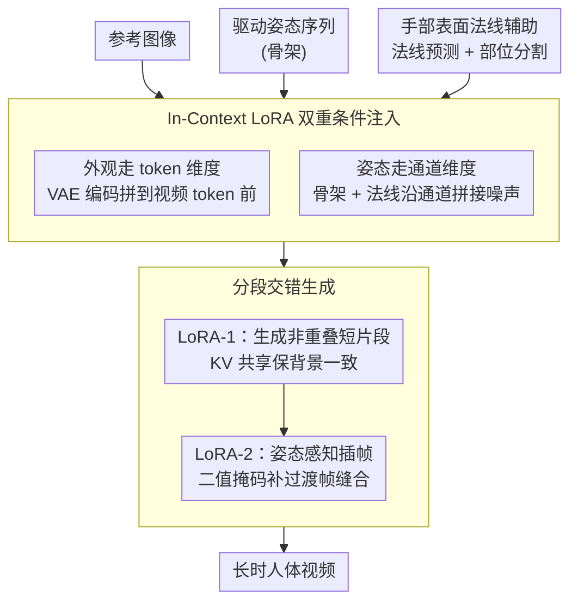

# PoseGen: In-Context LoRA Finetuning for Pose-Controllable Long Human Video Generation

**会议**: CVPR 2026  
**arXiv**: [2508.05091](https://arxiv.org/abs/2508.05091)  
**代码**: [https://github.com/Jessie459/PoseGen](https://github.com/Jessie459/PoseGen)  
**领域**: 视频生成  
**关键词**: 人体视频生成, 姿态控制, LoRA微调, 长视频生成, 扩散模型

## 一句话总结
PoseGen 通过 in-context LoRA 微调实现双重条件注入（token级外观 + 通道级姿态），并提出分段交错生成策略（KV共享+姿态感知插帧），仅用33小时视频数据即可生成高保真长时人体视频。

## 研究背景与动机
1. **领域现状**：基于扩散模型的可控视频生成取得显著进展，但在身份保持、运动精度和视频时长三方面仍存在严重挑战。
2. **现有痛点**：（i）身份漂移：人物外观随时间推移发生变形；（ii）运动不精确：精确运动控制常伴随视觉伪影；（iii）时长受限：多数方法限于10秒以内的短片段，长时生成导致严重的累积误差。
3. **核心矛盾**：现有方法要么需要大规模私有数据集（>10K小时），要么依赖复杂的架构设计（如专用姿态编码器），在效率、数据需求和生成质量间难以兼顾。
4. **本文目标**：设计高效、低数据需求的长时人体视频生成框架，同时保持身份一致性和运动精确性。
5. **切入角度**：利用LoRA的参数高效特性，通过最小架构修改实现双重条件注入；设计无需架构改动的长视频生成策略。
6. **核心idea**：token维度注入外观+通道维度注入姿态的双重条件机制，搭配基于KV共享的分段交错生成实现长视频。

## 方法详解

### 整体框架
PoseGen 想在不改动主干架构、不用海量私有数据的前提下，让一个预训练视频扩散模型（Wan2.1）既能锁住人物身份、又能精确跟随姿态，还能把片段拼成几分钟的长视频。它的做法是只训练两个角色不同的 LoRA：第一个 LoRA 负责把"外观条件"和"姿态条件"一起注进去、生成一个个独立的短片段；第二个 LoRA 专门做相邻片段之间的衔接。整条流程是「参考图 + 姿态序列 → 逐段生成短片 → 姿态感知插帧把相邻段缝合 → 长视频」，全程没有额外的姿态编码器或身份编码器，能力都压在 LoRA 微调和 in-context 拼接上。

### 关键设计

**1. In-Context LoRA 双重条件注入：让外观和姿态各走最自然的一个维度**

要同时控制"长什么样"和"怎么动"，最省事的思路往往是给每个条件配一个专用编码器，但那会把架构改重、也吃数据。PoseGen 改成在两个不同的维度上做 in-context 拼接：姿态条件走**通道维度**——把骨架姿态图和手部表面法线编进潜空间后，沿通道维度直接和噪声视频拼接，模型在每个空间位置都同时看到"该往哪动"和"当前噪声"；外观条件走**token 维度**——把参考图像用 VAE 编成潜在表示，沿 token 维度接在噪声视频 token 前面，借 DiT block 共享参数同时处理图像 token 和视频 token，自注意力天然就会让视频 token 去参考图 token 上"抄"外观。LoRA 只挂在自注意力、交叉注意力和前馈层上。这样姿态注入不需要额外的重量级姿态编码器，身份注入也不需要专门的 identity 模块——直接复用了 DiT 自注意力的跨 token 交互能力。

**2. 分段交错生成：用 KV 共享和姿态感知插帧把短片缝成长视频**

直接一口气生成长视频会让误差逐帧累积、人越画越歪；常见的"重叠段融合"又容易在拼接边界露馅。PoseGen 把长视频拆成两步走。第一步先生成若干**非重叠**短片段，但生成后续片段时，会缓存并复用源段自注意力层里的 Key-Value 对，让新片段在注意力里"看得到"前面片段的背景，从而把背景一致性作为一种隐式约束带进来，而不是事后再去对齐。第二步换用第二个 LoRA，对相邻两段之间缺失的过渡帧做**姿态感知的插帧生成**：用一个二值掩码标出哪些帧是已有的、哪些需要合成，模型在已知帧和目标姿态的双重引导下补出中间帧，把两段缝成连续视频。KV 共享管背景连贯，插帧 LoRA 管运动连贯，两者分工把"长"这个问题拆开解决。

**3. 手部表面法线辅助：给最容易崩的手部补一路几何线索**

手部是人体视频里画质塌得最厉害的地方——纹理高频、运动又快，光靠骨架点很难撑住。PoseGen 在骨架姿态之外，额外用一个表面法线预测模型配合人体部位分割模型估计出手部的表面法线，作为第二路控制信号一起喂进通道维度。法线携带的几何信息比稀疏骨架点丰富得多，能告诉模型手指朝向、表面起伏；而且在手指交叉、双手重叠这类场景里，估计表面法线比估计完整手部 mesh 更鲁棒，不容易因为遮挡而整体失真。

### 损失函数 / 训练策略
标准的扩散去噪损失，主干冻结、只训练 LoRA 参数。整套训练只用了 33 小时视频数据，远少于同类方法常见的 >10K 小时规模。

## 实验关键数据

### 主实验

| 数据集/指标 | 本文 | DreamActor-M1 | VACE | 说明 |
|------------|------|--------------|------|------|
| 身份保真度 | 最优 | 次优 | - | Face similarity指标 |
| 姿态精度 | 最优 | - | 次优 | Pose error指标 |
| 时间一致性 | 最优 | - | - | 长视频FVD |

### 消融实验

| 配置 | 关键指标 | 说明 |
|------|---------|------|
| Full PoseGen | 最优 | 完整模型 |
| w/o 手部法线 | 手部质量下降 | 法线对手部生成关键 |
| w/o KV共享 | 背景不一致 | KV缓存保持背景连贯 |
| w/o 分段交错 | 长视频质量差 | 交错策略对长视频必需 |

### 关键发现
- 仅33小时数据即可超越使用>10K小时数据的方法，说明in-context LoRA的参数效率极高。
- 手部法线的引入对手部生成质量有显著提升，尤其在手指交叉等复杂场景。
- KV共享机制有效保持了非重叠段之间的背景一致性，是长视频生成的关键。

## 亮点与洞察
- **极低数据需求**（33小时 vs >10K小时）是最大亮点，大幅降低了实际部署门槛。
- **双维度条件注入**的设计非常简洁：通道级做运动控制、token级做外观保持，各自利用了最自然的维度。
- 分段交错策略可迁移到其他需要长视频生成的场景。

## 局限与展望
- 依赖预训练的姿态估计和法线预测模型，其准确性会影响最终结果。
- 非重叠段之间的过渡区域仍可能存在微妙的不连续。
- 仅支持单人场景，多人交互场景尚未探索。

## 相关工作与启发
- **vs DreamActor-M1**: 使用复杂的注意力机制注入身份特征，本文用更简单的in-context拼接实现了更好效果。
- **vs AnimateDiff**: 需要专门的运动模块，本文直接通过通道拼接实现运动控制。
- **vs MAGI-1/SkyReels-V2**: 这些方法需要从头训练，本文仅微调LoRA即可。

## 评分
- 新颖性: ⭐⭐⭐⭐ 双维度条件注入+交错生成的组合新颖实用
- 实验充分度: ⭐⭐⭐⭐ 定量定性评估全面，但公开基准相对有限
- 写作质量: ⭐⭐⭐⭐ 方法描述清晰，动机充分
- 价值: ⭐⭐⭐⭐ 高效的人体视频生成方案，实用价值高

<!-- RELATED:START -->

## 相关论文

- [\[AAAI 2026\] MotionCharacter: Fine-Grained Motion Controllable Human Video Generation](../../AAAI2026/video_generation/motioncharacter_fine-grained_motion_controllable_human_video_generation.md)
- [\[ICLR 2026\] LoRA-Edit: Controllable First-Frame-Guided Video Editing via Mask-Aware LoRA Fine-Tuning](../../ICLR2026/video_generation/lora-edit_controllable_first-frame-guided_video_editing_via_mask-aware_lora_fine.md)
- [\[CVPR 2026\] Geometry-as-context: Modulating Explicit 3D in Scene-consistent Video Generation to Geometry Context](geometry-as-context_modulating_explicit_3d_in_scene-consistent_video_generation_.md)
- [\[CVPR 2026\] PAM: A Pose-Appearance-Motion Engine for Sim-to-Real HOI Video Generation](pam_a_pose-appearance-motion_engine_for_sim-to-real_hoi_video_generation.md)
- [\[CVPR 2026\] Free-Lunch Long Video Generation via Layer-Adaptive O.O.D Correction](free-lunch_long_video_generation_via_layer-adaptive_ood_correction.md)

<!-- RELATED:END -->
