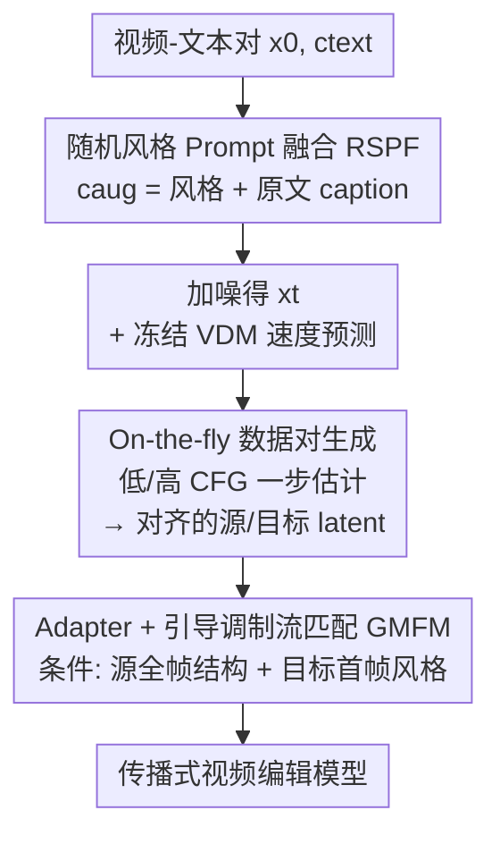

# PropFly: Learning to Propagate via On-the-Fly Supervision from Pre-trained Video Diffusion Models

**会议**: CVPR 2026  
**论文**: [CVF Open Access](https://openaccess.thecvf.com/content/CVPR2026/html/Seo_PropFly_Learning_to_Propagate_via_On-the-Fly_Supervision_from_Pre-trained_Video_CVPR_2026_paper.html)  
**代码**: 无（项目页 https://kaist-viclab.github.io/PropFly_site/）  
**领域**: 视频生成  
**关键词**: 传播式视频编辑, 视频扩散模型, Flow Matching, Classifier-Free Guidance, 即时监督

## 一句话总结
PropFly 用冻结的预训练视频扩散模型（VDM）自己当"监督来源"：对同一个加噪 latent 用低/高两个 CFG 尺度做一步去噪估计，得到结构对齐、语义有差异的"源/目标"视频对，再用一个新的 GMFM 损失训练 adapter 学会把"编辑后的首帧"传播到整段视频——全程不需要任何成对的（原视频，编辑后视频）数据集，却在多个视频编辑 benchmark 上显著超过 SOTA。

## 研究背景与动机
**领域现状**：视频编辑主流是文本驱动（text-guided），用一句 prompt 让模型做风格迁移、局部物体替换等改动，交互直观。但用户很难用文字精确描述想要的细粒度视觉效果，结果常常对不上创作意图。于是出现了"传播式编辑"（propagation-based）：用户精确编辑**单独一帧**，模型把这个改动**传播**到整段视频，同时保留原视频的运动和结构，控制力强很多。

**现有痛点**：训练传播式模型需要大规模、多样的成对视频数据集（源视频 + 编辑后视频），而这种数据极其昂贵、难采集。现有绕路方案各有硬伤：GenProp 用物体分割掩码合成训练对，只能做"加/删物体"这类局部改动，做不了全局风格化；CCEdit / Go-with-the-Flow 依赖预先算好的深度图、光流当辅助信号，一旦这些信号有误差就会引入伪影；Señorita-2M 直接用扩散模型迭代采样合成成对数据，对视频来说计算极贵，且覆盖的编辑类型有限。

**核心矛盾**：传播式编辑要泛化到"局部到全局"各种编辑，就需要海量多样的成对监督；但成对数据要么贵、要么覆盖窄、要么依赖易错的辅助信号——**监督信号的多样性和获取成本之间是死结**。

**切入角度**：作者的关键观察是——预训练 VDM 本身就"知道"各种全局变换怎么做。具体地，**改变 CFG 尺度会直接调制输出的全局视觉属性**（风格、色调、纹理）而保持视频整体内容不变（观察 1）；而且**一步 clean latent 估计就已经够用**，不必跑完整的迭代去噪（观察 2）。

**核心 idea**：对同一个加噪 latent，用低 CFG 当"源"、高 CFG 当"目标"，一步估计出两个结构对齐但语义有差异的 latent 对，即时（on-the-fly）合成无限多样的训练对，再训练 adapter 学习这对之间的变换——把 VDM 的"生成能力"直接转化成"传播监督"。

## 方法详解

### 整体框架
PropFly 是一条**训练管线**，目标是给冻结的预训练 VDM 挂一个可训练 adapter，让它学会"把编辑后的首帧传播到整段源视频"。整条管线分三步串起来：(a) 从视频数据集采一对"视频 latent + 文本"，并用随机风格 prompt 融合（RSPF）把 caption 扩成带风格的增强 prompt $c_\text{aug}$；(b) 对该视频加噪得到 $x_t$，让冻结 VDM 在低/高两个 CFG 尺度下各做一步 clean latent 估计，即时生成"源 latent $\hat{x}^{\text{low}}_{0|t}$ / 目标 latent $\hat{x}^{\text{high}}_{0|t}$"这一对监督；(c) adapter 以**整段源 latent（提供结构）+ 目标 latent 的首帧（提供风格）+ 增强文本**为条件预测速度，用 GMFM 损失对齐 VDM 的高 CFG 速度，从而学会把首帧编辑传播到后续帧。

底座用冻结的 Wan2.1 T2V 模型，adapter 用从 I2V 权重初始化的 VACE adapter，按步长 $S_\text{in}$ 把 adapter 特征注入冻结骨干。整段视频 latent 与编辑后首帧 latent 沿时间维拼接后喂给 adapter。

### 关键设计

**1. On-the-fly 数据对生成：用 CFG 尺度差 + 一步估计，凭空造出对齐又有语义差的源/目标对**

这是全文的命门，针对的就是"成对视频数据贵且窄"的痛点。PropFly 不去找现成数据，而是让冻结 VDM 自产监督。基于 Flow Matching，骨干被训练去预测连接数据 $x_0$ 与噪声 $x_1$ 的速度场 $v_t = x_1 - x_0$，因此对任意加噪 latent $x_t = (1-t)x_0 + t x_1$ 都能用速度反推出一步 clean latent 估计 $\hat{x}_{0|t} = x_t - t\cdot v_\theta(x_t, t, c_\text{aug})$。再把 CFG 机制叠上去：

$$\hat{v}^{\omega}_\theta = v_\theta(x_t, t, \varnothing) + \omega \cdot \big(v_\theta(x_t, t, c_\text{aug}) - v_\theta(x_t, t, \varnothing)\big)$$

用低尺度 $\omega_L$（如 1.0）和高尺度 $\omega_H$（如 7.0）分别算出速度，再一步估计出源 latent $\hat{x}^{\text{low}}_{0|t} = x_t - t\cdot\hat{v}^{\text{low}}_\theta$ 和目标 latent $\hat{x}^{\text{high}}_{0|t} = x_t - t\cdot\hat{v}^{\text{high}}_\theta$。两者源自**同一个** $x_t$ 和同一次速度预测，所以运动、结构天然对齐；又因为 CFG 尺度不同，高 CFG 那个语义编辑更强（风格/色彩/纹理被强化）——于是得到一对"结构一致、语义有差"的样本。作者特意强调：关键不是这俩一步 latent 画质多高，而是它们之间**干净的语义差**正好是传播所需的监督信号。靠随机采样 $x_1$ 和 $t$，这套机制能生成无限多样的训练对，且只比单步推理多一点点开销，远比"完整迭代采样合成成对视频"便宜。

**2. GMFM 损失：让 adapter 专心学"变换"而非"重建原视频"**

有了源/目标对，怎么训 adapter 是第二个关键。直接套标准 Flow Matching 损失会出大问题：FM 目标是让模型重建**原视频**，而我们想要的是把编辑**传播**出去——两者目标矛盾，实测会让首帧里的"雪"在后续帧消失（编辑没传播出去）。作者提出 Guidance-Modulated Flow Matching（GMFM）来对症。adapter 的完整速度预测以三样东西为条件：(i) 整段源视频 $\hat{x}^{\text{low}}_{0|t}$ 提供结构，(ii) 目标视频首帧 $\hat{x}^{\text{high}}_{0|t}[0]$ 提供视觉风格，(iii) 增强文本 $c_\text{aug}$：

$$\hat{v}_{\theta,\phi} = v_{\theta,\phi}\big(x_t, t, c_\text{aug}, \hat{x}^{\text{low}}_{0|t}, \hat{x}^{\text{high}}_{0|t}[0]\big)$$

损失则是让它去匹配**高 CFG 速度**（停梯度，因为骨干冻结）：

$$L_\text{GMFM} = \mathbb{E}\Big[\big\lVert \hat{v}_{\theta,\phi} - \text{sg}\{\hat{v}^{\text{high}}_\theta\} \big\rVert^2\Big]$$

一个巧妙细节：喂进去的 $x_t$ 正是生成数据对时用的那个同一个加噪 latent，而不是重新采噪声/时间步。这样冻结骨干 $\theta$ 能轻松重建出它自己原来的预测 $\hat{v}^{\text{cond}}_\theta$，于是 adapter $\phi$ 就能**只专注于学"把 $\hat{x}^{\text{low}}_{0|t}$ 变换成 $\hat{x}^{\text{high}}_{0|t}$"这件事**。本质上，GMFM 把"首帧的视觉风格"和"VDM 已经会做的完整语义变换"绑定起来，让 adapter 学会只凭视觉条件就复现文本驱动的高 CFG 变换。

**3. 随机风格 Prompt 融合（RSPF）：用风格词扩增，喂给模型更丰富的内容-风格组合**

针对"训练信号还不够多样"，作者在数据采样阶段把任意风格短语 $c_\text{style}$（如 "in snow"）随机拼到原视频 caption $c_\text{text}$（如 "A bear walks"）前，得到增强 prompt $c_\text{aug} := [c_\text{style} | c_\text{text}]$，再拿它去驱动数据对生成和 adapter 训练。好处是从有限真实视频里，能组合出大量"内容 × 风格"的训练对，显著提升对推理时未见过编辑的泛化能力。消融显示去掉 RSPF 后，模型无法稳定贴合参考风格——比如该是 1920 年代黑白电影风时，后续帧里却冒出彩色车，破坏了整体单色美学。

### 损失函数 / 训练策略
训练只优化 adapter $\phi$（骨干和 VDM 全程冻结），目标即上面的 $L_\text{GMFM}$。PropFly-14B 从 Wan2.1-14B 初始化（$N_B=35$，注入步长 $S_\text{in}=5$），PropFly-1.3B 从 Wan2.1-1.3B 初始化（$N_B=30$，$S_\text{in}=2$）。数据集是 YouTube-VOS 加手工收集的 3000 段 Pexels 视频，caption 由 Qwen2.5-VL 生成。训练 50K 次迭代，分辨率 480×832，AdamW，学习率 $1\times10^{-5}$，全局 batch 48，CFG 取 $\omega_H=7$、$\omega_L=1$，4 张 A100。推理用 UniPC 调度器 25 步，14B 约 120 秒/段、1.3B 约 30 秒/段；首帧编辑若 benchmark 没给则用 Gemini 2.5 Flash Image 合成。

## 实验关键数据

### 主实验
在 EditVerseBench-Appearance 子集（从 EditVerseBench 选出 11 个外观相关任务）上，评估视频质量（Pick）、文本对齐（Frame/Video 级）、时序一致性（CLIP/DINO 特征）。PropFly-14B 在全部五个指标上 SOTA，1.3B 版本也在多数指标上超过基线。

| 方法 | 类型 | Pick↑ | Frame↑ | Video↑ | CLIP↑ | DINO↑ | 参数量 |
|------|------|-------|--------|--------|-------|-------|--------|
| EditVerse | Te | 20.06 | 27.95 | 25.48 | 98.58 | 98.56 | - |
| Runway Aleph | Te | 20.19 | 28.18 | 24.96 | 98.82 | 98.39 | - |
| AnyV2V | Pr | 19.78 | 28.19 | 25.34 | 95.97 | 97.73 | 1.3B |
| Señorita-2M | Pr | 19.69 | 27.36 | 24.53 | 98.04 | 98.03 | 5B |
| **PropFly-1.3B** | Pr | 20.35 | 28.37 | 25.37 | 99.03 | 98.83 | 1.3B |
| **PropFly-14B** | Pr | **20.42** | **28.71** | **26.05** | **99.21** | **99.05** | 14B |

在 TGVE benchmark（style/object/background/multiple 改动）上，PropFly 在 Pick、CLIP、ViCLIPdir、ViCLIPout 四项全面领先：PropFly-14B 达 Pick 21.19 / CLIP 0.978 / ViCLIPdir 0.228 / ViCLIPout 0.278，均为各方法最高。值得注意的是，1.3B 的 PropFly 也已超过 5B 的 Señorita-2M。

### 消融实验
在 EditVerseBench-Appearance 上以 Wan2.1-1.3B 为骨干逐项验证（指标越高越好）：

| 配置 | Pick↑ | Frame↑ | Video↑ | CLIP↑ | DINO↑ | 说明 |
|------|-------|--------|--------|-------|-------|------|
| w/ Full sampling | 19.75 | 27.20 | 24.77 | 98.77 | 98.51 | 改用完整迭代采样造数据对 |
| w/ FM loss (Eq.1) | 19.50 | 26.33 | 21.98 | 98.52 | 98.29 | 换成标准 FM 损失 |
| w/o RSPF | 20.28 | 28.35 | 25.61 | 98.96 | 98.55 | 去掉随机风格融合 |
| w/ Paired dataset | 19.53 | 27.12 | 24.69 | 98.13 | 97.85 | 改用 Señorita-2M 成对真值训练 |
| **PropFly-1.3B（完整）** | **20.35** | **28.37** | **25.37** | **99.03** | **98.63** | 完整模型 |

### 关键发现
- **一步估计 > 完整采样**：完整采样反而更差且运动严重错位（如熊不动了）。原因是低/高 CFG 两条独立迭代采样路径各自累积数值误差、互相发散，导致源/目标对不齐；一步估计从同一个 $x_t$ 直接算，天然对齐，监督信号更干净。
- **GMFM 不可替换为标准 FM**：FM 损失训练模型去重建原视频，与"传播编辑"目标直接冲突，导致首帧的雪在后续帧消失（Video 分大跌到 21.98）；GMFM 让 adapter 去复现目标变换，才给出正确监督。
- **on-the-fly 监督甚至打过真值成对数据**：用 Señorita-2M 成对真值训练的基线在各项指标上全面落后于 PropFly，且在后续帧无法保持"Mini 变经典车"的变换。说明即时合成的监督在多样性上反而更优。
- **RSPF 主要提升质量与风格一致性**：去掉后 Pick 下降、风格贴合变差（1920 单色风里混入彩色车）。

## 亮点与洞察
- **把"生成能力"直接当"监督"**：核心 insight 是 CFG 尺度差能产出"结构对齐、语义有差"的样本对——这等于用一个冻结模型当自己的"数据标注器"，绕开了成对视频数据这道最大的墙。这种"用预训练模型的可控行为反过来造训练对"的思路，可迁移到任何需要成对监督但数据稀缺的生成式编辑任务。
- **一步 clean latent 估计这一刀切得很值**：既省掉了昂贵的迭代采样，又因为来自同一 $x_t$ 而保证源/目标严格对齐——"省钱"和"对齐"两个目标在这里居然是同一个手段达成的，很优雅。
- **复用同一个 $x_t$ 让 adapter 卸下重建负担**：把骨干能自己重建的部分"减"掉，adapter 只需专注学增量变换，是个干净的解耦设计，值得在 adapter/LoRA 类训练里借鉴。

## 局限与展望
- 整套监督完全依赖预训练 VDM 对全局变换的"理解"，因此能传播什么样的编辑，受骨干（Wan2.1）的生成先验上限制约；骨干不会的变换大概率也学不出来。⚠️ 这一推断基于方法原理，论文未专门量化。
- 局部精细编辑由"编辑后首帧"提供，推理时该首帧往往要靠外部图像编辑模型（实验里用 Gemini 2.5 Flash Image）合成，首帧质量会直接影响传播结果，整体效果对这一外部环节有依赖。
- 评测聚焦"外观类"编辑（风格、背景、物体），明确排除了相机视角变化、depth-to-video 等任务，适用范围以视觉外观变换为主。
- 推理仍需 25 步去噪，14B 约 120 秒/段，离实时还有距离。

## 相关工作与启发
- **vs GenProp**：GenProp 用物体分割掩码合成训练对，只能做加/删物体这类局部改动，做不了全局风格化；PropFly 靠 CFG 调制天然覆盖局部到全局变换，无需掩码。
- **vs CCEdit / Go-with-the-Flow**：它们依赖预算好的光流/深度当辅助信号，对信号误差敏感、易出伪影；PropFly 直接条件于源 RGB latent，不需要辅助引导信号。
- **vs Señorita-2M**：Señorita-2M 用扩散模型迭代采样合成成对数据集，计算贵、编辑类型有限；PropFly 即时合成、多样性更高，消融里直接打过用其成对真值训练的基线。
- **vs AnyV2V**：AnyV2V 是零样本反演式传播，推理开销大且会在运动物体上失败、引入明显伪影；PropFly 训练好的 adapter 推理稳、能在保持复杂运动的同时准确传播编辑。

## 评分
- 新颖性: ⭐⭐⭐⭐⭐ "用 CFG 尺度差 + 一步估计即时造监督"这个视角很新，把生成能力转成传播监督。
- 实验充分度: ⭐⭐⭐⭐ 两个 benchmark + 四项消融，对比充分；但局限于外观类编辑、缺少更大规模/更多骨干的验证。
- 写作质量: ⭐⭐⭐⭐⭐ 观察—动机—方法逻辑清晰，公式与算法伪代码完整。
- 价值: ⭐⭐⭐⭐⭐ 直接缓解传播式视频编辑的成对数据瓶颈，范式有迁移潜力。

<!-- RELATED:START -->

## 相关论文

- [\[CVPR 2026\] Goal-Driven Reward by Video Diffusion Models for Reinforcement Learning](goal-driven_reward_by_video_diffusion_models_for_reinforcement_learning.md)
- [\[ECCV 2024\] Exploring Pre-trained Text-to-Video Diffusion Models for Referring Video Object Segmentation](../../ECCV2024/video_generation/exploring_pre-trained_text-to-video_diffusion_models_for_referring_video_object_.md)
- [\[CVPR 2026\] Generative Neural Video Compression via Video Diffusion Prior](generative_neural_video_compression_via_video_diffusion_prior.md)
- [\[CVPR 2026\] Diff4Splat: Repurposing Video Diffusion Models for Dynamic Scene Generation](diff4splat_controllable_4d_scene_generation_with_latent_dynamic_reconstruction_m.md)
- [\[CVPR 2026\] LocalDPO: Direct Localized Detail Preference Optimization for Video Diffusion Models](mind_the_generative_details_direct_localized_detail_preference_optimization_for_.md)

<!-- RELATED:END -->
