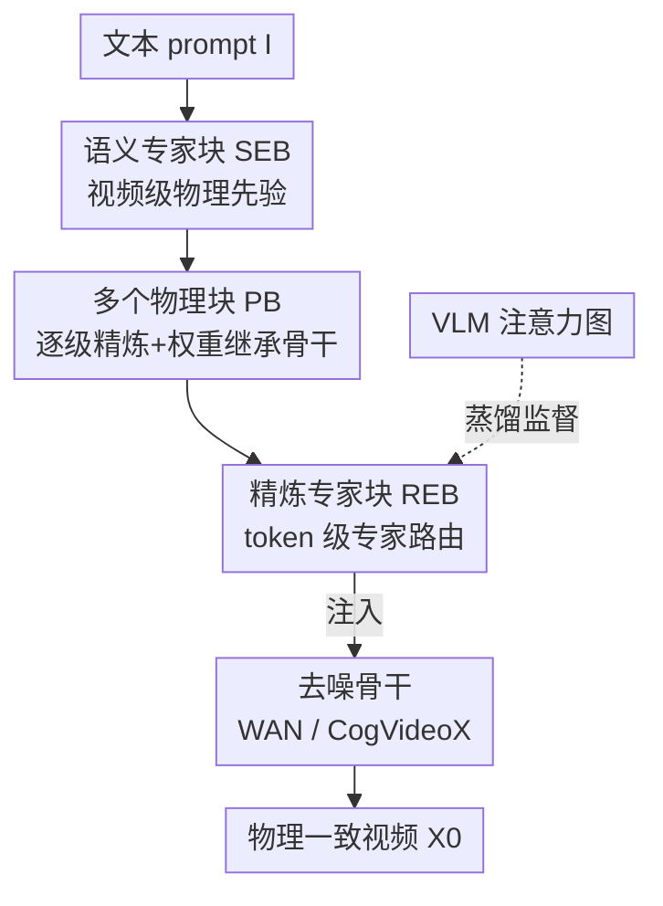

# ProPhy: Progressive Physical Alignment for Dynamic World Simulation

**会议**: CVPR 2026  
**论文**: [CVF Open Access](https://openaccess.thecvf.com/content/CVPR2026/html/Wang_ProPhy_Progressive_Physical_Alignment_for_Dynamic_World_Simulation_CVPR_2026_paper.html)  
**代码**: 无（项目页 https://zijunwa.github.io/prophy/ ）  
**领域**: 视频生成 / 世界模型  
**关键词**: 物理感知视频生成, 世界模拟器, 混合物理专家, token 级对齐, VLM 蒸馏

## 一句话总结
ProPhy 给视频扩散模型挂一条"物理分支"，用两阶段混合物理专家（视频级语义专家 + token 级精炼专家）把文本里的物理先验逐级注入到具体空间区域，并借 VLM 的注意力图蒸馏出细粒度对齐目标，让生成视频在燃烧、碰撞、流体等复杂动态场景下更符合物理规律。

## 研究背景与动机
**领域现状**：视频生成（Sora、WAN、CogVideoX 等扩散/DiT 模型）已经能产出视觉上很逼真的视频，被寄望成为"世界模拟器"。要当世界模拟器，光画面好看不够，还得遵守物理规律。

**现有痛点**：当前模型在大尺度或复杂动态下经常违反物理常识——球穿模、动量不守恒、火上煮咖啡液面异常上涨。已有的物理增强方法各有短板：VideoREPA 靠从基础模型蒸馏隐式物理知识，PhysMaster/PISA 用强化学习和奖励建模，PhysHPO 用分层偏好对齐，但它们**都把物理先验在训练时内化掉，推理时没有显式的物理引导**，复杂场景一崩就崩；WISA 虽然显式从 prompt 里识别物理类别、用混合物理专家（MoPE）做条件，但它的引导是**全局/视频级**的，当多个物理现象共存或发生在局部区域时抓不住细粒度过程。

**核心矛盾**：物理引导要么是隐式（推理时失控），要么是显式但只能整段视频"各向同性"地响应；而真实场景里不同物理现象出现在**不同空间位置**，需要的是"哪块区域响应哪个物理线索"的各向异性、细粒度对齐。

**本文目标**：让生成同时满足两点——(a) 显式物理引导，使不同物理规律的表示更有判别性；(b) 细粒度物理对齐，让视频内不同空间区域各自准确响应局部物理线索。

**切入角度**：作者观察到一个关键现象——**VLM 对物理动态的空间定位能力远强于生成模型本身**（图 4：在 Qwen2.5-VL 上用注意力能准确圈出"燃烧"发生的位置，而扩散模型的 cross-attention 图模糊）。那就把 VLM 的细粒度物理定位"蒸"进生成过程。

**核心 idea**：用"两阶段渐进式物理对齐"代替单层全局物理先验——先在视频级抽语义物理先验，再逐级精炼成 token 级先验注入对应空间区域，并用 VLM 注意力图监督这个 token 级路由。

## 方法详解

### 整体框架
ProPhy 建在标准潜空间视频扩散骨干（WAN2.1、CogVideoX）之上，输入是文本 prompt $I$，输出是去噪后的视频 $X_0$。它不改骨干，而是额外挂一条 **物理分支（Physical Branch）**，由三部分组成：一个**语义专家块（SEB）**、若干**物理块（Physical Block, PB）**、以及接在最后一个 PB 上的**精炼专家块（REB）**。整条链路在推理时端到端跑：SEB 根据 prompt 里隐含的物理线索激活相关语义专家，产出**视频级**物理先验；这个先验被多个 PB 逐级精炼，最后由 REB 处理成**token 级**细粒度先验，再注入回骨干的视频表示，让不同空间区域对物理现象产生各向异性的响应。每个 PB 与对应 transformer block 同构、并用其权重初始化，从而保留预训练骨干的语义理解和渲染能力；PB 的输出按序注入潜变量，让物理信息"渐进式"累积。

### 关键设计

**1. 语义专家块 SEB：视频级物理先验 + 连续加权防专家坍塌**

针对"显式物理引导"的诉求，SEB 在视频级工作。它维护 $E_s$ 个**可学习物理基底图** $B_e \in \mathbb{R}^{N\times C}$，每个代表一类物理知识（燃烧、反射……），形状与骨干视觉潜变量 $X_t$ 完全一致（$N$ 是潜 token 数 $=(F/r_f)\times(H/r_s)\times(W/r_s)$）。一个**语义路由器**从文本 embedding $y$ 读出每个基底的归一化权重 $\rho_p$，把物理先验叠加进潜变量：

$$\tilde{X} = X + \sum_{e=1}^{E_s} \rho_e^p B_e.$$

关键的工程点是：训练 batch 小，标准 top-k MoE 容易**模式坍塌**——只有少数专家被反复激活。作者不用硬 top-k，而是用上面这种**连续加权**形式（所有专家都按软权重贡献），从根上避开坍塌。产出的 $\tilde{X}$ 作为后续精炼的全局物理先验。

**2. 精炼专家块 REB：把全局先验细化到 token 级**

针对"细粒度对齐"的诉求，REB 在 **token 级**工作。它同样有一组专家（每个就是一个线性层）加一个**精炼路由器**：对 physics-enhanced 潜变量里的每个 token $\tilde{x}\in\mathbb{R}^C$，路由器输出该 token 关联各物理规律的概率分布 $\rho_r\in\mathbb{R}^{E_r}$，选 top-k 专家加权：

$$\tilde{x}' = \sum_{i\in \arg\text{top}k\,\rho_r} \rho_r^i\, e_\theta^i(\tilde{x}),$$

其中 $e_\theta^i$ 是第 $i$ 个专家的前向。和 SEB 不同，这里 token 数量极大、又有下面的细粒度对齐约束，坍塌风险已经很低，所以**可以安全地用标准 top-k MoE**。SEB 给"整段视频该有哪些物理"，REB 给"具体哪个 token 该响应哪个物理"，两级合起来就是"渐进式物理路由"。

**3. 双路物理对齐目标：语义相对对齐 + VLM 细粒度蒸馏**

光有专家结构不够，得给两个路由器各自的监督信号，让专家真正学到分工。作者设计了两个对齐目标加一个负载均衡：

- **语义对齐（对 SEB）**：用 WISA-80K 的每视频物理类别向量 $q_s$ 当标签。不直接回归绝对类别，而是在 batch 内构造**余弦相似度成对矩阵** $P_s^{i,j}=\frac{\rho_s^{(i)}\cdot\rho_s^{(j)}}{\|\rho_s^{(i)}\|\|\rho_s^{(j)}\|}$，同样算标签矩阵 $Q_s$，对齐两者：$\mathcal{L}_{\text{coarse}}=\sum_{i<j}\|P_s^{i,j}-Q_s^{i,j}\|^2$。这种"相对"形式让同类样本路由权重相近、异类发散，比直接 BCE 绝对监督更有效（消融里 BCE 会拉高 SA 但掉 PC/Joint）。

- **细粒度对齐（对 REB）**：这是借 VLM 之力的核心。流程（图 3）是：把视频和一个"描述某物理现象"的问题喂给 VLM，从生成文本里取相关视频 token 当 key、文本 token 当 query，**取它们之间的注意力分数**作为该现象的初步定位；再用一句通用 prompt 拿到一张背景注意力图，**相减**得到去噪后的 token 级对齐目标 $Q_r\in\mathbb{R}^{N\times E_{\text{attn}}}$。再构造掩码 $M$：只标注视频里可能出现的物理类别（置 1），并用 $M = M \wedge \text{sign}(Q_r)$ 丢掉 $Q_r$ 为负（现象不显著）的区域。对齐损失只在高显著区域生效：$\mathcal{L}_{\text{fine-align}}=\sum_{M^{i,e}=1}\|P_r'^{i,e}-Q_r^{i,e}\|^2$，其中 $P_r'$ 是精炼路由器输出经一个 MLP（把维度从 $E_r$ 扩到 $E_{\text{attn}}$）后的结果——这个 MLP 不只是对齐维度，还能缓解"对齐信号直接施加"带来的训练冲突。

### 损失函数 / 训练策略
最终目标把三项物理损失与标准扩散损失相加：

$$\mathcal{L}=\mathcal{L}_{\text{diffusion}}+\lambda_1\mathcal{L}_{\text{coarse}}+\lambda_2\mathcal{L}_{\text{fine-align}}+\lambda_3\mathcal{L}_{\text{fine-balance}},$$

其中 $\mathcal{L}_{\text{fine-balance}}$ 是 REB 路由器上的标准负载均衡辅助损失，鼓励专家专精。固定系数 $\lambda_1=0.1,\lambda_2=0.02,\lambda_3=0.01$，在 WAN2.1-1.3B 和 CogVideoX-5B 两个骨干上无需额外调参。训练数据从 WISA-80K 随机采 20K 视频，用 Qwen2.5-VL-32B 产出 token 级物理标注。

## 实验关键数据

### 主实验
在 VideoPhy2 基准上评测，指标为物理常识（PC）、语义符合度（SA）及二者联合通过率（Joint，主指标，PC/SA 评分 ≥4 才算通过）。ALL 为全部 600 prompt，HARD 为 180 个更难子集。

| 方法 | ALL-PC | ALL-SA | ALL-Joint | HARD-Joint |
|------|--------|--------|-----------|------------|
| Wan2.1-1.3B | 57.8 | 30.0 | 24.8 | 5.6 |
| Wan2.1-1.3B + ProPhy | 65.0 | 32.0 | **26.5** | **7.2** |
| CogVideoX-5B | 67.2 | 29.0 | 22.3 | 5.0 |
| CogVideoX-5B + WISA | 69.1 | 31.5 | 25.8 | 5.0 |
| CogVideoX-5B + VideoREPA | 72.5 | 24.2 | 22.0 | 5.6 |
| CogVideoX-5B + ProPhy | **72.5** | **32.2** | **26.7** | 6.1 |

在 Wan2.1 这种 flow-matching 骨干上，Joint 指标相对提升 +19.7%；在 CogVideoX 上 ProPhy 取得各指标的最优或次优。值得注意的是 VideoREPA 在 PC 上很高（72.5）但 SA 只有 24.2——它牺牲了语义符合度，而 ProPhy 两者兼顾。

VBench 质量评测（同 600 prompt）上 ProPhy 没有牺牲画质，最突出的是 **Dynamic Degree** 维度大幅提升（CogVideoX-5B 从 46.8 → 72.0，Wan2.1 从 71.3 → 78.8），说明物理对齐反而增强了模型捕捉高动态行为的能力；综合 Quality Score 也更高（CogVideoX 76.8 → 81.0）。

### 消融实验
以 Wan2.1-1.3B 为基线，逐组件验证（VideoPhy2）。

| 配置 | PC | SA | Joint | 说明 |
|------|----|----|-------|------|
| Baseline | 57.8 | 30.0 | 24.8 | 原始骨干 |
| LoRA（无物理分支） | 58.2 | 30.8 | 24.8 | 同步数纯 LoRA，几乎无增益 |
| LoRA + REB | 62.7 | 31.2 | 25.5 | 仅 token 级专家 |
| LoRA + SEB | 62.2 | 30.8 | 25.2 | 仅视频级专家 |
| PB + SEB + REB（Full） | **65.0** | 32.0 | **26.5** | 完整 ProPhy |

| 配置 | PC | SA | Joint | 说明 |
|------|----|----|-------|------|
| Baseline | 57.8 | 30.0 | 24.8 | — |
| SEB 用 BCE 替代相对损失 | 64.3 | **32.0** | 26.3 | SA 升但 PC/Joint 弱于相对损失 |
| REB 只用绝对 align 损失 | 58.3 | 26.5 | 21.6 | 明显退化，反而低于 baseline |

### 关键发现
- **物理分支 > 纯 LoRA**：同样训练步数下，纯 LoRA 微调骨干几乎不涨（Joint 24.8→24.8），说明增益来自物理分支结构而非单纯多训。
- **SEB 与 REB 互补**：视频级和 token 级专家单独都有用，合起来最好——印证"渐进式（先全局后局部）"的设计动机。
- **相对对齐优于绝对对齐**：SEB 里把相对距离损失换成 BCE 绝对监督会掉 PC/Joint；REB 里只用绝对 align 损失甚至跌破 baseline（21.6），说明细粒度对齐必须配合掩码和负载均衡才稳。
- **专家确实学到分工**：SEB 路由 logits 上，燃烧与爆炸等物理相关类别 Pearson 相关高、爆炸 vs 折射等无关类别相关低；REB 高激活区域可靠对应视频中物理事件发生位置。

## 亮点与洞察
- **"借 VLM 当物理定位老师"很巧**：作者没有去训一个物理标注器，而是直接利用 VLM 现成的、比生成模型更强的空间物理定位能力，用"现象注意力图 − 背景注意力图"提取干净的 token 级监督——把判别模型的强项蒸进生成模型，这个迁移思路可复用到任意"生成模型空间定位弱"的任务。
- **两级专家分工对应两级粒度**：SEB 解决"有哪些物理"、REB 解决"物理在哪里"，渐进式累积而非一步到位，是对 WISA"全局 MoPE"最直接的细粒度升级。
- **小 batch 防坍塌的务实处理**：SEB 用连续加权、REB 才用 top-k，是对"什么时候该硬路由、什么时候该软路由"的清醒判断，而不是无脑套 MoE。
- **Dynamic Degree 大涨是意外惊喜**：物理对齐本意是修正违规，却顺带让模型更敢生成高动态内容，说明很多"物理不一致"其实源于模型在动态场景下的保守/退化。

## 局限与展望
- **依赖 VLM 标注质量**：细粒度对齐目标完全来自 VLM 注意力图，作者也承认有"minor imperfections"；若 VLM 对某类物理（如流体、光学）定位本身不准，蒸馏信号会带噪。
- **物理类别受限于 WISA-80K 标注体系**：语义对齐用的是 WISA 的离散物理类别向量，超出标注类别的新物理现象难以覆盖。⚠️ 论文未讨论开放类别泛化。
- **绝对提升幅度仍有限**：Joint 主指标在 25~27 区间，HARD 子集更低（6~7），离"可靠世界模拟器"还远；物理一致性是被改善而非被解决。
- **PB 数量受显存约束**：物理块数量需按骨干深度和 GPU 显存适配，可扩展性受工程条件限制。

## 相关工作与启发
- **vs WISA**：都用混合物理专家（MoPE），但 WISA 是视频级/全局的单层引导，多现象共存时抓不住局部；ProPhy 升级为两阶段（视频级 SEB + token 级 REB）渐进精炼，实现空间各向异性响应。
- **vs VideoREPA**：VideoREPA 靠帧间视觉特征关系蒸馏隐式物理、推理无显式引导，且会牺牲语义符合度（SA 仅 24.2）；ProPhy 显式注入物理先验，PC/SA 兼顾。
- **vs PhysGen / PhysMotion（仿真类）**：仿真方法先用刚体动力学/物质点法预测动态再渲染，需预定义物理参数和规则，泛化受限；ProPhy 直接从文本自适应抽取物理先验，无需显式物理规则，适用更开放场景。
- **vs PhysMaster / PISA / PhysHPO（对齐/RL 类）**：它们靠 RL、奖励建模或分层偏好对齐在训练时内化物理，推理时缺显式引导；ProPhy 的物理分支在推理时端到端提供显式、空间定位的引导。

## 评分
- 新颖性: ⭐⭐⭐⭐ 两阶段渐进物理路由 + VLM 注意力蒸馏当细粒度监督，是对 MoPE 路线清晰且有洞察的细粒度升级
- 实验充分度: ⭐⭐⭐⭐ 双骨干验证、主结果 + 多组消融 + 专家可解释性分析，但绝对提升有限、缺更大规模骨干
- 写作质量: ⭐⭐⭐⭐ 动机—挑战—方法对应清晰，图 1/3/4 把"全局 vs 细粒度""VLM 定位优势"讲得直观
- 价值: ⭐⭐⭐⭐ 物理感知视频生成的实用方案，"借判别模型蒸空间监督"思路可迁移

<!-- RELATED:START -->

## 相关论文

- [\[CVPR 2026\] Physical Object Understanding with a Physically Controllable World Model](physical_object_understanding_with_a_physically_controllable_world_model.md)
- [\[CVPR 2026\] Inference-time Physics Alignment of Video Generative Models with Latent World Models](inference-time_physics_alignment_of_video_generative_models_with_latent_world_mo.md)
- [\[CVPR 2026\] VerseCrafter: Dynamic Realistic Video World Model with 4D Geometric Control](versecrafter_dynamic_realistic_video_world_model_with_4d_geometric_control.md)
- [\[CVPR 2026\] Physical Simulator In-the-Loop Video Generation](physical_simulator_in-the-loop_video_generation.md)
- [\[CVPR 2026\] HVG-3D: Bridging Real and Simulation Domains for 3D-Conditional Hand-Object Interaction Video Synthesis](hvg-3d_bridging_real_and_simulation_domains_for_3d-conditional_hand-object_inter.md)

<!-- RELATED:END -->
