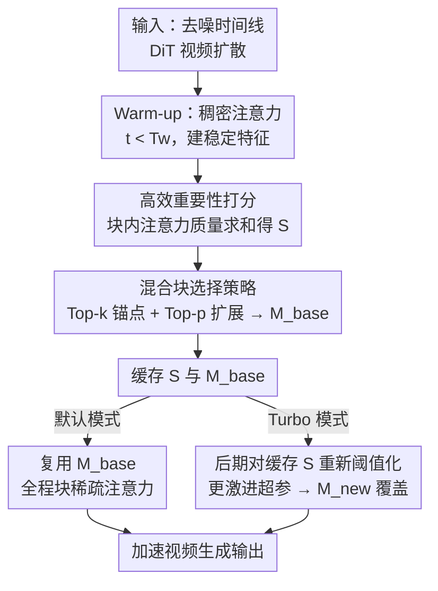

# RAPID: Reusing Attention Sparsity with Inter-step Adaptation for Efficient Video Diffusion

**会议**: CVPR 2026  
**论文**: [CVF Open Access](https://openaccess.thecvf.com/content/CVPR2026/html/Lin_RAPID_Reusing_Attention_Sparsity_with_Inter-step_Adaptation_for_Efficient_Video_CVPR_2026_paper.html)  
**代码**: 无  
**领域**: 视频生成 / 扩散模型加速  
**关键词**: 稀疏注意力, 视频扩散, 推理加速, 一次性估计, 掩码复用

## 一句话总结
RAPID 观察到视频扩散里注意力稀疏模式有"时间稳定性"和"密度逐步衰减"两个规律，于是把每步都重算稀疏掩码的开销砍掉——只在去噪早期做一次高保真重要性打分、缓存掩码与分数后全程复用，并用缓存分数在后期重新阈值化做更激进剪枝，在 Wan2.1-14B 上同等密度下 PSNR 反超最强 baseline 达 +3.2，Turbo 模式把加速推到 1.79×（HunyuanVideo 2.01×）。

## 研究背景与动机

**领域现状**：视频扩散 Transformer（DiT，如 Wan2.1、HunyuanVideo、CogVideoX）靠 3D 自注意力建模时空 token，但注意力复杂度随序列长度 $O(N^2)$ 增长，几百帧的时空 token 序列让注意力成为推理瓶颈。主流提速手段是稀疏注意力——只为一部分 token 对计算分数，用二值掩码 $M$ 屏蔽其余。

**现有痛点**：现有稀疏注意力分两派，各有硬伤。**静态派**（Sparse VideoGen / SVG、Radial Attention）用预定义固定稀疏模式，计算省但与内容无关，可能漏掉视频合成里关键的动态交互。**动态派**（X-Attention、Draft Attention）在每个去噪步、每个注意力头都现场重算掩码，能自适应内容，但代价是贯穿整个推理过程的"每步重算"开销。

**核心矛盾**：动态派建立在一个未被质疑的假设上——注意力模式是"易变的"，必须每步每头重新评估。但若这个假设不成立，每步重算就是纯粹的冗余。作者用两个实证观察推翻它：① **时间稳定性**：去噪经过 warm-up 后，高重要性的注意力模式几乎不再变化；② **密度逐步衰减**：保持 95% 注意力分数召回所需的计算密度，随去噪推进单调下降，后期可以更激进地剪枝。这意味着固定稀疏率的持续重算既冗余、又没吃到后期能加速的红利。

**本文目标**：去掉"每步重算掩码"的固有开销，同时仍保留内容自适应；进一步利用后期密度衰减，把加速推到极限。

**核心 idea**：把重要性打分从逐步推理循环里**解耦**出来——只在早期一个关键步做一次打分、缓存掩码和分数全程复用（默认模式）；想更快就直接对缓存分数重新阈值化生成更稀疏掩码（Turbo 模式），无需任何重算。

## 方法详解

### 整体框架

RAPID 是一个稀疏注意力框架，把"算一次、复用全程"做实。它沿去噪时间线分三个阶段：① **Warm-up 阶段**（$t<T_w$）用稠密注意力，让模型先建立稳定的特征表示，不引入任何稀疏；② **一次性打分与缓存阶段**（$t=T_w$）在这一个步的稠密注意力计算中顺带算出块级重要性分数 $S$，据此生成高保真基础掩码 $M_{base}$，把 $S$ 和 $M_{base}$ 一起存进持久缓存；③ **缓存复用阶段**（$t>T_w$）完全跳过昂贵的重要性打分，只从缓存取掩码喂给块稀疏注意力核。复用阶段有两挡：默认模式始终复用 $M_{base}$；Turbo 模式在更晚的某步 $t_a$ 用缓存分数 $S$ 以更激进的超参重新阈值化出更稀疏的 $M_{new}$ 覆盖原掩码，吃满后期密度衰减的红利。

### 关键设计

**1. 一次性高效重要性打分：用注意力质量当重要性代理，只算一次**

每步重算掩码贵，根源是每步都要重新估计 token 对的重要性。RAPID 直接把注意力权重本身——即 $\mathrm{softmax}(QK^\top/\sqrt{d})$ 的输出——当作重要性的直接代理，且只在 $t=T_w$ 这一个稠密步里顺带算出来。具体做法（Algorithm 1）：把注意力图 $A\in\mathbb{R}^{N\times N}$ 切成 $B_s\times B_s$ 的块（块粒度是为了对齐高效稀疏注意力核的内存访问），对每个块 $A_{ij}$（query 块 $i$ 到 key 块 $j$）定义其重要性分数为块内所有注意力权重之和 $S_{ij}=\sum_{u,v}(A_{ij})_{uv}$，直接量化了 query 块 $i$ 分配给 key 块 $j$ 的总注意力质量。因为这步本来就要做稠密注意力，打分几乎是免费搭车；而它能成立的底气来自第 3 节实证——掩码召回（Mask Recall）在后续所有步都保持很高，说明早期一次算出的掩码已涵盖未来绝大多数重要块，复用是安全的。

**2. 混合块选择策略：Top-k 锚点保底 + Top-p 扩展自适应**

光有分数还要把它变成二值掩码 $M$，纯 Top-p（按累计质量截断）或纯 Top-k（固定选前 k 个）各有缺陷：纯 Top-p 不稳定——少数离群块会过早耗尽该 query 的选择预算；纯 Top-k 又死板、不随内容复杂度自适应。RAPID 对每个 query 块（每行）用两条腿走路（Algorithm 2）：先取分数最高的 $k_{min}$ 个 key 块作为 **Top-k 锚点**，保证每段序列都有底线连通性；再按分数降序继续加块，直到累计注意力质量超过该行总分数的比例 $\tau$（**Top-p 扩展**），即满足 $s_{cum}/s_{total}\ge\tau$ 时停止。Top-k 给鲁棒下限、Top-p 给内容自适应——注意力越分散的 query 块自动分到越多连接。两个超参 $k_{min}$ 和 $\tau$ 直接控制质量-效率权衡，消融里这套混合策略在各密度下都稳定优于单独的 Top-p / Top-k。

**3. RAPID-Turbo 的多阶段自适应剪枝：对缓存分数重新阈值化，零重算地加激进**

密度衰减规律说明后期对稀疏更宽容，但默认模式全程用同一个 $M_{base}$ 没吃到这块红利。Turbo 模式的巧处在于：缓存里不光存了掩码、还存了原始块级分数 $S$，所以后期想换更稀疏的掩码不需要任何重新打分，只要拿 $S$ 用更激进的超参 $(k'_{min},\tau')$ 重新阈值化即可。它走两阶段时间表：在敏感的早中期（如 10%-25% 窗口）用保守掩码（$\tau=0.9$）保真，到预设的更晚步 $t_a$（如总步数 25% 处）切换到激进掩码（$\tau=0.5$）覆盖缓存掩码、跑完剩余推理。这个切换极快，因为只是对预计算分数重新做阈值，把"后期能更稀疏"这个免费午餐真正吃进了加速里。

### 损失函数 / 训练策略
RAPID 是**完全免训练**的推理期框架，不改模型权重、不需微调，直接套在现成 DiT 视频扩散模型上即可。可调超参只有 warm-up 比例 $T_w$、块内保底 $k_{min}$、累计阈值 $\tau$，以及 Turbo 模式的切换步 $t_a$ 与激进超参。主实验配置：默认模式 $T_w=25\%$、$k_{min}=10\%$、$\tau=0.6$（刻意对齐 SOTA baseline 的密度）；Turbo 模式 $T_w=10\%$、10%-25% 窗口 $\tau=0.9$、之后 $\tau=0.5$。

## 实验关键数据

评测在两个开源文生视频 DiT 上做：HunyuanVideo（768p、129 帧）与 Wan2.1-14B（768p、81 帧），baseline 为 Flash Attention 稠密模型，对比 X-Attention（动态）、SVG 与 Radial Attention（静态）。质量用 PSNR/SSIM/LPIPS 对齐稠密输出衡量，速度用 A100 单卡端到端延迟的加速比，benchmark 为 VBench-2.0。

### 主实验（VBench-2.0，默认视频长度）

| 模型 | 方法 | PSNR↑ | SSIM↑ | LPIPS↓ | 密度 | 加速 |
|------|------|-------|-------|--------|------|------|
| Wan2.1-14B | X-Attn | 21.37 | 0.767 | 0.226 | 42.78% | 1.34× |
| Wan2.1-14B | SVG | 21.80 | 0.786 | 0.199 | 42.24% | 1.40× |
| Wan2.1-14B | Radial Attn | 22.92 | 0.795 | 0.197 | 42.32% | 1.56× |
| Wan2.1-14B | **Ours** | **26.11** | **0.871** | **0.096** | 41.88% | 1.53× |
| Wan2.1-14B | Ours-Turbo | 22.61 | 0.785 | 0.189 | 27.20% | **1.79×** |
| HunyuanVideo | Radial Attn | 27.50 | 0.896 | 0.086 | 44.06% | 1.79× |
| HunyuanVideo | **Ours** | **31.49** | **0.948** | **0.073** | 43.24% | 1.73× |
| HunyuanVideo | Ours-Turbo | 26.79 | 0.902 | 0.095 | 31.48% | **2.01×** |

要点：在**同等注意力密度**下（~42-44%），默认模式 PSNR/SSIM/LPIPS 三项全面反超所有 baseline——Wan2.1-14B 上 PSNR 26.11 比最强的 Radial Attn 22.92 高 3.2 点（摘要称对最强 baseline 最高 +4.0），同时拿到 1.53×/1.73× 加速。Turbo 模式把密度压到 27-31%、加速冲到 1.79×/2.01×，质量仍与 SVG/Radial 这类强 baseline 持平。

### 消融：块选择机制（Wan2.1-14B）

| 密度 | 方法 | PSNR↑ | SSIM↑ | LPIPS↓ |
|------|------|-------|-------|--------|
| 39.2% | Top-p | 18.92 | 0.632 | 0.354 |
| 39.2% | Top-K | 25.49 | 0.859 | 0.113 |
| 39.2% | Top-K + Top-p | **25.90** | **0.864** | **0.105** |
| 46.8% | Top-p | 21.62 | 0.683 | 0.329 |
| 46.8% | Top-K | 26.62 | 0.875 | 0.095 |
| 46.8% | Top-K + Top-p | **26.98** | **0.883** | **0.087** |
| 54.4% | Top-p | 22.58 | 0.724 | 0.263 |
| 54.4% | Top-K | 27.38 | 0.888 | 0.080 |
| 54.4% | Top-K + Top-p | **28.18** | **0.903** | **0.069** |

混合策略在三档密度下都优于单独方法：纯 Top-p 因离群块过早耗尽预算而极不稳定（PSNR 普遍掉到 18-22），纯 Top-K 稳但不自适应，混合版把两者优点叠起来稳定领先。

### 关键发现
- **掩码召回是"一次性复用"安全的根据**：从早期 step 5 算出的掩码对后续步的 Mask Recall 始终很高，说明早期掩码已涵盖未来绝大多数重要块；精度（Precision）虽随模型注意力聚焦而自然下降，但仍维持高位，说明早期计算高度相关、不浪费。
- **warm-up 时长存在拐点**：把稠密 warm-up 从 5% 拉到 40%，质量提升边际递减，25% 是性价比拐点（25%→40% 的增益远小于 10%→25%）；在敏感的 10%-25% 窗口用较高密度稀疏掩码，能在保真前提下多拿加速。
- **阈值 $\tau$ 的可调权衡**：$\tau$ 从 0.5 升到 0.9，密度与质量一起升但高密度区边际增益变小；主实验选 $\tau=0.6$ 是为了把密度对齐到 SOTA baseline 的配置以便公平比较。

## 亮点与洞察
- **"挑战每步重算的必要性"这一问法本身最值钱**：动态稀疏派默认注意力模式易变，RAPID 用两条实证曲线（时间稳定 + 密度衰减）证明这个假设在视频扩散里不成立，从而把整类方法的固有开销直接删掉——这是观察驱动设计的范本。
- **双缓存（掩码 + 原始分数）是 Turbo 模式的关键**：只缓存掩码就只能复用，连分数一起缓存才能在后期"零重算"地重新阈值化、做多阶段渐进剪枝；这个小决定撑起了从 1.53× 到 2.01× 的加速跨度。
- **可与正交加速叠加**：方法只针对注意力模块，作者指出可与减步数（蒸馏/快速 solver）、量化、特征缓存等手段叠用获得累计收益，工程上很好嫁接。

## 局限与展望
- 两个核心规律（时间稳定、密度衰减）是在 Wan2.1-14B 与 HunyuanVideo 上观察到的，是否对其他架构/分辨率/更长视频普适，论文未充分验证 ⚠️。
- warm-up 步、切换步 $t_a$、$k_{min}$、$\tau$ 等仍是**手工/经验设定**（沿用 SVG/X-Attention 的 25%、10% 等社区惯例），未做自动调度；作者展望未来可学习/调度随去噪步动态衰减的稀疏阈值。
- 质量以"对齐稠密输出"的 PSNR/SSIM/LPIPS 衡量，反映的是与稠密结果的一致性，不直接等同于人类感知的视频质量或时序连贯性。

## 相关工作与启发
- **vs 静态稀疏（SVG / Radial Attention）**：它们用固定预定义模式、与内容无关，省算但漏动态交互；RAPID 的掩码来自真实注意力质量、内容自适应，同密度下质量明显更高。
- **vs 动态稀疏（X-Attention / Draft Attention）**：它们每步每头重算掩码、自适应但带持续开销；RAPID 只算一次后全程复用，把这份开销删掉，同时靠掩码召回保证复用安全。
- **vs 扩散加速其他路线（减步数 / 量化 / 特征缓存）**：那些路线针对采样步数或精度，RAPID 针对注意力瓶颈，两者正交可叠加。

## 评分
- 新颖性: ⭐⭐⭐⭐⭐ 用两条实证规律推翻"每步重算"假设，把动态稀疏的开销结构性删掉，问法和方案都新。
- 实验充分度: ⭐⭐⭐⭐ 两大模型 + 三类 baseline + 块选择/warm-up/阈值多组消融，但仅 A100 单卡、未验证更多架构与更长视频。
- 写作质量: ⭐⭐⭐⭐⭐ 动机—观察—设计—验证链条清晰，算法伪代码与图表自洽，易读。
- 价值: ⭐⭐⭐⭐⭐ 免训练即插即用、可叠加其他加速，对落地视频扩散推理实用性强。

<!-- RELATED:START -->

## 相关论文

- [\[CVPR 2026\] FrameDiT: Diffusion Transformer with Matrix Attention for Efficient Video Generation](framedit_diffusion_transformer_with_matrix_attention_for_efficient_video_generat.md)
- [\[CVPR 2026\] VMonarch: Efficient Video Diffusion Transformers with Structured Attention](vmonarch_efficient_video_diffusion_transformers_with_structured_attention.md)
- [\[ICML 2026\] Attention Sparsity is Input-Stable: Training-Free Sparse Attention for Video Generation via Offline Sparsity Profiling and Online QK Co-Clustering](../../ICML2026/video_generation/attention_sparsity_is_input-stable_training-free_sparse_attention_for_video_gene.md)
- [\[CVPR 2026\] Less is More: Data-Efficient Adaptation for Controllable Text-to-Video Generation](less_is_more_data-efficient_adaptation_for_controllable_text-to-video_generation.md)
- [\[CVPR 2026\] Attention Surgery: An Efficient Recipe to Linearize Your Video Diffusion Transformer](attention_surgery_an_efficient_recipe_to_linearize_your_video_diffusion_transfor.md)

<!-- RELATED:END -->
