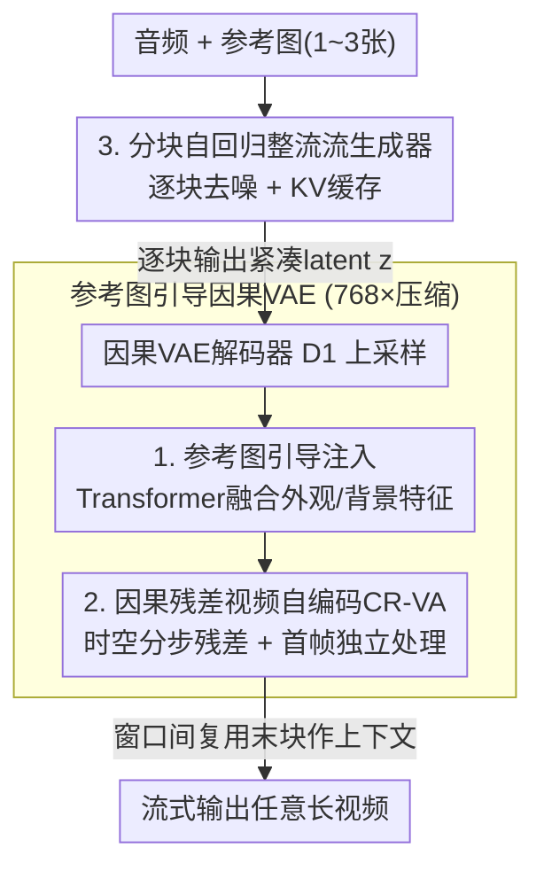

# Real-Time Generation of Streamable Talking Portrait Video with Reference-Guided Deep Compression VAEs

**会议**: CVPR 2026  
**arXiv**: [2606.01620](https://arxiv.org/abs/2606.01620)  
**代码**: 无  
**领域**: 视频生成  
**关键词**: 说话人像视频, 流式生成, 深度压缩VAE, 自回归整流流, 实时生成

## 一句话总结
微软团队提出一个**实时、可流式**的音频驱动说话人像视频生成框架：用「参考图引导 + 因果残差」的深度压缩 VAE 把视频压到 768× 的紧凑 latent，再用分块自回归的整流流 Transformer 逐块生成 latent，做到 42 FPS（比现有扩散方法快 25× 以上），同时画质与大模型持平甚至更好。

## 研究背景与动机
**领域现状**：音频驱动说话人像生成长期由两条路线主导。一条是传统的「头部/面部专用」方法，把运动从外观里解耦成稀疏关键点、3DMM 参数或学习到的 latent，生成可控但难以建模头部之外的躯干、头发等非刚体动态；另一条是近期基于大型视频扩散基础模型（Stable Video Diffusion、CogVideoX、Wan2.1 等）的方法，能生成头部之外大范围、富有真实感的动态，画质极高。

**现有痛点**：大扩散模型计算成本太高——在现代 GPU 上生成 5 秒视频要好几分钟，只能离线出片，根本无法支撑社交陪伴、互动教学、心理支持这类需要**实时、流式**交互的应用。已有的视频扩散加速（蒸馏、减步数）大多面向静态图像或离线视频，没有同时满足「低延迟 + 时序连贯 + 可任意长流式生成」。

**核心矛盾**：效率与质量难以兼得。要实时就得砍计算，但砍了计算往往掉画质、掉同步、掉躯干动态；而要覆盖头部之外的大躯干区域，又会进一步加重生成负担。

**本文目标**：同时达成三件难事——① 实时、可流式生成以支撑交互；② 高画质高生动度（精准唇音同步、生动表情体态、真实光影动态）；③ 覆盖头部之外的大躯干区域。

**切入角度**：作者观察到说话人像视频和通用视频生成有一个关键区别——**画面里有一个固定的主体**，用户提供的参考图与要生成的视频共享大量信息（外观、背景几乎不变）。既然外观是已知的，网络就不必费力去「重建外观」，而应把容量集中到「提取动态」上。

**核心 idea**：把参考图作为引导喂进 VAE 解码器，让 VAE 专注压缩动态信息从而做到极致压缩（768×）；再配上原生自回归的整流流生成器（天然支持 KV 缓存、逐块流式），无需蒸馏即可实时生成。

## 方法详解

### 整体框架
任务被形式化为条件概率建模 $\mathbf{y}\sim p(\mathbf{y}\mid\mathbf{r},\mathbf{a})$：给定参考图集合 $\mathbf{r}$（1~3 张）和任意语音音频 $\mathbf{a}$，生成人像视频 $\mathbf{y}$。沿用现代视频生成范式，整个过程拆成两个子任务：① 在音频条件下生成紧凑的 latent 表示 $\mathbf{z}$；② 把 $\mathbf{z}$ 解码回视频 $\mathbf{y}$。

对应地，框架由两个模型组成。**生成端**是一个分块自回归的整流流（Rectified Flow）Transformer $G$，以音频和参考 latent 为条件，**逐块**预测视频 latent——每生成一块就交给解码器，配合 KV 缓存实现低延迟流式输出。**解码端**是一个**因果**视频 VAE，它的因果性保证给定任意长度的 latent 都能平滑解码、不出现时序断裂；而它的两个核心改造（参考图引导注入、因果残差自编码 CR-VA）把压缩率推到 768×（约为主流视频生成 VAE 48× 的 10~15 倍），让生成端要处理的 token 序列大幅缩短，这是实时的关键前提。

VAE 采用两级对称结构：编码器 $E_1$（时空下采样）+ $E_2$（进一步空间压缩），解码器 $D_1$（空间上采样）+ $D_2$（时空联合上采样），全部用因果卷积 + RMSNorm 保持时序因果。下面这条「音频/参考 → 自回归生成 latent → 参考引导因果解码 → 流式视频」的主链路如下图：

### 关键设计

**1. 参考图引导注入：让 VAE 不必重建外观，把容量全给动态**

通用视频 VAE 要同时编码外观和运动，在高压缩率下外观细节首先崩坏。作者的洞察是：说话人像里主体外观/背景几乎静止，且**用户已经给了参考图**，外观信息是冗余的。于是他们在解码器 $D_1$ 和 $D_2$ 之间插入一个基于 Transformer 的融合网络 $D_{\text{ref}}$。具体地，参考图 $\mathbf{r}$ 复用编码器 $E_1$ 逐帧处理，得到保留外观与背景线索的中层特征 $\mathbf{f}_c$；同时 $D_1$ 把 latent $\mathbf{z}$ 上采样成与 $\mathbf{f}_c$ 同空间尺寸的 $\mathbf{f}_z$。在 $D_{\text{ref}}$ 内，先对 $\mathbf{f}_z$ 做**逐帧自注意力**（frame-wise self-attention，保持时序因果不让未来帧泄漏），再用**交叉注意力**把 $\mathbf{f}_c$ 的细粒度外观信息注入进来，融合后送进 $D_2$ 完成重建。

这样网络就能「少管外观、多抓动态」，压缩效力和重建保真度同时提升。训练时随机采样不同数量的参考图，使模型在推理时能灵活接收用户给的 1~3 张参考图——参考图越多，提供的人像锚点越多，重建质量越高（消融里 PSNR 随参考数单调上升）。

**2. 因果残差视频自编码 CR-VA：把 DC-AE 的残差自编码搬进因果视频 VAE**

高压缩率下重建质量易崩，作者把图像领域 DC-AE 的残差自编码范式扩展到**因果视频** VAE。关键难点在于视频多了时间维，而因果性要求当前帧绝不能看到未来帧。CR-VA 在每次分辨率变化时把残差编码拆成**时间、空间两步走**：① 时间残差（若该层涉及时间分辨率变化）用 channel-to-time / time-to-channel 改变时间分辨率，并用通道平均/复制做维度匹配，**首帧被单独排除**以保住时序因果；② 空间残差再对所有帧做 channel-to-space / space-to-channel，同样用通道平均/复制对齐维度，在时间处理之后施加。主分支做相同的时空操作，但改用卷积层来匹配特征维度。

这条「残差捷径」给高压缩 VAE 提供了一条直传的恒等近似路径，把重建误差兜住。消融显示它和参考引导**协同放大**：在 HDTF 上从 $M{=}0$ 到 $M{=}3$，带 CR-VA 的 PSNR 增益达 6.696 dB，明显高于不带的 4.843 dB。

**3. 分块自回归整流流生成器：原生流式，无需蒸馏即可实时**

生成端用整流流框架（把生成建模成从噪声到数据分布的 ODE 传输场），由 24 层 Transformer 的网络 $G$ 自回归地逼近条件速度场。输入侧：参考图逐帧编码成参考 latent $\mathbf{z}_r$ 作视觉条件；音频用预训练编码器抽特征后经可训练时间嵌入器压 4× 对齐到视频 latent 的时序，再沿空间广播与噪声 latent $\mathbf{z}^t$ 沿通道拼接成 $\mathbf{a}'$，去噪时间步 $t$ 通过 AdaLN 注入。

为支持流式、降低延迟，$G$ 把 latent 序列切成大小为 $k$ 的不重叠块做**分块因果注意力**：块内全自注意力，块间只能注意到**之前**的块。这既保住自回归的时序因果，又显著省内存省算力。训练用 teacher-forcing：以上一段的真值 latent 作干净时序上下文，并注入高斯噪声防漂移、缩小训练-推理差距，损失为条件 flow-matching（见下）。推理时模型逐块预测、流式送解码器，窗口内 KV 缓存复用历史，跨窗口把上一窗口的末块作为下一窗口的上下文，实现窗口接窗口的无缝长视频生成。正因为是**原生自回归**而非事后蒸馏，它能在 512×512 上真正做到实时。

### 损失函数 / 训练策略
**VAE 重建目标**（L1 + 感知 + KL 正则）：
$$\mathbb{E}_{\hat{\mathbf{y}}}\left[\lambda_1\|\hat{\mathbf{y}}-\mathbf{y}\|_1+\lambda_2\,\text{LPIPS}(\hat{\mathbf{y}},\mathbf{y})\right]$$
并在 latent $\mathbf{z}$ 上加 KL 正则以获得结构良好的 latent 空间。VAE 先在 256² 上用 5 帧短片训练，逐步增加片长以抑制时序漂移、增强时序一致性，再在 512² 上微调。空间下采样 64×、时间下采样 4×、latent 通道 64，合计压缩率 768。

**生成器目标**（条件 flow-matching）：
$$\mathbb{E}_{t,\mathbf{z}^0,\boldsymbol{\epsilon},\mathbf{z}_r,\mathbf{a}'}\,\|G(\mathbf{z}^t,\mathbf{z}_r,\mathbf{a}',t)-(\boldsymbol{\epsilon}^t-\mathbf{z}^0)\|_2^2$$
其中 $\mathbf{z}^0$ 是干净视频 latent。训练时随机把 $\mathbf{z}_r$、$\mathbf{a}'$ 替换成可学习的 null 嵌入以支持推理期的 CFG；并随机 mask $\mathbf{z}_r$ 以支持灵活参考图数量；首帧时序未压缩、与其余帧不同，若采样片段含首帧则加一个可学习 mask。一个生成窗口含 32 个 latent 帧（对应 128 视频帧，首窗 125 帧），块大小 $k{=}4$，推理 12 步去噪、timestep shift 5、CFG scale 2。训练数据为过滤后的 VoxCeleb2（50 小时）+ 自有 280 小时人像视频，约 1 万个身份。

## 实验关键数据

评测指标说明：$S_C$ 为 SyncNet 唇音同步置信度（↑），$S_D$ 为 SyncNet 特征距离（↓），$\text{CAPP}$ 衡量头部姿态与音频的对齐（↑），$\text{FVD}_{25}$ 为基于 25 连续帧的 Fréchet 视频距离（↓），FPS 在单张 H100 上测（取 KV 缓存最长的窗口报速度下界）。$M$ 为参考图数量。

### 主实验
在 HDTF（66 个未见身份）与自建 PortraitOneMin（16 个未见身份的 1 分钟讲课片段）上，512×512 分辨率：

| 方法 | HDTF $S_C$↑ | HDTF $S_D$↓ | HDTF CAPP↑ | HDTF FVD↓ | PortraitOneMin FVD↓ | FPS↑ |
|------|------|------|------|------|------|------|
| EchoMIMIC | 5.291 | 9.557 | 0.341 | 143.6 | 177.1 | 1.4 |
| EchoMIMIC-Distilled | 5.513 | 9.350 | 0.348 | 174.1 | 201.9 | 13.3 |
| Hallo3 (CogVideoX) | 7.256 | 8.596 | 0.337 | 76.4 | 175.3 | 0.27 |
| Sonic (SVD) | 8.799 | 6.602 | 0.689 | 43.92 | 95.05 | 1.7 |
| FantasyTalking (Wan2.1) | 4.167 | 11.144 | 0.407 | 89.7 | — | 0.36 |
| **本文 M=1** | **8.943** | **6.286** | **0.699** | 62.30 | 91.96 | **42.3** |
| **本文 M=2** | 9.056 | 6.175 | 0.739 | 49.40 | 81.52 | 42.3 |
| **本文 M=3** | 8.998 | 6.226 | 0.739 | **43.27** | **73.69** | 42.3 |

单参考下，本文唇音同步（$S_C$/$S_D$）与头-音对齐（CAPP）即全面最优，FVD 与大基础模型持平或更好；随参考图增加 FVD 进一步显著下降（HDTF 62.3→43.27）。最关键的是 **42.3 FPS**，比最快的扩散基线（EchoMIMIC-Distilled 13.3）快 3 倍多，比 Sonic/Hallo 等快 25× 以上，且这些基线**都无法实时在线生成**。

### 消融实验
参考引导 + CR-VA 对 VAE 重建质量的影响（VoxCeleb2 / HDTF，PSNR↑）：

| 配置 | VoxCeleb2 PSNR | ΔPSNR | HDTF PSNR | ΔPSNR |
|------|------|------|------|------|
| w/o CR-VA, M=0（无参考） | 29.071 | – | 28.306 | – |
| w/o CR-VA, M=1 | 31.676 | +2.605 | 32.068 | +3.762 |
| w/o CR-VA, M=3 | 32.766 | +3.695 | 33.149 | +4.843 |
| **w. CR-VA, M=0（无参考）** | 29.604 | – | 28.678 | – |
| **w. CR-VA, M=1** | 32.354 | +2.750 | 33.469 | +4.791 |
| **w. CR-VA (Ours), M=3** | **33.979** | **+4.375** | **35.374** | **+6.696** |

### 关键发现
- **参考引导贡献最大**：仅加 1 张参考图，PSNR 在 VoxCeleb2 上从 29.071→31.676（+2.605 dB）、HDTF 上从 28.306→32.068（+3.762 dB），印证「外观已知、专注动态」的思路确实大幅提升高压缩下的重建保真。
- **CR-VA 与参考引导协同放大**：无参考时 CR-VA 只带来轻微提升；但参考图越多，CR-VA 越能放大收益——HDTF 上 $M{=}0\to M{=}3$ 的增益从 4.843 dB（无 CR-VA）拉到 6.696 dB（有 CR-VA）。两者是乘法而非加法关系。
- **多参考既助生成也助解码**：增参不仅给生成端更多锚点简化分布建模，还直接抬高 VAE 解码保真，因此 FVD 随参考数单调下降。

## 亮点与洞察
- **「外观是已知的」这个领域先验用得极妙**：通用视频生成无法假设主体固定，但说话人像天然有用户参考图。把参考图灌进 **VAE 解码器**（而非只灌进生成器）让 VAE 把宝贵容量从「复刻外观」省下来全砸到「编码动态」上，是 768× 超高压缩还能保真的根本原因——这是个可迁移到任何「主体固定」视频任务（虚拟主播、产品演示、监控回放）的思路。
- **原生自回归 > 事后蒸馏**：别人靠蒸馏减步数来加速，本文直接用分块自回归 + KV 缓存做原生流式，无需蒸馏就实时，且天然支持任意长度，避免蒸馏常见的质量损失。
- **把图像域 DC-AE 的残差自编码迁到因果视频域**：通过「时间/空间分步残差 + 首帧独立处理」解决视频多出来的时间因果约束，是一个干净的工程改造，给高压缩视频 VAE 提供了恒等捷径兜底重建。
- **「窗口末块作下一窗口上下文」**：这个小设计让窗口接窗口无缝衔接，是任意长流式生成不断裂的关键缝合点。

## 局限与展望
- **依赖参考图、主体须固定**：方法吃「画面主体固定」这一先验，对多人、主体频繁切换或大幅移动的场景未必成立，其超高压缩优势会随之削弱。
- **强项是头肩-躯干说话人像，未验证全身/大幅动作**：训练数据是裁剪到人像区域的讲话视频，对全身大幅运动、复杂场景交互的泛化未做评估。
- **质量评估偏定量 + 主观视频**：作者主要靠 $S_C$/$S_D$/CAPP/FVD + 补充材料视频，缺乏大规模人类主观打分；且与大模型比「持平或更好」需注意训练数据/算力规模不同，横向比较有 caveat。
- **无开源代码**：复现门槛高；CR-VA 的时空残差细节作者也指向补充材料，正文略。
- **改进方向**：扩到多主体/动态背景、引入身份保持约束防长时漂移、把参考引导思路推广到通用「固定主体」视频生成。

## 相关工作与启发
- **vs Sonic / Hallo / FantasyTalking 等大扩散基础模型方法**：它们靠 SVD/CogVideoX/Wan2.1 等大模型出高画质但需几分钟出 5 秒片、无法实时；本文用「深度压缩 VAE + 原生自回归」在画质持平/更优的同时把速度拉到 42 FPS、快 25× 以上，走的是「高压缩 + 流式」而非「大模型 + 蒸馏」的路。
- **vs DC-AE（图像深度压缩自编码）**：DC-AE 在图像域用残差自编码做高压缩，本文把它扩展到**因果视频** VAE（CR-VA），新增时间维并用首帧独立处理保住因果，是从图像到视频的关键迁移。
- **vs 传统头部专用方法（关键点/3DMM/latent 解耦）**：它们可控但难建模躯干、头发等非刚体动态与复杂光影；本文在像素级 latent 上端到端生成，覆盖头部之外的大躯干区域、捕捉细微动态。
- **vs MAGI-1 等自回归视频生成**：同样用 KV 缓存 + 流式解码做长视频，但本文专攻说话人像、用参考引导深压 VAE 把 token 长度压到极致，从而在单卡上实时，而非靠超大参数量。

## 评分
- 新颖性: ⭐⭐⭐⭐⭐ 「参考图灌进 VAE 解码器专注动态」+ CR-VA 因果残差 + 原生分块自回归，三者组合做到 768× 压缩 + 实时，思路新且自洽
- 实验充分度: ⭐⭐⭐⭐ 双 benchmark + 多指标 + 参考数/CR-VA 消融完整，但缺人类主观评测、未验证全身大动作
- 写作质量: ⭐⭐⭐⭐ 动机清晰、方法层次分明，部分细节（CR-VA 维度匹配）外推到补充材料
- 价值: ⭐⭐⭐⭐⭐ 把说话人像视频从「离线几分钟」拉到「实时 42 FPS 流式」，对交互式数字人有直接落地价值

<!-- RELATED:START -->

## 相关论文

- [\[CVPR 2026\] Endless World: Real-Time 3D-Aware Long Video Generation](endless_world_real-time_3d-aware_long_video_generation.md)
- [\[CVPR 2026\] U-Mind: A Unified Framework for Real-Time Multimodal Interaction with Audiovisual Generation](u-mind_a_unified_framework_for_real-time_multimodal_interaction_with_audiovisual.md)
- [\[CVPR 2026\] UniTalking: A Unified Audio-Video Framework for Talking Portrait Generation](unitalking_a_unified_audio-video_framework_for_talking_portrait_generation.md)
- [\[CVPR 2026\] StreamDiT: Real-Time Streaming Text-to-Video Generation](streamdit_real-time_streaming_text-to-video_generation.md)
- [\[CVPR 2026\] EgoEdit: Dataset, Real-Time Streaming Model, and Benchmark for Egocentric Video Editing](egoedit_dataset_real-time_streaming_model_and_benchmark_for_egocentric_video_edi.md)

<!-- RELATED:END -->
