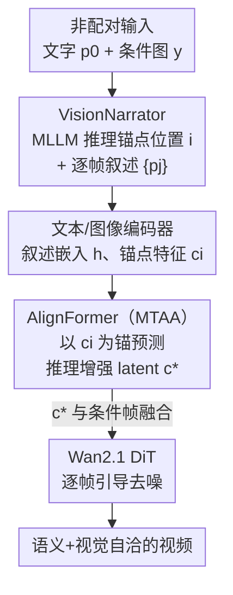

# Reasoning Diffusion for Unpaired Test Time Out-of-distribution Text-Image to Video Generation

**会议**: CVPR 2026  
**论文**: [CVF Open Access](https://openaccess.thecvf.com/content/CVPR2026/html/Pan_Reasoning_Diffusion_for_Unpaired_Test_Time_Out-of-distribution_Text-Image_to_Video_CVPR_2026_paper.html)  
**代码**: 无  
**领域**: 视频生成 / 扩散模型 / 多模态推理  
**关键词**: 文本-图像到视频, 非配对条件, OOD 生成, MLLM 推理, 扩散 Transformer

## 一句话总结
针对"文本和图像语义不对齐、图像也不一定是首帧"这种现实里很常见的非配对输入，本文用一个 MLLM（VisionNarrator）把两个看似无关的条件推理成一段逐帧剧本，再用 AlignFormer 把推理结果转成逐帧 latent 注入 Wan2.1 扩散模型，从而生成视觉与语义都自洽的视频。

## 研究背景与动机
**领域现状**：文本-图像到视频（TI2V）生成是当前主流任务，Dynamicrafter、CogVideoX、Wan2.1、LTX-Video 等模型用 DiT/U-Net 骨干，能根据一张图 + 一段文字合成高质量视频。

**现有痛点**：这些模型几乎都默认一个强假设——输入的文本和图像是**完美配对、时序对齐**的：两个模态描述同一事件，且条件图就是视频的第一帧。一旦遇到非配对（unpaired）的真实场景，模型就会崩。论文给的例子很直观：文字是"一只猫在房间里玩"，图像是"一个破碎的花瓶"，二者表面无关，但隐含的因果是"花瓶是被猫打碎的"，而且破碎花瓶最合理的位置应该接近视频结尾而非开头。现有方法面对这种输入，要么被图像主导、丢掉文字里的关键元素（Dynamicrafter），要么把两个模态的元素生硬混在一起（CogVideoX），要么只是静态并置两个元素而没有因果（Wan2.1）。

**核心矛盾**：非配对输入要求模型**跨模态推理**出两个条件之间的内在联系和时间先后，再把这个高层推理结果注入逐帧生成——而现有生成模型既没有这种推理能力，也没有把推理结果对齐到具体帧的机制。

**本文目标**：首次形式化"非配对文本-图像到视频生成"问题，并解决两个子问题：(i) 怎么从看似无关的图文里推理出一个合理的、时序对齐的场景剧本；(ii) 怎么把这个高层剧本精确地注入到每一帧的生成过程。

**切入角度**：作者注意到 MLLM 本身具备强推理能力，可以充当"导演"把图文脑补成连贯故事；难点在于这个文字剧本和扩散模型的 latent 空间之间隔着一道鸿沟，需要一个专门的桥接模块。

**核心 idea**：用 MLLM 推理出"条件图锚点位置 + 逐帧叙述"，再用一个以条件帧为锚的 Transformer（AlignFormer）把逐帧叙述翻译成逐帧的推理增强 latent，作为结构化引导贯穿去噪全程。

## 方法详解

### 整体框架
ReasonDiff 的骨干是基于 Wan2.1 的"推理引导生成模型"（Reasoning Guided Generative Model），前面挂两个新模块组成"MLLM 驱动的多帧推理器"（MLLM Driven Multi-frame Reasoner）：**VisionNarrator** 负责把非配对图文推理成逐帧剧本，**AlignFormer** 负责把剧本翻译成可注入扩散模型的逐帧 latent。整条链路是：非配对的文字 $p_0$ + 条件图 $y$ 先送进冻结的 MLLM，吐出条件图应该落在第几帧（位置 $i$）以及 $f$ 帧逐帧描述 $\{p_j\}$；这些逐帧描述经文本编码器得到叙述嵌入 $h=\{h_j\}$，条件图经图像编码器得到锚点特征 $c_i$；AlignFormer 以 $c_i$ 为锚、用多阶段时序锚点注意力把 $h$ 转成推理增强 latent $c^*=\{c^*_j\}$；最后 $c^*$ 与条件帧融合，作为逐帧引导喂给 DiT 块，在时间步 $t$ 上迭代去噪生成视频。

### 关键设计

**1. VisionNarrator：让 MLLM 把无关图文脑补成时序对齐的逐帧剧本**

这一步直击"两个模态看似无关、无法对齐"的痛点。作者用一个冻结的多模态大模型（MLLM）做跨模态推理，而不是像 LayoutGPT、VideoDirectorGPT 那样只把 MLLM 当作"扩写 prompt 的工具"。具体靠一段精心设计的指令让 MLLM 干两件事：一是**估计条件图最可能落在 $f$ 帧视频里的哪个位置**（输出 `position: j`），二是**为每一帧生成一句富信息描述**，让它们连成一个自洽的脚本（输出 `descriptions: [...]`）。比如"破碎花瓶 + 猫在玩"这组输入，MLLM 推理出的剧本是"完好的花瓶 → 猫进屋打碎花瓶 → 花瓶碎了猫逃走"，并自然地把破碎花瓶这张条件图放在了最后一帧（position=81）。为稳定输出格式，作者还用了 in-context learning。这一步的价值在于它把"非配对"这个最难的语义鸿沟，转化成了一个 MLLM 擅长的常识推理问题，并产出了后续模块需要的**锚点位置 + 逐帧叙述**两样结构化信息。

**2. AlignFormer 与多阶段时序锚点注意力（MTAA）：把文字剧本翻译成逐帧 latent**

VisionNarrator 给出的是文字，扩散模型吃的是 latent，中间隔着鸿沟——这正是 AlignFormer 要补的桥。它接收三样输入：条件帧抽出的锚点特征 $c_i$、推理出的位置 $i$、逐帧叙述嵌入 $h=\{h_j\}$，输出每帧对应的推理增强 latent $c^*=\{c^*_j\}$。核心是 **MTAA（Multi-stage Temporal Anchor Attention）**：把**锚点特征当 Query、逐帧叙述嵌入当 Key/Value**，做两阶段级联 cross-attention——第一阶段抓粗粒度时序依赖，第二阶段做更细的上下文对齐。形式上先给锚点和叙述都加时序位置编码 $\tilde{c}_i = \phi_{\text{proj}}(\text{Flatten}(c_i)) + \text{pe}_i^{(\text{time})}$、$\tilde{h}_j = h_j + \text{pe}_j^{(\text{time})}$，再

$$c_j^{*}=\text{Attn}(Q_i, K_j, V_j)=\text{Softmax}\!\left(Q_i K_j^{T}/\sqrt{d}\right)V_j$$

其中 $Q_i=W_Q\tilde{c}_i$、$K_j=W_K\tilde{h}_j$、$V_j=W_V\tilde{h}_j$，$j\neq i$ 是待预测帧的索引。以条件帧为锚点反复 attend 各帧叙述，等于把"已知的那一帧"作为参照系，把高层推理信号逐帧"搬运"进 latent 空间。消融显示，相比不经 AlignFormer 直接把多帧 prompt 塞进去，加了这个模块的生成质量和时序连贯性明显更好。

**3. 两阶段训练 + 非配对数据构造：在没有现成数据集的情况下学会推理生成**

最大的工程难点是"根本没有非配对图文的现成训练数据"。作者把任务**重构成条件视频重建**绕过去：冻结 VisionNarrator，从视频里**随机取一帧当条件帧**、配上逐帧叙述嵌入，让模型重建整段视频，于是可训练部分只剩基础生成模型和 AlignFormer。为了模拟 OOD 非配对，他们**刻意拉大所选帧之间的时间间隔**（在 WebVid 上按 0.2 秒采样、用 LLaMA-3.2-11B-Vision-Instruct 给每帧生成 caption），让条件帧和周围内容关联变弱。训练分两阶段：第一阶段用标准去噪损失联合训练基础模型和 AlignFormer，做初始化对齐；第二阶段冻住基础模型、单独微调 AlignFormer，并加一个辅助重建损失把预测 latent 拉向真值 latent：

$$\mathcal{L}=\mathbb{E}_{x_1,x_0,h,t,c}\left[\,\lVert u_\theta(x_t,h,c^{*})-v(x_t)\rVert_2^2+\beta\cdot\lVert c^{*}-c\rVert_2^2\,\right]$$

$\beta=0.2$。这个辅助损失因为偏离了基础模型原本的去噪目标，所以只在第二阶段微调 AlignFormer 时启用，不放进第一阶段。

### 损失函数 / 训练策略
- 第一阶段：标准 flow-matching 去噪损失 $\mathcal{L}=\mathbb{E}[\lVert u_\theta(x_t,y,t)-v(x_t)\rVert_2^2]$，速度场目标 $v(x_t)=x_1-x_0$，联合训练基础模型 + AlignFormer。
- 第二阶段：去噪损失 + $\beta$ 加权的 latent 重建损失（见上式），冻结基础模型只调 AlignFormer，$\beta=0.2$。
- 数据：WebVid 视频按 0.2s 采样、LLaMA-3.2-11B-Vision-Instruct 生成逐帧 caption；随机取一帧为条件帧、拉大帧间隔模拟非配对。

## 实验关键数据

### 主实验
评测在自建的 ActivityNet 非配对数据集（500 段、16 帧/段，取首/尾帧当条件、用 MLLM 给另一端生成 caption）和公开配对数据集 MSR-VTT 上进行。指标含 VBench 的 Imaging Quality、Motion Smooth、Dynamic Degree，以及 CLIP Score（Text/Image）和 User Rank（越低越好）。CLIP Score (Text) 和 User Rank 是评判非配对推理能力的最关键指标。

| 数据集 | 指标 | ReasonDiff | 最强基线(Wan2.1) | 提升 |
|--------|------|-----------|-----------------|------|
| ActivityNet(非配对) | CLIP Score (Text)↑ | 0.261 | 0.224 | +16.5% |
| ActivityNet(非配对) | User Rank↓ | 1.743 | 2.692 | 领先 0.949 |
| ActivityNet(非配对) | Dynamic Degree↑ | 0.936 | 0.810 | 大幅领先 |
| ActivityNet(非配对) | Imaging Quality↑ | 0.528 | 0.512 | 最优 |
| ActivityNet(非配对) | Motion Smooth↑ | 0.986 | 0.980 | 最优 |
| MSR-VTT(配对) | Imaging Quality↑ | 0.571 | 0.560 | 超过基础模型 |
| MSR-VTT(配对) | User Rank↓ | 1.769 | 2.743 | 最优 |

在非配对的 ActivityNet 上，ReasonDiff 除 CLIP Score (Image) 外全部指标第一；CLIP Score (Image) 各方法都在 0.5 附近、区分度低（因为基线遇到非配对就死抱图像，所以图像对齐分都不低），但只看图像分会被误导——综合 Text/Image 两个分才看得出基线缺乏跨模态推理能力。值得注意的是在**配对**的 MSR-VTT 上 ReasonDiff 也超过了它的基础模型 Wan2.1，说明跨模态推理对一般视频质量同样有正向贡献（真实数据本就很少完美对齐）。

### 消融实验
四个变体的指标以"相对完整模型的比例"报告（原文 Figure 5(a)，未给绝对数值）。

| 配置 | 受损最明显的指标 | 说明 |
|------|----------------|------|
| Full model | — | 完整模型，全指标最优 |
| w/o Aux. loss | Motion Smooth | 去掉第二阶段辅助重建损失，整体下滑、运动平滑度尤甚，说明它稳定了预测 latent |
| w/o Multi. prompt | Dynamic Degree | 只用单条用户 prompt、不要逐帧叙述，动态程度显著下降，证明细粒度时序引导的重要性 |
| w/o Enhanced latents | Imaging Quality | 只靠叙述引导、关掉增强 latent，画质大幅下降，说明光有文字叙述不足以保持视觉一致 |
| Rewrite prompt | CLIP Score (Text) | 用 MLLM 改写 prompt 喂给原基础模型，CLIP-Image 尚可但 CLIP-Text 暴跌，说明基础模型无法把文字信息分解到各帧 |

### 关键发现
- 增强 latent（AlignFormer 的输出）对**画质**贡献最大，逐帧叙述对**动态程度**贡献最大，二者互补缺一不可。
- 辅助重建损失主要起**稳定**作用（运动平滑度），是第二阶段微调的关键。
- "朴素方案"（改写 prompt + 手动指定条件帧索引）也搞不定非配对任务：生成结果常常只是元素的表面混合，甚至出现混乱内容，反衬出本任务的难度和本方法的必要性。

## 亮点与洞察
- **把"非配对"难题转译成 MLLM 的常识推理 + latent 对齐两步**：VisionNarrator 用语言模型脑补因果剧本、还顺手定位了条件图该放第几帧，这个"锚点位置"信息很巧妙——它让后续模块有了一个可靠的参照系。
- **以条件帧为 Query 锚点的 MTAA**：用"已知的那一帧"去 attend 各帧文字叙述，本质是把唯一确定的视觉信息当锚来生成未知帧的 latent，思路可迁移到任意"单帧条件 + 多帧文本"的可控生成。
- **无数据也能训**：把非配对生成重构成"随机取帧 + 拉大帧间隔"的条件重建，是个聪明的自监督构造，绕开了"没有非配对 ground-truth"的死结。
- 跨模态推理不仅救了非配对场景，还在配对的 MSR-VTT 上反超基础模型，提示"先推理再生成"可能是通用的视频质量增益手段。

## 局限与展望
- VisionNarrator 全程**冻结**，推理质量完全依赖所选 MLLM；MLLM 一旦把因果脑补错（例如位置估计偏差），错误会顺着 AlignFormer 传导到生成，论文没分析这种错误传播。
- 评测分辨率/帧数较低（16 帧 clip），是否能扩展到长视频、高分辨率未验证。
- ⚠️ 消融只给了"相对完整模型的比例"而非绝对数值，各变体的真实掉点幅度无法精确量化，需以原文 Figure 5 为准。
- CLIP Score (Image) 在非配对场景区分度差，作者也承认该指标"不够 discriminative"，缺乏一个更适配非配对设定的图像-语义对齐度量。
- 训练用 WebVid + LLaMA 自动 caption，caption 质量与领域偏置会影响 AlignFormer 学到的对齐先验。

## 相关工作与启发
- **vs Dynamicrafter / CogVideoX / Wan2.1**：它们假设图文配对、图像即首帧，遇到非配对要么被图像主导丢文字、要么混合元素、要么静态并置；ReasonDiff 显式跨模态推理出因果与时序，再注入逐帧 latent，本文优势是语义连贯，代价是多了一个 MLLM 推理 + AlignFormer 的开销。
- **vs LayoutGPT / VideoDirectorGPT**：它们也用 LLM，但只是**扩写文本 prompt / 生成布局**，没有处理多模态之间的内在联系，无法应对非配对输入；本文的 VisionNarrator 是跨模态推理 + 时序对齐，并把结果对齐到 latent 空间，定位和技术贡献都不同。
- **vs Rewrite-prompt 朴素方案**：单纯用 MLLM 改写 prompt 再喂原模型，基础模型无法把文字信息分解到各帧、会退化成依赖图像，CLIP-Text 暴跌——说明"推理结果"必须经 AlignFormer 这种专门桥接才能真正注入生成，光改文字不够。

## 评分
- 新颖性: ⭐⭐⭐⭐⭐ 首次提出并系统解决非配对文本-图像到视频生成，MLLM 推理 + 锚点 latent 对齐的组合很新。
- 实验充分度: ⭐⭐⭐⭐ 主实验 + 四变体消融 + 朴素方案对比较完整，但消融只给相对值、缺长视频/高分辨率验证。
- 写作质量: ⭐⭐⭐⭐ 问题动机和图例讲得清楚，方法链路完整；部分公式排版较密。
- 价值: ⭐⭐⭐⭐ 直指真实场景里图文不对齐的痛点，"先推理再生成"思路有迁移价值。

<!-- RELATED:START -->

## 相关论文

- [\[CVPR 2026\] VISTA: A Test-Time Self-Improving Video Generation Agent](vista_a_test-time_self-improving_video_generation_agent.md)
- [\[CVPR 2026\] StreamDiT: Real-Time Streaming Text-to-Video Generation](streamdit_real-time_streaming_text-to-video_generation.md)
- [\[CVPR 2025\] One-Minute Video Generation with Test-Time Training](../../CVPR2025/video_generation/one-minute_video_generation_with_test-time_training.md)
- [\[ICLR 2026\] TTOM: Test-Time Optimization and Memorization for Compositional Video Generation](../../ICLR2026/video_generation/ttom_test-time_optimization_and_memorization_for_compositional_video_generation.md)
- [\[CVPR 2026\] Lighting-grounded Video Generation with Renderer-based Agent Reasoning](lighting-grounded_video_generation_with_renderer-based_agent_reasoning.md)

<!-- RELATED:END -->
