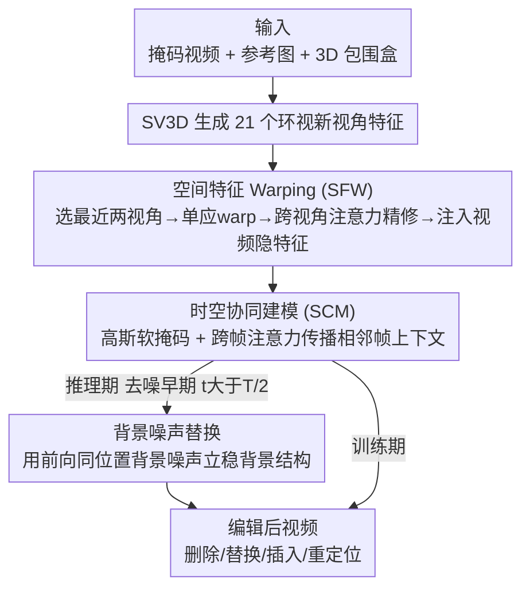

# RecEdit-Drive: 3D Reconstruction-Guided Spatiotemporal Video Editing for Autonomous Driving Scenes

**会议**: CVPR 2026  
**论文**: [CVF Open Access](https://openaccess.thecvf.com/content/CVPR2026/html/Wu_RecEdit-Drive_3D_Reconstruction-Guided_Spatiotemporal_Video_Editing_for_Autonomous_Driving_Scenes_CVPR_2026_paper.html)  
**代码**: https://github.com/TJU-IDVLab/RecEdit-Drive  
**领域**: 视频编辑 / 自动驾驶 / 扩散模型  
**关键词**: 视频编辑, 自动驾驶, 3D 重建先验, 时空一致性, 扩散模型

## 一句话总结
RecEdit-Drive 把一个 3D 重建模型（SV3D 多视角合成）塞进视频扩散编辑流程，用「空间特征 warping」从多个相关新视角构造前景目标视图、用「时空协同建模」的高斯跨帧注意力把编辑前景缝进背景，再配一个推理期的背景噪声替换策略，在 nuScenes 上对驾驶视频做删除/替换/插入/重定位四类编辑，FVD/FID 全面 SOTA 并能给下游 3D 检测做数据增强。

## 研究背景与动机
**领域现状**：自动驾驶的真实视频采集成本高，业界越来越依赖「生成 + 编辑」来扩充训练数据——把视频里的前景车辆删掉、替换、插入或挪位置，从而造出更多带挑战性的样本喂给下游 3D 检测、BEV 分割。主流做法基于隐空间扩散模型（LDM / Stable Video Diffusion），用文本 prompt 或 2D 结构先验（深度图、草图、光流、关键点）来约束编辑。

**现有痛点**：纯文本 prompt 只能换静态物体或做风格迁移，对**动态前景物体**编辑时缺乏帧间一致性；引入 2D 结构先验虽然提了一致性，但 2D 先验抓不住动态 3D 物体的空间结构和运动，编辑结果会出现几何失稳、结构漂移。一类「生成 + 重建融合」的方法用 3D 结构先验来引导生成，但它们要么对动态场景的时空一致性建模不足，要么**只用固定视角序列里某个单一视角**的 3D 信息去引导每一帧——视角一固定，编辑结果就出现几何畸变和时间不一致。

**核心矛盾**：要对动态 3D 前景做精确可控的编辑，既需要**任意目标视角下准确的 3D 结构先验**（单视角给不了），又需要**跨帧的时空协同**把编辑前景自然融进背景而不在边界处露馅——而现有方法在这两点上都只做了一半。

**本文目标**：只用「一段视频序列 + 一张参考前景图 + 每帧的 3D 包围盒」这三样输入，就实现删除、替换、插入、重定位四类编辑，并保证编辑物体在几何结构、纹理、时间上的一致性。

**核心 idea**：把预训练重建模型（SV3D 新视角合成）生成的**多个相关视角**特征，通过单应变换 warp 到任意目标视角来构造前景先验，再用高斯软掩码的跨帧注意力做时空协同，最后用推理期背景噪声替换稳住背景结构——用「多视角 3D 重建先验」替代「单视角 2D/3D 先验」来解决动态前景编辑的几何与时间一致性。

## 方法详解

### 整体框架
RecEdit-Drive 建在 Stable Video Diffusion（SVD）之上：输入是一段 $N$ 帧掩码视频 $V_m$、对应掩码序列 $M_B$（标出待编辑区域）、一张参考前景图 $I$、以及每帧的 3D 包围盒 $B=\{b_n\}$，输出是编辑后的视频。流程上分三块协同：先用 **Spatial Feature Warping（SFW）** 从重建模型拿到的多视角特征里 warp 出当前帧目标视角的前景特征，注入到视频隐特征里；再用 **Spatiotemporal Collaborative Modeling（SCM）** 的高斯跨帧注意力把相邻帧的上下文传播过来、把前景平滑融进背景；推理时再叠加一个 **背景噪声替换** 策略，在去噪早期用前向扩散同位置的背景噪声替换预测背景，先把正确的背景结构立起来，给前景编辑当可靠参考。

参考图 $I$ 先经 VAE 编码成隐特征喂给 SV3D 抽中间表示；深度图（由 3D 包围盒得到）经深度编码器提供位置信息，参考图经预训练 image encoder 提供上下文特征，二者一起注入扩散 U-Net 的 ResBlock 与注意力模块。SFW、SCM 是穿插在 U-Net 各层的可训练模块，SV3D / VAE / image encoder 冻结。

### 关键设计

**1. 空间特征 Warping（SFW）：用多视角 3D 重建先验构造任意目标视角的前景特征**

这一招直击「单视角先验给不了任意目标视角准确 3D 结构」的痛点。作者用预训练 SV3D 从参考图 $I$ 生成 21 个环视视角特征 $\tilde{Z}=\{\tilde{z}_i\}_{i=1}^{21}$，并把参考图的 3D 包围盒 $B$ 旋转得到这 21 个视角对应的盒子 $\tilde{B}$ 及其方位角 $\tilde{A}$。对当前帧的目标方位角 $a_n$，按角度差 $\Delta a_i=\tilde{a}_i-a_n$ 选出**最近的两个视角** $\tilde{a}_p,\tilde{a}_q$（取 $\min(|\Delta a_i|, 2\pi-|\Delta a_i|)$ 最小的两个），只用这两路最相关的参考视角，而不是硬塞单视角或全部视角。

接着不是简单贴图，而是按 3D 盒子的**可见面**做单应变换。每个盒子 6 个面，用面中心 $m_j$ 到相机中心 $c$ 的单位向量 $v_j=\frac{c-m_j}{\|c-m_j\|}$ 与面法向 $v'_j$ 判可见性（$v'_j\cdot v_j>0$ 即夹角小于 90° 可见），把可见面顶点用 DLT（直接线性变换）算出参考视角到目标视角的单应矩阵集合 $H_i$，再 warp 聚合得到目标视角特征 $\tilde{z}'_n=\sum_{i\in\{p,q\}}W(H_i,\tilde{z}_i)$。为了补结构和上下文一致性，再用跨视角注意力按视角相关度加权精修：

$$z'_n=\tilde{z}'_n+\sum_{i\in\{p,q\}}w_i\times\mathrm{CA}(\tilde{z}'_n,\tilde{z}_i),\quad w_i=\frac{1/|\Delta a_i|}{1/|\Delta a_p|+1/|\Delta a_q|}$$

权重 $w_i$ 让角度更近的参考视角贡献更大。最后用零卷积层 $Z$ 和对齐到包围盒的变换 $T_b$ 把 $z'_n$ 按前景掩码 $M^F_n$ 注入视频特征：$\vec{z}_n=z_{m,n}+M^F_n\times Z(T_b(z'_n))$。零卷积保证训练早期不会对原视频特征造成扰动。这一设计让前景物体在任意目标视角下都有几何准确的结构先验，比固定单视角重建显著提升了跨帧一致性。

**2. 时空协同建模（SCM）：高斯软掩码 + 跨帧注意力，让前景自然缝进背景**

SFW 解决了「单帧前景结构」，但前景塞进背景后边界容易露馅、跨帧也会跳变，这正是 SCM 要补的。现有方法用二值掩码硬切编辑/非编辑区，边界处的锐利不连续会拉低视觉真实感。作者改用高斯模糊把前景掩码软化：$M^F=1-M_B,\ M^{F,G}=M^F * G_\sigma$，$\sigma$ 控制平滑范围。软掩码再转成注意力引导掩码 $M_{i,j}=C(1-M^{F,G}_i\odot M^{F,G}_j)$（$C\ll 0$ 为负常数），用来在跨帧注意力里压制边界处的突变。

时空协同体现在「当前帧 + 相邻帧」的高斯跨帧注意力：

$$z_n=\vec{z}_n+\frac{1}{|N(n)|}\sum_{i\in N(n)}\mathrm{Softmax}\Big(\frac{Q_nK_i^T}{\sqrt{d}}+M_{n,i}\Big)V_i$$

其中 $N(n)=\{i\mid 0<|i-n|\le 1\}$ 是相邻帧（前后各一帧）。把相邻帧上下文传播到当前帧、并用 $M$ 引导注意力权重，既增强了时间一致性，又避免边界处注意力的突兀变化，使前景-背景过渡更自然、边界区域生成质量更高。

**3. 背景噪声替换（推理策略）：去噪早期先把正确背景立起来当参考**

这是个纯推理期的小技巧，针对「编辑前景时背景跟着被改坏、且前景缺一个稳定背景参考」。在去噪早期（$t>\frac{T}{2}$），把反向去噪得到的前景隐特征和**前向扩散过程同一时间步、同一位置采到的背景噪声**拼起来：用背景掩码 $M^B_n$ 和前景掩码 $M^F_n$ 取 $\bar{z}^B_{n,t}=\bar{z}_{n,t}\odot M^B_n$、$z^F_{n,t}=z_{n,t}\odot M^F_n$，则

$$z_{n,t}=\begin{cases}\bar{z}^B_{n,t}+z^F_{n,t}, & t>\frac{T}{2}\\ z_{n,t}, & t\le\frac{T}{2}\end{cases}$$

早期用前向噪声替换背景，相当于强制背景沿着「正确的原始结构」去噪，保住未编辑区域不被改动、同时给前景编辑提供准确背景参考；到后期（$t\le\frac{T}{2}$）关掉替换，让前景和背景隐特征无缝融合。消融显示它对背景结构完整性的恢复很关键。

### 损失函数 / 训练策略
沿用 SVD/EDM 的去噪分数匹配（DSM）目标，优化去噪器 $D_\theta$ 从高方差高斯噪声预测干净隐特征 $z_0$：$\mathbb{E}\big[\lambda_\sigma\|D_\theta(z_0+n;\sigma,y,c)-z_0\|_2^2\big]$，条件 $c$ 含 CLIP image token 与 VAE 隐特征。训练数据在 nuScenes 上构造：遮挡前景物体与背景区域并配上对应编辑条件，让模型按条件重建场景；共 12,000 个 10 帧、$576\times1024$ 的视频片段（其中 2,000 个专门训练 inpainting），另建 800 个片段评测。

## 实验关键数据

### 主实验
nuScenes 上对四类编辑任务比较 FID（单帧质量）和 FVD（时间一致性），RecEdit-Drive 在所有任务、所有指标上都最优：

| 任务 | 方法 | FVD ↓ | FID ↓ |
|------|------|-------|-------|
| 删除 Deletion | ProPainter | 334.79 | 34.14 |
| 删除 Deletion | SD Inpainting | 466.08 | 33.19 |
| 删除 Deletion | DriveEditor | 208.79 | 29.30 |
| 删除 Deletion | **RecEdit-Drive** | **170.98** | **26.97** |
| 替换 Replacement | T2V-Zero | 168.27 | 15.28 |
| 替换 Replacement | Tune-A-Video | 848.75 | 63.28 |
| 替换 Replacement | DriveEditor | 40.97 | 10.24 |
| 替换 Replacement | **RecEdit-Drive** | **38.59** | **9.88** |
| 插入 Insertion | DriveEditor | 45.96 | 11.12 |
| 插入 Insertion | **RecEdit-Drive** | **42.01** | **10.71** |
| 重定位 Reposition | DriveEditor | 34.14 | 9.45 |
| 重定位 Reposition | **RecEdit-Drive** | **32.27** | **9.04** |

插入和重定位任务里只有 DriveEditor 能做对比，RecEdit-Drive 对前景的空间位置和朝向控制更准、能对齐预设 3D 盒。

### 消融实验
三大模块逐个开关（质量指标 + 3D 位置控制指标，⚠️ FID/FVD 数值量级与主表不同，应是另一套评测子集）：

| SFW | SCM | Noise Replace | FID ↓ | FVD ↓ | PSNR ↑ | LPIPS ↓ | mRecall ↑ | mATE ↓ | mAOE ↓ |
|:---:|:---:|:---:|------|------|------|------|------|------|------|
| ✓ | – | – | 5.75 | 18.62 | 30.15 | 0.0469 | 0.960 | 0.5791 | 0.0417 |
| ✓ | – | ✓ | 5.69 | 18.44 | 30.19 | 0.0467 | 0.961 | 0.5772 | 0.0416 |
| ✓ | ✓ | – | 5.40 | 15.02 | 30.25 | 0.0458 | 0.963 | 0.5764 | 0.0413 |
| ✓ | ✓ | ✓ | **5.22** | **14.38** | **31.46** | **0.0454** | **0.964** | **0.5757** | **0.0412** |

3D 结构先验来源对比（把 SFW 换成 Vggt 或 SV3D 直出）：

| 3D 先验 | FID ↓ | FVD ↓ | mRecall ↑ | mATE ↓ | mAOE ↓ |
|---------|-------|-------|-----------|--------|--------|
| Vggt | 5.78 | 18.53 | 0.958 | 0.5885 | 0.0418 |
| SV3D | 5.74 | 18.21 | 0.954 | 0.5891 | 0.0427 |
| **SFW** | **5.22** | **14.38** | **0.964** | **0.5757** | **0.0412** |

### 关键发现
- **SCM 对 FVD 贡献最大**：加上 SCM 后 FVD 从 18.44 → 15.02，时间一致性提升最明显，因为它建模了跨帧时空协同；软掩码注意力同时改善了前景-背景融合的视觉质量。
- **位置指标（mRecall/mATE/mAOE）主要靠 SFW**：SCM 和 Noise Replace 对位置控制提升较小，因为空间定位主要由 SFW 的 3D 先验决定，其它模块通过提升视觉质量间接改善几何细节。
- **多视角 warp 优于单视角/显式重建**：Vggt 显式重建因多视角纹理不全/错位会过度平滑、结构细节不稳；SV3D 只用单帧视角、不充分利用 3D 结构会跨帧几何畸变；SFW 在隐空间用多相关视角的 3D 先验引导，几何和纹理一致性都最好。
- **下游增强有效**：用 50% nuScenes 子集做重定位 + 替换两种增强，StreamPETR 的 mAP 从 0.4796 → 0.4888、NDS 从 0.5617 → 0.5905，两种增强同时用收益最大。

## 亮点与洞察
- **把「选最近两视角 + 可见面单应 warp」做进隐空间**：不显式重建 3D 模型，而是用 SV3D 多视角特征经 DLT 单应变换 warp 到目标视角，绕开了显式重建的纹理缺失/错位问题，是「重建先验」喂给「生成模型」的一种轻量接法。
- **二值掩码 → 高斯软掩码**：一个很朴素但有效的 trick——把硬边界换成高斯软化的注意力引导掩码 $M_{i,j}=C(1-M^{F,G}_i\odot M^{F,G}_j)$，直接缓解了编辑边界的伪影，可迁移到任何带 mask 的视频编辑/inpainting。
- **推理期背景噪声替换**：不改训练、只在去噪早期用前向同位置噪声替换背景，先立稳背景再编前景，是「分阶段稳结构」思路在视频编辑上的具体落地，零成本可复用。
- **编辑即数据增强**：把视频编辑直接当成下游 3D 检测的数据增强器，并用 mAP/NDS 量化收益，给「生成式数据增强」提供了一个端到端闭环的范例。

## 局限性 / 可改进方向
- **强依赖 3D 包围盒输入**：方法需要每帧准确的 3D 包围盒作为条件，盒子标注/预测不准时空间控制会失效，限制了在无标注野外场景的直接应用。
- **只在 nuScenes 单一数据集验证**：训练评测都在 nuScenes，跨数据集/跨城市的泛化未验证；构造的训练样本靠遮挡 + 条件重建，与真实编辑分布的差距未讨论。⚠️
- **依赖 SV3D 的新视角质量**：整条 SFW 的前景先验质量被 SV3D 上限锁死，SV3D 对非常规车型/严重遮挡物体的新视角合成若失真，warp 出来的先验也会受影响。
- **消融表与主表量级不一致**：消融表 FID 在 5 量级、主表在 10–27 量级，论文未明说评测协议差异，读者难以横向对照，建议作者统一口径。⚠️

## 相关工作与启发
- **vs DriveEditor**：DriveEditor 是本文四类任务里最强的统一基线，但它依赖固定生成视角序列里的单视角 3D 信息，跨帧几何会漂；RecEdit-Drive 用多相关视角 warp + 高斯跨帧注意力，FVD/FID 在四类任务上全面更低，插入/重定位的空间-朝向控制也更准。
- **vs Tune-A-Video / Text2Video-Zero**：这类文本驱动方法擅长风格/静态替换，但替换动态车辆时会改全局风格（TAV 的 FVD 高达 848.75）或引入纹理几何畸变；本文用 3D 结构先验显式约束前景几何，避免了风格漂移和结构失真。
- **vs Vggt / SV3D 直接当先验**：显式重建（Vggt）过度平滑、单视角扩散（SV3D）跨帧不稳；本文 SFW 在隐空间融合多视角先验，几何 + 纹理一致性都优于两者，说明「在 latent 里 warp 多视角」比「显式重建后渲染」更适合动态编辑。

## 评分
- 新颖性: ⭐⭐⭐⭐ 「多视角重建先验在隐空间 warp + 高斯跨帧注意力 + 背景噪声替换」三件套组合新颖，单看每块都有出处但整合到驾驶视频编辑上有清晰增益。
- 实验充分度: ⭐⭐⭐⭐ 四类编辑任务 + 三组消融 + 下游检测增强较完整，但只在 nuScenes 单数据集、且消融/主表量级口径不一致。
- 写作质量: ⭐⭐⭐⭐ 方法公式交代清楚、图示完整；个别评测协议差异未说明。
- 价值: ⭐⭐⭐⭐ 直接服务自动驾驶数据增强、能提升下游 3D 检测，工程落地价值明确。

<!-- RELATED:START -->

## 相关论文

- [\[ICLR 2026\] DrivingGen: A Comprehensive Benchmark for Generative Video World Models in Autonomous Driving](../../ICLR2026/video_generation/drivinggen_a_comprehensive_benchmark_for_generative_video_world_models_in_autono.md)
- [\[CVPR 2026\] VIVA: VLM-Guided Instruction-Based Video Editing with Reward Optimization](viva_vlm-guided_instruction-based_video_editing_with_reward_optimization.md)
- [\[CVPR 2026\] Generative Video Motion Editing with 3D Point Tracks](generative_video_motion_editing_with_3d_point_tracks.md)
- [\[NeurIPS 2025\] RLGF: Reinforcement Learning with Geometric Feedback for Autonomous Driving Video Generation](../../NeurIPS2025/video_generation/rlgf_reinforcement_learning_with_geometric_feedback_for_autonomous_driving_video.md)
- [\[CVPR 2026\] DriveLaW: Unifying Planning and Video Generation in a Latent Driving World](drivelaw_unifying_planning_and_video_generation_in_a_latent_driving_world.md)

<!-- RELATED:END -->
