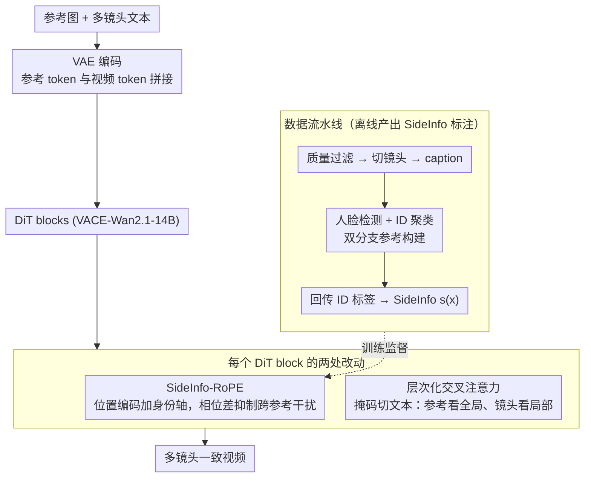

# Rethinking Position Embedding as a Context Controller for Multi-Reference and Multi-Shot Video Generation

**会议**: CVPR 2026  
**arXiv**: [2604.03738](https://arxiv.org/abs/2604.03738)  
**代码**: [https://poco-multiref-multishot.github.io/](https://poco-multiref-multishot.github.io/)  
**领域**: 视频生成 / 扩散模型 / 多参考多镜头生成  
**关键词**: 位置编码, 上下文控制, 多参考视频生成, RoPE, 身份混淆

## 一句话总结

提出 PoCo（Position Embedding as Context Controller），通过在 RoPE 中引入额外的 SideInfo 轴编码参考实体信息，解决多参考多镜头视频生成中的"参考混淆"问题——当参考图像外观高度相似时模型无法正确关联镜头与参考。在 VACE-Wan2.1-14B 框架上实现 SOTA 的跨镜头一致性（CrossShot-FaceSim 89.35，CrossShot-DINO 92.66）。

## 研究背景与动机

1. **领域现状**：视频生成在文本到视频、参考到视频等任务上取得了快速进展。多参考多镜头视频生成对于电影制作、叙事视频等至关重要，但学术界对此问题的研究仍然有限（Sora2 等闭源系统展示了可能性但不透明）。
2. **现有痛点**：
    - 现有参考到视频方法（Phantom、VACE）大多独立生成每个镜头，导致跨镜头背景和外观不一致
    - 直接拼接多参考和多镜头 tokens 进入 attention 的"朴素"方案会导致**参考混淆**——当多个参考外观相似时，语义相似的 tokens 让模型无法区分正确的镜头-参考关联
    - Attention 可视化直接证实了这一问题：某镜头对错误参考的注意力权重高于正确参考
3. **核心矛盾**：在保持多镜头场景级语义一致性（需要全局 attention 交互）与忠实维护不同参考身份（需要精确的参考关联）之间存在根本张力
4. **本文目标**：(1) 解决语义相似参考之间的混淆问题；(2) 在不引入额外计算开销的条件下实现精确的上下文控制
5. **切入角度**：重新审视 attention 机制，将其分解为"语义驱动的可学习组件"（Q-K 检索）和"手动设计的位置编码组件"（组织上下文）——后者可以作为额外的上下文控制手段
6. **核心 idea**：将 token 的辅助属性信息（如 @character_i 标识符）编码为 RoPE 中的额外旋转维度，让位置编码承担"超越语义"的精确上下文路由功能

## 方法详解

### 整体框架

PoCo 要解决的是多参考多镜头视频生成里的"参考混淆"：把多个参考图和多个镜头的 token 一股脑拼进 attention 后，当两个参考长得像，模型分不清哪个镜头该用哪个参考。作者的判断是——这不该靠改 attention 架构来修，而是 RoPE 这条"手动设计的位置编码"通道本就有余地承担额外的上下文路由。

整条 pipeline 建在 VACE-Wan2.1-14B 上：参考图先经 VAE 编码成 token，与待生成的视频 token 拼接后送进 DiT blocks；每个 block 里的 Self-Attention 换上 SideInfo-RoPE，Cross-Attention 换成层次化版本。训练和推理统一在 9s / 480p / 16fps、两参考的设置下进行。真正动刀的只有两处——位置编码加一个轴、文本条件改一张掩码——其余框架原样保留。而这两处改动所需的 SideInfo 身份标注，由一条离线数据流水线从原始长视频里自动榨出。

### 关键设计

**1. SideInfo-RoPE：给位置编码加一根"参考身份"轴，让相位差天然抑制跨参考干扰**

混淆的根源在于：相似参考的 token 语义也相似，Q-K 检索这条可学习通道压不住错误关联。作者绕开它，转而在固定的位置编码侧做文章。标准 3D-RoPE 的坐标是 $\mathbf{p}=(t,h,w)$，PoCo 把它扩成 $\mathbf{p}^*=(t,h,w,s)$，新增的 $s$ 专门编码"这个 token 属于哪个参考实体"。具体地，每个视觉 token $\mathbf{x}$ 配一个 side information 向量 $\mathbf{s}(\mathbf{x})\in\{0,1\}^K$，$s_i(\mathbf{x})=1$ 表示该 token 所在镜头包含参考 $i$；两个 token 之间的 SideInfo 距离取按位差

$$\Delta_{m,n}^s = |\mathbf{s}(\mathbf{x}_m) - \mathbf{s}(\mathbf{x}_n)|.$$

RoPE 的 $D$ 维里划出 $D_s = 2K$ 维给这根轴，每个参考 $i$ 对应一个 2×2 旋转块 $\hat{\mathbf{R}}^{(i)}_{\Delta^s_{m,n}}$。关键在于旋转相位怎么定：因为 SideInfo 取值只有 {0,1}、值域比 $(t,h,w)$ 小得多，作者干脆把相位按 $2\pi$ 周期均匀离散化，参考 $i$ 用 $\phi_i=\frac{2\pi i-\pi}{K}$。这样一来，两个 token 若共享相同 SideInfo（$\Delta^s=0$）就不旋转、相位对齐、attention 不受抑制；身份不同（$\Delta^s\neq0$）则旋转出一个相位偏移，让它们的内积衰减——错误的镜头-参考关联因此被"物理性"地压下去。举个两参考的例子：镜头 A 标了参考 1、镜头 B 标了参考 2，A 的 token 看向 B 的 token 时 $\Delta^s\neq0$ 触发相位偏移，注意力被削弱；而 A 内部、以及 A 与参考 1 之间 $\Delta^s=0$ 保持满相位，正确关联被保留。整个机制零额外参数、零额外算力，只是改了坐标。

**2. 层次化交叉注意力：参考看全局、镜头看局部，用一张掩码切开文本条件**

文本条件也存在全局与局部的张力——参考需要知道整段叙事才能给出一致的身份与风格，而每个镜头只该听自己那段描述，否则跨镜头串味。PoCo 用一张二值掩码 $\mathbf{M}\in\{0,1\}^{L_v\times L_t}$ 把这两件事分开：参考图像 token 对全部文本 token 开放（$\mathbf{M}[1:L_{ref},1:L_t]=1$），提供跨镜头的全局身份和风格指导；而第 $s$ 个镜头的视频 token 只对该镜头对应的文本段 $\mathcal{T}_s$ 做注意力（$\mathbf{M}[\mathcal{V}_s,\mathcal{T}_s]=1$，$\mathbf{M}[\mathcal{V}_s,\mathcal{T}_{s'\neq s}]=0$），保证局部条件互不污染。一全局一局部，刚好对应"身份要一致、内容要独立"的需求。

**3. 数据流水线：从原始长视频自动榨出带 SideInfo 标注的多镜头样本**

高质量的多参考多镜头训练数据本就稀缺，SideInfo 这套监督更是现成数据集里没有的，必须自己造。流水线分两段：视频处理段先做质量过滤（VQA、锐度、曝光），再用 AutoShot + PySceneDetect 切镜头、OCR 裁掉水印、MLLM 生 caption、合并相邻片段；参考构建段做人脸检测和 ID 聚类，只保留出现足够多次的身份，并为每个 ID 准备两种参考——原始裁剪和 SeedReam 增强的正面肖像，双分支让身份条件更鲁棒。最后把聚类得到的 ID 标签回传到对应镜头，这正是训练 SideInfo-RoPE 所需的 $\mathbf{s}(\mathbf{x})$ 监督来源，让前面那根轴有据可依。

### 损失函数 / 训练策略

- 基于 VACE-Wan2.1-14B 框架的标准扩散训练
- 学习率 1e-5
- SideInfo 轴分配 4 个通道（两参考设置下对应 2 个 SideInfo 旋转平面）
- 从低频时间通道重分配给 SideInfo（T-low 优于 T-high）

## 实验关键数据

### 主实验

| 方法 | 类型 | CrossShot-FaceSim ↑ | CrossShot-DINO ↑ | FaceSim ↑ | AvgScore ↑ |
|------|------|---------------------|-------------------|-----------|------------|
| Phantom-14B | 单镜头 | 86.12 | 73.24 | 72.75 | 80.72 |
| VACE-14B | 单镜头 | 69.49 | 67.30 | 67.05 | 75.56 |
| EchoShot | 多镜头 | 87.05 | 79.81 | N/A | 83.82* |
| **PoCo (Ours)** | 多镜头 | **89.35** | **92.66** | 70.12 | **83.46** |

*EchoShot 的 AvgScore 为 w/o Alignment-FaceSim

### 消融实验

**SideInfo-RoPE 通道选择消融**

| 配置 | CrossShot-FaceSim ↑ | CrossShot-DINO ↑ | FaceSim ↑ |
|------|---------------------|-------------------|-----------|
| w/o SideInfo-RoPE | 77.29 | 91.25 | 45.42 |
| w/ SideInfo-RoPE-Tlow | **81.55** | **91.32** | **60.35** |
| w/ SideInfo-RoPE-Thigh | 80.96 | 91.32 | 55.54 |

### 关键发现

- **SideInfo-RoPE 提升巨大**：FaceSim 从 45.42 提升到 60.35（+14.93），CrossShot-FaceSim 从 77.29 到 81.55（+4.26），证明参考混淆是严重问题
- **低频时间通道更适合 SideInfo**：T-low 优于 T-high（FaceSim 60.35 vs 55.54），高频通道建模快速时间变化，重分配后导致运动伪影
- **PoCo 的 CrossShot-DINO 大幅领先**（92.66 vs Phantom 的 73.24），表明多镜头联合生成在背景语义一致性上远优于独立生成
- 与商业系统 Kling-1.6 和 Vidu-Q2 的定性对比显示，PoCo 在跨镜头场景布局、光照和精细外观一致性上更优
- 即使与 VACE-14B（PoCo 的基础）相比，PoCo 也提升了单镜头 FaceSim（67.05→70.12）

## 亮点与洞察

- **将位置编码重新解读为上下文控制器**是一个优雅的洞察：不修改 attention 架构，不增加额外模块，仅在 RoPE 中添加一个轴就实现了精确的参考路由。零额外计算开销且保持完整上下文连接。
- **SideInfo 距离的二值设计**简洁巧妙——参考是否出现是一个天然的二值属性，与 RoPE 的旋转机制完美契合。
- **数据流水线的完整设计**（VQA 过滤 → 镜头切割 → ID 聚类 → 双分支参考构建 → SideInfo 标注）是实际工程中非常有价值的贡献，为多参考多镜头训练数据的构建提供了可复制的流程。

## 局限与展望

- 当前主要解决跨镜头参考混淆，对**同一镜头内多个相似个体**的精细控制（如精确动作绑定、紧密交互）能力有限
- 仅测试了两参考设置，K 增大时 SideInfo 旋转平面增多是否影响其他维度的性能需要验证
- 评估集较小（54 个镜头/18 个视频/9 对参考），统计显著性可能有限
- 未探索动态 SideInfo（如角色在镜头间出入）的场景
- Alignment-FaceSim（70.12）与 Phantom-14B（72.75）相比略低，说明多镜头联合生成在单镜头参考保真度上仍有小幅代价

## 相关工作与启发

- **vs EchoShot**: EchoShot 引入 TcRoPE/TaRoPE 处理多镜头时间和 caption 对齐，但不直接编码参考身份；PoCo 的 SideInfo-RoPE 更直接地解决身份关联（CrossShot-FaceSim +2.30）
- **vs Phantom**: Phantom 用 VAE latent + CLIP 语义注入参考，但独立生成各镜头导致跨镜头不一致（DINO 73.24 vs 92.66）
- **vs "Context as Memory"**: 该方法用外部检索模块获取相关帧，PoCo 移除了外部检索需求，直接在 attention 内部通过位置编码控制上下文

## 评分

- 新颖性: ⭐⭐⭐⭐⭐ 将位置编码重构为上下文控制器的核心 idea 新颖且优雅，SideInfo-RoPE 的设计简洁有效
- 实验充分度: ⭐⭐⭐⭐ 定量和定性实验充分，包含与商业系统对比，但评估集规模偏小
- 写作质量: ⭐⭐⭐⭐⭐ 问题定义精准，从 attention 分解到 SideInfo-RoPE 的推导逻辑清晰，图示直观
- 价值: ⭐⭐⭐⭐⭐ 多参考多镜头生成是视频生成的关键瓶颈，PoCo 提供了零开销的解决方案，方法具有高度通用性

<!-- RELATED:START -->

## 相关论文

- [\[CVPR 2026\] MultiShotMaster: A Controllable Multi-Shot Video Generation Framework](multishotmaster_a_controllable_multi-shot_video_generation_framework.md)
- [\[CVPR 2026\] OneStory: Coherent Multi-Shot Video Generation with Adaptive Memory](onestory_coherent_multi-shot_video_generation_with_adaptive_memory.md)
- [\[CVPR 2026\] STAGE: Storyboard-Anchored Generation for Cinematic Multi-shot Narrative](stage_storyboard-anchored_generation_for_cinematic_multi-shot_narrative.md)
- [\[CVPR 2026\] HoloCine: Holistic Generation of Cinematic Multi-Shot Long Video Narratives](holocine_holistic_generation_of_cinematic_multi-shot_long_video_narratives.md)
- [\[CVPR 2026\] ShotDirector: Directorially Controllable Multi-Shot Video Generation with Cinematographic Transitions](shotdirector_directorially_controllable_multi-shot_video_generation_with_cinemat.md)

<!-- RELATED:END -->
