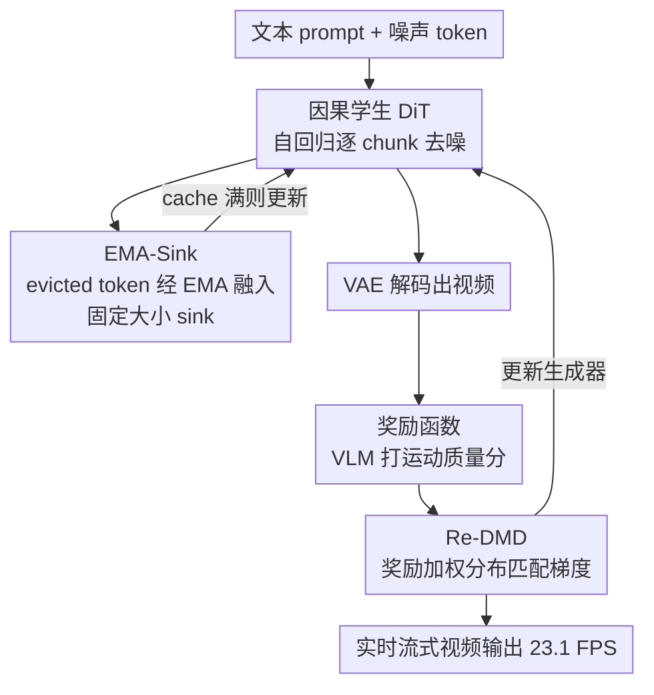

# Reward Forcing: Efficient Streaming Video Generation with Rewarded Distribution Matching Distillation

**会议**: CVPR 2026  
**论文**: [CVF Open Access](https://openaccess.thecvf.com/content/CVPR2026/html/Lu_Reward_Forcing_Efficient_Streaming_Video_Generation_with_Rewarded_Distribution_Matching_CVPR_2026_paper.html)  
**代码**: [项目页 reward-forcing.github.io](https://reward-forcing.github.io/)  
**领域**: 视频生成 / 扩散模型  
**关键词**: 流式视频生成, 蒸馏, 注意力 sink, 分布匹配, 强化学习奖励  

## 一句话总结
Reward Forcing 把双向视频扩散模型蒸馏成几步自回归学生模型，用 EMA-Sink 压缩历史上下文防止"复制初始帧"、用 Re-DMD 把分布匹配梯度按运动质量奖励加权偏向高动态样本，在单张 H100 上以 23.1 FPS 实时生成高质量流式视频，VBench 总分超过所有同规模 baseline。

## 研究背景与动机

**领域现状**：视频扩散 Transformer（DiT）能生成画质精细的短视频，但它对所有帧做双向注意力联合去噪，无法满足"边生成边播放、可无限延长"的流式场景。主流做法是把慢速双向扩散模型蒸馏成几步自回归学生模型：每帧只用**滑动窗口注意力**看前面若干帧，配合 KV cache 实现实时推理（CausVid、Self Forcing、LongLive、Rolling Forcing 等）。

**现有痛点**：自回归生成有著名的**误差累积**问题——每帧依赖可能已经损坏的前序输出，错误层层传播。为缓解漂移，近期工作引入**注意力 sink**：把最初的若干 token 永久留在 KV cache 里当锚点。这确实稳住了长程注意力，却引出新麻烦——模型对**起始帧过度依赖**，表现为运动幅度急剧衰减、后续帧不再自然演化，甚至频繁"闪回"到第一帧的样子（frame copying，画面僵住）。

**核心矛盾**：① sink token 是**静态**的，只压缩了"最初"的上下文，丢掉了中间帧的近期动态，于是注意力被初始帧绑架；② 经典分布匹配蒸馏（DMD）**对所有样本一视同仁**，而那些运动退化的样本虽然动态差，画质却不错、已经落在教师分布附近，难以被区分和优化——所以单纯做 DMD 根本治不了"过度关注初始帧"。低延迟与高动态保真度之间始终拉扯。

**本文目标**：在保持实时流式推理的前提下，同时拿到高视觉保真度和高运动动态。拆成两个子问题：(a) 如何在固定窗口下保留全局上下文又注入近期动态；(b) 如何让蒸馏过程"偏爱"高动态样本而不破坏画质。

**切入角度**：既然 sink token 是静态的才出问题，那就让它**动态更新**——把被窗口挤出去的 token 用指数滑动平均（EMA）持续融进固定大小的 sink，既保长程记忆又含近期动态。既然 DMD 一视同仁才学不到动态，那就引入 RL 奖励，把运动质量当权重去偏置分布匹配梯度。

**核心 idea**：用"会更新的 EMA-Sink"代替"静态 sink"打破信息瓶颈，用"奖励加权的 Re-DMD"代替"均匀的 DMD"把输出分布拉向高动态区域。

## 方法详解

### 整体框架
Reward Forcing 在流式文生视频里逐 chunk 自回归生成（沿用 Self Forcing 的自 rollout，让训练条件模拟推理，弥合 train-test gap）。当前流的噪声 token 先被投影成新的 KV 对，追加进 KV cache 做注意力；当 cache 涨到最大窗口时，从起始帧初始化的 **sink token**（黄块）用被挤出的 evicted token（粉块）做 EMA 更新；训练时把生成视频解码出来送进一个**视觉语言奖励函数**打运动分，这个分数再去**加权**来自教师模型的分布匹配梯度。学生是因果 DiT，建在 Wan2.1-T2V-1.3B 上。

整条 pipeline 可以拆成"自回归 rollout → EMA-Sink 维护上下文 → 解码打奖励 → 奖励加权蒸馏"四步循环：

### 关键设计

**1. EMA-Sink：用滑动平均把"被丢弃的历史"压成会更新的 sink，打破固定窗口的信息瓶颈**

滑动窗口注意力为了省算力只缓存最近 $w$ 帧，窗口一往前推，最老的帧 $x^{i-w+1}$ 就被永久丢弃，造成信息瓶颈、全局意识衰减、长程画质漂移。已有的注意力 sink 把最初 token 静态地留住，虽然稳住了注意力，却让模型死盯第一帧、动态变差。EMA-Sink 的做法是：不丢弃被挤出的帧，而是把它的 KV 对持续融进固定大小的压缩 sink 状态 $S^i_*$。当帧 $x^{i-w}$ 被挤出窗口时，更新

$$S^i_K = \alpha \cdot S^{i-1}_K + (1-\alpha)\cdot K^{i-w}, \qquad S^i_V = \alpha \cdot S^{i-1}_V + (1-\alpha)\cdot V^{i-w}$$

其中 $\alpha\in(0,1)$ 是动量衰减系数，控制压缩速率——近期信息占主导，远期历史以"渐隐记忆"形式保留。注意力计算时把压缩 sink 拼在局部窗口前面：$K^i_{global}=[S^i_K; K^{i-w+1:i}]$，$V^i_{global}=[S^i_V; V^{i-w+1:i}]$，于是每个 query 既能看细粒度局部上下文、又能看粗粒度全局历史。配合因果 RoPE 保证只能看前序位置。这样**不增加额外计算成本**（token 驱逐是 $O(1)$，注意力仍是 $O(w^2)$ 且与序列长度无关），却既维持了注意力性能、又注入了近期动态，从根上防止初始帧复制。⚠️ 论文正文一处写 $\alpha$ 取 $9\times10^{-3}$、消融表又用 $\alpha=0.99$，疑似前者指 $1-\alpha$ 或笔误，以原文为准。

**2. Re-DMD：把运动质量奖励当权重去偏置分布匹配梯度，让蒸馏偏向高动态区域**

经典 DMD 通过最小化生成分布与真实（教师）分布的反向 KL 来传递知识：

$$\nabla_\theta L_{DMD}\approx -\mathbb{E}_t\!\left[\int \big(s_{real}(\Psi(G_\theta(\epsilon),t),t)-s_{fake}(\Psi(G_\theta(\epsilon),t),t)\big)\frac{dG_\theta(\epsilon)}{d\theta}d\epsilon\right]$$

它对目标分布所有区域一视同仁，没有任何机制按"任务指标"优先高质量输出。可视频生成里模型训练越久越倾向产出静态帧，而这些退化样本画质好、已经贴近教师分布，DMD 根本分不出来。Re-DMD 借**奖励加权回归（RWR）**框架，用 EM 算法把 RL 问题转成概率推断。E 步把带正则项 $\beta$ 的 RL 目标 $J_{RL}=\mathbb{E}[r(x_0,c)/\beta-\log p/q]$ 解成约束优化的闭式解 $p(x_0|c)=\frac{1}{Z(c)}q(x_0|c)\exp(r(x_0,c)/\beta)$；M 步把它投影回参数模型，得到

$$\nabla_\theta J_{Re\text{-}DMD}\approx -\mathbb{E}_t\!\left[\int \exp(r_c(x_t)/\beta)\cdot\big(s_{real}-s_{fake}\big)\frac{dG_\theta(\epsilon)}{d\theta}d\epsilon\right]$$

关键就是在 DMD 梯度上乘了一个 $\exp(r_c(x_t)/\beta)$ 的奖励权重，$r$ 用 VideoAlign 的运动质量打分、$\beta$ 控制奖励影响（越小奖励权重越高）。这等价于"在分布匹配约束下最大化期望奖励"，把分布拉向高动态区域同时保住画质。妙处在于**奖励只当静态权重**：不用对奖励模型反向传播、绕开了难算的归一化常数 $Z(c)$、也避免了噪声奖励梯度带来的不稳定，因此没有典型 RL 的高算力开销，训练稳定、收敛快。

### 损失函数 / 训练策略
学生建在 Wan2.1-T2V-1.3B 上，生成 5 秒 $832\times480$ 视频。先在 base model 采的 16k ODE 解对上初始化（因果注意力 mask，沿用 CausVid），prompt 取 LLM 增广的 VidProM。奖励用 VideoAlign 的 motion quality，$\beta=1/2$。逐 chunk 去噪（每 chunk 3 个 latent 帧），去噪步 $[1000,750,500,250]$，注意力窗口 9。在 64 张 H200 上训 600 步、总 batch 64（约 3 小时）；AdamW，生成器 $G_\theta$ 学习率 $2.0\times10^{-6}$、fake score $s_{fake}$ 学习率 $4.0\times10^{-7}$，每 5 步更新一次生成器。

## 实验关键数据

### 主实验

短视频（5 秒，VBench，946 prompts × 5 seed）：Reward Forcing 在最小注意力窗口下拿到最快推理和最高总分。

| 模型 | 参数量 | FPS↑ | VBench 总分↑ | Quality | Semantic |
|--------|------|------|------|------|------|
| Wan-2.1（双向） | 1.3B | 0.78 | 84.26 | 85.30 | 80.09 |
| CausVid | 1.3B | 17.0 | 82.88 | 83.93 | 78.69 |
| Self Forcing | 1.3B | 17.0 | 83.80 | 84.59 | 80.64 |
| LongLive | 1.3B | 20.7 | 83.22 | 83.68 | 81.37 |
| Rolling Forcing | 1.3B | 17.5 | 81.22 | 84.08 | 69.78 |
| **本文 Ours** | 1.3B | **23.1** | **84.13** | **84.84** | 81.32 |

23.1 FPS 相比 SkyReels-V2 是 47.14× 加速、相比 Self Forcing 是 1.36× 加速，且总分在自回归方法里最高（仅次于慢 30× 的双向 Wan-2.1）。

长视频（60 秒，MovieGen 前 128 prompts，VBenchLong + Qwen3-VL 打分）：

| 模型 | 总分↑ | Dynamic↑ | Drift↓ | Qwen-Visual↑ | Qwen-Dynamic↑ | Qwen-Text↑ |
|--------|------|------|------|------|------|------|
| SkyReels-V2 | 75.94 | 39.86 | 7.315 | 3.30 | 3.05 | 2.70 |
| CausVid | 77.78 | 27.55 | 2.906 | 4.66 | 3.16 | 3.32 |
| Self Forcing | 79.34 | 54.94 | 5.075 | 3.89 | 3.44 | 3.11 |
| LongLive | 79.53 | 35.54 | 2.531 | 4.79 | 3.81 | 3.98 |
| **本文 Ours** | **81.41** | **66.95** | **2.505** | **4.82** | **4.18** | **4.04** |

长视频总分 81.41 显著超过次优 LongLive 的 79.53；动态指标 66.95 相当于 88.38% 的动态幅度提升，同时漂移最低，三项 Qwen 打分全面第一。

### 消融实验

| 配置 | Background | Smooth | Dynamic | Quality | Drift↓ | 说明 |
|------|------|------|------|------|------|------|
| **Ours（Full）** | 95.07 | 98.82 | 64.06 | 70.57 | 2.51 | 完整模型 |
| w/o Re-DMD | 95.85 | 98.91 | 43.75 | 71.42 | 1.77 | 动态从 64.06 暴跌到 43.75 |
| w/o EMA | 95.61 | 98.64 | 35.15 | 70.50 | 2.65 | 动态进一步掉到 35.15 |
| w/o Sink | 94.94 | 98.56 | 51.56 | 69.92 | 5.08 | 漂移飙到 5.08，画质明显退化 |

超参（$\alpha$ / $\beta$）扫描：$\alpha$ 越大（0.99）运动平滑越好、漂移越低，是动态与一致性的平衡旋钮；$\beta$ 越小奖励权重越高，$\beta=1/5$ 把动态推到 94.53 但牺牲背景一致性（92.40）和画质（68.26），$\beta=1$ 又让动态不足（54.68），故选 $\beta=1/2$ 折中。

### 关键发现
- **Re-DMD 主管动态**：去掉它动态分从 64.06 掉到 43.75，正是它把分布拉向高运动样本；但去掉后漂移反而更低（1.77），说明动态和稳定本身存在 trade-off，Re-DMD 是在可控漂移下换更高动态。
- **EMA 与 Sink 协同**：单去 EMA 动态崩到 35.15（退回静态 sink 的"复制初始帧"困境）；单去 Sink token 漂移飙到 5.08，证明 sink 锚点管长程稳定、EMA 更新管近期动态，两者缺一不可。
- **窗口越小越快**：推理 FPS 与注意力窗口大小成反比，小窗口是实时性的来源；Re-DMD 训练曲线显示动态分随时间稳步上升，100 GPU 小时即超过 LongLive、150 小时超过 Self Forcing，总算力 <200 GPU 小时。

## 亮点与洞察
- **静态 sink → 动态 EMA-Sink**：把"注意力 sink 必须是最初固定 token"这个隐含假设打破，用 EMA 让锚点持续吸收近期被驱逐的 token——零额外算力却同时解决"长程稳定"和"近期动态"，这个改造很巧。
- **奖励当静态权重而非可微目标**：Re-DMD 把 RL 奖励退化成 DMD 梯度上的一个 $\exp(r/\beta)$ 标量乘子，绕开对奖励模型反传、绕开归一化常数、避开噪声奖励梯度——拿到 RL 的"偏好引导"却不付 RL 的不稳定代价，这套 RWR/EM 推导值得迁移到其他蒸馏任务。
- **诊断到位**：作者点破"退化样本画质好、已贴近教师分布，所以 DMD 区分不出"，这一句把"为什么注意力 sink 治标不治本"讲透了，是整篇方法的逻辑支点。
- **可交互**：清空 cross-attention cache 并用新 prompt 重算，就能在生成途中换 prompt（如 0–5s 空杯 → 5–10s 倒咖啡），EMA-Sink 保证转场无缝。

## 局限与展望
- 整套验证都在 Wan2.1-1.3B 这一个 backbone、5 秒 chunk 上做，未报告更大模型或更高分辨率下 EMA-Sink 压缩是否仍无损。
- 奖励完全依赖 VideoAlign 的 motion quality 单一维度，奖励模型的偏置会直接注入生成分布；$\beta$ 过小就出现"动态虚高但画质崩"，说明奖励 hacking 风险存在，缺少对多维奖励或奖励鲁棒性的探讨。
- $\alpha$ 是单一全局动量，长程不同语义段可能需要自适应衰减；正文 $\alpha$ 数值（$9\times10^{-3}$ vs 0.99）表述不一致，复现需谨慎（⚠️ 以原文为准）。
- Drift 用 30 段成像质量的标准差衡量，是画质稳定性的代理，不直接反映语义漂移；长程语义一致性仍靠定性图佐证。

## 相关工作与启发
- **vs Self Forcing**: 都用自 rollout 弥合 train-test gap，但 Self Forcing 仍用静态 sink + 普通 DMD，动态高却漂移严重（drift 5.075）；本文用 EMA-Sink 控漂移、Re-DMD 提动态，在同等速度下总分与动态双赢。
- **vs LongLive**: LongLive 靠 KV recaching + 流式微调做长视频，但过度依赖初始帧、动态偏低（35.54）；本文用会更新的 sink 解决"复制初始帧"，动态 66.95 远超之。
- **vs CausVid**: CausVid 首次把双向扩散重构成因果生成做 DMD 蒸馏，本文在其 ODE 初始化基础上加奖励加权，把"均匀蒸馏"升级为"动态优先蒸馏"。
- **vs Self-Forcing++ / Flow-GRPO 类**: 那类把 GRPO 等策略优化塞进已蒸馏模型，性能受 base 限制且带 RL 不稳定；本文用 RWR 把奖励变静态权重，无需策略优化的高开销。

## 评分
- 新颖性: ⭐⭐⭐⭐⭐ EMA-Sink 与奖励加权 DMD 两个改造都直击"静态 sink + 均匀蒸馏"的根因，思路清晰且互补。
- 实验充分度: ⭐⭐⭐⭐ 短/长视频 + VBench/Qwen 多评测 + 完整消融与超参扫描，但只在单一 backbone 验证。
- 写作质量: ⭐⭐⭐⭐ 动机推导和公式推导都讲透，仅 $\alpha$ 数值表述前后不一致。
- 价值: ⭐⭐⭐⭐⭐ 23.1 FPS 实时流式 + SOTA 画质动态，对交互式世界模拟与可交互视频生成有直接落地价值。

<!-- RELATED:START -->

## 相关论文

- [\[ICCV 2025\] Adversarial Distribution Matching for Diffusion Distillation Towards Efficient Image and Video Synthesis](../../ICCV2025/video_generation/adversarial_distribution_matching_for_diffusion_distillation_towards_efficient_i.md)
- [\[ICLR 2026\] Streaming Autoregressive Video Generation via Diagonal Distillation](../../ICLR2026/video_generation/streaming_autoregressive_video_generation_via_diagonal_distillation.md)
- [\[CVPR 2026\] StreamDiT: Real-Time Streaming Text-to-Video Generation](streamdit_real-time_streaming_text-to-video_generation.md)
- [\[CVPR 2026\] Dual-Granularity Memory for Efficient Video Generation](dual-granularity_memory_for_efficient_video_generation.md)
- [\[CVPR 2026\] SoliReward: Mitigating Susceptibility to Reward Hacking and Annotation Noise in Video Generation Reward Models](solireward_mitigating_susceptibility_to_reward_hacking_and_annotation_noise_in_v.md)

<!-- RELATED:END -->
