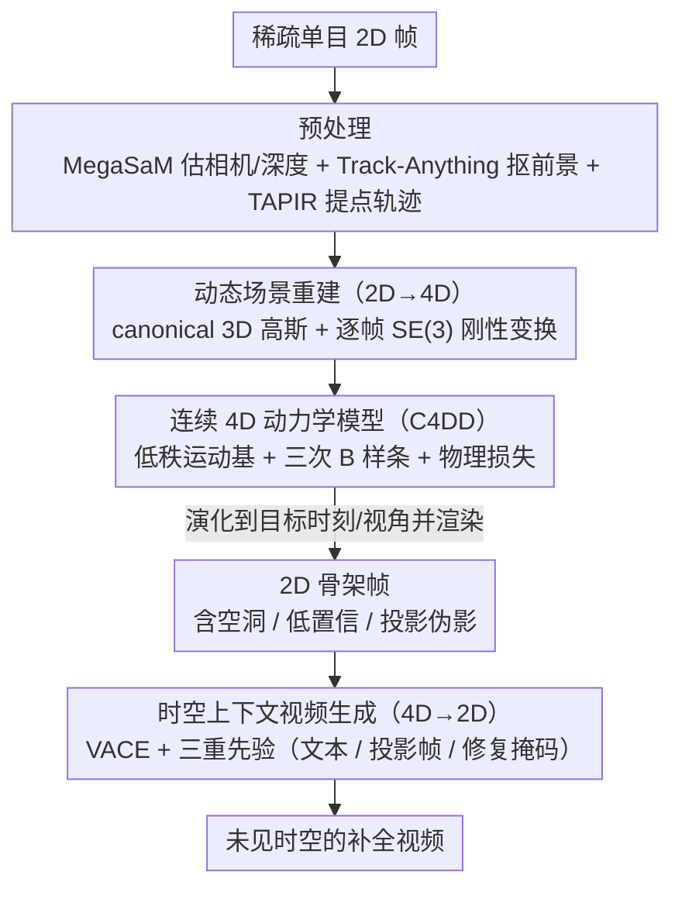

# SeeU: Seeing the Unseen World via 4D Dynamics-aware Generation

**会议**: CVPR 2026  
**arXiv**: [2512.03350](https://arxiv.org/abs/2512.03350)  
**代码**: [https://yuyuanspace.com/SeeU/](https://yuyuanspace.com/SeeU/) (数据和代码公开)  
**领域**: 视频生成  
**关键词**: 4D动态建模、连续动力学、时空生成、B样条、物理一致性

## 一句话总结
提出 SeeU，一个 2D→4D→2D 的学习框架：从稀疏单目 2D 帧重建 4D 世界表示，在低秩表示上学习连续且物理一致的 4D 动力学（B 样条参数化 + 物理约束），最后将 4D 世界重投影回 2D 并用时空上下文感知的视频生成器补全未知区域，实现跨时间和空间的未见视觉内容生成。

## 研究背景与动机

1. **领域现状**：视频生成、帧插值、帧预测等任务主要在 2D 像素或隐空间中通过端到端学习建模动态。大规模视频扩散模型（如 Sora、Wan）在分布内场景表现良好。World model 相关工作在低维隐空间中学习动态以提高效率。
2. **现有痛点**：直接在 2D 帧上建模动态存在三大根本局限：(a) 图像和视频是 4D 世界（3D 空间 + 时间）在 2D 上的离散投影，直接在 2D 上学会丢失重要的 3D 结构和时间相关性；(b) 观测混合了相机运动和场景动态，不断变化的相机位姿增加了运动的复杂性和不规则性；(c) 在复杂分布外场景（遮挡、非刚性形变等）中，缺乏 3D 或物理监督的 2D 模型经常无法捕捉真实的几何和物理动态。
3. **核心矛盾**：真实世界的运动在 4D 空间中通常是简单且有结构的（受生物/机械约束、经典力学、对称性等约束），但投影到 2D 后变得复杂且病态。在 4D 中建模动态可以自然地利用这些物理先验，但现有方法要么停留在 2D，要么在 4D 重建中缺乏连续动力学建模。
4. **本文目标** (1) 如何从稀疏单目帧重建 4D 动态场景？(2) 如何学习连续且物理一致的 4D 动力学？(3) 如何从 4D 世界生成任意时间和视角的 2D 内容？
5. **切入角度**：在原生 4D 空间中建模连续动力学的三大优势——3D 感知（显式 3D 表示处理遮挡/视角变化）、物理一致性（4D 中运动更简单，可用物理先验约束）、运动解耦（统一 4D 坐标系中相机/前景/背景可以被显式分离）。
6. **核心 idea**：通过 2D→4D→2D 的信息流动——先从 2D 提升到 4D 世界表示，在 4D 中用 B 样条学习连续物理一致动力学，再投影回 2D 并上下文补全——实现对未见时间和空间的生成。

## 方法详解

### 整体框架
SeeU 想解决的是「看见未见」：给定几帧稀疏单目视频，生成它在别的时刻（过去/插值/未来）和别的视角下本该长什么样。它的核心主张是不要在 2D 像素上直接端到端学动态，而是绕一圈——先把 2D 提升到 4D（3D 空间 + 时间）去理解世界的真实运动，再把 4D 投影回 2D 去补全画面。整条管线因此是个 2D→4D→2D 的回路：第一阶段从稀疏帧重建出一组随时间刚性变换的 3D 高斯和相机轨迹，把离散观测变成一个 4D 场景；第二阶段把这个「逐帧离散」的 4D 场景拟合成一个**连续时间函数**，让它能被查询到任意时刻；第三阶段把 4D 世界演化到目标时刻和目标视角、渲染出一张往往不完整的 2D「支架帧」，再交给视频生成器把空洞补全。

### 关键设计

**1. 动态场景重建（2D→4D）：把混在一起的相机运动和场景动态拆开，落到显式 3D 表示上**

直接在 2D 上学动态的根本麻烦是相机运动和物体运动被投影揉在了一起，且 3D 结构丢失。SeeU 借 Shape-of-Motion 框架把场景表示成一组 canonical 3D 高斯 $\{g_0^i\}_{i=1}^N$（每个带位置 $\mu_0^i$、朝向 $R_0^i$、尺度 $s^i$、不透明度 $o^i$、颜色 $c^i$），物体的运动则由逐帧的刚性变换 $T_{0 \to t} \in SE(3)$ 承载，把 canonical 帧的高斯搬到第 $t$ 帧的位置：

$$\mu_t^i = R_{0 \to t}\,\mu_0^i + t_{0 \to t}$$

选 Shape-of-Motion 而不是别的重建器，是因为它对弱视差的普通手机视频也能工作，而且能把静态背景和动态前景显式分开——这正好对应「相机运动 vs 场景动态」要解耦的诉求。重建前先用 MegaSaM 估相机参数和深度、Track-Anything 抠前景、TAPIR 提 2D 点轨迹，给重建提供监督。这一步的产物是一个能被逐帧回放、但只在观测到的离散时刻上有定义的 4D 场景。

**2. 连续 4D 动力学模型（C4DD）：把「只在采样帧上有定义」的离散运动补成一条可查询任意时刻的平滑曲线**

第一阶段重建出来的运动是离散的——每帧一组变换，帧与帧之间是空的，想插值或外推就只能线性硬猜（这也是 SoM 基线只有 15.5 PSNR 的原因）。C4DD 要把这堆离散变换拟合成连续时间函数，但有两道坎。一是**效率**：前景高斯多达约 8 万个，给每个都学一条独立轨迹既贵又容易过拟合，于是用低秩运动参数化把运动压到一组**全局共享**的运动基上，

$$P_t^i = P_0^i + B(t)\,w_i, \qquad B(t) \in \mathbb{R}^{m \times K},\ K \ll N$$

其中 $B(t)$ 是所有高斯共用的 $K$ 条运动基，$w_i$ 是每个高斯的时不变系数——这样要学的连续函数从 8 万条骤降到 $K$ 条。二是**物理一致性**：作者观察到这些运动基在 $SE(3)$ 里其实呈现出简单平滑的时间趋势（哪怕原视频里的运动看着很复杂），所以干脆用三次 B 样条来参数化运动基本身，

$$\hat{B}_t = \sum_{j=1}^{M} N_{j,d}(t)\,q_j$$

$N_{j,d}$ 是 B 样条基函数、$q_j$ 是控制点，控制点数 $M$ 直接调容量与平滑度的折中。选 B 样条而不是 MLP，正是看中它天然的平滑归纳偏置——消融里换成 MLP 后轨迹噪声明显、PSNR 掉了 3.5 个点。训练时相机和运动基联合优化，数据损失 $\mathcal{L}_{data}$ 负责贴合离散观测，物理损失 $\mathcal{L}_{phys}$ 则惩罚运动基和相机轨迹的平移/旋转加速度（且在外推区段加大权重），从根上压住非物理的突变。

**3. 时空上下文视频生成（4D→2D）：用 4D 渲染出的「半成品」当骨架，让视频生成器只补真正没见过的部分**

有了连续动力学，就能把 4D 世界演化到任意时间戳和相机位姿，渲染出一张 2D 投影当作视频的「骨架」。但这张骨架天生有三类空缺：从未被观测过的区域（新视角或遮挡处）、投影高斯置信度太低的区域、以及深度不连续处的投影伪影。SeeU 不让生成器从零猜，而是把骨架和缺口信息一起喂给 VACE 视频生成模型，注入三重上下文先验——VLM 生成的结构化文本提示（管「该生成什么」的全局语义和修复指示）、投影帧本身（管「几何和光度长什么样」的结构参考）、以及逐帧的修复掩码（管「在哪儿生成」的空间标记）。这三者合起来给生成器一条从语义、结构到空间位置的完整指令链，让它只在标出来的不确定区域里补细节，而不会把已经重建对的几何也一起改坏。

### 一个完整示例：把一段 10 帧手机视频「看见」它的未来

以一段 10 帧、960×540 的单目片段为例。Stage 1 先把它重建成约 8 万个前景高斯 + 8 万个背景高斯，配上 10 个运动基和逐帧相机位姿——此时这个 4D 场景只在这 10 个时刻上「有画面」。Stage 2 用 8 个控制点的三次 B 样条把这 10 个离散运动基拟合成连续曲线，物理损失把外推段的加速度压平；现在场景可以被查询到第 10 帧之后的任意时刻。要预测「未来」时，就把 B 样条外推到目标时间戳、按目标相机渲染出一张 2D 骨架帧——画面里物体大致在对的位置，但因为相机往前推、有些区域从没被看到，骨架上留着空洞和低置信块。最后 Stage 3 把骨架、修复掩码和 VLM 文本提示一起送进 VACE，只在掩码标出的空缺处补画，输出一段几何连贯、未见区域也合理的未来视频。整条路走下来，PSNR 从 SoM 直接外推的 15.4 抬到了 20.5。

### 损失函数 / 训练策略
- Stage 1：80K 前景 + 80K 背景高斯，10 个运动基，4000 迭代，典型 10 帧 960×540 约 1 小时
- Stage 2：三次 B 样条（degree=3），8 个控制点，$\lambda_{phy} = 1 \times 10^{-4}$，lr=1e-5，batch=64，1000 epoch 约 10 分钟
- Stage 3：在多语义掩码分布上微调 VACE，约 2 小时
- 所有阶段在单块 A100 80GB 上完成

## 实验关键数据

### 主实验
时间域未见生成（SeeU45 数据集）：

| 方法 | Past PSNR↑ | Interp PSNR↑ | Future PSNR↑ | Past LPIPS↓ | Interp LPIPS↓ | Future LPIPS↓ |
|------|-----------|-------------|-------------|------------|--------------|--------------|
| SoM | 15.55 | 16.37 | 15.43 | 0.388 | 0.356 | 0.389 |
| InterpAny | - | 20.54 | - | - | 0.242 | - |
| VACE | 17.14 | 18.16 | 17.71 | 0.367 | 0.359 | 0.354 |
| **SeeU** | **20.47** | **21.07** | **20.54** | **0.248** | **0.227** | **0.243** |

空间域未见生成（EE↓越低越好，EIR↑越高越好）：

| 方法 | Dolly Out EE↓ | EIR↑ | CLIP-V↑ |
|------|-------------|------|---------|
| ReCamMaster | 0.238 | 0.674 | 0.937 |
| **SeeU** | **0.200** | **0.785** | **0.969** |

### 消融实验

| 配置 | PSNR↑ | LPIPS↓ | EE↓ | CLIP-V↑ |
|------|-------|--------|-----|---------|
| C4DD w/ MLP | 17.54 | 0.427 | 0.313 | 0.739 |
| w/o physics loss | 19.36 | 0.274 | 0.224 | 0.920 |
| 5 frames input | 18.36 | 0.305 | 0.285 | 0.928 |
| 10 frames input | 20.16 | 0.251 | 0.204 | 0.955 |
| 15 frames input | 20.39 | 0.241 | 0.200 | 0.958 |
| **20 frames input** | **21.08** | **0.239** | **0.197** | **0.960** |

### 关键发现
- **B 样条 >> MLP**：MLP 变体 PSNR 降低 3.5 个点，LPIPS 增加 0.19，说明 B 样条的平滑归纳偏置对连续动力学建模至关重要——MLP 虽然能拟合趋势但轨迹噪声大。
- **物理损失很重要**：去掉 $\mathcal{L}_{phys}$ 后帧间一致性显著下降，尤其在外推区域。
- **对稀疏输入鲁棒**：从 20 帧减到 5 帧时 PSNR 仅下降约 2.7，C4DD 能在极稀疏观测下保持合理的时间连续性。
- **时间预测误差近似线性增长**：外推精度与时间距离大致线性衰减，符合物理直觉。
- SeeU 在三个时间子任务（过去推断、动态插值、未来预测）上全面超越各专项模型。

## 亮点与洞察
- **2D→4D→2D 的信息流设计理念**：不直接在 2D 上做端到端学习，而是先提升到 4D 理解世界再回到 2D 生成，这种"理解优先"的范式与单纯数据驱动的生成形成鲜明对比。可迁移思路：对于任何涉及物理规律的生成任务，先在物理空间建模再投影到观测空间可能更好。
- **低秩运动参数化 + B 样条**：两层简化——先用低秩分解将 80K 个高斯的运动压缩到 10 个基函数，再用 B 样条将离散基函数连续化。这种逐层简化复杂动力学的策略优雅高效。
- **未见区域补全的三重先验注入**：文本语义 + 投影结构 + 空间掩码的组合为视频生成器提供了从"应该生成什么"到"在哪里生成"的完整指导链。

## 局限与展望
- 受限于底层模块（跟踪、相机估计、4D 重建）的质量——小目标、缺乏纹理的前景会导致失败
- 当前聚焦于具有显著、平滑、时间稳定前景运动的场景，对高度非刚性或突变运动支持有限
- Stage 1 的 4D 重建（~1 小时）是效率瓶颈，难以实时应用
- SeeU45 数据集仅 45 个场景，虽然覆盖多样但规模较小
- 外推精度随时间线性衰减，长程预测的物理一致性仍需改进

## 相关工作与启发
- **vs Shape-of-Motion (SoM)**: SeeU 的 Stage 1 基于 SoM，但 SoM 仅提供离散帧级重建，时间外推只能线性插值/外推，效果差（PSNR 15.5）。SeeU 在 SoM 基础上加了连续动力学建模和上下文补全，PSNR 提升到 20.5。
- **vs VACE**: VACE 是纯 2D 的视频帧修复方法，没有 3D 感知。SeeU 为 VACE 提供了 4D 投影的支架帧和精确掩码，让 VACE 不再需要猜测几何结构。
- **vs ReCamMaster**: 相机可控视频生成模型，但缺乏显式 3D 重建。SeeU 在几何一致性（EE/EIR）和场景连贯性（CLIP-V）上全面超越。
- **vs 物理感知视频生成**: 之前的方法要么先生成后物理模拟、要么先模拟后生成、要么用蒸馏的物理先验引导生成。SeeU 直接从多帧观测推断确定性动力学并作为生成的物理骨架，是一种新范式。

## 评分
- 新颖性: ⭐⭐⭐⭐⭐ 2D→4D→2D 的信息流设计理念创新，在原生 4D 空间中学习连续动力学是全新思路
- 实验充分度: ⭐⭐⭐⭐ 覆盖时间和空间两大维度、消融充分，但数据集规模较小（45 场景）
- 写作质量: ⭐⭐⭐⭐⭐ 动机论述深刻（Section 2 单独分析为何要在 4D 中建模），图表清晰
- 价值: ⭐⭐⭐⭐ 为物理一致的视频生成和 world model 开辟了新方向，但实用性受限于效率和场景限制

<!-- RELATED:START -->

## 相关论文

- [\[AAAI 2026\] Seeing the Unseen: Zooming in the Dark with Event Cameras](../../AAAI2026/video_generation/seeing_the_unseen_zooming_in_the_dark_with_event_cameras.md)
- [\[CVPR 2026\] VerseCrafter: Dynamic Realistic Video World Model with 4D Geometric Control](versecrafter_dynamic_realistic_video_world_model_with_4d_geometric_control.md)
- [\[CVPR 2026\] Endless World: Real-Time 3D-Aware Long Video Generation](endless_world_real-time_3d-aware_long_video_generation.md)
- [\[CVPR 2026\] Open-world Hand-Object Interaction Video Generation Based on Structure and Contact-aware Representation](open-world_hand-object_interaction_video_generation_based_on_structure_and_conta.md)
- [\[CVPR 2026\] UnityVideo: Unified Multi-Modal Multi-Task Learning for Enhancing World-Aware Video Generation](unityvideo_unified_multi-modal_multi-task_learning_for_enhancing_world-aware_vid.md)

<!-- RELATED:END -->
