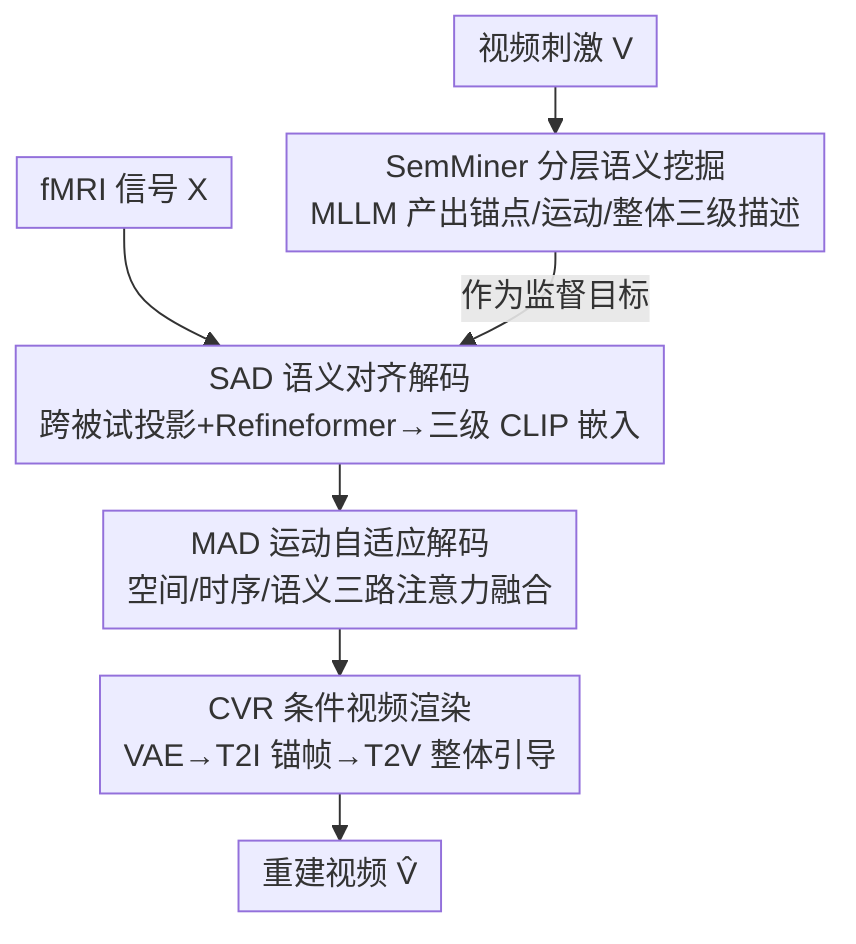

# SemVideo: Reconstructs What You Watch from Brain Activity via Hierarchical Semantic Guidance

**会议**: CVPR 2026  
**论文**: [CVF Open Access](https://openaccess.thecvf.com/content/CVPR2026/html/Yang_SemVideo_Reconstructs_What_You_Watch_from_Brain_Activity_via_Hierarchical_CVPR_2026_paper.html)  
**代码**: https://github.com/yang-minghan/SemVideo  
**领域**: 视频生成  
**关键词**: fMRI 视频重建, 脑活动解码, 分层语义引导, 文本到视频扩散, 跨被试解码

## 一句话总结
SemVideo 先用多模态大模型把视频刺激拆成"锚点描述/运动叙事/整体摘要"三级语义，再从 fMRI 信号分层解码出这些语义、用三路注意力重建运动潜变量，最后让文本到视频扩散模型在这套分层语义引导下生成视频，从而显著改善脑活动到视频重建中的"外观不一致"和"运动不连贯"两大顽疾。

## 研究背景与动机

**领域现状**：从脑活动（尤其是非侵入式 fMRI）重建外部视觉刺激是认知神经科学的核心任务之一。借助 NSD 等大规模 fMRI-图像配对数据和文本到图像扩散模型，**静态图像**的脑重建已取得高质量结果；近年也有人把它扩展到**视频**重建，如 MinD-Video、NeuroClips、Mind-Animator 等。

**现有痛点**：fMRI 依赖缓慢的血氧（BOLD）血流动力学响应，会把数秒内的脑活动积分在一起，难以捕捉视频里的快速运动变化。因此当前 fMRI-to-video 方法普遍有两个毛病：(i) 跨帧显著物体的视觉表征不一致，导致**外观错配**（appearance mismatch）；(ii) 时序连贯性差，导致**运动错位或帧间突变**（motion misalignment）。

**核心矛盾**：根源在于**语义监督欠规约**——现有方法因缺少好的视频字幕模型，往往拿图像字幕模型（GIT、BLIP）逐帧打标，只得到一串零散的静态短描述，既抓不住时序动态、也抓不住细粒度语义，下游生成自然既不连贯也不准。

**本文目标**：(1) 给 fMRI-to-video 提供既含静态又含运动、还有全局摘要的**分层语义监督**；(2) 把这套语义稳健地从带噪、跨被试维度不一的 fMRI 信号里解码出来；(3) 让运动潜变量与语义对齐，生成外观一致、运动连贯的视频。

**切入角度**：受神经科学启发——人脑因视觉暂留与延迟记忆是**离散地**感知视频的，只有关键帧才引发强响应，大脑抓的是关键语义而非逐像素。于是作者主张"重点解码关键语义层级"而非逐帧逐像素对齐，这更贴合人类视觉系统的高效本质。

**核心 idea**：用分层语义（锚点/运动/整体）作为 fMRI 与视频之间的**中间目标**，先把脑信号解码成这三级语义、再据此分阶段引导 T2V 扩散生成。

## 方法详解

### 整体框架
SemVideo 的输入是 fMRI 信号（训练时另有对应的视频刺激用于构造监督），输出是重建的视频。整条管线四段串联：**SemMiner** 用 MLLM 把视频刺激拆成三级文本语义（锚点描述 $C_{anchor}$、运动叙事 $C_{motion}$、整体摘要 $C_{holi}$）作为监督目标；**SAD（Semantic Alignment Decoder）** 把跨被试的 fMRI 信号解码成这三级 CLIP 语义嵌入；**MAD（Motion Adaptation Decoder）** 在解码出的运动语义引导下，用三路注意力重建运动潜变量；**CVR（Conditional Video Render）** 把运动潜变量、锚点帧与整体语义逐级喂给 T2I/T2V 扩散模型，渲染出最终视频。

### 关键设计

**1. SemMiner 分层语义挖掘：用"先收缰再发散"的两阶段拆出三级语义**

针对"图像字幕逐帧打标导致语义欠规约"的痛点，SemMiner 基于 MLLM 把视频拆成三个互补视角：$C_{anchor}$ 捕捉首帧静态内容作语义锚、$C_{motion}$ 聚焦动作与动态转变、$C_{holi}$ 是整段视频的全局摘要。它分两阶段：第一阶段先用 MLLM $\Psi$ 生成一个限长 20 词的基础摘要 $C_{basic}=\Psi(P_{basic},V)$，作为"缰绳"防止后续多样化描述发散跑题（类比勒住脱缰的马），限长保证只抓最核心内容、不引入过强先验；第二阶段在 $V$ 和 $C_{basic}$ 条件下，用各自定制指令 $P_L$ 生成目标语义 $C_L=\Psi(P_L,C_{basic},V),\ L\in\{anchor,motion,holi\}$。作者还据此把 CC2017 扩成带三级描述的 CC2017-SE 数据集。这套分层监督模拟了人类"先抓大意再补细节"的回忆方式。

**2. SAD 语义对齐解码：跨被试地把 fMRI 解成三级 CLIP 语义**

针对不同被试激活体素数不同、fMRI 带噪的痛点，SAD 把脑信号 $X\in\mathbb{R}^{D_m}$ 解码成预测语义 $\hat{Z}(C_L)\in\mathbb{R}^{77\times768}$。它先用**被试专属**投影层 $f_{SAD}^{\theta_m}$ 把不同维度的 $X$ 投到统一潜空间 $X'$，再用**被试共享**编码器 $f_{SAD}$（四层 MLP + 一个因果 Transformer 即 Refineformer）映射到 CLIP 文本特征空间。Refineformer 用扩散去噪式的 $\mathcal{L}_{refine}=\mathbb{E}_{t}\|f^{Refine}_{SAD}(Z^t_L,t,f^{MLP}_{SAD}(X'))-Z(C_L)\|^2$ 最大化提取有意义神经活动、压制噪声。训练总目标 $\mathcal{L}_{SAD}=\lambda_{refine}\mathcal{L}_{refine}+\lambda_{SoftCLIP}\mathcal{L}_{SoftCLIP}+\mathcal{L}_{MSE}$，其中 SoftCLIP 是软标签对比损失、把预测与真值语义在 batch 内对齐，MSE 直接回归。"专属投影 + 共享映射"的设计让一个模型可处理多被试又保留个体差异。

**3. MAD 运动自适应解码：三路注意力让运动潜变量同时贴合结构与语义**

针对 fMRI 时间分辨率低、难重建连贯动作的痛点，MAD 先用被试专属投影 $f^{proj}_{MAD}$ 把 $X$ 投入潜空间、经 Motion Embedder 得到帧序列嵌入 $S$，再做**三路融合注意力**：(i) 空间自注意力 $E_{spat}=\mathrm{Softmax}(Q_{spat}K^\top_{spat}/\sqrt{d})V_{spat}$ 抓帧内结构；(ii) 时序自注意力沿时间轴建模帧间依赖；(iii) **语义引导交叉注意力** $E_{cross}=\mathrm{Softmax}(Q_{cross}K^\top_{cross}/\sqrt{d})V_{cross}$，其中 key/value 由 SAD 解出的运动语义 $\hat{Z}(C_{motion})$ 提供，把语义先验显式注入注意力。三者加权求和 $\hat{e}_i=\lambda_{spat}e^{spat}_i+\lambda_{temp}e^{temp}_i+e^{cross}_i$ 得到每帧运动潜变量。训练用 L1 重建 + 双向对比损失，让重建潜变量 $\hat{e}_i$ 既逼近真值 $e_i$ 又在序列内可区分，从而对齐"空间结构 + 语义动作"。

**4. CVR 条件视频渲染：把三级线索逐级注入扩散生成**

针对"如何把解码出的语义/运动稳定地变成连贯视频"的痛点，CVR 是一个顺序推理框架，逐级整合 fMRI 线索：先把 MAD 输出的运动潜变量 $\hat{E}(X)$ 经预训练 VAE 解码出一串（较模糊的）运动帧 $\{I^{motion}_i\}$；再把锚点语义 $\hat{Z}(C_{anchor})$ 与首个运动帧送入 T2I 模型生成清晰的初始锚点帧 $\hat{v}_1$；最后用预训练 T2V 生成器（采用 AnimateDiff），由整体语义 $\hat{Z}(C_{holi})$、锚点帧 $\hat{v}_1$、运动帧序列三者**联合引导**，合成既时序平滑又语义忠实的最终视频 $\hat{V}=\Phi(\hat{Z}(C_{anchor}),\hat{Z}(C_{holi}),\hat{E}(X))$。这种"先粗运动、再定锚帧、再整体成片"的渐进条件化，正对应锚点/运动/整体三级语义。

## 实验关键数据

数据集为 CC2017（3 名被试观看 23 段高清自然影片，3T fMRI）与 HCP 7T 子集（3 名被试）。评测分三层：语义级（2-way/50-way 检索，I=帧级/V=视频级；VIFI-score 为 VIFICLIP 特征余弦相似度）、像素级（SSIM、PSNR、Hue-PCC）、时空级（CLIP-PCC 即相邻帧 CLIP 嵌入相似度，VIFI<0.6 时置 0 防虚高；EPE 即预测与真值光流的平均端点误差，越低越好）。⚠️ 各指标定义以原文为准。

### 主实验（CC2017，节选代表性指标）

| 方法 | 2-way-V↑ | 50-way-V↑ | VIFI↑ | SSIM↑ | Hue-pcc↑ | CLIP↑ | EPE↓ |
|------|----------|-----------|-------|-------|----------|-------|------|
| Mind-Video (NeurIPS'23) | 0.848 | 0.197 | 0.593 | 0.177 | 0.768 | 0.409 | 6.125 |
| NeuroClips (NeurIPS'25) | 0.834 | 0.220 | 0.602 | **0.390** | 0.812 | 0.513 | 4.833 |
| Mind-Animator (ICLR'25) | 0.830 | 0.186 | **0.608** | 0.321 | 0.786 | 0.425 | 5.422 |
| NEURONS (ICCV'25) | 0.853 | 0.246 | 0.597 | 0.285 | 0.830 | 0.482 | 4.827 |
| **SemVideo (Ours)** | **0.865** | **0.264** | **0.608** | 0.321 | **0.849** | **0.526** | **4.788** |

SemVideo 在 10 个指标中 8 个达 SOTA：语义级 2-way-V 0.865、50-way-V 0.264 领先，VIFI 与 Mind-Animator 并列最高（0.608）；像素级 Hue-pcc 0.849 最高，SSIM/PSNR 接近最优；时空级 CLIP 0.526 最高、EPE 4.788 最低，说明运动连贯性最好。HCP 数据集上同样取得最优语义与时空指标，验证跨数据集泛化。

### 消融实验（去掉 SAD 不同语义解码目标，CC2017）

| 配置 | 2-way-V↑ | 50-way-V↑ | VIFI↑ | Hue-pcc↑ | CLIP↑ | EPE↓ |
|------|----------|-----------|-------|----------|-------|------|
| Ours (full) | **0.860** | **0.239** | **0.590** | **0.841** | **0.502** | 4.768 |
| w/o $C_{anchor}$ | 0.808 | 0.147 | 0.534 | 0.835 | 0.488 | 4.796 |
| w/o $C_{holi}$ | 0.849 | 0.221 | 0.584 | 0.834 | 0.490 | 4.859 |
| w/o $C_{motion}$ | 0.846 | 0.216 | 0.583 | 0.741 | 0.481 | **4.930** |

### 关键发现
- 三级语义缺一不可，但作用各异：去掉 $C_{anchor}$ 语义级掉得最狠（50-way-V 0.239→0.147），说明锚点描述是物体外观一致性的主要支柱；去掉 $C_{motion}$ 则 Hue-pcc 与 EPE 明显变差（EPE 4.768→4.930），印证运动叙事专管时空连贯。
- SemVideo 的强项在时空连贯（CLIP、EPE 双第一），能重建"人转头"等前作难处理的连贯动作，验证了"分层语义中间目标 + 三路注意力"对运动错位的针对性。
- 像素级 SSIM/PSNR 并非全面第一（略逊 NeuroClips），说明该方法更偏向语义与运动忠实而非逐像素低层保真——这与其"重点解码关键语义"的出发点一致。

## 亮点与洞察
- **把"分层语义"当 fMRI 与视频之间的中间目标**是最核心的"啊哈"点：既绕开了"逐像素对齐低时间分辨率 fMRI"的死结，又用锚点/运动/整体三视角分别对症外观一致与运动连贯，思路清晰可迁移到其它脑解码生成任务。
- **SemMiner 的"先收缰（限长基础摘要）再发散"两阶段提示**很巧，用一个 20 词 rein 防 MLLM 生成跑偏，是控制大模型自由发挥的可复用技巧。
- **被试专属投影 + 被试共享映射**的跨被试设计，让单一框架兼顾多被试与个体差异，对脑解码这种"每人体素数不同"的数据形态是实用范式。

## 局限与展望
- 重度依赖外部预训练大模型链（MLLM 打标、CLIP、VAE、T2I、T2V/AnimateDiff），生成质量与误差受这些现成模型限制，且 SemMiner 标注质量直接决定监督上限。
- 仅在 CC2017、HCP 各 3 名被试上验证，跨更多被试/不同采集设备的泛化与个体差异鲁棒性仍有限。
- 像素级保真（SSIM/PSNR）并非全面领先，对需要精细低层细节的场景可能不足；fMRI 固有的慢血流动力学瓶颈也限制了对极快运动的还原。

## 相关工作与启发
- **vs MinD-Video / Brain Netflix（掩码脑建模映射到统一潜空间）**：它们把 fMRI 映到单一潜空间驱动扩散，语义监督粗；SemVideo 改用分层文本语义作显式中间目标，外观与运动分而治之。
- **vs NeuroClips / Mind-Animator（对齐 CLIP/VAE 深特征）**：这类方法对齐预训练深特征但语义仍欠规约、运动连贯差；SemVideo 用 SemMiner 提供细粒度运动叙事 + MAD 语义引导注意力，时空连贯（CLIP/EPE）显著更优。
- **vs 逐帧图像字幕监督的早期做法**：逐帧静态短描述抓不住动态与细粒度语义；SemVideo 的运动叙事 $C_{motion}$ 与整体摘要 $C_{holi}$ 正是补上这块缺口。

## 评分
- 新颖性: ⭐⭐⭐⭐ "分层语义作中间目标 + 三路注意力运动解码"在 fMRI-to-video 里是有针对性的新组合，但底层模块多为成熟扩散/注意力部件。
- 实验充分度: ⭐⭐⭐⭐ 两数据集、三层级 10 指标、含语义解码目标消融与神经科学 ROI 可视化，较充分；被试规模偏小。
- 写作质量: ⭐⭐⭐⭐ 动机与三级语义叙事清晰、图表完整，但公式与符号排版需对照原文确认。
- 价值: ⭐⭐⭐⭐ 在脑活动视频重建上刷新多数 SOTA 并开放 CC2017-SE 数据集，对神经解码与脑机接口研究有价值。

<!-- RELATED:START -->

## 相关论文

- [\[CVPR 2026\] What Are You Doing? A Closer Look at Controllable Human Video Generation](what_are_you_doing_a_closer_look_at_controllable_human_video_generation.md)
- [\[CVPR 2026\] CineBrain: A Large-Scale Multi-Modal Audiovisual Brain Dataset for Brain-Conditioned Video Generation](cinebrain_a_large-scale_multi-modal_audiovisual_brain_dataset_for_brain-conditio.md)
- [\[CVPR 2026\] ActivityForensics: A Comprehensive Benchmark for Localizing Manipulated Activity in Videos](activityforensics_a_comprehensive_benchmark_for_localizing_manipulated_activity_.md)
- [\[ICML 2026\] iTryOn: Mastering Interactive Video Virtual Try-On with Spatial-Semantic Guidance](../../ICML2026/video_generation/itryon_mastering_interactive_video_virtual_try-on_with_spatial-semantic_guidance.md)
- [\[CVPR 2026\] YOSE: You Only Select Essential Tokens for Efficient DiT-based Video Object Removal](yose_you_only_select_essential_tokens_for_efficient_dit-based_video_object_remov.md)

<!-- RELATED:END -->
