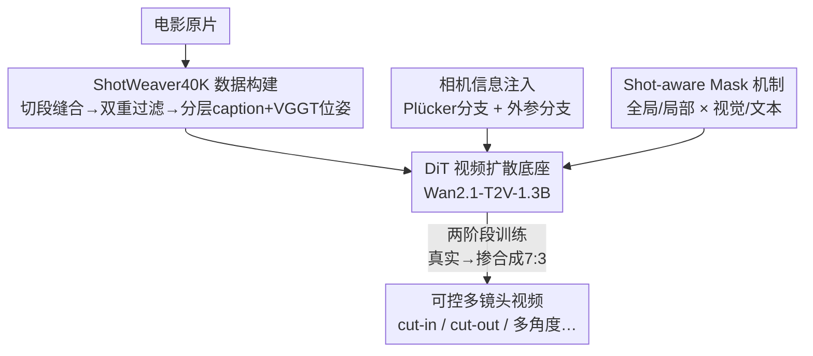

# ShotDirector: Directorially Controllable Multi-Shot Video Generation with Cinematographic Transitions

**会议**: CVPR 2026  
**论文**: [CVF Open Access](https://openaccess.thecvf.com/content/CVPR2026/html/Wu_ShotDirector_Directorially_Controllable_Multi-Shot_Video_Generation_with_Cinematographic_Transitions_CVPR_2026_paper.html)  
**代码**: [项目页](https://uknowsth.github.io/ShotDirector/)  
**领域**: 视频生成 / 扩散模型  
**关键词**: 多镜头视频生成、镜头转场、相机控制、扩散模型、影视剪辑

## 一句话总结
ShotDirector 把"镜头转场该怎么剪"当成可控信号，给视频扩散模型同时注入参数级相机位姿（双分支 Plücker + 外参）和分层的剪辑模式感知提示（shot-aware mask），训练出能按导演意图生成 cut-in / cut-out / shot-reverse-shot / multi-angle 等专业转场的多镜头视频。

## 研究背景与动机
**领域现状**：基于扩散的单镜头视频生成已经能合成高保真、时序连贯的画面，于是研究重心转向**多镜头视频生成**——希望靠镜头之间的转场（shot transition）来讲一个有电影感的故事。现有路线大体分两类：一类是 shot-by-shot（StoryDiffusion、VideoStudio、VGoT），先各自生成关键帧再串起来，靠外部约束保持跨镜头一致性；另一类是端到端（Mask2DiT、CineTrans、LCT、MoGA），改造扩散模型让不同镜头在模型内部互相交互。

**现有痛点**：这两类方法都只盯着"低层视觉一致性"——人物长得一样、风格连贯——却**完全忽略了转场本身是怎么设计的**。shot-by-shot 方法更像在生成"一串相关的帧"，根本没探索转场；端到端方法虽然能切镜头，但把转场当成"画面的突变"（abrupt frame change），既不可控也没有语义意图。结果就是镜头机械地一个接一个换，没有任何 film-editing pattern（电影剪辑章法）。

**核心矛盾**：转场是导演语言的核心——它决定下一个镜头**该怎么展开**（往近推是 cut-in、拉远是 cut-out、对话来回切是 shot/reverse shot）。但现有模型缺两样东西：① 对**相机运动**的精确参数化控制（视角怎么变是转场的物理基础）；② 对**剪辑模式**的高层语义理解（这次转场属于哪种章法、承担什么叙事功能）。只给一句扁平的 prompt，模型既不知道相机往哪走，也不知道这是哪类转场。

**本文目标**：把"转场设计"显式建模为可控条件，让模型既能精确控制相机、又能理解专业剪辑模式，从而生成有电影感、叙事连贯的多镜头视频。

**核心 idea**：从两个互补视角控制转场——**参数级相机设置**（双分支注入 6-DoF 位姿与内参）+ **语义级分层提示**（shot-aware mask 把全局/局部、视觉/文本信息结构化对齐），再配一个专门标注了剪辑模式的数据集 ShotWeaver40K 把这些先验喂进扩散过程。

## 方法详解

### 整体框架
ShotDirector 以 Wan2.1-T2V-1.3B（一个 DiT 视频扩散模型）为底座，要解决的是"让生成的多镜头视频带专业转场"。整条管线分三块：先构建带细粒度剪辑标注的数据集 **ShotWeaver40K**（从电影原片切段、过滤、再用 GPT-5-mini 写分层 caption、用 VGGT 估相机位姿）；再把两路条件信号灌进 DiT——**相机信息注入**用双分支（Plücker + 外参）把每个镜头的 6-DoF 位姿编码进 visual token，**shot-aware mask 机制**用一张注意力掩码把全局/局部、视觉/文本信息结构化地对齐到各自镜头；最后用两阶段训练（先真实数据、再掺合成数据）让模型既学会转场、又能稳定地用相机信息当辅助引导。输出就是一段符合指定转场类型、跨镜头一致的多镜头视频。

### 关键设计

**1. ShotWeaver40K：把"剪辑章法"显式标进数据的转场感知数据集**

模型学不会专业转场，根子在于训练数据里就没有"这是哪种转场、相机怎么动"的标注。作者从电影原片出发设计了一条精炼的数据 pipeline（图 3a）：先用 shot segmentation 把原片切成单镜头、再用 similar-segment stitching 把语义连贯的镜头缝成多镜头序列；接着两道过滤——**初筛**按分辨率、帧率、美学分卡基线质量（且美学打分特别盯转场前后相邻帧的清晰度），**转场过滤**要求转场前后内容要有足够变化但又保持因果/空间连续性，太像或太不像（让人看不懂这是同一场戏的切换）的都被剔除，避免给模型制造混淆。标注阶段做两件事：用 GPT-5-mini 生成 script 级分层 caption（subject、整体描述、逐镜头描述、转场类型及描述），用 VGGT 估计每个镜头相对第一个镜头的相机旋转/平移并写成矩阵。作者按 [16] 聚焦四类最常用的电影转场——**shot/reverse shot**（对话双方视角交替）、**cut-in**（推到同一主体的更近景）、**cut-out**（拉到更宽的环境景）、**multi-angle**（同一动作换视角），给可控转场建模提供了清晰的结构。这套带剪辑先验的标注，正是后面模型能"按章法剪"的前提。

**2. 相机信息注入：双分支把 6-DoF 位姿当作转场的物理条件**

转场的本质很大程度上是相机怎么动（焦点中心、机位角度），但扁平 prompt 表达不了精确的视角变化。作者把相机位姿当成关键条件信号，设计**双分支**互补地注入 DiT。相机位姿由内参 $K\in\mathbb{R}^{3\times3}$ 和外参 $E=[R;t]\in\mathbb{R}^{3\times4}$ 定义。**外参分支**直接用 MLP 把外参打平后注入：

$$C_{\text{extrinsic}}=MLP(\text{flatten}(E))$$

它虽然不含焦距等内参，但能有效捕获机位朝向。**Plücker 分支**则把每个像素 $(u,v)$ 的视线射线编码成 6 维 Plücker 表示：

$$p_{u,v}=(o\times d_{u,v},\,d_{u,v})\in\mathbb{R}^6,\qquad d_{u,v}=RK^{-1}[u,v,1]^T$$

其中 $o$ 是世界系下的相机中心、$d_{u,v}$ 是从相机指向像素的视线方向（归一化为单位长度）；整帧的 Plücker embedding $P\in\mathbb{R}^{h\times w\times6}$ 过卷积得到 $C_{\text{Plücker}}=Conv(P)$。两路信号在自注意力前直接加到第 $i$ 个镜头的 visual token 上：$z_i'=z_i+C_{\text{extrinsic},i}+C_{\text{Plücker},i}$。一路给"机位朝向"的粗粒度线索、一路给"逐像素射线"的细粒度几何，模型因此能 refine 视角切换、抑制跨镜头的非预期跳变。消融里 Plücker 分支比外参分支略强，正是因为它带内参和空间射线图，更利于解读转场中的位姿变化。

**3. Shot-aware Mask 机制：用注意力掩码把全局/局部、视觉/文本分层对齐**

光有相机参数还不够，模型还得理解"这次转场属于哪种剪辑模式"。作者引入 **shot-aware mask**，在 DiT 的注意力里约束每个 token 只跟它该看的上下文交互：

$$\mathrm{Attn}_{\text{shot-aware}}(z_i')=\mathrm{Attn}(q_{z_i'},K^*,V^*),\quad K^*=[K^{global}_i,K^{local}_i],\ V^*=[V^{global}_i,V^{local}_i]$$

视觉上，**local** 指当前镜头内的所有 token，**global** 指整段视频第一帧的 token——这样每个镜头既能看到整体场景上下文、又保留自己的镜头特有细节（为促进早期充分的全局交互，前几层先让所有 token 互相可见）。文本上，**local** 是镜头专属描述和摄影线索，**global** 是共享的主体属性、整体叙事和**转场语义**。这种结构化可见性的关键在于：subject label 跨镜头保持一致性，而 transition 语义把"专业剪辑模式"的先验显式注入——于是模型在"全局一致"和"镜头多样"之间能精细平衡。消融印证了这个分工：**视觉掩码**对转场控制影响更大（去掉后全局可见的视觉 token 会导致跨镜头信息泄漏、削弱转场差异），**语义掩码**主要影响一致性。

### 损失函数 / 训练策略
基于 [41] 训练。外参分支用 [4] 的相机编码器初始化、接一个零初始化的 MLP transfer layer 连进 DiT，Plücker 分支随机初始化。warm-up 阶段只训双分支编码器（外参分支只训 transfer layer），之后解冻自注意力联合优化。由于真实数据的相机位姿不如合成数据可靠，采用**两阶段训练**：第一阶段在 ShotWeaver40K 上训（lr $1\times10^{-4}$，10,000 步）学会转场；第二阶段掺入 SynCamVideo 合成数据、按真实:合成 = 7:3（lr $5\times10^{-5}$，3,000 步）强化对转场设计的理解，让相机信息成为稳定可控的辅助引导。

## 实验关键数据

### 评测设置
评测集含 90 条带分层 caption 和相机位姿的 prompt，从三个维度评估：**转场控制**（TransNetV2 算 Transition Confidence、Qwen 判 Transition Type Accuracy）、**整体质量**（美学预测器、成像质量模型、ViCLIP 文本-视频对齐、FVD）、**跨镜头一致性**（ViCLIP 语义一致 + 相邻镜头主体/背景视觉一致）。相机控制另用 RotErr / TransErr 衡量。

### 主实验
| 方法 | 转场置信度↑ | 类型准确率↑ | 美学↑ | FVD↓ | 视觉一致性↑ |
|------|-----------|-----------|------|------|-----------|
| Mask2DiT | 0.2233 | 0.2033 | 0.5958 | 69.49 | 0.7779 |
| CineTrans | 0.7976 | 0.3944 | 0.6305 | 71.89 | 0.7851 |
| Phantom | - | 0.6211 | 0.6183 | 86.61 | 0.5709 |
| HunyuanVideo | 0.4698 | 0.3222 | 0.6101 | 69.88 | 0.6601 |
| Wan2.2 | 0.2165 | 0.1022 | 0.5885 | 69.48 | 0.7547 |
| SynCamMaster | - | 0.3033 | 0.5453 | 72.47 | **0.8418** |
| **ShotDirector** | **0.8956** | **0.6744** | **0.6374** | **68.45** | 0.8251 |

ShotDirector 在转场控制上大幅领先（置信度 0.8956 vs 次优 CineTrans 0.7976；类型准确率 0.6744 vs 次优 Phantom 0.6211），整体质量与 FVD（68.45，最接近真实电影分布）均最优。SynCamMaster 的视觉一致性最高（0.8418），但作者指出那是用强相机约束换来的——其美学（0.5453）和语义一致性都很差，说明一致性是以视觉保真度为代价的；ShotDirector 一致性排第二却同时保住了质量。

### 消融实验
| 配置 | 转场置信度↑ | 类型准确率↑ | FVD↓ | 视觉一致性↑ | 说明 |
|------|-----------|-----------|------|-----------|------|
| 完整模型 | 0.8956 | 0.6744 | 68.45 | 0.8251 | full |
| w/o Shot-aware Mask | 0.7572 | 0.5422 | 70.36 | 0.7910 | 去掉整套掩码，转场控制明显下滑 |
| w/o Visual Mask | 0.8044 | 0.5583 | 69.47 | 0.8052 | 视觉掩码对转场控制影响更大 |
| w/o Semantic Mask | 0.8913 | 0.6428 | 71.54 | 0.7761 | 语义掩码主要影响一致性 |
| w/o Stage II 训练 | 0.8615 | 0.6300 | 68.97 | 0.8076 | 少了掺合成的二阶段，转场略退 |
| w/o Training | 0.1402 | 0.2489 | 70.71 | 0.8256 | 完全没训练，转场几乎消失 |

相机信息的单独消融（RotErr / TransErr）：完整模型 0.5907 / 0.5393，w/o Camera Info 退到 0.6330 / 0.5740，w/o Plücker 分支 0.6262 / 0.5727，w/o 外参分支 0.5972 / 0.5445——两路分支都有正贡献，Plücker 分支略强。

### 关键发现
- **视觉掩码 vs 语义掩码分工明确**：去掉视觉掩码转场置信度从 0.8956 掉到 0.8044（全局可见的视觉 token 会跨镜头泄漏信息、抹平转场差异），去掉语义掩码则一致性受损（视觉一致 0.8251→0.7761）。两者各管一头。
- **"高一致性"可能是假象**：未训练版本视觉一致性反而高（0.8256），但转场置信度只有 0.1402——因为它根本不会做多镜头切换、画面几乎没变化，一致性是靠"什么都没发生"刷出来的。这提醒多镜头任务里一致性指标不能孤立看。
- **两阶段训练有效**：第二阶段掺 30% 合成数据进一步抬高了转场可控性与整体质量，弥补了真实数据相机位姿不够可靠的问题。
- **可迁移性**：直接把 reference-to-video 模块 [22] 的权重接到 ShotDirector 上，就能做指定主体的多镜头参考生成（图 6），说明模型保住了底座对视频内容的理解。

## 亮点与洞察
- **把"转场设计"本身当成一等公民**：以往多镜头工作只追求跨镜头一致，本文第一次把"这是哪种剪辑章法 + 相机怎么动"显式建模成可控条件，思路上从"别穿帮"升级到"会导演"。
- **双分支相机注入是可复用的 trick**：外参 MLP 给粗朝向、Plücker 卷积给逐像素射线，二者相加注入 token，几乎零成本就把 6-DoF 控制接进现成 DiT；这套注入方式可迁移到任何需要精确视角控制的视频/3D 生成任务。
- **shot-aware mask 用一张注意力掩码解决"全局一致 vs 局部多样"**：通过结构化 token 可见性（first-frame token 作全局、镜头内 token 作局部；subject/transition 语义作全局文本），把一致性和多样性的 trade-off 拆成可控的两个旋钮，比硬加一致性 loss 更优雅。
- **消融里"假高一致性"的发现很有警示价值**：直接说明了多镜头评测必须把一致性和转场控制联合看，否则一个"什么都不变"的退化模型能在一致性榜上骗到高分。

## 局限与展望
- **转场类型只覆盖四种**：shot/reverse shot、cut-in、cut-out、multi-angle 是最常用的，但电影剪辑章法远不止这些（如 match cut、跳切、叠化等），更复杂/罕见的转场未覆盖。作者也把"更多样复杂的转场类型"列为 future work。
- **镜头数与时长受限**：实验主要是双镜头/短序列，更长的多镜头叙事（一整段戏）能否稳定保持转场质量与一致性未充分验证，作者点名"更长视频序列"为后续方向。
- **依赖外部标注工具的质量**：caption 用 GPT-5-mini、位姿用 VGGT，标注误差会直接传导进训练；真实数据相机位姿"不够可靠"已经被作者自己承认（所以才要掺合成数据补救）。
- **底座较小**：基于 Wan2.1-T2V-1.3B，分辨率和画面上限受底座制约；换更大底座能否进一步放大可控性收益值得探究。

## 相关工作与启发
- **vs Mask2DiT / CineTrans（端到端多镜头）**：它们用语义/视觉掩码控制多镜头片段的出现，但把转场当作突变、没有相机参数级控制；本文额外注入 6-DoF 相机 + 分层剪辑语义，转场置信度 0.8956 远超 CineTrans 的 0.7976。
- **vs StoryDiffusion / VGoT（shot-by-shot）**：它们靠关键帧+动画或身份 embedding 保一致性，本质是"生成一串相关帧"、不探索转场本身；本文是端到端可控转场，叙事连贯性和转场多样性都更强。
- **vs SynCamMaster / ReCamMaster（相机控制/多视角）**：它们能控相机但没有"转场类型"的概念，SynCamMaster 靠强位姿约束刷高一致性却牺牲美学，ReCamMaster 为平滑相机设计、遇到突变位姿会画面崩坏；本文把相机控制纳入"转场"语境，既控相机又懂剪辑章法。
- **vs Cut2Next（考虑剪辑模式）**：它在图像层面考虑剪辑模式，受限于复杂视频场景；本文直接在视频生成层面建模剪辑章法。

## 评分
- 新颖性: ⭐⭐⭐⭐ 首次把"转场剪辑章法 + 参数级相机"作为可控条件显式建模，视角新颖；但相机注入、attention mask 等组件多为已有技术的巧妙组合。
- 实验充分度: ⭐⭐⭐⭐ 三维度多指标 + 三组消融 + 转场类型分布分析，对比覆盖端到端/shot-by-shot/相机控制三类 baseline；评测集 90 prompt 偏小，长序列验证不足。
- 写作质量: ⭐⭐⭐⭐ 动机层层递进、方法图文清晰、消融洞察到位（尤其"假高一致性"分析）。
- 价值: ⭐⭐⭐⭐ 给"AI 当导演工具"指了一条可控转场的实路，ShotWeaver40K 数据集和评测协议对社区有复用价值。

<!-- RELATED:START -->

## 相关论文

- [\[CVPR 2026\] MultiShotMaster: A Controllable Multi-Shot Video Generation Framework](multishotmaster_a_controllable_multi-shot_video_generation_framework.md)
- [\[CVPR 2026\] OneStory: Coherent Multi-Shot Video Generation with Adaptive Memory](onestory_coherent_multi-shot_video_generation_with_adaptive_memory.md)
- [\[CVPR 2026\] STAGE: Storyboard-Anchored Generation for Cinematic Multi-shot Narrative](stage_storyboard-anchored_generation_for_cinematic_multi-shot_narrative.md)
- [\[CVPR 2026\] HoloCine: Holistic Generation of Cinematic Multi-Shot Long Video Narratives](holocine_holistic_generation_of_cinematic_multi-shot_long_video_narratives.md)
- [\[CVPR 2026\] StoryTailor: A Zero-Shot Pipeline for Action-Rich Multi-Subject Visual Narratives](storytailora_zero-shot_pipeline_for_action-rich_multi-subject_visual_narratives.md)

<!-- RELATED:END -->
