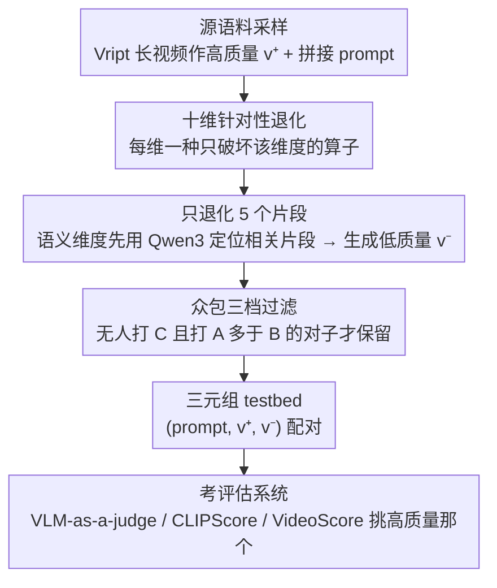

# SLVMEval: Synthetic Meta Evaluation Benchmark for Text-to-Long Video Generation

**会议**: CVPR 2026  
**arXiv**: [2603.29186](https://arxiv.org/abs/2603.29186)  
**代码**: [https://slvmeval.github.io/](https://slvmeval.github.io/)  
**领域**: 视频生成  
**关键词**: 长视频生成评估, 元评估基准, 文本到视频, 合成退化, VLM-as-a-judge

## 一句话总结

提出SLVMEval元评估基准，通过从密集视频描述数据集合成受控退化的"高质量vs低质量"视频对（最长约3小时），测试现有T2V评估系统识别长视频质量差异的能力，发现人类在10个维度上达84.7%-96.8%准确率，而现有自动评估系统在9/10维度上落后于人类。

## 研究背景与动机

1. **领域现状**：文本到视频（T2V）模型正从短视频（几秒）向长视频（数分钟到数小时）发展，StreamingT2V、Phenaki等系统理论上可生成任意长视频。
2. **现有痛点**：VideoScore等常用评估指标原本为几秒到几十秒的短视频设计，直接用于长视频评估存在长度不匹配问题。VBench、UVE等元评估基准也仅覆盖约10秒视频，无法验证评估指标在长视频上是否可靠。
3. **核心矛盾**：长视频生成正成为前沿方向，但缺乏验证评估系统是否具备长视频评估基本能力的测试环境。
4. **本文目标**：构建一个专门针对长视频的元评估基准，测试现有评估系统是否至少具备人类容易做到的长视频质量判断能力。
5. **切入角度**：从密集视频描述数据集出发，对原始视频施加受控退化（降低对比度、降分辨率、删除片段等），构建对照实验式的视频对，用众包验证退化的可感知性。
6. **核心 idea**：通过合成可控退化的长视频对，测试"人类轻松区分而自动系统做不到"的评估瓶颈。

## 方法详解

### 整体框架

SLVMEval要回答一个很朴素的问题：现有的T2V评估系统，连人类一眼就能分辨的长视频质量差异都看不出来吗？为了制造这种"一眼可辨"的差异，作者不去生成长视频（生成本身不可控），而是从Vript密集视频描述数据集采样真实长视频当作高质量样本$v^+$，再人为地往里注入一种特定缺陷得到低质量样本$v^-$。整条流水线是：采样原始视频 → 针对某个评估维度施加受控退化 → 众包标注过滤掉"退化不明显"的对子 → 留下的$(p, \{v^+, v^-\})$三元组用来考评估系统。考法很直接：把同一段prompt配上一好一坏两个视频丢给评估者（自动系统或人类），看它能不能把高质量那个挑出来，统计正确率。

### 关键设计

**1. 十个维度各打一种"针对性退化"：让每种缺陷只影响一个能力**

如果把视频整体搞糊，评估系统答错了你也分不清它是栽在画质还是栽在语义上。所以作者把评估能力拆成两大类共十个维度，每个维度配一种只破坏该维度、其余原样的退化算子。视频质量类靠传统图像处理就够了：美学维度降对比度、技术质量维度降分辨率、外观风格维度用OpenCV把画面迁成油画/漫画风、背景一致性维度用rembg抠掉前景再贴一张随机风景。视频-文本一致性类则要动语义，手段更重：时序流维度把5个连续片段的顺序打乱、完整性维度随机删掉5个片段、物体完整性维度用GroundingDINO定位prompt里提到的物体再用Stable Diffusion Inpainting擦掉它、空间关系维度把含左右描述的片段水平翻转、动态程度维度用中间帧替换含运动描述的片段让画面"冻住"、颜色维度用Qwen-Image-Edit改掉指定物体的颜色。这样一来，某个系统在某维度上失分，就能干净地归因到它缺的正是那项能力。

**2. 只退化其中5个片段：把长视频特有的"质量不均匀"逼出来**

把整段视频统一退化太假，也太好认——真实T2V生成里质量往往是忽好忽坏、局部出问题的。所以退化只随机作用在视频里挑出的5个片段上，其余片段保持原样（即论文的Algorithm 1）。对那些依赖语义的维度，挑片段还不能瞎挑：得先用Qwen3-8B把"提到了颜色""提到了左右方位"这类相关片段识别出来，再对它们下手，否则退化就落空了。这种局部退化真正考验的是评估系统能不能在一段很长的视频里定位到出问题的局部、再把零散的质量信号聚合成整体判断——而这恰恰是短视频指标从没被要求过的事。

**3. 众包三档过滤：先保证人类自己分得清，这道题才算数**

整个基准的前提是"人类轻松能分、机器却不行"，那就必须先确认人类真的分得清。每对视频交给5名众包工作者打三档：A表示选中片段全部退化成功、B表示部分成功、C表示完全失败。一对视频要留下，得满足两个条件——没有任何人打C，且打A的人数多于打B的人数。这样筛完剩下3,932对，每对的好坏差异都是人眼可感的。一个顺带的发现是：过滤前后各评估系统的成绩高度相关，意味着将来扩库时这道昂贵的人工过滤其实可以省掉。

### 评估系统对比

SLVMEval是评估基准而非训练方法，本身不含损失函数。它把如下几类评估系统拉到同一张考卷上对比：
- **Video-based VLM-as-a-judge**：GPT-5、GPT-5-mini、Qwen3-VL-235B直接看视频对判断
- **Text-based VLM-as-a-judge**：先用VLM对视频生成描述，再用LM比较描述与prompt的匹配度
- **CLIPScore**：计算各片段中心帧与prompt的CLIP相似度平均值
- **VideoScore v1.1**：基于VLM+回归头的质量评分

## 实验关键数据

### 主实验

各评估系统准确率（%）对比（选取代表性维度）：

| 系统 | 美学 | 技术质量 | 物体完整性 | 时序流 | 动态程度 |
|------|------|---------|-----------|--------|---------|
| GPT-5 (video) | **90.1** | **85.8** | 72.0 | 50.3 | 35.3 |
| GPT-5 (text) | 74.8 | 46.2 | 68.0 | 43.5 | 43.1 |
| CLIPScore | 56.4 | 72.3 | **76.0** | 50.5 | 51.7 |
| VideoScore | 52.5 | 33.8 | 66.0 | 46.3 | 48.6 |
| **人类** | **96.5** | **91.8** | **86.6** | **86.6** | **95.9** |

### 消融实验

人工过滤前后评估系统准确率的Pearson相关性：

| 维度 | $\rho_P$ 相关系数 |
|------|-------------------|
| 美学 | 高相关 |
| 技术质量 | 高相关 |
| 物体完整性 | 高相关 |

（所有10个维度过滤前后均呈强正相关，证明无过滤也可产出可靠基准）

视频时长与准确率的关系：

| 趋势 | 说明 |
|------|------|
| 大多数维度 | 视频越长，自动评估系统准确率越低 |
| 动态程度 | 相关性弱（本身准确率就低，短视频也失败） |

### 关键发现

- **语义+时序维度是最大瓶颈**：动态程度（GPT-5仅35.3%，低于50%随机）、时序流（50.3%≈随机）、完整性（51.3%≈随机），说明当前评估系统无法跨帧推理运动和事件顺序
- **GPT-5 video-based在视觉质量维度最强**：美学90.1%、背景一致性98.9%，但仍低于人类
- **CLIPScore在物体完整性和完整性上有意外优势**：CLIP的对比预训练使其对prompt中提到的物体消失敏感（76.0%物体完整性排第二），但逐帧独立处理使其在时序/动态维度≈随机
- **text-based比video-based在某些维度更好**：Qwen3的text-based在背景一致性上比video-based高23.3个点，在外观风格上高17.1个点，说明将视频投射到文本空间可能有利于某些评估
- **VideoScore在多个维度低于50%**：其预定义的5个评估维度与本文定义不完全对应，导致判断不一致
- 数据集统计：3,932个视频对，平均时长1141秒（约19分钟），最长10,486秒（约2小时54分钟），prompt平均长度57,884字符

## 亮点与洞察

- **"最低要求"测试的设计哲学**：不问评估系统能做什么高级判断，只问它能否做到人类觉得很简单的事情——这种"下限测试"精准暴露了现有系统的根本缺陷，比追求更复杂的测试更有诊断价值
- **合成退化的可扩展性**：验证了无需昂贵人工过滤就能扩展基准（过滤前后高相关），降低了构建大规模T2LV评估基准的门槛
- **首次将评估基准扩展到小时级视频**：最长视频约3小时，远超现有基准的几秒-几十秒范围，填补了长视频评估验证的空白

## 局限与展望

- 退化操作是人工设计的，可能无法完全模拟真实T2V生成中的质量问题（如语义漂移、角色不一致等）
- 源视频来自真实视频而非AI生成视频，真实T2V的artifacts（如闪烁、形变）未被覆盖
- 仅在5个片段上施加退化，退化密度对评估难度的影响未充分探索
- GPT-5等大模型因上下文长度限制无法处理全部帧，丢失了帧间细节
- Spearman相关系数的p值在0.05水平未显著，视频时长效应作为"一般趋势"而非强效应

## 相关工作与启发

- **vs VBench**: VBench提供16维的细粒度人类标注但限于3.3秒短视频。SLVMEval覆盖10维但扩展到小时级视频，两者互补——短视频用VBench，长视频用SLVMEval
- **vs UVE-Bench**: 聚焦LM-based评估的元评估，但最长视频仅6.1秒。SLVMEval的视频时长长1700多倍
- **vs VideoScore**: 作为被评估对象之一，VideoScore在SLVMEval上表现不佳，证实了需要专门为长视频设计的评估指标

## 评分

- 新颖性: ⭐⭐⭐⭐ 首个面向长视频的T2V元评估基准，合成退化+众包过滤的方法论有参考价值
- 实验充分度: ⭐⭐⭐⭐ 8个评估系统×10个维度的全面对比，加上人类基线和时长分析
- 写作质量: ⭐⭐⭐⭐ 框架定义清晰，Algorithm 1简洁易懂，但部分CJK编码问题影响阅读
- 价值: ⭐⭐⭐⭐ 精准揭示了长视频评估的瓶颈（语义+时序维度），为社区指出了明确的研究方向

<!-- RELATED:START -->

## 相关论文

- [\[CVPR 2026\] VGA-Bench: A Unified Benchmark for Video Aesthetics and Generation Quality Evaluation](vga_bench_unified_benchmark_for_video_aesthetics_and_generation_quality.md)
- [\[CVPR 2026\] VGA-Bench: A Unified Benchmark and Multi-Model Framework for Video Aesthetics and Generation Quality Evaluation](vga-bench_a_unified_benchmark_and_multi-model_framework_for_video_aesthetics_and.md)
- [\[CVPR 2026\] VideoRealBench: A Chain-of-Thought Realism Evaluation Benchmark for Generated Human-Centric Videos](videorealbench_a_chain-of-thought_realism_evaluation_benchmark_for_generated_hum.md)
- [\[CVPR 2026\] Ref4D-VideoBench: Four-Dimensional Reference-Based Evaluation of Text-to-Video Generative Models](ref4d-videobench_four-dimensional_reference-based_evaluation_of_text-to-video_ge.md)
- [\[ICCV 2025\] WorldScore: A Unified Evaluation Benchmark for World Generation](../../ICCV2025/video_generation/worldscore_a_unified_evaluation_benchmark_for_world_generation.md)

<!-- RELATED:END -->
