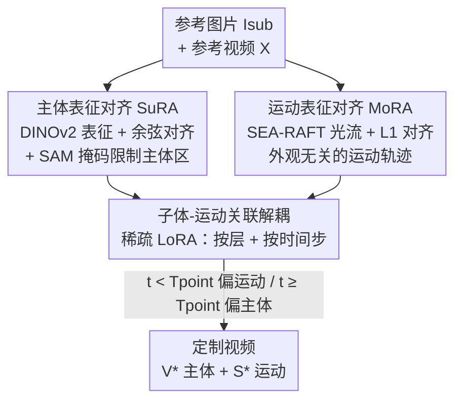

# SMRABooth: Subject and Motion Representation Alignment for Customized Video Generation

**会议**: CVPR 2026  
**论文**: [CVF Open Access](https://openaccess.thecvf.com/content/CVPR2026/html/Xu_SMRABooth_Subject_and_Motion_Representation_Alignment_for_Customized_Video_Generation_CVPR_2026_paper.html)  
**代码**: [项目页](https://smrabooth.github.io)  
**领域**: 视频生成 / 定制化生成  
**关键词**: 定制视频生成, 主体对齐, 运动对齐, 光流, 稀疏 LoRA

## 一句话总结
SMRABooth 用自监督视觉编码器（DINOv2）和光流编码器（SEA-RAFT）分别为「主体外观」和「物体运动」提供 object-level 的对齐目标，再用一套「跨层 + 跨时间步」的稀疏 LoRA 注入策略把两者解耦，从而在 DiT 视频扩散模型上同时做到主体保真和运动一致。

## 研究背景与动机

**领域现状**：定制化视频生成（customized video generation）要做两件事——从参考图片里保住主体的外观（subject），从参考视频里复刻运动模式（object motion），并能把任意主体和任意运动自由组合（比如「兵马俑在运球」「白色兰博基尼在月球上奔跑」）。主流做法是两阶段训练，分别为主体和运动各学一组 LoRA，推理时再合并。

**现有痛点**：现有方法只在像素/特征层面做监督，缺少 **object-level（物体级）的整体引导**——既没把握住主体的整体结构，也没把握住运动的整体趋势。结果就是生成的主体外观「泛化」、运动模式不对（论文 Fig.2 的例子：人和篮球的运动趋势错乱、人手消失）。

**核心矛盾**：① 监督信号太「局部」。模型缺乏对主体全局空间结构和运动全局趋势的认知。② DiT 骨干的结构性难题。U-Net 时代可以把主体 LoRA 放空间层、运动 LoRA 放时间层来天然隔离，但 DiT（如 WAN2.1）**没有明确的空间层 / 时间层之分**。直接把两组 LoRA 注入所有层，主体特征和运动特征会互相纠缠，导致伪影、背景照抄、画质崩坏。

**本文目标**：(1) 给主体学习一个全局结构 / 语义的对齐目标；(2) 给运动学习一个与外观无关的物体级运动对齐目标；(3) 在没有空间 / 时间层之分的 DiT 上，找到一种方式把主体 LoRA 和运动 LoRA 解耦，避免推理时互相干扰。

**切入角度**：已有研究发现「把模型中间特征对齐到外部视觉编码器表征，能增强全局语义和空间结构感知」。作者顺势把这个思路搬到定制生成：主体用自监督编码器（擅长建模全局结构），运动用光流编码器（擅长提取与外观解耦的轨迹）。同时作者通过「LoRA 稀疏性实验」观察到：不同线性层对主体 / 运动的贡献天差地别，因此可以靠**选层**而非选「空间 / 时间层」来解耦。

**核心 idea**：用外部编码器表征做 object-level 对齐（主体→自监督编码器，运动→光流编码器），再用「按层 + 按时间步」的稀疏 LoRA 注入在 DiT 上把主体和运动解耦。

## 方法详解

### 整体框架
SMRABooth 是一个 stage-by-stage 的定制框架，底座是冻结的 DiT 视频扩散模型 WAN2.1（用 flow matching / 速度预测训练）。整条流程分三步：先做**主体学习**（SuRA 模块用 DINOv2 表征对齐主体 LoRA），再做**运动学习**（MoRA 模块用光流表征对齐运动 LoRA），最后在**推理合并**时用「子体-运动关联解耦」策略——把两组 LoRA 按各自最该注入的线性层、以及按去噪时间步分段加权，从而互不打架。训练时主干始终冻结，只更新两组低秩矩阵。

### 关键设计

**1. SuRA 主体表征对齐：用自监督编码器给主体一个全局结构监督**

痛点是主体 LoRA 只靠重建损失学，容易抓低层细节、丢全局结构，导致主体「形似神不似」。SuRA 引入冻结的 DINOv2-ViT 编码器 $E$，把参考主体图 $I^i_{sub}$ 编码成 patch 级目标表征 $y^* = E(I^i_{sub}) \in \mathbb{R}^{N\times D}$（$N$ 是 patch 数，$D$ 是维度），这个表征同时编码了 part 之间的全局空间关系和高层语义。训练时取 DiT 第一层 transformer 之后、时间步 $t$ 的去噪特征 $z^1_t$，再用一个可训练 MLP $h_\phi$ 把维度对齐到 $y^*$，最后用余弦相似度损失把中间特征拉向目标表征：

$$L_{SuRA}(\theta) = -\mathbb{E}_{z,v,t}\left[\frac{1}{N}\sum_{n=1}^{N}\frac{y^*[n]\cdot h_\phi(z^{1[n]}_t)}{\|y^*[n]\|\cdot\|h_\phi(z^{1[n]}_t)\|}\right]$$

为防止主体 LoRA 过拟合到参考图的背景，作者用 SAM 生成主体掩码 $M$，把速度预测损失限制在主体区域：$L_{region} = \mathbb{E}\|u(z_t,c_{txt},t;\theta)\cdot M - v_t\cdot M\|^2$。主体阶段总损失 $L = L_{region} + \lambda L_{SuRA}$（$\lambda=0.05$）。这样主体 LoRA 学到的是「全局结构 + 高层语义」而非背景和低层纹理，CLIP-I / DINO-I 这类语义相似度因此明显提升。

**2. MoRA 运动表征对齐：用光流把运动从外观里剥出来**

定制运动最难的是把「运动」和「外观」解耦——直接学视频会把源视频的外观也带进来。MoRA 用光流编码器 SEA-RAFT（$F$）来抓与外观无关的物体级轨迹。它先在参考视频相邻帧间算出真实光流 $F_{\{1,N\}} = \{F(x_1,x_2),\dots,F(x_{N-1},x_N)\} \in \mathbb{R}^{(N-1)\times H\times W\times 2}$（每个像素的水平 / 垂直位移）。关键一步是：每个时间步去噪后，把潜空间特征用 3D VAE 解码器 $D$ 反变换回像素空间得到去噪视频 $\{\tilde{x}_i\}$，再用同样方式算出去噪视频的光流 $\tilde{F}_{\{1,N\}}$。然后用 L1 损失把两者对齐：

$$L_{MoRA} = \|F_{\{1,N\}} - \tilde{F}_{\{1,N\}}\|$$

配合时间速度预测损失 $L_{temporal}$，运动阶段总损失 $L = L_{temporal} + \alpha L_{MoRA}$（$\alpha=1.0$）。因为光流天生过滤掉外观、只留运动方向和速度，所以运动 LoRA 学到的是「结构连贯的运动趋势」，运动保真度（Motion Fidelity）和时间一致性因此大涨，而且不会把源视频的外观抄过来。

**3. 子体-运动关联解耦：按层 + 按时间步的稀疏 LoRA 注入**

这是针对 DiT 无空间 / 时间层之分的核心补丁。直接把两组 LoRA 注入所有层（消融里的 Combination 1）会破坏主体-运动平衡，出现伪影和背景照抄。作者做了「LoRA 稀疏性实验」：把全层微调的指标归一化为 100%，逐层把其他层的 LoRA scale 置零，观察单层贡献。结论是 **LoRA 在「注入位置」和「注入时机」上都是稀疏的**：

- 位置稀疏：主体 LoRA 主要受 $Q, K, FFN.0$ 影响，运动 LoRA 主要受 $V, O, FFN.0, FFN.2$ 影响。于是只把各自 LoRA 注入对它最有用的层（注意 $FFN.0$ 对两者都关键，所以两边都留），既隔离了干扰，又逼近全层微调的效果。
- 时机稀疏：已有研究指出 T2V 模型在去噪早期恢复运动、后期细化空间细节。作者用 DINO-I / CLIP-I 监测发现指标在第 10～25 步之间显著跃升（空间细节开始精修），据此设一个切换点 $T_{point}$：在 $T_{point}$ 之前给主体 LoRA 较低权重、优先恢复运动；之后给主体 LoRA 加倍权重、强化主体保真。最终取 $T_{point}=15$。$T_{point}$ 太小视频会近乎静止（主体 LoRA 干扰运动），太大则丢主体一致性（主体 LoRA 来得太晚）。

这一招把「在 DiT 上无法靠层类型隔离」的问题，转成「靠经验测出的层重要性 + 去噪阶段特性」来隔离，是本文相对前作（U-Net 时代靠空间 / 时间层分离）的关键差异。

### 损失函数 / 训练策略
- 主体阶段：$L = L_{region} + \lambda L_{SuRA}$，$\lambda=0.05$（即 $L_{SuRA}$ 占 $L_{region}$ 的 1/5），DINOv2-ViT-g 编码器，主体 LoRA rank 32，主体 resize 到 $512\times512$。
- 运动阶段：$L = L_{temporal} + \alpha L_{MoRA}$，$\alpha=1.0$，SEA-RAFT 光流编码器，运动 LoRA rank 64，视频采 49 帧、分辨率 $576\times320$。
- 学习率均为 $1.0\times10^{-4}$；推理用 50 步 DDIM + classifier-free guidance，生成 49 帧、$832\times480$、15fps 视频；底座为 WAN2.1 1.3B，2 张 96G H20。

## 实验关键数据

### 主实验
DiT 骨干上对比 WAN2.1、WAN2.1+LoRAs、DualReal（九个指标，三大类）：

| 方法 | CLIP-T↑ | CLIP-I↑ | DINO-I↑ | Motion Fidelity↑ | Subject Consist.↑ | Temporal Consist.↑ | PickScore↑ | Aesthetic↑ | Imaging↑ |
|------|---------|---------|---------|------------------|-------------------|--------------------|-----------|-----------|----------|
| WAN2.1 | 0.339 | 0.586 | 0.165 | 35.18 | **95.62** | 0.988 | 19.96 | 61.09 | 65.12 |
| +LoRAs | 0.314 | 0.681 | 0.464 | 60.08 | 94.33 | 0.980 | 19.85 | 56.17 | 55.90 |
| DualReal | 0.351 | 0.692 | 0.509 | 45.75 | 94.07 | 0.982 | 20.58 | 61.03 | 65.27 |
| **SMRABooth** | **0.363** | **0.700** | **0.519** | **62.89** | 95.31 | 0.988 | **21.14** | **62.18** | **67.46** |

SMRABooth 在语义对齐、运动质量、感知质量三类的几乎所有指标上领先。最显眼的是 Motion Fidelity（62.89 vs DualReal 的 45.75），说明 object-level 光流对齐确实抓住了运动趋势；DINO-I 0.519 也说明主体结构保真更好。注意 WAN2.1 原模型的 Subject Consistency 最高（95.62），但那是因为它几乎不动 / 不定制，属于「没做事所以一致」，不能直接横比。

用户研究（Table 2，84 对视频、8400 条评分、1–5 分）：

| 方法 | 提示对齐 | 运动相似 | 外观相似 | 视频质量 |
|------|---------|---------|---------|---------|
| WAN2.1 | 3.688 | 1.764 | 1.498 | 3.855 |
| +LoRAs | 3.523 | 3.185 | 3.444 | 3.242 |
| DualReal | 3.919 | 3.019 | 3.527 | 3.968 |
| **SMRABooth** | **4.228** | **3.468** | **4.178** | **4.244** |

四项主观指标全部第一，且 95% 置信区间下统计显著。外观相似（4.178）相对基线优势最大，呼应了 SuRA 的设计目标。

### 消融实验

| 配置 | CLIP-I | DINO-I | Motion Fidelity | 说明 |
|------|--------|--------|-----------------|------|
| SMRABooth (Full) | 0.700 | 0.519 | 62.89 | 完整模型 |
| w/o $L_{SuRA}$ | 0.667 | 0.467 | 62.15 | 去主体对齐，CLIP-I/DINO-I 掉，主体保真变差 |
| w/o $L_{MoRA}$ | 0.686 | 0.501 | 60.02 | 去运动对齐，Motion Fidelity 掉 |
| Combination ① 全层注入 | 0.652 | 0.460 | 61.77 | 主体/运动 LoRA 全层注入，画质崩、背景照抄 |
| Combination ② 主体缺 FFN.0 | 0.649 | 0.357 | 57.80 | 主体 LoRA 去掉 FFN.0，DINO-I 暴跌到 0.357 |
| Combination ③ 运动缺 FFN.0 | 0.684 | 0.480 | 56.12 | 运动 LoRA 去掉 FFN.0，Motion Fidelity 掉到 56.12 |

### 关键发现
- **FFN.0 对主体和运动都至关重要**：Combination ② 把 FFN.0 从主体 LoRA 拿掉，DINO-I 从 0.519 暴跌到 0.357；Combination ③ 把 FFN.0 从运动 LoRA 拿掉，Motion Fidelity 从 62.89 跌到 56.12。这验证了「选层」而非「选层类型」才是 DiT 上解耦的正解，也解释了为何最终方案让两组 LoRA 共享 FFN.0。
- **全层注入反而更差**：Combination ① 在所有层都注入两组 LoRA，CLIP-I（0.652）和 DINO-I（0.460）都低于稀疏方案，印证了「主体 / 运动特征纠缠」的危害——稀疏注入不是为省参数，是为隔离干扰。
- **$T_{point}$ 敏感**：$T_{point}=15$ 时最优；太小视频近乎静止（主体 LoRA 干扰运动），太大丢主体一致性。切换点对应去噪从「恢复运动」转向「细化空间」的阶段。

## 亮点与洞察
- **把「外部编码器表征对齐」拆成主体 / 运动两路**：主体用擅长全局结构的自监督编码器（DINOv2），运动用擅长剥离外观的光流编码器（SEA-RAFT），两个对齐目标各司其职——这种「按物理量选对齐源」的思路可迁移到任何需要解耦多种属性的生成任务。
- **在像素空间算光流损失很巧**：MoRA 不在潜空间硬比，而是把去噪潜变量经 VAE 解码回像素再算光流并做 L1 对齐，让运动监督发生在光流真正有意义的像素域，是把「运动一致性」落地为可优化损失的关键工程细节。
- **用稀疏性实验把 DiT 的「无层之分」转化为可操作的选层方案**：逐层置零测贡献，发现主体偏 Q/K/FFN.0、运动偏 V/O/FFN.0/FFN.2，这种「实测层功能再做稀疏注入」的范式，对所有想在 DiT 上做属性解耦的工作都有参考价值。
- **按去噪时间步分段加权 LoRA**：利用「早期恢复运动、后期细化外观」的扩散特性，在 $T_{point}$ 前后切换主体 LoRA 权重，几乎零额外成本就缓解了两组 LoRA 的时序冲突。

## 局限与展望
- **依赖外部编码器质量**：主体保真上限受 DINOv2、运动保真上限受 SEA-RAFT 制约——光流在快速运动 / 遮挡 / 大形变下本身不稳，MoRA 的运动监督也会随之退化，论文未充分讨论这类困难场景。
- **选层结论可能与骨干绑定**：「主体偏 Q/K/FFN.0、运动偏 V/O/FFN.0/FFN.2」是在 WAN2.1 1.3B 上测出来的，换更大模型或别的 DiT 架构是否仍成立、$T_{point}=15$ 是否还适用，都需要重新做稀疏性实验，泛化性存疑。
- **规模与效率**：只在 1.3B 模型、49 帧 / $832\times480$ 上验证；两阶段训练 + 推理时每步要把潜变量解码回像素算光流，计算开销不小，长视频 / 高分辨率的可扩展性未知。
- **$T_{point}$ 靠经验设定**：切换点由人工观察指标跃升区间确定，不同主体 / 运动组合是否需要自适应 $T_{point}$ 没有讨论。

## 相关工作与启发
- **vs DualReal（最新 DiT 定制方法）**: DualReal 是本文主要 DiT 对手，但它常常复刻不出运动模式（Motion Fidelity 仅 45.75）。SMRABooth 靠光流对齐把 Motion Fidelity 拉到 62.89，差距主要来自 object-level 运动监督和稀疏解耦。
- **vs DreamVideo / MotionBooth / MotionDirector（U-Net 时代）**: 这些方法靠把主体 LoRA 放空间层、运动 LoRA 放时间层来隔离，但缺 object-level 引导，主体易丢失（DreamVideo）、运动不准（MotionBooth）、甚至生成近乎静止的视频（MotionDirector）。SMRABooth 用表征对齐补上全局监督，且把隔离思路从「层类型」升级为「按实测重要性选层」，因此能搬到没有空间 / 时间层之分的 DiT 上。
- **vs 注意力约束类运动控制（如限制 bbox 区域）**: 那类方法只能做粗对齐、缺细粒度控制；SMRABooth 的光流对齐提供了像素级、与外观解耦的运动信号，控制更细。

## 评分
- 新颖性: ⭐⭐⭐⭐ 「双编码器表征对齐 + 实测层重要性的稀疏 LoRA 解耦」组合新颖，尤其把 DiT 无层之分的难题转化为选层方案有巧思。
- 实验充分度: ⭐⭐⭐⭐ 九指标 + 用户研究 + DiT/U-Net 双骨干 + 细致的层级 / 时间步消融，较扎实；但只在 1.3B、单一分辨率验证，缺困难运动场景分析。
- 写作质量: ⭐⭐⭐⭐ 动机—方法—实验逻辑清晰，公式和稀疏性实验交代到位；部分符号（$z^1_t$、$T_{point}$ 选取）略需结合图理解。
- 价值: ⭐⭐⭐⭐ 给 DiT 时代的主体 + 运动联合定制提供了可复用的解耦范式，对后续 DiT 上的属性解耦研究有参考意义。

<!-- RELATED:START -->

## 相关论文

- [\[CVPR 2026\] SynMotion: Semantic-Visual Adaptation for Motion Customized Video Generation](synmotion_semantic-visual_adaptation_for_motion_customized_video_generation.md)
- [\[CVPR 2026\] CineScene: Implicit 3D as Effective Scene Representation for Cinematic Video Generation](cinescene_implicit_3d_as_effective_scene_representation_for_cinematic_video_gene.md)
- [\[CVPR 2026\] Open-world Hand-Object Interaction Video Generation Based on Structure and Contact-aware Representation](open-world_hand-object_interaction_video_generation_based_on_structure_and_conta.md)
- [\[CVPR 2026\] ProPhy: Progressive Physical Alignment for Dynamic World Simulation](prophy_progressive_physical_alignment_for_dynamic_world_simulation.md)
- [\[CVPR 2026\] From Static to Dynamic: Exploring Self-supervised Image-to-Video Representation Transfer Learning](from_static_to_dynamic_exploring_self-supervised_image-to-video_representation_t.md)

<!-- RELATED:END -->
