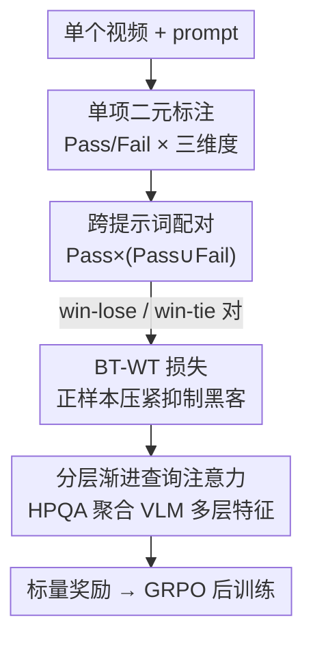

# SoliReward: Mitigating Susceptibility to Reward Hacking and Annotation Noise in Video Generation Reward Models

**会议**: CVPR 2026  
**论文**: [CVF Open Access](https://openaccess.thecvf.com/content/CVPR2026/html/Lian_SoliReward_Mitigating_Susceptibility_to_Reward_Hacking_and_Annotation_Noise_in_CVPR_2026_paper.html)  
**代码**: https://github.com/lian700/SoliReward  
**领域**: 视频生成 / 奖励模型  
**关键词**: 视频奖励模型, RLHF, 奖励黑客, 标注噪声, Bradley-Terry

## 一句话总结
SoliReward 从「数据标注 + 训练损失 + 模型架构」三处系统性改造视频生成奖励模型：用单项二元标注（Pass/Fail）+ 跨提示词配对降低标注噪声，用带平局的 Bradley-Terry（BT-WT）损失把正样本压到紧凑区间以抑制奖励黑客，用分层渐进式查询注意力（HPQA）聚合 VLM 多层特征，在 RM 准确率和下游 GRPO 后训练上都超过现有基线。

## 研究背景与动机
**领域现状**：视频生成模型（Sora 2、Veo 3、Seedance）依赖 RLHF 式的后训练对齐来修正物理不合理、视觉瑕疵和指令不follow，而对齐的核心组件是奖励模型（Reward Model, RM）——它把人类偏好量化成标量分数，再用 DanceGRPO 等 flow-based GRPO 算法去优化生成策略。RM 的好坏直接决定对齐效果。

**现有痛点**：训练一个能准确刻画视频质量的 RM 面临三处具体问题。其一，**数据标注噪声**：主流的成对偏好标注（in-prompt，同一 prompt 下比两个视频）在质量相近时极易触发标注者的主观纠结，注入大量标签噪声；而点式打分（如 1-5 级 Likert）在边界样本上标注者分歧巨大（VideoScore 报告 Fleiss' κ < 0.1）。其二，**奖励黑客（reward hacking）**：RM 学到的代理目标会偏离真实人类偏好，后训练时策略会专门去钻 RM 的空子。其三，**架构表达力不足**：从 VLM 抽标量分数的方式（最后一个 token 嵌入、专用特殊 token、yes/no token 概率）都偏简单，导致奖励坍缩、分数挤在一起。

**核心矛盾**：成对/点式标注追求的「相对比较信息」与「标注一致性」之间存在天然冲突——越是细粒度的相对比较，标注者越纠结、噪声越大；同时纯 win-lose 训练只最大化正负样本的奖励间隔 $r_\theta(y_i)-r_\theta(y_j)$，对正样本集合内部的分数分布毫无约束，给了奖励黑客可乘之机。

**本文目标**：拆成三个子问题——(1) 怎么拿到低噪声又能保留排序能力的偏好数据；(2) 怎么改训练损失以抑制奖励黑客；(3) 怎么设计架构让标量奖励充分利用 VLM 各层信息。

**切入角度**：作者观察到二元标注（Pass/Fail）的标注一致性远高于成对比较（VisionReward 已显示二元清单能到 ∼89% agreement），而 Bradley-Terry 模型在理论上并不要求配对来自同一 prompt——这两点结合就能用简单二元标签构造大规模、跨提示词的偏好对。

**核心 idea**：用「单项二元标注 + 跨提示词配对」换掉模糊的相对比较，用「带平局的 BT 损失」给正样本加紧凑性约束，用「分层渐进查询注意力」融合多层特征，三管齐下做出鲁棒的视频 RM。

## 方法详解

### 整体框架
SoliReward 是一条覆盖「数据 → 损失 → 架构」的完整管线。输入是大量待评估的视频（及其 prompt），输出是一个能给视频打鲁棒标量奖励、且供下游 GRPO 后训练使用的 VLM-RM。整体分三步走：先对单个视频按 Pass/Fail 做二元标注（沿物理合理性、主体畸变、语义对齐三个维度），再把 Pass 集合与 Fail 集合做跨提示词配对生成偏好对；这些偏好对（含 win-lose 与 win-tie 两类）喂给 BT-WT 损失训练；而打分的网络主体是一个 InternVL3 backbone 接上 HPQA 适配器，HPQA 从 LM 的多个 transformer 层逐层提炼查询、再与末层残差融合，最后 RewardHead 输出标量奖励。

### 关键设计

**1. 单项二元标注 + 跨提示词配对：用低噪声标签拼出大规模偏好集**

针对成对/点式标注噪声大的痛点，作者把标注任务从「比较两个视频谁好」或「打 1-5 分」彻底简化为「这一个视频在某维度上 Pass 还是 Fail」。只评单个视频对照客观标准，标注者不用做主观 tie-breaking，一致性大幅提升（IAA 实验里单项二元达 Moderate，α=0.4939、raw agreement 77.33%，远高于成对比较的 Fair、α=0.3516、54.67%）。但二元标签本身没有排序信息，没法直接喂 BT 损失。作者的巧招是：把所有 Pass 样本视为偏好等价（$\forall y_i,y_j\in W,\ y_i\sim y_j$），而任意 Pass 严格优于任意 Fail（$\forall y_i\in W,\forall y_j\in L,\ y_i\succ y_j$）。这样就在 W 和 L 两个集合间建立了清晰的偏好序。又因为 BT 模型理论上不要求配对同 prompt，于是可以**跨提示词**把不同 prompt 的 Pass 与 Fail 配成对，从简单二元标签生成大规模、多样化的偏好数据，逼 RM 学到泛化的质量表征而非局限于同 prompt 内的相对排名；附带好处是连「只生成了单个视频的 prompt」也能被利用上，数据利用率更高。

**2. 带平局的 Bradley-Terry 损失（BT-WT）：给正样本加紧凑性约束以抑制奖励黑客**

标准 BT 损失为
$$\mathcal{L}_{\mathrm{BT}}=\mathbb{E}_{(y_i,y_j)\in D}\left[-\log\sigma\!\left(r_\theta(y_i)-r_\theta(y_j)\right)\right]$$
它只最大化正负样本的奖励间隔，对正样本集合内部分布毫无约束。于是 RM 可能给某些带「捷径特征」的正样本异常高的分、给其他同样合格的正样本偏低分；后训练时生成模型会专门往这些奖励尖峰收敛，学会生成 hacking 样本——这正是奖励黑客的来源。作者补充 win-tie 对（把两个正样本配成平局对），把损失改成
$$\mathcal{L}_{\mathrm{BT\text{-}WT}}=\mathbb{E}_{(y_i,y_j)\in W\times(W\cup L)}\left[-\mu\log\sigma(\Delta r)-(1-\mu)\log\sigma(-\Delta r)\right]$$
其中 $\Delta r=r_\theta(y_i)-r_\theta(y_j)$，$\mu=1$（当 $y_i\succ y_j$）或 $\mu=0.5$（当 $y_i\sim y_j$）。当 $\mu=0.5$ 时，损失对 $\Delta r$ 的正负是对称的，会把两个正样本的分数往相等 $r_\theta(y_i)\approx r_\theta(y_j)$ 拉。这个 tie 项相当于在奖励空间加正则，把所有正样本压到一个紧凑稠密的流形上，抹平虚假尖峰。GRPO 后训练用的组内优势 $A_i=\frac{r_i-\bar r}{\sigma}$ 随之方差更小，避免离群高分样本造成的过优化。作者特意指出与 VideoAlign 的区别：VideoAlign 同时用 win-tie 和 lose-tie，但两个独立标注的负样本（如畸变程度）不能断定等价，硬当平局会削弱 RM 判别力——所以 BT-WT 只对正样本构 tie。

**3. 分层渐进查询注意力（HPQA）：逐层提炼 + 残差融合，避免奖励坍缩**

针对「从 VLM 抽标量分太简单导致分数挤成一团」的痛点，HPQA 不再用最后 token 嵌入或单层 pooling，而是显式聚合 LM 多个 transformer 层的特征。给定层索引列表 $I=[l_1,\dots,l_N]$、各层隐状态 $H_i\in\mathbb{R}^{B\times S\times D}$，先用一个可学习查询 $q^{(0)}$ 对第一指定层做多头注意力得到初始查询：$q^{(1)}=\mathrm{MHA}_1(Q=q^{(0)},K=H_{l_1},V=H_{l_1})$；随后逐层渐进精炼，$i=2,\dots,N$ 时 $q^{(i)}=\mathrm{MHA}_i(Q=q^{(i-1)},K=H_{l_i},V=H_{l_i})$，最终 $q^{(N)}$ 作为渐进特征 $q_{\mathrm{prog}}$。同时另用一个可学习查询 $q_{\mathrm{res}}$ 对末层 $H_L$ 做注意力得残差特征 $o_{\mathrm{res}}=\mathrm{MHA}_{\mathrm{res}}(Q=q_{\mathrm{res}},K=H_L,V=H_L)$。两者残差相加送入 RewardHead 得标量：$r=\mathrm{RewardHead}(q_{\mathrm{prog}}+o_{\mathrm{res}})$。设计依据是 LLM 各层功能分化——中间层更对应句法依赖、深层更擅长远距关系，渐进精炼让查询能跨越不同语义层级、把低层视觉保真度和高层语义抽象融在一起，而残差连接保证多层信息是增强而非替换末层表征。

### 损失函数 / 训练策略
训练目标即上文 BT-WT 损失：在 $W\times(W\cup L)$ 上同时优化 win-lose（$\mu=1$）与 win-tie（$\mu=0.5$）两类对。backbone 用 InternVL3 系列，后训练验证用 HunyuanVideo + DanceGRPO。标注规模为 25 万条自建训练视频 + 5 万条 OOD 测试视频，源自 2 万个唯一 prompt，覆盖物理合理性、主体畸变、语义对齐三个维度。

## 实验关键数据

### 主实验
RM 准确率对比（ID = 训练集留出分区，OOD = 其他 SOTA 模型生成的视频经人工标注），单位为准确率（%）：

| 任务 | 方法 | RM ACC (ID) | RM ACC (OOD) |
|------|------|-------------|--------------|
| Phy & Deform | VideoAlign | 54.40 | 71.60（次优） |
| Phy & Deform | VideoPhy | 67.35 | 65.10 |
| Phy & Deform | **Ours** | **78.48** | **80.08** |
| TA（语义对齐） | VideoPhy | 54.85 | 60.52 |
| TA（语义对齐） | VideoAlign | 49.50 | 49.14 |
| TA（语义对齐） | **Ours** | **79.02** | 60.25 |

后训练效果（HunyuanVideo + DanceGRPO，MQ=VideoAlign Motion Quality，VBench2=Human Fidelity，SoliReward=本文 RM 分）：

| Backbone | 引导 RM | MQ | SoliReward | VBench2 |
|----------|---------|----|-----------|---------|
| HunyuanVideo | 无 | -0.0980 | 4.5628 | 0.8426 |
| HunyuanVideo | MQ | 0.1607 | 4.8968 | 0.8695 |
| HunyuanVideo | **Ours** | **0.3302** | **5.3554** | **0.8999** |

### 消融实验
架构消融（同 backbone 下换 RM 适配器，∗ 表示分数坍缩为离散值）：

| 任务 | 架构 | RM ACC (ID) | RM ACC (OOD) |
|------|------|-------------|--------------|
| Phy & Deform | Linear (最后 token) | 74.69 | 78.66 |
| Phy & Deform | 'Yes' token logits | 75.43 | 78.46 |
| Phy & Deform | Special token + Ln | 75.91 | 73.61 |
| Phy & Deform | **HPQA (Ours)** | **78.48** | **80.08** |
| TA | Linear (最后 token) | 72.41∗ | 31.92∗ |
| TA | Special token + Ln | 76.25 | 58.38 |
| TA | **HPQA (Ours)** | **79.02** | **60.25** |

损失消融（BT vs BT-WT，重点看后训练）：

| 方法 | RM ACC | 后训练 VBench2 | 后训练 MQ |
|------|--------|----------------|-----------|
| BT | 77.63 | 0.8693 | 0.1719 |
| BT-WT | 78.27 | **0.8999** | **0.3302** |

### 关键发现
- **BT 和 BT-WT 的 RM 准确率几乎一样（77.63 vs 78.27），但后训练差距巨大**（MQ 0.1719→0.3302，VBench2 0.8693→0.8999）。这说明 RM 准确率不能完全预测下游对齐效果，奖励分布的紧凑性才是关键——BT-WT 让 top-rank 样本的组内优势绝对值明显更小（图 4 显示 Rank 1/2 优势分别降 15.6%/13.8%），梯度方差更低、策略更新更稳。
- **OOD 比 ID 更能反映真实效用**：不少基线（LiFT、UnifiedReward、VisionReward）输出离散分（1-5 整数或 good/normal/bad），导致分数坍缩、多个样本同分，OOD 泛化差，准确率被压低（TA 任务上 Linear/Yes-token 的 OOD 仅 ∼31%）。
- **HPQA 在 TA 任务上对抗坍缩效果最显著**：Linear 和 Yes-token logits 在 TA-OOD 上坍缩到 31% 左右，HPQA 拉到 60.25，多层特征融合对语义对齐这种需要高层抽象的维度尤其有用。

## 亮点与洞察
- **「降标注难度反而提排序质量」的反直觉操作**：把任务从相对比较退化到单视频二元判断，看似丢了排序信息，却靠「Pass 集内等价 + Pass 严格优于 Fail + 跨 prompt 配对」重新拼回排序，且噪声更低、数据量更大。这套「集合级偏好 + 跨 prompt」思路可迁移到任何二元可标注的偏好学习场景。
- **用平局对当正则项**：win-tie 不是为了多用 tie 数据，而是显式惩罚正样本内部分数方差，把奖励黑客的根因（正样本集合无约束）直接堵住。这个视角把「奖励黑客」从玄学问题转成了可优化的分布紧凑性问题。
- **RM 准确率 ≠ 对齐效果**：实验明确分离了这两件事，提醒后训练评估别只看 RM ACC，要看奖励分布形状与下游 GRPO 优势方差。

## 局限与展望
- **win-tie 的适用性依赖维度**：作者自己指出并非所有维度都适合构 win-tie 对（附录有专门的适用性测试），对那些正样本内部确实有质量梯度的维度，强行压平可能损失有用信息。
- **跨提示词配对的对比放在附录**，正文只给「与 in-prompt 相当」的结论，跨 prompt 是否在某些任务上反而引入语义混淆，证据不够充分。⚠️ 以原文附录为准。
- **后训练只在 HunyuanVideo + DanceGRPO 一种组合上验证**，对其他生成 backbone / 对齐算法（DPO、ReFL）的迁移性未充分展开。
- HPQA 的层索引 $I$ 选哪几层、N 取多少未在正文给敏感性分析，超参选择对结果的影响不透明。

## 相关工作与启发
- **vs VideoAlign（特殊 token + 全 tie）**：VideoAlign 用专用 token 抽分、同时保留 win-tie 和 lose-tie。本文认为对独立标注的负样本（畸变程度）不能断定等价，硬当 lose-tie 会削弱判别力，所以 BT-WT 只构 win-tie；架构上也用 HPQA 多层聚合替代单 token。OOD 上本文 Phy & Deform 80.08 vs VideoAlign 71.60。
- **vs VisionReward（二元清单）**：VisionReward 也用二元标注且一致性高（∼89%），但其 BT 目标退化成学线性权重、把奖励压成离散分、缺乏细粒度排序。本文用跨提示词配对 + HPQA 保住了连续标量奖励的排序粒度。
- **vs VideoScore（点式 Likert）**：VideoScore 报告 Fleiss' κ < 0.1 的极低一致性，正是本文用二元标注要规避的边界标注分歧。
- **vs 简单抽分头（Linear / Yes-token / Special token）**：这三类是 HPQA 的直接对照，消融显示它们在 OOD（尤其 TA）上容易分数坍缩，HPQA 通过分层渐进 + 残差融合显著缓解。

## 评分
- 新颖性: ⭐⭐⭐⭐ 「数据+损失+架构」三处协同的系统性方案，win-tie 当正则抑制奖励黑客的视角较新。
- 实验充分度: ⭐⭐⭐⭐ RM 准确率、IAA、损失消融、架构消融、后训练俱全，但部分关键对比（跨 prompt、HPQA 层选择）压在附录。
- 写作质量: ⭐⭐⭐⭐ 逻辑清晰、三条贡献线分明，公式与动机对应紧密。
- 价值: ⭐⭐⭐⭐ 视频生成对齐的 RM 是刚需，这套低噪声标注 + 抗黑客损失有较强可复用性。

<!-- RELATED:START -->

## 相关论文

- [\[CVPR 2026\] GT-SVJ: Generative-Transformer-Based Self-Supervised Video Judge For Efficient Video Reward Modeling](gt-svj_generative-transformer-based_self-supervised_video_judge.md)
- [\[CVPR 2026\] Goal-Driven Reward by Video Diffusion Models for Reinforcement Learning](goal-driven_reward_by_video_diffusion_models_for_reinforcement_learning.md)
- [\[CVPR 2026\] Identity-Preserving Image-to-Video Generation via Reward-Guided Optimization](identity-preserving_image-to-video_generation_via_reward-guided_optimization.md)
- [\[CVPR 2026\] VIVA: VLM-Guided Instruction-Based Video Editing with Reward Optimization](viva_vlm-guided_instruction-based_video_editing_with_reward_optimization.md)
- [\[CVPR 2026\] Reward Forcing: Efficient Streaming Video Generation with Rewarded Distribution Matching Distillation](reward_forcing_efficient_streaming_video_generation_with_rewarded_distribution_m.md)

<!-- RELATED:END -->
