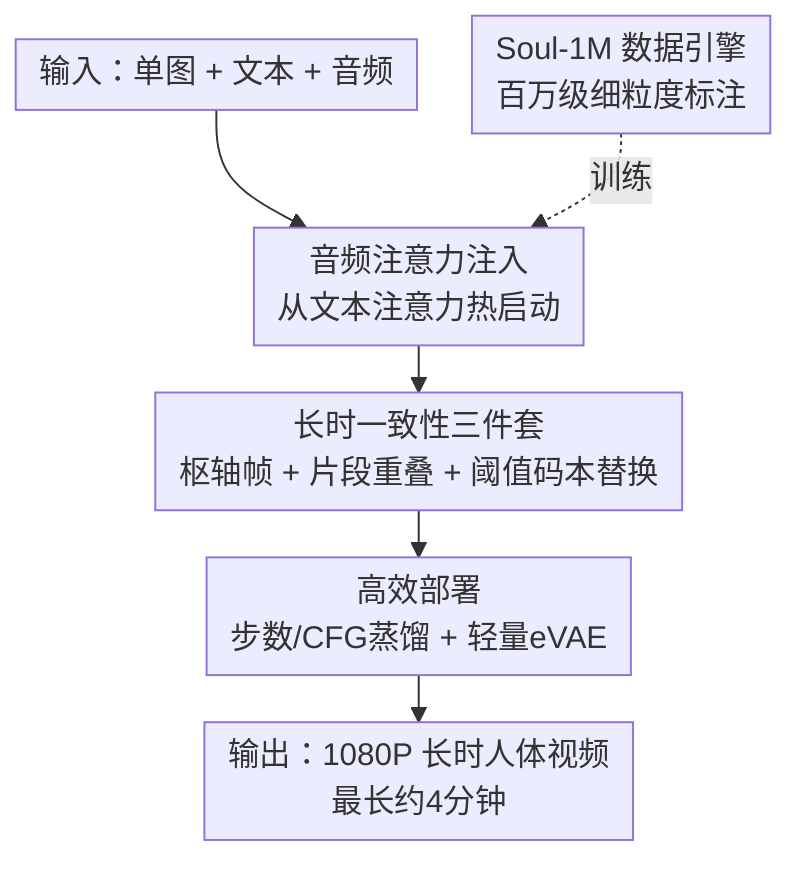

# Soul: Breathe Life into Digital Human for High-fidelity Long-term Multimodal Animation

**会议**: CVPR 2026  
**论文**: [CVF Open Access](https://openaccess.thecvf.com/content/CVPR2026/html/Zhang_Soul_Breathe_Life_into_Digital_Human_for_High-fidelity_Long-term_Multimodal_CVPR_2026_paper.html)  
**代码**: https://zhangzjn.github.io/projects/Soul/ （项目页）  
**领域**: 视频生成  
**关键词**: 数字人动画, 多模态驱动, 长时视频生成, 唇形同步, 扩散模型

## 一句话总结
Soul 用单张人像 + 文本 + 音频驱动，在 Wan2.2-5B 扩散视频骨干上注入音频注意力、配合「枢轴帧 + 片段重叠 + 阈值感知码本替换」三件套压住长时漂移，再用步数/CFG 蒸馏与轻量 eVAE 拿到 11.4× 加速，配套自建百万级 Soul-1M 数据集与 Soul-Bench，做到 1080P、最长四分钟、身份一致的高保真数字人动画。

## 研究背景与动机
**领域现状**：数字人动画近两年从「只动脸」走向「全身可动」，主流做法是在大规模视频扩散基座（Wan2.1/2.2、HunyuanVideo 等 DiT 架构）上接音频驱动，让人物按语音对口型、按文本做动作。代表工作有 Wan-S2V、OmniAvatar、InfiniteTalk、StableAvatar 等。

**现有痛点**：作者点出三个一直没被同时解决的硬伤。其一，**数据偏窄**——现有公开集合大多偏向单一场景（如只有正面人像），缺少对动作、手势、镜头运动的细粒度标注，且训练时长太小（Wan-S2V / OmniAvatar 只用约 1.3K 小时），导致模型连让人「走起来」都做不到。其二，**长时推理崩坏**——模型在短片段上训练，部署时却要拼接多段做长视频，潜空间特征逐步偏移，造成身份漂移、画面变色、细节丢失甚至完全不可用。其三，**高清与效率冲突**——1080P 高保真生成要么牺牲速度，要么吃掉天量算力，难以落地。

**核心矛盾**：训练分布（短片段、单 clip）与推理分布（长序列、多 clip 自回归拼接）之间存在系统性的「潜特征分布错配」；同时高分辨率扩散的多步去噪天然与实时部署对立。

**本文目标**：从单图 + 文本 + 音频出发，同时拿下「语义一致 + 高保真 1080P + 长时稳定 + 可部署」四件事。

**切入角度**：与其只在算法上修修补补，作者选择「数据 + 长时机制 + 部署」三线齐发——先用百万级精标数据补齐泛化，再针对长时漂移的根因（潜特征分布错配）做对症的码本替换，最后把推理成本系统性压下来。

**核心 idea**：把长时漂移诊断为「条件特征偏离训练分布」，于是用从训练集潜特征聚类得到的码本，对每个条件帧特征做「阈值感知」的拉回，既纠偏又不粗暴整体替换；配合音频注意力与蒸馏 + 轻量 VAE，把一套能上线的高清长时数字人系统拼完整。

## 方法详解

### 整体框架
Soul 的输入是一张人像图（提供主体、背景、风格）、一段文本（控制动作/手势/镜头/场景）、一段音频（控制口型与表情），输出是语义一致的长时人体动画视频。整条管线建立在 Wan2.2-5B 这个 DiT 视频扩散骨干上：先在 DiT block 里注入音频注意力让画面对齐语音与文本；生成时按 clip 自回归推进，靠枢轴帧、片段重叠、阈值感知码本替换三招维持跨片段一致；最后用步数/CFG 蒸馏和轻量 eVAE 把推理成本压到能上线的程度。所有训练都跑在自建的 Soul-1M 上。

### 关键设计

**1. 音频注意力注入：从文本注意力热启动的跨模态唇形控制**

数字人最直观的要求是嘴型对得上语音、表情跟得上情绪，而文本扩散骨干本身没有音频通路。Soul 先用 Whisper 预抽音频特征，再在每个 DiT block 里**新增一层 Audio-Attention**专门吸收音频条件。关键的一笔是这层不是随机初始化，而是**直接复制原有文本注意力（text-attention）的权重来热启动**——因为文本注意力已经学会了「条件→画面」的对齐方式，让音频注意力站在这套先验上继续学，收敛明显更快。这样文本管「做什么动作、什么镜头」，音频管「怎么对口型、什么表情」，两路条件在同一 DiT 内协同，既支持普通说话也支持唱歌。

**2. 长时一致性三件套：枢轴帧 + 片段重叠 + 阈值感知码本替换**

这是全文最核心、也最对症的设计，专治长时拼接的身份漂移与画质崩坏。Soul 默认一次生成一个 clip（像素空间 109 帧、潜空间 28 帧），三招层层加码：

- **枢轴帧（pivotal frame）**：把首帧当作整段的参考锚，padding/复制后作为每个 clip 的起点，持续提供主体身份、背景、风格的参考；训练时从源视频随机抽一帧当参考帧（只作条件、不算损失），提升对不同人物与背景的泛化。
- **片段内重叠（intra-clip overlap）**：光靠一张参考图不足以保证相邻 clip 衔接自然——文本或镜头驱动的运动会让 clip 结尾大幅偏离枢轴帧。于是生成下一段时，把上一段最后几帧（默认 2 帧）拷进当前段开头的潜空间，训练时以 50% 概率施加，显著改善跨帧语义连贯。
- **阈值感知码本替换（threshold-aware codebook replacement）**：前两招分别管身份和帧间衔接，但作者发现推理越长画质和场景连贯仍会逐步退化（图 7 的变色、丢细节）。根因是「潜特征漂移」——训练只见短 clip，推理却用**自己生成的**前几帧特征当条件，这些特征与第一段真实潜特征存在分布错配。解法是：先用 Soul-1M 全量样本预抽潜特征，K-Means 聚成码本（默认 40K 个簇）以贴近训练分布；推理时对每个条件帧特征找最近质心 $c$，做带阈值 $\tau$ 的拉回：

$$f' = \begin{cases} f, & \|f-c\| \le \tau \\ c + \tau\cdot\dfrac{f-c}{\|f-c\|}, & \|f-c\| > \tau \end{cases}$$

即距离在阈值内就原样保留，超出就沿方向把它截断到「离质心恰好 $\tau$」的位置。这样既把游离的条件特征拽回训练分布附近，又避免「整体替换成码本词」那种粗暴失真，是它比传统离散码本量化更克制的地方。三招合力让 Soul 能稳定生成长达约四分钟、身份与背景始终一致的视频。

**3. Soul-1M 数据引擎：百万级细粒度多模态标注流水线**

泛化差的根子在数据，所以作者自建百万级 Soul-1M，并把重点放在「覆盖广 + 标注细 + 质量净」。数据来源覆盖人像、上半身、全身、多人四类场景（VoxCeleb2、CelebV-Text、VFHQ 等 + 自采全身/多人视频）。**自动过滤**串起一条流水线：分辨率筛（短边 < 480p 直接砍）、用 DINOv2 + PySceneDetect 切镜头、RetinaFace 去无脸/低置信、FineVQ 评美学、PaddleOCR 去字幕、MLLM 兜底标缺陷；还用 MMPose 跟踪关键点做数据池增广（全身视频裁出上半身补进上半身池），并用 SyncNet 评音画同步、不同步的丢音频保画面。**细粒度标注**用 Qwen3-VL 当基座，先按「有无人/场景切换」切成 4–5s 子段，再用多套专门 prompt 覆盖场景、镜头、动作、手势、运动方向、镜头运动、风格、光照等属性，尤其把人体动作拆成身/头/脸/手/腿分别精标，最后用 Qwen2.5-VL-72B 做二次一致性校验（如标了「行走」但人没位移就剔除）。最终得到 30 万人像 + 40 万上半身 + 10 万全身、共约 8.5K 小时训练数据，外加配套的 226 样本 Soul-Bench 评测集。

**4. 高效部署：步数/CFG 蒸馏 + 轻量 eVAE 实现 11.4× 加速**

高清扩散要落地就得砍推理成本，Soul 从两条互补的轴下手。其一是**步数与 CFG 联合蒸馏**：默认 25 步去噪很贵，借鉴 DMD2 的分布匹配蒸馏，同时蒸馏去噪步数和 classifier-free guidance（并移除 GAN 损失），把多步 + 双前向（有/无条件）压成更短的推理，单这一项相对基线就拿到约 7.5× 整体加速。其二是**轻量 eVAE**：作者发现 Wan2.2-5B 的解码器又大又慢（占 KD 后模型相当一部分开销），于是设计精简版 eVAE-Wan2.2-5B-35M，把解码器参数/MACs 从 555.05M/688.58T 砍到 34.97M/43.34T（约 8.1× 解码加速），而重建质量只轻微下降（LPIPS 0.0324→0.052）。两轴叠加，相对朴素实现整体提速 11.4×，质量几乎无损。

### 损失函数 / 训练策略
全量微调 Wan2.2-5B，64 卡 AdamW，学习率 $2\times10^{-5}$；先在 109×720×1280 训 2 个 epoch，再在 1088×1920 微调 1 个 epoch。训练用 Soul-1M 中 80 万条音-文-视频同步样本，**额外混入 20% 无音频的通用视频**（卡通、动物、自然、城市建筑，音频通道置零）做混合模态训练以保住多样场景能力；并合成人体相关失败案例配负向 prompt 一起训练，进一步增强时序一致性。

## 实验关键数据

### 主实验
在自建 Soul-Bench（226 样本）上与最新开源方法对比（粗体为最优）。Soul 在视频-文本一致性、唇音距离误差（LSE-D）、身份一致性、视频质量上均居首：

| 方法 | 视频-文本一致↑ | LSE-D↓ | LSE-C↑ | 身份一致↑ | 视频质量↑ | 音画对齐↑ |
|------|------|------|------|------|------|------|
| HunyuanVideo-Avatar | 4.82 | 0.419 | 6.33 | 0.727 | 67.02 | 0.195 |
| Sonic | 4.57 | 0.663 | **7.80** | 0.613 | 68.58 | 0.191 |
| Wan-S2V | 4.74 | 5.455 | 6.71 | 0.750 | 71.22 | **0.330** |
| InfiniteTalk | 4.75 | 2.313 | 8.48 | 0.609 | 68.53 | 0.211 |
| StableAvatar | 4.77 | 3.948 | 4.05 | 0.733 | 71.40 | 0.250 |
| OmniAvatar | 4.77 | 1.009 | 5.84 | 0.497 | 67.24 | 0.225 |
| **Soul（本文）** | **4.85** | **0.130** | 6.82 | **0.763** | **72.60** | 0.255 |

注：论文指出 LSE-C 在训练集参考值 6.12、音画对齐真实视频参考值 23.19 以上区分度有限，故 Soul 的 LSE-C 6.82 已落在合理区间。

### 消融实验
效率组件消融（129×1088×1920，单卡，加速相对第一行 FA2 基线）：

| 配置 | 全模型延迟 | 加速 | 视频质量↑ | 身份一致↑ |
|------|------|------|------|------|
| FA2（基线） | 1019.2s | 1.0× | 72.60 | 0.763 |
| + KD 步数/CFG 蒸馏 | 135.3s | 7.5× | 71.90 | 0.696 |
| + eVAE 轻量解码 | 89.4s | 11.4× | 71.68 | 0.702 |

与商用产品的人工评测（1–5 分，①整体自然度 ②身份一致 ③文本一致 ④音画同步）：

| 方法 | ① | ② | ③ | ④ |
|------|------|------|------|------|
| HeyGen | 4.07 | 3.54 | 3.82 | **4.20** |
| Kling-Avatar | 3.93 | 3.86 | 3.90 | 4.05 |
| **本文** | **4.17** | **4.00** | **4.11** | **4.20** |

### 关键发现
- **阈值感知码本替换是长时生成的命门**：即使已有片段内重叠，时间一拉长画面仍会变色、丢细节（图 7），加上码本替换后才能稳定生成约四分钟、身份与背景一致的视频；ArcFace 相似度随时间保持平稳（图 8）也佐证了这一点。
- **效率两轴可叠加且几乎无损**：KD 单独贡献 7.5×，再叠 eVAE 到 11.4×，而视频质量仅从 72.60 微降到 71.68、身份一致从 0.763 到 0.702，证明高清长时数字人确实可以做到接近实时部署。
- **唇音同步的两面性**：Soul 的 LSE-D（距离误差）0.130 远低于所有对手（次优 OmniAvatar 1.009），但 LSE-C（置信度）只排第三——作者解释 LSE-C 超过训练集参考值后区分度本就有限，说明它在「嘴型贴合」上极强，单看置信度指标并非短板。
- **混合模态训练护住了通用场景**：20% 无音频通用视频 + 负向失败样本一起训，让模型在卡通、动物、城市等非人脸场景仍保持时序一致，这是它能覆盖「虚拟主播 + 影视 + 动物拟人」多场景的关键。

## 亮点与洞察
- **把长时漂移诊断成「条件特征的分布错配」并对症下药**：很多工作只是加参考图或加重叠，Soul 进一步指出根因是推理用自生成特征当条件、偏离训练分布，于是用训练集潜特征聚类成码本做「阈值拉回」——只纠偏、不整体替换，这种克制的处理比硬量化更不伤画质，是可迁移到任何自回归长视频生成的思路。
- **音频注意力用文本注意力权重热启动**：一个很省的工程巧思——新模态分支不从零学，而是继承同构旧分支已学会的「条件对齐」先验，加速收敛，几乎零成本可复用到任何要给扩散骨干新增条件通路的场景。
- **数据-机制-部署三线同时打满**：Soul 不是单点创新，而是把「百万级精标数据 + 长时一致性机制 + 11.4× 部署优化」整套打通，直接对标 HeyGen / Kling 这类商用产品并在人工评测上略胜，体现了「能上线」的系统工程价值。
- **eVAE 的洞察很实在**：作者注意到蒸馏后解码器反而成了瓶颈，单独把解码器砍掉一个数量级参数量，这种「先蒸主干、再补短板」的优化顺序值得借鉴。

## 局限与展望
- 作者承认：**处理高度复杂的全身大幅动作时仍会产生 artifact**，这是该领域公认的难点；计划扩充 Soul-1M 增加稀有动作类型、加入跨语言音频提升鲁棒性，并探索引入 3D 几何先验来增强全身动作的自然度与空间一致性。
- 自己看到的局限：评测主要在自建的 Soul-Bench 上进行，而该 benchmark 本身相当一部分由 LLM/TTS 生成 + 人工筛选，**评测分布与训练数据来源有一定耦合**，跨外部公开 benchmark 的横向可比性还需更多验证；LSE-C 等指标作者也承认在高值区区分度有限，结论需谨慎对待。
- 码本规模（默认 40K 簇）、重叠帧数、阈值 $\tau$ 等关键超参的敏感性论文未充分展开，实际部署到新域时这些可能需要重新调。

## 相关工作与启发
- **vs Wan-S2V / OmniAvatar**: 它们只用约 1.3K 小时数据、且偏向单场景，连「走路」都难稳定；Soul 用 8.5K 小时精标 Soul-1M + 长时一致性三件套，在身份一致、视频质量、视频-文本一致上全面领先，但 Wan-S2V 在音画对齐单项指标上更高（0.330 vs 0.255）。
- **vs InfiniteTalk / StableAvatar**: 这些方法在长时一致或唇形上各有强项，但缺少系统性的部署优化；Soul 的 KD + eVAE 把推理压到 11.4× 加速，是少见的「兼顾长时质量与可上线效率」的工作。
- **vs HeyGen / Kling-Avatar（商用）**: 在四维人工评测里 Soul 整体自然度、身份/文本一致均略优，给开源数字人对标闭源产品提供了一个完整可复现的范式（数据 + 模型 + 评测集齐全）。

## 评分
- 新颖性: ⭐⭐⭐⭐ 阈值感知码本替换对长时漂移的诊断与对症解法有真创新，其余多为强工程整合而非全新范式。
- 实验充分度: ⭐⭐⭐⭐ 主对比、效率消融、商用人工评测、长时 ArcFace 曲线齐全，但主要依赖自建 benchmark、缺外部公开集横向验证。
- 写作质量: ⭐⭐⭐⭐ 三大挑战→三线方案的逻辑清晰，图表丰富；个别拼写与符号小瑕疵不影响理解。
- 价值: ⭐⭐⭐⭐⭐ 数据 + 机制 + 部署全打通、对标商用产品且可复现，对数字人/虚拟主播落地有很强的实用价值。

<!-- RELATED:START -->

## 相关论文

- [\[CVPR 2026\] InfinityHuman: Towards Long-Term Audio-Driven Human Animation](infinityhuman_towards_long-term_audio-driven_human_animation.md)
- [\[CVPR 2026\] Archon: A Unified Multimodal Model for Holistic Digital Human Generation](archon_a_unified_multimodal_model_for_holistic_digital_human_generation.md)
- [\[CVPR 2026\] M4V: Multimodal Mamba for Efficient Text-to-Video Generation](m4v_multimodal_mamba_for_efficient_text-to-video_generation.md)
- [\[CVPR 2026\] Vanast: Virtual Try-On with Human Image Animation via Synthetic Triplet Supervision](vanast_virtual_try-on_with_human_image_animation_via_synthetic_triplet_supervisi.md)
- [\[CVPR 2026\] Efficient Long-Context Modeling in Diffusion Language Models via Block Approximate Sparse Attention](efficient_long-context_modeling_in_diffusion_language_models_via_block_approxima.md)

<!-- RELATED:END -->
