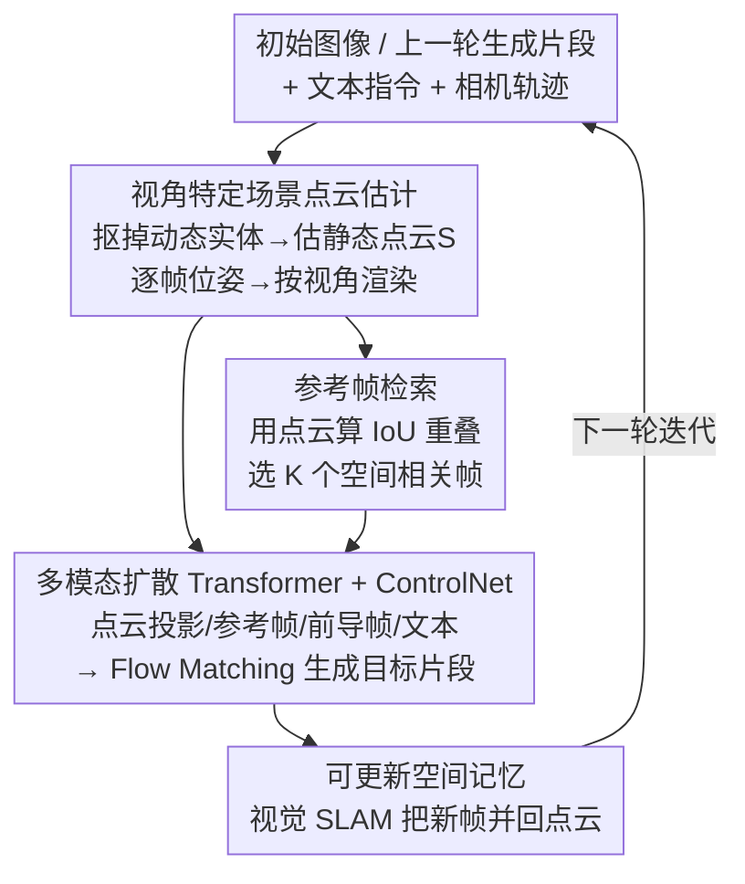

# Spatia: Video Generation with Updatable Spatial Memory

**会议**: CVPR 2026  
**论文**: [CVF Open Access](https://openaccess.thecvf.com/content/CVPR2026/html/Zhao_Spatia_Video_Generation_with_Updatable_Spatial_Memory_CVPR_2026_paper.html)  
**代码**: 无（项目页 https://zhaojingjing713.github.io/Spatia/ ）  
**领域**: 视频生成  
**关键词**: 长时程视频生成, 空间记忆, 场景点云, 相机控制, ControlNet

## 一句话总结
Spatia 给视频生成模型挂上一块"可更新的空间记忆"——把场景显式维护成一团 3D 点云，每生成一段视频就用视觉 SLAM 更新点云，再用点云投影回去约束下一段生成，从而让模型在长序列里"记得"去过的地方，同时还能干净地分离静态场景与动态物体、做显式相机控制和 3D 交互编辑。

## 研究背景与动机
**领域现状**：视频生成已经从 UNet 时代的隐空间扩散进化到大规模 Diffusion Transformer，短片质量和可控性都很强。但真正有价值的下游应用——世界模型、AI 游戏、具身智能——都要求**长时程**生成：分钟级、小时级的时间跨度，且场景要前后一致。

**现有痛点**：视频信号是稠密高维的。论文给了一个很直观的账：一段 5 秒、480P、24FPS 的视频（120 帧），用空间下采样 16×、时间下采样 4× 的视频编码器编码，就已经是 $40\times30\times30=36{,}000$ 个时空 token。要把哪怕多一段 5 秒片段塞进上下文，算力和显存就爆了。换算一下，36,000 token 在 LLM 那边能装约 27,000 个词，而视频模型只能装 5 秒的视觉历史。所以**视频模型没法像 LLM 那样直接 attend 到全部历史 token**。

**核心矛盾**：扩散模型普遍用双向时空注意力，这又恰好挡住了标准的 KV-cache 复用，上下文窗口被锁死。于是长时程生成只能靠自回归式逐段续写，但这样缺一个**显式的空间记忆**——当镜头转一圈再回到原地，模型根本不记得这个地方长什么样，几何就漂了。

**已有方法的局限**：之前处理记忆问题的工作（Voyager、ViewCrafter、VMem 等）大多只能生成**纯静态**场景，没法在保持空间一致的同时生成动态物体；显式相机控制类方法又普遍把相机轨迹编码成隐特征注入模型，这种间接方式容易控制不准、不稳定。

**核心 idea**：用一团**显式的 3D 场景点云**当持久记忆——只存静态场景几何（动态实体先抠掉），每生成一段就用 SLAM 把新内容并进点云、不断更新；生成时再把点云按当前相机视角投影回 2D 当条件。这套"动静解耦 + 点云记忆"既锚住了长程空间一致性，又不牺牲动态物体的生成能力，还顺手解锁了显式相机控制和场景级交互编辑。

## 方法详解

### 整体框架
Spatia 把长时程视频生成形式化成一个**多模态条件生成 + 记忆迭代更新**的循环。输入是一张初始图像（或上一轮生成的片段）加一条文本指令、一条用户指定的相机轨迹；输出是新一段与历史空间一致的视频，同时空间记忆被刷新。整条管线绕两件事转：(1) 从条件输入估计/维护一团**静态场景点云** $S$ 当空间记忆；(2) 每轮把点云投影成"场景投影视频"、再检索历史中空间相关的参考帧，一起喂给生成网络条件化地生成新片段；生成完用视觉 SLAM 把新帧并回点云。如此往复即可长程展开。

训练阶段把每条训练视频拆成三份：**目标片段** $\{T\}_N$（要生成的 N 帧）、紧邻其前的**前导片段** $\{P\}_M$（提供时间连续性）、以及剩下的**候选帧集** $\{C\}_O$（充当空间参考池）。下面三个贡献组件依次把"点云怎么估、参考帧怎么选、条件怎么进网络"讲清。

### 关键设计

**1. 可更新空间记忆与动静解耦：把"记忆"做成一团只存静态几何的点云**

这是全文的地基，直接针对"视频 token 太稠密、装不下历史"这个核心矛盾。Spatia 不去硬塞历史帧 token，而是把整个场景压成一团**静态 3D 场景点云** $S$ 当持久记忆：生成时按当前相机位姿把 $S$ 投影回 2D 作为条件，生成完再用视觉 SLAM（论文用 MapAnything）把新生成帧并进 $S$。关键在"动静解耦"——点云**只保留静态场景**，动态物体不进记忆。这样做的好处是双重的：一方面点云是个紧凑、可累积的几何表示，镜头转一圈回到原地时投影出的条件能精确复现旧场景，所以模型能"记住去过的地方"；另一方面，把动态实体排除在记忆之外，模型在生成时仍可自由地在这块静态画布上画出符合场景的运动物体，于是既有长程空间一致性、又不丢动态生成能力。这正是它相比 Voyager/ViewCrafter 这类只能产静态世界的记忆方法的本质区别。

**2. 视角特定场景点云估计：把一团 3D 点云变成每帧可直接条件化的 2D 投影**

光有一团点云还不能直接喂进视频模型，得把它对齐到每一帧的视角。这一步先从候选帧集 $\{C\}_O$ 里随机采一帧，用 MapAnything 估出场景点云 $S$；若视频含动态实体，则先用 Keye-VL-1.5 识别出动态物体并生成文本提示、再用 ReferDINO 把它们分割抠除，**确保 $S$ 只含静态成分**（呼应设计 1 的动静解耦）。接着用 MapAnything 估出目标/前导/候选三组帧各自的逐帧相机位姿 $\{\theta_T\}_N,\{\theta_P\}_M,\{\theta_C\}_O$，把每个位姿作用到 $S$ 上渲染出对应视角的"视角特定场景点云" $\{S_T\}_N,\{S_P\}_M,\{S_C\}_O$。这套"估一次全局点云、按各视角渲染"的设计，让同一份记忆能为任意相机轨迹提供稠密、几何精确的空间条件——也正是显式相机控制的实现方式：直接把用户想要的相机路径施加到点云上、渲染出 2D 点云序列当条件，类似 3DGS 的渲染过程，比那些把轨迹编码成隐特征再注入的间接方法更准更稳。

**3. 基于 IoU 重叠的参考帧检索：从历史里挑出"看过同一片区域"的帧补强几何**

点云投影提供了几何骨架，但生成网络还需要历史中**真实拍到过同一区域**的像素来补强外观一致性。这一步要从候选帧集 $\{C\}_O$ 里选出最多 $K$ 个与目标片段 $\{T\}_N$ 空间重叠的帧当参考帧 $\{R\}_K$。判据是用两边各自的视角特定场景点云算空间对应——本质是计算目标帧与候选帧投影之间的 **IoU 重叠**（$\mathrm{IoU}(T_i, C_j)$），重叠超过阈值 $\varepsilon$ 的候选帧才被视为"看到了相似区域/视角"，被选进参考集（详细检索过程在附录 Algorithm 1）。这些参考帧给生成提供了额外的空间线索，使几何在跨段续写时更连贯。消融显示参考帧确实是必需的：去掉它相机控制分从 84.47 掉到 80.13；而参考帧数量 $K$ 增大持续涨点，但 $K>7$ 后基本饱和。

**4. 多模态扩散 Transformer + 并行 ControlNet：把点云、参考帧、前导帧、文本一起条件化进生成**

最后是把上面所有条件汇进一个统一的生成网络。骨干从 Wan2.2（5B 参数）初始化，用 **Flow Matching** 训练：给定目标视频 token $X_T$，从 logit-normal 采 $t\in[0,1]$、初始噪声 $x_0\sim\mathcal{N}(0,I)$，线性插值得 $x_t=(1-t)x_0+tX_T$，模型预测速度场并最小化 $\mathcal{L}=\mathbb{E}_{t,x_0,X_T}\lVert v_t-u_t\rVert^2$。视频模态（目标帧、前导帧、参考帧）都过 Wan2.2 视频编码器得 token；点云序列 $\{S_T\}_N,\{S_P\}_M$ 先投影到 2D 图像平面（缺失像素填零）再过同一编码器得 $X_{S_T},X_{S_P}$；文本走 Wan2.2 文本编码器。网络共 8 个 block，每个 block 是**一个 ControlNet block 与四个 main block 并行**：ControlNet 分支专门吃场景点云 token（首个 ControlNet block 处理 $X_{S_P}$ 与 $X_{S_T}$ 的拼接），经一个 MLP projector 投影后，把空间特征**以简单相加**的方式融进对应 main block（$x_t'+X_{S_T}'$、$X_P'+X_{S_P}'$）；main block 沿用 Wan2.2 的自注意力+交叉注意力+FFN，文本 token 在交叉注意力里当 key/value 做语义条件。这种"主干生成 + ControlNet 注入几何"的解耦让强力视频基座几乎不动、只用轻量分支接管空间记忆条件。

### 训练策略
两阶段、两数据源。数据为 RealEstate（40K 视频）+ SpatialVID（HD 子集 10K 视频），均 720P。先**冻结主干、只训 ControlNet block 8,000 步**（学习率 1e-5）；再**冻结 ControlNet、用 LoRA（rank=64）微调 main block 5,000 步**（学习率 1e-4）。两阶段都用 AdamW，batch size 64，跑在 64×AMD MI250 GPU 上。每个 ControlNet block 由其对应 main block 初始化。推理时默认首轮（图像条件）生成 81 帧、后续每轮（片段条件）生成 72 帧，并条件于前 9 帧已生成内容。

## 实验关键数据

### 主实验
在 WorldScore 基准（3,000 测试样本）上对比三类模型：静态场景生成模型、基础视频生成模型、以及带空间记忆的 Spatia。Spatia 拿下最高综合分，且**同时**在静态分与动态分上领先——这正是动静解耦的价值：既保住空间一致又能生成动态内容。

| 方法 | 类别 | Average | Static | Dynamic |
|------|------|---------|--------|---------|
| Voyager | 静态场景生成 | 66.08 | 77.62 | 54.53 |
| WonderWorld | 静态场景生成 | 61.79 | 72.69 | 50.88 |
| CogVideoX-I2V | 基础视频生成 | 60.64 | 62.15 | 59.12 |
| Wan2.1 | 基础视频生成 | 55.21 | 57.56 | 52.85 |
| **Spatia (Ours)** | 空间记忆 | **69.73** | 72.63 | **66.82** |

在 RealEstate 测试集（100 视频，首帧为条件，与 GT 比对）上 Spatia 三项指标全面领先：

| 方法 | PSNR ↑ | SSIM ↑ | LPIPS ↓ |
|------|--------|--------|---------|
| ViewCrafter | 15.78 | 0.580 | 0.396 |
| FlexWorld | 16.25 | 0.593 | 0.370 |
| Voyager | 17.79 | 0.636 | 0.297 |
| **Spatia (Ours)** | **18.58** | **0.646** | **0.254** |

记忆机制评估用"闭环"设定：相机轨迹让末帧回到初始视角，比对末帧与初始图像。除 PSNR/SSIM/LPIPS 外引入 **Match Accuracy**（度量末帧与初始图像的稠密对应，越高空间对齐越好）：

| 方法 | PSNR$_C$ ↑ | SSIM$_C$ ↑ | LPIPS$_C$ ↓ | Match Acc ↑ |
|------|-----------|-----------|------------|-------------|
| ViewCrafter | 14.79 | 0.481 | 0.365 | 0.447 |
| Voyager | 17.66 | 0.540 | 0.380 | 0.507 |
| **Spatia (Ours)** | **19.38** | **0.579** | **0.213** | **0.698** |

### 消融实验
场景投影视频与参考帧的贡献（Camera Control 指标取自 WorldScore，闭环设定）：

| 场景视频 | 参考帧 | Camera Ctrl | PSNR$_C$ | SSIM$_C$ | LPIPS$_C$ |
|:---:|:---:|---|---|---|---|
| ✗ | ✗ | 58.81 | 15.55 | 0.444 | 0.379 |
| ✓ | ✗ | 80.13 | 17.18 | 0.500 | 0.295 |
| ✗ | ✓ | 61.38 | 15.64 | 0.444 | 0.393 |
| ✓ | ✓ | **84.47** | **19.38** | **0.579** | **0.213** |

长时程稳定性——随片段数增加，无记忆基座 Wan2.2 迅速崩塌，Spatia 几乎不掉：

| 方法 | #Clips | Camera Ctrl | PSNR$_C$ | SSIM$_C$ |
|------|:---:|---|---|---|
| Wan2.2 | 2 / 6 | 56.87 / 49.97 | 13.00 / 10.74 | 0.377 / 0.310 |
| **Spatia** | 2 / 6 | **84.47 / 83.41** | **19.38 / 18.04** | **0.579 / 0.541** |

### 关键发现
- **场景投影视频是相机控制的主力**：单加场景视频就把 Camera Control 从 58.81 拉到 80.13，参考帧再补到 84.47——几何条件比外观线索对相机精度贡献更大，但二者叠加才最好。
- **参考帧数量 $K=7$ 是甜点**：Match Acc 从 $K=1$ 的 0.592 一路涨到 $K=7$ 的 0.698，但论文指出 $K>7$ 后无显著提升。
- **长程不退化是核心卖点**：Wan2.2 从 2 段到 6 段 PSNR$_C$ 从 13.00 崩到 10.74，Spatia 仅从 19.38 微降到 18.04，证明显式空间记忆确实在长序列里锚住了一致性。
- **点云密度影响质量**：cube side length 0.01m 时 PSNR 18.58，放大到 0.03/0.05m 持续掉点（17.10/16.35），更密的点云给出更准的几何条件。

## 亮点与洞察
- **把"记忆"从 token 序列换成显式 3D 几何**：这是最"啊哈"的一步——既然视频 token 太稠密装不下历史，那就别用 token 当记忆，改用紧凑可累积的点云。这个换表征的思路可迁移到任何"历史信息高维、但底层有低维结构"的长程生成任务。
- **动静解耦让"记忆纯净"**：只把静态场景写进记忆、动态物体排除在外，一举解决了"记忆里混入运动物体导致几何混乱"的隐患，也是它能同时拿高静态分和高动态分的根因。
- **相机控制做成"投影点云"而非"注入隐特征"**：直接把相机路径施加到点云、渲染 2D 条件（类比 3DGS 渲染），比把轨迹编码进 latent 的间接方式更准更稳，且天然支持 3D 交互编辑（生成前删/改场景物体，编辑直接反映到视频）。
- **ControlNet 解耦让强基座几乎不动**：用并行 ControlNet 分支接管几何条件、主干只 LoRA 微调，复用 Wan2.2 这类强力基座的成本很低，是个实用的工程范式。

## 局限与展望
- **重度依赖外部几何工具**：点云估计、位姿估计全靠 MapAnything，动态实体抠除靠 Keye-VL-1.5 + ReferDINO，这条预处理链的误差会直接传导进记忆（⚠️ 论文未充分量化 SLAM/分割失败时的退化）。
- **静态记忆假设**：记忆只存静态几何，对**场景本身会变化**（如建筑被拆、家具被移动后又回看）的情形缺乏建模，动态物体一旦离开视野就不在记忆里。
- **算力门槛高**：64×MI250 训练、5B 基座，复现成本不低；推理每轮需做 SLAM 更新点云，迭代延迟随序列增长。
- **改进方向**：可探索可微的端到端点云更新（替代离线 SLAM）、把动态物体也纳入某种轻量轨迹记忆、以及点云密度的自适应调度以平衡质量与开销。

## 相关工作与启发
- **vs 自回归长视频方法（如 CausVid 类）**：它们靠逐段续写 + 抑制误差累积维持时间一致，但**没有显式空间记忆**，镜头回看时几何会漂；Spatia 用点云锚住几何，闭环回看的 Match Acc 显著更高。
- **vs 静态世界生成（Voyager / WonderWorld / ViewCrafter）**：它们用渐进扩张/warping 维持空间一致但**只能产静态场景**；Spatia 的动静解耦让它在保持静态一致的同时生成动态实体，动态分领先一大截（66.82 vs 54.53）。
- **vs VMem / Context-as-Memory**：VMem 用 surfel 索引的视图记忆做几何检索，Context-as-Memory 按相机 FOV 重叠检索历史帧；Spatia 的参考帧检索同样基于空间重叠（IoU），但记忆本体是可更新的稠密点云而非帧库，且直接用点云投影做相机条件。
- **vs 隐特征相机控制（AnimateDiff / Plücker 嵌入类）**：它们把相机轨迹编码进 latent 注入生成器，间接且易不稳；Spatia 把轨迹显式施加到点云上渲染条件，几何接地、更可控。

## 评分
- 新颖性: ⭐⭐⭐⭐⭐ 用可更新 3D 点云当显式空间记忆 + 动静解耦，思路干净且解锁多项应用。
- 实验充分度: ⭐⭐⭐⭐ 三套评测 + 多组消融到位，但缺对预处理工具失败的鲁棒性分析。
- 写作质量: ⭐⭐⭐⭐⭐ 用 token 账算清动机、图文清晰，方法链条交代完整。
- 价值: ⭐⭐⭐⭐⭐ 为长时程一致视频生成提供了几何接地的可扩展记忆范式，对世界模型/具身方向有直接价值。

<!-- RELATED:START -->

## 相关论文

- [\[CVPR 2026\] Dual-Granularity Memory for Efficient Video Generation](dual-granularity_memory_for_efficient_video_generation.md)
- [\[CVPR 2026\] OneStory: Coherent Multi-Shot Video Generation with Adaptive Memory](onestory_coherent_multi-shot_video_generation_with_adaptive_memory.md)
- [\[CVPR 2026\] Captain Safari: A World Engine with Pose-Aligned 3D Memory](captain_safari_a_world_engine_with_pose-aligned_3d_memory.md)
- [\[ICML 2026\] iTryOn: Mastering Interactive Video Virtual Try-On with Spatial-Semantic Guidance](../../ICML2026/video_generation/itryon_mastering_interactive_video_virtual_try-on_with_spatial-semantic_guidance.md)
- [\[CVPR 2025\] MIMO: Controllable Character Video Synthesis with Spatial Decomposed Modeling](../../CVPR2025/video_generation/mimo_controllable_character_video_synthesis_with_spatial_decomposed_modeling.md)

<!-- RELATED:END -->
