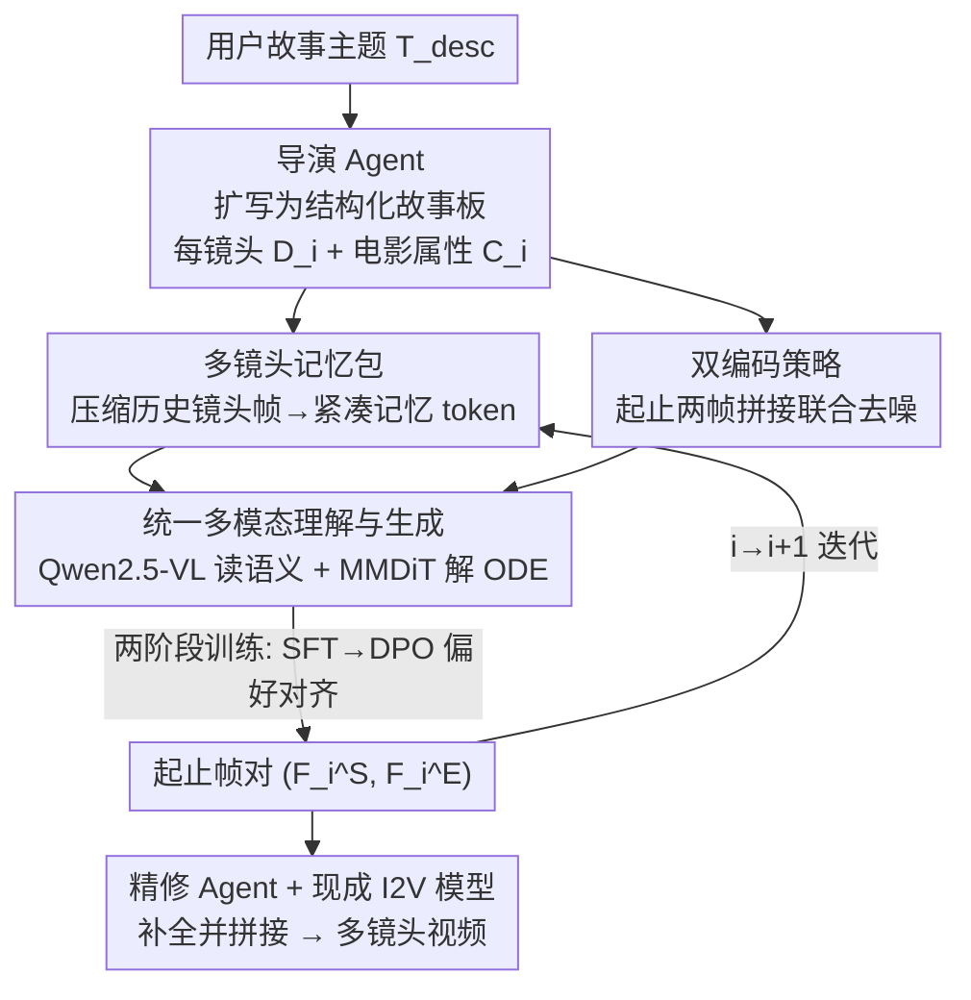

# STAGE: Storyboard-Anchored Generation for Cinematic Multi-shot Narrative

**会议**: CVPR 2026  
**论文**: [CVF Open Access](https://openaccess.thecvf.com/content/CVPR2026/html/Zhang_STAGE_Storyboard-Anchored_Generation_for_Cinematic_Multi-shot_Narrative_CVPR_2026_paper.html)  
**代码**: 待开源（论文称 code/dataset 将在录用后公开）  
**领域**: 视频生成 / 多镜头叙事  
**关键词**: 多镜头视频生成、故事板、起止帧对、镜头一致性、电影语言

## 一句话总结
STAGE 把"关键帧式多镜头视频生成"重新表述成"为每个镜头预测一对起始帧/结束帧"的故事板锚定问题，用 STEP2 模型（多镜头记忆包 + 双编码 + 两阶段训练）迭代生成这些起止帧对，再交给现成 I2V 模型补全，从而在跨镜头一致性和电影化转场上显著超过现有端到端与关键帧方法。

## 研究背景与动机
**领域现状**：单镜头视频生成已经很成熟，扩散 Transformer（DiT）能产出高保真短片。但要做"讲故事"的长视频，必须把多个不同景别/视角的镜头拼成一个连贯叙事，这是当前模型的薄弱环节。现有路线分两类：端到端一次性生成整段多镜头视频，以及关键帧式——先生成若干稀疏关键帧搭出叙事骨架，再用外部 I2V 模型逐镜头补全。

**现有痛点**：端到端方法算力昂贵、是"全有或全无"的范式，用户几乎无法细粒度控制，试错成本高。关键帧方法虽然效率高、可控性好，但每个镜头只给一张稀疏关键帧，**既守不住跨镜头一致性**（人物外观、场景背景在镜头间漂移），**也表达不出电影语言**（如正反打、推拉镜头这类镜头间转场）。论文 Fig.1 的例子很直白：开戒指盒的特写镜头出现了动作不连续，前一镜头还是白衬衫深领带，后一镜头变成蓝衬衫绿领带。

**核心矛盾**：单张关键帧只能"钉住"镜头里的一个瞬间，**无法同时编码镜头内部的时间演进（怎么动）和镜头之间的衔接（怎么切）**。叙事连贯性恰恰活在这两处"过渡"里，稀疏关键帧把它们都丢了。

**本文目标**：在保留关键帧路线"高效 + 可控"优点的前提下，补回三件事——全局实体一致性、镜头内连贯性、镜头间转场——并配一个带结构化标注的数据集来训练。

**切入角度**：与其给每个镜头一张关键帧，不如给一对"起始帧 $F_i^S$ 和结束帧 $F_i^E$"。这对帧带来三重好处：(i) 起止帧对组成稳健的叙事骨架，保证整段视频里实体和场景的长程一致；(ii) 镜头内对 $(F_i^S, F_i^E)$ 显式锚定了视觉内容和镜头内的演进（如镜头运动）；(iii) 相邻镜头的跨镜头对 $(F_i^E, F_{i+1}^S)$ 显式建模了转场，能传递复杂电影语言。

**核心 idea**：用"为每个镜头预测一对起止帧"替代"每个镜头一张稀疏关键帧"，把多镜头生成变成可迭代的起止帧对预测问题，让转场和镜头内动态都被显式编码进锚点里。

## 方法详解

### 整体框架
STAGE 是一条工作流，输入是用户给的一句话故事主题 $T_{desc}$，输出是拼接成的多镜头视频 $V=[V_1,\dots,V_N]$。它分三步：先用一个**导演 Agent** 把主题扩写成结构化故事板（每个镜头一段文字描述 $D_i$ + 一组电影属性 $C_i$，如景别、镜头时长、机位、运镜）；再用工作流的技术核心——**STEP2（起止帧对预测模型）**——把抽象故事板逐镜头"画"成具体的起止帧对 $(F_i^S, F_i^E)$；最后用一个**精修 Agent** 把生成的起止帧和原始故事板融合成增强提示词，喂给现成视频生成模型（WanX、Veo3.1 等）补全每个镜头并拼接。

STEP2 内部是 STAGE 的关键。它要"迭代地"为第 $i$ 个镜头生成起止帧对，所以必须同时看见三类上下文：前面所有镜头的历史（保实体一致）、当前镜头自己的起止两帧（保镜头内连贯）、当前镜头的文字+电影属性语义（保跨镜头逻辑）。对应地，STEP2 配了多镜头记忆包、双编码策略、以及一个统一的多模态理解+生成骨干，并经两阶段训练（SFT + 偏好对齐）习得电影语言。

### 关键设计

**1. 起止帧对重表述：把多镜头生成变成 STEP2 的迭代预测问题**

这是全文的根。痛点是单张稀疏关键帧编码不了镜头内动态和镜头间转场。STAGE 把任务改写成：为第 $i$ 个镜头预测一对 $(F_i^S, F_i^E)$，条件是该镜头的描述 $D_i$、电影属性 $C_i$ 以及前面所有镜头的起止帧对，即 $(F_i^S, F_i^E) = \mathrm{STEP2}(D_i, C_i, \{(F_j^S, F_j^E)\}_{j=1}^{i-1})$。第一个镜头没有历史，只用自身规格条件化；之后从 $i=1$ 一路迭代到最后一个镜头 $i=N$。这样镜头内的"起→止"演进被一对帧显式锚定，相邻镜头的 $(F_i^E, F_{i+1}^S)$ 又天然成了转场建模的对象——稀疏关键帧丢掉的两处过渡，在这里都变成了被预测的目标。

**2. 多镜头记忆包：用渐进空间平铺把无限历史压成一个紧凑 token**

迭代到第 $i$ 个镜头时，要保人物外观、场景这类长程实体一致，就得参考前面所有镜头；但全量参考会带来巨大计算负担。多镜头记忆包的做法是：把前 $i-1$ 个镜头的起止帧打散收进记忆库 $\{F_j^M\}_{j=1}^{2i-2}$，用预训练 VAE 编码到隐空间 $m_j = E_{vae}(F_j^M)$，再按 CLIP 相似度排序（让语义相关的记忆排前面），最后通过**渐进空间平铺**压成一个记忆 token：

$$M_i = \mathrm{SpatialTile}_{j\in\{1,\dots,2i-2\}}\big(P(m'_j, A_j)\big)$$

其中 $P(m'_j, A_j)$ 是下采样函数，按压缩率 $A_j = \frac{1}{2^j}$ 压缩第 $j$ 个隐码。这个 $\frac{1}{2^j}$ 是巧思：越靠后（越不相关）的记忆压得越狠，且总面积数学上收敛——$\sum_{j=1}^{\infty} A_j = 1$，所以无论历史多长，记忆 token 的总体积都有界。这就让 STEP2 能呈现一段"潜在无限"的生成历史而不爆显存，是它能做长视频的关键支撑。

**3. 双编码策略：让起始帧与结束帧隐式共享视觉上下文**

要保镜头内连贯（场景视觉一致 + 时间动态如推镜合理），起止两帧不能各画各的。双编码策略把真值起止帧对分别用 VAE 编码，再沿序列维拼成一个联合镜头张量 $x_i = [E_{vae}(F_i^S); E_{vae}(F_i^E)]$，然后按 flow matching 惯例与高斯噪声线性插值：$x_i^t = t\cdot x_i^1 + (1-t)\cdot x_i^0$，其中 $x_i^1=x_i$ 是干净张量、$x_i^0\sim\mathcal{N}(0,I)$ 是噪声。关键在"拼成一个张量再一起去噪"——MMDiT 块里的自注意力让起、止两帧在去噪全程互相参照，从而隐式共享上下文，避免出现消融里那种"起止两帧里城堡长得不一样"的镜头内割裂。

**4. 统一多模态理解+生成骨干：先读懂语义再解 ODE 生成**

光有图像条件不够，还要"读懂"镜头讲什么故事、人物怎么表演。STEP2 先用基于 Qwen2.5-VL 的理解模型 $E_{mu}$，吃进上一镜头结束帧 $F_{i-1}^E$、当前镜头描述 $D_i$ 和电影属性 $C_i$，产出统一上下文 token $U_i = E_{mu}(F_{i-1}^E, D_i, C_i)$。再把 $U_i$、记忆 token $M_i$、插值后的联合张量 $x_i^t$ 一起送进生成模型 $E_{gen}$（多个 MMDiT 块，自注意力做全局上下文交互），通过数值求解器从 $t=0$ 积分到 $t=1$ 解 ODE：

$$dx_i^t/dt = E_{gen}(U_i, t, x_i^t, M_i)$$

得到干净的起止帧对。把"理解"与"生成"统一进一个架构，是 STEP2 能从多样上下文里稳健推理、保住跨镜头连贯的原因。

### 损失函数 / 训练策略
两阶段训练（对应消融里的 TTS）。**阶段一 SFT**：在 ConStoryBoard 上对理解模型 $E_{mu}$（高层语义）和生成模型 $E_{gen}$（低层帧生成）都用 LoRA 微调，按 flow matching 学恒定速度场 $v_t = x_i^1 - x_i^0$：

$$L_{SFT} = \mathbb{E}_{x_i^1, x_i^0, \mathcal{C}_i, t}\|v_\theta(x_i^t, t, \mathcal{C}_i) - v_t\|^2$$

其中 $\mathcal{C}_i = [D_i, C_i, \{(F_j^S, F_j^E)\}_{j=1}^{i-1}]$ 汇总了文本描述、电影属性和所有前序起止帧对。**阶段二偏好对齐**：以 SFT 模型为参考模型 $v_{ref}$，在人工精选的 ConStoryBoard-HP 上用 DPO 后训练，最大化策略模型偏好正样本 $y_w$ 胜过负样本 $y_l$ 的似然：

$$L_{DPO} = -\mathbb{E}_{(y_w,y_l),\mathcal{C}_i,t}\big[\log\sigma(\beta(D_\theta - D_{ref}))\big]$$

其中偏好差 $D_k = \|v_k(\hat{x}_i^t,t,\mathcal{C}_i)-\hat{v}_t\|^2 - \|v_k(\check{x}_i^t,t,\mathcal{C}_i)-\check{v}_t\|^2$（$k\in\{\theta,ref\}$，$\hat{\cdot}$ 来自负样本、$\check{\cdot}$ 来自正样本）。负样本的构造很巧：从同一视频片段里随机抽两个内部帧当 $y_l$（它们代表"不完整的运镜"这类错误电影语言），真值起止帧对当正样本 $y_w$，这样 DPO 直接对"是否符合电影语言"的偏好做对齐。

## 实验关键数据

实现基于 Qwen-Image，VAE 冻结，LoRA rank=64，8×A800，Adam，学习率 $1\times10^{-4}$；SFT 跑 100K 步、偏好对齐再跑 20K 步。评测覆盖五个维度共 8 个量化指标（VBench 的 AQ/IQ/OC/SC/BC，扩展的跨镜头 SC-E/BC-E，自定义转场指标 TVS）+ 4 个 VLM 打分（OVQ/VTC/ISC/STS）。

### 主实验
| 方法 | AQ↑ | OC↑ | SC-E↑ | BC-E↑ | TVS↑ | OVQ↑ | VTC↑ | ISC↑ | STS↑ |
|------|-----|-----|-------|-------|------|------|------|------|------|
| CineTrans（端到端） | 0.5652 | 0.2018 | 0.6197 | 0.7428 | 0.0455 | 0.7972 | 0.3551 | 0.5585 | 0.4931 |
| IC-LoRA + WanX | 0.6333 | 0.2140 | 0.5319 | 0.7438 | 0.2090 | 0.7597 | 0.3897 | 0.4901 | 0.4696 |
| StoryDiffusion + WanX | 0.6941 | 0.2087 | 0.5780 | 0.7988 | 0.1441 | 0.5343 | 0.2069 | 0.4813 | 0.4575 |
| VideoGen-of-Thought | 0.7210 | 0.1689 | 0.6278 | 0.7830 | 0.0966 | 0.8106 | 0.1120 | 0.5086 | 0.4507 |
| MovieAgent | 0.5742 | 0.0711 | 0.4993 | 0.6473 | 0.0079 | 0.4895 | 0.1931 | 0.4511 | 0.4182 |
| **Ours (STAGE)** | **0.7689** | **0.2713** | **0.6917** | **0.8207** | **0.2732** | **0.8929** | **0.6069** | **0.6985** | **0.6255** |

STAGE 在全部 8 个量化指标和 4 个 LLM 打分上都拿第一。最值得注意的是 VTC（视频-文本一致性）从次优的 0.3897 跳到 0.6069、TVS（转场质量）从 0.2090 到 0.2732，说明它在"忠实复现指令"和"电影化转场"这两个最难的点上拉开了差距，而非只是整体画质略好。

人评（25 名 AMT 志愿者、随机 20 样本、四项实验）进一步印证：

| 方法 | 视觉质量VQE | 文本对齐TAE | 镜头一致SCE | 转场ITE |
|------|------|------|------|------|
| CineTrans | 13.2 | 18.4 | 6.4 | 16.4 |
| IC-LoRA + WanX | 24.4 | 12.8 | 13.2 | 7.2 |
| StoryDiffusion + WanX | 1.2 | 8.0 | 5.6 | 3.6 |
| VideoGen-of-Thought | 2.8 | 4.4 | 0.4 | 2.0 |
| MovieAgent | 0.8 | 3.2 | 1.6 | 1.2 |
| **Ours (STAGE)** | **57.6** | **53.2** | **72.8** | **69.6** |

镜头一致性（72.8%）和转场（69.6%）上的偏好率压倒性领先，正好对应方法主打的两个卖点。

### 消融实验
| 配置 | SC↓变化 | BC↓变化 | SC-E | BC-E | TVS | 说明 |
|------|------|------|------|------|------|------|
| Full (STAGE) | 0.9695 | 0.9685 | 0.6917 | 0.8207 | 0.2732 | 完整模型 |
| w/o MMP | 0.9631 | 0.9592 | 0.6088 | 0.7311 | 0.2370 | 去多镜头记忆包，跨镜头一致性掉最多（SC-E/BC-E 明显下降），出现夜→昼跳变 |
| w/o DES | 0.9542 | 0.9476 | 0.6803 | 0.8124 | 0.2680 | 去双编码，镜头内 SC/BC 掉最多，起止帧城堡长得不一样 |
| w/o TTS | 0.9613 | 0.9633 | 0.6636 | 0.8037 | 0.2195 | 只 SFT 不做偏好对齐，TVS 掉最多（0.2732→0.2195），转场突兀 |

### 关键发现
- **三个模块各管一摊，掉点位置和设计意图完全对得上**：去 MMP 主要伤跨镜头一致性（SC-E 0.6917→0.6088、BC-E 0.8207→0.7311），去 DES 主要伤镜头内一致性（SC 0.9695→0.9542），去 TTS 主要伤转场（TVS 0.2732→0.2195）。这种"哪里去模块、哪里掉指标"的干净对应，是模块设计有效的有力证据。
- **偏好对齐（DPO）是电影语言的关键来源**：单靠 SFT 模型缺乏负例暴露，学不到有效的镜头间转场，会出现"前镜头人物低头、后镜头已经在拍天空"的硬切。用"同片段内部帧"当负样本这一构造，是低成本拿到"错误电影语言"对比的聪明做法。
- **数据集补足了关键帧数据的结构性缺口**：现有关键帧数据集每镜头只给单帧、只关注文本-镜头对齐，ConStoryBoard（100K 训练对 + 1K 测试对，从 Condensed Movies 过滤 1080p+、美学分 5.5+，TransNetV2 切镜，InternVL-3.5 标注）专门提供起止帧对和电影属性，是 STEP2 能被训练出来的前提。

## 亮点与洞察
- **重表述本身就是最大亮点**：把"稀疏关键帧"换成"起止帧对"，看似只是从 1 帧变 2 帧，实则把"镜头内动态"和"镜头间转场"这两个原本无处安放的建模目标，一次性变成了可预测、可监督的对象。这种"换个表示让难题变可学"的思路可迁移到任何序列化生成任务。
- **渐进空间平铺的 $\sum 1/2^j=1$ 收敛设计很优雅**：用几何级数压缩率保证记忆 token 体积有界，让"潜在无限历史"在固定预算下可表示，是支撑长视频的工程巧思，可复用到任何需要压缩不定长历史的迭代生成场景。
- **用"同片段内部帧"造 DPO 负样本**：不需要额外标注或另训奖励模型，就近从正样本所在片段抽内部帧，天然对应"不完整运镜"的负例，把偏好对齐的数据成本压到几乎为零。
- **工作流式解耦**：导演 Agent（规划）→ STEP2（视觉锚点）→ 精修 Agent + 现成 I2V（补全），各司其职，既保留细粒度可控，又能复用最新视频模型，不把所有能力压进一个端到端黑箱。

## 局限与展望
- **作者承认的局限**：最终补帧依赖现成 I2V 模型，可能在单个镜头片段内部引入时间不一致——STEP2 只保证起止两帧的质量与跨镜头一致，中间帧的连贯性受制于下游生成器。
- **自己发现的局限**：(1) 评测里跨镜头一致性指标（SC-E/BC-E/TVS）多为本文自定义或扩展，缺乏社区公认基准，横向比较的绝对值意义有限，结论主要靠相对优势和人评支撑。(2) 整套流程依赖 Qwen2.5-VL、Qwen-Image、VBench、外部 I2V 等多个大模型，复现门槛和推理成本都不低。(3) DPO 负样本"同片段内部帧"假设内部帧一定代表错误电影语言，对某些慢节奏长镜头可能不成立。
- **改进思路**：把下游 I2V 也纳入联合训练或加跨镜头一致性约束，缓解镜头内漂移；或让 STEP2 预测多于 2 帧的稀疏锚点序列，在"可控"和"中间连贯"之间找更好的折中。

## 相关工作与启发
- **vs 端到端（CineTrans）**: 端到端一次生成整段多镜头视频，算力贵、全有或全无、用户难控；STAGE 走关键帧路线的可控+高效，再用起止帧对补回端到端才有的连贯性，量化全面领先（如 VTC 0.6069 vs 0.3551）。
- **vs 关键帧式（IC-LoRA+WanX / StoryDiffusion / MovieAgent / VideoGen-of-Thought）**: 它们每镜头给单张稀疏关键帧，忽略镜头间电影语言，导致硬切和逻辑断裂；STAGE 把关键帧重表述为起止帧对，**直接建模转场** $(F_i^E, F_{i+1}^S)$，在镜头一致性人评（72.8%）和转场（69.6%）上碾压。
- **vs 视觉生成里的 RLHF/DPO**: 已有工作多把 DPO 用于静态图像属性（文图保真、美学）的偏好对齐；STAGE 把它延伸到多镜头视频的**时间关系/电影语言**这类复杂时序偏好上，是 DPO 应用范围的有意义扩展。

## 评分
- 新颖性: ⭐⭐⭐⭐ 「起止帧对重表述 + 渐进空间平铺记忆 + 用内部帧造 DPO 负样本」三处都不是堆模块，思路自洽且有迁移价值
- 实验充分度: ⭐⭐⭐⭐ 5 方法对比 + 三模块消融 + 四项人评，消融与设计意图干净对应；但跨镜头指标多为自定义、缺公认基准
- 写作质量: ⭐⭐⭐⭐ 动机—三重好处—方法—实验链条清晰，图示（Fig.1/3）把抽象重表述讲得很直观
- 价值: ⭐⭐⭐⭐ 面向 AI 辅助电影/长叙事视频的实用工作流，附带 100K 规模带电影属性标注的数据集，对社区有沉淀价值

<!-- RELATED:START -->

## 相关论文

- [\[CVPR 2026\] HoloCine: Holistic Generation of Cinematic Multi-Shot Long Video Narratives](holocine_holistic_generation_of_cinematic_multi-shot_long_video_narratives.md)
- [\[CVPR 2026\] MultiShotMaster: A Controllable Multi-Shot Video Generation Framework](multishotmaster_a_controllable_multi-shot_video_generation_framework.md)
- [\[CVPR 2026\] OneStory: Coherent Multi-Shot Video Generation with Adaptive Memory](onestory_coherent_multi-shot_video_generation_with_adaptive_memory.md)
- [\[CVPR 2026\] ShotDirector: Directorially Controllable Multi-Shot Video Generation with Cinematographic Transitions](shotdirector_directorially_controllable_multi-shot_video_generation_with_cinemat.md)
- [\[CVPR 2026\] Rethinking Position Embedding as a Context Controller for Multi-Reference and Multi-Shot Video Generation](rethinking_position_embedding_as_a_context_controller_for_multi-reference_and_mu.md)

<!-- RELATED:END -->
