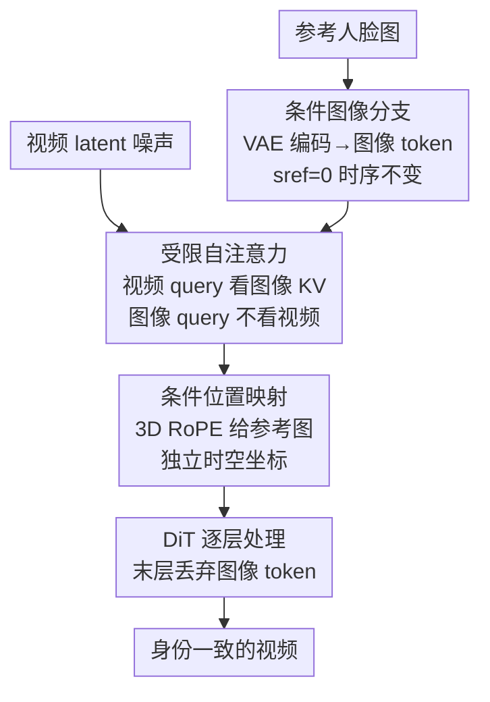

# Stand-In: A Lightweight and Plug-and-Play Identity Control for Video Generation

**会议**: CVPR 2026  
**论文**: [CVF Open Access](https://openaccess.thecvf.com/content/CVPR2026/html/Xue_Stand-In_A_Lightweight_and_Plug-and-Play_Identity_Control_for_Video_Generation_CVPR_2026_paper.html)  
**代码**: https://github.com/WeChatCV/Stand-In  
**领域**: 视频生成 / 扩散模型  
**关键词**: 身份保持、视频生成、即插即用、受限自注意力、条件位置映射

## 一句话总结
Stand-In 给预训练视频 DiT 加一条"条件图像分支"，靠**受限自注意力 + 条件位置映射**把参考人脸的身份注入生成视频，只训练约 1% 额外参数、2000 对训练数据就在人脸相似度上反超一众全参数微调方法，并且不改主干、能即插即用到风格化 / 换脸 / 姿态引导等任务。

## 研究背景与动机
**领域现状**：身份保持视频生成（identity-preserving video generation）要求给定一张含人脸的参考图，生成的视频里人物始终是"同一个人"。现有做法分两类：早期方法（ID-Animator、ConsistID）用一个**显式人脸编码器**抽取身份特征再通过 cross-attention 注入；近期方法（Phantom、HunyuanCustom）干脆**全参数微调**整个 Diffusion Transformer。

**现有痛点**：人脸编码器路线灵活性差，且很难捕捉高质量生成所需的精细面部细节——编码器输出的是一个被压缩过的身份 embedding，丢了纹理。全参数微调路线则训练代价巨大（动辄 14B 参数全调），而且改动了主干，**与其他 AIGC 工具不兼容**（没法直接接风格化 LoRA、姿态控制框架等）。

**核心矛盾**：身份保真度、训练轻量、与生态兼容这三者很难同时拿到——想保真就得重训主干，重训主干就破坏了预训练先验、也丢了即插即用能力。

**本文目标**：在**不改动主干、不引入显式人脸编码器、只训练极少参数**的前提下，做到 SOTA 的身份保持。

**切入角度**：作者的关键观察是——视频生成模型自带的预训练 **VAE** 本身就能把图像编码进和视频同一个 latent 空间，那为什么还要额外搞一个人脸编码器？直接用主干的 VAE 编码参考图，既能复用模型自身"读图"的能力抽取丰富面部特征，又天然和视频特征同构，省掉了对齐两套特征空间的麻烦。

**核心 idea**：用一条共享主干的"条件图像分支"代替显式人脸编码器，再用**受限自注意力**让视频单向参考图像 token，从而以 ~1% 参数注入身份。

## 方法详解

### 整体框架
Stand-In 以 **Wan2.1-14B-T2V** 这个 DiT 架构的视频生成模型为底座。给定一张含人脸的参考图，先用主干自带的 VAE 编码器把它映射成图像 token（走和视频 latent **完全相同**的 patchify / 编码流程），再沿序列维度把图像 token 和视频 latent token **拼接**起来，一起送进各层 DiT block。在 block 内部，图像和视频 token 在大多数模块（LayerNorm、cross-attention、FFN）里**各走各的**、互不干扰，唯独在 self-attention 层让视频 token 去"参考"图像 token 的身份信息；到最后一层，图像 token 被丢弃，只留视频分支出图。

为了让参考图保持"静态条件"的身份——它是用来作条件的、不该被去噪、也不该被视频里的动态内容带跑——作者把它的扩散时间步固定为 $s_{ref}=0$，使其在整个去噪过程中保持时间不变性。整个方法的三个贡献点对应下图三个绿色阶段：

### 关键设计

**1. 条件图像分支：用主干 VAE 替代显式人脸编码器**

这一设计直接针对"人脸编码器抽不到精细面部细节、还得对齐两套特征空间"的痛点。作者不再外挂任何 face encoder，而是把参考图喂进**视频生成模型自带的预训练 VAE**，编码出来的图像 token 和视频 latent token 处在同一个 latent 空间、走同样的 patchification，于是天然同构、可以直接沿序列维拼接后联合送进 DiT。这样做的好处有两层：一是复用了主干"读图"的内在能力，抽取的面部特征比压缩过的身份 embedding 丰富得多；二是因为不另起炉灶、不改主干结构，整条分支可以做得很轻。为保证参考图是"静态身份锚点"而非被去噪的内容，作者把它的去噪时间步钉死在 $s_{ref}=0$，让它的特征在整个扩散过程中保持时间不变；图像 token 一路陪跑到最后一层才被丢弃，只作为条件而不进入输出。

**2. 受限自注意力（Restricted Self-Attention）：让视频单向参考图像，图像不被视频带跑**

光把图像 token 和视频 token 拼起来过 **Vanilla Self-Attention** 有两个毛病：其一，参考图是静态条件，可它的 query 会去 attend 视频内容，被动态画面"污染"，身份难以维持；其二，普通自注意力不保证视频 token 真的会去看图像 token——模型可能干脆无视参考图，生成一个没有目标身份的场景（论文 Figure 5 可视化显示注意力扩散到了背景，输出甚至偏成花园场景）。

作者的修法是把 DiT 里的 vanilla self-attention 换成"受限"版：图像与视频 token **各自独立**算出 $Q_I,K_I,V_I$ 和 $Q_V,K_V,V_V$；图像分支只对自己做注意力 $\text{Out}_I=\text{Attention}(Q'_I,K'_I,V_I)$，**绝不**看视频；而视频分支则用拼接后的 KV 去做注意力：

$$\text{Out}_V=\text{Attention}\big(Q'_V,\,[K'_V,K'_I],\,[V_V,V_I]\big)$$

即视频 query 可以同时看视频和图像的 Key/Value，图像 query 却被禁止 attend 视频 Key。这就显式地保证了"信息单向从图像流向视频"——参考身份表示保持静态、又确实被视频引用到。为增强模型利用身份信息的能力同时保住主干的生成鲁棒性，作者只在**图像 token 的 QKV 投影**上加一个 LoRA（其余权重全冻结），这正是"只训 ~1% 参数"的来源。又因为 $s_{ref}=0$ 让图像的 $K_I,V_I$ 在整个去噪过程中**恒定不变**，推理时可以在第一步算好后缓存复用（**KV Caching**），后续步骤免去重复计算，几乎零额外开销。

**3. 条件位置映射（Conditional Position Mapping）：给参考图一套不重叠的独立坐标**

要在受限自注意力里把图像 token 和视频 token 区分开，还得解决"它们的位置编码怎么分配"。作者用 **3D RoPE**，给参考图 token 分配一套**专属且不与视频重叠**的坐标空间。时间维上，参考图 token 统一赋时序索引 $-1$，视频 token 则映射到非负时序位置，从而把参考图确立为"时间不变的全局身份先验"，而不是被当成某一帧的瞬时特征。空间维上采用**不相交坐标**策略：视频帧占据 $(h,w)\in[0,H_V)\times[0,W_V)$，参考图 token 则被映射到一块专属子空间 $[H_V,H_V+H_I)\times[W_V,W_V+W_I)$。位置编码以 Hadamard 乘积形式作用：$Q'_I=Q_I\cdot p_I$、$K'_I=K_I\cdot p_I$（视频 token 同理用 $p_V$）。

这种几何隔离一举两得：一方面把参考 token 从视频坐标网格里分离出去，减少了二者间的**虚假空间关联**，更好地保住了主干的预训练位置先验（对照实验里，共享位置映射 SPM 会破坏先验、画面比例不稳）；另一方面，独立坐标系让参考图保持"全局身份先验"的语义——模型被引导去提取参考图的整体语义特征，而不是把它当成需要和视频逐像素对齐的局部 pattern。

### 数据构建与训练策略
训练集仅 **2000** 条高分辨率人物视频，覆盖不同族裔、年龄、性别和动作，用 VILA 多模态字幕框架自动生成密集文本标注。视频统一重采样到 25 FPS、裁剪缩放到 832×480，随机取 81 连续帧作训练片段。参考人脸的抽取流水线：从原视频随机选 5 帧 → RetinaFace 检测裁脸 → resize 到 512×512 → BiSeNet 做人脸解析并把背景替换为纯白，防止背景信息泄漏。LoRA rank=128，仅作用于每个 DiT block 中图像 token 的 QKV 投影，对 14B 的 Wan2.1 只新增 **153M（约 1%）可训练参数**；训练 3000 步、batch size 48、在 H20 上完成。

## 实验关键数据

### 主实验
评测取 OpenS2V 基准里权重最高的两项指标——人脸相似度（参考图与生成帧人脸的 CurricularFace embedding 余弦相似度）和自然度（GPT-4o 按 1–5 打分逼近人类判断），外加 X-CLIP 衡量的文本跟随度。Stand-In 仅 0.15B 需训练参数，却在人脸相似度上全面领先：

| 方法 | 需训参数 | 人脸相似度↑ | 自然度↑ | 文本跟随↑ |
|------|---------|------------|--------|----------|
| Hunyuan-Custom | 13B | 0.622 | 3.367 | 19.853 |
| VACE-14B | 14B | 0.647 | 3.728 | 19.520 |
| Phantom-14B | 14B | 0.519 | 3.828 | 20.476 |
| ConsistID | 5B | 0.432 | 3.233 | **20.552** |
| Hailuo（闭源） | — | 0.577 | 3.750 | 20.649 |
| **Stand-In (Ours)** | **0.15B** | **0.724** | **3.922** | 20.594 |

人脸相似度 0.724 不仅超过所有开源方法，也压过闭源 Hailuo（0.577）；自然度 3.922 同样第一；文本跟随度在所有方法里第二、开源里第一。20 人参与的用户研究同样一边倒：

| 方法 | 人脸相似度↑ | 视频质量↑ |
|------|------------|----------|
| Hunyuan-Custom | 3.34 | 2.92 |
| VACE-14B | 3.00 | 3.07 |
| Kling | 2.21 | 3.09 |
| **Stand-In (Ours)** | **4.10** | **4.08** |

### 消融实验
两个核心组件各做替换对照：

| 配置 | 人脸相似度↑ | 自然度↑ | 说明 |
|------|------------|--------|------|
| RSA → VSA | 0.422 | 3.855 | 受限自注意力换回普通自注意力 |
| CPM → SPM | 0.536 | 3.755 | 条件位置映射换成共享位置映射 |
| Full Model | **0.724** | **3.922** | 完整模型 |

### 关键发现
- **受限自注意力是身份保真的命门**：换回普通自注意力后人脸相似度从 0.724 暴跌到 0.422（掉约 0.30），因为图像 query 被视频内容污染、模型常常无视参考人脸；这是全文掉点最猛的一处。
- **条件位置映射稳画面也提身份**：换成共享位置映射后相似度降到 0.536、自然度降到 3.755，说明把参考 token 塞进视频坐标系会破坏预训练位置先验、画面比例失稳。
- **极致轻量**：14B 主干上只加 1% 参数，前向时间 +3.6%、FLOPs +2.6%；推理开 KV Caching 后运行时间仅 +2.3%、FLOPs +0.07%，几乎无感。
- **强泛化**：只用真人数据训练，却能零样本迁移到泰迪熊、卡通角色等非人主体，并对没见过的不同族裔/年龄人物保持身份一致。

## 亮点与洞察
- **"复用主干 VAE 取代人脸编码器"是最值钱的一招**：它一举消掉了"显式编码器丢细节 + 两套特征空间要对齐"两个老问题，参考图和视频天生同构，这也是只需 2000 对数据就能学好对齐的根本原因。
- **受限自注意力把"信息单向流"做成了硬约束**：不靠 loss 惩罚、而是直接在注意力的 KV 拼接结构上禁止图像 query 看视频，既保住参考身份静态、又强制视频去引用它——这种"用结构而非损失保证行为"的思路很可迁移。
- **$s_{ref}=0$ 顺手换来 KV Caching**：固定时间步本是为保持身份静态，结果让图像 KV 全程恒定，推理几乎零增量，设计动机和效率收益恰好咬合。
- **即插即用是不改主干的红利**：因为身份注入只是一条基于 LoRA 的旁路、没动主干结构，它能直接叠到 VACE 姿态控制、风格化 LoRA、零样本 inpainting 换脸上，扩展性几乎白送。

## 局限与展望
- 训练数据仅 2000 条且为人物视频，虽展示了对卡通/物体的零样本泛化，但对极端非人主体（复杂结构物体、多主体同框）的稳健性论文未系统量化。
- 自然度依赖 GPT-4o 打分逼近人类判断，作为代理指标本身存在偏差，⚠️ 具体打分协议以原文为准。
- 方法绑定在自带 3D-VAE + 3D RoPE 的 DiT 架构（如 Wan2.1）上，迁移到 U-Net 或不含 RoPE 的视频模型时，条件位置映射这一设计能否照搬尚需验证。
- 仅处理单参考图、单人脸身份；多人身份分别控制、身份与表情/年龄解耦编辑等更细粒度场景留待后续。

## 相关工作与启发
- **vs 人脸编码器方法（ID-Animator / ConsistID）**：它们外挂显式 face encoder 抽身份 embedding 再 cross-attention 注入，受限于编码器丢细节；Stand-In 直接用主干 VAE 抽特征、同构注入，人脸相似度 0.724 vs ConsistID 0.432，且无需额外编码器。
- **vs 全参数微调方法（Phantom / HunyuanCustom / VACE-14B）**：它们重训整个 DiT，代价大且改了主干、不兼容其他工具；Stand-In 只训 1% 参数、不动主干，相似度反超（0.724 vs 0.647 的 VACE-14B），还保留即插即用能力。
- **vs VACE（姿态引导）**：二者并非纯竞争——Stand-In 作为旁路接到 VACE 上能显著提升姿态引导视频里的人脸相似度，体现其"增强而非替代"的兼容定位。

## 评分
- 新颖性: ⭐⭐⭐⭐ "用主干 VAE 替代人脸编码器 + 受限自注意力单向注入"组合干净有效，虽各组件有前身但整合角度新。
- 实验充分度: ⭐⭐⭐⭐ 主表/用户研究/消融齐备，且覆盖换脸、风格化、姿态等多下游；非人主体泛化偏定性。
- 写作质量: ⭐⭐⭐⭐ 动机—设计—验证链条清晰，注意力/位置映射图示到位。
- 价值: ⭐⭐⭐⭐⭐ 1% 参数 + 2000 对数据反超全参数 SOTA 且即插即用，实用性极高。

<!-- RELATED:START -->

## 相关论文

- [\[CVPR 2026\] Identity-Preserving Image-to-Video Generation via Reward-Guided Optimization](identity-preserving_image-to-video_generation_via_reward-guided_optimization.md)
- [\[CVPR 2026\] ConsID-Gen: View-Consistent and Identity-Preserving Image-to-Video Generation](consid-gen_view-consistent_and_identity-preserving_image-to-video_generation.md)
- [\[CVPR 2026\] PLACID: Identity-Preserving Multi-Object Compositing via Video Diffusion with Synthetic Trajectories](placid_identity-preserving_multi-object_compositing_via_video_diffusion_with_syn.md)
- [\[CVPR 2026\] EvoID: Reinforced Evolution for Identity-Preserving Video Generation](evoid_reinforced_evolution_for_identity-preserving_video_generation.md)
- [\[CVPR 2025\] Wav2Sem: Plug-and-Play Audio Semantic Decoupling for 3D Speech-Driven Facial Animation](../../CVPR2025/video_generation/wav2sem_plug-and-play_audio_semantic_decoupling_for_3d_speech-driven_facial_anim.md)

<!-- RELATED:END -->
