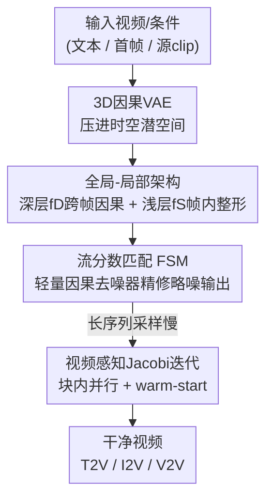

# STARFlow-V: End-to-End Video Generative Modeling with Autoregressive Normalizing Flows

**会议**: CVPR 2026  
**论文**: [CVF Open Access](https://openaccess.thecvf.com/content/CVPR2026/html/Gu_STARFlow-V_End-to-End_Video_Generative_Modeling_with_Autoregressive_Normalizing_Flows_CVPR_2026_paper.html)  
**代码**: https://github.com/apple/ml-starflow  
**领域**: 视频生成  
**关键词**: 归一化流, 自回归生成, 视频生成, 因果建模, 流分数匹配

## 一句话总结
STARFlow-V 把归一化流（NF）搬进视频生成领域，用「全局-局部」可逆结构做端到端最大似然训练 + 因果自回归推理，再配上轻量因果去噪器（flow-score matching）和视频感知 Jacobi 并行求解，首次证明归一化流能在 480p 视频上做出接近因果扩散基线的质量，并天然统一 T2V/I2V/V2V 三类任务。

## 研究背景与动机

**领域现状**：视频生成几乎被扩散模型垄断。Sora 之后 DiT 风格的扩散骨干在大规模文生视频上展示了强泛化，主流系统（HunyuanVideo、Wan2.1、CogVideoX）全是扩散。归一化流虽然在图像域刚靠 TARFlow / STARFlow 重新追上扩散，但在维度和算力都高一个量级的视频域，几乎没人尝试。

**现有痛点**：扩散视频生成有两个结构性问题。其一是**训练不是端到端**——它在随机噪声水平上腐蚀帧、再学去噪器反演，每次更新只监督一个噪声水平，训练成本对视频极高，优化的也只是 $\log p$ 的下界。其二是**并行去噪本质非因果**：所有帧一起加噪、一起去噪，未来帧能影响过去帧，不适合流式/交互场景。为做因果而提出的自回归扩散又引入了**曝光偏差（exposure bias）**：训练时喂真实上下文，推理时只能喂自己（带误差）的预测，误差沿时间轴滚雪球，长视频质量崩坏。

**核心矛盾**：扩散为了鲁棒性靠「加噪条件」，但加噪会损失信息、还要额外参数；自回归扩散把误差累积在**像素空间**，前一帧的瑕疵会原样传给后一帧。问题的根在于：自回归生成的条件信号是含误差的像素，而像素空间分布任意多模态、对小误差不宽容。

**本文目标**：(1) 让视频生成回到**端到端最大似然**；(2) 做**严格因果**的自回归滚动以支持流式；(3) 抑制长程误差累积；(4) 用一个骨干统一 T2V/I2V/V2V。

**切入角度**：归一化流是可逆映射，训练用 change-of-variables 的精确 MLE，采样是一次性求逆——天生端到端、天生无需迭代去噪、天生支持可逆特征映射。STARFlow 已证明「用 Transformer 参数化的自回归归一化流」能在高分辨率图像上 scale，那把它的自回归性恰好对齐视频的时间因果性，是个自然契合。

**核心 idea**：把自回归归一化流的可逆性 + 因果性带进视频——让深层流在**紧凑的全局潜空间**里做「连续版 next-token prediction」承担时间推理，浅层流只在帧内做局部整形，从而把误差累积留在低维、单模态、易回归的潜空间，而非像素空间。

## 方法详解

### 整体框架
STARFlow-V 先用预训练的 3D 因果 VAE（来自 WAN2.2，空间 ×16、时间 ×4 压缩到 48 通道）把视频压进时空潜空间，再用一串自回归流块把潜变量可逆地映射到高斯先验。核心是 **deep–shallow 分解** $f_\theta = f_D \circ f_S$：浅层 $f_S$ 用交替（左→右 / 右→左）掩码做帧内局部整形 $u = f_S(x)$，深层 $f_D$ 是因果 Transformer 流，把 $u$ 映到先验 $z = f_D(u)$。训练时整模型仍是 NF，靠 change-of-variables 做精确 MLE；推理时求逆 $f_D^{-1}$ 逐 token、逐帧因果采样，$f_S^{-1}$ 再对每帧独立解码。最后接一个轻量因果去噪器 $s_\phi$ 把略带噪的输出精修成干净视频。三个任务（T2V/I2V/V2V）只改条件信号、不改骨干。

### 关键设计

**1. 全局-局部架构：把误差累积从像素空间挪进单模态潜空间**

朴素地把整段视频当一条长 token 序列会出问题——浅层 $f_S$ 的交替掩码会把未来帧信息传回过去帧，整体就变成非因果生成器。本文的做法是**限制 $f_S$ 只在帧内工作，只让 $f_D$ 跨帧传播全局上下文且保持因果**。于是似然被重写成对帧的自回归分解：

$$p_\theta(x) = \prod_{n=1}^{N} p_D(u_n \mid u_{<n}) \,\big|\det J_{f_S}(x_n)\big|, \quad u_n = f_S(x_n)$$

这等价于把视频看成一个**连续语言模型**：深层项 $p_D(u_n \mid u_{<n})$ 就是潜空间里的「高斯 next-token prediction」（仿射形式见下文公式），浅层提供 Jacobian 因子 $|\det J_{f_S}(x_n)|$。为什么有效？因为相比直接对任意多模态的像素 $x$ 建模，每一步的潜变量 $u$ 是单模态的、更好回归、对小预测误差更宽容；而且采样时 $f_D^{-1}$ 条件于**之前生成的潜变量**而非像素，数据空间的误差不会前向传播——这正是扩散式自回归误差累积的解药。同时它保留了 STARFlow 的通用逼近保证（局部栈仍实现逐像素的无限高斯混合），又因为整模型是 NF，所有参数靠精确 MLE 训练，无需逐步去噪 schedule，训练-测试失配天然更小。底层的仿射流块沿用 STARFlow 的形式：

$$z = \big(x - \mu_\theta(x \odot m)\big) / \sigma_\theta(x \odot m), \quad \sigma_\theta(\cdot) > 0$$

其中 $m$ 是自排斥因果掩码，$T \ge 3$ 个交替方向的块即可做到通用密度建模。

**2. 流分数匹配 FSM：用可学因果去噪器修掉「噪声梯度」和「分数非因果」两个坑**

NF 训练需要往数据注入小噪声 $\sigma$ 来稳住优化（在 $\sigma$-平滑密度 $q_\sigma$ 上学），副作用是模型只能生成略带噪的样本，需要后处理去噪。现成方案都不行：解码器微调（STARFlow 的 GAN 去噪）在 3D 因果 VAE 上因感受野有限而丢失时间一致性；TARFlow 的基于分数的去噪用 Tweedie 估计 $x \approx \tilde{x} + \sigma^2 \nabla_{\tilde{x}} \log p_\theta(\tilde{x})$，但有两个硬伤——(1) 学到的密度 $p_\theta$ 不完美，其分数含高频噪声，在大运动区域表现为亮斑伪影；(2) 即便 $p_\theta$ 因果，分数 $\nabla_{\tilde{x}} \log p_\theta$ 按定义是**全局**的，第 $n$ 帧的梯度依赖未来帧 $m > n$ 的似然项，直接破坏了因果性和流式承诺。

本文训练一个轻量神经去噪器 $s_\phi$ 去回归模型分数：

$$\mathcal{L}_{\text{denoise}}(\phi) = \mathbb{E}_{x,\epsilon}\big\| s_\phi(\tilde{x}) - \sigma \nabla_{\tilde{x}} \log p_\theta(\tilde{x}) \big\|_2^2, \quad \tilde{x} = x + \epsilon,\ \epsilon \sim \mathcal{N}(0, \sigma^2 I)$$

它一箭三雕：神经网络的平滑归纳偏置压住了分数里的高频伪影；可以在 $s_\phi$ 里**直接编码因果**——用「一帧前瞻」（one-step latency）把分数近似为 $s_\phi(\tilde{x}_{\le n+1}) \approx (\sigma \nabla_{\tilde{x}} \log p_\theta)_n$，重新拿回流式行为（严格 $\le n$ 反而失败，因为时间差分对判断去噪方向至关重要）；训练几乎零额外开销——因为 $f_\theta$ 本来就在最大化 $\log p_\theta$，反向传播时缓存输入梯度直接当 $s_\phi$ 的回归目标即可。

**3. 视频感知 Block-wise Jacobi 迭代：在不破坏因果的前提下把逐 token 采样并行化**

逐 token、逐 AF 块的顺序采样对长视频极贵——3B 模型生成 5 秒 480p/16fps 需要 30 多分钟。本文把求逆改写成解非线性不动点系统 $x = \mu_\theta(x \odot m) + \sigma_\theta(x \odot m)\cdot z$，用 **Jacobi 迭代**并行求解：从初始估计 $x^{(0)}$ 出发迭代 $x^{(k+1)} = \mu_\theta(x^{(k)} \odot m) + \sigma_\theta(x^{(k)} \odot m)\cdot z$，直到尺度归一化残差 $\|x^{(k+1)} - x^{(k)}\|_2^2 / \|x^{(k+1)}\|_2^2 < \tau$（默认 $\tau = 0.001$）。因果掩码诱导的三角系统保证了 Jacobi 迭代收敛，而视频的强全局结构让实际收敛远快于最坏情况。进一步用**块式**调度：序列切成大小 $B$ 的连续块，块间顺序、块内并行，已完成块的状态当 KV cache 喂后续块；再叠加**视频感知初始化**——新帧的 $x^{(0)}_{n+1}$ 直接用上一帧收敛态 $x^{(k)}_n$ 热启动（相邻帧时间相干性提供好的起点）。整体相对标准自回归解码降低约 15× 推理延迟，且不损视觉保真。配合全局-局部带来的**流水线解码**（$f_D$ 不停跑、$f_S$ 线程并行消费其输出），端到端延迟由最慢的深层块主导。

### 一个完整示例：同一骨干怎么吃三类任务
归一化流的可逆性让「解码器复用为编码器」成为可能，三类任务只换条件信号：
- **T2V**：默认设置，文本编码 $t$ 作条件，噪声 $z$ 经深层块 → 中间特征 $u$ → 浅层块 → 略噪视频 → 去噪器精修。
- **I2V**：把首帧当观测条件，**不需要单独编码器**——用流的前向把首帧编码进 KV cache，后续帧再自回归生成。
- **V2V**：把整段源 clip 全部当观测条件，同样用前向 flow-encode 填 KV cache，再在可选任务线索（in/outpainting 掩码、编辑文本、相机/姿态）下自回归滚出目标 clip，未编辑区域 copy-through、编辑区域合成。
- **流式生成**：用滑窗（chunk-to-chunk）在深层块里生成远超训练长度的视频——产出一个潜 chunk 后，对最后 $\Delta$ 个 overlap 潜变量重跑 $f_D$ 重建 KV cache，再续生成 $N-\Delta$ 个，训练时随机丢首帧模拟重启以缓解边界失配。

### 损失函数 / 训练策略
主损失是 NF 的精确 MLE（change-of-variables）：$\mathcal{L}_{\text{NF}}(\theta) = \mathbb{E}_x[\log p_0(f_\theta(x)) + \log|\det J_{f_\theta}(x)|]$，去噪器损失 $\mathcal{L}_{\text{denoise}}$ 与之联合训练。数据上用 70M 文本-视频对（Panda 高质量子集 + 自有库存视频），原始/合成 caption 比例 1:9，并混 400M 文本-图像对联合训练。训练采用渐进式 curriculum：从单帧图像模型初始化，扩到 7B 参数视频模型（加大深层块容量），分辨率 384p→480p 但序列长度固定 81 帧；去噪器是 8 层 Transformer，通道数与浅层块一致。

## 实验关键数据

### 主实验（VBench 文生视频）
基线取自 VBench leaderboard。STARFlow-V 是榜上唯一的归一化流方法，达到与近期**因果扩散**基线同档的水平，实质性缩小了 NF 与扩散在视频上的历史差距（†表示用 GPT 增强的 Rewriter prompt）。

| 模型 | 类别 | Total↑ | Quality↑ | Semantic↑ |
|------|------|--------|----------|-----------|
| Veo3（闭源） | 闭源 | 85.06 | 85.70 | 82.49 |
| Wan2.1-T2V | 扩散 | 83.69 | 85.59 | 76.11 |
| HunyuanVideo | 扩散 | 83.24 | 85.09 | 75.82 |
| Self-Forcing (Chunk) | 自回归扩散 | 84.31 | 85.07 | 81.28 |
| NOVA | 自回归扩散 | 80.12 | 80.39 | 79.05 |
| MAGI-1-distill | 自回归扩散 | 77.92 | 80.98 | 65.68 |
| **STARFlow-V†（本文）** | **归一化流** | **79.70** | **80.76** | **75.43** |
| STARFlow-V（本文） | 归一化流 | 78.67 | 80.24 | 72.37 |
| STARFlow-V†（non-Causal） | 归一化流 | 79.22 | 80.34 | 74.71 |

### 消融实验（去噪器选择，1000 段大运动视频的 VAE 重建质量）
| 方法 | PSNR↑ | SSIM↑ | rFID↓ |
|------|-------|-------|-------|
| No noise（上界参考） | 32.22 | 0.8907 | 3.26 |
| Decoder fine-tuning [STARFlow] | 23.95 | 0.6403 | 19.74 |
| Score-based denoising [TARFlow] | 22.05 | 0.6490 | 7.65 |
| **Flow-score matching（本文）** | **26.69** | **0.7601** | **7.06** |

### 关键发现
- **FSM 是去噪器里的明显赢家**：PSNR 26.69 vs 解码器微调 23.95 / 分数去噪 22.05，SSIM 也最高；解码器微调会丢时间一致性（帧间抖动），分数去噪在大运动区有亮斑伪影，FSM 都规避了。
- **强制因果几乎不掉点**：non-Causal 变体（Total 79.22）与因果版（79.70†/78.67）非常接近，说明加因果结构换来流式能力，但感知质量代价很小。
- **长程外推鲁棒**：训练只见 5s，却能稳定生成到 30s；同等条件下 NOVA、Self-Forcing 出现模糊、色偏、结构形变，STARFlow-V 仍保持清晰一致——印证了「误差留在潜空间不传像素」的鲁棒性论点。
- **Jacobi 块大小有甜点**：块太小并行不足、块太大块内需更多迭代收敛，runtime 先降后升；视频感知 warm-start 对大块、非首帧增益最大，故采用「首帧用中块（64）、后续帧用大块（512）」的非对称策略，整体约 15× 加速。

## 亮点与洞察
- **「连续语言模型 = 视频自回归流」的视角很漂亮**：把深层流项 $p_D(u_n|u_{<n})$ 解读成潜空间的高斯 next-token prediction，一下子把 LLM 那套因果 Transformer + KV cache 的工程经验（块式解码、流式滑窗、流水线并行）整套接管过来。
- **可逆性是免费午餐**：因为映射可逆，解码器能直接复用为编码器，I2V/V2V 不需要额外条件编码器——这是扩散做不到的结构性便利，一个骨干吃三类任务。
- **把误差累积「降维」是核心洞见**：自回归扩散的痛是误差在任意多模态的像素空间滚雪球；本文让条件信号变成单模态、易回归的潜变量，从机制上而非靠 trick 缓解曝光偏差，这个思路可迁移到任何自回归生成任务。
- **FSM 缓存梯度当目标的工程巧思**：去噪器的回归目标本来就是 MLE 反传时的输入梯度，缓存复用即可，几乎零额外开销——便宜又解决了分数的高频噪声 + 非因果两个坑。

## 局限与展望
- **延迟仍非实时**：尽管 Jacobi + 流水线把延迟降了 ~15×，commodity GPU 上离实时还很远，这是 NF 视频落地交互/游戏场景的最大门槛。
- **没看到干净的 scaling law**：作者承认在当前数据清洗下没观测到清晰的扩展规律，进步被数据噪声和偏置卡住。
- **质量尚未追平最强扩散**：VBench Total 79.7 仍低于 Wan2.1（83.69）、Self-Forcing（84.31），目前只是「同档于因果扩散」，是 proof-of-concept 级别的首次证明，而非全面超越。
- 作者点的方向：减延迟、做蒸馏/剪枝压模型、重做数据 curation 与主动选数据以解锁更清晰的 scaling。

## 相关工作与启发
- **vs STARFlow（图像）**: STARFlow 把自回归归一化流 scale 到高分辨率图像。本文不是简单移植到视频，而是引入全局-局部重构（限制 $f_S$ 帧内、只让 $f_D$ 跨帧因果）、FSM 去噪器、视频感知 Jacobi——专门解决视频的时空维度和因果流式需求。
- **vs 自回归扩散（NOVA / CausVid / Self-Forcing）**: 它们用 chain-rule + 扩散、靠异步逐帧噪声 schedule 做因果，但训练非端到端、误差累积在像素空间、有曝光偏差。本文端到端 MLE、误差留潜空间、可逆无信息损失，长程外推更稳。
- **vs TARFlow 的分数去噪**: TARFlow 用学到的流自身做基于分数的去噪，但分数含高频噪声且全局非因果。本文用可学因果去噪器回归该分数，既平滑伪影又恢复因果。
- **vs VideoFlow（唯一的 NF 视频先例）**: VideoFlow 基于 Glow，受限于容量、低分辨率、特定域。本文是首个达到接近因果扩散质量的 NF 文生视频模型。

## 评分
- 新颖性: ⭐⭐⭐⭐⭐ 首次让归一化流在 480p 视频上做出可用质量，全局-局部 + FSM + 视频 Jacobi 三个设计都针对 NF 视频化的真实难点，开辟了扩散之外的一条路。
- 实验充分度: ⭐⭐⭐⭐ VBench 主表 + 去噪器消融 + Jacobi 块大小分析 + 长程外推对比都有，但定量上仍输最强扩散，drifting 量化指标放在附录，正文略单薄。
- 写作质量: ⭐⭐⭐⭐⭐ 动机推导（端到端 / 因果 / 误差累积）层层递进，「连续语言模型」视角和三个设计的因果链讲得很清楚。
- 价值: ⭐⭐⭐⭐ 作为 NF 视频生成的首个 proof-of-concept 和潜在 world model 骨干，方向价值高；但延迟和未追平 SOTA 让短期落地受限。

<!-- RELATED:START -->

## 相关论文

- [\[CVPR 2026\] MoCha: End-to-End Video Character Replacement without Structural Guidance](mocha_end-to-end_video_character_replacement_without_structural_guidance.md)
- [\[CVPR 2026\] AutoCut: End-to-end Advertisement Video Editing Based on Multimodal Discretization and Controllable Generation](autocut_end-to-end_advertisement_video_editing_based_on_multimodal_discretizatio.md)
- [\[CVPR 2026\] LottieGPT: Tokenizing Vector Animation for Autoregressive Generation](lottiegpt_vector_animation_generation.md)
- [\[CVPR 2026\] A Frame is Worth One Token: Efficient Generative World Modeling with Delta Tokens](a_frame_is_worth_one_token_efficient_generative_world_modeling_with_delta_tokens.md)
- [\[CVPR 2026\] GT-SVJ: Generative-Transformer-Based Self-Supervised Video Judge For Efficient Video Reward Modeling](gt-svj_generative-transformer-based_self-supervised_video_judge.md)

<!-- RELATED:END -->
