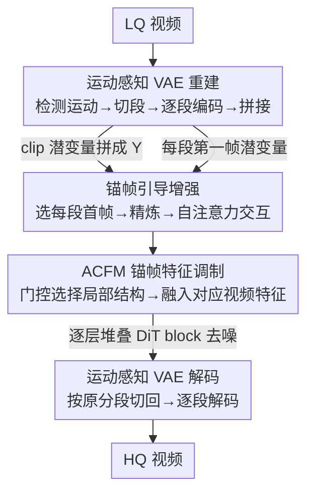

# STCDiT: Spatio-Temporally Consistent Diffusion Transformer for High-Quality Video Super-Resolution

**会议**: CVPR 2026  
**论文**: [CVF Open Access](https://openaccess.thecvf.com/content/CVPR2026/html/Chen_STCDiT_Spatio-Temporally_Consistent_Diffusion_Transformer_for_High-Quality_Video_Super-Resolution_CVPR_2026_paper.html)  
**代码**: https://jychen9811.github.io/STCDiT_page （项目页）  
**领域**: 视频生成 / 扩散模型 / 视频超分  
**关键词**: 视频超分, 视频扩散模型, 运动感知 VAE, 锚帧引导, LoRA 微调

## 一句话总结
STCDiT 基于预训练视频扩散模型做视频超分，用「运动感知 VAE 分段重建」解决复杂相机运动下的时序失真，用「锚帧引导增强」把每段第一帧未被时间压缩的结构信息注入生成过程，只增加约 LoRA 7% 的参数就在结构保真度和时序一致性上超过一众 SOTA。

## 研究背景与动机

**领域现状**：视频超分（VSR）要从低质（LQ）视频恢复高质（HQ）帧。传统时空建模方法细节贫乏，于是近年转向扩散先验：图像扩散模型逐帧生成感知质量好，视频扩散模型则天然能建模时空、帧间更连贯，成了更有希望的路线。

**现有痛点**：把预训练视频扩散模型直接搬到 VSR 上有两个绕不过去的坎。其一是**重建阶段的时序稳定性**——视频扩散依赖预训练 VAE 做时间维下采样/上采样，而 VAE 里的时间缩放算子只在局部空间上操作，无法刻画跨帧的复杂空间变换；一旦遇到相机抖动、缩放这类运动，VAE 重建就会出现结构扭曲和伪影。其二是**生成阶段的结构保真度**——已有方法（SeedVR）靠全量微调 DiT 来保真，算力代价极高；换成参数高效的 LoRA，又因低秩约束限制了模型捕捉复杂特征交互的能力，难以一边保住 LQ 结构、一边生成准确细节。

**核心矛盾**：VAE 的时间算子是「全局共享的局部算子」，但真实视频的运动是**分段非均匀**的；强行用一套算子重建整段含突变运动的视频，必然失真。而生成端要保真，本质上缺的是**来自 LQ 输入的、未被时间压缩破坏的结构锚点**。

**核心 idea**：与其重设计 VAE 架构（成本高），不如**把视频按运动模式切成「段内运动一致」的小段分别重建**；与其全量微调，不如**抓住每段第一帧潜变量（不受时间压缩影响、结构信息最丰富）作为锚帧**，把它的结构信息通过自注意力和门控调制注入生成过程。两个设计耦合，让参数高效的扩散模型也能做高质量 VSR。

## 方法详解

### 整体框架

STCDiT 建立在预训练 Wan 2.1 视频扩散模型之上，整条管线分两段：**重建**用运动感知 VAE，**生成**用带锚帧引导的 DiT（LoRA 微调）。输入一段 LQ 视频，先做运动检测、按突变运动点切成 $L$ 个段，每段单独过 VAE 编码得到 clip 潜变量 $\{X_i\}_{i=1}^{L}$，沿时间维拼成 $Y$；同时把每段第一帧潜变量挑出来作为锚帧潜变量 $I_{AF}$。$Y$ 与噪声、mask 拼接后 patchify 成视频特征 $F_V$，锚帧经过精炼模块得到 $F_{AF}$；两者在每个 DiT block 里先通过自注意力交互、再经 ACFM 门控调制，让结构信息逐层注入视频特征。扩散完成后，恢复潜变量 $Y'$ 按原始分段切回 $\{X_i'\}$，每段单独解码，拼成最终 HQ 视频。

### 关键设计

**1. 运动感知 VAE 分段重建：用「段内运动一致」绕开时间算子的短板**

针对 VAE 时间缩放算子无法建模复杂帧间运动的痛点，作者不去改 VAE 架构（太费人力），而是在输入侧做文章：把整段视频切成若干**段内运动均匀**的 clip，让 VAE 在每个 clip 内只面对简单一致的运动，自然就重建得准。运动检测的流程是：对 LQ 视频先用 Shi–Tomasi 算法检测各帧角点，再用 Lucas–Kanade 稀疏光流估计内容的运动轨迹，从中拟合一个仿射变换矩阵；把仿射矩阵分解出平移、旋转角、缩放三类参数，配合经验阈值定位**运动突变**的帧索引，并据此把视频切成 $L$ 段。每段 $X_i \in \mathbb{R}^{C\times F\times H\times W}$ 单独编码，沿时间维拼成 $Y\in\mathbb{R}^{C\times F'\times H\times W}$ 送入扩散；恢复后的 $Y'$ 再按原分段切回 $\{X_i'\}$ 逐段解码。推理时还把单段最大长度限制在 9 帧，避免长 clip 内部运动错配。消融里 MA VAE 比标准 VAE 重建 PSNR 直接高 4.20dB，说明「段内一致」这个朴素假设确实卡中了 VAE 的命门。

**2. 锚帧引导增强：把未被时间压缩的首帧结构注入生成**

LoRA 微调缺的是 LQ 侧的结构约束，作者的观察很关键——VAE 编码一段帧时，**每段第一帧不参与时间压缩**，因此它的潜变量保留了比后续帧更丰富的空间结构信息。于是把这些首帧潜变量挑出来作为锚帧潜变量 $I_{AF}$（推理时只均匀取四分之一的首帧潜变量，控制开销）。锚帧先过一个精炼模块 AFR 增强空间细节：$\hat I_{AF}=\mathrm{DConv}(\mathrm{PConv}(I_{AF}))$，$\tilde F_{AF}=\downarrow_2(\hat I_{AF})+\mathrm{TConv}(I_{AF})$，$F_{AF}=\mathrm{DConv}(\mathrm{PConv}(\zeta(\tilde F_{AF})))$，其中 DConv 是 $3\times3$ 深度卷积、PConv 是 $1\times1$ 卷积、$\downarrow_2$ 是 $\times2$ 最大池化、$\zeta$ 是 SiLU、TConv 是步长 2 的 $2\times2$ 卷积。随后把锚帧 token 与视频 token 沿序列维拼成 $T^C_j$，喂进每个 DiT block 的自注意力层做交互：

$$\mathrm{Attn}(T^C_j)=\mathrm{softmax}\!\left(\frac{Q_jK_j^\top}{\sqrt d}\right)V_j$$

让视频特征能借锚帧里的结构信息提升保真度。两个细节很巧：其一，对 $Q_j,K_j$ 做位置编码时，保留视频 token 的位置索引，只把锚帧 token 的索引沿时间维**平移**，借 RoPE 的外推性避免两类 token 索引重叠，从而不破坏视频 token 原有的时序关系；其二，自注意力输出后按序列维拆开，锚帧 token **不进入**后面注入文本嵌入的交叉注意力层——因为锚帧和文本交互会破坏它携带的结构信息（消融显示让锚帧进交叉注意力会让 MUSIQ 掉 4.84）。

**3. 锚帧对应特征调制 ACFM：门控筛选局部结构再融入对应帧**

自注意力擅长建全局依赖，但对视频/锚帧里的**局部空间信息**利用不足。ACFM（受 DiT4SR 启发）的做法不是把锚帧特征直接注入，而是先从锚帧特征里估计**门控单元**做判别式筛选。把 token reshape 回特征 $O^V_j$、$O^{AF}_j$ 后，先抽锚帧局部信息：$\hat D^{AF}_j=\mathrm{DConv}(O^{AF}_j)+O^{AF}_j$，$\hat S^{AF}_j=\hat D^{AF}_j\odot\phi(\mathrm{DConv}(\hat D^{AF}_j))$，其中 $\odot$ 是逐元素积、$\phi$ 是 GELU——这个门控让模型只挑「有用」的锚帧局部特征，而非一股脑灌入。接着把它融到对应位置的视频特征上：$[\hat O^{V1}_j,\hat O^{V2}_j]=\mathrm{Split}(O^V_j)$，$\hat O^{V1'}_j=\hat O^{V1}_j+\hat S^{AF}_j$，$\hat D^{cat}_j=\mathrm{Concat}(\hat O^{V1'}_j,\hat O^{V2}_j)$，最后再过一层 DConv 残差增强局部空间特性 $\hat D^O_j=\mathrm{DConv}(\hat D^{cat}_j)+\hat D^{cat}_j$。相比 DiT4SR 直接注入，ACFM 的「判别式选择 + 局部融合」对 VSR 更有效，消融中加入它让 MUSIQ/DOVER 再涨 2.66/1.31。

### 损失函数 / 训练策略
基于 Wan2.1 T2V-1.3B（STCDiT-tiny）和 Wan2.1 I2V-14B（STCDiT）实现，LoRA rank=128，仅增加约 LoRA 参数 7% 的训练量。训练用均方误差损失约束，AdamW 优化器、恒定学习率 5e-5，视频/图像 batch 分别为 32/128，4 张 A800。视频裁剪 $480\times480$、时序 27-33 帧；推理 10 步去噪。训练数据由 UltraVideo（HQ 视频）+ LSDIR（HQ 图像）经 RealBasicVSR/Real-ESRGAN 退化合成 LQ，并额外注入相机抖动与缩放，文本描述由 Qwen2.5-VL 生成。

## 实验关键数据

### 主实验

在 REDS30、UDM10、RealVSR、VideoLQ 及新提出的 SportsLQ 上与 SOTA 对比（$\times4$ 超分，RealVSR/SportsLQ 为原分辨率）。下表摘取 REDS30 与 RealVSR 的代表性指标（红/蓝为最优/次优，此处用「本文 vs 最强对手」呈现）：

| 数据集 | 指标 | STCDiT (14B) | 最强对手 | 对比 |
|--------|------|--------------|----------|------|
| REDS30 | LPIPS↓ | **0.2866** | 0.2943 (Wan) | 最优 |
| REDS30 | MUSIQ↑ | **61.65** | 59.54 (UAV) | 最优 |
| REDS30 | DOVER↑ | **42.94** | 40.09 (tiny) | 最优 |
| RealVSR | MUSIQ↑ | **48.54** | 48.18 (tiny) | 最优 |
| RealVSR | DOVER↑ | **61.57** | 59.60 (DOVE) | 最优 |
| RealVSR | LPIPS↓ | **0.1553** | 0.1655 (Wan) | 最优 |

STCDiT 在 REDS30/UDM10/RealVSR 上的 MUSIQ、CLIPIQA+、MANIQA、FasterVQA、DOVER 等无参考指标几乎全面领先；在覆盖抖动/缩放的真实数据 VideoLQ 上也几乎全胜。仅 1.3B 的 STCDiT-tiny 也常排到次优，证明方法本身而非堆参数在起作用。作者也诚实指出：warping error $E^*_{warp}$ 上优势不明显，因为该指标会惩罚富细节结果——细节越丰富反而 warp 分越高（⚠️ 这是作者引用文献的解释，以原文为准）。

### 消融实验

运动感知重建（在 REDS30 重建任务上，纯 VAE 重建对比）：

| 配置 | PSNR↑ | SSIM↑ | $E^*_{warp}$↓ |
|------|-------|-------|---------------|
| 标准 VAE 重建 (ST VAE) | 27.22 | 0.7802 | 1.76 |
| 运动感知 VAE (MA VAE) | **31.42** | **0.8924** | **1.34** |

锚帧引导增强逐组件消融（RealVSR 上）：

| 配置 | MUSIQ↑ | DOVER↑ | 说明 |
|------|--------|--------|------|
| Base | 68.30 | 55.62 | 无锚帧 |
| Base w/ FF | 70.58 | 58.68 | +首帧锚帧自注意力交互 |
| Base w/ FF&DWC | 71.87 | 59.34 | 锚帧注入用普通 DWConv |
| Base w/ FF&ACFM | 73.24 | 59.99 | 注入换成 ACFM |
| Ours w/ ITE | 68.73 | 56.15 | 锚帧误进交叉注意力 → 掉点 |
| Ours w/o FF & w/ US | 69.72 | 56.39 | 锚帧改均匀采样 → 掉点 |
| Ours (full) | **73.57** | **60.81** | +锚帧精炼模块 |

### 关键发现
- **运动感知重建是地基**：单这一项就让重建 PSNR 涨 4.20dB，验证「VAE 失真根因是段内运动不一致」这一判断。
- **锚帧必须是首帧、且必须避开文本交互**：改成均匀采样（Ours w/o FF&w/ US）明显掉点，证实「首帧不被时间压缩」才是结构信息富集的来源；让锚帧进交叉注意力（Ours w/ ITE）MUSIQ 掉 4.84，说明文本交互会污染锚帧的纯结构信息。
- **ACFM 比直接注入更优**：用 ACFM 取代普通 DWConv，MUSIQ 从 71.87 升到 73.24，门控判别式选择确实比无脑注入更适合 VSR。

## 亮点与洞察
- **「不改架构、改输入分段」的工程智慧**：面对 VAE 时间算子的固有缺陷，作者没有去重设计算子（劳力密集），而是用经典 CV 工具（Shi-Tomasi + Lucas-Kanade + 仿射分解）在输入端把难题拆简单，性价比极高，这种「把模型短板转化成数据预处理问题」的思路可迁移到很多预训练模型适配场景。
- **锚帧的发现很「啊哈」**：每段首帧潜变量不被时间压缩、结构最干净——这是对 VAE 时间压缩机制的细致观察，把它当作 LQ 结构锚点注入生成，等于免费拿到一份高保真结构先验。
- **RoPE 索引平移避免冲突**：把锚帧 token 索引沿时间维平移、借 RoPE 外推性接入预训练 DiT 而不破坏原时序，是个干净的小 trick，凡是要往预训练注意力里塞额外 token 都能复用。

## 局限与展望
- **依赖运动检测的可靠性**：分段质量取决于光流/角点检测，在极弱纹理、剧烈遮挡或快速光照变化场景下，仿射拟合与阈值定位可能失效，导致分段错误（作者未深入讨论失败案例）。
- **$E^*_{warp}$ 上不占优**：虽然作者用「指标惩罚细节」解释，但时序一致性的客观度量上确实没拉开差距，强时序场景下的稳定性仍待更直接的验证。
- **超参偏经验**：运动突变阈值、最大 clip 长度 9 帧、锚帧采样 1/4 等都是经验设定，跨数据集的鲁棒性和自适应化是可改进方向。
- **分段单独编解码的开销**：段数多时逐段 VAE 编解码会增加推理成本，长视频上的效率有待评估。

## 相关工作与启发
- **vs SeedVR (全量微调 DiT)**: 二者都想用视频扩散做保真 VSR，但 SeedVR 全量微调算力极高；STCDiT 用 LoRA + 锚帧引导，只增约 LoRA 7% 参数就达到更优结构保真，参数效率是核心优势。
- **vs STAR-I2VGEN**: STAR 因 LQ 与生成过程交互不足而产生结构扭曲；STCDiT 正是用锚帧自注意力交互 + ACFM 显式强化这种交互，针对性地补上了这块短板。
- **vs UAV / MGLD (图像扩散 + 光流)**: 它们靠光流对齐缓解闪烁，但图像扩散对同一输入在不同噪声下会产生不同结果，时序一致性天生受限；STCDiT 直接用视频扩散建模时空，从根上更稳。
- **vs DiT4SR**: ACFM 受其启发，但把「直接注入」改成「门控判别式选择 + 局部融合」，更契合 VSR 对局部结构筛选的需求。

## 评分
- 新颖性: ⭐⭐⭐⭐ 「分段重建 + 锚帧引导」组合新颖，锚帧来自对 VAE 时间压缩的细致观察，但单个组件多为已有技术的巧妙组装。
- 实验充分度: ⭐⭐⭐⭐⭐ 5 个数据集（含自建 SportsLQ）、10+ 指标、逐组件消融充分，tiny/14B 双规模验证。
- 写作质量: ⭐⭐⭐⭐ 动机推导清晰、图文对照到位，公式符号略密集。
- 价值: ⭐⭐⭐⭐ 参数高效地把视频扩散落到 VSR，对复杂相机运动场景实用价值高。

<!-- RELATED:START -->

## 相关论文

- [\[CVPR 2026\] I'm a Map! Interpretable Motion-Attentive Maps: Spatio-Temporally Localizing Concepts in Video Diffusion Transformers](interpretable_motion-attentive_maps_spatio-temporally_localizing_concepts_in_vid.md)
- [\[CVPR 2026\] Compressed-Domain-Aware Online Video Super-Resolution](compressed-domain-aware_online_video_super-resolution.md)
- [\[CVPR 2026\] Attention Surgery: An Efficient Recipe to Linearize Your Video Diffusion Transformer](attention_surgery_an_efficient_recipe_to_linearize_your_video_diffusion_transfor.md)
- [\[CVPR 2025\] Learning Temporally Consistent Video Depth from Video Diffusion Priors](../../CVPR2025/video_generation/learning_temporally_consistent_video_depth_from_video_diffusion_priors.md)
- [\[ICCV 2025\] NormalCrafter: Learning Temporally Consistent Normals from Video Diffusion Priors](../../ICCV2025/video_generation/normalcrafter_learning_temporally_consistent_normals_from_video_diffusion_priors.md)

<!-- RELATED:END -->
