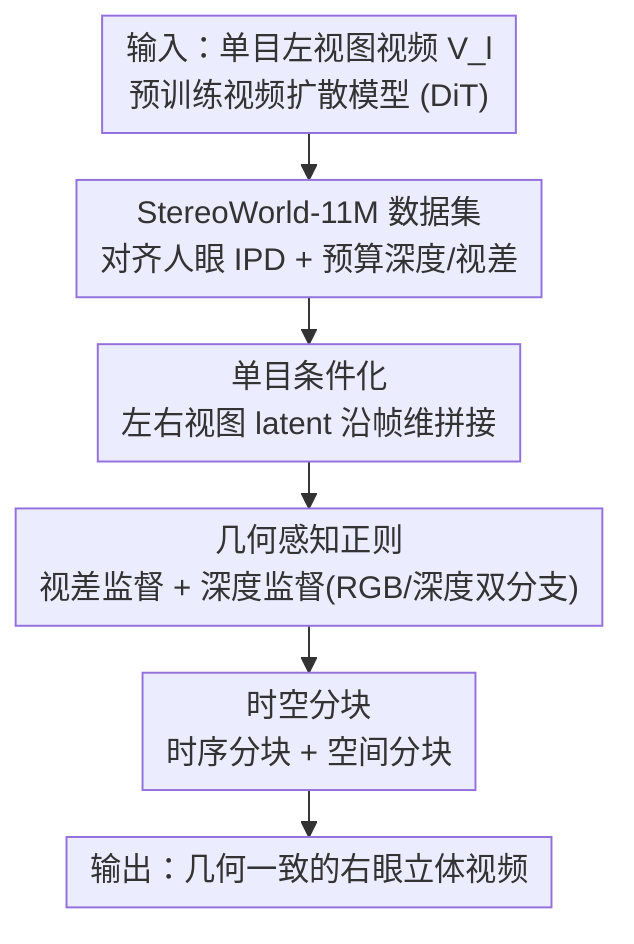

# StereoWorld: Geometry-Aware Monocular-to-Stereo Video Generation

**会议**: CVPR 2026  
**论文**: [CVF Open Access](https://openaccess.thecvf.com/content/CVPR2026/html/Xing_StereoWorld_Geometry-Aware_Monocular-to-Stereo_Video_Generation_CVPR_2026_paper.html)  
**代码**: [项目主页](https://ke-xing.github.io/StereoWorld/)  
**领域**: 视频生成  
**关键词**: 单目转立体, 视频扩散, 几何感知正则, 视差/深度监督, XR立体视频

## 一句话总结
把一个预训练的单目视频扩散模型直接「改装」成立体视频生成器：用沿帧维拼接左右视图的极简条件化注入单目引导，再用**视差 + 深度双重几何感知正则**逼出真实 3D 结构，配上时空分块做高分辨率长视频，并自建首个对齐人眼瞳距（IPD）的 1100 万帧立体视频数据集，端到端从任意单目视频生成几何一致的右眼视图（PSNR 25.98 vs StereoCrafter 23.04）。

## 研究背景与动机

**领域现状**：XR 设备（Apple Vision Pro、Meta Quest）普及催生了对立体视频的旺盛需求，但拍立体片要靠精确标定同步的双目摄像机，门槛极高；而网上海量单目视频唾手可得，于是「单目转立体」成了刚需。现有方法分两派：一派把它当**新视角合成（NVS）**——用 SfM / NeRF / 3DGS 先重建几何再渲染右眼视图；另一派是**深度-变形-补全（depth-warp-inpaint）**流水线——先估深度、按深度把帧 warp 到目标视角、再用扩散模型补全遮挡区。

**现有痛点**：NVS 派对位姿误差和非刚体运动很脆弱，常生成几何不稳、时序不一致的立体；warp-inpaint 派的致命问题是**补全阶段与立体几何估计解耦**——inpainting 不参考原左视图信息、打断了像素级对应，导致纹理扭曲、色偏和立体伪影，看久了不舒服。

**核心矛盾**：立体视频的本质是「同一场景在左右眼间的几何对应」，可一旦把任务拆成多阶段（估深度→warp→补全），每一步都引入独立误差且互不约束，破坏了自然视频分布；想保几何一致就得让生成过程**显式感知 3D 结构**，而不是靠后处理拼补。

**本文目标**：把一个通用的单目视频生成模型，端到端地变成既视觉保真、又几何准确的立体生成器，从左视图 $V_l$ 直接生成右视图 $V_r$。

**切入角度**：作者押注于「预训练视频扩散模型本身就含丰富时空先验」，与其依赖脆弱的位姿估计或多阶段 warp，不如让模型**显式学立体几何**、直接生成连贯右眼视图——但纯 RGB 重建损失学不出 3D 结构（模型只会拍平物体边界、视差不稳），所以必须补显式几何信号。

**核心 idea**：用「极简帧维拼接条件化 + 视差/深度双重几何监督」让一个单目视频扩散模型端到端长出立体几何感知，再用时空分块解决高分辨率长视频的工程约束。

## 方法详解

### 整体框架
StereoWorld 建立在预训练文生视频扩散模型（Wan2.1-T2V-1.3B，DiT + 3D VAE + Rectified Flow）之上，目标是从左视图直接扩散出右视图。整条管线分四块：先构建对齐人眼 IPD 的 StereoWorld-11M 数据集（顺带用现成模型预算好深度图 $D_r$ 和视差图 $\text{Disp}_{gt}$ 作监督）；训练时把左、右视图（及深度）的 latent 沿**帧维拼接**送进扩散模型作单目条件；同时用一个轻量可微立体投影器估出预测视差、用视差损失约束几何对应；并把 DiT 最后几个 block 复制成 RGB / 深度双分支、联合扩散 RGB 与深度补全非重叠区的几何；推理时只用共享 + RGB 分支，配时空分块生成高分辨率长视频。

### 关键设计

**1. StereoWorld-11M：对齐人眼瞳距的大规模立体数据集**

立体生成的数据困境是：现有立体数据集（Spring、VKITTI2、TartanAir 等）的**基线（两眼间距）远超人眼 IPD（55–75mm）**——基线动辄超过 10cm，直接拿来训会产生夸张视差，戴 XR 看了头晕；而少数对齐 IPD 的（如 3D Movies）又不公开。作者从网上收了上百部高清蓝光 SBS（左右并排）立体电影，覆盖动画/写实/战争/科幻/历史/剧情多类型，统一裁成左右视图、降到 480p / 81 帧，得到首个**大规模 + 高清 + IPD 对齐**的立体视频数据集（>1100 万帧，预处理后 142,520 个片段）。它是后续所有监督的基础——视差监督和深度监督的 GT 都在这套数据上用 Stereo Any Video 和 Video Depth Anything 预算得到，保证生成的视差贴合人眼舒适区。

**2. 单目条件化：沿帧维拼接 latent，零架构改动注入左视图引导**

第一个挑战是怎么把单目生成器条件化成立体生成器。warp-inpaint 范式在补全时不参考原左视图、画质差；而用 cross-attention 注入左视图特征又要大改架构、增加开销。作者受 ReCamMaster 启发用了极简方案：把左、右视图用 VAE 编成 latent $z_l=E(V_l)$、$z_r=E(V_r)$，再**沿帧维直接拼接** $z_i=[z_l,z_r]_{\text{frame-dim}}$ 作扩散输入。妙处在于**完全不改架构**——模型已有的 3D 时空自注意力天然会在所有 token（含两视图）间融合空间、时间、视角信息，等于免费借用预训练注意力来跨视角对应，既高效又保留了左视图的完整上下文。

**3. 几何感知正则：视差 + 深度双重监督逼出真实 3D 结构**

只靠单目条件 + 标准 RGB 重建损失 $L_{\text{rgb}}$ 学不出几何（模型会拍平边界、视差不稳），所以核心创新是补一组**显式几何信号**，由两个互补部分组成。**视差监督**：先用预训练立体匹配网络在 GT 左右帧上算出 GT 视差 $\hat b_{gt}$；训练时模型预测出去噪右视 latent $z_r'$ 后，用一个轻量可微**立体投影器** $\kappa$ 从 $(z_l,z_r')$ 估出预测视差 $\hat b_{\text{pred}}=\kappa(z_l,z_r')$，用 $L_{\text{dis}}=L_{\text{log}}+\lambda_{l1}L_{l1}$ 约束（$L_{\text{log}}=\mathbb{E}[d^2]-\lambda_1(\mathbb{E}[d])^2$ 保全局几何一致、$L_{l1}=\mathbb{E}[|\hat b_{\text{pred}}-\hat b_{gt}|]$ 罚逐像素误差，$d=\log\hat b_{\text{pred}}-\log\hat b_{gt}$），强制左右视图建立准确的立体对应、抑制时序视差漂移。但视差只能约束左右**重叠区**——相机水平平移会让一侧出现新内容、另一侧消失，这些非重叠区立体匹配管不到。**深度监督**补上这块：深度提供包括不可见区在内的逐像素几何描述，作者把生成重构成「RGB + 深度联合多目标预测」，让模型同时学 RGB 视频 $L_{\text{rgb}}$ 和右视深度图 $L_{\text{dep}}$ 的速度场（深度 GT $D_r$ 由 Video Depth Anything 预算、再 VAE 编码成 $d_r$）。

**4. 双分支架构 + 时空分块：缓解多目标冲突并实现高分辨率长视频**

让同一套 DiT 参数同时学 RGB 和深度两个不同分布会梯度打架、拖慢收敛。作者的解法是**部分参数共享**：保留前面的 transformer block 共享（学联合的纹理+几何表示），把**最后几个 DiT block 复制成两条专用分支**——一条预测 RGB 速度场、一条预测深度速度场，兼顾共享表示与任务特化（推理时只用共享 + RGB 分支，深度分支只在训练时供几何引导）。工程上还有**时空分块**保可扩展：基础模型只能生成 81 帧（~3s）的短片，**时序分块**把长视频切成重叠片段、用前段末几帧引导后段，且训练时以概率 $p$ 把前几帧噪声 latent 换成干净帧来学长程时序一致、压闪烁；**空间分块**把超 480p 的高分辨率 latent 切成重叠 tile 各自去噪、再缝合融合重叠区后解码，从而在 480p 训练的模型上生成高分辨率内容。

### 损失函数 / 训练策略
总目标 $L=L_{\text{rgb}}+L_{\text{dep}}+\lambda_{\text{dis}}L_{\text{dis}}$，联合监督 RGB 重建、深度一致和视差学习。基础模型 Wan2.1-T2V-1.3B；用 LoRA（rank 128）微调，$\lambda_1=\lambda_{l1}=0.1$、$\lambda_{\text{dis}}=0.5$、lr $1\times10^{-4}$，训 1 个 epoch（约 9k 步），8×A800、bfloat16，约 11 天。

## 实验关键数据

### 主实验
在自建测试集（1000 个片段）上与三类代表方法比较：GenStereo（基于训练的图到图）、SVG（免训练视频到视频）、StereoCrafter（基于训练的视频到视频）。

| 方法 | PSNR ↑ | SSIM ↑ | LPIPS ↓ | EPE ↓ | D1-all ↓ |
|------|--------|--------|---------|-------|----------|
| GenStereo | 19.45 | 0.680 | 0.301 | 35.00 | 0.895 |
| SVG | 18.03 | 0.588 | 0.347 | 33.25 | 0.963 |
| StereoCrafter | 23.04 | 0.656 | 0.187 | 24.78 | 0.527 |
| **StereoWorld（本文）** | **25.98** | **0.796** | **0.095** | **17.45** | **0.421** |

> 指标定义：**PSNR/SSIM/LPIPS** 衡量与 GT 右视图的生成保真度；**EPE**（End-Point-Error）为生成与 GT 立体对估出视差的平均逐像素误差，**D1-all** 为视差误差超阈值（通常 3px 或 5% 真值）的像素占比——两者衡量几何/立体对应准确度（越低越好）。StereoCrafter 虽在感知质量上有竞争力，但 EPE/D1-all 明显更差，说明它视差估计不准、立体对应弱；本文在视觉与几何两类指标上全面领先。

### 消融实验
逐个开关两类几何监督（在主测试集上）：

| 深度监督 | 视差损失 | PSNR ↑ | LPIPS ↓ | EPE ↓ | D1-all ↓ |
|:---:|:---:|--------|---------|-------|----------|
| ✗ | ✗ | 23.413 | 0.152 | 42.318 | 0.613 |
| ✓ | ✗ | 24.104 | 0.132 | 37.593 | 0.574 |
| ✗ | ✓ | 24.509 | 0.113 | 29.998 | 0.522 |
| ✓ | ✓ | **25.979** | **0.095** | **17.453** | **0.421** |

### 关键发现
- **两类几何监督互补、缺一不可**：单加视差损失就把 EPE 从 42.32 降到 30.00（约束重叠区对应最有效），深度监督则改善深度边界与空间结构（补非重叠区）；两者齐上 EPE 进一步降到 17.45，PSNR 升到 25.98，证明「视差管重叠、深度管全图」的分工成立。
- **端到端比 warp-inpaint 范式在文字渲染上优势最大**：立体生成里文字最难，本文能保持左右视图文字清晰、可读、位置一致，而所有 baseline 都出现模糊或重影（鬼影）。
- **人工主观评测全维领先**：20 人对 15 个场景按 1–5 分打分，StereoWorld 在立体效果（SE 4.8）、视觉质量（VQ 4.7）、双目一致性（BC 4.9）、时序一致性（TC 4.8）四项均最高，远超 StereoCrafter（4.0–4.2）。

## 亮点与洞察
- **「沿帧维拼接」这招四两拨千斤**：不改任何架构、不加 cross-attention，纯靠预训练 DiT 已有的 3D 时空自注意力跨视角融合，把单目生成器秒变立体生成器——这是把「视角」当成额外帧塞进时序维的巧思，可迁移到任意多视角/相机控制的视频生成任务。
- **视差 + 深度的「重叠/非重叠」分工讲得很透**：明确指出视差只能约束立体匹配的重叠区、深度才能覆盖水平平移露出的新区域，这个几何洞察让两类监督不是冗余堆叠而是互补，是消融里 EPE 大降的根因。
- **IPD 对齐数据集填了真实空白**：直接点出现有立体数据基线过宽、戴 XR 会晕的问题，并用蓝光电影构建首个 IPD 对齐大规模集——数据层面的贡献对整个立体生成社区都有复用价值。

## 局限与展望
- **立体基线不可控**：视差是端到端学出来的，无法显式指定/调节立体基线大小，难以适配不同 IPD 的设备或用户偏好。
- **生成速度慢**：每段约 6 分钟，离实时差很远；作者计划用模型蒸馏等加速。
- **数据来自蓝光电影、偏影视域**：⚠️ 训练集主要是电影内容，对真实手持/户外单目视频的泛化未充分验证；深度/视差 GT 由现成模型预算，其误差会作为监督上限传导到生成结果。

## 相关工作与启发
- **vs StereoCrafter（warp-inpaint 范式）**：StereoCrafter 走「估深度→warp→扩散补全」，补全与几何解耦导致纹理过平滑、几何指标（EPE/D1-all）差；本文端到端直接生成右视图，保像素级对应，PSNR +2.94、EPE 几乎减半。
- **vs SVG（免训练）/ GenStereo（图到图）**：SVG 补遮挡区时出明显伪影与结构残缺；GenStereo 是图到图、迁到视频后时序严重不稳、逐帧失真。本文靠视频扩散先验 + 几何监督在保真和时序一致上全面胜出。
- **vs NVS 路线（NeRF / 3DGS / VGGT）**：这些方法先重建几何再渲染，受位姿误差和非刚体运动拖累、重建几何稀疏、新视角保真有限；本文不显式重建，靠生成式先验直接产出立体对，避开了位姿估计这一脆弱环节。

## 评分
- 新颖性: ⭐⭐⭐⭐ 首个端到端单目转立体视频扩散框架，帧维拼接 + 双几何监督思路新颖
- 实验充分度: ⭐⭐⭐⭐ 客观/主观指标 + 消融齐全，但 baseline 仅 3 个、数据偏影视域
- 写作质量: ⭐⭐⭐⭐ 动机与几何洞察讲得清楚，图文配合好
- 价值: ⭐⭐⭐⭐⭐ 直击 XR 立体内容生产痛点，IPD 数据集 + 端到端范式有很强落地与社区价值

<!-- RELATED:START -->

## 相关论文

- [\[CVPR 2026\] Geometry-as-context: Modulating Explicit 3D in Scene-consistent Video Generation to Geometry Context](geometry-as-context_modulating_explicit_3d_in_scene-consistent_video_generation_.md)
- [\[ICLR 2026\] Geometry-aware 4D Video Generation for Robot Manipulation](../../ICLR2026/video_generation/geometry-aware_4d_video_generation_for_robot_manipulation.md)
- [\[CVPR 2026\] Pantheon360: Taming Digital Twin Generation via 3D-Aware 360° Video Diffusion](pantheon360_taming_digital_twin_generation_via_3d-aware_360deg_video_diffusion.md)
- [\[CVPR 2026\] 3D-Aware Implicit Motion Control for View-Adaptive Human Video Generation](3d-aware_implicit_motion_control_for_view-adaptive_human_video_generation.md)
- [\[CVPR 2026\] Content-Aware Dynamic Patchification for Efficient Video Diffusion](content-aware_dynamic_patchification_for_efficient_video_diffusion.md)

<!-- RELATED:END -->
