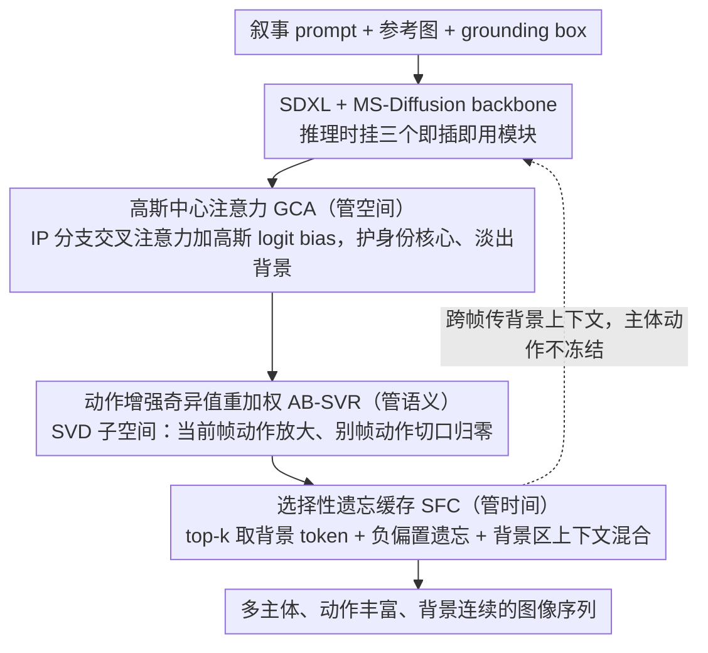

# StoryTailor: A Zero-Shot Pipeline for Action-Rich Multi-Subject Visual Narratives

**会议**: CVPR 2026  
**arXiv**: [2602.21273](https://arxiv.org/abs/2602.21273)  
**代码**: 即将开源  
**领域**: 视频生成  
**关键词**: visual storytelling, 零样本, multi-subject, 扩散模型, 注意力机制

## 一句话总结
提出StoryTailor零样本视觉叙事生成管线，通过高斯中心注意力（GCA）缓解主体重叠和背景泄漏、动作增强奇异值重加权（AB-SVR）放大动作语义、选择性遗忘缓存（SFC）维护跨帧背景连续性，在单张RTX 4090上实现多主体、动作丰富的图像叙事生成，CLIP-T较基线提升10-15%。

## 研究背景与动机

**领域现状**：个人化图像生成分两家：fine-tuning方法（DreamBooth/LoRA/Textual Inversion）需要逐身份训练，adapter方法（IP-Adapter/MS-Diffusion）更轻量但主要单帧。序列级方法（FluxKontext、视频扩散）需GPU集群且在多主体交互时容易纠缠身份。

**现有痛点**：三重张力——(1) 动作文本忠实度差（模型擅长身份但不擅长动作）；(2) 主体身份保真度在重叠/近距离时崩溃；(3) 跨帧背景连续性难以维护。

**核心矛盾**：增强动作响应需要提高文本引导强度，但这会通过交叉注意力漂移破坏身份一致性；跨帧传播背景信息又会限制主体动态变化。

**本文目标**：在单张24GB GPU上实现零训练的多主体、动作丰富、跨帧一致的视觉叙事生成。

**切入角度**：不改backbone（SDXL），而是在注意力机制和文本嵌入空间上做精确干预——分别针对空间定位、语义增强和时间连续性三个问题。

**核心 idea**：三个推理时模块分治三个子问题——GCA管空间、AB-SVR管语义、SFC管时间。

## 方法详解

### 整体框架
StoryTailor 要在一张 24GB 显卡上、不训练任何参数，就把一段长叙事 prompt 渲染成多主体、动作丰富、跨帧背景连续的图像序列。它直接复用现成的 SDXL + MS-Diffusion 作 backbone，输入是叙事 prompt、每个主体的参考图像和一组 grounding box，再在推理过程里挂三个即插即用模块——分别管空间、语义、时间这三件原本互相打架的事：GCA 在 IP 分支的交叉注意力里压住主体的空间位置，AB-SVR 在文本嵌入空间里放大当前帧该做的动作、压掉别帧串过来的动作，SFC 则负责把背景上下文跨帧传下去。三者作用在 backbone 的不同环节、互不重叠，所以能叠加而不互相破坏。

### 关键设计

**1. 高斯中心注意力（GCA）：让主体各占一块、又不被 box 框死**

多主体场景里，grounding box 常常重叠或贴得很近，注意力一旦溢出到邻框，身份就会串味，参考图里的背景也会泄漏进来。最直接的办法是用硬 box 边界把每个主体圈死，但这样关节一伸出边界就被切掉、边缘还会出伪影；退一步用软 mask 又会紧贴 box 边缘、没给动作留余地。GCA 的做法是先用 Voronoi 策略给每个 box 算一个质心 $\mu_i^*$ 作中心，再按该主体当前的文本注意力强度动态调两段高斯衰减半径 $s_i^{\text{in}}, s_i^{\text{out}}$：内圈衰减慢、把身份核心牢牢护住，外环衰减快、把主体和背景干净地解耦开。这个高斯 mask 不是硬截断，而是作为 logit bias $B_{ip}$ 加进 IP 分支的注意力里——

$$\alpha^{ip} = \text{softmax}\!\left(QK_{ip}^T/\sqrt{d} + B_{ip}\right)$$

于是中心区域的身份信息被保留、边缘平滑地淡出，主体既不串味、又有伸展动作的空间。

**2. 动作增强奇异值重加权（AB-SVR）：当前帧的动作放大、别帧的动作清零**

模型天生擅长画身份、不擅长跟动作，而且增强动作响应往往要调高文本引导强度，一调高身份又被交叉注意力漂移破坏。更麻烦的是多帧叙事里，前一帧的动作语义会顺着文本嵌入残留到下一帧。已有的 SVR 类方法（如 1Prompt1Story）只是"压低"其它帧的语义，压不干净的动作噪声照样干扰当前帧。AB-SVR 改成在子空间层面做精确切分：对当前帧的 token $X_{\text{exp}}$ 做一次 thin SVD，用累积能量阈值 $\tau=0.85$ 选出保留秩 $k$，构造投影矩阵 $P_k = U_k U_k^T$。当前帧只保留这个主干方向 $\tilde{X}_{\text{exp}} = P_k X_{\text{exp}}$ 把该做的动作顶上去；其它帧则走一个"切口"投影，把落在当前帧动作子空间里的分量整段挖掉 $\tilde{X}_{\text{sup}}^{(\text{notch})} = (I - P_k) X_{\text{sup}}$。一增一删都对着同一组主奇异方向，所以当前帧动作被强化、别帧动作被彻底归零，而不是含糊地"压一压"。

**3. 选择性遗忘缓存（SFC）：记住背景、忘掉不重要的历史**

跨帧要让背景连续，但若把上一帧完整的 KV 直接搬过来，主体运动会被冻住、显存也会爆。SFC 用两路机制只搬"该搬的"：一路是 KV 累积——从历史帧的 KV cache 里 top-k 选出 128 个最相关的 token 拼到当前帧，同时给历史 token 的 logit 加一个负偏置 $\delta_h=-0.1$ 主动促进遗忘，缓存容量封顶 512，避免无限增长；另一路是上下文混合——只在低分辨率层、且只在背景 mask $M_b'$ 圈定的区域，把前帧的注意力输出按比例混进当前帧

$$\tilde{C} = C \odot (1-\alpha M_b') + \bar{C}_{\text{prev}} \odot (\alpha M_b'), \quad \alpha=0.6$$

前景主体区域 ($M_b'=0$) 完全不受影响、动作自由，背景区域则继承前帧上下文保持连续。两路一起做到"背景跨帧延续、主体仍可自由动、历史不无限堆积"。

### 一个完整示例
以 prompt"猫和狗在厨房里打闹，下一帧猫跳上桌子"为例，假设两主体 box 在厨房中央有重叠。先看第一帧：GCA 给猫、狗各算质心并施加高斯 mask，重叠区两边都按外环快衰减压下去，于是猫不会借用狗的花纹、参考图里的背景也不渗进来；AB-SVR 对"打闹"这个动作 token 做 SVD，取 $\tau=0.85$ 下的主干子空间顶起两只动物的互动姿态；SFC 此时无历史，仅写入当前 KV cache。到第二帧"猫跳上桌子"：AB-SVR 把第一帧"打闹"语义在当前帧用切口投影 $(I-P_k)$ 挖掉，避免狗还在重复打闹动作，同时把"跳"的子空间顶上去；SFC 从第一帧 cache 里 top-k 取 128 个背景相关 token（厨房橱柜、地板）拼进来、给它们 $-0.1$ 负偏置，并在背景区按 $\alpha=0.6$ 混入前帧注意力输出——于是桌子、橱柜在两帧间保持一致，而猫的姿态从地面打闹自然过渡到跳上桌子。三个模块各管一段、互不干扰，最终输出动作连贯、身份不串、背景稳定的叙事序列。

### 损失函数 / 训练策略
零训练方法，三个模块全部在 SDXL 推理时即插即用，不引入任何可学习参数。关键超参数：高斯基础半径 (0.35 / 0.70)、AB-SVR 能量阈值 $\tau=0.85$、SFC 上下文混合强度 $\alpha=0.6$ 与遗忘偏置 $\delta_h=-0.1$。

## 实验关键数据

### 主实验

**多主体图像一致性（MSBench）**

| 方法 | CLIP-I↑ | M-DINO↑ | CLIP-T↑ |
|------|---------|---------|---------|
| MS-Diffusion | 0.692 | 0.108 | 0.340 |
| FluxKontext | 0.732 | 0.107 | 0.372 |
| Nano-Banana | 0.749 | 0.114 | 0.389 |
| **StoryTailor** | 0.717 | 0.112 | **0.414** |

### 消融实验

| 配置 | CLIP-T | CLIP-I | 说明 |
|------|--------|--------|------|
| Baseline (MS-Diff) | 0.340 | 0.692 | 基线 |
| + GCA | ~0.355 | ~0.710 | 空间定位改善 |
| + AB-SVR | ~0.390 | ~0.705 | 动作语义显著增强 |
| Full (GCA+AB-SVR+SFC) | **0.414** | **0.717** | 三者协同最佳 |

### 关键发现
- CLIP-T提升10-15%（0.340→0.414），动作和交互的文本跟随度大幅改善
- CLIP-I略低于API方法Nano-Banana（0.717 vs 0.749），但后者需集群部署
- 在单张RTX 4090上可运行，FluxKontext需要更多VRAM且更慢
- AB-SVR是CLIP-T提升的最大贡献者，GCA是CLIP-I提升的最大贡献者

## 亮点与洞察
- **三模块分治三重张力**的架构设计清晰——空间(GCA)、语义(AB-SVR)、时间(SFC)正交解耦
- **AB-SVR的SVD子空间分离**比简单权重调节更精确——通过投影矩阵做"切口"投影，当前帧保留动作主干同时彻底移除其他帧的对应分量
- **实用性强**：零训练、单GPU(24GB)、模块即插即用

## 局限与展望
- CLIP-I不是最优（0.717 vs 0.749），身份保持策略有改进空间
- 依赖用户提供grounding box，增加使用门槛
- 仅在SDXL上验证，对其他diffusion backbone的适配性未知

## 相关工作与启发
- **vs MS-Diffusion**: StoryTailor在其基础上添加三个模块，CLIP-T从0.340提升到0.414
- **vs FluxKontext**: 质量接近但StoryTailor在单GPU运行
- **vs 1Prompt1Story**: SVR先驱工作，但身份保持差、动作有限；AB-SVR引入子空间分离

## 评分
- 新颖性: ⭐⭐⭐⭐ AB-SVR的子空间切口投影尤其新颖
- 实验充分度: ⭐⭐⭐⭐ 多基线对比+消融+定性展示
- 写作质量: ⭐⭐⭐⭐ 结构清晰，但公式符号较多
- 价值: ⭐⭐⭐⭐ 单GPU视觉叙事的实用方案

<!-- RELATED:START -->

## 相关论文

- [\[CVPR 2026\] HoloCine: Holistic Generation of Cinematic Multi-Shot Long Video Narratives](holocine_holistic_generation_of_cinematic_multi-shot_long_video_narratives.md)
- [\[CVPR 2026\] ShotDirector: Directorially Controllable Multi-Shot Video Generation with Cinematographic Transitions](shotdirector_directorially_controllable_multi-shot_video_generation_with_cinemat.md)
- [\[CVPR 2026\] Are Image-to-Video Models Good Zero-Shot Image Editors?](are_image-to-video_models_good_zero-shot_image_editors.md)
- [\[CVPR 2026\] MultiShotMaster: A Controllable Multi-Shot Video Generation Framework](multishotmaster_a_controllable_multi-shot_video_generation_framework.md)
- [\[CVPR 2026\] Rethinking Position Embedding as a Context Controller for Multi-Reference and Multi-Shot Video Generation](rethinking_position_embedding_as_a_context_controller_for_multi-reference_and_mu.md)

<!-- RELATED:END -->
