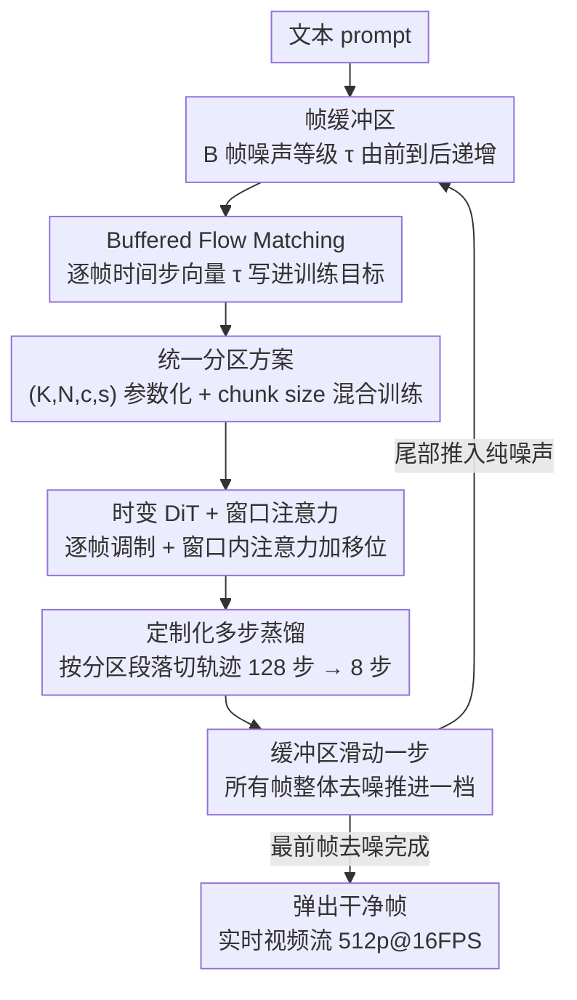

# StreamDiT: Real-Time Streaming Text-to-Video Generation

**会议**: CVPR 2026  
**arXiv**: [2507.03745](https://arxiv.org/abs/2507.03745)  
**代码**: [https://cumulo-autumn.github.io/StreamDiT/](https://cumulo-autumn.github.io/StreamDiT/) (项目页)  
**领域**: 扩散模型 / 视频生成  
**关键词**: 流式视频生成, 扩散Transformer, 实时推理, 采样蒸馏, Flow Matching

## 一句话总结
StreamDiT 提出了一套完整的流式视频生成方案（包括训练、建模和蒸馏），通过在 Flow Matching 中引入带渐进去噪的移动缓冲区和混合分区训练策略，结合时变 DiT 架构和窗口注意力，以及定制化的多步蒸馏方法，使 4B 参数模型在单 GPU 上达到 512p@16FPS 的实时流式视频生成。

## 研究背景与动机

1. **领域现状**：当前顶尖的文本到视频（T2V）模型（如 MovieGen、Hunyuan、Step-Video）基于 Diffusion Transformer（DiT）架构，使用双向注意力，能生成高质量短视频。但它们只能离线生成固定长度的短片段，无法支持交互式和实时应用。

2. **现有痛点**：
    - 增加视频长度代价极高——Transformer 对序列长度有二次复杂度
    - 自回归（AR）方式可以生成长视频但使用因果注意力，质量远不如双向注意力
    - 现有无训练的流式方法（StreamDiffusion、FIFO-Diffusion）缺少训练支持，质量受限
    - 采样蒸馏方法（步骤蒸馏、一致性蒸馏）无法直接应用于流式去噪的非标准设置

3. **核心矛盾**：低延迟（流式输出）、高吞吐量（批量处理）、高质量（双向注意力）三者难以兼得。AR 有低延迟但质量差；双向扩散有高质量但无法流式输出。

4. **本文目标** 设计一套可训练、可蒸馏的流式视频生成完整方案，同时兼顾质量和实时性。

5. **切入角度**：受 FIFO-Diffusion 的对角去噪启发，将缓冲区内帧分配不同噪声等级，但通过可训练方案和混合分区策略来弥补质量差距。

6. **核心 idea**：通过统一的帧分区方案将均匀噪声和渐进对角噪声作为特例纳入同一框架，用混合训练提升一致性，用定制化多步蒸馏实现实时推理。

## 方法详解

### 整体框架
StreamDiT 要解决的是：怎么让一个本来只能离线生成定长短片的双向扩散模型，变成可以一帧一帧吐出来、永不停机的流式生成器。它的核心载体是一个**帧缓冲区**——缓冲区里同时装着 $B$ 帧，但这些帧的去噪进度各不相同：越靠前的帧越干净，越靠后的帧越接近纯噪声。每做一步去噪，所有帧整体往「更干净」推进一点；最前面那帧一旦去噪完成就弹出缓冲区、作为输出帧送给用户，同时一帧全新的纯噪声从尾部推入。缓冲区就这样像传送带一样持续滑动，视频被源源不断地生产出来。围绕这条传送带，论文搭了三层：先用 **Buffered Flow Matching** 把「不同帧不同噪声」写进训练目标，再用**统一分区方案**把各种噪声分配策略收进一个参数化框架并做混合训练，最后用**时变 DiT + 窗口注意力**把模型改造得既能吃异质噪声又算得够快，并以**定制化多步蒸馏**把推理压到实时。

### 关键设计

**1. Buffered Flow Matching：让训练目标自带流式滑动**

标准 Flow Matching 给一段视频的所有帧施加同一个时间步 $t$，去噪时整段一起从噪声走到干净——这天然是「离线、定长」的。StreamDiT 把这个单一标量换成一组沿帧维度单调递增的时间步向量 $\tau = [\tau_1, \dots, \tau_B]$，于是缓冲区里第 1 帧几乎干净、第 $B$ 帧几乎是噪声。训练样本据此构造：

$$\mathbf{X}_\tau^i = \tau \circ \mathbf{X}_1^i + \big(1-(1-\sigma_{min})\tau\big) \circ \mathbf{X}_0$$

其中 $\circ$ 是逐帧的逐元素调制，$\mathbf{X}_1$ 是干净视频、$\mathbf{X}_0$ 是噪声。这样训练出来的模型本身就预期「一缓冲区里帧的噪声参差不齐」，推理时缓冲区沿帧维度滑动、干净帧弹出噪声帧推入的行为就和训练分布完全一致——这正是它比 StreamDiffusion、FIFO-Diffusion 那类无训练流式方法质量更高的根本原因：后者是在一个从没见过这种异质噪声的模型上硬套流式调度，分布失配导致掉质量。

**2. 统一分区方案：把均匀噪声和对角噪声收进同一组参数**

光有「单调递增的 $\tau$」还不够，因为「怎么递增」有无数种排法，单一排法训练容易过拟合到那一种节奏上。论文用四个参数把缓冲区结构化：$K$ 个参考帧（已生成、给后续帧提供上下文）加 $N$ 个 chunk，每个 chunk 含 $c$ 帧、配 $s$ 个去噪微步，于是缓冲区总帧数 $B = K + N \times c$、走完一轮的总去噪步 $T = s \times N$。这套参数的妙处在于它把两个极端都变成了特例：取 $c=B, s=1$，整个缓冲区共享一个噪声等级，就退回到标准 T2V 的均匀噪声；取 $c=1, s=1$，每帧一个独立等级，就退回到 FIFO-Diffusion 的对角噪声。训练时不固定一种分区，而是在 chunk size $\{1,2,4,8,16\}$ 之间不断切换做**混合训练**——这相当于让模型见过从「整段同步去噪」到「逐帧错位去噪」的全谱系节奏，逼它学到一种更泛化、不依赖特定缓冲区排布的去噪能力。消融里混合全部 chunk size 拿到最高质量分（0.8144），即便推理时只用 chunk=1，也印证了这种多任务正则的收益。

**3. 时变 DiT + 窗口注意力：让架构既吃得下异质噪声、又算得够快**

前两点要求模型必须能对缓冲区里每一帧施加**不同**的去噪条件，但标准 adaLN DiT 的时间嵌入是整段共享的、做不到帧级区分。StreamDiT 把时间嵌入沿帧维度拆开：将 latent reshape 成 $[F,H,W]$ 后，沿 $F$ 维给每帧单独算 scale 和 shift 调制，于是同一次前向里不同帧可以处在不同噪声等级——这是让缓冲区机制能落地的硬性前提。另一半改动是为了速度：把全注意力换成**窗口注意力**，将 3D latent 切成不重叠的窗口 $[F_w, H_w, W_w]$，注意力只在窗口内算，再靠每隔一层做一次窗口移位让信息跨窗传播、逼近全局感受野。这一步把注意力计算量压到全注意力的 $\frac{F_w H_w W_w}{FHW}$，是把吞吐量拉进实时区间的关键杠杆（代价是可能略损全局一致性，见局限）。

**4. 定制化多步蒸馏：按分区段落切轨迹，把 128 步压到 8 步**

教师模型为了质量用了很多步——在分区 $c=2, s=16, N=8$ 下总共 $s \times N = 128$ 步，还带 CFG，这个开销离实时差得远。问题是步骤蒸馏、一致性蒸馏这些现成方法都假设一条标准的「全段同步」去噪轨迹，套不进流式这种分段错位的轨迹。StreamDiT 的做法是顺着分区的段落结构来蒸：把整条 FM 轨迹按 $N$ 段切开，在**每一段内部独立**做步数蒸馏，同时把引导蒸馏也并进来——一次性把教师「多步 + CFG」的推理蒸成学生「单步 + 无条件前向」。蒸完每个 chunk 的微步 $s$ 从 16 塌缩到 1，整条轨迹的去噪步从 128 降到 8，CFG 的双倍前向也省掉。这是把质量几乎不掉的前提下（蒸馏 0.8163 vs 教师 0.8185）真正跨进实时的最后一脚。

### 一个完整示例：缓冲区怎么吐出一段流
以蒸馏后的配置直观走一遍。缓冲区里此刻装着若干帧，噪声等级从前到后类似 $\tau \approx [0.0, 0.25, 0.5, 0.75, 1.0]$——最前帧刚去噪干净、最后帧是新推入的纯噪声。模型做**一步**前向，把所有帧整体往干净推进一档：最前那帧越过 0 被判定为完成，弹出缓冲区送去显示；其余帧各自前移一格；尾部补进一帧全新纯噪声（$\tau=1.0$）。这样每滑动一拍就稳定产出一批干净帧。落到实测：蒸馏模型在单张 H100 上 482ms 生成 2 帧 latent（对应 8 帧视频），正好凑出 16 FPS 的实时流——用户感受到的就是「点了 prompt，画面就一直流出来」，而不是「等十几秒得到一段定长视频」。

### 训练策略
三阶段训练：(1) 任务学习——3K 高质量视频、大学习率 $1e{-4}$，适配流式任务；(2) 任务泛化——2.6M 预训练视频、小学习率 $1e{-5}$，提升泛化；(3) 质量微调——高质量数据、小学习率精调。每阶段 128 H100 GPU 训练 10K 迭代。蒸馏在 64 H100 上进行 10K 迭代。

## 实验关键数据

### 主实验（VBench 质量指标）

| 方法 | 主题一致性 | 背景一致性 | 时序闪烁 | 运动平滑 | 动态程度 | 美学质量 | 质量分 |
|------|-----------|-----------|---------|---------|---------|---------|-------|
| ReuseDiffuse | 0.9501 | 0.9615 | 0.9838 | 0.9912 | 0.2900 | 0.5993 | 0.8019 |
| FIFO-Diffusion | 0.9412 | 0.9576 | 0.9796 | 0.9889 | 0.3094 | 0.6088 | 0.7981 |
| StreamDiT (teacher) | 0.9622 | 0.9625 | 0.9671 | 0.9861 | **0.5240** | 0.6026 | **0.8185** |
| StreamDiT (distill) | 0.9491 | 0.9555 | 0.9649 | 0.9831 | **0.7040** | 0.5940 | 0.8163 |

### 消融实验（混合训练效果）

| Chunk size 组合 | 质量分 | 说明 |
|----------------|-------|------|
| [1] | 0.8129 | 仅对角噪声（Progressive AR Diffusion） |
| [1,2] | 0.8100 | 混合 2 种 |
| [1,2,4] | 0.8080 | 混合 3 种 |
| [1,2,4,8] | 0.8076 | 混合 4 种 |
| [1,2,4,8,16] | **0.8144** | 全混合，效果最好 |

### 关键发现
- StreamDiT 在质量分和人评（4 个维度全胜）上均超越 ReuseDiffuse 和 FIFO-Diffusion
- 基线方法虽然有更高的时序一致性和运动平滑度，但实际生成内容更加静态（动态程度极低 0.29-0.31 vs StreamDiT 的 0.52-0.70）
- 蒸馏模型与教师模型质量非常接近（0.8163 vs 0.8185），但步数从 128 降至 8
- 混合所有 chunk size 的训练方案效果最优，即使推理时只用 chunk size 1
- 实时性能：蒸馏模型在单 H100 上 482ms 生成 2 帧 latent（8 帧视频），达到 16 FPS

## 亮点与洞察
- **统一分区方案的优雅设计**：用 $(K, N, c, s)$ 四个参数统一了从标准扩散到对角扩散的所有方案，将不同方法纳入同一框架，这种抽象方式极其简洁
- **混合训练策略的意外效果**：混合所有 chunk size（包括非流式的 chunk=16）反而提升了流式生成（chunk=1）的质量，说明多任务训练的正则化效应
- **段落化蒸馏**：将 FM 轨迹按分区段落切分后独立蒸馏的思路，可以迁移到其他非标准采样路径的蒸馏场景

## 局限与展望
- 4B 参数的模型容量有限，部分生成视频存在 artifact（作者验证 30B 模型质量显著提升）
- 短上下文长度限制——画面外物体重新出现时外观可能改变
- 窗口注意力虽然高效但可能损失全局一致性
- 未来方向：结合 KV cache 扩展上下文、扩展到更大模型、提升分辨率

## 相关工作与启发
- **vs FIFO-Diffusion**: FIFO 是无训练的对角去噪方法，StreamDiT 通过训练方案和混合策略大幅提升质量
- **vs Self-Forcing**: Self-Forcing 是 AR 视频扩散的方案，每次生成一帧延迟低但质量受限；StreamDiT 用双向注意力+流式实现质量与延迟的平衡
- **vs StreamingT2V**: 使用短期和长期记忆块的 AR 方案，StreamDiT 的统一分区框架更优雅

## 评分
- 新颖性: ⭐⭐⭐⭐ 统一分区方案和定制化蒸馏有原创性，系统性设计完整
- 实验充分度: ⭐⭐⭐⭐ VBench 定量+人评+消融+多种应用展示，较为全面
- 写作质量: ⭐⭐⭐⭐⭐ 框架层次清晰，公式推导严谨，图示精美
- 价值: ⭐⭐⭐⭐⭐ 首次实现实时流式视频生成，在交互式应用场景中有重要价值

<!-- RELATED:START -->

## 相关论文

- [\[CVPR 2026\] EgoEdit: Dataset, Real-Time Streaming Model, and Benchmark for Egocentric Video Editing](egoedit_dataset_real-time_streaming_model_and_benchmark_for_egocentric_video_edi.md)
- [\[CVPR 2026\] Endless World: Real-Time 3D-Aware Long Video Generation](endless_world_real-time_3d-aware_long_video_generation.md)
- [\[CVPR 2026\] Reasoning Diffusion for Unpaired Test Time Out-of-distribution Text-Image to Video Generation](reasoning_diffusion_for_unpaired_test_time_out-of-distribution_text-image_to_vid.md)
- [\[CVPR 2026\] U-Mind: A Unified Framework for Real-Time Multimodal Interaction with Audiovisual Generation](u-mind_a_unified_framework_for_real-time_multimodal_interaction_with_audiovisual.md)
- [\[CVPR 2026\] Real-Time Generation of Streamable Talking Portrait Video with Reference-Guided Deep Compression VAEs](real-time_generation_of_streamable_talking_portrait_video_with_reference-guided_.md)

<!-- RELATED:END -->
