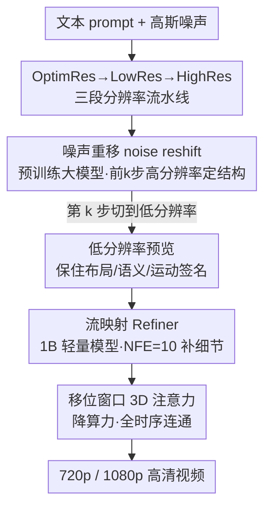

# SURF: Signature-Retained Fast Video Generation

**会议**: CVPR 2026  
**论文**: [CVF Open Access](https://openaccess.thecvf.com/content/CVPR2026/html/Ding_SURF_Signature-Retained_Fast_Video_Generation_CVPR_2026_paper.html)  
**代码**: 无  
**领域**: 视频生成 / 扩散模型加速  
**关键词**: 视频生成加速, 分辨率动态, 噪声重移, 超分 Refiner, 签名保持

## 一句话总结
SURF 把高分辨率视频生成拆成「预训练大模型出低分辨率预览 + 轻量 Refiner 上采样」两阶段，用免训练的 noise reshifting 让大模型在低分辨率下仍保住原模型的布局/语义/运动「签名」，对 Wan 2.1 生成 720p 视频实现 12.5× 加速且质量几乎不掉。

## 研究背景与动机
**领域现状**：当前 SOTA 视频生成模型（Wan 2.1、HunyuanVideo）质量很高，但推理极慢——生成一段 5 秒 720p 视频要约 50 分钟。为了提速，社区主要走三条路：步数蒸馏（减少去噪步数）、注意力稀疏化（只算重要 token）、级联多尺度生成。

**现有痛点**：这些方法虽然提速，但几乎都会破坏原模型的「签名」（signature）——也就是模型特有的美学风格、语义对齐的布局、合理的运动动态。论文用 Fig. 2 展示：蒸馏模型会让人物肢体错位、语义一致性变弱；激进的 token 丢弃即便保留「重要 token」也会损伤已学到的生成先验。签名本身是模型质量的直接体现，加速时把它丢了就得不偿失。

**核心矛盾**：影响生成速度的两个本质因素是**分辨率**和**去噪步数**。一个反直觉的观察是：每个预训练模型都有自己的「最优分辨率」（通常就是训练分辨率），直接让它在更低分辨率上推理会导致签名严重退化。所以「降分辨率提速」和「保签名」之间存在直接冲突——既不能全程在低分辨率跑，也不能全程在高分辨率跑（太慢）。

**切入角度**：作者抓住扩散去噪的一个性质——**早期去噪步决定整体内容结构，后期步只是细化细节**。既然整体布局在前几步就定型了，那就让大模型只在「定型阶段」用最优分辨率，结构定下来之后再切到低分辨率提速。

**核心 idea**：用「OptimRes→LowRes→HighRes」三段式分辨率流动代替固定分辨率推理——前期高分辨率保签名、中期低分辨率抢速度、后期轻量 Refiner 补细节，让加速和签名保持同时成立，且整套方案是可插拔的 plug-in。

## 方法详解

### 整体框架
SURF 把视频生成切成两个阶段、三段分辨率流。**预览阶段**用强大的预训练模型（如 Wan 2.1）跑去噪，但通过 noise reshifting 在去噪轨迹中途从最优分辨率切到低分辨率，快速产出一段保住签名的低分辨率预览；**精修阶段**换上一个仅 1B 参数的轻量 Refiner，把预览当作「模糊低分辨率输入」，通过 flow mapping 学习从低分辨率到高分辨率的映射，只用 10 步去噪就补回细节、修掉伪影，最终输出 720p 甚至 1080p。

核心思想是**动态缩放（dynamic scaling）**：不永久丢弃 token，而是按去噪时间步 resize 隐空间的尺度来调节 token 数量，既减了计算又保住了全局信息。三段分辨率示例为 480p（最优分辨率段）→ 240p（低分辨率段）→ 1080p（精修段）。

### 关键设计

**1. OptimRes→LowRes→HighRes 动态缩放：用 resize 代替 token 丢弃**

现有加速法在固定隐空间尺度上操作——稀疏注意力靠丢 token，但激进丢 token 必然损伤生成签名，且加速潜力有限。SURF 的破局点是把「token 数量」这个效率瓶颈交给**分辨率**来调：因为注意力是二次复杂度，token 数（= 分辨率）才是决定速度的关键。方法不是永久丢弃 token，而是在去噪不同阶段对隐空间做 resize，让 token 集合的全局信息始终被保留。三段流动让模型「先在粗尺度拿到全局语义、再在细尺度出预览、最后高分辨率补细节」，每一段的分辨率都匹配该阶段的需求，从而在保签名的前提下把整体算力压下来。

**2. Noise reshifting：免训练的中途降分辨率，保住预览签名**

这是预览阶段的核心。痛点是：直接让预训练模型在低分辨率推理会因「分辨率不匹配」严重退化签名。SURF 的做法是沿去噪轨迹设一个转折步 $k$，分成 pre-$k$ 步和 post-$k$ 步。pre-$k$ 步在模型最优分辨率上用 ODE flow matching 去噪：$z_0 = z_1 + \int_1^0 u_\theta(z_t, t)\,dt$，其中 $u_\theta$ 是模型预测的方向函数。到第 $k$ 步时，先估计干净隐变量 $\hat z_0 = z_k - \sigma_k \cdot u_\theta(z_k, k)$，对它做隐空间线性降采样 $\hat z_0^{\downarrow} = \mathrm{Downscale}(\hat z_0)$，然后把重移到时间步 $k$ 的噪声重新注入低分辨率隐变量：

$$z_{k-1} = \hat z_0^{\downarrow} + \sigma_k \cdot \tilde\epsilon, \quad \tilde\epsilon \sim \mathcal{N}(0, I)$$

之后 post-$k$ 步全部在低分辨率上去噪抢速度。之所以有效，是因为前 $k$ 步在最优分辨率上已经把整体结构和签名「锁定」了（论文观察到布局约在第 10 步左右稳定），后续即使在低分辨率细化也不会破坏已定型的结构——它完全免训练，是纯推理技巧。

**3. Flow mapping Refiner：把预览当噪声起点，10 步补全高分辨率**

精修阶段换成 1B 轻量模型来降低单步耗时。痛点是从低分辨率预览到高分辨率需要的去噪步数若按常规会很多。SURF 的巧思是改造 flow matching 公式（式 1）：把起点 $z_1$ 替换成线性上采样后的低分辨率隐变量 $z_{lr}$、把终点 $z_0$ 替换成高分辨率隐变量 $z_{hr}$，让 Refiner 直接学习从 $z_{lr}$ 指向 $z_{hr}$ 的方向信息。这样去噪不再从纯高斯噪声起步，而是从「已有结构的模糊预览」起步，NFE 因此能压到 10。训练时用像素级 + 隐空间级双重退化构造低质量配对数据：像素级退化模拟模糊，隐空间级退化则防止任务退化成平凡超分、逼模型动用自己的生成能力补内容。

**4. Cyclic shift-window 3D 注意力：在大隐张量上做全时序连通**

Refiner 处理高分辨率长帧视频时，3D 注意力的算力依旧吃紧。SURF 把循环移位窗口策略嵌进 Transformer：偶数块 $2L$ 对大小为 $W_t$ 的非重叠时序窗口做 3D 自注意力；奇数块 $2L+1$ 先把特征沿时序移位半个窗口 $S_t = W_t/2$ 再划窗计算：

$$X^{(2L)} = \mathrm{Attention3D}(\mathrm{Partition}(X, W_t))$$
$$X_{shifted} = \mathrm{CyclicShift}(X^{(2L)}, W_t/2)$$
$$X^{(2L+1)} = \mathrm{Attention3D}(\mathrm{Partition}(X_{shifted}, W_t), \mathrm{Mask})$$

移位后某个边界窗口会包含时序上不相关的两半，故加注意力 mask 把它们隔开；窗口内用 3D RoPE 位置-频率嵌入避免固定位置嵌入带来的分辨率偏置。这种「不移/移」两块一循环的设计，用局部窗口注意力就实现了全时序连通，大幅降低大隐张量上的显存与算力。消融显示精修阶段其实不需要全局感受野，局部上下文足以补细节。

### 损失函数 / 训练策略
Refiner 在 24 张 A800（80GB）上训练，batch size 24，AdamW，学习率 5e-5。用 Wang 等人的方法合成 10 万对 LR-HR 视频帧。采用渐进式训练：先在 21 帧输入上训 1k 步，再扩到 81 帧 finetune 4k 步，以稳定收敛并提效。

## 实验关键数据

### 主实验（Wan 2.1，720p，NFE=50）
| 方法 | QS↑ | AQ↑ | DD↑ | SA↑ | PC↑ | 时间↓ | 加速 | PFLOPs↓ |
|------|-----|-----|-----|-----|-----|-------|------|---------|
| Wan 2.1 | 83.31 | 66.9 | 63.89 | 41.82 | 45.45 | 3497s (58min) | 1× | 658.5 |
| 30% step | 77.92 | 58.43 | 56.94 | 18.18 | 16.36 | 1049s | 3.34× | 197.5 |
| SVG（稀疏注意力） | 83.36 | 65.6 | 68.06 | 25.45 | 20.00 | 2712s | 1.29× | 429.9 |
| DMD（蒸馏） | 83.31 | 66.11 | 52.78 | 34.55 | 30.91 | 282s | 12.40× | 39.5 |
| **SURF** | 83.26 | 66.86 | **72.22** | **41.82** | 38.18 | **278s** | **12.58×** | **34.3** |

关键看 SA（语义对齐）和 PC（物理常识）：SURF 的 SA 与原模型 Wan 2.1 持平（41.82），而 DMD/SVG 大幅掉到 34.55/25.45——说明蒸馏和稀疏注意力都丢了签名，SURF 几乎完整保留。1080p 场景下相比直接跑 Wan 2.1 可达 43× 加速。

### 1080p 与超分方法对比
| 方法 | DINO↑ | CLIP↑ | LAION↑ | DOVER↑ | NFE/时间↓ |
|------|-------|-------|--------|--------|-----------|
| RealBasicVSR | 93.40 | 94.83 | 61.07 | 80.25 | 1/162.1s |
| VEnhancer | 93.55 | 96.02 | 63.46 | 79.78 | 15/2467.6s |
| STAR | 93.68 | **96.59** | 60.81 | 63.64 | 14/912.7s |
| **SURF** | **93.75** | 96.30 | **63.50** | **81.20** | **10/76.5s** |

SURF 在质量指标领先（DOVER 81.20 最高）的同时，耗时只有 76.5s——比扩散类超分 VEnhancer（2467s）快 32×。

### 消融实验
| 配置 | 关键指标 | 说明 |
|------|---------|------|
| 预览步划分 5-35 | AQ 63.45 / 201s | 过早切低分辨率，破坏布局与运动 |
| 预览步划分 **10-30** | AQ 62.87 / 252s | **推荐**：布局在第 10 步稳定后再切 |
| 预览步划分 30-10 | AQ 61.37 / 481s | 过晚切，慢且晚期分辨率切换扰乱已定结构 |
| Refiner 8 步 | DOVER 80.52 | 步数偏少，细节略欠 |
| Refiner **10 步** | DOVER 81.20 | **推荐**：质量/速度最优平衡 |
| w/o 移位窗口注意力 | 视觉差异可忽略 | 精修阶段局部上下文已够，无需全局感受野 |

### 关键发现
- **去噪步划分 $k$ 是预览阶段最敏感的超参**：太早（5 步）布局/运动退化，太晚（35 步）既慢又会扰乱已定型结构；论文观察到布局约在第 10 步稳定，故取 10-30 为最优。
- **精修阶段不需要全局注意力**：去掉移位窗口的全局感受野，视觉差异可忽略，说明细化只靠局部上下文就够——这反过来支持了用窗口注意力降算力的合理性。
- **可插拔性强**：作为 plug-in 接 HunyuanVideo + 稀疏注意力得 8.7× 加速，接步蒸馏模型 AccVideo 得 1.3× 加速，且 SA 从 29~32 提到 36~43。
- **用户研究**（37 位研究者、24 个视频）：SURF vs Wan 2.1 整体质量「更好/相同/更差」为 46.24%/29.73%/24.02%，在 12.58× 提速下人类偏好与原模型相当。

## 亮点与洞察
- **「签名保持」是个被忽视但关键的加速评判维度**：以往加速工作只比质量分数，SURF 点明蒸馏/稀疏会丢掉模型特有的布局-语义-运动先验，并用 SA/PC 指标量化出来——这个视角本身很有价值。
- **noise reshifting 完全免训练**：只在去噪轨迹中途换分辨率 + 重注入噪声，不需要任何额外训练，却能让大模型在低分辨率下保住签名，是即插即用的纯推理技巧，迁移成本极低。
- **「早期步定结构、后期步补细节」被用足了**：这个去噪性质既指导了预览阶段在何时切分辨率，也支撑了精修阶段从预览（而非纯噪声）起步只需 10 步——同一个洞察贯穿两个阶段。
- **动态缩放 vs token 丢弃**：用 resize 调 token 数而非永久丢弃，保住全局信息，是对稀疏注意力路线的一个有说服力的替代思路，可迁移到其他高分辨率扩散加速任务。

## 局限与展望
- 精修阶段需要单独训练一个 1B Refiner（24 张 A800、合成 10 万对数据），虽轻量但仍有训练成本，不像 noise reshifting 那样完全免训练；接新基座模型时 Refiner 是否需重训未充分讨论。⚠️ 论文未明确 Refiner 跨基座的复用性。
- 评测主要在 5 秒短视频上，更长视频下三段分辨率流与移位窗口的稳定性、签名保持效果未验证。
- 转折步 $k$ 目前是经验设定（10-30），对不同基座模型/不同 prompt 是否需要自适应调整、能否自动选择，留作开放问题。
- 1080p 与超分方法比较仅用 100 个样本，规模偏小；且与 GAN/扩散超分的对比存在「目标不同」的 caveat（超分追求贴近输入，SURF 追求贴近原模型签名），指标不完全可直接比大小。

## 相关工作与启发
- **vs 步蒸馏（DMD / AccVideo）**：蒸馏靠减步数提速（DMD 也能到 12.4×），但缺乏大规模预训练数据访问，丢失签名导致肢体错位、颜色失真；SURF 速度相当（12.58×）但 SA 保持在 41.82，几乎不掉签名。
- **vs 稀疏注意力（SVG / Jenga）**：它们在同尺度隐空间上靠硬件高效布局或动态 token carving 提速，冗余 token 削减有限（SVG 仅 1.29×），且内容偏离原模型；SURF 改在分辨率维度动手，加速幅度大得多且保签名。
- **vs 级联/分阶段去噪（Tian、Yang 等）**：前人也做过 stage-wise 去噪，但局限于单模型、只支持两分辨率迁移，未研究不同步划分对质量的影响，加速收益有限；SURF 系统化为三段分辨率流并消融了步划分，且做成可插拔 plug-in。
- **vs 视频超分（VEnhancer / STAR）**：扩散超分能补细节但常显著偏离输入、且巨慢（2467s）；SURF 的 Refiner 通过双重退化训练既保真又快（76.5s/1080p）。

## 评分
- 新颖性: ⭐⭐⭐⭐ 把「签名保持」立为加速评判维度，noise reshifting 免训练降分辨率的思路简洁有效。
- 实验充分度: ⭐⭐⭐⭐ 多基座 plug-in 验证 + 用户研究 + 步划分/步数/移位窗口消融齐全，仅 1080p 样本量偏小。
- 写作质量: ⭐⭐⭐⭐ 两阶段三段流讲得清晰，公式与图配合到位。
- 价值: ⭐⭐⭐⭐ 即插即用、对 Wan/Hunyuan 都有效，12× 加速且保质量，实用性强。

<!-- RELATED:START -->

## 相关论文

- [\[CVPR 2026\] FastLightGen: Fast and Light Video Generation with Fewer Steps and Parameters](fastlightgen_fast_and_light_video_generation_with_fewer_steps_and_parameters.md)
- [\[NeurIPS 2025\] MagCache: Fast Video Generation with Magnitude-Aware Cache](../../NeurIPS2025/video_generation/magcache_fast_video_generation_with_magnitudeaware_cache.md)
- [\[ICCV 2025\] Generating, Fast and Slow: Scalable Parallel Video Generation with Video Interface Networks](../../ICCV2025/video_generation/generating_fast_and_slow_scalable_parallel_video_generation_with_video_interface.md)
- [\[CVPR 2025\] From Slow Bidirectional to Fast Autoregressive Video Diffusion Models](../../CVPR2025/video_generation/from_slow_bidirectional_to_fast_autoregressive_video_diffusion_models.md)
- [\[CVPR 2026\] Plenoptic Video Generation](plenoptic_video_generation.md)

<!-- RELATED:END -->
